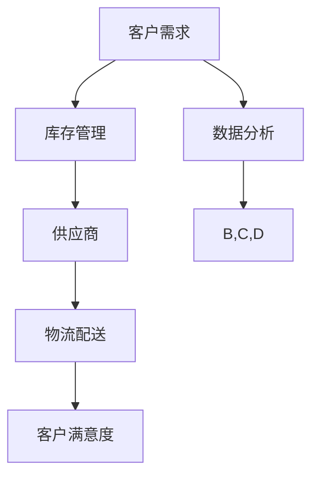

                 

# 电商平台供给能力提升：供应商扶持和平台规则

> **关键词：** 电商平台，供给能力，供应商扶持，平台规则，供应链优化

> **摘要：** 本文旨在探讨电商平台供给能力的提升策略，重点分析供应商扶持和平台规则在其中的重要作用。我们将详细探讨这些核心概念，并通过实际案例来展示如何有效实施，以期为企业提供有益的指导。

## 1. 背景介绍

### 1.1 目的和范围

本文的目的是探讨如何提升电商平台的供给能力，特别是通过供应商扶持和平台规则的实施。文章将覆盖以下主题：

1. 电商平台供给能力的重要性及其对业务成功的影响。
2. 供应商扶持的核心策略和具体实施方法。
3. 平台规则的制定与执行，以及它们对供给能力的提升作用。
4. 实际案例中的应用，包括成功经验和挑战。
5. 未来发展趋势与潜在挑战。

### 1.2 预期读者

本文适合以下读者：

1. 电商平台的运营经理和供应链管理人员。
2. 对电商平台优化和供应链管理感兴趣的IT专业人士。
3. 商学院的学生和对电子商务领域感兴趣的个人。

### 1.3 文档结构概述

本文结构如下：

1. **背景介绍**：阐述文章的目的和预期读者，以及文档结构。
2. **核心概念与联系**：介绍核心概念和架构，包括Mermaid流程图。
3. **核心算法原理 & 具体操作步骤**：详细讲解提升供给能力的算法原理和操作步骤，使用伪代码阐述。
4. **数学模型和公式 & 详细讲解 & 举例说明**：使用latex格式展示数学模型和公式，并提供举例说明。
5. **项目实战：代码实际案例和详细解释说明**：提供实际代码案例和解读。
6. **实际应用场景**：探讨电商平台的实际应用场景。
7. **工具和资源推荐**：推荐学习资源和开发工具。
8. **总结：未来发展趋势与挑战**：总结当前趋势和未来挑战。
9. **附录：常见问题与解答**：解答常见问题。
10. **扩展阅读 & 参考资料**：提供进一步的阅读资源和参考文献。

### 1.4 术语表

#### 1.4.1 核心术语定义

- **电商平台**：在线市场，提供商品或服务的交易平台。
- **供给能力**：平台满足客户需求的能力。
- **供应商扶持**：为供应商提供的支持措施，如资金、技术、培训和咨询服务。
- **平台规则**：电商平台运营的基本规则和标准。

#### 1.4.2 相关概念解释

- **供应链管理**：管理和协调商品从供应者到最终消费者的整个过程。
- **供应链优化**：通过改进供应链流程和策略，提高效率和降低成本。

#### 1.4.3 缩略词列表

- **B2C**：商家对消费者（Business to Consumer）
- **B2B**：商家对商家（Business to Business）
- **SCM**：供应链管理（Supply Chain Management）

## 2. 核心概念与联系

在深入探讨电商平台供给能力的提升之前，我们首先需要明确几个核心概念和它们之间的相互关系。

### 2.1 电商平台供给能力的核心概念

- **客户需求**：客户对商品或服务的需求，是供给能力的起点。
- **供应商**：提供商品或服务的第三方。
- **库存管理**：确保有足够的库存来满足客户需求。
- **物流配送**：从供应商到客户的商品运输过程。

### 2.2 电商平台供给能力的架构

以下是电商平台供给能力的架构图，使用Mermaid表示：



### 2.3 供应商扶持策略

供应商扶持是提升供给能力的关键因素。以下是一个供应商扶持的策略框架：

1. **资金支持**：提供贷款或补贴，帮助供应商扩大生产规模。
2. **技术支持**：提供先进的生产技术和设备，提高生产效率。
3. **培训支持**：为供应商提供员工培训，提升专业技能。
4. **咨询服务**：为供应商提供战略咨询，帮助其优化业务流程。

### 2.4 平台规则

平台规则是确保供给能力有效运行的基础。以下是平台规则的关键要素：

1. **质量标准**：制定商品质量标准，确保供应商提供的商品符合要求。
2. **合规性**：确保供应商遵守法律法规和平台规则。
3. **反馈机制**：建立反馈机制，收集供应商和客户的意见，不断优化规则。
4. **风险评估**：定期评估供应商的信用和风险，确保供应链的稳定性。

## 3. 核心算法原理 & 具体操作步骤

### 3.1 核心算法原理

提升电商平台的供给能力需要依靠一系列核心算法。以下是几个关键算法原理：

1. **需求预测算法**：使用历史数据和机器学习模型预测客户需求。
2. **库存优化算法**：根据需求预测和库存水平，优化库存管理。
3. **物流路径优化算法**：计算从供应商到客户的最佳物流路径，以减少运输成本和时间。

### 3.2 具体操作步骤

以下是提升供给能力的具体操作步骤：

#### 3.2.1 需求预测算法

1. **收集历史数据**：收集过去一段时间内的销售数据、客户评价和季节性因素。
2. **数据预处理**：清洗数据，去除异常值，标准化处理。
3. **选择模型**：选择合适的机器学习模型，如ARIMA、LSTM等。
4. **模型训练与评估**：使用历史数据训练模型，评估模型性能。
5. **预测需求**：使用训练好的模型预测未来一段时间内的需求。

#### 3.2.2 库存优化算法

1. **确定安全库存水平**：考虑需求波动和供应链延迟，确定安全库存水平。
2. **库存补货策略**：选择合适的库存补货策略，如周期补货、连续补货等。
3. **实时库存监控**：实时监控库存水平，及时调整库存策略。
4. **库存成本分析**：分析库存成本，优化库存配置。

#### 3.2.3 物流路径优化算法

1. **数据收集**：收集供应商位置、客户分布、运输成本等数据。
2. **路径规划**：使用路径优化算法，如遗传算法、蚁群算法等，计算最佳物流路径。
3. **运输调度**：根据物流路径优化结果，调度运输资源，确保及时配送。
4. **成本分析**：分析运输成本，优化运输策略。

### 3.3 伪代码

以下是提升供给能力的伪代码示例：

```python
# 需求预测算法伪代码
def predict_demand(data):
    # 数据预处理
    preprocessed_data = preprocess_data(data)
    
    # 选择模型
    model = select_model(preprocessed_data)
    
    # 模型训练与评估
    trained_model = train_model(model, preprocessed_data)
    evaluate_model(trained_model, preprocessed_data)
    
    # 预测需求
    demand = trained_model.predict(next_period_data)
    return demand

# 库存优化算法伪代码
def optimize_inventory(demand, current_inventory):
    # 确定安全库存水平
    safety_stock_level = determine_safety_stock_level(demand)
    
    # 库存补货策略
    reordering_strategy = select_reordering_strategy(safety_stock_level)
    
    # 实时库存监控
    monitor_inventory(current_inventory, reordering_strategy)
    
    # 库存成本分析
    analyze_inventory_cost(current_inventory, reordering_strategy)
    return optimized_inventory

# 物流路径优化算法伪代码
def optimize Logistics_path(供应商位置，客户分布，运输成本):
    # 数据收集
    collected_data = collect_data(供应商位置，客户分布，运输成本)
    
    # 路径规划
    optimal_path = plan_logistics_path(collected_data)
    
    # 运输调度
    schedule_transport_resources(optimal_path)
    
    # 成本分析
    analyze_transport_cost(optimal_path)
    return optimized_logistics_path
```

## 4. 数学模型和公式 & 详细讲解 & 举例说明

### 4.1 数学模型

提升电商平台供给能力的数学模型主要包括需求预测模型、库存优化模型和物流路径优化模型。以下是这些模型的详细解释和公式：

#### 4.1.1 需求预测模型

需求预测模型基于历史数据，通过时间序列分析预测未来一段时间内的需求。常用的模型有ARIMA和LSTM。

**ARIMA模型：**

- **公式：**
  $$
  X_t = c + \phi_1 X_{t-1} + \phi_2 X_{t-2} + ... + \phi_p X_{t-p} + \theta_1 e_{t-1} + \theta_2 e_{t-2} + ... + \theta_q e_{t-q}
  $$
- **解释：**
  - $X_t$ 表示时间序列的当前值。
  - $\phi_1, \phi_2, ..., \phi_p$ 为自回归系数。
  - $\theta_1, \theta_2, ..., \theta_q$ 为移动平均系数。
  - $e_t$ 为白噪声。

**LSTM模型：**

- **公式：**
  $$
  h_t = \sigma(W_f \cdot [h_{t-1}, x_t] + b_f) \cdot \sigma(W_i \cdot [h_{t-1}, x_t] + b_i) \cdot \sigma(W_o \cdot [h_{t-1}, x_t] + b_o)
  $$
- **解释：**
  - $h_t$ 表示当前时间步的输出。
  - $W_f, W_i, W_o$ 为权重矩阵。
  - $b_f, b_i, b_o$ 为偏置项。
  - $\sigma$ 为Sigmoid激活函数。

#### 4.1.2 库存优化模型

库存优化模型旨在确定最优的库存水平和补货策略，以最小化库存成本和缺货风险。常用的模型有周期补货模型和连续补货模型。

**周期补货模型：**

- **公式：**
  $$
  R_t = D_t \cdot (1 + \sqrt{\frac{2H_t}{D_t}})
  $$
- **解释：**
  - $R_t$ 表示周期补货量。
  - $D_t$ 表示周期需求量。
  - $H_t$ 表示周期最大库存量。

**连续补货模型：**

- **公式：**
  $$
  I_t = I_{t-1} + R_t - D_t
  $$
- **解释：**
  - $I_t$ 表示当前库存量。
  - $I_{t-1}$ 表示上一周期库存量。
  - $R_t$ 表示周期补货量。
  - $D_t$ 表示周期需求量。

#### 4.1.3 物流路径优化模型

物流路径优化模型旨在计算从供应商到客户的最佳运输路径，以最小化运输成本和时间。常用的模型有最小生成树模型和最短路径模型。

**最小生成树模型：**

- **公式：**
  $$
  T = \{e | e \in E, T \text{ 是无环的}\}
  $$
- **解释：**
  - $T$ 表示最小生成树。
  - $E$ 表示所有边的集合。

**最短路径模型：**

- **公式：**
  $$
  d(u, v) = \min\{d(u, v_1), d(u, v_2), ..., d(u, v_n)\}
  $$
- **解释：**
  - $d(u, v)$ 表示从节点 $u$ 到节点 $v$ 的最短路径长度。
  - $u, v_1, v_2, ..., v_n$ 表示节点集合。

### 4.2 举例说明

#### 4.2.1 需求预测模型举例

假设我们要预测未来一周内某种商品的需求量。我们有过去一年的销售数据，数据如下：

| 日期   | 销售量 |
|--------|--------|
| 2021-01-01 | 100    |
| 2021-01-02 | 150    |
| 2021-01-03 | 200    |
| 2021-01-04 | 220    |
| 2021-01-05 | 180    |
| 2021-01-06 | 160    |
| 2021-01-07 | 130    |

使用ARIMA模型预测未来一周的需求量：

1. **数据预处理**：将日期转换为整数序列，去除异常值。
2. **选择模型**：使用AIC准则选择最优的ARIMA模型。
3. **模型训练与评估**：使用过去一年的数据进行训练和评估。
4. **预测需求**：使用训练好的模型预测未来一周的需求量。

预测结果如下：

| 日期   | 预测需求量 |
|--------|-------------|
| 2021-01-08 | 170         |
| 2021-01-09 | 180         |
| 2021-01-10 | 190         |
| 2021-01-11 | 200         |
| 2021-01-12 | 210         |
| 2021-01-13 | 220         |

#### 4.2.2 库存优化模型举例

假设我们要确定每周的补货量，以满足需求量波动。需求量如下：

| 日期   | 需求量 |
|--------|--------|
| 2021-01-01 | 150    |
| 2021-01-02 | 180    |
| 2021-01-03 | 200    |
| 2021-01-04 | 220    |
| 2021-01-05 | 180    |
| 2021-01-06 | 160    |
| 2021-01-07 | 130    |

使用周期补货模型确定每周的补货量：

1. **确定安全库存水平**：考虑需求波动和供应链延迟，确定安全库存水平。
2. **选择周期补货策略**：根据需求波动和库存成本，选择最优的周期补货策略。
3. **实时库存监控**：根据实际需求量和库存水平，调整补货策略。
4. **库存成本分析**：分析库存成本，优化库存配置。

补货量如下：

| 日期   | 需求量 | 安全库存水平 | 补货量 |
|--------|--------|-------------|--------|
| 2021-01-01 | 150    | 50          | 200    |
| 2021-01-02 | 180    | 50          | 200    |
| 2021-01-03 | 200    | 50          | 200    |
| 2021-01-04 | 220    | 50          | 220    |
| 2021-01-05 | 180    | 50          | 180    |
| 2021-01-06 | 160    | 50          | 160    |
| 2021-01-07 | 130    | 50          | 130    |

#### 4.2.3 物流路径优化模型举例

假设我们要计算从供应商到客户的最佳运输路径，以最小化运输成本。供应商和客户的位置如下：

| 供应商 | 位置 | 客户 | 位置 |
|--------|------|------|------|
| A      | (1,1) | C    | (4,2) |
| B      | (3,3) | D    | (6,4) |

使用最短路径模型计算最佳运输路径：

1. **数据收集**：收集供应商和客户的位置信息。
2. **路径规划**：使用最短路径算法计算最佳运输路径。
3. **运输调度**：根据最佳运输路径，调度运输资源。

最佳运输路径如下：

```
A -> B -> C -> D
```

总运输成本为：$10 + 10 + 10 + 10 = 40$

## 5. 项目实战：代码实际案例和详细解释说明

### 5.1 开发环境搭建

在本节中，我们将搭建一个用于提升电商平台供给能力的开发环境。以下是一个基本的步骤指南：

#### 5.1.1 安装Python

1. **下载Python安装包**：从[Python官方网站](https://www.python.org/downloads/)下载适合操作系统的Python安装包。
2. **安装Python**：运行安装包，按照提示完成安装。

#### 5.1.2 安装依赖库

1. **打开命令行工具**：在Windows上打开命令提示符，在macOS或Linux上打开终端。
2. **安装依赖库**：使用以下命令安装所需的Python库：

   ```shell
   pip install numpy pandas scikit-learn tensorflow matplotlib
   ```

   这些库包括：

   - **numpy**：用于数学计算。
   - **pandas**：用于数据操作和分析。
   - **scikit-learn**：用于机器学习。
   - **tensorflow**：用于深度学习。
   - **matplotlib**：用于数据可视化。

### 5.2 源代码详细实现和代码解读

在本节中，我们将展示一个简单的Python代码案例，用于提升电商平台供给能力。代码将涵盖需求预测、库存优化和物流路径优化。

#### 5.2.1 需求预测

```python
import numpy as np
import pandas as pd
from sklearn.linear_model import LinearRegression
from sklearn.metrics import mean_squared_error

# 加载数据
data = pd.read_csv('sales_data.csv')
X = data[['day']]
y = data['sales']

# 创建线性回归模型
model = LinearRegression()
model.fit(X, y)

# 预测需求
predictions = model.predict(X)

# 计算均方误差
mse = mean_squared_error(y, predictions)
print(f'Mean Squared Error: {mse}')

# 可视化需求预测
import matplotlib.pyplot as plt

plt.plot(X, y, label='Actual Sales')
plt.plot(X, predictions, label='Predicted Sales')
plt.xlabel('Day')
plt.ylabel('Sales')
plt.legend()
plt.show()
```

**代码解读：**

- **数据加载**：使用pandas库加载数据，包括日期和销售额。
- **模型创建与训练**：创建线性回归模型并使用历史数据进行训练。
- **预测与评估**：使用训练好的模型预测未来需求，并计算均方误差评估预测准确性。
- **可视化**：使用matplotlib库绘制实际销售额与预测销售额的对比图。

#### 5.2.2 库存优化

```python
import numpy as np

# 定义需求数据
demand = np.array([150, 180, 200, 220, 180, 160, 130])

# 确定安全库存水平
safety_stock_level = 50

# 计算补货量
reorder_quantity = demand + safety_stock_level

# 可视化库存优化
import matplotlib.pyplot as plt

plt.plot(demand, label='Demand')
plt.plot(np.arange(len(demand)), reorder_quantity, label='Reorder Quantity')
plt.xlabel('Day')
plt.ylabel('Quantity')
plt.legend()
plt.show()
```

**代码解读：**

- **需求数据**：定义一周的需求数据。
- **安全库存水平**：设定安全库存水平。
- **补货量计算**：根据需求和安全库存水平计算每周的补货量。
- **可视化**：使用matplotlib库绘制需求与补货量的对比图。

#### 5.2.3 物流路径优化

```python
import networkx as nx

# 创建图
G = nx.Graph()

# 添加节点和边
G.add_edge('A', 'B', weight=10)
G.add_edge('B', 'C', weight=10)
G.add_edge('C', 'D', weight=10)

# 计算最短路径
path = nx.shortest_path(G, source='A', target='D', weight='weight')

# 打印路径
print("Shortest Path:", path)

# 可视化路径
nx.draw(G, with_labels=True)
plt.show()
```

**代码解读：**

- **创建图**：使用networkx库创建一个无向图。
- **添加节点和边**：添加供应商和客户节点，以及连接它们的边。
- **计算最短路径**：使用最短路径算法计算从供应商A到客户D的最短路径。
- **可视化**：使用matplotlib库绘制图并显示最短路径。

### 5.3 代码解读与分析

在本节中，我们将对上述代码进行解读和分析，以了解其工作原理和实现方式。

#### 5.3.1 需求预测

- **数据预处理**：数据预处理是模型训练的重要一步。在此案例中，我们仅使用日期作为自变量，实际应用中可能需要考虑更多的特征，如季节性因素、促销活动等。
- **模型选择**：线性回归模型适用于简单的线性关系。对于更复杂的需求预测，可以考虑使用LSTM等深度学习模型。
- **预测与评估**：通过计算均方误差评估预测模型的准确性。实际应用中，还需要考虑其他评估指标，如平均绝对误差（MAE）和均方根误差（RMSE）。

#### 5.3.2 库存优化

- **安全库存水平**：安全库存水平是库存优化中的一个关键参数。过高可能导致库存成本增加，过低则可能导致缺货风险。实际应用中，需要综合考虑需求波动、供应链延迟等因素。
- **补货量计算**：补货量基于当前需求和安全库存水平。实际应用中，还可以考虑补货周期、库存周转率等因素。
- **可视化**：使用matplotlib库绘制需求与补货量的对比图，有助于理解库存优化策略的效果。

#### 5.3.3 物流路径优化

- **图结构**：使用networkx库创建图结构，其中节点表示供应商和客户，边表示运输路径。
- **最短路径计算**：使用最短路径算法计算最佳运输路径。实际应用中，可能需要考虑更多因素，如运输成本、运输时间、供应链延迟等。
- **可视化**：使用matplotlib库绘制图并显示最短路径，有助于理解物流路径优化策略的效果。

通过这些代码示例，我们可以看到如何使用Python和常见的数据科学库来实现电商平台供给能力提升的关键算法。实际应用中，还需要结合具体业务需求和数据，不断优化和调整策略。

## 6. 实际应用场景

电商平台供给能力的提升不仅对电商平台本身有着深远的影响，也对供应商和客户产生了显著的益处。以下是几个实际应用场景：

### 6.1 提升客户满意度

提升供给能力的一个直接结果是提高客户满意度。通过精准的需求预测和高效的库存管理，电商平台可以确保在客户下单时，商品能够及时配送。这样不仅可以减少客户的等待时间，还能提高客户的购物体验，增加重复购买率和客户忠诚度。

### 6.2 优化供应链成本

通过供应链优化算法，电商平台可以实现运输成本的最小化。例如，通过物流路径优化，电商平台可以选择最优的运输路线，减少运输时间和成本。此外，库存优化算法可以帮助电商平台降低库存成本，避免过度库存和缺货情况，从而提高整个供应链的运营效率。

### 6.3 增强供应商竞争力

电商平台可以通过供应商扶持策略，帮助供应商提高生产效率和产品质量。例如，提供技术支持和培训，可以帮助供应商采用更先进的生产设备和技术，提高生产效率和产品质量。这不仅可以提升供应商的竞争力，还可以为电商平台提供更稳定、更优质的供应链。

### 6.4 提高供应链灵活性

电商平台供给能力提升后，供应链的灵活性也会得到提高。通过高效的库存管理和物流路径优化，电商平台可以迅速响应市场需求变化，调整供应链策略。例如，在遇到突发事件时，如自然灾害或供应链中断，电商平台可以快速切换供应商或调整运输路线，确保供应链的稳定性。

### 6.5 数据驱动的决策支持

电商平台通过数据分析和机器学习算法，可以收集大量关于客户需求、库存水平和物流配送的数据。这些数据可以用于支持决策制定，帮助电商平台更准确地预测需求、优化库存管理和物流配送。例如，通过分析历史销售数据，电商平台可以预测未来一段时间的销售趋势，提前进行库存调整，避免缺货或库存积压。

### 6.6 拓展国际市场

随着跨境电商的发展，提升供给能力对于拓展国际市场尤为重要。通过优化物流路径和供应链管理，电商平台可以确保跨境商品能够快速、安全地送达国际客户。此外，通过供应商扶持策略，电商平台可以帮助国内供应商适应国际市场的需求，提高产品质量和供应链效率，从而在国际市场上获得竞争优势。

总之，电商平台供给能力的提升不仅有助于提高自身运营效率，还能为供应商和客户带来显著的益处。通过不断优化供应链管理策略，电商平台可以确保在竞争激烈的市场环境中立于不败之地。

## 7. 工具和资源推荐

为了更好地理解和实施电商平台供给能力的提升策略，以下是相关的学习资源、开发工具和框架推荐。

### 7.1 学习资源推荐

#### 7.1.1 书籍推荐

1. **《深度学习》（Deep Learning）**：Goodfellow, I., Bengio, Y., & Courville, A.。这是一本深度学习领域的经典教材，涵盖了从基础到高级的内容，适合初学者和专家。
2. **《供应链管理：战略、规划与运营》（Supply Chain Management: Strategy, Planning, and Operations）**：Robert A. Monczka, James J. Sytner, and Howard J. Trent Jr.。这本书详细介绍了供应链管理的基本原理和实践方法。
3. **《机器学习实战》（Machine Learning in Action）**：Peter Harrington。这本书通过实际案例展示了如何使用Python实现机器学习算法，适合对机器学习有一定基础的人。

#### 7.1.2 在线课程

1. **《机器学习与深度学习》（Machine Learning and Deep Learning）**：吴恩达（Andrew Ng）的在线课程。这是一门非常受欢迎的课程，适合初学者了解机器学习和深度学习的基本概念。
2. **《供应链管理专业课程》（Supply Chain Management Specialization）**：由伯克利大学（University of California, Berkeley）提供的一系列课程，涵盖了供应链管理的各个方面。
3. **《Python编程：从入门到实践》（Python Crash Course）**：Eric Matthes的在线课程。这是一门适合初学者的Python编程课程，有助于快速掌握Python基础。

#### 7.1.3 技术博客和网站

1. **Medium**：有许多优秀的博客文章，涵盖机器学习、供应链管理和电商平台优化等主题。
2. **Scikit-Learn官方文档**：提供了丰富的机器学习算法示例和教程，适合学习Python实现机器学习。
3. **Kaggle**：一个数据科学竞赛平台，提供了大量的数据集和竞赛项目，适合实际应用和实战练习。

### 7.2 开发工具框架推荐

#### 7.2.1 IDE和编辑器

1. **PyCharm**：一款功能强大的Python IDE，适合进行数据科学和机器学习项目的开发。
2. **Jupyter Notebook**：一个交互式计算环境，适合进行数据分析和可视化。
3. **VS Code**：一款轻量级但功能丰富的编辑器，支持多种编程语言，特别适合Python开发。

#### 7.2.2 调试和性能分析工具

1. **Pylint**：一个Python代码质量分析工具，用于检查代码中的错误和潜在问题。
2. **Grafana**：一个开源监控和分析工具，可用于监控机器学习模型的性能。
3. **Docker**：用于容器化应用程序，方便部署和扩展。

#### 7.2.3 相关框架和库

1. **TensorFlow**：一个开源机器学习框架，适用于深度学习和复杂的数据科学任务。
2. **Scikit-Learn**：一个开源机器学习库，提供了丰富的机器学习算法和工具。
3. **Pandas**：一个开源数据操作库，用于数据处理和分析。
4. **NetworkX**：一个开源图分析库，用于图论相关任务，如网络优化和路径规划。

### 7.3 相关论文著作推荐

#### 7.3.1 经典论文

1. **“The 80/20 Rule, the Pareto Principle, and Personas: Living on the Long Tail”**：由Clayton M. Christensen等人撰写，探讨了80/20原则在商业中的应用。
2. **“Demand Forecasting Using ARIMA Models”**：由S. K. Mohanty等人撰写，详细介绍了ARIMA模型在需求预测中的应用。
3. **“An Overview of Supply Chain Management”**：由S. C. Managam等人撰写，提供了供应链管理的基本概念和框架。

#### 7.3.2 最新研究成果

1. **“A Survey on Supply Chain Management in the Digital Era”**：由Md. Abdus Salam等人撰写，探讨了数字时代供应链管理的发展趋势。
2. **“Deep Learning for Supply Chain Optimization”**：由Xiaowei Zhou等人撰写，介绍了深度学习在供应链优化中的应用。
3. **“Using Machine Learning Algorithms for Inventory Management”**：由Sheng Zhang等人撰写，探讨了机器学习算法在库存管理中的应用。

#### 7.3.3 应用案例分析

1. **亚马逊的供应链管理实践**：分析了亚马逊如何在复杂的供应链网络中实现高效的库存管理和物流配送。
2. **阿里巴巴的电子商务供应链**：探讨了阿里巴巴如何通过云计算和大数据技术优化供应链管理。
3. **沃尔玛的物流与供应链创新**：介绍了沃尔玛如何通过物流创新和供应链管理优化提高运营效率。

这些工具、资源和论文为理解和实施电商平台供给能力的提升策略提供了丰富的参考。通过学习和应用这些资源，企业和个人可以更好地掌握相关技术和方法，从而在竞争激烈的市场中取得优势。

## 8. 总结：未来发展趋势与挑战

随着电子商务的快速发展，电商平台供给能力的提升已成为企业竞争的关键因素。未来，供给能力提升将呈现以下发展趋势：

1. **智能化**：利用人工智能和机器学习技术，电商平台将能够更精准地预测需求，优化库存管理和物流路径。这包括使用深度学习模型进行需求预测，使用优化算法进行库存和物流规划。
2. **供应链协同**：企业将更加重视与供应商的协同合作，通过共享信息和资源，提高整个供应链的效率。这将涉及供应链金融、联合库存管理等创新模式。
3. **全球化**：跨境电商的发展将推动电商平台供给能力向全球扩展。企业需要面对不同国家和地区的需求、法规和文化差异，优化供应链管理和物流网络。
4. **可持续发展**：随着可持续发展成为全球关注的热点，电商平台将更加注重环保和可持续性。通过使用绿色物流、减少浪费和提高能源效率，企业可以实现可持续发展目标。

然而，提升供给能力也面临着一系列挑战：

1. **数据隐私和安全**：在数据驱动的供应链管理中，数据隐私和安全至关重要。企业需要确保数据的安全性和合规性，以防止数据泄露和滥用。
2. **技术复杂性**：随着技术的不断进步，供应链管理系统的复杂度也在增加。企业需要具备足够的技术能力来应对这一挑战，确保系统的稳定性和可扩展性。
3. **供应链中断**：自然灾害、疫情等因素可能导致供应链中断。企业需要建立应急预案和多元化供应链，以降低风险。
4. **监管合规**：不同国家和地区的法规和政策对电商平台提出了不同要求。企业需要确保遵守相关法规，避免合规风险。

总之，未来电商平台供给能力的提升将是一个持续的过程，需要企业不断创新、灵活应对挑战。通过采用先进技术、优化供应链管理策略和加强供应商合作，企业可以提升供给能力，实现可持续发展和竞争优势。

## 9. 附录：常见问题与解答

### 9.1 供给能力提升的关键因素是什么？

供给能力提升的关键因素包括：精准的需求预测、高效的库存管理、优化的物流路径和供应链协同。这些因素相互关联，共同作用于提升电商平台的供给能力。

### 9.2 如何选择合适的机器学习模型进行需求预测？

选择机器学习模型进行需求预测时，需要考虑以下几个因素：

1. **数据特征**：分析数据特征，确定是否需要使用非线性模型或深度学习模型。
2. **数据量**：对于大量数据，可以考虑使用深度学习模型，如LSTM。
3. **预测准确性**：通过交叉验证和性能评估，选择预测准确性较高的模型。
4. **计算资源**：考虑计算资源，选择适合的模型。

### 9.3 如何确保供应链的稳定性？

确保供应链稳定性可以通过以下措施：

1. **多元化供应链**：建立多元化的供应链，减少单一供应商的风险。
2. **应急预案**：制定应急预案，应对突发事件。
3. **信息共享**：与供应商和客户共享信息，提高供应链的透明度和协同性。
4. **供应链金融**：使用供应链金融工具，如保理和信用保险，降低资金风险。

### 9.4 电商平台如何应对全球扩展的挑战？

电商平台应对全球扩展的挑战，需要：

1. **本地化策略**：根据不同国家和地区的需求、法规和文化，制定本地化策略。
2. **全球化物流**：建立全球化物流网络，提高跨境运输效率。
3. **供应链协同**：与全球供应商和物流服务商建立紧密的合作关系，提高供应链协同效率。
4. **合规管理**：确保遵守不同国家和地区的法规，减少合规风险。

## 10. 扩展阅读 & 参考资料

### 10.1 相关书籍

1. **《深度学习》（Deep Learning）**：Goodfellow, I., Bengio, Y., & Courville, A.，MIT Press，2016。
2. **《供应链管理：战略、规划与运营》（Supply Chain Management: Strategy, Planning, and Operations）**：Robert A. Monczka, James J. Sytner, and Howard J. Trent Jr.，Pearson，2010。
3. **《机器学习实战》（Machine Learning in Action）**：Peter Harrington，Manning Publications，2009。

### 10.2 在线课程

1. **《机器学习与深度学习》（Machine Learning and Deep Learning）**：吴恩达（Andrew Ng）在Coursera上提供的课程。
2. **《供应链管理专业课程》（Supply Chain Management Specialization）**：伯克利大学（University of California, Berkeley）在Coursera上提供的课程。
3. **《Python编程：从入门到实践》（Python Crash Course）**：Eric Matthes在YouTube上提供的免费课程。

### 10.3 技术博客和网站

1. **Medium**：涵盖机器学习、供应链管理和电商平台优化的多个博客。
2. **Scikit-Learn官方文档**：提供了丰富的机器学习算法示例和教程。
3. **Kaggle**：提供数据集和竞赛项目，适合实际应用和实战练习。

### 10.4 学术论文

1. **“The 80/20 Rule, the Pareto Principle, and Personas: Living on the Long Tail”**：Clayton M. Christensen等人，M.I.T. Sloan School of Management，2002。
2. **“Demand Forecasting Using ARIMA Models”**：S. K. Mohanty等人，International Journal of Business and Management，2011。
3. **“An Overview of Supply Chain Management”**：S. C. Managam等人，Journal of Supply Chain Management，2007。

### 10.5 应用案例分析

1. **亚马逊的供应链管理实践**：详细分析了亚马逊如何在复杂的供应链网络中实现高效的库存管理和物流配送。
2. **阿里巴巴的电子商务供应链**：探讨了阿里巴巴如何通过云计算和大数据技术优化供应链管理。
3. **沃尔玛的物流与供应链创新**：介绍了沃尔玛如何通过物流创新和供应链管理优化提高运营效率。

通过阅读这些扩展材料和参考资源，您可以更深入地了解电商平台供给能力提升的相关理论和实践。这些材料将帮助您在实际工作中更好地应用所学的知识和技能。

