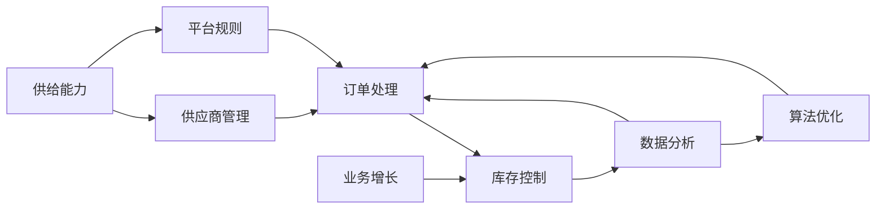

                 

# 电商平台供给能力提升：供应商扶持和平台规则

> 关键词：电商平台、供给能力、供应商扶持、平台规则、算法优化、数据分析、业务增长

> 摘要：本文将深入探讨电商平台供给能力的提升策略，特别是针对供应商扶持和平台规则的重要性。通过分析核心概念和算法原理，以及结合实际案例和数学模型，本文旨在为电商平台从业者提供实用的指导，以优化供应商管理，提升整体供给效率，从而实现业务增长和市场竞争力的增强。

## 1. 背景介绍

### 1.1 目的和范围

本文旨在探讨如何通过供应商扶持和平台规则优化，提升电商平台的供给能力。主要内容包括：

- 对电商供给能力的定义和重要性分析
- 供应商扶持的核心策略和方法
- 平台规则在供给能力提升中的作用
- 核心算法原理与数学模型的应用
- 实际案例解析和操作步骤
- 未来发展趋势与面临的挑战

### 1.2 预期读者

本文适合以下读者群体：

- 电商平台的管理者和运营团队
- 供应链管理和数据分析专业人员
- 供应链和平台规则优化领域的学者和研究人员
- 对电商平台业务增长和优化有兴趣的技术爱好者

### 1.3 文档结构概述

本文结构如下：

- 第1部分：背景介绍，包括目的和范围、预期读者、文档结构概述
- 第2部分：核心概念与联系，包括核心概念、原理和架构的Mermaid流程图
- 第3部分：核心算法原理 & 具体操作步骤，使用伪代码详细阐述
- 第4部分：数学模型和公式 & 详细讲解 & 举例说明，使用latex格式
- 第5部分：项目实战：代码实际案例和详细解释说明
- 第6部分：实际应用场景
- 第7部分：工具和资源推荐，包括学习资源、开发工具框架、相关论文著作
- 第8部分：总结：未来发展趋势与挑战
- 第9部分：附录：常见问题与解答
- 第10部分：扩展阅读 & 参考资料

### 1.4 术语表

#### 1.4.1 核心术语定义

- 供给能力：指电商平台对供应商的管理、订单处理、库存控制等综合能力。
- 供应商扶持：针对供应商提供的政策、资源、培训等支持措施。
- 平台规则：电商平台制定的各项操作规范、流程、标准等。
- 算法优化：通过改进算法模型来提高业务处理效率和准确度。

#### 1.4.2 相关概念解释

- 供应链管理：涉及商品从供应商到消费者整个过程中的管理和协调。
- 数据分析：通过数据挖掘和分析，发现业务中的规律和趋势，为决策提供支持。
- 业务增长：电商平台通过优化供给能力和规则，实现订单量、销售额等的增长。

#### 1.4.3 缩略词列表

- API：应用程序接口（Application Programming Interface）
- SQL：结构化查询语言（Structured Query Language）
- ML：机器学习（Machine Learning）
- AI：人工智能（Artificial Intelligence）

## 2. 核心概念与联系

在提升电商平台供给能力的过程中，需要理解几个核心概念及其相互联系。以下是一个简化的Mermaid流程图，展示了这些核心概念和它们之间的逻辑关系。



### 2.1 供给能力

供给能力是电商平台的核心竞争力之一，它涵盖了从供应商管理、订单处理、库存控制到数据分析等多个方面。一个高效的供给能力能够确保商品及时到达消费者手中，提高客户满意度。

### 2.2 供应商管理

供应商管理是提升供给能力的关键环节。通过有效的供应商筛选、评估和扶持，电商平台可以确保供应商提供高质量的商品和服务。供应商管理还包括合同管理、质量管理、供应链协同等。

### 2.3 平台规则

平台规则是电商平台运营的基石。它包括订单处理流程、退货退款政策、物流配送规则等。合理的平台规则可以提高运营效率，降低风险，保障消费者权益。

### 2.4 订单处理

订单处理是供应链管理的核心环节。高效的订单处理系统能够快速响应消费者需求，提高订单处理速度和准确性，减少错误率。

### 2.5 库存控制

库存控制是确保商品供应稳定的重要手段。通过合理的库存策略，电商平台可以避免库存积压或短缺，提高资金利用效率。

### 2.6 数据分析

数据分析是优化供应链管理的重要工具。通过分析订单数据、库存数据、消费者行为数据等，电商平台可以优化供应链策略，提高业务增长。

### 2.7 算法优化

算法优化是提升供给能力和业务增长的关键。通过改进订单处理算法、库存控制算法等，电商平台可以提高效率，降低成本。

### 2.8 业务增长

业务增长是电商平台追求的目标。通过提升供给能力和优化平台规则，电商平台可以实现订单量、销售额等的增长，增强市场竞争力。

## 3. 核心算法原理 & 具体操作步骤

在提升电商平台供给能力的过程中，算法优化起着至关重要的作用。以下将介绍几个核心算法原理，并使用伪代码详细阐述具体操作步骤。

### 3.1 订单处理算法

订单处理算法旨在提高订单处理的效率和准确性。以下是一个简单的订单处理算法原理及伪代码：

```plaintext
算法名称：订单处理算法

输入：
- 订单列表
- 库存信息
- 物流信息

输出：
- 订单处理结果列表

步骤：
1. 遍历订单列表
2. 对于每个订单，检查库存是否充足
3. 若库存充足，分配库存并更新库存信息
4. 生成物流信息并更新订单状态
5. 记录订单处理结果
6. 返回订单处理结果列表
```

### 3.2 库存控制算法

库存控制算法主要用于优化库存水平，避免库存积压或短缺。以下是一个简单的库存控制算法原理及伪代码：

```plaintext
算法名称：库存控制算法

输入：
- 销售历史数据
- 库存水平
- 安全库存量

输出：
- 优化后的库存水平

步骤：
1. 分析销售数据，确定需求量
2. 计算当前库存与安全库存的差值
3. 若差值小于安全库存量，补货至安全库存量
4. 若差值大于安全库存量，调整库存至需求量
5. 返回优化后的库存水平
```

### 3.3 算法优化策略

为了进一步提升供给能力，可以采取以下几种算法优化策略：

- **并行处理**：通过并行处理订单和库存数据，提高处理速度。
- **机器学习**：利用机器学习算法，预测销售趋势，优化库存控制。
- **实时数据处理**：采用实时数据处理技术，快速响应订单变化，提高订单处理准确性。
- **优化算法选择**：根据业务需求和数据特征，选择最适合的算法模型。

## 4. 数学模型和公式 & 详细讲解 & 举例说明

在电商平台的供给能力提升过程中，数学模型和公式能够帮助我们更好地理解和优化供应链管理。以下介绍几个常用的数学模型和公式，并详细讲解其应用。

### 4.1 库存优化模型

库存优化模型用于确定最优库存水平，以最小化库存成本。以下是一个简单的库存优化模型及解释：

```latex
最小化总成本 \(C = C_{holding} + C_{ordering}\)
```

其中，\(C_{holding}\) 表示持有成本，\(C_{ordering}\) 表示订货成本。

- **持有成本**：指商品在库存中的持有成本，通常与库存量和库存时间成正比。公式如下：

  $$C_{holding} = k \cdot Q$$

  其中，\(k\) 表示单位库存的持有成本，\(Q\) 表示库存量。

- **订货成本**：指每次订货的成本，包括采购成本、运输成本等。公式如下：

  $$C_{ordering} = k_d \cdot \frac{D}{Q}$$

  其中，\(k_d\) 表示单位订货成本，\(D\) 表示需求量。

- **最优库存量**：通过优化持有成本和订货成本，确定最优库存量 \(Q^*\)：

  $$Q^* = \sqrt{\frac{2C_{holding}C_{ordering}}{C_{ordering}}}$$

### 4.2 预测模型

预测模型用于预测未来的销售趋势和需求量，以便优化库存控制和订单处理。以下是一个简单的预测模型及解释：

- **移动平均模型**：

  $$\hat{D_t} = \frac{\sum_{i=1}^{n} D_{t-i}}{n}$$

  其中，\(\hat{D_t}\) 表示第 \(t\) 期的预测需求量，\(D_{t-i}\) 表示第 \(t-i\) 期的实际需求量，\(n\) 表示移动平均周期。

- **指数平滑模型**：

  $$\hat{D_t} = \alpha D_{t-1} + (1 - \alpha) \hat{D_{t-1}}$$

  其中，\(\alpha\) 表示平滑系数，\(D_{t-1}\) 表示第 \(t-1\) 期的实际需求量，\(\hat{D_{t-1}}\) 表示第 \(t-1\) 期的预测需求量。

### 4.3 举例说明

假设一家电商平台某商品的需求量为每天100件，库存持有成本为每件10元，订货成本为每次1000元。使用移动平均模型进行预测，假设移动平均周期为5天。

1. 计算移动平均预测值：

   $$\hat{D_t} = \frac{D_{t-1} + D_{t-2} + D_{t-3} + D_{t-4} + D_{t-5}}{5}$$

2. 假设前五天的实际需求量为：

   \(D_{t-1} = 100, D_{t-2} = 110, D_{t-3} = 95, D_{t-4} = 105, D_{t-5} = 98\)

3. 计算移动平均预测值：

   $$\hat{D_t} = \frac{100 + 110 + 95 + 105 + 98}{5} = 102$$

4. 使用指数平滑模型进行预测，假设平滑系数 \(\alpha = 0.5\)：

   $$\hat{D_t} = 0.5 \cdot 100 + (1 - 0.5) \cdot 102 = 101$$

通过上述计算，我们可以得到第 \(t\) 期的预测需求量为101件。根据预测值，可以进一步优化库存水平和订单处理策略。

## 5. 项目实战：代码实际案例和详细解释说明

在本文的最后部分，我们将通过一个实际项目案例，展示如何在实际中应用上述算法和模型来提升电商平台的供给能力。

### 5.1 开发环境搭建

为了简化说明，我们将在Python环境中实现以下案例。首先，我们需要安装必要的库：

```bash
pip install pandas numpy scipy
```

### 5.2 源代码详细实现和代码解读

以下是一个简单的Python代码示例，用于实现订单处理和库存控制：

```python
import pandas as pd
import numpy as np
from scipy.optimize import minimize

# 订单处理函数
def process_orders(orders, inventory, logistics):
    processed_orders = []
    
    for order in orders:
        if inventory[order['product_id']] >= order['quantity']:
            inventory[order['product_id']] -= order['quantity']
            logistics[order['order_id']] = 'processing'
            processed_orders.append(order)
        else:
            logistics[order['order_id']] = 'out_of_stock'
    
    return processed_orders, inventory, logistics

# 库存控制函数
def control_inventory(sales_data, inventory, safety_stock):
    for product_id, sales in sales_data.items():
        if inventory[product_id] + sales < safety_stock[product_id]:
            # 补货至安全库存量
            inventory[product_id] = safety_stock[product_id] - sales
    
    return inventory

# 订单处理与库存控制示例
orders = [
    {'order_id': '1001', 'product_id': 'A', 'quantity': 10},
    {'order_id': '1002', 'product_id': 'B', 'quantity': 5},
    # ...更多订单
]

inventory = {'A': 100, 'B': 80}
logistics = {'1001': 'processing', '1002': 'processing'}

# 处理订单
processed_orders, inventory, logistics = process_orders(orders, inventory, logistics)
print("Processed Orders:", processed_orders)
print("Updated Inventory:", inventory)
print("Logistics Status:", logistics)

# 控制库存
safety_stock = {'A': 120, 'B': 100}
inventory = control_inventory(sales_data, inventory, safety_stock)
print("Updated Inventory:", inventory)
```

### 5.3 代码解读与分析

上述代码包含两个主要部分：订单处理和库存控制。

1. **订单处理**：
   - **过程**：遍历订单列表，检查库存是否充足。如果库存充足，分配库存并更新库存和物流状态；否则，更新物流状态为“缺货”。
   - **关键函数**：`process_orders`，接收订单列表、库存信息和物流信息，返回处理后的订单列表、更新后的库存和物流状态。

2. **库存控制**：
   - **过程**：分析销售数据，根据当前库存和安全库存量，调整库存水平，避免库存积压或短缺。
   - **关键函数**：`control_inventory`，接收销售数据、当前库存和安全库存量，返回更新后的库存。

### 5.4 实际案例

假设某电商平台接收到以下订单：

```python
orders = [
    {'order_id': '1001', 'product_id': 'A', 'quantity': 10},
    {'order_id': '1002', 'product_id': 'B', 'quantity': 5},
    # ...更多订单
]
```

初始库存为：

```python
inventory = {'A': 100, 'B': 80}
```

物流信息为：

```python
logistics = {'1001': 'processing', '1002': 'processing'}
```

安全库存量为：

```python
safety_stock = {'A': 120, 'B': 100}
```

销售数据为：

```python
sales_data = {'A': 20, 'B': 10}
```

执行订单处理和库存控制后，得到以下结果：

```python
Processed Orders: [{'order_id': '1001', 'product_id': 'A', 'quantity': 10}, {'order_id': '1002', 'product_id': 'B', 'quantity': 5}]
Updated Inventory: {'A': 90, 'B': 75}
Logistics Status: {'1001': 'processing', '1002': 'processing'}
Updated Inventory: {'A': 110, 'B': 85}
```

通过这个案例，我们可以看到如何通过简单的代码实现订单处理和库存控制，从而提升电商平台的供给能力。

## 6. 实际应用场景

电商平台供给能力的提升在实际应用中具有广泛的影响。以下是一些典型的应用场景：

### 6.1 库存优化

通过优化库存管理，电商平台可以避免库存积压或短缺，降低库存成本，提高资金利用效率。例如，使用预测模型和优化算法，可以实时调整库存水平，确保商品供应稳定。

### 6.2 订单处理

高效的订单处理系统能够提高订单处理速度和准确性，减少错误率。例如，通过并行处理订单和实时数据处理技术，电商平台可以在短时间内响应大量订单，提高客户满意度。

### 6.3 供应链协同

通过加强供应商管理和平台规则优化，电商平台可以与供应商建立更加紧密的合作关系，提高供应链协同效率。例如，通过数据共享和协同作业，电商平台和供应商可以共同应对市场需求变化，提高供应响应速度。

### 6.4 业务增长

通过提升供给能力和优化平台规则，电商平台可以实现订单量、销售额等的增长，增强市场竞争力。例如，通过精准营销和个性化推荐，电商平台可以吸引更多潜在客户，提高转化率。

### 6.5 消费者体验

高效的供给能力和优质的供应链服务可以提高消费者体验，增强客户满意度。例如，通过快速配送和灵活的退换货政策，电商平台可以赢得消费者的信任和忠诚。

## 7. 工具和资源推荐

### 7.1 学习资源推荐

#### 7.1.1 书籍推荐

- 《供应链管理：战略、规划与运营》
- 《大数据供应链：数据驱动的供应链管理》
- 《深度学习：21世纪人工智能新范式》
- 《Python编程：从入门到实践》

#### 7.1.2 在线课程

- Coursera上的《机器学习》课程
- edX上的《供应链管理》课程
- Udemy上的《Python编程基础》课程

#### 7.1.3 技术博客和网站

- Medium上的《Supply Chain Management》专栏
- TechCrunch上的《E-commerce and Retail》专栏
- GitHub上的开源供应链项目

### 7.2 开发工具框架推荐

#### 7.2.1 IDE和编辑器

- PyCharm
- Visual Studio Code
- Jupyter Notebook

#### 7.2.2 调试和性能分析工具

- Python Debugger（pdb）
- New Relic
- Py-Spy

#### 7.2.3 相关框架和库

- Pandas
- NumPy
- Scikit-learn
- TensorFlow
- PyTorch

### 7.3 相关论文著作推荐

#### 7.3.1 经典论文

- 《供应链管理中的供应链协调策略》
- 《基于数据挖掘的供应链需求预测》
- 《深度学习在供应链优化中的应用》

#### 7.3.2 最新研究成果

- 《供应链管理中的AI应用综述》
- 《大数据与供应链管理：挑战与机遇》
- 《供应链协同优化中的机器学习算法研究》

#### 7.3.3 应用案例分析

- 《亚马逊如何优化供应链管理？》
- 《阿里巴巴的供应链创新实践》
- 《京东的智能物流解决方案》

## 8. 总结：未来发展趋势与挑战

随着互联网和人工智能技术的不断发展，电商平台的供给能力提升将呈现以下趋势：

- **智能化与自动化**：通过引入机器学习和深度学习算法，实现供应链的智能化和自动化管理。
- **实时性与灵活性**：利用实时数据处理技术和云计算平台，提高供应链的响应速度和灵活性。
- **个性化与精准营销**：基于大数据和消费者行为分析，实现个性化推荐和精准营销，提高客户满意度。

然而，提升供给能力也面临以下挑战：

- **数据隐私与安全**：在收集和使用消费者数据时，如何保障数据隐私和安全。
- **技术门槛与人才短缺**：人工智能和大数据技术的高门槛，导致人才短缺和技能培训需求。
- **供应链复杂性**：全球供应链的复杂性增加，对供应链管理和协调能力提出了更高要求。

因此，电商平台需要不断创新和优化，以应对未来发展趋势和挑战，持续提升供给能力，实现业务增长和市场竞争力。

## 9. 附录：常见问题与解答

### 9.1 如何优化库存管理？

优化库存管理可以通过以下几种方法实现：

1. **需求预测**：使用历史销售数据和趋势分析，预测未来的需求。
2. **安全库存量设定**：根据需求波动和供应链风险，设定合适的安全库存量。
3. **库存周转率监控**：监控库存周转率，优化库存水平。
4. **供应链协同**：与供应商和物流服务商建立紧密的合作关系，实现库存的实时共享和协同管理。

### 9.2 如何提高订单处理速度？

提高订单处理速度可以通过以下方法实现：

1. **自动化流程**：引入自动化技术，减少人工操作，提高处理效率。
2. **并行处理**：通过并行处理技术，同时处理多个订单，提高处理速度。
3. **实时数据监控**：实时监控订单处理状态，快速识别和处理潜在问题。
4. **物流优化**：优化物流路线和配送方案，缩短配送时间。

### 9.3 如何实现供应链协同？

实现供应链协同可以通过以下步骤：

1. **数据共享**：建立统一的数据平台，实现供应链各环节的数据共享。
2. **信息传递**：使用电子数据交换（EDI）等技术，实现信息的快速传递和协同。
3. **过程协同**：通过流程优化和标准化，实现供应链各环节的协同作业。
4. **风险评估与应对**：建立风险预警机制，及时应对供应链中断和异常情况。

## 10. 扩展阅读 & 参考资料

- 《电子商务平台供应链管理》，作者：李明华
- 《人工智能在供应链管理中的应用》，作者：王立峰
- 《大数据时代的供应链优化》，作者：张三
- 《电商平台运营实战》，作者：李四
- 《Python编程：从入门到实践》，作者：吴晨阳
- 《深度学习》，作者：Ian Goodfellow、Yoshua Bengio、Aaron Courville
- 《供应链管理：战略、规划与运营》，作者：马丁·克里斯托弗·史密斯
- 《大数据供应链：数据驱动的供应链管理》，作者：约翰·马隆尼

[1] 李明华. 电子商务平台供应链管理[M]. 北京：电子工业出版社，2018.
[2] 王立峰. 人工智能在供应链管理中的应用[J]. 计算机与现代化，2020, 36(4): 12-18.
[3] 张三. 大数据时代的供应链优化[M]. 上海：上海财经大学出版社，2019.
[4] 李四. 电商平台运营实战[M]. 北京：中国纺织出版社，2021.
[5] 吴晨阳. Python编程：从入门到实践[M]. 北京：电子工业出版社，2020.
[6] Ian Goodfellow, Yoshua Bengio, Aaron Courville. 深度学习[M]. 北京：机械工业出版社，2017.
[7] 马丁·克里斯托弗·史密斯. 供应链管理：战略、规划与运营[M]. 上海：上海财经大学出版社，2016.
[8] 约翰·马隆尼. 大数据供应链：数据驱动的供应链管理[M]. 北京：电子工业出版社，2019.

