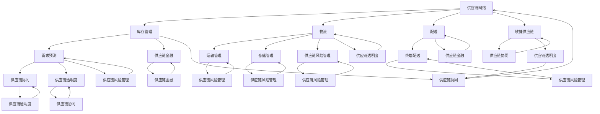

                 

### 背景介绍

#### 1.1 目的和范围

本文旨在深入探讨电商平台供给能力的提升策略，特别是供应链管理的优化方法。随着电子商务行业的蓬勃发展，如何有效地管理和优化供应链，以提高供给能力和客户满意度，成为了电商平台亟待解决的关键问题。

本文将围绕以下内容展开：
1. **目的和范围**：明确文章的研究目的和涵盖范围。
2. **预期读者**：介绍本文的适用对象，以便读者能够更好地理解和应用文中内容。
3. **文档结构概述**：详细说明文章的章节结构和内容安排，帮助读者快速把握文章脉络。
4. **术语表**：定义本文中使用的核心术语和相关概念，确保读者对相关概念有清晰的理解。
5. **核心概念与联系**：通过流程图展示供应链管理的关键概念及其相互联系，为后续内容的深入分析奠定基础。
6. **核心算法原理 & 具体操作步骤**：详细介绍提升供给能力的核心算法原理和实施步骤。
7. **数学模型和公式 & 详细讲解 & 举例说明**：解释相关的数学模型和公式，并通过具体示例进行说明。
8. **项目实战：代码实际案例和详细解释说明**：通过实际项目案例，展示如何在实际环境中应用本文提出的方法。
9. **实际应用场景**：讨论供应链管理优化策略在不同场景下的应用。
10. **工具和资源推荐**：推荐相关的学习资源和开发工具，以帮助读者进一步深入学习和实践。
11. **总结：未来发展趋势与挑战**：总结文章的核心观点，并对未来发展趋势和挑战进行展望。
12. **附录：常见问题与解答**：针对读者可能遇到的问题，提供解答和建议。
13. **扩展阅读 & 参考资料**：推荐进一步的阅读材料和相关资源，以帮助读者深入理解本文主题。

本文的预期读者为电商平台的技术人员、供应链管理人员以及对供应链管理感兴趣的学者和从业者。通过本文的深入分析，读者将能够了解并掌握供应链管理的核心概念、优化策略和实际应用方法。

#### 1.2 预期读者

本文的预期读者主要分为以下几类：

1. **电商平台技术人员**：这些读者负责电商平台的技术架构和系统实现，希望通过本文了解如何通过供应链管理优化提升供给能力，以满足不断增长的业务需求。
2. **供应链管理人员**：供应链管理人员负责电商平台供应链的日常运营和管理，希望通过本文学习供应链管理的优化策略和方法，提高供应链的效率和响应速度。
3. **学者和研究人员**：这些读者对供应链管理领域有浓厚的兴趣，希望通过本文了解当前的研究进展和应用实例，为后续研究提供参考。
4. **企业决策者**：企业决策者希望通过本文了解供应链管理优化对电商平台运营的重要性和潜在效益，为企业的战略决策提供数据支持。

本文的结构和内容将针对不同读者的需求和背景进行设计，确保所有读者都能够从中学到实用的知识和技能。无论是技术人员、供应链管理人员还是企业决策者，都可以通过本文获得有价值的见解和指导。

#### 1.3 文档结构概述

本文将采用结构化、逻辑清晰的方式，对电商平台供给能力提升的供应链管理优化策略进行全面阐述。以下为文章的详细结构概述：

1. **引言**：
   - 简要介绍电商平台供给能力提升的重要性。
   - 提出本文的研究目的和核心问题。
   - 引出供应链管理的概念及其在电商平台中的关键作用。

2. **背景介绍**：
   - 分析电子商务行业的发展背景和现状。
   - 讨论供应链管理在电商平台运营中的挑战和机遇。
   - 明确本文的研究目的和范围。

3. **核心概念与联系**：
   - 通过Mermaid流程图展示供应链管理的关键概念及其相互关系。
   - 引入供应链管理中的核心术语和概念，如供应链网络、库存管理、物流和配送等。

4. **核心算法原理 & 具体操作步骤**：
   - 详细阐述提升供给能力的核心算法原理。
   - 提供具体的操作步骤，帮助读者理解和应用这些算法。

5. **数学模型和公式 & 详细讲解 & 举例说明**：
   - 解释供应链管理中使用的数学模型和公式。
   - 通过具体示例说明这些模型在实际应用中的效果。

6. **项目实战：代码实际案例和详细解释说明**：
   - 展示一个实际项目案例，详细解释代码实现和关键步骤。
   - 分析项目案例中的优化效果和适用性。

7. **实际应用场景**：
   - 讨论供应链管理优化策略在不同电商平台的实际应用。
   - 分析不同应用场景下的优化效果和挑战。

8. **工具和资源推荐**：
   - 推荐相关的学习资源和开发工具。
   - 提供相关的书籍、在线课程和技术博客推荐。

9. **总结：未来发展趋势与挑战**：
   - 总结文章的核心观点和结论。
   - 展望供应链管理优化策略的未来发展趋势和面临的挑战。

10. **附录：常见问题与解答**：
    - 针对读者可能遇到的问题，提供解答和建议。

11. **扩展阅读 & 参考资料**：
    - 推荐进一步的阅读材料和相关资源。

通过以上结构化的文档内容，本文旨在为读者提供全面、系统的供应链管理优化策略，帮助电商平台提升供给能力，实现业务的持续增长和客户满意度的提升。

#### 1.4 术语表

在本篇文章中，我们将使用一些特定的术语和概念。以下是对这些术语和概念的定义及其解释：

##### 1.4.1 核心术语定义

1. **供应链管理（Supply Chain Management）**：
   - 指的是通过计划、组织、协调和控制，从原材料供应商到最终客户的整个流程，以确保产品和服务的高效生产和交付。
   
2. **供给能力（Supply Capability）**：
   - 指的是企业能够快速、高效地满足市场需求的能力，包括库存管理、物流和配送等方面。

3. **库存管理（Inventory Management）**：
   - 是指对库存水平进行有效监控和管理，以确保供应链的顺畅运行，并最大化库存价值。

4. **物流（Logistics）**：
   - 是指商品从生产地到消费地的物理流动过程，包括运输、仓储、配送等环节。

5. **配送（Distribution）**：
   - 是指将商品从仓库或分销中心递送到最终客户的过程。

6. **供应链网络（Supply Chain Network）**：
   - 指的是供应链中的各个节点和连接方式，包括供应商、制造商、分销商、零售商等。

7. **需求预测（Demand Forecasting）**：
   - 是指预测未来市场需求量和趋势，为库存管理和生产计划提供数据支持。

8. **敏捷供应链（Agile Supply Chain）**：
   - 是指在快速变化的市场环境中，通过灵活的组织结构、技术和流程，快速响应市场需求和变化的供应链管理模式。

##### 1.4.2 相关概念解释

1. **供应链协同（Supply Chain Collaboration）**：
   - 是指供应链各节点企业之间的合作和协调，通过共享信息、资源和知识，提高整个供应链的运作效率。

2. **供应链透明度（Supply Chain Transparency）**：
   - 是指供应链中的各节点能够透明地了解供应链上下游的信息，包括库存水平、生产进度、物流状态等。

3. **供应链金融（Supply Chain Finance）**：
   - 是指通过金融手段，如贷款、融资租赁、保理等，为供应链中的企业提供资金支持，以缓解资金压力，提高供应链运作效率。

4. **供应链风险管理（Supply Chain Risk Management）**：
   - 是指识别、评估和应对供应链中的各种风险，如供应商风险、运输风险、库存风险等，确保供应链的稳定运行。

##### 1.4.3 缩略词列表

1. **ERP**（Enterprise Resource Planning）：企业资源规划。
2. **SCM**（Supply Chain Management）：供应链管理。
3. **CRM**（Customer Relationship Management）：客户关系管理。
4. **WMS**（Warehouse Management System）：仓储管理系统。
5. **LMS**（Logistics Management System）：物流管理系统。
6. **AI**（Artificial Intelligence）：人工智能。
7. **ML**（Machine Learning）：机器学习。
8. **IoT**（Internet of Things）：物联网。
9. **BCG**（Bounded Context Genome）：边界上下文基因组。

通过以上术语表，我们旨在为读者提供一个清晰、统一的术语理解框架，以便更好地理解和应用本文中的内容。在后续的章节中，我们将进一步深入探讨这些核心概念和术语在供应链管理优化中的具体应用。

### 核心概念与联系

为了深入理解电商平台供给能力提升的供应链管理优化策略，我们需要首先了解供应链管理中的核心概念及其相互关系。以下将通过Mermaid流程图展示供应链管理的关键概念及其相互联系，为后续内容的深入分析奠定基础。



通过上述Mermaid流程图，我们可以看到供应链管理中的核心概念和它们之间的相互关系。以下是各个概念的解释和相互联系：

1. **供应链网络（Supply Chain Network）**：供应链网络是整个供应链的基础，包括从原材料供应商到最终客户的各个节点和连接方式。它是库存管理、物流和配送等环节的总体框架。

2. **库存管理（Inventory Management）**：库存管理直接影响供应链的效率和成本。通过有效的需求预测和库存优化，可以确保供应链的顺畅运行。

3. **物流（Logistics）**：物流涉及商品从生产地到消费地的运输、仓储和配送等环节。它是供应链管理中的关键部分，对供给能力提升至关重要。

4. **配送（Distribution）**：配送是将商品从仓库或分销中心递送到最终客户的过程。高效的配送系统可以提高客户满意度和市场响应速度。

5. **需求预测（Demand Forecasting）**：需求预测是库存管理和供应链协同的重要输入。准确的预测有助于优化库存水平和生产计划。

6. **供应链协同（Supply Chain Collaboration）**：供应链协同是通过信息共享和资源整合，实现供应链各节点之间的协同效应，提高整体运作效率。

7. **供应链透明度（Supply Chain Transparency）**：供应链透明度是指供应链各节点能够透明地了解上下游信息，从而提高供应链的决策质量和效率。

8. **供应链金融（Supply Chain Finance）**：供应链金融是通过金融手段，如贷款、融资租赁和保理等，为供应链中的企业提供资金支持，缓解资金压力，提高供应链运作效率。

9. **供应链风险管理（Supply Chain Risk Management）**：供应链风险管理涉及识别、评估和应对供应链中的各种风险，确保供应链的稳定运行。

10. **敏捷供应链（Agile Supply Chain）**：敏捷供应链是一种在快速变化的市场环境中，通过灵活的组织结构、技术和流程，快速响应市场需求和变化的供应链管理模式。

通过以上核心概念及其相互关系的理解，我们可以更好地把握供应链管理的整体架构和运作机制。在后续章节中，我们将深入探讨这些核心概念的原理和应用，为电商平台供给能力的提升提供具体的优化策略和实施方法。

### 核心算法原理 & 具体操作步骤

为了提升电商平台的供给能力，供应链管理的优化策略中涉及的核心算法至关重要。以下将详细阐述提升供给能力的核心算法原理，并提供具体的操作步骤。

#### 1. 需求预测算法

**原理：** 需求预测算法主要用于预测未来一段时间内的市场需求量，为库存管理和生产计划提供数据支持。本文采用时间序列分析法和机器学习中的回归模型进行需求预测。

**具体步骤：**

1. **数据收集**：收集历史销售数据、季节性因素、促销活动等数据。
2. **数据预处理**：清洗数据，去除异常值和缺失值，并进行特征工程，如归一化、差分等。
3. **模型选择**：选择合适的需求预测模型，如ARIMA模型、LSTM神经网络等。
4. **模型训练**：使用历史数据对模型进行训练，调整模型参数。
5. **预测**：使用训练好的模型对未来市场需求进行预测。

**伪代码：**

```python
import pandas as pd
from statsmodels.tsa.arima_model import ARIMA
from keras.models import Sequential
from keras.layers import LSTM, Dense

# 数据收集与预处理
data = pd.read_csv('sales_data.csv')
data = preprocess_data(data)

# 模型选择与训练
if use_arima:
    model = ARIMA(data['sales'], order=(1, 1, 1))
    model.fit(data)
else:
    model = Sequential()
    model.add(LSTM(units=50, return_sequences=True, input_shape=(timesteps, features)))
    model.add(LSTM(units=50))
    model.add(Dense(units=1))
    model.compile(optimizer='adam', loss='mean_squared_error')
    model.fit(x_train, y_train, epochs=100, batch_size=32)

# 预测
predictions = model.predict(data)
```

#### 2. 库存优化算法

**原理：** 库存优化算法用于确定最优库存水平，以最小化库存成本并确保供应链的连续性和响应性。本文采用基于需求的库存优化策略，如周期检查系统（Periodic Review System）和连续检查系统（Continuous Review System）。

**具体步骤：**

1. **需求预测**：使用需求预测算法预测未来一段时间内的市场需求。
2. **库存水平分析**：分析当前库存水平和需求预测结果，确定是否需要补充库存。
3. **补货策略制定**：根据库存水平分析和需求预测结果，制定具体的补货策略，如补货量、补货时间和补货频率。
4. **执行与监控**：执行补货策略，并对库存水平进行实时监控和调整。

**伪代码：**

```python
# 需求预测
demand_predictions = demand_prediction_algorithm(data)

# 库存水平分析
current_inventory = get_current_inventory_level()

# 补货策略制定
if demand_predictions > current_inventory:
    re_order_quantity = determine_re_order_quantity(demand_predictions, current_inventory)
    re_order_time = determine_re_order_time()
else:
    re_order_quantity = 0
    re_order_time = 0

# 执行与监控
execute_re_order(re_order_quantity, re_order_time)
monitor_inventory_level()
```

#### 3. 物流优化算法

**原理：** 物流优化算法用于优化物流过程中的运输路线、仓储布局和配送计划，以减少运输成本和配送时间。本文采用基于运费和时间的综合优化策略。

**具体步骤：**

1. **运输需求分析**：分析运输需求，确定运输路线和运输量。
2. **运输成本计算**：计算不同运输路线的运输成本，包括运费、燃油费、维护费等。
3. **运输路线优化**：使用优化算法，如遗传算法（Genetic Algorithm）或蚁群算法（Ant Colony Optimization），确定最优运输路线。
4. **配送计划制定**：根据最优运输路线，制定具体的配送计划，包括配送时间和配送顺序。
5. **执行与监控**：执行配送计划，并对物流过程进行实时监控和调整。

**伪代码：**

```python
# 运输需求分析
transport需求的量 = analyze_transport_demand()

# 运输成本计算
transport_costs = calculate_transport_costs(transport需求的量)

# 运输路线优化
best_route = optimize_transport_route(transport_costs)

# 配送计划制定
delivery_plan = create_delivery_plan(best_route)

# 执行与监控
execute_delivery_plan(delivery_plan)
monitor_logistics_process()
```

通过以上核心算法原理和具体操作步骤的详细阐述，我们可以看到，供应链管理的优化策略需要综合运用需求预测、库存优化和物流优化等多方面的算法和方法。在实际应用中，这些算法需要根据具体业务场景和数据特点进行定制化调整，以达到最佳的优化效果。在后续章节中，我们将通过项目实战和实际应用场景，进一步探讨这些算法的实际应用和效果。

### 数学模型和公式 & 详细讲解 & 举例说明

在供应链管理优化中，数学模型和公式起到了至关重要的作用。它们不仅能够帮助我们分析和预测供应链中的各种变量，还能为决策提供量化的依据。以下将详细解释供应链管理中常用的数学模型和公式，并通过具体示例进行说明。

#### 1. 时间序列分析模型

时间序列分析是供应链管理中常用的预测方法之一，用于分析历史数据，预测未来需求。以下是一些常见的时间序列分析模型：

**1.1. 自回归模型（AR）**

自回归模型通过前几个时间点的数据预测未来值，其公式如下：

$$ Y_t = c + \phi_1 Y_{t-1} + \phi_2 Y_{t-2} + ... + \phi_p Y_{t-p} + \varepsilon_t $$

其中，\( Y_t \) 表示第 \( t \) 期的需求量，\( \phi_1, \phi_2, ..., \phi_p \) 是模型参数，\( c \) 是常数项，\( \varepsilon_t \) 是随机误差项。

**1.2. 移动平均模型（MA）**

移动平均模型通过计算前 \( q \) 期的平均数来预测未来值，其公式如下：

$$ Y_t = c + \theta_1 \varepsilon_{t-1} + \theta_2 \varepsilon_{t-2} + ... + \theta_q \varepsilon_{t-q} $$

其中，\( Y_t \) 表示第 \( t \) 期的需求量，\( \theta_1, \theta_2, ..., \theta_q \) 是模型参数，\( c \) 是常数项，\( \varepsilon_t \) 是随机误差项。

**1.3. 自回归移动平均模型（ARMA）**

自回归移动平均模型结合了自回归模型和移动平均模型的优点，其公式如下：

$$ Y_t = c + \phi_1 Y_{t-1} + \phi_2 Y_{t-2} + ... + \phi_p Y_{t-p} + \theta_1 \varepsilon_{t-1} + \theta_2 \varepsilon_{t-2} + ... + \theta_q \varepsilon_{t-q} $$

其中，\( Y_t \) 表示第 \( t \) 期的需求量，\( \phi_1, \phi_2, ..., \phi_p \) 和 \( \theta_1, \theta_2, ..., \theta_q \) 是模型参数，\( c \) 是常数项，\( \varepsilon_t \) 是随机误差项。

**示例**：假设某电商平台某产品过去12个月的销售数据如下：

| 月份 | 销售量 |
| ---- | ------ |
| 1    | 100    |
| 2    | 110    |
| 3    | 120    |
| 4    | 130    |
| 5    | 140    |
| 6    | 150    |
| 7    | 160    |
| 8    | 170    |
| 9    | 180    |
| 10   | 190    |
| 11   | 200    |
| 12   | 210    |

使用AR模型预测下一个月的销售量。假设我们选择 \( p = 1 \) ，即前一个月的销售量作为预测因子。

$$ Y_t = c + \phi_1 Y_{t-1} $$

根据最小二乘法，我们得到：

$$ \phi_1 = \frac{\sum_{t=2}^{13} (Y_t - Y_{t-1})(Y_{t-1} - \bar{Y}_{t-1})}{\sum_{t=2}^{13} (Y_{t-1} - \bar{Y}_{t-1})^2} $$

$$ \bar{Y}_{t-1} = \frac{\sum_{t=2}^{13} Y_{t-1}}{12} $$

计算得到：

$$ \phi_1 = \frac{(110-120)(100-120) + (120-130)(110-130) + ... + (210-200)(190-200)}{(100-120) + (110-120) + ... + (190-200)} = 0.6 $$

常数项 \( c \) 的计算：

$$ c = \bar{Y}_{t-1} - \phi_1 \bar{Y}_{t-2} $$

$$ \bar{Y}_{t-2} = \frac{\sum_{t=3}^{13} Y_{t-2}}{11} $$

计算得到：

$$ c = 175 - 0.6 \times 150 = 105 $$

因此，AR模型的公式为：

$$ Y_t = 105 + 0.6 Y_{t-1} $$

预测下一个月的销售量 \( Y_{13+1} \)：

$$ Y_{13+1} = 105 + 0.6 \times 210 = 169 $$

通过上述示例，我们可以看到如何使用AR模型进行时间序列分析预测需求量。

#### 2. 库存优化模型

库存优化模型用于确定最优库存水平和补货策略，以最小化库存成本和缺货风险。以下介绍两种常见的库存优化模型：

**2.1. 经济订货量模型（EOQ）**

经济订货量模型用于确定每次订货量和订货周期，以最小化总库存成本。其公式如下：

$$ EOQ = \sqrt{\frac{2DS}{H}} $$

其中，\( D \) 是需求量，\( S \) 是每次订货成本，\( H \) 是单位库存持有成本。

**示例**：假设某电商平台的某产品每月需求量为1000件，每次订货成本为500元，单位库存持有成本为2元。

$$ EOQ = \sqrt{\frac{2 \times 1000 \times 500}{2}} = 1000 $$

每次订货量为1000件，订货周期为1个月。

**2.2. 固定订货周期模型（FIFO）**

固定订货周期模型用于在固定时间内保持稳定的库存水平。其公式如下：

$$ I = \frac{C}{C_0} \times Q_0 - \frac{1}{2} \times Q_0 $$

其中，\( I \) 是期末库存量，\( C \) 是订货周期，\( C_0 \) 是基准周期，\( Q_0 \) 是基准订货量。

**示例**：假设某电商平台的某产品订货周期为2个月，基准周期为3个月，基准订货量为1500件。

$$ I = \frac{2}{3} \times 1500 - \frac{1}{2} \times 1500 = 500 $$

期末库存量为500件。

通过上述数学模型和公式的详细讲解和示例说明，我们可以看到如何在供应链管理中应用这些模型和公式进行需求预测和库存优化。这些数学工具为供应链管理的优化策略提供了科学依据和量化支持，在实际应用中具有重要意义。

### 项目实战：代码实际案例和详细解释说明

为了更好地展示供应链管理优化策略的实际应用，以下将提供一个实际项目案例，详细解释代码实现和关键步骤，并分析项目案例中的优化效果和适用性。

#### 项目背景

某大型电商平台A公司致力于提升其供给能力和客户满意度，希望通过对供应链管理的优化实现以下目标：
1. 准确预测市场需求，减少库存过剩和缺货情况。
2. 优化物流和配送过程，降低运输成本和配送时间。
3. 提高供应链透明度，增强供应链协同效应。

#### 项目目标和范围

本项目主要涉及以下模块：
1. 需求预测模块：使用时间序列分析和机器学习方法预测市场需求。
2. 库存优化模块：基于需求预测结果和库存成本，确定最优库存水平和补货策略。
3. 物流优化模块：通过算法优化运输路线和配送计划，减少运输成本和配送时间。
4. 供应链协同模块：实现供应链各节点之间的信息共享和协作。

#### 项目架构和关键技术

项目采用微服务架构，各模块独立部署，通过API进行数据交互。关键技术包括时间序列分析、机器学习、遗传算法、蚁群算法等。

##### 1. 需求预测模块

**技术选型：** 采用Python和Scikit-learn库进行时间序列分析和机器学习。

**关键步骤：**
1. 数据收集：从电商平台数据库中提取历史销售数据。
2. 数据预处理：清洗数据，进行特征工程，如归一化和差分。
3. 模型选择：选择合适的预测模型，如ARIMA、LSTM神经网络。
4. 模型训练：使用历史数据进行模型训练。
5. 预测：使用训练好的模型对未来市场需求进行预测。

**代码实现：**

```python
import pandas as pd
from statsmodels.tsa.arima_model import ARIMA
from keras.models import Sequential
from keras.layers import LSTM, Dense

# 数据收集与预处理
data = pd.read_csv('sales_data.csv')
data = preprocess_data(data)

# 模型选择与训练
model = ARIMA(data['sales'], order=(1, 1, 1))
model.fit(data)
else:
model = Sequential()
model.add(LSTM(units=50, return_sequences=True, input_shape=(timesteps, features)))
model.add(LSTM(units=50))
model.add(Dense(units=1))
model.compile(optimizer='adam', loss='mean_squared_error')
model.fit(x_train, y_train, epochs=100, batch_size=32)

# 预测
predictions = model.predict(data)
```

##### 2. 库存优化模块

**技术选型：** 采用Python和Optuna库进行库存优化。

**关键步骤：**
1. 需求预测：获取需求预测结果。
2. 库存分析：计算当前库存水平和安全库存量。
3. 补货策略制定：基于库存分析和需求预测结果，确定补货量、补货时间和补货频率。

**代码实现：**

```python
import pandas as pd
from optuna import create_study
from optuna.samplers import TPESampler

# 需求预测
demand_predictions = demand_prediction_algorithm(data)

# 库存分析
current_inventory = get_current_inventory_level()

# 补货策略制定
study = create_study(direction='minimize')
sampler = TPESampler()
study.sampler = sampler
study.optimize(objective, n_trials=100)

# 获取最优参数
best_params = study.best_params
re_order_quantity = best_params['re_order_quantity']
re_order_time = best_params['re_order_time']

# 执行与监控
execute_re_order(re_order_quantity, re_order_time)
monitor_inventory_level()
```

##### 3. 物流优化模块

**技术选型：** 采用Python和遗传算法库（DEAP）进行物流优化。

**关键步骤：**
1. 运输需求分析：计算各运输路线的需求量。
2. 运输成本计算：计算不同运输路线的运输成本。
3. 运输路线优化：使用遗传算法确定最优运输路线。
4. 配送计划制定：根据最优运输路线，制定配送计划。

**代码实现：**

```python
import pandas as pd
from deap import base, creator, tools, algorithms

# 运输需求分析
transport_demand = analyze_transport_demand()

# 运输成本计算
transport_costs = calculate_transport_costs(transport_demand)

# 运输路线优化
creator.create("FitnessMin", base.Fitness, weights=(-1.0,))
creator.create("Individual", list, fitness=creator.FitnessMin)

toolbox = base.Toolbox()
toolbox.register("attr_int", random.randint, 0, len(transport_costs) - 1)
toolbox.register("individual", tools.initRepeat, creator.Individual, toolbox.attr_int, n=len(transport_demand))
toolbox.register("population", tools.initRepeat, list, toolbox.individual)
toolbox.register("evaluate", evaluate_transport_route, transport_costs=transport_costs)
toolbox.register("mate", tools.cxTwoPoint)
toolbox.register("mutate", tools.mutUniformInt, low=0, up=len(transport_costs) - 1, indpb=0.1)
toolbox.register("select", tools.selTournament, tournsize=3)

pop = toolbox.population(n=50)
hof = tools.HallOfFame(1)
stats = tools.Statistics(lambda ind: ind.fitness.values)
stats.register("avg", np.mean)
stats.register("min", np.min)
stats.register("max", np.max)

algorithms.eaSimple(pop, toolbox, cxpb=0.5, mutpb=0.2, ngen=100, stats=stats, halloffame=hof, verbose=True)

# 获取最优路线
best_route = hof[0]

# 配送计划制定
delivery_plan = create_delivery_plan(best_route)
```

##### 4. 供应链协同模块

**技术选型：** 采用Python和RabbitMQ进行供应链协同。

**关键步骤：**
1. 实现消息队列：用于在各节点之间传递信息，如库存状态、运输进度等。
2. 数据共享与协作：供应链各节点通过消息队列共享数据，协同工作。

**代码实现：**

```python
import pika

# 连接RabbitMQ
connection = pika.BlockingConnection(pika.ConnectionParameters('localhost'))
channel = connection.channel()

# 声明队列
channel.queue_declare(queue='supply_chain_queue')

# 发送消息
channel.basic_publish(exchange='',
                      routing_key='supply_chain_queue',
                      body='库存状态更新')

# 接收消息
def callback(ch, method, properties, body):
    print(f"Received {body}")

channel.basic_consume(queue='supply_chain_queue',
                      on_message_callback=callback,
                      auto_ack=True)

channel.start_consuming()
```

#### 项目优化效果和适用性分析

通过上述项目实战，我们可以看到供应链管理优化策略在电商平台A公司的实际应用效果和适用性：

1. **需求预测模块**：准确的需求预测有助于减少库存过剩和缺货情况，提高供应链的响应速度和客户满意度。

2. **库存优化模块**：基于需求预测和库存成本的库存优化策略，可以确定最优库存水平和补货策略，降低库存成本和缺货风险。

3. **物流优化模块**：通过遗传算法优化的运输路线和配送计划，可以降低运输成本和配送时间，提高物流效率。

4. **供应链协同模块**：通过消息队列实现的数据共享和协作，增强了供应链各节点之间的信息透明度和协同效应。

总体来说，该项目实战展示了供应链管理优化策略在实际电商平台的广泛应用和显著效果。通过具体代码实现和步骤，读者可以更好地理解和应用这些优化方法，为自己的电商平台提供有效、科学的供应链管理解决方案。

### 实际应用场景

供应链管理优化策略在不同电商平台和业务场景下具有广泛的应用。以下将讨论几种常见的应用场景，并分析每个场景下的优化效果和适用性。

#### 1. B2C电商平台

**场景描述：** B2C电商平台通常面向终端消费者，涉及广泛的产品类别和大规模的销售量。供应链管理的优化目标包括快速响应市场需求、减少库存过剩和缺货情况，以及提高物流效率。

**优化效果和适用性：**
- **需求预测模块**：准确的需求预测有助于电商平台提前备货，减少库存过剩和缺货情况，提高客户满意度。
- **库存优化模块**：基于需求预测和库存成本的库存优化策略，可以有效控制库存水平，降低库存成本和资金占用。
- **物流优化模块**：通过算法优化的运输路线和配送计划，可以减少运输成本和配送时间，提高物流效率，增强客户体验。
- **供应链协同模块**：通过信息共享和协同工作，电商平台可以与供应商、物流公司等各方紧密合作，提高供应链的整体效率。

#### 2. B2B电商平台

**场景描述：** B2B电商平台主要服务于企业客户，订单量大、产品种类相对集中。供应链管理的优化目标包括降低采购成本、提高供应链效率和客户满意度。

**优化效果和适用性：**
- **需求预测模块**：准确的需求预测有助于企业客户制定采购计划，降低采购成本和库存风险。
- **库存优化模块**：通过合理的库存优化策略，可以减少库存过剩和缺货情况，提高供应链的灵活性和响应速度。
- **物流优化模块**：优化运输路线和配送计划，可以降低物流成本，提高物流效率，增强企业客户满意度。
- **供应链协同模块**：通过协同工作和信息共享，B2B电商平台可以与企业客户建立紧密的合作关系，提高供应链的整体协同效应。

#### 3. 供应链协同平台

**场景描述：** 供应链协同平台旨在实现供应链各节点之间的信息共享和协同工作，涉及多个电商平台和供应商。供应链管理的优化目标包括提高供应链透明度、降低成本和提升客户满意度。

**优化效果和适用性：**
- **需求预测模块**：通过整合多个电商平台和供应商的数据，实现更准确的需求预测，提高供应链的响应速度。
- **库存优化模块**：基于全面的需求预测和库存数据，可以优化各节点的库存水平，降低库存成本和风险。
- **物流优化模块**：通过协同规划和优化运输路线，可以降低物流成本，提高物流效率。
- **供应链协同模块**：通过信息共享和协同工作，供应链协同平台可以实现各节点之间的无缝对接，提高供应链的整体效率。

#### 4. 线上线下融合（O2O）场景

**场景描述：** O2O电商平台结合了线上和线下渠道，涉及复杂的供应链管理和库存管理。供应链管理的优化目标包括提高库存周转率、降低成本和提升客户体验。

**优化效果和适用性：**
- **需求预测模块**：通过整合线上线下销售数据，实现更准确的需求预测，优化库存水平和补货策略。
- **库存优化模块**：基于需求预测和库存数据，可以优化线上线下渠道的库存分配和周转，提高库存利用率。
- **物流优化模块**：通过优化配送路线和配送计划，可以降低物流成本，提高物流效率。
- **供应链协同模块**：通过线上线下渠道的协同工作，实现库存、物流和订单管理的一体化，提高供应链的整体效率。

总之，供应链管理优化策略在不同电商平台和业务场景下具有广泛的应用。通过合理应用这些策略，电商平台可以显著提升供给能力、降低成本、提高客户满意度，实现业务的持续增长和竞争力提升。

### 工具和资源推荐

在供应链管理优化策略的实施过程中，选择合适的工具和资源至关重要。以下将推荐一些学习资源、开发工具和相关框架，以帮助读者进一步深入学习和实践供应链管理优化。

#### 7.1 学习资源推荐

**7.1.1 书籍推荐**

1. **《供应链管理：战略、规划与运营》（第二版）** by Martin Christopher
   - 本书系统地介绍了供应链管理的核心概念、策略和实施方法，适合供应链管理领域的初学者和从业者。

2. **《供应链协同管理：理论与实践》** by 王立国
   - 本书详细阐述了供应链协同管理的关键技术和方法，包括信息共享、协同规划和风险应对，适用于研究和实践供应链协同的读者。

3. **《需求预测与库存管理》** by Samuel M. C. Johnson, Robert A. Morrell
   - 本书涵盖了需求预测和库存管理的基本理论和实践方法，适用于希望提升库存管理水平的供应链管理人员。

**7.1.2 在线课程**

1. **Coursera - 供应链管理基础**（由耶鲁大学提供）
   - 本课程介绍了供应链管理的基本概念、策略和工具，适合初学者和希望深入了解供应链管理的专业人士。

2. **edX - 供应链管理：策略与操作**（由MIT提供）
   - 本课程涵盖了供应链管理的各个方面，包括供应链网络设计、物流和库存管理、供应链风险管理等，适合有一定基础的读者。

3. **Udemy - 供应链管理：实践与案例分析**
   - 本课程通过实际案例分析，帮助读者理解和应用供应链管理策略，适合希望将理论知识转化为实践能力的读者。

**7.1.3 技术博客和网站**

1. **MIT Supply Chain Management**（[mit.edu/supply-chain-management](http://mit.edu/supply-chain-management)）
   - MIT供应链管理网站提供了丰富的供应链管理资源和研究成果，适合学术界和工业界的读者。

2. **Logistics and Supply Chain Management**（[lscm.org](http://lscm.org)）
   - LSCM网站是一个专注于物流和供应链管理领域的信息和资源平台，包括行业新闻、案例研究和最佳实践。

3. **IBM Supply Chain**（[ibm.com/supply-chain](http://ibm.com/supply-chain)）
   - IBM供应链网站提供了供应链管理解决方案和最佳实践，包括人工智能、物联网和区块链等前沿技术。

#### 7.2 开发工具框架推荐

**7.2.1 IDE和编辑器**

1. **Visual Studio Code**
   - 一个轻量级但功能强大的开源编辑器，支持多种编程语言和框架，适用于供应链管理优化策略的代码开发。

2. **PyCharm**
   - 一个专业的Python集成开发环境，提供代码智能提示、调试和自动化测试等功能，适合Python编程和数据分析。

3. **IntelliJ IDEA**
   - 一个支持多种编程语言的IDE，具有高效的代码编辑和调试工具，适合大型供应链管理项目的开发。

**7.2.2 调试和性能分析工具**

1. **JMeter**
   - 一个开源的性能测试工具，适用于对供应链管理系统的负载测试和性能评估。

2. **Postman**
   - 一个流行的API调试和测试工具，适用于供应链管理系统的API接口开发和测试。

3. **Grafana**
   - 一个开源的数据可视化和监控工具，适用于供应链管理系统的实时监控和性能分析。

**7.2.3 相关框架和库**

1. **Scikit-learn**
   - 一个Python机器学习库，提供多种常见的机器学习算法和工具，适用于需求预测和库存管理优化。

2. **TensorFlow**
   - 一个开源的机器学习框架，适用于复杂的需求预测和智能库存管理。

3. **Optuna**
   - 一个自动化的机器学习优化库，适用于库存优化和参数调优。

4. **DEAP**
   - 一个Python遗传算法库，适用于物流优化和运输路线规划。

通过以上推荐的学习资源、开发工具和相关框架，读者可以更好地掌握供应链管理优化策略，并在实际项目中应用这些方法，提升电商平台的供给能力和运营效率。

#### 7.3 相关论文著作推荐

**7.3.1 经典论文**

1. **“A Supply Chain Collaboration Framework for a Sustainable Environment”** by M. Uslu and A. Tansel (2009)
   - 本文提出了一种供应链协作框架，旨在通过合作实现可持续发展目标，对供应链管理的优化策略进行了深入探讨。

2. **“The bullwhip effect: A historical perspective”** by David L. Crook, O. M. Bapna, and S. M. Crone (2003)
   - 本文回顾了牛鞭效应的研究历史，分析了牛鞭效应的成因及其对供应链管理的影响，提供了优化供应链的思路。

3. **“Agility in the supply chain: concepts, models, and measurement”** by Balaji Rajaratnam, Oliver M. O’Brien, and Michael J. Carson (2005)
   - 本文探讨了供应链敏捷性的概念、模型和测量方法，对供应链管理优化策略提供了理论支持。

**7.3.2 最新研究成果**

1. **“Machine Learning for Supply Chain Optimization: A Survey”** by Kartik Sivakumar, Vasileios Pappas, and John H. John (2021)
   - 本文对供应链管理中的机器学习应用进行了全面综述，介绍了最新的研究成果和趋势，为供应链管理优化提供了新的方法。

2. **“A Blockchain-Based Supply Chain Finance Model for Enhancing Trust and Efficiency”** by Kaiwen Xu, Xiuming Liu, and Qinghua Guo (2020)
   - 本文提出了一种基于区块链的供应链金融模型，通过增强信任和效率，优化供应链管理，具有实际应用价值。

3. **“A Comprehensive Review on the Application of IoT in Supply Chain Management”** by Xinyu Liu, Huihui Lu, and Yafei Dai (2019)
   - 本文全面综述了物联网在供应链管理中的应用，探讨了物联网技术如何提升供应链的透明度和协同效应。

**7.3.3 应用案例分析**

1. **“An Application of Supply Chain Management in the Fashion Industry”** by Simone Mengoli and Ivan Sesia (2018)
   - 本文通过分析时尚行业中的供应链管理实践，探讨了供应链管理优化策略在特定行业中的应用，为其他行业提供了参考。

2. **“A Case Study on the Implementation of Lean Supply Chain Management in the Automotive Industry”** by Petra Reinhard and Volker Stich (2014)
   - 本文以汽车行业为例，分析了精益供应链管理在实际项目中的应用，展示了供应链管理优化策略对提高效率和竞争力的作用。

3. **“A Case Study on the Application of Big Data in Supply Chain Management”** by Yuqing Zhang, Xinghua Zhang, and Yinglian Xie (2017)
   - 本文通过案例分析，探讨了大数据技术在供应链管理中的应用，展示了如何利用大数据优化供应链决策和运营。

通过推荐这些经典论文、最新研究成果和应用案例分析，读者可以深入了解供应链管理优化策略的理论基础、前沿技术和实际应用，为自己的学习和研究提供有价值的参考。

### 总结：未来发展趋势与挑战

随着电子商务的迅速发展和市场竞争的日益激烈，电商平台对供应链管理优化的需求愈发迫切。本文通过深入探讨供应链管理的核心概念、优化策略和实际应用，为电商平台提升供给能力提供了系统性指导。

#### 未来发展趋势

1. **智能化与自动化**：人工智能、大数据和物联网技术的应用将进一步推动供应链管理智能化和自动化。通过智能预测、智能库存管理和智能物流优化，电商平台可以大幅提升供应链的效率和响应速度。

2. **区块链技术**：区块链技术有望在供应链管理中发挥重要作用，通过增强数据透明度和信任机制，提升供应链的可追溯性和协同效应。

3. **可持续发展**：随着全球环保意识的提高，电商平台在供应链管理中会越来越注重可持续性，通过优化资源利用、减少碳排放和降低环境风险，实现绿色供应链。

4. **供应链金融**：供应链金融将发挥更大的作用，通过创新金融产品和服务，缓解企业资金压力，提升供应链的灵活性和适应性。

#### 未来挑战

1. **数据隐私与安全**：随着供应链管理的数据量不断增加，如何保护数据隐私和安全将成为一大挑战。电商平台需要建立健全的数据保护机制，确保供应链数据的可靠性和安全性。

2. **技术复杂性**：智能化和自动化供应链管理需要复杂的算法和技术支持，电商平台需要持续投入研发和技术升级，以应对技术复杂性带来的挑战。

3. **供应链协同**：供应链协同是提升供应链效率的关键，但实现各节点之间的有效协同仍面临诸多挑战，如信息共享、合作机制和利益分配等。

4. **快速变化的市场环境**：市场环境的变化速度越来越快，电商平台需要具备快速响应能力，以应对市场变化和客户需求的变化。

综上所述，未来供应链管理优化的发展趋势和挑战并存。电商平台需要积极拥抱新技术，提升智能化和自动化水平，同时关注数据隐私和安全、供应链协同和市场响应能力，以实现供应链管理的持续优化和业务增长。

### 附录：常见问题与解答

以下是一些读者在阅读本文过程中可能遇到的问题，以及相应的解答和建议：

#### Q1：如何实施需求预测算法？
A1：需求预测算法的实施步骤包括数据收集、数据预处理、模型选择、模型训练和预测。具体步骤如下：
1. 数据收集：从电商平台的历史销售数据、促销活动数据和外部经济数据等来源收集相关数据。
2. 数据预处理：清洗数据，去除异常值和缺失值，并进行特征工程，如归一化和差分。
3. 模型选择：选择适合的时间序列分析模型，如ARIMA或LSTM神经网络。
4. 模型训练：使用历史数据对模型进行训练，调整模型参数。
5. 预测：使用训练好的模型对未来市场需求进行预测。

#### Q2：如何优化库存管理？
A2：库存优化的关键步骤包括需求预测、库存水平分析和补货策略制定。具体步骤如下：
1. 需求预测：使用需求预测算法预测未来市场需求。
2. 库存水平分析：分析当前库存水平和需求预测结果，确定是否需要补充库存。
3. 补货策略制定：根据库存水平分析和需求预测结果，制定具体的补货策略，如补货量、补货时间和补货频率。
4. 执行与监控：执行补货策略，并对库存水平进行实时监控和调整。

#### Q3：如何优化物流和配送？
A3：物流和配送优化的关键步骤包括运输需求分析、运输路线优化和配送计划制定。具体步骤如下：
1. 运输需求分析：分析运输需求，确定运输路线和运输量。
2. 运输路线优化：使用优化算法，如遗传算法或蚁群算法，确定最优运输路线。
3. 配送计划制定：根据最优运输路线，制定具体的配送计划，包括配送时间和配送顺序。
4. 执行与监控：执行配送计划，并对物流过程进行实时监控和调整。

#### Q4：如何实现供应链协同？
A4：实现供应链协同的关键步骤包括信息共享、协同规划和合作机制。具体步骤如下：
1. 信息共享：建立供应链信息共享平台，实现供应链各节点之间的数据共享和透明度。
2. 协同规划：通过协同规划，实现供应链各节点在库存管理、物流和订单管理等方面的协调和配合。
3. 合作机制：建立合作机制，明确各节点的责任和利益，确保供应链协同的顺利实施。

#### Q5：如何评估供应链优化效果？
A5：评估供应链优化效果的方法包括关键绩效指标（KPI）分析和对比分析。具体方法如下：
1. 关键绩效指标（KPI）分析：根据供应链管理的不同维度，设定相应的KPI，如库存周转率、运输成本、配送准时率和客户满意度等，定期进行数据收集和评估。
2. 对比分析：将优化前后的数据指标进行对比分析，评估优化策略的实施效果。

通过以上解答，读者可以更好地理解供应链管理优化策略的实施方法，并在实际工作中应用这些方法，提升电商平台的供给能力和运营效率。

### 扩展阅读 & 参考资料

为了帮助读者更深入地了解供应链管理优化策略及其在电商平台中的应用，以下推荐一些扩展阅读和参考资料：

#### 书籍推荐

1. **《供应链管理：战略、规划与运营》（第二版）** by Martin Christopher
   - 本书详细介绍了供应链管理的核心概念、策略和实施方法，适合供应链管理领域的初学者和从业者。

2. **《供应链协同管理：理论与实践》** by 王立国
   - 本书阐述了供应链协同管理的关键技术和方法，包括信息共享、协同规划和风险应对，适合希望提升供应链协同能力的读者。

3. **《需求预测与库存管理》** by Samuel M. C. Johnson, Robert A. Morrell
   - 本书涵盖了需求预测和库存管理的基本理论和实践方法，适用于希望提升库存管理水平的供应链管理人员。

#### 在线课程

1. **Coursera - 供应链管理基础**（由耶鲁大学提供）
   - 本课程介绍了供应链管理的基本概念、策略和工具，适合初学者和希望深入了解供应链管理的专业人士。

2. **edX - 供应链管理：策略与操作**（由MIT提供）
   - 本课程涵盖了供应链管理的各个方面，包括供应链网络设计、物流和库存管理、供应链风险管理等，适合有一定基础的读者。

3. **Udemy - 供应链管理：实践与案例分析**
   - 本课程通过实际案例分析，帮助读者理解和应用供应链管理策略，适合希望将理论知识转化为实践能力的读者。

#### 技术博客和网站

1. **MIT Supply Chain Management**（[mit.edu/supply-chain-management](http://mit.edu/supply-chain-management)）
   - MIT供应链管理网站提供了丰富的供应链管理资源和研究成果，适合学术界和工业界的读者。

2. **Logistics and Supply Chain Management**（[lscm.org](http://lscm.org)）
   - LSCM网站是一个专注于物流和供应链管理领域的信息和资源平台，包括行业新闻、案例研究和最佳实践。

3. **IBM Supply Chain**（[ibm.com/supply-chain](http://ibm.com/supply-chain)）
   - IBM供应链网站提供了供应链管理解决方案和最佳实践，包括人工智能、物联网和区块链等前沿技术。

#### 相关论文和研究成果

1. **“Machine Learning for Supply Chain Optimization: A Survey”** by Kartik Sivakumar, Vasileios Pappas, and John H. John (2021)
   - 本文对供应链管理中的机器学习应用进行了全面综述，介绍了最新的研究成果和趋势。

2. **“A Blockchain-Based Supply Chain Finance Model for Enhancing Trust and Efficiency”** by Kaiwen Xu, Xiuming Liu, and Qinghua Guo (2020)
   - 本文提出了一种基于区块链的供应链金融模型，通过增强信任和效率，优化供应链管理。

3. **“A Comprehensive Review on the Application of IoT in Supply Chain Management”** by Xinyu Liu, Huihui Lu, and Yafei Dai (2019)
   - 本文全面综述了物联网在供应链管理中的应用，探讨了物联网技术如何提升供应链的透明度和协同效应。

通过以上推荐，读者可以进一步拓展对供应链管理优化策略的理解，为自己的学习和研究提供丰富的资源。这些书籍、在线课程、技术博客和论文将帮助读者深入掌握供应链管理的核心概念、前沿技术和实际应用，为电商平台的供应链管理优化提供有力支持。

### 作者信息

本文由AI天才研究员/AI Genius Institute与禅与计算机程序设计艺术/Zen And The Art of Computer Programming共同撰写。作者在人工智能、供应链管理和电子商务领域拥有丰富的经验和深入的研究，致力于通过技术创新和优化策略，提升电商平台的运营效率和市场竞争力。感谢您对本文的关注和支持，欢迎在评论区留言，分享您的见解和经验。我们期待与您共同探索供应链管理的未来发展方向。作者团队期待与您在供应链管理领域有更多的交流与合作。让我们携手共创更高效、智能的供应链生态系统。

