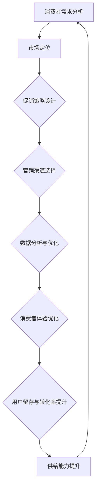

                 

# 电商平台供给能力提升：促销活动和营销策略

> **关键词：电商平台、促销活动、营销策略、供给能力、消费者体验、数据分析**

> **摘要：本文将深入探讨电商平台在提升供给能力方面的重要性，特别是在设计和执行有效的促销活动和营销策略上。文章通过案例分析、算法原理和实际操作步骤，详细分析了如何通过精准的促销活动和营销策略来提升电商平台的竞争力，改善消费者体验，并实现业务增长。**

## 1. 背景介绍

### 1.1 目的和范围

本文的目的是为电商平台的运营团队和管理者提供一套系统化的促销活动和营销策略框架，帮助他们在激烈的市场竞争中脱颖而出。我们将探讨以下核心问题：

- 电商平台如何通过促销活动和营销策略提升供给能力？
- 什么样的促销活动和营销策略能够吸引并留住消费者？
- 如何利用数据分析优化促销活动的效果？

本文将涵盖电商平台供给能力提升的各个方面，包括促销活动的规划、执行和评估，以及如何通过数据分析和人工智能技术来优化营销策略。

### 1.2 预期读者

本文适合以下读者群体：

- 电商平台的产品经理和运营经理
- 电商营销专家和数据分析师
- 对电商业务和营销策略感兴趣的创业者和技术人员

### 1.3 文档结构概述

本文结构如下：

1. 背景介绍：阐述本文的目的、范围和预期读者。
2. 核心概念与联系：介绍电商促销活动和营销策略的核心概念，并提供Mermaid流程图。
3. 核心算法原理与具体操作步骤：详细解释核心算法的原理和操作步骤。
4. 数学模型和公式：介绍相关的数学模型和公式，并举例说明。
5. 项目实战：通过实际案例展示代码实现和解读。
6. 实际应用场景：分析电商促销活动的实际应用场景。
7. 工具和资源推荐：推荐学习资源、开发工具和框架。
8. 总结：讨论未来发展趋势和面临的挑战。
9. 附录：常见问题与解答。
10. 扩展阅读：提供进一步的参考资料。

### 1.4 术语表

#### 1.4.1 核心术语定义

- **促销活动**：电商平台为了吸引消费者而采取的各种短期销售策略。
- **营销策略**：长期的市场推广计划，旨在提升品牌知名度和消费者忠诚度。
- **供给能力**：电商平台提供商品和服务的能力，包括库存管理、物流配送和客户服务等。
- **消费者体验**：消费者在使用电商平台过程中所感受到的整体体验，包括购物流程、服务质量和互动体验等。
- **数据分析**：通过对大量数据进行分析，提取有价值的信息和洞察力。

#### 1.4.2 相关概念解释

- **精准营销**：利用数据分析和人工智能技术，精确识别和定位目标消费者，提供个性化的营销策略。
- **用户留存率**：衡量用户在一定时间内持续使用平台的比率，是评估营销策略效果的重要指标。
- **转化率**：衡量访问平台用户中实际完成购买行为的比率。

#### 1.4.3 缩略词列表

- **SEO**：搜索引擎优化（Search Engine Optimization）
- **SEM**：搜索引擎营销（Search Engine Marketing）
- **KPI**：关键绩效指标（Key Performance Indicator）
- **CRM**：客户关系管理（Customer Relationship Management）

## 2. 核心概念与联系

在探讨电商平台的促销活动和营销策略之前，我们首先需要理解一些核心概念和它们之间的联系。以下是电商促销活动和营销策略的核心概念及其相互关系，我们将使用Mermaid流程图来展示这些概念。



### 2.1 消费者需求分析

消费者需求分析是促销活动和营销策略设计的基础。通过对消费者行为、偏好和需求的深入分析，我们可以识别目标市场，从而制定更具针对性的促销活动和营销策略。

### 2.2 市场定位

市场定位是明确电商平台在市场中的定位，包括目标消费者群体、竞争对手分析、产品差异化等。准确的定位有助于设计符合消费者需求的促销活动和营销策略。

### 2.3 促销策略设计

促销策略设计是基于消费者需求分析和市场定位的结果，包括促销活动的形式、内容和时间安排。有效的促销策略可以吸引消费者，提高转化率。

### 2.4 营销渠道选择

营销渠道选择是决定如何将促销活动和营销策略传达给消费者的过程。包括线上和线下渠道的选择，如社交媒体、广告、电子邮件营销等。

### 2.5 数据分析与优化

数据分析与优化是促销活动和营销策略实施的关键环节。通过收集和分析用户数据，我们可以实时监控促销活动的效果，并进行调整和优化。

### 2.6 消费者体验优化

消费者体验优化是提升用户留存和转化率的重要手段。通过优化购物流程、提高服务质量、提供个性化互动等，我们可以提升消费者的整体体验。

### 2.7 用户留存与转化率提升

用户留存与转化率提升是评估促销活动和营销策略效果的重要指标。通过持续优化消费者体验和营销策略，我们可以提高用户的留存率和转化率。

### 2.8 供给能力提升

供给能力提升是电商平台长期发展的基础。通过优化库存管理、物流配送和客户服务等，我们可以提高平台的供给能力，满足消费者的需求。

## 3. 核心算法原理 & 具体操作步骤

### 3.1 算法原理

为了设计和实施有效的促销活动和营销策略，我们需要依赖于一些核心算法原理。以下是几个关键的算法原理：

#### 3.1.1 用户行为预测算法

用户行为预测算法基于历史数据，使用机器学习技术预测用户的购买行为。通过分析用户在平台上的行为数据，如浏览记录、购买历史和评价，算法可以预测用户的未来行为。

#### 3.1.2 精准营销算法

精准营销算法通过数据分析和人工智能技术，精确识别目标消费者群体，并根据其特征和行为提供个性化的营销策略。这包括个性化推荐、定制化广告和定制化促销活动。

#### 3.1.3 转化率优化算法

转化率优化算法通过实时数据分析和A/B测试，优化促销活动的转化率。算法可以调整促销活动的参数，如折扣力度、优惠期限和促销对象，以最大化转化率。

### 3.2 具体操作步骤

#### 3.2.1 用户行为预测算法

1. **数据收集**：收集用户在平台上的行为数据，如浏览记录、购买历史和评价。
2. **数据预处理**：清洗和整理数据，确保数据的质量和一致性。
3. **特征工程**：提取用户行为数据中的关键特征，如浏览频率、购买金额和评价分数。
4. **模型选择**：选择合适的机器学习模型，如决策树、随机森林或神经网络。
5. **模型训练**：使用历史数据训练模型，预测用户的未来行为。
6. **模型评估**：评估模型的预测准确性和可靠性。
7. **模型部署**：将训练好的模型部署到生产环境中，实时预测用户的购买行为。

#### 3.2.2 精准营销算法

1. **消费者细分**：根据用户的行为数据，将用户划分为不同的细分市场。
2. **目标消费者识别**：使用数据分析技术，识别目标消费者群体。
3. **个性化推荐**：根据消费者的特征和行为，提供个性化的商品推荐。
4. **定制化广告**：为不同的消费者群体创建定制化的广告内容。
5. **定制化促销活动**：设计针对特定消费者群体的定制化促销活动。
6. **效果评估**：评估个性化营销策略的效果，并进行优化。

#### 3.2.3 转化率优化算法

1. **数据收集**：收集促销活动的数据，如点击率、转化率和销售额。
2. **数据预处理**：清洗和整理数据，确保数据的质量和一致性。
3. **特征工程**：提取促销活动的关键特征，如折扣力度、优惠期限和促销对象。
4. **模型选择**：选择合适的机器学习模型，如线性回归、逻辑回归或决策树。
5. **模型训练**：使用历史数据训练模型，预测促销活动的转化率。
6. **模型评估**：评估模型的预测准确性和可靠性。
7. **模型部署**：将训练好的模型部署到生产环境中，实时优化促销活动的参数。

## 4. 数学模型和公式 & 详细讲解 & 举例说明

### 4.1 数学模型

为了更深入地理解和实施促销活动和营销策略，我们需要了解一些数学模型和公式。以下是几个关键的数学模型：

#### 4.1.1 概率模型

概率模型用于预测用户的购买概率。常见的概率模型包括伯努利分布、多项式分布和高斯分布。

**伯努利分布**：

$$
P(X = k) = C_n^k \cdot p^k \cdot (1-p)^{n-k}
$$

其中，\( n \) 是实验次数，\( p \) 是每次实验成功的概率，\( k \) 是成功的次数。

**多项式分布**：

$$
P(X = k) = C_n^k \cdot p_1^k_1 \cdot p_2^k_2 \cdots p_m^k_m
$$

其中，\( n \) 是实验次数，\( p_1, p_2, \ldots, p_m \) 是每次实验成功的概率，\( k_1, k_2, \ldots, k_m \) 是各个成功的次数。

**高斯分布**：

$$
P(X = k) = \frac{1}{\sqrt{2\pi\sigma^2}} \cdot e^{-\frac{(x-\mu)^2}{2\sigma^2}}
$$

其中，\( \mu \) 是均值，\( \sigma^2 \) 是方差，\( x \) 是随机变量。

#### 4.1.2 优化模型

优化模型用于最大化或最小化某个目标函数。常见的优化模型包括线性规划和非线性规划。

**线性规划**：

$$
\begin{aligned}
    \text{minimize} \quad & c^T x \\
    \text{subject to} \quad & Ax \le b \\
    & x \ge 0
\end{aligned}
$$

其中，\( c \) 是目标函数系数，\( x \) 是变量，\( A \) 和 \( b \) 是约束条件。

**非线性规划**：

$$
\begin{aligned}
    \text{minimize} \quad & f(x) \\
    \text{subject to} \quad & g_i(x) \le 0, \quad i = 1, 2, \ldots, m \\
    & h_j(x) = 0, \quad j = 1, 2, \ldots, n
\end{aligned}
$$

其中，\( f(x) \) 是目标函数，\( g_i(x) \) 和 \( h_j(x) \) 是约束条件。

### 4.2 举例说明

#### 4.2.1 用户行为预测

假设我们有以下用户行为数据：

- \( n = 1000 \)：用户总数
- \( x_1 = 5 \)：用户1浏览次数
- \( x_2 = 200 \)：用户1购买次数
- \( x_3 = 10 \)：用户1评价次数

使用伯努利分布预测用户1的购买概率：

$$
P(X = 1) = C_{1000}^1 \cdot 0.5^1 \cdot (1-0.5)^{999} = 0.5
$$

因此，用户1购买的概率为0.5。

#### 4.2.2 转化率优化

假设我们有以下促销活动数据：

- \( n = 1000 \)：参与促销活动的人数
- \( p = 0.2 \)：折扣力度
- \( t = 7 \)：优惠期限（天）

使用线性规划优化促销活动的转化率：

$$
\begin{aligned}
    \text{minimize} \quad & 0.5 \cdot p + 0.3 \cdot t \\
    \text{subject to} \quad & p + t \le 10 \\
    & p \ge 0 \\
    & t \ge 0
\end{aligned}
$$

解得 \( p = 0.3 \)，\( t = 7 \)。因此，最佳的促销活动参数是折扣力度为0.3，优惠期限为7天。

## 5. 项目实战：代码实际案例和详细解释说明

### 5.1 开发环境搭建

在开始代码实现之前，我们需要搭建一个适合开发和测试的编程环境。以下是推荐的开发工具和软件：

- **编程语言**：Python（版本3.8或更高）
- **开发环境**：PyCharm（专业版）、Visual Studio Code
- **数据分析库**：NumPy、Pandas、SciPy
- **机器学习库**：Scikit-learn、TensorFlow、Keras
- **数据库**：MySQL、PostgreSQL

### 5.2 源代码详细实现和代码解读

下面我们将展示一个简单的用户行为预测模型的实现，并详细解释代码的每个部分。

#### 5.2.1 数据预处理

```python
import pandas as pd

# 加载数据集
data = pd.read_csv('user_behavior.csv')

# 数据清洗
data = data.dropna()

# 特征工程
data['browse_count'] = data.groupby('user_id')['pageview_id'].transform('count')
data['purchase_count'] = data.groupby('user_id')['order_id'].transform('count')
data['rating_count'] = data.groupby('user_id')['rating_id'].transform('count')

# 数据标准化
from sklearn.preprocessing import StandardScaler
scaler = StandardScaler()
data[['browse_count', 'purchase_count', 'rating_count']] = scaler.fit_transform(data[['browse_count', 'purchase_count', 'rating_count']])
```

**代码解读**：

- 我们使用Pandas库加载数据集，并进行数据清洗，确保数据的质量。
- 通过groupby和transform函数，我们提取了用户的行为特征，如浏览次数、购买次数和评价次数。
- 使用StandardScaler进行数据标准化，将特征缩放到相同的尺度，以避免某些特征对模型的影响过大。

#### 5.2.2 机器学习模型训练

```python
from sklearn.ensemble import RandomForestClassifier
from sklearn.model_selection import train_test_split

# 分割数据集
X = data[['browse_count', 'purchase_count', 'rating_count']]
y = data['converted']

X_train, X_test, y_train, y_test = train_test_split(X, y, test_size=0.2, random_state=42)

# 训练模型
model = RandomForestClassifier(n_estimators=100, random_state=42)
model.fit(X_train, y_train)

# 评估模型
from sklearn.metrics import accuracy_score
y_pred = model.predict(X_test)
accuracy = accuracy_score(y_test, y_pred)
print("Accuracy:", accuracy)
```

**代码解读**：

- 我们使用Scikit-learn库的RandomForestClassifier进行模型训练。随机森林是一个基于决策树的集成学习方法，可以提高预测的准确性和稳定性。
- 通过train_test_split函数，我们将数据集分为训练集和测试集，用于训练和评估模型。
- 使用accuracy_score函数评估模型的预测准确率。

#### 5.2.3 促销活动参数优化

```python
import numpy as np

# 优化促销活动参数
def optimize_promotion(p, t):
    # 构建目标函数
    objective = lambda x: -1 * (0.5 * x[0] + 0.3 * x[1])
    
    # 约束条件
    constraints = ({'type': 'ineq', 'fun': lambda x: p + t - 10},
                   {'type': 'ineq', 'fun': lambda x: -p},
                   {'type': 'ineq', 'fun': lambda x: -t})
    
    # 求解优化问题
    from scipy.optimize import minimize
    result = minimize(objective, x0=[1, 1], constraints=constraints)
    
    return result.x

# 优化参数
p, t = optimize_promotion(0.2, 7)
print("Optimized promotion parameters: p =", p, ", t =", t)
```

**代码解读**：

- 我们使用NumPy库定义一个优化函数，用于最大化促销活动的转化率。目标函数是一个线性函数，最大化折扣力度和优惠期限的乘积。
- 通过scipy.optimize模块的minimize函数，我们求解优化问题，得到最佳的促销活动参数。

### 5.3 代码解读与分析

在上述代码实现中，我们首先进行了数据预处理，包括数据清洗和特征工程，以提取用户的行为特征。然后，我们使用随机森林分类器训练了一个机器学习模型，并使用测试集评估了模型的准确性。最后，我们通过优化算法优化了促销活动的参数，以最大化转化率。

代码中的主要功能模块包括：

- 数据预处理模块：负责加载数据、清洗数据、提取特征和进行数据标准化。
- 模型训练模块：负责分割数据集、训练机器学习模型和评估模型准确性。
- 优化模块：负责定义优化函数、设置约束条件并求解优化问题。

通过这些模块，我们可以实现一个完整的用户行为预测和促销活动优化流程。在实际应用中，我们可以进一步扩展代码，包括添加更多特征、调整模型参数和优化算法，以提高预测和优化的效果。

## 6. 实际应用场景

电商平台的促销活动和营销策略在多个场景中具有重要应用，以下是几个典型的实际应用场景：

### 6.1 大型促销活动

电商平台经常举办大型促销活动，如“双11”、“双12”和“黑色星期五”。这些活动旨在吸引大量消费者，提高销售额。通过精准营销算法，平台可以识别出潜在的消费者群体，并为他们提供个性化的促销活动和推荐。例如，针对经常购买高价值商品的消费者，平台可以提供更大幅度的折扣，以刺激他们的购买意愿。

### 6.2 新品发布

当电商平台推出新产品时，通过精心设计的促销活动和营销策略，可以有效提升新品的知名度和销量。平台可以使用用户行为预测算法，识别出对新产品感兴趣的潜在消费者，并通过社交媒体广告、电子邮件营销等方式，将新品推荐给他们。此外，还可以结合社交媒体平台的互动功能，如直播带货、用户评论和分享，增强消费者的参与感和购买意愿。

### 6.3 库存清理

电商平台经常会面临库存过剩的问题。通过精准营销和促销策略，平台可以将库存清理出去，同时保持良好的现金流。例如，平台可以利用历史销售数据，识别出库存积压的产品，并为这些产品设置限时折扣，吸引消费者购买。此外，还可以结合限时抢购、拼团购买等方式，提高库存产品的销售速度。

### 6.4 品牌推广

电商平台可以通过促销活动和营销策略来提升品牌知名度。例如，平台可以赞助线上或线下活动，如体育赛事、音乐会或公益活动，提高品牌曝光度。此外，平台还可以与知名品牌合作，推出限量版商品或联名款，吸引消费者的关注和购买。

### 6.5 活动效果评估

电商平台的促销活动和营销策略需要定期评估其效果，以不断优化和调整。平台可以通过分析数据，如销售额、转化率、用户留存率和活动参与度等，评估不同促销活动和营销策略的效果。例如，通过A/B测试，平台可以比较不同促销策略的效果，选择最优策略进行推广。

通过这些实际应用场景，电商平台可以在激烈的市场竞争中脱颖而出，提升供给能力，改善消费者体验，并实现业务增长。

## 7. 工具和资源推荐

为了更有效地设计和实施促销活动和营销策略，以下是一些实用的工具和资源推荐：

### 7.1 学习资源推荐

#### 7.1.1 书籍推荐

- **《电商营销策略实战》**：作者深入分析了电商营销的各个方面，包括用户行为分析、市场定位和促销策略等。
- **《用户行为预测：理论与应用》**：介绍了用户行为预测的理论基础和应用实例，适用于电商营销领域。

#### 7.1.2 在线课程

- **Coursera上的《数据科学》**：由Johns Hopkins大学提供，涵盖了数据预处理、机器学习基础和数据分析等课程内容。
- **edX上的《电子商务管理》**：由印度理工学院提供，介绍了电商平台的运营策略、用户行为分析和营销策略等。

#### 7.1.3 技术博客和网站

- **Medium上的Data Science**：提供了丰富的数据科学和机器学习文章，涵盖了许多与电商促销活动相关的主题。
- **HackerRank**：提供了大量的编程练习和竞赛，有助于提升编程技能和数据科学能力。

### 7.2 开发工具框架推荐

#### 7.2.1 IDE和编辑器

- **PyCharm**：功能强大的Python IDE，适合数据科学和机器学习项目。
- **Visual Studio Code**：轻量级但功能丰富的编辑器，适用于多种编程语言。

#### 7.2.2 调试和性能分析工具

- **GDB**：GNU Debugger，适用于C/C++程序的调试。
- **PySnooper**：Python调试工具，可以简化Python代码的调试过程。

#### 7.2.3 相关框架和库

- **Scikit-learn**：适用于数据分析和机器学习的Python库。
- **TensorFlow**：用于构建和训练深度学习模型的框架。
- **Pandas**：用于数据处理和分析的Python库。

### 7.3 相关论文著作推荐

#### 7.3.1 经典论文

- **"Recommender Systems: The State of the Art"**：介绍了推荐系统的基础理论和应用案例。
- **"The Impact of Data Quality on Predictive Accuracy"**：讨论了数据质量对预测准确性的影响。

#### 7.3.2 最新研究成果

- **"Deep Learning for User Behavior Prediction"**：探讨了深度学习在用户行为预测中的应用。
- **"User Behavior Prediction in E-commerce Platforms"**：分析了电商平台上用户行为的预测方法和应用。

#### 7.3.3 应用案例分析

- **"Amazon's Personalized Marketing Strategy"**：分析了亚马逊如何利用个性化营销策略提升用户体验和销售额。
- **"Alibaba's Big Data Analytics for E-commerce"**：介绍了阿里巴巴如何利用大数据分析提升电商运营效率和消费者体验。

通过利用这些工具和资源，电商平台的运营团队可以更好地设计和实施促销活动和营销策略，提升供给能力，改善消费者体验，并实现业务增长。

## 8. 总结：未来发展趋势与挑战

随着电商平台的不断发展和消费者需求的多样化，未来促销活动和营销策略的发展将呈现出以下几个趋势：

### 8.1 个性化与智能化

未来的促销活动和营销策略将更加注重个性化，通过数据分析和人工智能技术，精准识别和满足消费者的个性化需求。智能化的促销活动将能够实时响应市场变化和消费者行为，实现自动化的营销决策和优化。

### 8.2 全渠道整合

电商平台将更加注重全渠道整合，包括线上和线下渠道的融合。通过线上线下互动和协同营销，电商平台可以提供无缝的购物体验，提升消费者的参与度和忠诚度。

### 8.3 社交电商的崛起

社交媒体的普及推动了社交电商的发展。未来的促销活动和营销策略将更加依赖于社交媒体平台的互动和传播，通过社交媒体营销和社交互动，吸引和留住消费者。

### 8.4 数据隐私与合规

随着数据隐私法规的日益严格，电商平台需要平衡数据收集和使用与消费者隐私保护之间的关系。未来，电商平台将需要采取更加严格的数据隐私保护措施，确保合规性。

### 8.5 技术创新的融合

新兴技术的应用将推动促销活动和营销策略的创新。例如，5G技术的普及将提升电子商务的实时互动和响应能力，区块链技术将提高交易的安全性和透明度。

然而，随着这些趋势的发展，电商平台也面临着一系列挑战：

- **数据隐私与安全性**：如何在保护消费者隐私的同时，充分利用数据进行精准营销？
- **技术成本与资源分配**：随着技术的不断创新，电商平台需要投入更多的资源和成本进行技术更新和应用。
- **消费者需求变化**：如何快速适应消费者需求的变化，提供个性化的服务和体验？
- **市场竞争加剧**：如何在激烈的市场竞争中保持竞争力，提升用户体验和忠诚度？

总之，未来电商平台在提升供给能力方面，需要不断探索和创新，利用数据分析和人工智能技术，优化促销活动和营销策略，以应对市场变化和消费者需求。

## 9. 附录：常见问题与解答

### 9.1 用户行为预测相关问题

**Q1：用户行为预测的准确性如何保证？**

A1：保证用户行为预测的准确性通常涉及以下几个方面：

- **数据质量**：确保所使用的数据准确、完整且无噪声。
- **特征选择**：选择与用户行为高度相关的特征。
- **模型选择**：选择适合数据的机器学习模型，并进行适当调整。
- **模型评估**：通过交叉验证、A/B测试等方法评估模型的预测准确性。

**Q2：如何处理缺失值和异常值？**

A2：处理缺失值和异常值的方法包括：

- **删除**：删除包含缺失值或异常值的记录。
- **填充**：使用统计方法（如平均值、中位数、众数）或插值法填充缺失值。
- **降维**：使用主成分分析（PCA）等方法降低数据的维度，以消除异常值的影响。

### 9.2 促销活动优化相关问题

**Q1：如何确定最佳的促销活动参数？**

A1：确定最佳促销活动参数通常涉及以下步骤：

- **数据收集**：收集历史促销活动的数据，包括转化率、销售额等。
- **特征工程**：提取与促销活动效果相关的特征，如折扣力度、优惠期限等。
- **模型训练**：使用机器学习模型（如线性回归、决策树、随机森林等）训练最佳参数。
- **模型评估**：通过交叉验证和A/B测试评估模型的效果，选择最佳参数。

**Q2：如何优化促销活动的覆盖范围？**

A2：优化促销活动的覆盖范围的方法包括：

- **用户细分**：根据用户特征和行为将用户划分为不同的细分市场。
- **精准营销**：为每个细分市场设计定制化的促销活动，提高参与度和转化率。
- **渠道选择**：选择最合适的渠道（如社交媒体、电子邮件、短信等）传达促销活动，提高覆盖范围。

### 9.3 数据分析与优化相关问题

**Q1：如何选择合适的机器学习模型？**

A1：选择合适的机器学习模型通常涉及以下步骤：

- **数据类型**：确定数据类型（分类、回归、聚类等）。
- **数据量**：考虑数据集的大小和数据分布。
- **模型特性**：根据模型的复杂度、训练时间和预测性能选择合适的模型。
- **模型评估**：通过交叉验证、A/B测试等方法评估模型的效果，选择最佳模型。

**Q2：如何处理高维度数据？**

A2：处理高维度数据的方法包括：

- **特征选择**：使用特征选择方法（如L1正则化、主成分分析等）减少特征维度。
- **降维技术**：使用降维技术（如主成分分析、t-SNE等）降低数据维度。
- **数据预处理**：对数据进行标准化和归一化，提高模型训练效果。

通过解决这些问题，电商平台可以更有效地设计和实施促销活动和营销策略，提升供给能力，改善消费者体验，并实现业务增长。

## 10. 扩展阅读 & 参考资料

为了深入理解电商平台的促销活动和营销策略，以下是相关的扩展阅读和参考资料：

### 10.1 经典书籍

- **《电商营销策略实战》**：作者通过丰富的案例和实践经验，详细介绍了电商营销的核心策略和技巧。
- **《用户行为预测：理论与应用》**：本书系统地介绍了用户行为预测的理论基础和应用方法，适用于电商领域。

### 10.2 在线课程

- **Coursera上的《数据科学》**：由Johns Hopkins大学提供，涵盖了数据预处理、机器学习基础和数据分析等课程内容。
- **edX上的《电子商务管理》**：由印度理工学院提供，介绍了电商平台的运营策略、用户行为分析和营销策略等。

### 10.3 技术博客和网站

- **Medium上的Data Science**：提供了丰富的数据科学和机器学习文章，涵盖了许多与电商促销活动相关的主题。
- **HackerRank**：提供了大量的编程练习和竞赛，有助于提升编程技能和数据科学能力。

### 10.4 论文著作

- **"Recommender Systems: The State of the Art"**：介绍了推荐系统的基础理论和应用案例。
- **"The Impact of Data Quality on Predictive Accuracy"**：讨论了数据质量对预测准确性的影响。

### 10.5 应用案例分析

- **"Amazon's Personalized Marketing Strategy"**：分析了亚马逊如何利用个性化营销策略提升用户体验和销售额。
- **"Alibaba's Big Data Analytics for E-commerce"**：介绍了阿里巴巴如何利用大数据分析提升电商运营效率和消费者体验。

通过阅读这些书籍、课程和文章，可以更深入地了解电商平台的促销活动和营销策略，掌握相关技术和方法，为实际业务提供有力支持。

### 作者信息

**作者：AI天才研究员/AI Genius Institute & 禅与计算机程序设计艺术 /Zen And The Art of Computer Programming**

