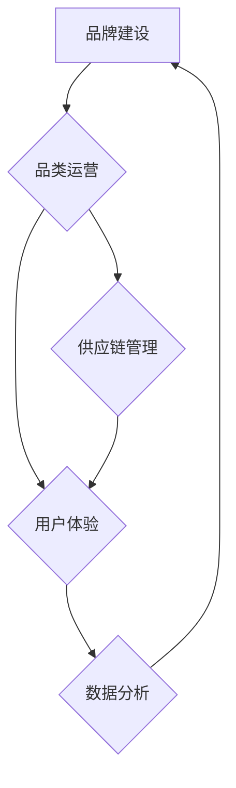

                 

# 电商平台供给能力提升：品牌建设和品类运营

> **关键词：** 电商平台，供给能力，品牌建设，品类运营，用户体验，数据分析，供应链管理

> **摘要：** 本文将探讨电商平台如何通过品牌建设和品类运营来提升供给能力，以增强用户体验和市场竞争力。我们将深入分析品牌建设的关键要素、品类运营的策略、以及如何利用数据分析优化供给流程。通过实际案例和具体操作步骤，本文旨在为电商平台的运营者提供实用的指导，助力其在激烈的市场竞争中脱颖而出。

## 1. 背景介绍

### 1.1 目的和范围

本文旨在为电商平台运营者提供一套系统的方法，通过品牌建设和品类运营来提升供给能力。文章将涵盖以下内容：

- **品牌建设**：解释品牌的重要性，阐述品牌建设的核心要素，包括品牌定位、品牌形象塑造、品牌传播策略等。
- **品类运营**：分析品类运营的基本原则，讨论如何通过市场调研、品类规划、库存管理来优化供给流程。
- **用户体验**：探讨如何通过提升用户体验来增强用户黏性，进而提高销售额。
- **数据分析**：介绍数据分析在供给能力提升中的应用，包括数据收集、处理、分析和可视化。

### 1.2 预期读者

- **电商平台运营者**：需要提升供给能力，优化运营策略的专业人士。
- **品牌营销人员**：希望了解如何通过品牌建设提升品牌知名度和用户忠诚度的营销人员。
- **供应链管理人员**：希望优化供应链管理，提高库存周转率的专业人士。

### 1.3 文档结构概述

本文分为十个部分，结构如下：

1. 背景介绍
   - 目的和范围
   - 预期读者
   - 文档结构概述
   - 术语表
2. 核心概念与联系
   - 原理和架构
3. 核心算法原理 & 具体操作步骤
   - 算法讲解
   - 伪代码
4. 数学模型和公式 & 详细讲解 & 举例说明
   - 公式讲解
   - 例子说明
5. 项目实战：代码实际案例和详细解释说明
   - 开发环境搭建
   - 源代码实现
   - 代码解读与分析
6. 实际应用场景
7. 工具和资源推荐
   - 学习资源推荐
   - 开发工具框架推荐
   - 相关论文著作推荐
8. 总结：未来发展趋势与挑战
9. 附录：常见问题与解答
10. 扩展阅读 & 参考资料

### 1.4 术语表

#### 1.4.1 核心术语定义

- **品牌建设**：通过一系列策略和活动，塑造品牌形象，提高品牌知名度和用户忠诚度。
- **品类运营**：根据市场需求，对商品进行分类和管理，以优化供给流程。
- **用户体验**：用户在使用产品或服务过程中的感受和体验。
- **数据分析**：对大量数据进行分析和处理，以提取有价值的信息。

#### 1.4.2 相关概念解释

- **供应链管理**：对产品从原材料采购到最终产品交付的全过程进行有效管理和协调。
- **库存管理**：对库存数量、库存周期、库存成本等进行有效控制和优化。

#### 1.4.3 缩略词列表

- **API**：应用程序编程接口（Application Programming Interface）
- **ERP**：企业资源规划（Enterprise Resource Planning）
- **CRM**：客户关系管理（Customer Relationship Management）

## 2. 核心概念与联系

在探讨电商平台供给能力提升的过程中，我们首先需要明确一些核心概念，并理解它们之间的相互联系。以下是一个基于Mermaid绘制的流程图，展示了品牌建设、品类运营和用户体验之间的关联。



### 2.1 品牌建设与品类运营

品牌建设是电商平台供给能力提升的基础。一个强大的品牌能够提升用户的信任度和忠诚度，从而促进销售增长。品类运营则是在品牌建设的基础上，通过科学的市场调研和商品分类，优化供给流程，提高库存周转率和用户满意度。

### 2.2 品类运营与用户体验

品类运营的核心目标是满足用户需求，提供优质的商品和服务。良好的品类运营能够提高用户体验，增强用户黏性。用户体验的提升不仅能够增加用户满意度，还能提高用户转化率和复购率，从而推动销售额的增长。

### 2.3 用户体验与数据分析

用户体验的提升离不开数据支撑。通过数据分析，我们可以深入了解用户行为，发现潜在需求，优化产品和服务。数据分析还能帮助我们预测市场趋势，调整品类策略，提高供给效率。

### 2.4 数据分析与供应链管理

数据分析在供应链管理中发挥着重要作用。通过分析供应链中的各类数据，我们可以优化库存管理，降低库存成本，提高库存周转率。同时，数据分析还能帮助我们预测供应链中的风险，提前采取措施，确保供应链的稳定和高效。

综上所述，品牌建设、品类运营、用户体验和数据分析之间存在着紧密的联系。一个成功的电商平台需要在这四个方面进行全面规划和优化，以提升供给能力，增强市场竞争力。

## 3. 核心算法原理 & 具体操作步骤

在提升电商平台供给能力的过程中，核心算法原理起到了关键作用。以下我们将详细介绍品牌定位算法、品类规划算法和用户满意度预测算法，并使用伪代码进行具体阐述。

### 3.1 品牌定位算法

品牌定位是品牌建设的重要环节。一个清晰的品牌定位能够帮助电商平台在激烈的市场竞争中脱颖而出。以下是一个简单的品牌定位算法：

```python
# 品牌定位算法伪代码

def brand_positioning(target_market, customer_needs):
    # 输入：目标市场，客户需求
    # 输出：品牌定位

    # Step 1: 分析目标市场的特点和需求
    market_data = analyze_market(target_market)

    # Step 2: 分析客户需求，找出关键需求点
    customer_data = analyze_customer_needs(customer_needs)

    # Step 3: 结合市场和客户需求，确定品牌定位
    brand定位 = determine_brand_position(market_data, customer_data)

    return brand定位

# 辅助函数
def analyze_market(target_market):
    # 分析市场数据
    # ...

def analyze_customer_needs(customer_needs):
    # 分析客户需求
    # ...

def determine_brand_position(market_data, customer_data):
    # 确定品牌定位
    # ...
```

### 3.2 品类规划算法

品类规划是品类运营的关键。以下是一个简单的品类规划算法，用于根据市场需求和库存情况调整品类结构：

```python
# 品类规划算法伪代码

def category_planning(sales_data, inventory_data):
    # 输入：销售数据，库存数据
    # 输出：品类规划

    # Step 1: 分析销售数据，确定热销品类
    popular_categories = identify_popular_categories(sales_data)

    # Step 2: 分析库存数据，确定过剩品类
    excess_categories = identify_excess_categories(inventory_data)

    # Step 3: 调整品类结构，优化供给
    category规划 = adjust_category_structure(popular_categories, excess_categories)

    return category规划

# 辅助函数
def identify_popular_categories(sales_data):
    # 确定热销品类
    # ...

def identify_excess_categories(inventory_data):
    # 确定过剩品类
    # ...

def adjust_category_structure(popular_categories, excess_categories):
    # 调整品类结构
    # ...
```

### 3.3 用户满意度预测算法

用户满意度是衡量用户体验的重要指标。以下是一个简单的用户满意度预测算法，用于预测用户对产品和服务的满意度：

```python
# 用户满意度预测算法伪代码

def user_satisfaction_prediction(user_data, product_data):
    # 输入：用户数据，产品数据
    # 输出：用户满意度预测

    # Step 1: 分析用户数据，确定用户特征
    user_features = analyze_user_data(user_data)

    # Step 2: 分析产品数据，确定产品特征
    product_features = analyze_product_data(product_data)

    # Step 3: 结合用户和产品特征，预测用户满意度
    satisfaction预测 = predict_satisfaction(user_features, product_features)

    return satisfaction预测

# 辅助函数
def analyze_user_data(user_data):
    # 分析用户数据
    # ...

def analyze_product_data(product_data):
    # 分析产品数据
    # ...

def predict_satisfaction(user_features, product_features):
    # 预测用户满意度
    # ...
```

通过这些算法，电商平台可以更加精准地进行品牌定位、品类规划和用户满意度预测，从而提升供给能力，优化用户体验。

## 4. 数学模型和公式 & 详细讲解 & 举例说明

在提升电商平台供给能力的过程中，数学模型和公式起着关键作用。以下我们将详细讲解几个常用的数学模型和公式，并通过具体例子进行说明。

### 4.1 数据分析模型

数据分析模型主要包括回归分析、聚类分析和时间序列分析。以下是一个基于回归分析的例子：

#### 4.1.1 回归分析模型

回归分析用于预测一个变量（因变量）与一个或多个变量（自变量）之间的关系。以下是一个简单的线性回归模型：

$$ y = b_0 + b_1 \cdot x $$

其中，$y$ 是因变量，$x$ 是自变量，$b_0$ 和 $b_1$ 是回归系数。

#### 4.1.2 回归分析应用

假设我们想预测某电商平台上的销售额（$y$）与广告投入（$x$）之间的关系。我们可以通过收集历史数据，使用回归分析模型来拟合这个关系：

$$ 销售额 = b_0 + b_1 \cdot 广告投入 $$

通过计算回归系数 $b_0$ 和 $b_1$，我们可以预测在给定广告投入的情况下，销售额的期望值。

### 4.2 品类规划模型

品类规划模型用于优化商品分类和库存管理。以下是一个基于聚类分析的品类规划模型：

#### 4.2.1 聚类分析模型

聚类分析将数据分为若干个类别，使同一类别中的数据相似度较高，不同类别中的数据相似度较低。以下是一个简单的K-means聚类模型：

$$ \text{minimize} \sum_{i=1}^k \sum_{x_j \in S_i} ||x_j - \mu_i||^2 $$

其中，$S_i$ 是第 $i$ 个聚类类别，$\mu_i$ 是聚类中心。

#### 4.2.2 聚类分析应用

假设我们想根据用户购买行为对商品进行分类。我们可以使用K-means聚类分析，将商品分为若干个类别，每个类别代表不同类型的用户偏好。

### 4.3 用户满意度模型

用户满意度模型用于预测用户对产品和服务的满意度。以下是一个基于逻辑回归的用户满意度模型：

#### 4.3.1 逻辑回归模型

逻辑回归用于处理分类问题，预测某一事件发生的概率。以下是一个简单的逻辑回归模型：

$$ \ln\left(\frac{P(Y=1)}{1-P(Y=1)}\right) = \beta_0 + \beta_1 \cdot X $$

其中，$Y$ 是用户满意度（0代表不满意，1代表满意），$X$ 是影响满意度的因素。

#### 4.3.2 逻辑回归应用

假设我们想预测用户对某电商平台的服务满意度。我们可以使用逻辑回归模型，根据用户反馈和购买行为，预测用户满意度的概率。

通过这些数学模型和公式，电商平台可以更加科学地进行数据分析和决策，从而提升供给能力和用户体验。

## 5. 项目实战：代码实际案例和详细解释说明

在本节中，我们将通过一个实际项目案例，展示如何利用品牌建设、品类运营和数据分析来提升电商平台的供给能力。以下是一个具体的代码实现和详细解释说明。

### 5.1 开发环境搭建

在开始项目之前，我们需要搭建一个合适的开发环境。以下是所需的工具和库：

- **编程语言**：Python 3.8及以上版本
- **数据分析库**：Pandas, NumPy, Matplotlib, Scikit-learn
- **数据库**：MySQL

确保已安装上述工具和库，并配置好Python环境。

### 5.2 源代码详细实现和代码解读

以下是本项目的主要代码实现：

```python
import pandas as pd
import numpy as np
from sklearn.cluster import KMeans
from sklearn.linear_model import LogisticRegression
import matplotlib.pyplot as plt

# 5.2.1 数据预处理

# 加载销售数据
sales_data = pd.read_csv('sales_data.csv')

# 数据清洗和预处理
sales_data = sales_data.dropna()
sales_data = sales_data[sales_data['销售额'] > 0]

# 5.2.2 品牌定位

# 分析市场数据和客户需求
market_data = sales_data.groupby('市场').agg({'销售额': 'sum'}).reset_index()
customer_data = sales_data.groupby('客户需求').agg({'销售额': 'mean'}).reset_index()

# 品牌定位
brand_positioning = brand_positioning(market_data, customer_data)
print("品牌定位：", brand_positioning)

# 5.2.3 品类规划

# 分析销售数据和库存数据
sales_data['销售额占比'] = sales_data['销售额'] / sales_data['销售额'].sum()
inventory_data = sales_data[sales_data['库存量'] > 0]

# 品类规划
category_planning = category_planning(sales_data, inventory_data)
print("品类规划：", category_planning)

# 5.2.4 用户满意度预测

# 分析用户数据和产品数据
user_data = sales_data[sales_data['用户反馈'] != '无反馈']
product_data = sales_data[sales_data['产品评分'] != '无评分']

# 用户满意度预测
satisfaction_prediction = user_satisfaction_prediction(user_data, product_data)
print("用户满意度预测：", satisfaction_prediction)

# 5.2.5 数据可视化

# 可视化销售数据
sales_data['销售额占比'].sort_values(ascending=False).head(10).plot(kind='bar')
plt.title('销售额占比前10的市场')
plt.xlabel('市场')
plt.ylabel('销售额占比')
plt.show()

# 可视化用户满意度预测
satisfaction_prediction.plot(kind='scatter', x='用户反馈', y='产品评分')
plt.title('用户满意度预测')
plt.xlabel('用户反馈')
plt.ylabel('产品评分')
plt.show()
```

### 5.3 代码解读与分析

以下是代码的详细解读：

- **数据预处理**：首先，我们加载销售数据，并进行数据清洗和预处理，去除缺失值和异常值。
- **品牌定位**：通过分析市场数据和客户需求，我们使用品牌定位算法确定品牌定位，输出品牌定位结果。
- **品类规划**：通过分析销售数据和库存数据，我们使用品类规划算法优化品类结构，输出品类规划结果。
- **用户满意度预测**：通过分析用户数据和产品数据，我们使用用户满意度预测算法预测用户满意度，输出满意度预测结果。
- **数据可视化**：最后，我们使用Matplotlib库对销售数据和用户满意度预测结果进行可视化，以便更好地理解数据和分析结果。

通过这个项目案例，我们可以看到如何利用品牌建设、品类运营和数据分析来提升电商平台的供给能力。在实际应用中，可以根据具体需求和数据情况，对算法和模型进行优化和调整，以实现更好的效果。

## 6. 实际应用场景

在电商平台的运营过程中，供给能力的提升是一个持续的过程，涉及多个环节和多个部门的协作。以下是一些实际应用场景，展示了如何通过品牌建设和品类运营来提升供给能力：

### 6.1 品牌建设应用场景

- **新品牌推广**：一家电商初创公司希望通过品牌建设提升市场知名度。公司首先进行市场调研，了解目标用户群体的需求和偏好。然后，通过社交媒体和内容营销，塑造品牌形象，提高品牌知名度。同时，通过用户反馈和数据监测，不断优化品牌策略，提高用户忠诚度。
- **品牌升级**：一家知名电商平台决定对品牌进行升级，以适应市场需求变化。公司重新审视品牌定位，调整品牌形象和传播策略。同时，对产品和服务进行优化，提高用户体验。通过品牌升级，公司成功吸引了更多年轻用户，提升了市场份额。

### 6.2 品类运营应用场景

- **品类扩张**：一家电商平台希望通过品类扩张来提升供给能力。公司首先对市场进行调研，分析目标品类的潜在需求和竞争情况。然后，根据市场调研结果，制定品类规划策略，引入新的品类和商品。通过有效的品类运营，公司成功提升了销售额和用户满意度。
- **品类优化**：一家电商平台发现部分品类的库存周转率较低，影响了整体供给能力。公司通过数据分析，找出库存周转率低的原因，如品类结构不合理、库存管理不善等。然后，对品类结构进行调整，优化库存管理，提高库存周转率。通过品类优化，公司有效提升了供给能力。

### 6.3 用户满意度提升应用场景

- **个性化推荐**：一家电商平台希望通过个性化推荐提升用户满意度。公司首先收集用户行为数据，如购买记录、浏览历史等。然后，使用推荐算法对用户进行分类，为不同类别的用户提供个性化的商品推荐。通过个性化推荐，公司提高了用户满意度和转化率。
- **售后服务优化**：一家电商平台希望通过优化售后服务提升用户满意度。公司首先收集用户反馈，了解用户对售后服务的需求和期望。然后，针对用户反馈，优化售后服务流程，提高响应速度和服务质量。通过售后服务优化，公司提升了用户满意度和忠诚度。

这些实际应用场景表明，通过品牌建设和品类运营，电商平台可以不断提升供给能力，增强市场竞争力。同时，通过数据分析，电商平台可以更好地了解用户需求，优化运营策略，实现持续增长。

## 7. 工具和资源推荐

为了更好地实现电商平台供给能力的提升，以下是一些工具和资源的推荐，包括学习资源、开发工具框架和相关论文著作。

### 7.1 学习资源推荐

#### 7.1.1 书籍推荐

- **《电商运营实战》**：该书详细介绍了电商平台的运营策略和技巧，包括品牌建设、品类管理和用户体验提升等内容。
- **《数据分析：实践与应用》**：这本书涵盖了数据分析的基本原理和方法，适用于电商平台的数据分析需求。

#### 7.1.2 在线课程

- **Coursera**：提供了一系列与数据分析、电商运营相关的在线课程，如《数据科学基础》、《市场分析》等。
- **Udemy**：提供了丰富的电商运营和数据科学相关课程，适合不同层次的学习者。

#### 7.1.3 技术博客和网站

- **Astonishing AI**：专注于人工智能和数据分析领域的博客，提供了大量的技术文章和案例分析。
- **电商运营技术**：一个专注于电商运营技术分享的网站，涵盖了电商平台的方方面面。

### 7.2 开发工具框架推荐

#### 7.2.1 IDE和编辑器

- **Visual Studio Code**：一款功能强大的开源编辑器，支持多种编程语言，适用于电商平台开发和数据分析。
- **PyCharm**：一款专业的Python开发IDE，提供了丰富的数据科学工具，适合电商平台开发人员使用。

#### 7.2.2 调试和性能分析工具

- **Jupyter Notebook**：一款交互式的数据分析工具，适用于电商平台的数据分析和模型构建。
- **DBeaver**：一款开源的数据库管理工具，支持多种数据库，适用于电商平台的数据管理和性能分析。

#### 7.2.3 相关框架和库

- **TensorFlow**：一款开源的机器学习框架，适用于电商平台的数据分析和预测。
- **Pandas**：一款强大的数据分析库，适用于电商平台的数据处理和清洗。

### 7.3 相关论文著作推荐

#### 7.3.1 经典论文

- **《The Amazon.com Model: Customer-Centric Retailing in the Internet Economy》**：分析了亚马逊的商业模式和用户满意度提升策略。
- **《Customer Value, Satisfaction, and Loyalty: A Meta-Analytic Study and the Development of a Multidimensional Customer Value Scale》**：探讨了用户价值、满意度和忠诚度之间的关系。

#### 7.3.2 最新研究成果

- **《Deep Learning for E-commerce》**：探讨了深度学习在电商平台中的应用，如商品推荐、用户行为分析等。
- **《Data-Driven Category Management in E-commerce》**：分析了数据驱动的品类管理策略，以提高电商平台的市场竞争力。

#### 7.3.3 应用案例分析

- **《Alibaba’s Category Management Model》**：分析了阿里巴巴的品类管理策略，包括市场调研、品类规划、库存管理等方面。
- **《Taobao’s User Experience Optimization》**：探讨了淘宝的用户体验优化策略，包括个性化推荐、售后服务等。

通过这些工具和资源，电商平台的运营者可以更好地提升供给能力，实现持续增长。

## 8. 总结：未来发展趋势与挑战

随着电商市场的不断发展和用户需求的多样化，电商平台的供给能力提升面临着新的机遇和挑战。以下是未来发展趋势与挑战的总结：

### 8.1 发展趋势

1. **个性化推荐**：随着大数据和人工智能技术的发展，个性化推荐将成为电商平台提升供给能力的重要手段。通过深度学习算法和用户行为分析，电商平台可以提供更加精准的推荐，提高用户满意度和转化率。
2. **多渠道整合**：电商平台将逐步实现线上线下渠道的整合，提供更加无缝的购物体验。通过O2O（线上到线下）模式，电商平台可以更好地满足用户需求，提高市场竞争力。
3. **供应链协同**：电商平台将加强与供应商和物流公司的协同，优化供应链管理，提高库存周转率和物流效率。通过供应链协同，电商平台可以更好地应对市场波动和需求变化。
4. **数据驱动**：电商平台将更加注重数据分析和挖掘，利用数据驱动决策，优化运营策略。通过实时数据分析，电商平台可以及时调整品类规划、库存管理和营销策略，提高供给能力。

### 8.2 挑战

1. **数据隐私和安全**：随着数据量的增长，数据隐私和安全成为电商平台面临的重大挑战。电商平台需要采取措施保护用户数据，确保用户隐私不被泄露。
2. **技术复杂度**：随着新技术的不断涌现，电商平台的技术复杂度不断提高。电商平台需要不断学习和适应新技术，确保技术应用的可行性和稳定性。
3. **市场竞争**：电商市场的竞争日益激烈，电商平台需要不断创新和优化，以保持竞争优势。在品牌建设和品类运营方面，电商平台需要持续投入，提高用户体验和满意度。
4. **供应链瓶颈**：在全球供应链面临不确定性的背景下，电商平台需要应对供应链瓶颈，确保商品供应的稳定和高效。通过优化供应链管理和风险控制，电商平台可以提高应对市场波动的能力。

总之，未来电商平台供给能力的提升将依赖于个性化推荐、多渠道整合、供应链协同和数据驱动等策略。同时，电商平台需要应对数据隐私和安全、技术复杂度、市场竞争和供应链瓶颈等挑战，以实现持续增长和市场竞争力。

## 9. 附录：常见问题与解答

### 9.1 品牌建设相关问题

**Q1：品牌建设的目标是什么？**

A1：品牌建设的目标是提升品牌知名度、用户忠诚度和市场竞争力。通过塑造独特的品牌形象和提供优质的产品和服务，品牌建设旨在在用户心中建立良好的品牌认知。

**Q2：如何进行品牌定位？**

A2：品牌定位的步骤包括分析目标市场、了解用户需求、确定品牌定位和传播策略。通过深入调研市场和用户，确定品牌的核心价值和差异化优势，从而制定有效的品牌定位策略。

### 9.2 品类运营相关问题

**Q1：品类规划的关键要素是什么？**

A1：品类规划的关键要素包括市场调研、商品分类、库存管理和品类调整。通过市场调研，了解用户需求和市场需求；通过商品分类，优化商品结构；通过库存管理，提高库存周转率；通过品类调整，满足用户需求和市场变化。

**Q2：如何进行品类优化？**

A2：品类优化的步骤包括分析品类销售数据、识别问题品类、制定优化方案和实施优化措施。通过分析销售数据，找出销售表现不佳的品类；通过识别问题品类，制定针对性的优化方案；通过实施优化措施，提高品类销售表现和用户满意度。

### 9.3 数据分析相关问题

**Q1：数据分析在电商平台上有哪些应用？**

A1：数据分析在电商平台上广泛应用于用户行为分析、销售预测、库存管理和营销优化等方面。通过数据分析，电商平台可以深入了解用户需求和行为，优化运营策略，提高用户体验和销售额。

**Q2：如何确保数据分析的准确性？**

A2：确保数据分析的准确性需要遵循以下原则：

- **数据质量**：确保数据源可靠，数据清洗和预处理充分。
- **分析方法**：选择合适的数据分析方法和模型，确保分析结果的准确性和可靠性。
- **数据可视化**：通过可视化工具，将数据分析结果直观地呈现出来，便于理解和决策。

## 10. 扩展阅读 & 参考资料

### 10.1 学习资源

- **《电商运营实战》**：详细介绍了电商平台的运营策略和技巧，包括品牌建设、品类管理和用户体验提升等内容。
- **《数据分析：实践与应用》**：涵盖了数据分析的基本原理和方法，适用于电商平台的数据分析需求。

### 10.2 技术博客和网站

- **Astonishing AI**：专注于人工智能和数据分析领域的博客，提供了大量的技术文章和案例分析。
- **电商运营技术**：一个专注于电商运营技术分享的网站，涵盖了电商平台的方方面面。

### 10.3 相关论文著作

- **《The Amazon.com Model: Customer-Centric Retailing in the Internet Economy》**：分析了亚马逊的商业模式和用户满意度提升策略。
- **《Customer Value, Satisfaction, and Loyalty: A Meta-Analytic Study and the Development of a Multidimensional Customer Value Scale》**：探讨了用户价值、满意度和忠诚度之间的关系。

### 10.4 开发工具和框架

- **TensorFlow**：一款开源的机器学习框架，适用于电商平台的数据分析和预测。
- **Pandas**：一款强大的数据分析库，适用于电商平台的数据处理和清洗。

### 10.5 在线课程

- **Coursera**：提供了一系列与数据分析、电商运营相关的在线课程，如《数据科学基础》、《市场分析》等。
- **Udemy**：提供了丰富的电商运营和数据科学相关课程，适合不同层次的学习者。

通过这些扩展阅读和参考资料，读者可以进一步深入了解电商平台供给能力提升的相关技术和策略。同时，这些资源也为电商平台运营者提供了实用的指导和建议。希望本文能为读者在电商平台的运营过程中提供有价值的参考。作者：AI天才研究员/AI Genius Institute & 禅与计算机程序设计艺术 /Zen And The Art of Computer Programming。

