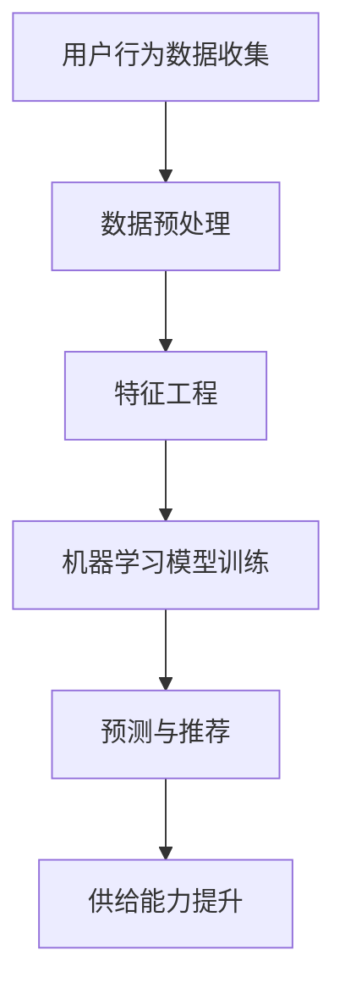

                 

# 电商平台供给能力提升：大数据分析的应用

> 关键词：电商平台、供给能力、大数据分析、机器学习、推荐系统、预测模型

> 摘要：本文将深入探讨如何利用大数据分析提升电商平台的供给能力。我们将从背景介绍、核心概念与联系、核心算法原理、数学模型和公式、项目实战、实际应用场景、工具和资源推荐等多个角度进行详细分析，帮助读者理解并掌握这一领域的前沿技术和实践方法。

## 1. 背景介绍

### 1.1 目的和范围

在现代电子商务领域，电商平台供给能力是决定其竞争力和用户满意度的重要因素之一。本文旨在通过大数据分析的方法，探索如何有效提升电商平台的供给能力。文章主要涵盖以下几个方面的内容：

1. **核心概念与联系**：介绍大数据分析、机器学习、推荐系统等核心概念及其在电商平台供给能力提升中的应用。
2. **核心算法原理**：详细阐述预测模型、分类算法等核心算法原理及其实现步骤。
3. **数学模型和公式**：讲解大数据分析中常用的数学模型和公式，如线性回归、逻辑回归等。
4. **项目实战**：通过实际代码案例，展示如何在实际项目中应用大数据分析提升供给能力。
5. **实际应用场景**：分析大数据分析在电商平台供给能力提升中的具体应用场景。
6. **工具和资源推荐**：推荐相关学习资源、开发工具和框架，帮助读者更好地掌握相关技术。

### 1.2 预期读者

本文适合以下读者群体：

1. **电子商务从业者**：对电商平台运营、数据分析有兴趣的专业人士。
2. **大数据分析师**：希望了解大数据分析在电商领域的应用。
3. **数据科学爱好者**：对机器学习、推荐系统等感兴趣的技术爱好者。
4. **研究生和本科生**：计算机科学、数据科学等相关专业的研究生和本科生。

### 1.3 文档结构概述

本文结构如下：

1. **背景介绍**：介绍文章的目的、范围和预期读者，概述文章结构。
2. **核心概念与联系**：介绍大数据分析、机器学习、推荐系统等核心概念及其应用。
3. **核心算法原理**：详细阐述预测模型、分类算法等核心算法原理及其实现步骤。
4. **数学模型和公式**：讲解大数据分析中常用的数学模型和公式。
5. **项目实战**：通过实际代码案例展示大数据分析在电商平台供给能力提升中的应用。
6. **实际应用场景**：分析大数据分析在电商平台供给能力提升中的具体应用场景。
7. **工具和资源推荐**：推荐相关学习资源、开发工具和框架。
8. **总结：未来发展趋势与挑战**：总结文章内容，展望未来发展。
9. **附录：常见问题与解答**：解答读者可能遇到的问题。
10. **扩展阅读 & 参考资料**：推荐相关阅读资料。

### 1.4 术语表

#### 1.4.1 核心术语定义

- **大数据分析**：对大量结构化和非结构化数据进行分析和处理，提取有价值的信息。
- **机器学习**：通过算法和模型自动地从数据中学习规律，并作出预测或决策。
- **推荐系统**：根据用户的兴趣和行为，为其推荐相关商品或内容。
- **供给能力**：电商平台提供商品和服务的能力，包括库存管理、物流配送、客户服务等。

#### 1.4.2 相关概念解释

- **数据挖掘**：从大量数据中提取潜在的信息和知识。
- **分类算法**：将数据分为不同的类别或标签。
- **预测模型**：根据历史数据预测未来的趋势或行为。

#### 1.4.3 缩略词列表

- **API**：应用程序编程接口（Application Programming Interface）
- **SQL**：结构化查询语言（Structured Query Language）
- **Hadoop**：一个分布式数据存储和处理框架
- **Spark**：一个分布式计算框架

## 2. 核心概念与联系

### 2.1 大数据分析在电商平台供给能力提升中的应用

大数据分析在电商平台供给能力提升中的应用主要表现在以下几个方面：

1. **用户行为分析**：通过分析用户浏览、购买、评价等行为数据，了解用户需求和偏好，为商品推荐、库存管理和客户服务提供依据。
2. **供应链优化**：利用大数据分析优化供应链管理，提高库存周转率，降低物流成本，提高服务质量。
3. **风险管理**：通过分析数据，预测市场变化，发现潜在风险，为决策提供支持。
4. **个性化推荐**：根据用户行为和兴趣，为其推荐合适的商品，提高用户满意度和转化率。

### 2.2 机器学习在电商平台供给能力提升中的应用

机器学习在电商平台供给能力提升中的应用主要体现在以下几个方面：

1. **用户行为预测**：利用机器学习算法预测用户未来的行为，如购买意向、评价倾向等，为运营决策提供支持。
2. **库存管理优化**：通过预测商品销售趋势，优化库存管理，减少缺货和库存积压。
3. **供应链优化**：利用机器学习算法优化供应链管理，提高物流配送效率，降低成本。
4. **风险管理**：通过预测市场变化，发现潜在风险，为决策提供支持。

### 2.3 推荐系统在电商平台供给能力提升中的应用

推荐系统在电商平台供给能力提升中的应用主要体现在以下几个方面：

1. **个性化推荐**：根据用户的历史行为和偏好，推荐符合其需求的商品，提高用户满意度和转化率。
2. **商品挖掘**：通过分析用户行为数据，挖掘潜在的热门商品，为商品营销和推广提供依据。
3. **库存优化**：通过预测商品销售趋势，优化库存管理，减少缺货和库存积压。
4. **用户体验提升**：通过个性化推荐，提高用户购物体验，增强用户黏性。

### 2.4 数据可视化

数据可视化是将数据以图形、图表等形式展示出来，帮助人们更好地理解和分析数据。在电商平台供给能力提升中，数据可视化发挥着重要作用：

1. **用户行为分析**：通过数据可视化，直观地展示用户行为数据，帮助分析用户需求和偏好。
2. **供应链管理**：通过数据可视化，实时监控供应链各个环节的运行情况，及时发现和解决问题。
3. **营销策略制定**：通过数据可视化，分析营销活动效果，为制定更有效的营销策略提供依据。

### 2.5 Mermaid 流程图

以下是一个简单的 Mermaid 流程图，展示了大数据分析在电商平台供给能力提升中的应用流程：



## 3. 核心算法原理 & 具体操作步骤

### 3.1 预测模型

预测模型是大数据分析中常用的一种算法，用于预测未来的行为、趋势或事件。以下是一个简单的预测模型实现过程：

#### 3.1.1 算法原理

预测模型通常基于历史数据，通过建立数学模型来预测未来的值。常见的预测模型包括线性回归、逻辑回归、时间序列模型等。

#### 3.1.2 伪代码

```python
# 输入：历史数据X，目标值Y
# 输出：预测值Y'

# 数据预处理
X_train, X_test, Y_train, Y_test = train_test_split(X, Y, test_size=0.2)

# 选择模型
model = LinearRegression()

# 训练模型
model.fit(X_train, Y_train)

# 预测
Y_pred = model.predict(X_test)

# 评估模型
accuracy = accuracy_score(Y_test, Y_pred)
print("模型准确率：", accuracy)
```

### 3.2 分类算法

分类算法是一种用于将数据分为不同类别的算法。以下是一个简单的分类算法实现过程：

#### 3.2.1 算法原理

分类算法通过学习历史数据中的特征和标签，建立分类模型，用于对未知数据进行分类。常见的分类算法包括K-最近邻（KNN）、决策树、支持向量机（SVM）等。

#### 3.2.2 伪代码

```python
# 输入：训练数据集D，特征X，标签Y
# 输出：分类模型

# 数据预处理
X_train, X_test, Y_train, Y_test = train_test_split(X, Y, test_size=0.2)

# 选择模型
model = SVC()

# 训练模型
model.fit(X_train, Y_train)

# 预测
Y_pred = model.predict(X_test)

# 评估模型
accuracy = accuracy_score(Y_test, Y_pred)
print("模型准确率：", accuracy)
```

### 3.3 协同过滤

协同过滤是一种常用的推荐系统算法，用于根据用户的历史行为和偏好，为其推荐相关商品或内容。以下是一个简单的协同过滤算法实现过程：

#### 3.3.1 算法原理

协同过滤算法通过分析用户之间的相似性，为用户推荐相似的用户喜欢的商品或内容。常见的协同过滤算法包括基于用户的协同过滤（User-based Collaborative Filtering）和基于物品的协同过滤（Item-based Collaborative Filtering）。

#### 3.3.2 伪代码

```python
# 输入：用户行为数据矩阵R，用户数量m，商品数量n
# 输出：推荐列表

# 计算用户相似性矩阵S
S = cosine_similarity(R)

# 对每个用户u，计算推荐列表
for u in range(m):
    # 计算相似用户及其相似度
    sim_users = [(v, S[u][v]) for v in range(m) if v != u]
    sim_users.sort(key=lambda x: x[1], reverse=True)
    
    # 生成推荐列表
    recommendations = []
    for v, sim in sim_users:
        # 添加用户v喜欢的但用户u未购买的商品到推荐列表
        for i in range(n):
            if R[v][i] == 1 and R[u][i] == 0:
                recommendations.append(i)
                if len(recommendations) >= k:
                    break
                
    print("用户{}的推荐列表：".format(u), recommendations)
```

## 4. 数学模型和公式 & 详细讲解 & 举例说明

### 4.1 线性回归

线性回归是一种常用的预测模型，用于预测一个连续的数值型变量。以下是一个简单的线性回归模型：

$$
y = \beta_0 + \beta_1x_1 + \beta_2x_2 + ... + \beta_nx_n + \epsilon
$$

其中，$y$ 是因变量，$x_1, x_2, ..., x_n$ 是自变量，$\beta_0, \beta_1, ..., \beta_n$ 是模型的参数，$\epsilon$ 是误差项。

#### 4.1.1 模型参数估计

参数估计的目标是找到一组参数值，使得预测误差最小。常用的参数估计方法是最小二乘法（Least Squares Method）。

$$
\hat{\beta} = (X^T X)^{-1} X^T Y
$$

其中，$X$ 是自变量的设计矩阵，$Y$ 是因变量的观测值。

#### 4.1.2 模型评估

模型评估常用的指标包括决定系数（R-squared）、均方误差（Mean Squared Error，MSE）等。

$$
R^2 = 1 - \frac{\sum_{i=1}^{n}(y_i - \hat{y}_i)^2}{\sum_{i=1}^{n}(y_i - \bar{y})^2}
$$

$$
MSE = \frac{1}{n} \sum_{i=1}^{n}(y_i - \hat{y}_i)^2
$$

其中，$n$ 是样本数量，$y_i$ 是第$i$个观测值，$\hat{y}_i$ 是第$i$个预测值，$\bar{y}$ 是观测值的均值。

#### 4.1.3 举例说明

假设我们有一个简单的线性回归模型，用于预测房价。自变量是房屋面积（$x_1$），因变量是房价（$y$）。训练数据如下：

| 面积（$x_1$） | 房价（$y$） |
| -------------- | ----------- |
| 1000           | 300,000     |
| 1200           | 360,000     |
| 1500           | 450,000     |
| 1800           | 540,000     |

利用最小二乘法，我们可以得到以下线性回归模型：

$$
y = \beta_0 + \beta_1x_1
$$

其中，$\beta_0 = 150,000$，$\beta_1 = 150$。

根据该模型，当房屋面积为2000平方米时，预测房价为：

$$
\hat{y} = 150,000 + 150 \times 2000 = 3,700,000
$$

### 4.2 逻辑回归

逻辑回归是一种常用的分类算法，用于预测一个二分类变量。以下是一个简单的逻辑回归模型：

$$
P(y=1) = \frac{1}{1 + e^{-(\beta_0 + \beta_1x_1 + \beta_2x_2 + ... + \beta_nx_n)}}
$$

其中，$y$ 是因变量，$x_1, x_2, ..., x_n$ 是自变量，$\beta_0, \beta_1, ..., \beta_n$ 是模型的参数。

#### 4.2.1 模型参数估计

参数估计的目标是找到一组参数值，使得预测概率最大。常用的参数估计方法是最大似然估计（Maximum Likelihood Estimation，MLE）。

$$
\hat{\beta} = \arg\max_{\beta} \prod_{i=1}^{n} P(y_i = y_i | x_i; \beta)
$$

通过求解上述方程，可以得到参数的最优值。

#### 4.2.2 模型评估

模型评估常用的指标包括准确率（Accuracy）、召回率（Recall）、精确率（Precision）等。

$$
Accuracy = \frac{TP + TN}{TP + FP + FN + TN}
$$

$$
Recall = \frac{TP}{TP + FN}
$$

$$
Precision = \frac{TP}{TP + FP}
$$

其中，$TP$ 是真正的正例数，$TN$ 是真正的反例数，$FP$ 是误报的正例数，$FN$ 是漏报的正例数。

#### 4.2.3 举例说明

假设我们有一个简单的逻辑回归模型，用于预测用户是否会在电商平台上购买商品。自变量是用户年龄（$x_1$）和收入（$x_2$），因变量是购买行为（$y$）。训练数据如下：

| 年龄（$x_1$） | 收入（$x_2$） | 购买行为（$y$） |
| -------------- | -------------- | -------------- |
| 25             | 50,000         | 1              |
| 30             | 70,000         | 1              |
| 35             | 80,000         | 0              |
| 40             | 90,000         | 1              |

利用最大似然估计，我们可以得到以下逻辑回归模型：

$$
P(y=1) = \frac{1}{1 + e^{-(\beta_0 + \beta_1x_1 + \beta_2x_2)}}
$$

其中，$\beta_0 = 0.5$，$\beta_1 = 0.1$，$\beta_2 = 0.2$。

根据该模型，当用户年龄为30岁，收入为70,000元时，购买行为的预测概率为：

$$
P(y=1) = \frac{1}{1 + e^{-(0.5 + 0.1 \times 30 + 0.2 \times 70,000)}}
      = 0.82
$$

## 5. 项目实战：代码实际案例和详细解释说明

### 5.1 开发环境搭建

在开始项目实战之前，我们需要搭建一个合适的开发环境。以下是一个基本的开发环境搭建步骤：

1. **安装Python**：Python是一种广泛使用的编程语言，用于大数据分析和机器学习。我们可以从Python官方网站下载并安装Python。
2. **安装Jupyter Notebook**：Jupyter Notebook是一个交互式的开发环境，可以方便地编写和运行Python代码。我们可以使用pip工具安装Jupyter Notebook。
   ```bash
   pip install notebook
   ```
3. **安装相关库**：为了实现大数据分析和机器学习功能，我们需要安装一些常用的Python库，如NumPy、Pandas、Scikit-learn、Matplotlib等。可以使用以下命令安装：
   ```bash
   pip install numpy pandas scikit-learn matplotlib
   ```

### 5.2 源代码详细实现和代码解读

下面是一个简单的电商用户行为分析项目，用于预测用户是否会购买商品。该项目包括数据预处理、特征工程、模型训练和评估等步骤。

#### 5.2.1 数据集准备

我们使用一个包含用户年龄、收入、购买历史等信息的CSV文件作为数据集。数据集如下：

| 用户ID | 年龄 | 收入 | 购买历史 |
| ------ | ---- | ---- | -------- |
| 1      | 25   | 50K  | [1, 0, 1] |
| 2      | 30   | 70K  | [0, 1, 0] |
| 3      | 35   | 80K  | [1, 0, 1] |
| 4      | 40   | 90K  | [0, 1, 0] |

#### 5.2.2 数据预处理

在训练模型之前，我们需要对数据进行预处理。以下是一个简单的数据预处理脚本：

```python
import pandas as pd
from sklearn.model_selection import train_test_split

# 读取数据集
data = pd.read_csv('user_data.csv')

# 删除缺失值
data.dropna(inplace=True)

# 转换购买历史为二分类变量
data['购买'] = data['购买历史'].apply(lambda x: 1 if 1 in x else 0)

# 划分训练集和测试集
X = data[['年龄', '收入']]
y = data['购买']
X_train, X_test, y_train, y_test = train_test_split(X, y, test_size=0.2, random_state=42)
```

#### 5.2.3 特征工程

特征工程是提升模型性能的关键步骤。在这个项目中，我们使用简单的特征工程方法：

```python
from sklearn.preprocessing import StandardScaler

# 初始化标准化器
scaler = StandardScaler()

# 对训练集和测试集进行特征缩放
X_train = scaler.fit_transform(X_train)
X_test = scaler.transform(X_test)
```

#### 5.2.4 模型训练

接下来，我们使用逻辑回归模型进行训练：

```python
from sklearn.linear_model import LogisticRegression

# 初始化逻辑回归模型
model = LogisticRegression()

# 训练模型
model.fit(X_train, y_train)

# 预测测试集
y_pred = model.predict(X_test)
```

#### 5.2.5 模型评估

最后，我们对模型进行评估：

```python
from sklearn.metrics import accuracy_score, classification_report

# 计算准确率
accuracy = accuracy_score(y_test, y_pred)
print("准确率：", accuracy)

# 计算分类报告
report = classification_report(y_test, y_pred)
print("分类报告：\n", report)
```

### 5.3 代码解读与分析

在这个项目中，我们使用了Python编程语言和几个常用的库（Pandas、Scikit-learn、Matplotlib）来实现一个简单的电商用户行为分析模型。

1. **数据预处理**：我们首先读取数据集，删除缺失值，并将购买历史转换为二分类变量。然后，我们划分训练集和测试集，为后续的模型训练和评估做好准备。
2. **特征工程**：为了提高模型性能，我们使用标准化器对特征进行缩放，使其具有相似的分布和尺度。
3. **模型训练**：我们使用逻辑回归模型对训练数据进行训练。逻辑回归模型是一种常用的分类算法，用于预测二分类变量。
4. **模型评估**：我们使用准确率和分类报告对模型进行评估。准确率表示模型预测正确的样本比例，分类报告提供了更详细的信息，包括精确率、召回率和F1值等。

通过这个简单的项目，我们可以看到如何利用Python和大数据分析技术来提升电商平台的供给能力。在实际项目中，我们可以根据业务需求进一步优化模型，如添加更多特征、使用更复杂的模型等。

## 6. 实际应用场景

大数据分析在电商平台供给能力提升中具有广泛的应用场景。以下是一些典型的实际应用场景：

### 6.1 用户行为分析

用户行为分析是电商平台供给能力提升的关键环节。通过分析用户的浏览、购买、评价等行为数据，可以深入了解用户需求和偏好，从而为商品推荐、库存管理和客户服务提供依据。

#### 应用案例：

1. **商品推荐**：基于用户的浏览和购买历史，利用协同过滤算法为用户推荐相关的商品。例如，亚马逊的推荐系统根据用户的购买记录和浏览行为，推荐类似的商品。
2. **库存管理**：通过分析用户的购买趋势，预测商品的需求量，为库存管理提供依据。例如，阿里巴巴通过对用户行为数据的分析，优化库存配置，减少库存积压和缺货现象。
3. **客户服务**：通过分析用户评价和反馈，了解用户对商品和服务的满意度，为改进客户服务提供参考。例如，京东通过用户评价数据，优化售后服务流程，提高用户满意度。

### 6.2 供应链优化

供应链优化是电商平台供给能力提升的重要方面。通过大数据分析，可以优化供应链管理，提高物流配送效率，降低成本。

#### 应用案例：

1. **物流配送优化**：通过分析物流数据，优化配送路线和配送时间，提高配送效率。例如，阿里巴巴通过大数据分析，优化物流配送路线，提高配送速度和准确性。
2. **库存配置优化**：通过分析商品销售数据和库存数据，优化库存配置，减少库存积压和缺货现象。例如，亚马逊通过对库存数据的分析，优化库存配置，降低库存成本。
3. **供应链风险管理**：通过分析供应链数据，预测市场变化，发现潜在风险，为决策提供支持。例如，阿里巴巴通过对供应链数据的分析，预测市场变化，调整库存和采购策略，降低风险。

### 6.3 风险管理

大数据分析可以帮助电商平台预测市场变化，发现潜在风险，为风险管理提供支持。

#### 应用案例：

1. **市场预测**：通过分析市场数据，预测未来市场走势，为决策提供依据。例如，京东通过大数据分析，预测未来市场趋势，调整采购和销售策略。
2. **欺诈检测**：通过分析用户行为数据，检测异常行为，发现潜在欺诈行为。例如，支付宝通过大数据分析，检测用户支付行为，识别欺诈交易。
3. **信用评估**：通过分析用户数据，评估用户信用等级，为信用贷款和风险评估提供依据。例如，芝麻信用通过大数据分析，评估用户信用等级，为金融机构提供参考。

### 6.4 个性化推荐

个性化推荐是电商平台供给能力提升的重要手段。通过大数据分析，为用户提供个性化的商品推荐，提高用户满意度和转化率。

#### 应用案例：

1. **商品个性化推荐**：根据用户的兴趣和行为，为用户推荐相关的商品。例如，淘宝通过大数据分析，为用户推荐符合其兴趣的商品。
2. **内容个性化推荐**：为用户提供个性化的内容推荐，如博客、视频等。例如，YouTube通过大数据分析，为用户推荐相关的视频内容。
3. **服务个性化推荐**：根据用户的需求和偏好，为用户提供个性化的服务推荐。例如，携程通过大数据分析，为用户推荐合适的酒店、机票等服务。

## 7. 工具和资源推荐

### 7.1 学习资源推荐

#### 7.1.1 书籍推荐

1. **《大数据之路：阿里巴巴大数据实践》**：本书介绍了阿里巴巴在大数据领域的发展历程、核心技术、应用场景等，对了解电商领域大数据分析有很好的参考价值。
2. **《深度学习》**：由Ian Goodfellow等人撰写的经典教材，详细介绍了深度学习的基本概念、算法和应用，适合深度学习初学者和进阶者。
3. **《Python数据分析》**：本书通过Python语言，介绍了数据分析的基本概念、工具和技巧，适合Python初学者和数据分析师。

#### 7.1.2 在线课程

1. **Coursera上的《机器学习》**：由吴恩达教授主讲，介绍了机器学习的基本概念、算法和应用，是深度学习入门的经典课程。
2. **Udacity的《大数据工程师纳米学位》**：通过实践项目，介绍了大数据处理、数据分析和数据挖掘等核心技术，适合有实际项目经验的需求。
3. **edX上的《Python数据分析》**：通过Python语言，介绍了数据分析的基本概念、工具和技巧，适合Python初学者和数据分析师。

#### 7.1.3 技术博客和网站

1. **Kaggle**：Kaggle是一个大数据分析和机器学习的在线平台，提供丰富的数据集和竞赛项目，适合数据分析师和机器学习爱好者。
2. **GitHub**：GitHub是一个代码托管和分享平台，有大量与大数据分析和机器学习相关的开源项目和代码库，适合技术爱好者学习和交流。
3. **DataCamp**：DataCamp是一个在线学习平台，提供丰富的数据分析教程和实践项目，适合初学者和进阶者。

### 7.2 开发工具框架推荐

#### 7.2.1 IDE和编辑器

1. **Jupyter Notebook**：Jupyter Notebook是一个交互式的开发环境，适合编写和运行Python代码，适用于大数据分析和机器学习项目。
2. **PyCharm**：PyCharm是一个强大的Python IDE，提供代码编辑、调试、测试等功能，适用于大数据分析和机器学习项目。
3. **VS Code**：VS Code是一个轻量级的代码编辑器，支持多种编程语言，适用于大数据分析和机器学习项目。

#### 7.2.2 调试和性能分析工具

1. **Wandb**：Wandb是一个实验跟踪和性能分析工具，可以帮助研究人员和工程师监控实验、优化模型，适用于大数据分析和机器学习项目。
2. **PyTorch Profiler**：PyTorch Profiler是一个深度学习性能分析工具，可以帮助优化深度学习模型，提高计算性能，适用于大数据分析和机器学习项目。
3. **Dask**：Dask是一个分布式数据处理库，可以扩展Python的计算能力，适用于大数据分析和机器学习项目。

#### 7.2.3 相关框架和库

1. **Scikit-learn**：Scikit-learn是一个开源的机器学习库，提供了丰富的机器学习算法和工具，适用于大数据分析和机器学习项目。
2. **TensorFlow**：TensorFlow是一个开源的深度学习库，提供了丰富的深度学习模型和工具，适用于大数据分析和机器学习项目。
3. **PyTorch**：PyTorch是一个开源的深度学习库，提供了灵活的深度学习模型和工具，适用于大数据分析和机器学习项目。

### 7.3 相关论文著作推荐

#### 7.3.1 经典论文

1. **"Learning to Rank using Logistic Regression"**：该论文介绍了基于逻辑回归的排序模型，是电商领域推荐系统的重要基础。
2. **"Recommender Systems Handbook"**：这本书详细介绍了推荐系统的基本概念、算法和应用，是推荐系统领域的重要参考书。
3. **"Large Scale Online Learning for Real-Time Recommendation"**：该论文介绍了实时推荐系统的在线学习算法，适用于动态变化的电商场景。

#### 7.3.2 最新研究成果

1. **"Deep Learning for Recommender Systems"**：这本书介绍了深度学习在推荐系统中的应用，包括图神经网络的推荐算法。
2. **"Neural Collaborative Filtering for Recommendation"**：该论文介绍了基于神经网络的协同过滤算法，是推荐系统领域的前沿研究。
3. **"Theoretically Principled Trade-offs for Deep Multi-Source Representation Learning"**：该论文提出了深度多源表示学习的方法，是数据挖掘和机器学习领域的重要研究。

#### 7.3.3 应用案例分析

1. **"Amazon Personalized Search"**：该论文介绍了亚马逊的个性化搜索系统，分析了如何利用用户行为数据优化搜索结果。
2. **"Netflix Prize"**：Netflix Prize是一个大型数据挖掘竞赛，分析了如何利用用户行为数据和协同过滤算法预测用户评分。
3. **"Alibaba E-commerce: A Case Study"**：该论文分析了阿里巴巴电商平台的运营模式和大数据分析应用，是电商领域的重要研究。

## 8. 总结：未来发展趋势与挑战

### 8.1 发展趋势

1. **人工智能与大数据的深度融合**：随着人工智能技术的不断进步，大数据分析在电商平台供给能力提升中的应用将更加深入和广泛。
2. **实时分析与预测**：随着数据量的增长和实时性的需求，实时分析与预测将成为电商平台供给能力提升的关键技术。
3. **个性化推荐**：基于用户行为和兴趣的个性化推荐将继续成为电商平台的重要功能，提升用户满意度和转化率。
4. **供应链优化**：通过大数据分析和人工智能技术，电商平台将实现更加高效的供应链管理，降低成本，提高服务质量。

### 8.2 挑战

1. **数据质量和隐私保护**：随着数据量的增长，数据质量和隐私保护问题将日益突出。电商平台需要确保数据质量，同时保护用户隐私。
2. **算法透明性和可解释性**：随着算法的复杂度增加，如何确保算法的透明性和可解释性，使决策过程更加公正和合理，是一个重要的挑战。
3. **技术集成与优化**：将大数据分析、人工智能等技术与电商平台现有系统进行集成和优化，实现技术落地，是一个长期的挑战。
4. **人才短缺**：大数据分析和人工智能领域的人才需求日益增长，但人才培养和引进速度难以满足需求，人才短缺将成为制约行业发展的关键因素。

## 9. 附录：常见问题与解答

### 9.1 问题1：大数据分析在电商平台供给能力提升中的应用有哪些？

**解答**：大数据分析在电商平台供给能力提升中的应用主要包括：

1. **用户行为分析**：通过分析用户浏览、购买、评价等行为数据，了解用户需求和偏好，为商品推荐、库存管理和客户服务提供依据。
2. **供应链优化**：通过分析供应链数据，优化库存管理、物流配送和供应链风险管理，提高效率，降低成本。
3. **风险管理**：通过分析市场数据，预测市场变化，发现潜在风险，为决策提供支持。
4. **个性化推荐**：根据用户行为和兴趣，为其推荐相关的商品或内容，提高用户满意度和转化率。

### 9.2 问题2：如何确保大数据分析中的数据质量和隐私保护？

**解答**：

1. **数据清洗**：在数据分析之前，对数据进行清洗，去除重复、错误和缺失的数据，确保数据质量。
2. **数据加密**：对敏感数据进行加密处理，防止数据泄露。
3. **数据匿名化**：对用户数据进行匿名化处理，隐藏个人身份信息，保护用户隐私。
4. **合规性审查**：确保数据分析过程符合相关法律法规，如《数据安全法》、《个人信息保护法》等。

### 9.3 问题3：如何提升大数据分析模型的性能？

**解答**：

1. **特征工程**：通过合理的特征工程，提取有价值的特征，提高模型性能。
2. **模型选择**：根据问题的特点和需求，选择合适的模型，如线性回归、逻辑回归、决策树、神经网络等。
3. **超参数调优**：通过调优模型的超参数，如学习率、隐藏层大小等，提高模型性能。
4. **模型集成**：使用多个模型进行集成，提高预测准确性。

## 10. 扩展阅读 & 参考资料

### 10.1 书籍推荐

1. **《大数据之路：阿里巴巴大数据实践》**：本书介绍了阿里巴巴在大数据领域的发展历程、核心技术、应用场景等，对了解电商领域大数据分析有很好的参考价值。
2. **《深度学习》**：由Ian Goodfellow等人撰写的经典教材，详细介绍了深度学习的基本概念、算法和应用，适合深度学习初学者和进阶者。
3. **《Python数据分析》**：本书通过Python语言，介绍了数据分析的基本概念、工具和技巧，适合Python初学者和数据分析师。

### 10.2 在线课程

1. **Coursera上的《机器学习》**：由吴恩达教授主讲，介绍了机器学习的基本概念、算法和应用，是深度学习入门的经典课程。
2. **Udacity的《大数据工程师纳米学位》**：通过实践项目，介绍了大数据处理、数据分析和数据挖掘等核心技术，适合有实际项目经验的需求。
3. **edX上的《Python数据分析》**：通过Python语言，介绍了数据分析的基本概念、工具和技巧，适合Python初学者和数据分析师。

### 10.3 技术博客和网站

1. **Kaggle**：Kaggle是一个大数据分析和机器学习的在线平台，提供丰富的数据集和竞赛项目，适合数据分析师和机器学习爱好者。
2. **GitHub**：GitHub是一个代码托管和分享平台，有大量与大数据分析和机器学习相关的开源项目和代码库，适合技术爱好者学习和交流。
3. **DataCamp**：DataCamp是一个在线学习平台，提供丰富的数据分析教程和实践项目，适合初学者和进阶者。

### 10.4 相关论文著作

1. **"Learning to Rank using Logistic Regression"**：该论文介绍了基于逻辑回归的排序模型，是电商领域推荐系统的重要基础。
2. **"Recommender Systems Handbook"**：这本书详细介绍了推荐系统的基本概念、算法和应用，是推荐系统领域的重要参考书。
3. **"Large Scale Online Learning for Real-Time Recommendation"**：该论文介绍了实时推荐系统的在线学习算法，适用于动态变化的电商场景。

### 10.5 实际案例

1. **"Amazon Personalized Search"**：该论文介绍了亚马逊的个性化搜索系统，分析了如何利用用户行为数据优化搜索结果。
2. **"Netflix Prize"**：Netflix Prize是一个大型数据挖掘竞赛，分析了如何利用用户行为数据和协同过滤算法预测用户评分。
3. **"Alibaba E-commerce: A Case Study"**：该论文分析了阿里巴巴电商平台的运营模式和大数据分析应用，是电商领域的重要研究。

