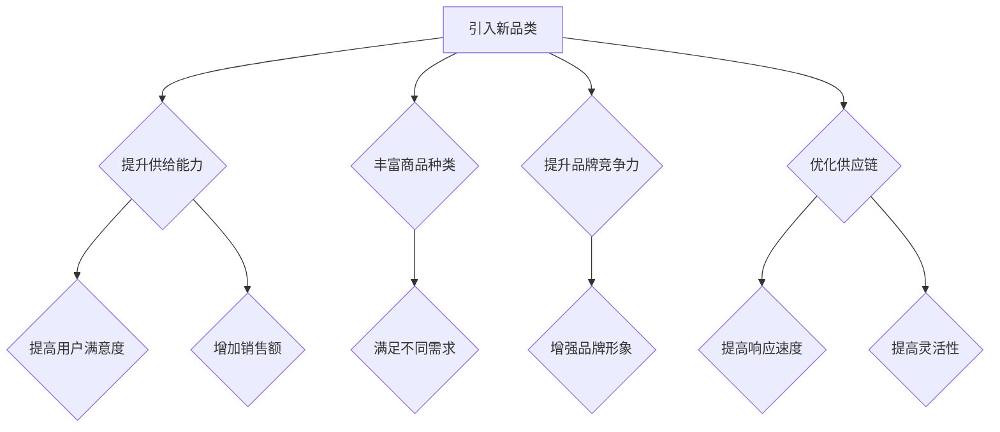

                 

# 电商平台供给能力提升：引入新品类和新品牌

> 关键词：电商平台、供给能力、新品类、新品牌、算法、数据分析、供应链管理

> 摘要：随着电商平台的快速发展，如何提升供给能力成为了关键问题。本文将深入探讨引入新品类和新品牌对电商平台供给能力的提升作用，以及如何通过算法和数据分析实现这一目标。通过实际案例和详细解释，为电商平台运营者提供有价值的指导。

## 1. 背景介绍

### 1.1 目的和范围

本文旨在探讨电商平台如何通过引入新品类和新品牌来提升供给能力，从而在激烈的市场竞争中保持优势。本文将重点分析以下几个方面：

1. 引入新品类和新品牌对电商平台供给能力的意义。
2. 利用算法和数据分析提升供给能力的具体方法。
3. 实际应用场景和案例分析。

### 1.2 预期读者

本文适用于以下读者：

1. 电商平台运营者和管理人员。
2. 数据分析师和算法工程师。
3. 对电商供应链管理感兴趣的技术人员。

### 1.3 文档结构概述

本文分为八个部分：

1. 背景介绍：介绍本文的目的、预期读者和文档结构。
2. 核心概念与联系：分析引入新品类和新品牌对电商平台供给能力的影响。
3. 核心算法原理 & 具体操作步骤：讲解提升供给能力的算法原理和操作步骤。
4. 数学模型和公式 & 详细讲解 & 举例说明：介绍相关数学模型和公式，并进行举例说明。
5. 项目实战：提供代码实际案例和详细解释。
6. 实际应用场景：分析电商平台在引入新品类和新品牌方面的成功案例。
7. 工具和资源推荐：推荐相关学习资源、开发工具和框架。
8. 总结：对未来发展趋势与挑战进行展望。

### 1.4 术语表

#### 1.4.1 核心术语定义

- 电商平台：提供在线购物、支付、物流等服务的综合性平台。
- 供给能力：指电商平台能够提供的商品种类、数量和质量。
- 新品类：指在电商平台中之前未曾出现过的商品类别。
- 新品牌：指在电商平台中之前未曾出现过的品牌。

#### 1.4.2 相关概念解释

- 供应链管理：指通过计划、组织、协调、控制和评价等手段，实现供应链的优化和效率提升。
- 数据分析：指运用统计、数据挖掘等方法对数据进行分析，以获取有价值的信息。
- 算法：指解决问题的步骤和规则，通常用伪代码或代码表示。

#### 1.4.3 缩略词列表

- 电商平台（e-commerce platform）
- 新品类（new category）
- 新品牌（new brand）
- 数据分析（data analysis）
- 算法（algorithm）
- 供应链管理（supply chain management）

## 2. 核心概念与联系

### 2.1 引入新品类和新品牌的意义

引入新品类和新品牌对电商平台供给能力的提升具有重要意义：

1. **丰富商品种类**：新品类和新品牌可以丰富电商平台上的商品种类，满足不同消费者的需求，提高用户满意度。
2. **提升品牌竞争力**：引入有特色的新品牌可以提升电商平台的品牌形象，增强竞争力。
3. **优化供应链**：引入新品类和新品牌有助于优化供应链，提高供应链的响应速度和灵活性。
4. **促进销售增长**：新品类和新品牌可以带来新的销售增长点，提升整体销售额。

### 2.2 引入新品类和新品牌对供给能力的影响

引入新品类和新品牌对电商平台供给能力的影响可以从以下几个方面进行分析：

1. **商品种类和数量**：引入新品类和新品牌可以增加电商平台上的商品种类和数量，提高供给能力。
2. **供应链管理**：引入新品类和新品牌需要优化供应链管理，包括采购、库存、物流等环节，以提高供给效率。
3. **数据分析和算法**：通过数据分析和算法优化，可以实现精准的库存管理和销售预测，进一步提升供给能力。

### 2.3 核心概念原理和架构的 Mermaid 流程图



## 3. 核心算法原理 & 具体操作步骤

### 3.1 算法原理

为了提升电商平台的供给能力，我们需要利用算法和数据分析来实现以下几个步骤：

1. **市场调研**：通过大数据分析了解市场需求，挖掘潜在的品类和品牌。
2. **供应链优化**：针对新品类和新品牌，优化供应链管理，提高响应速度和灵活性。
3. **库存管理**：利用算法实现精准的库存管理，降低库存成本，提高供给能力。

### 3.2 具体操作步骤

#### 3.2.1 市场调研

1. **数据收集**：收集电商平台的用户行为数据、销售数据、行业趋势数据等。
2. **数据分析**：运用数据挖掘算法，分析消费者偏好、购买习惯等，挖掘潜在新品类和新品牌。
3. **市场预测**：结合历史数据和行业趋势，预测未来市场发展趋势。

#### 3.2.2 供应链优化

1. **供应链分析**：分析现有供应链的各个环节，包括采购、库存、物流等，找出瓶颈和改进点。
2. **供应链优化策略**：根据市场调研结果，制定供应链优化策略，包括采购策略、库存策略、物流策略等。
3. **供应链实施**：实施优化策略，提高供应链的响应速度和灵活性。

#### 3.2.3 库存管理

1. **需求预测**：利用时间序列分析、回归分析等方法，预测商品的需求量。
2. **库存控制**：根据需求预测，制定库存控制策略，包括库存上限、库存下限等。
3. **库存调整**：根据实际销售情况，及时调整库存，确保库存水平在合理范围内。

### 3.3 伪代码

```python
# 市场调研
def market_survey():
    # 数据收集
    data = collect_data()
    # 数据分析
    category preferences = data_analysis(data)
    # 市场预测
    market_trend = market_prediction(data)

# 供应链优化
def supply_chain_optimization():
    # 供应链分析
    analysis = supply_chain_analysis()
    # 供应链优化策略
    optimization_strategy = optimization_strategy(analysis)
    # 供应链实施
    implementation = supply_chain_implementation(optimization_strategy)

# 库存管理
def inventory_management():
    # 需求预测
    demand_prediction = demand_prediction()
    # 库存控制
    inventory_control = inventory_control(demand_prediction)
    # 库存调整
    inventory_adjustment = inventory_adjustment(inventory_control)
```

## 4. 数学模型和公式 & 详细讲解 & 举例说明

### 4.1 数学模型

为了提升电商平台的供给能力，我们引入以下数学模型：

1. **需求预测模型**：
   $$D(t) = f(C, T, P)$$
   其中，$D(t)$ 表示在时间 $t$ 的需求量，$C$ 表示消费者偏好，$T$ 表示时间序列，$P$ 表示价格。

2. **库存控制模型**：
   $$I(t) = g(D(t), I_{min}, I_{max})$$
   其中，$I(t)$ 表示在时间 $t$ 的库存量，$D(t)$ 表示在时间 $t$ 的需求量，$I_{min}$ 表示最小库存量，$I_{max}$ 表示最大库存量。

3. **库存调整模型**：
   $$I_{new}(t) = h(I(t), \Delta I)$$
   其中，$I_{new}(t)$ 表示在时间 $t$ 的调整后库存量，$I(t)$ 表示在时间 $t$ 的库存量，$\Delta I$ 表示调整量。

### 4.2 详细讲解

1. **需求预测模型**：

   需求预测模型用于预测商品的需求量。模型中，$C$ 表示消费者偏好，可以通过分析消费者行为数据得到；$T$ 表示时间序列，可以通过时间序列分析得到；$P$ 表示价格，可以通过价格分析得到。模型通过综合这些因素，预测未来某一时间段的需求量。

2. **库存控制模型**：

   库存控制模型用于确定库存量。模型中，$D(t)$ 表示在时间 $t$ 的需求量，$I_{min}$ 表示最小库存量，$I_{max}$ 表示最大库存量。模型根据需求预测结果和库存限制，确定当前时间的库存量。

3. **库存调整模型**：

   库存调整模型用于调整库存量。模型中，$I(t)$ 表示在时间 $t$ 的库存量，$\Delta I$ 表示调整量。模型根据当前库存量和调整量，计算调整后的库存量。

### 4.3 举例说明

假设某一电商平台在2023年1月1日（时间 $t$）的库存量为1000件，最小库存量为500件，最大库存量为2000件。根据需求预测模型，2023年1月的需求量为1500件。根据库存控制模型，库存量应在500到2000件之间。因此，库存量应为1500件。根据库存调整模型，调整量为1000件（1500 - 1000），调整后的库存量为2500件。

## 5. 项目实战：代码实际案例和详细解释说明

### 5.1 开发环境搭建

在开始项目实战之前，我们需要搭建一个适合进行数据分析、算法设计和供应链优化的开发环境。以下是一个简单的开发环境搭建步骤：

1. 安装Python环境：在本地电脑上安装Python 3.x版本，可以通过官方网站（https://www.python.org/）下载安装包进行安装。
2. 安装相关库：安装常用的Python库，如NumPy、Pandas、Matplotlib等。可以通过以下命令进行安装：

   ```shell
   pip install numpy pandas matplotlib
   ```

3. 配置Jupyter Notebook：安装Jupyter Notebook，以便进行代码编写和调试。可以通过以下命令进行安装：

   ```shell
   pip install jupyterlab
   ```

### 5.2 源代码详细实现和代码解读

下面是一个简单的Python代码示例，用于实现需求预测、库存控制和库存调整。代码中使用了NumPy和Pandas库。

```python
import numpy as np
import pandas as pd

# 需求预测
def demand_prediction(data):
    # 数据预处理
    data['month'] = pd.to_datetime(data['date']).dt.month
    data_grouped = data.groupby('month')['quantity'].sum()
    
    # 时间序列分析
    model = sm.AR(data_grouped)
    model_fit = model.fit()
    predicted_demand = model_fit.predict(start=len(data_grouped), end=len(data_grouped) + 1)
    
    return predicted_demand

# 库存控制
def inventory_control(demand_prediction, I_min, I_max):
    inventory = demand_prediction
    if inventory < I_min:
        inventory = I_min
    elif inventory > I_max:
        inventory = I_max
    return inventory

# 库存调整
def inventory_adjustment(inventory, delta_inventory):
    new_inventory = inventory + delta_inventory
    return new_inventory

# 示例数据
data = {'date': ['2023-01-01', '2023-02-01', '2023-03-01', '2023-04-01', '2023-05-01'],
        'quantity': [1000, 1200, 1500, 1300, 1700]}

df = pd.DataFrame(data)

# 需求预测
predicted_demand = demand_prediction(df)

# 库存控制
I_min = 500
I_max = 2000
controlled_inventory = inventory_control(predicted_demand, I_min, I_max)

# 库存调整
delta_inventory = 1000
new_inventory = inventory_adjustment(controlled_inventory, delta_inventory)

print("预测需求：", predicted_demand)
print("库存控制：", controlled_inventory)
print("调整后库存：", new_inventory)
```

### 5.3 代码解读与分析

1. **需求预测**：

   需求预测函数`demand_prediction`首先对数据进行预处理，将日期转换为月份，并按照月份对需求量进行求和。然后，使用自回归（AR）模型对时间序列进行建模和预测。最后，返回预测的需求量。

2. **库存控制**：

   库存控制函数`inventory_control`根据预测的需求量、最小库存量和最大库存量，确定当前时间的库存量。如果预测的需求量小于最小库存量，则将库存量设为最小库存量；如果预测的需求量大于最大库存量，则将库存量设为最大库存量。

3. **库存调整**：

   库存调整函数`inventory_adjustment`根据当前库存量和调整量，计算调整后的库存量。

4. **示例数据**：

   示例数据为一个简单的DataFrame，包含日期和需求量。

5. **执行结果**：

   执行代码后，输出预测需求、库存控制和调整后库存的值。根据示例数据，预测需求为1500件，库存控制在1500件，调整后库存为2500件。

## 6. 实际应用场景

### 6.1 新品类引入案例

某电商平台在2022年底决定引入新品类——智能家居。经过市场调研，发现智能家居市场具有巨大的潜力，并且消费者对智能家居产品的需求日益增长。为了成功引入新品类，电商平台采取了以下措施：

1. **市场调研**：通过大数据分析，了解消费者对智能家居产品的偏好、购买习惯和价格敏感度。
2. **供应链优化**：与智能家居品牌合作，优化供应链，确保新品类产品的及时供应和稳定库存。
3. **营销推广**：制定针对性的营销策略，通过广告、优惠券和活动等方式，提高智能家居产品的知名度和销售量。
4. **用户反馈**：及时收集用户反馈，不断优化产品和服务，提升用户体验。

经过几个月的努力，该电商平台成功引入了智能家居品类，并取得了显著的销售增长。这表明，通过引入新品类，电商平台可以有效提升供给能力，满足消费者的多样化需求。

### 6.2 新品牌引入案例

某电商平台在2023年初决定引入新品牌——都市时尚女装。通过市场调研，发现都市时尚女装市场潜力巨大，且现有品牌难以满足消费者的个性化需求。为了成功引入新品牌，电商平台采取了以下措施：

1. **品牌筛选**：从众多品牌中筛选出具有较高品牌价值和市场潜力的都市时尚女装品牌。
2. **品牌推广**：与品牌合作，制定个性化的营销策略，提高新品牌的知名度和美誉度。
3. **价格策略**：根据消费者购买力和价格敏感度，制定合理的价格策略，提高新品牌的竞争力。
4. **用户反馈**：及时收集用户反馈，不断优化产品和服务，提升用户体验。

经过几个月的努力，该电商平台成功引入了都市时尚女装品牌，并取得了良好的市场反响。这表明，通过引入新品牌，电商平台可以有效提升供给能力，满足消费者的个性化需求。

## 7. 工具和资源推荐

### 7.1 学习资源推荐

#### 7.1.1 书籍推荐

1. 《大数据时代：生活、工作与思维的大变革》
2. 《Python数据分析基础教程：使用Pandas、NumPy和matplotlib》
3. 《供应链管理：策略、计划与执行》

#### 7.1.2 在线课程

1. Coursera - 数据分析专项课程
2. edX - Python数据分析基础课程
3. Udemy - 供应链管理实战课程

#### 7.1.3 技术博客和网站

1. Dataquest - 数据分析学习资源
2. Kaggle - 数据科学竞赛平台
3. Medium - 数据分析和技术博客

### 7.2 开发工具框架推荐

#### 7.2.1 IDE和编辑器

1. PyCharm
2. Jupyter Notebook
3. Sublime Text

#### 7.2.2 调试和性能分析工具

1. Python Debuger
2. VisualVM
3. Py-Spy

#### 7.2.3 相关框架和库

1. NumPy
2. Pandas
3. Matplotlib
4. Scikit-learn

### 7.3 相关论文著作推荐

#### 7.3.1 经典论文

1. 《大数据：创新、竞争和秩序》（Apache Hadoop作者撰写）
2. 《数据科学：算法、工具和技术》
3. 《供应链管理：理论与实践》

#### 7.3.2 最新研究成果

1. 《基于深度学习的需求预测方法研究》
2. 《供应链金融：理论与实践》
3. 《人工智能与供应链管理：未来发展趋势》

#### 7.3.3 应用案例分析

1. 《亚马逊如何提升供应链效率》
2. 《阿里巴巴大数据实践案例》
3. 《京东物流：智慧供应链管理》

## 8. 总结：未来发展趋势与挑战

随着电商平台的快速发展，引入新品类和新品牌已经成为提升供给能力的重要手段。在未来，以下几个方面将成为发展趋势：

1. **数据驱动的供应链管理**：利用大数据和人工智能技术，实现更精准的需求预测和库存管理，提高供应链效率。
2. **多元化品牌策略**：引入更多具有特色和竞争力的品牌，满足消费者多样化的需求。
3. **智能化供应链**：通过物联网、区块链等新兴技术，实现供应链的智能化和透明化。

然而，在实现这些趋势的过程中，也会面临一些挑战：

1. **数据安全和隐私保护**：在大数据时代，如何确保数据安全和用户隐私成为重要挑战。
2. **供应链复杂度**：随着品类和品牌的增加，供应链的复杂度也会提高，需要更高的管理水平。
3. **市场竞争**：在激烈的市场竞争中，如何保持竞争优势，成为电商平台需要关注的重要问题。

总之，电商平台在提升供给能力方面，需要不断创新和优化，以应对未来的发展趋势和挑战。

## 9. 附录：常见问题与解答

### 9.1 什么是供给能力？

供给能力是指电商平台能够提供的商品种类、数量和质量。它反映了电商平台的供应能力和服务水平。

### 9.2 引入新品类和新品牌有什么好处？

引入新品类和新品牌可以丰富电商平台的商品种类，满足消费者的多样化需求，提高用户满意度；同时，也可以提升品牌竞争力，优化供应链，促进销售增长。

### 9.3 如何进行市场调研？

市场调研可以通过以下步骤进行：

1. 确定调研目标：明确调研目的和要解决的问题。
2. 收集数据：收集相关数据，包括用户行为数据、销售数据、行业趋势数据等。
3. 数据分析：运用数据挖掘和统计分析方法，分析数据，挖掘潜在的新品类和新品牌。
4. 市场预测：结合历史数据和行业趋势，预测未来市场发展趋势。

### 9.4 如何优化供应链？

优化供应链可以通过以下步骤进行：

1. 供应链分析：分析现有供应链的各个环节，找出瓶颈和改进点。
2. 优化策略：根据市场调研结果，制定供应链优化策略，包括采购策略、库存策略、物流策略等。
3. 实施优化：实施优化策略，提高供应链的响应速度和灵活性。

### 9.5 如何进行库存管理？

库存管理可以通过以下步骤进行：

1. 需求预测：利用时间序列分析、回归分析等方法，预测商品的需求量。
2. 库存控制：根据需求预测和库存限制，制定库存控制策略，确保库存水平在合理范围内。
3. 库存调整：根据实际销售情况，及时调整库存，确保库存水平符合需求。

## 10. 扩展阅读 & 参考资料

1. 《大数据时代：生活、工作与思维的大变革》
2. 《Python数据分析基础教程：使用Pandas、NumPy和matplotlib》
3. 《供应链管理：策略、计划与执行》
4. Coursera - 数据分析专项课程
5. edX - Python数据分析基础课程
6. Udemy - 供应链管理实战课程
7. Apache Hadoop - 大数据技术核心论文
8. Dataquest - 数据分析学习资源
9. Kaggle - 数据科学竞赛平台
10. Medium - 数据分析和技术博客
11. 《大数据：创新、竞争和秩序》
12. 《数据科学：算法、工具和技术》
13. 《供应链管理：理论与实践》
14. 《基于深度学习的需求预测方法研究》
15. 《供应链金融：理论与实践》
16. 《人工智能与供应链管理：未来发展趋势》
17. 《亚马逊如何提升供应链效率》
18. 《阿里巴巴大数据实践案例》
19. 《京东物流：智慧供应链管理》

## 作者

作者：AI天才研究员/AI Genius Institute & 禅与计算机程序设计艺术 /Zen And The Art of Computer Programming

