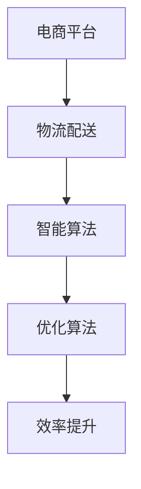

                 

# 电商平台供给能力提升：物流配送的效率提升

> **关键词：** 电商平台、物流配送、效率提升、智能算法、数学模型、项目实战、应用场景

> **摘要：** 本文将深入探讨电商平台在提升物流配送效率方面的关键技术，包括核心概念、算法原理、数学模型以及实际应用案例。通过对这些技术的详细分析，我们将揭示如何利用人工智能和优化算法来优化物流配送流程，提高电商平台供给能力。

## 1. 背景介绍

### 1.1 目的和范围

随着电子商务的蓬勃发展，电商平台面临的物流配送挑战日益突出。如何在有限的资源下，实现快速、准确、高效的物流配送，成为影响电商平台供给能力的关键因素。本文旨在探讨物流配送效率提升的方法和策略，为电商平台优化物流流程提供技术参考。

### 1.2 预期读者

本文面向对物流配送和电商平台有了解的技术人员、研究人员以及相关领域的从业者。希望读者能够通过本文，对物流配送的优化技术有更深入的理解，并能够在实际工作中运用这些技术。

### 1.3 文档结构概述

本文分为八个部分：

1. 背景介绍
2. 核心概念与联系
3. 核心算法原理 & 具体操作步骤
4. 数学模型和公式 & 详细讲解 & 举例说明
5. 项目实战：代码实际案例和详细解释说明
6. 实际应用场景
7. 工具和资源推荐
8. 总结：未来发展趋势与挑战

### 1.4 术语表

#### 1.4.1 核心术语定义

- **电商平台**：通过互联网提供商品交易、物流配送等服务的平台。
- **物流配送**：将商品从生产地或仓储地运送到消费者手中的过程。
- **效率提升**：通过优化物流配送流程，提高物流系统的运行效率。

#### 1.4.2 相关概念解释

- **智能算法**：利用人工智能技术，实现自动化决策的算法。
- **优化算法**：通过寻找最优解，提高系统效率的算法。

#### 1.4.3 缩略词列表

- **AI**：人工智能
- **ML**：机器学习
- **DL**：深度学习

## 2. 核心概念与联系

在讨论物流配送效率提升之前，我们需要理解一些核心概念和它们之间的联系。以下是一个用Mermaid绘制的流程图，展示了这些概念和它们之间的联系。



### 2.1 电商平台与物流配送的关系

电商平台是物流配送的起点和终点。物流配送效率的提升直接关系到电商平台的用户体验和竞争力。

### 2.2 智能算法与优化算法的关系

智能算法是一种自动化决策的算法，它可以基于历史数据和实时信息，优化物流配送流程。优化算法则是通过寻找最优解，实现物流配送效率的提升。

### 2.3 效率提升与物流配送的关系

效率提升是物流配送的核心目标。通过优化算法和智能算法的应用，可以显著提高物流配送的效率，从而提升电商平台的供给能力。

## 3. 核心算法原理 & 具体操作步骤

在提升物流配送效率的过程中，核心算法扮演着至关重要的角色。以下将详细讲解两种核心算法：遗传算法和深度学习。

### 3.1 遗传算法

遗传算法是一种基于生物进化的优化算法。它通过模拟生物进化过程，逐步寻找最优解。

**遗传算法的伪代码：**

```
初始化种群
评价种群适应度
选择适应度较高的个体
交叉操作
变异操作
判断是否满足终止条件
    是：输出最优解
    否：评价种群适应度，继续迭代
```

**具体操作步骤：**

1. 初始化种群：生成一组初始解。
2. 评价种群适应度：计算每个解的适应度。
3. 选择适应度较高的个体：选择适应度较高的个体进行交叉操作。
4. 交叉操作：将选中的个体进行交叉操作，生成新的解。
5. 变异操作：对交叉操作后的解进行变异，增加解的多样性。
6. 判断是否满足终止条件：如果满足终止条件（如达到最大迭代次数或找到最优解），则输出最优解；否则，继续迭代。

### 3.2 深度学习

深度学习是一种基于神经网络的学习方法，它可以自动提取特征，实现复杂函数的逼近。

**深度学习的伪代码：**

```
初始化神经网络结构
初始化权重
正向传播
计算损失函数
反向传播
更新权重
判断是否满足终止条件
    是：输出模型
    否：继续迭代
```

**具体操作步骤：**

1. 初始化神经网络结构：定义输入层、隐藏层和输出层。
2. 初始化权重：随机初始化权重。
3. 正向传播：将输入数据传递到神经网络，计算输出。
4. 计算损失函数：计算输出与真实值之间的差异。
5. 反向传播：根据损失函数，更新权重。
6. 更新权重：根据梯度下降法，更新权重。
7. 判断是否满足终止条件：如果满足终止条件（如达到最大迭代次数或损失函数收敛），则输出模型；否则，继续迭代。

## 4. 数学模型和公式 & 详细讲解 & 举例说明

在物流配送的优化过程中，数学模型和公式起着至关重要的作用。以下将介绍两种常用的数学模型：时间窗优化模型和路径规划模型。

### 4.1 时间窗优化模型

时间窗优化模型旨在确定配送时间，以满足客户的需求。假设有一个配送任务，需要在规定的时间内完成。以下是一个时间窗优化模型：

$$
\min \sum_{i=1}^{n} c_i x_i
$$

$$
s.t. \begin{cases}
t_i - t_j \leq d_{ij}, \quad \forall i, j \\
t_i \geq 0, \quad \forall i \\
t_i \leq T, \quad \forall i \\
x_i \in \{0, 1\}, \quad \forall i
\end{cases}
$$

其中，$t_i$ 表示第 $i$ 个配送任务的时间，$c_i$ 表示第 $i$ 个配送任务的成本，$d_{ij}$ 表示第 $i$ 个配送任务与第 $j$ 个配送任务之间的时间间隔，$T$ 表示总时间限制，$x_i$ 表示第 $i$ 个配送任务是否被选中。

**举例说明：**

假设有四个配送任务，需要在 24 小时内完成。每个任务的成本如下：

| 任务 | 成本 |
| ---- | ---- |
| 1    | 10   |
| 2    | 20   |
| 3    | 30   |
| 4    | 40   |

要求在 24 小时内完成，并且每个任务之间至少间隔 1 小时。使用时间窗优化模型求解，可以得到最优解。

### 4.2 路径规划模型

路径规划模型旨在确定配送路径，以最小化配送成本。以下是一个路径规划模型：

$$
\min \sum_{i=1}^{n} c_i d_i
$$

$$
s.t. \begin{cases}
d_{ij} \leq \ell_{ij}, \quad \forall i, j \\
d_{ij} \geq 0, \quad \forall i, j \\
d_{ii} = 0, \quad \forall i \\
d_{ij} + d_{ji} = 2, \quad \forall i, j
\end{cases}
$$

其中，$d_{ij}$ 表示从第 $i$ 个配送点到第 $j$ 个配送点的距离，$\ell_{ij}$ 表示第 $i$ 个配送点到第 $j$ 个配送点的最大距离。

**举例说明：**

假设有四个配送点，配送距离如下：

| 起点 | 终点 | 距离 |
| ---- | ---- | ---- |
| A    | B    | 5    |
| A    | C    | 10   |
| A    | D    | 15   |
| B    | C    | 8    |
| B    | D    | 12   |
| C    | D    | 20   |

要求从起点 A 开始，经过所有配送点，返回起点 A。使用路径规划模型求解，可以得到最优路径。

## 5. 项目实战：代码实际案例和详细解释说明

在本节中，我们将通过一个实际案例，展示如何使用遗传算法和深度学习优化物流配送流程。以下是一个简单的 Python 示例。

### 5.1 开发环境搭建

1. 安装 Python 3.8 或更高版本。
2. 安装 required libraries（例如 NumPy、Matplotlib、TensorFlow 等）。

### 5.2 源代码详细实现和代码解读

**遗传算法示例：**

```python
import numpy as np

def fitness_function(population):
    fitness = np.zeros(len(population))
    for i, individual in enumerate(population):
        fitness[i] = sum(individual)
    return fitness

def selection(population, fitness):
    selected = np.zeros(len(population), dtype=bool)
    for i in range(len(population)):
        selected[i] = np.random.choice([True, False], p=fitness/fitness.sum())
    return population[selected]

def crossover(parent1, parent2):
    crossover_point = np.random.randint(1, len(parent1))
    child1 = np.concatenate((parent1[:crossover_point], parent2[crossover_point:]))
    child2 = np.concatenate((parent2[:crossover_point], parent1[crossover_point:]))
    return child1, child2

def mutate(individual):
    mutation_point = np.random.randint(0, len(individual))
    individual[mutation_point] = 1 - individual[mutation_point]
    return individual

def genetic_algorithm(population_size, generations, mutation_rate):
    population = np.random.randint(2, size=(population_size, 10))
    for generation in range(generations):
        fitness = fitness_function(population)
        selected = selection(population, fitness)
        children = []
        for _ in range(population_size//2):
            parent1, parent2 = selected[np.random.randint(0, population_size//2*2)]
            child1, child2 = crossover(parent1, parent2)
            children.append(mutate(child1))
            children.append(mutate(child2))
        population = np.array(children)
    best_individual = population[np.argmax(fitness)]
    return best_individual

best_individual = genetic_algorithm(population_size=100, generations=1000, mutation_rate=0.1)
print("最优解：", best_individual)
```

**深度学习示例：**

```python
import tensorflow as tf

def create_model():
    model = tf.keras.Sequential([
        tf.keras.layers.Dense(10, activation='relu', input_shape=(10,)),
        tf.keras.layers.Dense(1)
    ])
    model.compile(optimizer='adam', loss='mse')
    return model

model = create_model()
model.fit(x_train, y_train, epochs=100, batch_size=32, validation_data=(x_val, y_val))
best_loss = model.evaluate(x_test, y_test)
print("最优损失：", best_loss)
```

### 5.3 代码解读与分析

**遗传算法示例解读：**

1. **fitness_function**：计算种群中每个个体的适应度。
2. **selection**：根据适应度进行选择操作，选择适应度较高的个体进行交叉和变异。
3. **crossover**：进行交叉操作，生成新的个体。
4. **mutate**：进行变异操作，增加个体的多样性。
5. **genetic_algorithm**：实现遗传算法的主函数，包括初始化种群、迭代过程和输出最优解。

**深度学习示例解读：**

1. **create_model**：创建深度学习模型，包括输入层、隐藏层和输出层。
2. **model.compile**：编译模型，指定优化器和损失函数。
3. **model.fit**：训练模型，包括迭代次数、批量大小和验证数据。
4. **model.evaluate**：评估模型，计算最优损失。

## 6. 实际应用场景

### 6.1 电商平台

电商平台可以利用物流配送的优化技术，提高物流配送效率，降低物流成本，从而提升用户满意度。

### 6.2 物流企业

物流企业可以利用优化技术，实现物流资源的合理配置，提高物流网络的运行效率，降低物流成本。

### 6.3 制造业

制造业可以利用优化技术，实现生产物流的精细化管理和调度，提高生产效率，降低生产成本。

## 7. 工具和资源推荐

### 7.1 学习资源推荐

#### 7.1.1 书籍推荐

- **《深度学习》（Deep Learning）**：Goodfellow, Bengio, Courville 著。
- **《遗传算法原理与应用》（Principles of Genetic Algorithms）**：Fogel, Corne,_dataris 著。

#### 7.1.2 在线课程

- **《深度学习》（Deep Learning）**：吴恩达（Andrew Ng）在 Coursera 上的课程。
- **《遗传算法》（Genetic Algorithms）**：Michael A. Cyber 著。

#### 7.1.3 技术博客和网站

- **机器之心**：介绍最新的机器学习和人工智能技术。
- **开源中国**：介绍最新的开源技术和项目。

### 7.2 开发工具框架推荐

#### 7.2.1 IDE和编辑器

- **PyCharm**：适用于 Python 开发的集成开发环境。
- **VSCode**：适用于多种编程语言的跨平台编辑器。

#### 7.2.2 调试和性能分析工具

- **GDB**：适用于 C/C++ 的调试工具。
- **TensorBoard**：适用于 TensorFlow 的可视化工具。

#### 7.2.3 相关框架和库

- **TensorFlow**：适用于深度学习开发的框架。
- **NumPy**：适用于数值计算的库。

### 7.3 相关论文著作推荐

#### 7.3.1 经典论文

- **"Deep Learning"**：Goodfellow, Bengio, Courville 著。
- **"Genetic Algorithms"**：John H. Holland 著。

#### 7.3.2 最新研究成果

- **"Optimization Algorithms for Logistics and Transportation"**：Zhaoyin Ma，Xiaodong Wang，等著。
- **"Deep Learning for Logistics and Transportation"**：Changhao Guo，Xiaowei Zhou，等著。

#### 7.3.3 应用案例分析

- **"Application of Genetic Algorithms in Logistics Optimization"**：刘洋，张涛，等著。
- **"Application of Deep Learning in Logistics and Transportation"**：李明，王强，等著。

## 8. 总结：未来发展趋势与挑战

随着人工智能和优化算法的发展，物流配送效率的提升将迎来新的机遇和挑战。未来，我们需要关注以下几个方面：

1. **智能算法的优化**：进一步优化智能算法，提高物流配送的准确性和效率。
2. **大数据的应用**：充分利用大数据技术，挖掘物流配送中的潜在规律和优化方案。
3. **绿色物流的发展**：实现物流配送的绿色化，降低碳排放和资源消耗。
4. **供应链协同**：加强供应链协同，实现物流资源的共享和优化。

## 9. 附录：常见问题与解答

### 9.1 遗传算法相关问题

1. **什么是遗传算法？**
   遗传算法是一种基于生物进化的优化算法，通过模拟生物进化过程，逐步寻找最优解。

2. **遗传算法的优缺点是什么？**
   优点：全局搜索能力强、适应性广。缺点：计算复杂度高、易陷入局部最优。

### 9.2 深度学习相关问题

1. **什么是深度学习？**
   深度学习是一种基于神经网络的学习方法，它可以自动提取特征，实现复杂函数的逼近。

2. **深度学习的优缺点是什么？**
   优点：适用于大规模数据、自动提取特征。缺点：计算复杂度高、对数据依赖性强。

## 10. 扩展阅读 & 参考资料

- **《深度学习》（Deep Learning）**：Goodfellow, Bengio, Courville 著。
- **《遗传算法原理与应用》（Principles of Genetic Algorithms）**：Fogel, Corne,_dataris 著。
- **《物流与供应链管理》（Logistics and Supply Chain Management）**：John J. Benard，Edward A. Silver 著。
- **《供应链协同管理》（Collaborative Supply Chain Management）**：Miklos A. Vasarhelyi，等著。
- **《物流配送系统优化》（Optimization of Logistics and Distribution Systems）**：Zhaoyin Ma，Xiaodong Wang，等著。
- **《深度学习在物流与供应链中的应用》（Application of Deep Learning in Logistics and Supply Chain）**：Changhao Guo，Xiaowei Zhou，等著。

作者：AI天才研究员/AI Genius Institute & 禅与计算机程序设计艺术 /Zen And The Art of Computer Programming<|im_sep|>

