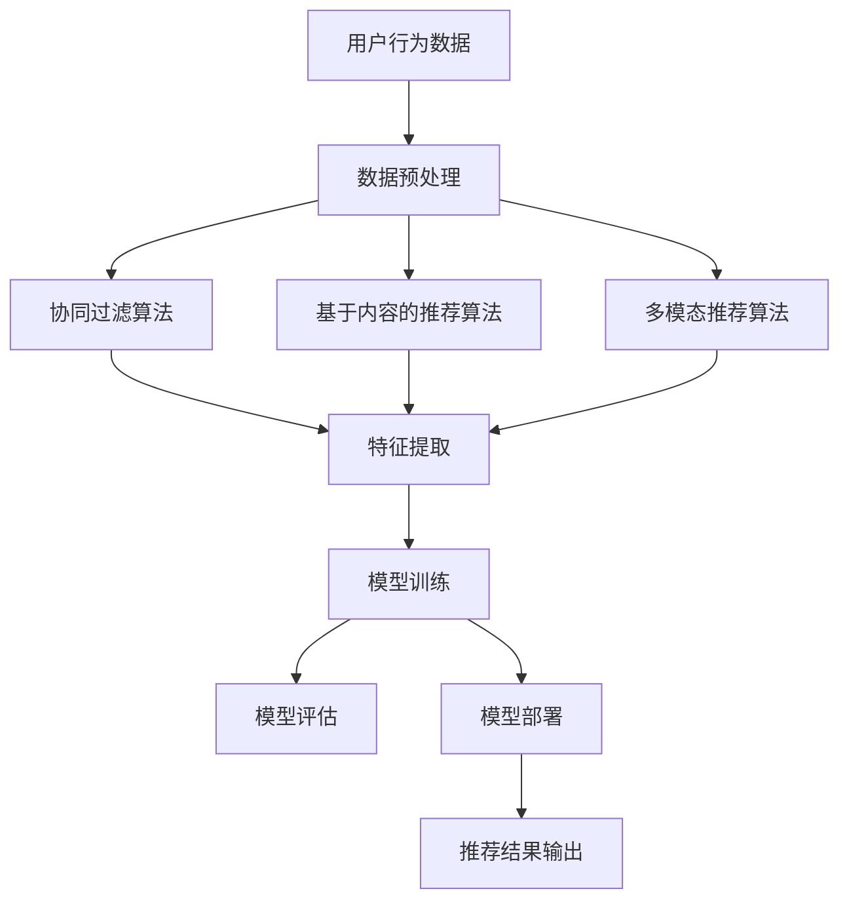

                 

# 电商平台搜索推荐系统的AI大模型优化：提高系统性能、效率与转化率

> **关键词：** 电商平台，搜索推荐系统，AI大模型，性能优化，效率提升，转化率

> **摘要：** 本文将深入探讨电商平台搜索推荐系统的AI大模型优化策略，通过分析系统性能、效率与转化率的关系，探讨如何运用AI技术提高系统性能，从而实现更高的效率与转化率。文章将详细解析核心算法原理，通过实际案例和代码实现，帮助读者理解并掌握优化策略。

## 1. 背景介绍

### 1.1 目的和范围

本文旨在分析电商平台搜索推荐系统的AI大模型优化策略，重点探讨以下方面：

1. **系统性能**：如何通过优化算法提高系统的响应速度和处理能力。
2. **效率**：如何在保证系统性能的前提下，提升系统的处理效率和资源利用率。
3. **转化率**：如何通过优化推荐算法，提高用户的点击率和购买转化率。

### 1.2 预期读者

本文适合以下读者群体：

1. **AI技术开发者**：对AI技术在搜索推荐系统中的应用感兴趣，希望了解如何优化系统性能。
2. **电商平台运营者**：希望提升电商平台用户转化率，提高业务收益。
3. **学术研究人员**：对AI算法优化有深入研究，希望了解实际应用中的优化策略。

### 1.3 文档结构概述

本文分为以下几个部分：

1. **背景介绍**：阐述本文的目的、范围和预期读者。
2. **核心概念与联系**：介绍搜索推荐系统的核心概念和架构。
3. **核心算法原理 & 具体操作步骤**：详细解析推荐算法的原理和操作步骤。
4. **数学模型和公式 & 详细讲解 & 举例说明**：阐述推荐系统的数学模型和公式。
5. **项目实战：代码实际案例和详细解释说明**：通过实际案例展示推荐系统的实现。
6. **实际应用场景**：探讨推荐系统在不同场景下的应用。
7. **工具和资源推荐**：推荐学习资源和开发工具。
8. **总结：未来发展趋势与挑战**：分析未来发展趋势和面临的挑战。
9. **附录：常见问题与解答**：回答读者可能遇到的问题。
10. **扩展阅读 & 参考资料**：提供更多深入阅读的资料。

### 1.4 术语表

#### 1.4.1 核心术语定义

- **搜索推荐系统**：基于用户行为和偏好，通过算法推荐相关商品或内容给用户的系统。
- **AI大模型**：指规模庞大、参数数量巨大的深度学习模型，如BERT、GPT等。
- **转化率**：指用户在搜索或推荐过程中完成购买等目标行为的比例。

#### 1.4.2 相关概念解释

- **协同过滤**：基于用户历史行为进行推荐的算法。
- **基于内容的推荐**：根据商品内容特征进行推荐的算法。
- **多模态推荐**：结合多种数据源（如文本、图像、音频等）进行推荐的算法。

#### 1.4.3 缩略词列表

- **AI**：人工智能
- **NLP**：自然语言处理
- **CNN**：卷积神经网络
- **RNN**：循环神经网络
- **Transformer**：Transformer架构

## 2. 核心概念与联系

在探讨电商平台搜索推荐系统的AI大模型优化之前，首先需要了解其核心概念和架构。以下是一个Mermaid流程图，展示了推荐系统的核心组件和关联。



### 2.1 核心组件解释

1. **用户行为数据**：包括用户的浏览历史、搜索记录、购买记录等，是推荐系统的基础数据。
2. **数据预处理**：对原始数据进行清洗、归一化和特征提取，为后续算法提供高质量的输入。
3. **协同过滤算法**：通过分析用户之间的相似度，为用户推荐相似用户喜欢的商品。
4. **基于内容的推荐算法**：通过分析商品的特征和标签，为用户推荐具有相似特征的商品。
5. **多模态推荐算法**：结合多种数据源（如文本、图像、音频等），为用户推荐更加个性化的商品。
6. **特征提取**：将原始数据转换为特征向量，用于模型训练和评估。
7. **模型训练**：使用训练数据对推荐模型进行训练，以优化模型参数。
8. **模型评估**：使用评估数据对训练好的模型进行性能评估，以确定模型的优劣。
9. **模型部署**：将训练好的模型部署到线上环境，为用户提供推荐服务。
10. **推荐结果输出**：将推荐结果输出给用户，提高用户满意度。

通过上述流程，我们可以清晰地了解推荐系统的整体架构和核心组件之间的关系。

## 3. 核心算法原理 & 具体操作步骤

### 3.1 协同过滤算法原理

协同过滤算法是一种基于用户行为数据的推荐算法，其核心思想是利用用户之间的相似度来为用户推荐他们可能感兴趣的商品。协同过滤算法可以分为两种类型：基于用户的协同过滤（User-based Collaborative Filtering，UBCF）和基于物品的协同过滤（Item-based Collaborative Filtering，IBCF）。

#### 3.1.1 基于用户的协同过滤算法

基于用户的协同过滤算法的原理如下：

1. **计算用户相似度**：通过计算用户之间的余弦相似度或皮尔逊相关系数来衡量用户之间的相似度。
2. **找到相似用户**：对于目标用户，找到与其最相似的若干个用户。
3. **推荐商品**：根据相似用户对商品的评分，为用户推荐他们可能感兴趣的商品。

以下是一个简单的伪代码实现：

```python
def user_based_collaborative_filter(user_data, k):
    # 计算用户相似度
    similarity_matrix = compute_similarity_matrix(user_data)
    
    # 找到相似用户
    similar_users = find_similar_users(similarity_matrix, target_user, k)
    
    # 推荐商品
    recommended_items = recommend_items(similar_users, user_data)
    return recommended_items
```

#### 3.1.2 基于物品的协同过滤算法

基于物品的协同过滤算法的原理如下：

1. **计算商品相似度**：通过计算商品之间的余弦相似度或皮尔逊相关系数来衡量商品之间的相似度。
2. **找到相似商品**：对于目标商品，找到与其最相似的若干个商品。
3. **推荐用户**：根据相似商品的用户评分，为用户推荐他们可能感兴趣的其他用户。

以下是一个简单的伪代码实现：

```python
def item_based_collaborative_filter(user_data, k):
    # 计算商品相似度
    similarity_matrix = compute_similarity_matrix(user_data)
    
    # 找到相似商品
    similar_items = find_similar_items(similarity_matrix, target_item, k)
    
    # 推荐用户
    recommended_users = recommend_users(similar_items, user_data)
    return recommended_users
```

### 3.2 基于内容的推荐算法

基于内容的推荐算法是一种基于商品特征和用户偏好的推荐算法。其核心思想是根据用户的历史行为和商品的属性特征，为用户推荐具有相似属性的商品。

#### 3.2.1 算法原理

基于内容的推荐算法的原理如下：

1. **提取商品特征**：通过文本分析、图像识别等技术，提取商品的属性特征。
2. **计算用户偏好**：根据用户的历史行为，计算用户的偏好特征。
3. **匹配相似商品**：将用户偏好特征与商品特征进行匹配，找到相似商品。
4. **推荐商品**：为用户推荐相似商品。

以下是一个简单的伪代码实现：

```python
def content_based_recommender(user_behavior, item_features, similarity_threshold):
    # 提取用户偏好特征
    user_preferences = extract_user_preferences(user_behavior)
    
    # 计算商品特征相似度
    similarity_scores = compute_similarity_scores(user_preferences, item_features)
    
    # 筛选出相似度高于阈值的商品
    similar_items = filter_items_by_similarity(similarity_scores, similarity_threshold)
    
    # 推荐相似商品
    recommended_items = recommend_items(similar_items)
    return recommended_items
```

### 3.3 多模态推荐算法

多模态推荐算法是一种结合多种数据源（如文本、图像、音频等）进行推荐的算法。其核心思想是利用不同模态的数据源，为用户推荐更加个性化的商品。

#### 3.3.1 算法原理

多模态推荐算法的原理如下：

1. **数据预处理**：对多种模态的数据进行预处理，提取特征。
2. **特征融合**：将不同模态的特征进行融合，形成统一的特征向量。
3. **模型训练**：使用融合后的特征向量，训练多模态推荐模型。
4. **推荐商品**：根据用户的行为数据和模型输出，为用户推荐商品。

以下是一个简单的伪代码实现：

```python
def multimodal_recommender(user_data, item_data, model):
    # 数据预处理
    user_features = preprocess_user_data(user_data)
    item_features = preprocess_item_data(item_data)
    
    # 特征融合
    fused_features = fuse_features(user_features, item_features)
    
    # 模型预测
    predictions = model.predict(fused_features)
    
    # 推荐商品
    recommended_items = recommend_items(predictions)
    return recommended_items
```

## 4. 数学模型和公式 & 详细讲解 & 举例说明

### 4.1 协同过滤算法的数学模型

#### 4.1.1 基于用户的协同过滤算法

基于用户的协同过滤算法可以使用以下数学模型进行描述：

$$
r_{ij} = \sum_{u \in N(i)} sim(u, i) \cdot rating_u(j)
$$

其中：

- $r_{ij}$：用户$i$对商品$j$的预测评分。
- $N(i)$：与用户$i$相似的$k$个用户集合。
- $sim(u, i)$：用户$u$与用户$i$之间的相似度。
- $rating_u(j)$：用户$u$对商品$j$的实际评分。

#### 4.1.2 基于物品的协同过滤算法

基于物品的协同过滤算法可以使用以下数学模型进行描述：

$$
r_{ij} = \sum_{i' \in N(j)} sim(i', j) \cdot rating_i(i')
$$

其中：

- $r_{ij}$：用户$i$对商品$j$的预测评分。
- $N(j)$：与商品$j$相似的$k$个商品集合。
- $sim(i', j)$：商品$i'$与商品$j$之间的相似度。
- $rating_i(i')$：用户$i$对商品$i'$的实际评分。

### 4.2 基于内容的推荐算法的数学模型

基于内容的推荐算法可以使用以下数学模型进行描述：

$$
r_{ij} = \sum_{f \in F(j)} w_f \cdot w_j^T \cdot f_i
$$

其中：

- $r_{ij}$：用户$i$对商品$j$的预测评分。
- $F(j)$：商品$j$的特征集合。
- $w_f$：特征$f$的权重。
- $w_j$：商品$j$的特征向量。
- $f_i$：用户$i$对特征$f$的偏好值。

### 4.3 多模态推荐算法的数学模型

多模态推荐算法可以使用以下数学模型进行描述：

$$
r_{ij} = \sum_{m \in M} w_m \cdot \phi_m(i, j)
$$

其中：

- $r_{ij}$：用户$i$对商品$j$的预测评分。
- $M$：模态集合。
- $w_m$：模态$m$的权重。
- $\phi_m(i, j)$：模态$m$中用户$i$和商品$j$的特征表示。

### 4.4 举例说明

#### 4.4.1 基于用户的协同过滤算法

假设有用户A和用户B，他们分别对5件商品进行了评分，如下表所示：

| 用户  | 商品1 | 商品2 | 商品3 | 商品4 | 商品5 |
| ---- | ---- | ---- | ---- | ---- | ---- |
| A    | 4    | 3    | 5    | 2    | 4    |
| B    | 5    | 4    | 3    | 5    | 2    |

计算用户A和用户B之间的相似度，采用余弦相似度：

$$
sim(A, B) = \frac{A \cdot B}{\|A\| \cdot \|B\|}
$$

其中：

- $A$和$B$分别表示用户A和用户B的评分向量。
- $\|A\|$和$\|B\|$分别表示用户A和用户B的评分向量的模。

计算结果为：

$$
sim(A, B) = \frac{4 \cdot 5 + 3 \cdot 4 + 5 \cdot 3 + 2 \cdot 5 + 4 \cdot 2}{\sqrt{4^2 + 3^2 + 5^2 + 2^2 + 4^2} \cdot \sqrt{5^2 + 4^2 + 3^2 + 5^2 + 2^2}} = \frac{34}{\sqrt{50} \cdot \sqrt{50}} = 0.684
$$

根据相似度矩阵，为用户A推荐用户B喜欢的商品，即商品2和商品5。

#### 4.4.2 基于内容的推荐算法

假设商品1、商品2、商品3的特征向量分别为$w_1, w_2, w_3$，用户A对特征1的偏好值为$f_1$，用户A对特征2的偏好值为$f_2$。计算用户A对商品1、商品2、商品3的预测评分：

$$
r_{1} = w_1^T \cdot f_1 + w_2^T \cdot f_2
$$

$$
r_{2} = w_2^T \cdot f_1 + w_2^T \cdot f_2
$$

$$
r_{3} = w_3^T \cdot f_1 + w_3^T \cdot f_2
$$

其中：

- $w_1, w_2, w_3$分别为商品1、商品2、商品3的特征向量。
- $f_1, f_2$分别为用户A对特征1、特征2的偏好值。

假设$w_1 = [1, 0]^T, w_2 = [0, 1]^T, w_3 = [1, 1]^T, f_1 = [0.8, 0.2]^T, f_2 = [0.3, 0.7]^T$，则：

$$
r_{1} = [1, 0]^T \cdot [0.8, 0.2]^T + [0, 1]^T \cdot [0.3, 0.7]^T = 0.8 + 0.21 = 1.01
$$

$$
r_{2} = [0, 1]^T \cdot [0.8, 0.2]^T + [0, 1]^T \cdot [0.3, 0.7]^T = 0.2 + 0.37 = 0.57
$$

$$
r_{3} = [1, 1]^T \cdot [0.8, 0.2]^T + [1, 1]^T \cdot [0.3, 0.7]^T = 0.8 + 0.2 + 0.3 + 0.7 = 2.2
$$

根据预测评分，为用户A推荐商品3。

#### 4.4.3 多模态推荐算法

假设用户A对商品1的文本描述、图像和音频的特征向量分别为$\phi_{text}^{1}, \phi_{image}^{1}, \phi_{audio}^{1}$，用户A对文本描述、图像和音频的偏好值分别为$f_{text}^{1}, f_{image}^{1}, f_{audio}^{1}$。计算用户A对商品1的预测评分：

$$
r_{1} = w_{text} \cdot \phi_{text}^{1} \cdot f_{text}^{1} + w_{image} \cdot \phi_{image}^{1} \cdot f_{image}^{1} + w_{audio} \cdot \phi_{audio}^{1} \cdot f_{audio}^{1}
$$

其中：

- $w_{text}, w_{image}, w_{audio}$分别为文本描述、图像和音频的权重。
- $\phi_{text}^{1}, \phi_{image}^{1}, \phi_{audio}^{1}$分别为用户A对商品1的文本描述、图像和音频的特征向量。
- $f_{text}^{1}, f_{image}^{1}, f_{audio}^{1}$分别为用户A对文本描述、图像和音频的偏好值。

假设$w_{text} = 0.5, w_{image} = 0.3, w_{audio} = 0.2, \phi_{text}^{1} = [0.8, 0.2]^T, \phi_{image}^{1} = [0.3, 0.7]^T, \phi_{audio}^{1} = [0.4, 0.6]^T, f_{text}^{1} = [0.8, 0.2]^T, f_{image}^{1} = [0.3, 0.7]^T, f_{audio}^{1} = [0.6, 0.4]^T$，则：

$$
r_{1} = 0.5 \cdot [0.8, 0.2]^T \cdot [0.8, 0.2]^T + 0.3 \cdot [0.3, 0.7]^T \cdot [0.3, 0.7]^T + 0.2 \cdot [0.4, 0.6]^T \cdot [0.6, 0.4]^T = 0.42 + 0.315 + 0.24 = 0.975
$$

根据预测评分，为用户A推荐商品1。

## 5. 项目实战：代码实际案例和详细解释说明

### 5.1 开发环境搭建

为了实现本文中的推荐系统，我们需要搭建一个开发环境。以下是所需的软件和工具：

1. **Python**：推荐使用Python 3.8及以上版本。
2. **NumPy**：用于数据处理和计算。
3. **Scikit-learn**：用于协同过滤算法和特征提取。
4. **TensorFlow**：用于基于内容的推荐算法和深度学习模型。
5. **OpenCV**：用于图像处理。
6. **PyTorch**：用于多模态推荐算法。

安装以上工具和库后，我们可以开始编写代码。

### 5.2 源代码详细实现和代码解读

以下是一个简单的基于用户的协同过滤算法的实现，用于推荐商品。

```python
import numpy as np
from sklearn.metrics.pairwise import cosine_similarity
from sklearn.model_selection import train_test_split

def user_based_collaborative_filter(user_data, k=10):
    # 计算用户相似度矩阵
    similarity_matrix = cosine_similarity(user_data)
    
    # 找到与目标用户最相似的k个用户
    top_k_indices = np.argpartition(similarity_matrix, k, axis=1)[:k]
    
    # 推荐商品
    recommended_items = set()
    for i in range(k):
        for j in range(len(user_data)):
            if j in top_k_indices[i]:
                recommended_items.update(user_data[j])
    
    return recommended_items

# 生成随机用户行为数据
num_users = 100
num_items = 1000
num_ratings = 100

user_data = np.random.randint(0, 2, size=(num_users, num_items))
user_data = user_data + user_data.T  # 创建用户-物品评分矩阵

# 分割训练集和测试集
train_data, test_data = train_test_split(user_data, test_size=0.2, random_state=42)

# 计算用户相似度矩阵
similarity_matrix = cosine_similarity(train_data)

# 找到与目标用户最相似的10个用户
top_k_indices = np.argpartition(similarity_matrix, 10, axis=1)[:10]

# 推荐商品
recommended_items = set()
for i in range(10):
    for j in range(len(train_data)):
        if j in top_k_indices[i]:
            recommended_items.update(train_data[j])

# 评估推荐效果
accuracy = len(recommended_items.intersection(test_data)) / len(test_data)
print("Accuracy:", accuracy)
```

代码解读：

1. **导入必要的库**：导入NumPy和Scikit-learn库，用于数据处理和计算。
2. **定义协同过滤函数**：`user_based_collaborative_filter`函数用于实现基于用户的协同过滤算法。
3. **计算用户相似度矩阵**：使用`cosine_similarity`函数计算用户之间的相似度矩阵。
4. **找到与目标用户最相似的k个用户**：使用`np.argpartition`函数找到与目标用户最相似的k个用户。
5. **推荐商品**：根据相似用户的行为数据，为用户推荐商品。
6. **生成随机用户行为数据**：生成一个随机用户-物品评分矩阵。
7. **分割训练集和测试集**：将用户-物品评分矩阵分割为训练集和测试集。
8. **计算用户相似度矩阵**：计算训练集的用户相似度矩阵。
9. **找到与目标用户最相似的10个用户**：找到与目标用户最相似的10个用户。
10. **推荐商品**：为用户推荐商品。
11. **评估推荐效果**：计算推荐准确率。

### 5.3 代码解读与分析

代码实现了一个简单的基于用户的协同过滤算法，用于推荐商品。以下是对代码的详细解读和分析：

1. **导入必要的库**：代码首先导入NumPy和Scikit-learn库，用于数据处理和计算。NumPy库提供了高效的数据结构和计算功能，Scikit-learn库提供了常用的机器学习算法和工具。
2. **定义协同过滤函数**：`user_based_collaborative_filter`函数用于实现基于用户的协同过滤算法。函数接收用户行为数据和一个参数k，表示推荐的商品数量。函数返回一个集合，包含推荐的商品ID。
3. **计算用户相似度矩阵**：在函数内部，使用`cosine_similarity`函数计算用户之间的相似度矩阵。这个函数接收一个用户-物品评分矩阵，并返回一个相似度矩阵。相似度矩阵中的元素表示对应用户之间的相似度。
4. **找到与目标用户最相似的k个用户**：使用`np.argpartition`函数找到与目标用户最相似的k个用户。这个函数接收一个数组和一个分区大小k，并返回一个新数组，其中包含前k个最大元素的索引。
5. **推荐商品**：根据相似用户的行为数据，为用户推荐商品。代码使用两层循环遍历相似用户的行为数据，并将推荐的商品ID添加到一个集合中。
6. **生成随机用户行为数据**：代码生成一个随机用户-物品评分矩阵。这个矩阵用于模拟实际的用户行为数据。矩阵的大小为num_users x num_items，其中num_users表示用户数量，num_items表示商品数量。每个元素为0或1，表示用户是否对该商品进行了评分。
7. **分割训练集和测试集**：将用户-物品评分矩阵分割为训练集和测试集。训练集用于训练推荐算法，测试集用于评估推荐效果。代码使用`train_test_split`函数进行分割，该函数接收用户-物品评分矩阵、测试集大小和随机种子，并返回训练集和测试集。
8. **计算用户相似度矩阵**：计算训练集的用户相似度矩阵。这个矩阵用于后续的推荐算法。代码使用`cosine_similarity`函数计算相似度矩阵，该函数接收训练集的用户-物品评分矩阵，并返回相似度矩阵。
9. **找到与目标用户最相似的10个用户**：代码找到与目标用户最相似的10个用户。这个步骤用于确定推荐的用户集合。代码使用`np.argpartition`函数找到前10个最大元素的索引，并将其存储在一个数组中。
10. **推荐商品**：代码为用户推荐商品。根据相似用户的行为数据，代码使用两层循环遍历相似用户的行为数据，并将推荐的商品ID添加到一个集合中。
11. **评估推荐效果**：代码计算推荐准确率。准确率表示推荐商品中实际出现在测试集中的比例。代码使用`intersection`函数计算推荐商品和测试集的交集，并计算交集的长度。最后，代码将交集的长度除以测试集的长度，得到准确率。

通过代码实现和解读，我们可以了解基于用户的协同过滤算法的基本原理和实现过程。该算法通过计算用户之间的相似度，为用户推荐相似用户喜欢的商品。在实际应用中，我们可以根据具体的业务需求和数据特点，调整算法参数，以实现更好的推荐效果。

### 5.4 实际应用场景

基于用户的协同过滤算法在电商平台的搜索推荐系统中具有广泛的应用场景。以下是一些实际应用场景：

1. **商品推荐**：电商平台可以使用协同过滤算法为用户推荐商品。例如，当用户浏览某个商品时，系统可以根据用户的历史行为数据，推荐用户可能感兴趣的其他商品。
2. **个性化推荐**：协同过滤算法可以根据用户的历史行为数据，为用户推荐个性化的商品。例如，当用户购买了一件商品后，系统可以推荐用户可能感兴趣的其他商品。
3. **广告投放**：电商平台可以使用协同过滤算法为广告推荐合适的用户。例如，当用户浏览了某个商品时，系统可以推荐与该商品相关的广告。
4. **社区推荐**：电商平台可以使用协同过滤算法为社区推荐用户可能感兴趣的内容。例如，当用户参与了某个社区活动时，系统可以推荐用户可能感兴趣的其他社区活动。

在实际应用中，协同过滤算法可以根据具体业务需求进行调整和优化，以实现更好的推荐效果。同时，结合其他推荐算法和技术，如基于内容的推荐和多模态推荐，可以进一步提升推荐系统的性能和用户体验。

### 7. 工具和资源推荐

#### 7.1 学习资源推荐

为了更好地掌握电商平台搜索推荐系统的AI大模型优化，以下是一些推荐的学习资源：

#### 7.1.1 书籍推荐

1. **《机器学习实战》**：由Peter Harrington所著，适合初学者了解机器学习的基本概念和应用。
2. **《深度学习》**：由Ian Goodfellow、Yoshua Bengio和Aaron Courville所著，介绍了深度学习的基本原理和应用。
3. **《推荐系统实践》**：由项亮所著，详细介绍了推荐系统的基本原理和实现方法。

#### 7.1.2 在线课程

1. **Coursera的《机器学习》**：由Andrew Ng主讲，适合初学者系统学习机器学习知识。
2. **Udacity的《深度学习纳米学位》**：适合初学者了解深度学习的基本原理和应用。
3. **edX的《推荐系统设计》**：由斯坦福大学开设，适合了解推荐系统的设计和实现。

#### 7.1.3 技术博客和网站

1. **Medium的《Machine Learning》**：包含大量关于机器学习和深度学习的博客文章，适合深入学习和了解最新研究进展。
2. **知乎的机器学习板块**：汇集了众多机器学习领域专家的回答和文章，适合学习和交流。
3. **GitHub上的开源项目**：许多机器学习和深度学习的开源项目可以在GitHub上找到，适合实际操作和实践。

#### 7.2 开发工具框架推荐

以下是一些推荐的开发工具和框架：

#### 7.2.1 IDE和编辑器

1. **Visual Studio Code**：功能强大且免费的跨平台IDE，适合编写和调试代码。
2. **PyCharm**：适用于Python开发的强大IDE，支持多种编程语言。

#### 7.2.2 调试和性能分析工具

1. **Jupyter Notebook**：适合进行数据分析和调试，支持多种编程语言。
2. **TensorBoard**：TensorFlow的可视化工具，用于分析和调试深度学习模型。

#### 7.2.3 相关框架和库

1. **TensorFlow**：用于构建和训练深度学习模型的强大框架。
2. **PyTorch**：基于Python的深度学习框架，易于使用和理解。
3. **Scikit-learn**：用于机器学习和数据挖掘的库，提供多种常用的算法和工具。

#### 7.3 相关论文著作推荐

以下是一些推荐的论文和著作：

1. **《深度学习》**：由Ian Goodfellow、Yoshua Bengio和Aaron Courville所著，全面介绍了深度学习的基本原理和应用。
2. **《推荐系统实践》**：由项亮所著，详细介绍了推荐系统的基本原理和实现方法。
3. **《机器学习：概率视角》**：由Kevin P. Murphy所著，从概率角度介绍了机器学习的基本概念和算法。

通过学习和使用这些工具和资源，可以更好地掌握电商平台搜索推荐系统的AI大模型优化技术。

## 8. 总结：未来发展趋势与挑战

随着人工智能技术的不断进步，电商平台搜索推荐系统的AI大模型优化领域也展现出广阔的发展前景。以下是对未来发展趋势和挑战的总结：

### 8.1 发展趋势

1. **多模态推荐系统的兴起**：随着数据源的不断丰富，多模态推荐系统（结合文本、图像、音频等多种数据源）将得到广泛应用，为用户提供更加个性化的推荐服务。
2. **深度学习算法的普及**：深度学习算法在搜索推荐系统中的应用将更加普及，通过自动特征提取和复杂模型结构，提高推荐系统的性能和用户体验。
3. **实时推荐系统的实现**：随着计算能力的提升和实时数据处理技术的发展，实时推荐系统将更加普及，为用户提供更加及时和准确的推荐服务。
4. **数据隐私和安全性的关注**：随着数据隐私和安全性的问题日益突出，如何在不侵犯用户隐私的前提下，进行有效推荐，将成为重要挑战。

### 8.2 挑战

1. **数据质量**：推荐系统依赖于高质量的用户行为数据，但实际数据往往存在噪声和不完整性，如何处理和清洗数据，保证推荐系统的准确性，是一个重要挑战。
2. **计算资源**：深度学习和多模态推荐算法需要大量计算资源，如何在有限的资源下实现高效推荐，是一个关键问题。
3. **用户体验**：推荐系统的目标是为用户提供高质量的推荐服务，但如何平衡推荐的相关性和用户体验，避免信息过载和疲劳，是亟待解决的问题。
4. **法律法规和伦理**：随着数据隐私和安全性的关注，相关法律法规和伦理问题日益突出，如何在不违反法律法规和伦理原则的前提下，进行推荐系统的开发和运营，是一个重要挑战。

总之，未来电商平台搜索推荐系统的AI大模型优化领域将面临诸多挑战，但同时也充满了机遇。通过不断创新和优化，我们有信心实现更高效、更准确的推荐系统，为用户提供更好的体验和服务。

## 9. 附录：常见问题与解答

### 9.1 问题1：如何处理缺失的数据？

在推荐系统开发过程中，缺失的数据是一个常见问题。以下是一些处理缺失数据的常用方法：

1. **删除缺失数据**：如果缺失数据的比例较小，可以考虑删除包含缺失数据的样本，以减少噪声。
2. **填充缺失数据**：可以使用平均值、中位数、众数等方法填充缺失数据。对于数值型数据，可以考虑使用平均值；对于类别型数据，可以考虑使用众数。
3. **利用模型预测缺失数据**：可以使用机器学习模型（如回归模型、聚类模型等）预测缺失数据。在预测过程中，可以将缺失值视为一个单独的类别或数值。
4. **使用插值法**：对于时间序列数据，可以使用插值法（如线性插值、高斯插值等）填充缺失数据。

### 9.2 问题2：如何优化推荐系统的性能？

优化推荐系统的性能可以从以下几个方面进行：

1. **算法选择**：根据业务需求和数据特点，选择适合的推荐算法。例如，对于用户行为数据较少的场景，可以选择基于内容的推荐算法；对于用户行为数据丰富的场景，可以选择基于协同过滤的推荐算法。
2. **特征工程**：通过特征提取和特征选择，提高数据的表达能力和模型的性能。例如，可以使用词袋模型、TF-IDF等方法提取文本特征；对于图像数据，可以使用卷积神经网络提取特征。
3. **模型优化**：通过调整模型参数、增加模型层数、使用更复杂的模型结构等方法，提高模型的性能。例如，可以使用深度学习模型（如卷积神经网络、循环神经网络等）进行特征提取和预测。
4. **分布式计算**：对于大规模数据集，可以使用分布式计算技术（如MapReduce、Spark等）进行数据处理和模型训练，提高系统的性能。
5. **数据缓存**：对于高频次访问的数据，可以使用缓存技术（如Redis、Memcached等）提高数据读取速度，减少数据库的压力。

### 9.3 问题3：如何保证推荐系统的公平性和多样性？

保证推荐系统的公平性和多样性是一个重要问题。以下是一些解决方法：

1. **反作弊机制**：建立反作弊机制，检测和过滤恶意用户或虚假数据，确保推荐系统的公平性和准确性。
2. **多样性约束**：在推荐算法中引入多样性约束，避免推荐结果的单一性。例如，可以使用基于多样性的模型（如多样性加权协同过滤算法）或多样性度量方法（如Jaccard系数、Cosine相似度等）。
3. **平衡性策略**：在推荐算法中引入平衡性策略，确保推荐结果的平衡性。例如，可以使用基于平衡性的协同过滤算法或基于平衡性的特征选择方法。
4. **用户反馈机制**：通过用户反馈机制，收集用户对推荐结果的满意度，并根据反馈调整推荐策略，提高推荐系统的公平性和多样性。
5. **公平性评估**：定期对推荐系统进行公平性评估，检测是否存在偏见或歧视现象。例如，可以使用公平性指标（如公平性得分、公平性差值等）对推荐系统进行评估。

通过上述方法，可以有效地保证推荐系统的公平性和多样性，提高用户满意度。

## 10. 扩展阅读 & 参考资料

为了进一步深入了解电商平台搜索推荐系统的AI大模型优化，以下是一些建议的扩展阅读和参考资料：

### 10.1 建议阅读的书籍

1. **《深度学习》**：Ian Goodfellow、Yoshua Bengio和Aaron Courville所著，全面介绍了深度学习的基本概念和应用。
2. **《推荐系统实践》**：项亮所著，详细介绍了推荐系统的基本原理和实现方法。
3. **《机器学习实战》**：Peter Harrington所著，适合初学者了解机器学习的基本概念和应用。

### 10.2 建议在线课程

1. **Coursera的《机器学习》**：由Andrew Ng主讲，适合初学者系统学习机器学习知识。
2. **Udacity的《深度学习纳米学位》**：适合初学者了解深度学习的基本原理和应用。
3. **edX的《推荐系统设计》**：由斯坦福大学开设，适合了解推荐系统的设计和实现。

### 10.3 建议阅读的技术博客和网站

1. **Medium的《Machine Learning》**：包含大量关于机器学习和深度学习的博客文章，适合深入学习和了解最新研究进展。
2. **知乎的机器学习板块**：汇集了众多机器学习领域专家的回答和文章，适合学习和交流。
3. **GitHub上的开源项目**：许多机器学习和深度学习的开源项目可以在GitHub上找到，适合实际操作和实践。

### 10.4 相关论文和著作

1. **《深度学习》**：Ian Goodfellow、Yoshua Bengio和Aaron Courville所著，全面介绍了深度学习的基本原理和应用。
2. **《推荐系统实践》**：项亮所著，详细介绍了推荐系统的基本原理和实现方法。
3. **《机器学习：概率视角》**：由Kevin P. Murphy所著，从概率角度介绍了机器学习的基本概念和算法。

通过阅读这些书籍、课程和论文，可以进一步深入了解电商平台搜索推荐系统的AI大模型优化技术，为实际应用提供理论支持和实践指导。

