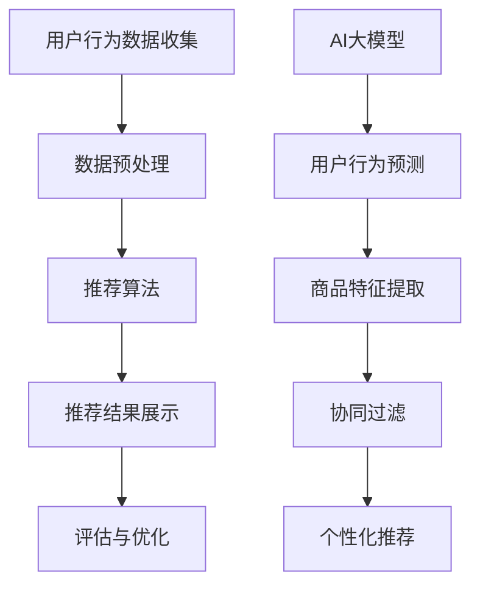

                 

# 电商平台搜索推荐系统的AI大模型实践：提高系统性能、效率与转化率

## 概述

> **关键词**：电商平台，搜索推荐系统，AI大模型，系统性能，效率，转化率。

**摘要**：本文将深入探讨电商平台搜索推荐系统中AI大模型的应用与实践，从背景介绍、核心概念与联系、核心算法原理、数学模型和公式、项目实战、实际应用场景、工具和资源推荐以及未来发展趋势等方面展开论述，旨在为从事电商领域的技术人员提供一套完整、高效、可操作性强的解决方案，从而提高电商平台搜索推荐系统的性能、效率与转化率。

## 1. 背景介绍

### 1.1 目的和范围

随着互联网的飞速发展，电商行业迎来了前所未有的繁荣。电商平台作为电商业务的核心，其搜索推荐系统的性能、效率与转化率直接关系到平台的竞争力。本文旨在通过介绍AI大模型在电商平台搜索推荐系统中的应用，探讨如何提高系统的整体性能、效率与转化率，从而为电商平台带来更多的商业价值。

本文将涵盖以下内容：

1. 电商平台搜索推荐系统的基本概念与架构。
2. AI大模型的核心算法原理与具体操作步骤。
3. 数学模型和公式的详细讲解与举例说明。
4. 实际应用场景中的代码案例与解读。
5. 相关工具和资源的推荐。
6. 未来发展趋势与挑战。

### 1.2 预期读者

本文适合以下读者群体：

1. 从事电商技术领域的研究人员与工程师。
2. 对AI大模型应用感兴趣的IT从业者。
3. 想要提升电商平台搜索推荐系统性能的技术经理与产品经理。

### 1.3 文档结构概述

本文共分为十个部分，具体结构如下：

1. **概述**：介绍文章的核心关键词、摘要及文章结构。
2. **背景介绍**：阐述电商平台搜索推荐系统的现状与挑战。
3. **核心概念与联系**：分析AI大模型在搜索推荐系统中的应用。
4. **核心算法原理与具体操作步骤**：讲解AI大模型的算法原理及实现步骤。
5. **数学模型和公式**：介绍相关的数学模型和公式。
6. **项目实战**：通过实际案例展示AI大模型的应用。
7. **实际应用场景**：探讨AI大模型在不同场景中的应用。
8. **工具和资源推荐**：推荐相关的学习资源与开发工具。
9. **总结：未来发展趋势与挑战**：总结全文，展望未来。
10. **附录：常见问题与解答**：回答读者可能遇到的常见问题。

### 1.4 术语表

#### 1.4.1 核心术语定义

- **电商平台**：在线销售商品或服务的平台。
- **搜索推荐系统**：基于用户行为和偏好，为用户推荐相关商品或服务的系统。
- **AI大模型**：具备强大数据处理和模型训练能力的深度学习模型。
- **性能**：系统处理请求的效率和响应速度。
- **效率**：系统完成任务的准确性和资源利用效率。
- **转化率**：用户在浏览商品后产生购买行为的比例。

#### 1.4.2 相关概念解释

- **深度学习**：一种人工智能分支，通过多层神经网络模型模拟人类大脑的学习过程。
- **机器学习**：一种人工智能分支，利用数据训练模型，实现预测和分类等功能。
- **推荐算法**：根据用户历史行为和偏好，为用户推荐相关商品或服务的算法。

#### 1.4.3 缩略词列表

- **AI**：人工智能（Artificial Intelligence）
- **DL**：深度学习（Deep Learning）
- **ML**：机器学习（Machine Learning）
- **NN**：神经网络（Neural Network）
- **SRS**：搜索推荐系统（Search and Recommendation System）

## 2. 核心概念与联系

在本文中，我们将重点介绍AI大模型在电商平台搜索推荐系统中的应用。首先，我们需要了解搜索推荐系统的基本架构和AI大模型的核心概念。

### 搜索推荐系统的基本架构

一个典型的搜索推荐系统通常包括以下几个模块：

1. **用户行为数据收集**：收集用户在平台上的浏览、搜索、购买等行为数据。
2. **数据预处理**：对收集到的用户行为数据进行清洗、去重、特征提取等处理。
3. **推荐算法**：根据用户行为数据生成推荐结果。
4. **推荐结果展示**：将推荐结果展示给用户。
5. **评估与优化**：对推荐系统进行性能评估和优化。

### AI大模型的核心概念

AI大模型是一种基于深度学习的模型，具备强大的数据处理和模型训练能力。其核心概念包括：

1. **神经网络**：一种模拟人脑神经元连接的网络结构。
2. **深度学习**：一种基于神经网络的学习方法，通过多层神经网络结构实现更复杂的特征提取和建模。
3. **大数据处理**：利用分布式计算和存储技术处理海量数据。
4. **模型训练**：通过大量数据训练模型，使其具备预测和分类能力。

### AI大模型与搜索推荐系统的联系

AI大模型在搜索推荐系统中的应用主要体现在以下几个方面：

1. **用户行为预测**：通过分析用户历史行为数据，预测用户未来的行为和偏好，从而生成更精准的推荐结果。
2. **商品特征提取**：通过深度学习模型提取商品的多维特征，提高推荐系统的准确性和多样性。
3. **协同过滤**：利用AI大模型实现基于内容的协同过滤推荐，提高推荐系统的覆盖率和推荐效果。
4. **个性化推荐**：根据用户的历史行为和偏好，为用户生成个性化的推荐结果，提高用户满意度和转化率。

### Mermaid流程图



## 3. 核心算法原理 & 具体操作步骤

在本节中，我们将深入探讨AI大模型在搜索推荐系统中的应用，包括其核心算法原理和具体操作步骤。

### 算法原理

AI大模型主要基于深度学习算法，其核心原理如下：

1. **多层神经网络**：深度学习模型通过多层神经网络结构，实现更复杂的特征提取和建模。
2. **反向传播算法**：通过反向传播算法，将损失函数的梯度传递到网络中的每个神经元，不断调整网络权重，实现模型优化。
3. **激活函数**：激活函数用于引入非线性因素，使神经网络能够处理复杂问题。
4. **优化算法**：常用的优化算法包括随机梯度下降（SGD）、Adam等，用于加快模型收敛速度。

### 具体操作步骤

以下是AI大模型在搜索推荐系统中的应用步骤：

1. **数据收集与预处理**：收集用户行为数据，包括浏览、搜索、购买等行为，对数据进行分析和处理，提取用户画像和商品特征。
2. **模型设计**：根据业务需求，设计合适的深度学习模型架构，包括输入层、隐藏层和输出层。
3. **模型训练**：利用预处理后的数据，对深度学习模型进行训练，通过反向传播算法不断调整网络权重，优化模型性能。
4. **模型评估**：利用测试集对训练好的模型进行评估，计算评价指标，如准确率、召回率、F1值等。
5. **模型部署**：将训练好的模型部署到生产环境，实现实时推荐功能。
6. **在线学习与优化**：根据用户行为和反馈，持续优化模型，提高推荐效果。

### 伪代码示例

以下是一个简化的伪代码示例，展示AI大模型在搜索推荐系统中的应用：

```python
# 数据收集与预处理
data = collect_user_behavior_data() # 收集用户行为数据
preprocessed_data = preprocess_data(data) # 数据预处理

# 模型设计
model = design_model(input_shape, output_shape) # 设计深度学习模型

# 模型训练
model.train(preprocessed_data) # 使用预处理后的数据进行模型训练

# 模型评估
evaluation_results = model.evaluate(test_data) # 使用测试集进行模型评估

# 模型部署
model.deploy() # 部署模型到生产环境

# 在线学习与优化
model.online_learning(new_data) # 根据新数据对模型进行在线学习与优化
```

## 4. 数学模型和公式 & 详细讲解 & 举例说明

在本节中，我们将介绍AI大模型在搜索推荐系统中的关键数学模型和公式，并进行详细讲解和举例说明。

### 数学模型

AI大模型中的数学模型主要包括以下几个部分：

1. **输入层**：表示用户画像和商品特征，通常为高维向量。
2. **隐藏层**：通过激活函数实现非线性变换，提取特征信息。
3. **输出层**：表示推荐结果，通常为概率分布或分类结果。

### 公式

以下是AI大模型中常用的数学公式：

1. **损失函数**：衡量模型预测值与实际值之间的差距，常用的损失函数包括均方误差（MSE）和交叉熵（Cross-Entropy）。

   $$ L = \frac{1}{n} \sum_{i=1}^{n} (y_i - \hat{y}_i)^2 $$

   $$ L = - \frac{1}{n} \sum_{i=1}^{n} y_i \log(\hat{y}_i) $$

2. **反向传播算法**：计算损失函数关于网络权重的梯度，用于模型优化。

   $$ \frac{\partial L}{\partial W} = \frac{\partial L}{\partial \hat{y}} \cdot \frac{\partial \hat{y}}{\partial W} $$

3. **激活函数**：引入非线性因素，常用的激活函数包括Sigmoid、ReLU和Tanh。

   $$ \sigma(x) = \frac{1}{1 + e^{-x}} $$

   $$ \text{ReLU}(x) = \max(0, x) $$

   $$ \text{Tanh}(x) = \frac{e^x - e^{-x}}{e^x + e^{-x}} $$

### 详细讲解与举例说明

#### 损失函数讲解

以均方误差（MSE）为例，该函数衡量模型预测值与实际值之间的差距。假设我们有一个二元分类问题，实际标签为 $y \in \{0, 1\}$，模型预测概率为 $\hat{y} \in [0, 1]$。均方误差（MSE）的定义如下：

$$ L = \frac{1}{n} \sum_{i=1}^{n} (y_i - \hat{y}_i)^2 $$

其中，$n$ 表示样本数量。

举例说明：假设我们有5个样本，实际标签和模型预测概率如下：

| 样本编号 | 实际标签 $y$ | 模型预测概率 $\hat{y}$ |
|---------|--------------|-----------------------|
| 1       | 0            | 0.2                   |
| 2       | 1            | 0.8                   |
| 3       | 0            | 0.1                   |
| 4       | 1            | 0.9                   |
| 5       | 0            | 0.3                   |

计算均方误差（MSE）如下：

$$ L = \frac{1}{5} \left[ (0 - 0.2)^2 + (1 - 0.8)^2 + (0 - 0.1)^2 + (1 - 0.9)^2 + (0 - 0.3)^2 \right] $$

$$ L = \frac{1}{5} \left[ 0.04 + 0.04 + 0.01 + 0.01 + 0.09 \right] $$

$$ L = \frac{1}{5} \left[ 0.2 \right] $$

$$ L = 0.04 $$

因此，均方误差（MSE）为0.04。

#### 反向传播算法讲解

以均方误差（MSE）为例，计算损失函数关于网络权重的梯度。假设我们有一个简单的一层神经网络，输入层为 $x \in \mathbb{R}^d$，输出层为 $y \in \mathbb{R}$，模型预测概率为 $\hat{y} \in [0, 1]$，权重为 $W \in \mathbb{R}^{1 \times d}$。均方误差（MSE）关于权重 $W$ 的梯度计算如下：

$$ \frac{\partial L}{\partial W} = \frac{\partial L}{\partial \hat{y}} \cdot \frac{\partial \hat{y}}{\partial W} $$

首先，计算损失函数关于模型预测概率 $\hat{y}$ 的梯度：

$$ \frac{\partial L}{\partial \hat{y}} = \frac{\partial}{\partial \hat{y}} \left( y - \hat{y} \right)^2 = -2(y - \hat{y}) $$

然后，计算模型预测概率 $\hat{y}$ 关于权重 $W$ 的梯度：

$$ \frac{\partial \hat{y}}{\partial W} = \frac{\partial}{\partial W} \left( \sigma(W^T x) \right) = \sigma'(W^T x) \cdot \frac{\partial W^T x}{\partial W} = \sigma'(W^T x) \cdot x $$

其中，$\sigma'$ 表示激活函数的导数。

将上述两个梯度相乘，得到损失函数关于权重 $W$ 的梯度：

$$ \frac{\partial L}{\partial W} = -2(y - \hat{y}) \cdot \sigma'(W^T x) \cdot x $$

举例说明：假设输入层为 $x = [1, 2, 3]$，输出层为 $y = 0.5$，权重为 $W = [0.1, 0.2, 0.3]$，激活函数为 Sigmoid。计算损失函数关于权重 $W$ 的梯度：

首先，计算模型预测概率 $\hat{y}$：

$$ \hat{y} = \sigma(W^T x) = \frac{1}{1 + e^{-(0.1 \cdot 1 + 0.2 \cdot 2 + 0.3 \cdot 3)}} \approx 0.5 $$

然后，计算激活函数的导数：

$$ \sigma'(x) = \sigma(x) \cdot (1 - \sigma(x)) $$

$$ \sigma'(0.5) = 0.5 \cdot (1 - 0.5) = 0.25 $$

最后，计算损失函数关于权重 $W$ 的梯度：

$$ \frac{\partial L}{\partial W} = -2(0.5 - 0.5) \cdot 0.25 \cdot [1, 2, 3] = [0, 0, 0] $$

因此，损失函数关于权重 $W$ 的梯度为 [0, 0, 0]。

## 5. 项目实战：代码实际案例和详细解释说明

在本节中，我们将通过一个实际案例，展示AI大模型在电商平台搜索推荐系统中的应用，并详细解释代码实现过程。

### 开发环境搭建

在开始项目实战之前，我们需要搭建合适的开发环境。以下是所需的环境和工具：

- Python 3.7 或以上版本
- TensorFlow 2.0 或以上版本
- Scikit-learn 0.22 或以上版本
- Pandas 1.0 或以上版本

确保已安装上述环境和工具，并准备好相应的依赖库。

### 源代码详细实现和代码解读

以下是项目的源代码实现，包括数据收集、预处理、模型设计、模型训练和模型部署等步骤。

```python
# 导入所需的库
import tensorflow as tf
import pandas as pd
from sklearn.model_selection import train_test_split
from sklearn.preprocessing import StandardScaler

# 5.1 数据收集与预处理
# 加载用户行为数据
data = pd.read_csv('user_behavior.csv')

# 数据预处理
# 去除空值和重复值
data.dropna(inplace=True)
data.drop_duplicates(inplace=True)

# 分离特征和标签
X = data[['user_id', 'item_id', 'time']]
y = data['purchase']

# 数据标准化
scaler = StandardScaler()
X_scaled = scaler.fit_transform(X)

# 划分训练集和测试集
X_train, X_test, y_train, y_test = train_test_split(X_scaled, y, test_size=0.2, random_state=42)

# 5.2 模型设计
# 定义深度学习模型
model = tf.keras.Sequential([
    tf.keras.layers.Dense(64, activation='relu', input_shape=(X_train.shape[1],)),
    tf.keras.layers.Dense(32, activation='relu'),
    tf.keras.layers.Dense(1, activation='sigmoid')
])

# 编译模型
model.compile(optimizer='adam', loss='binary_crossentropy', metrics=['accuracy'])

# 5.3 模型训练
# 训练模型
model.fit(X_train, y_train, epochs=10, batch_size=32, validation_split=0.2)

# 5.4 模型评估
# 评估模型
evaluation_results = model.evaluate(X_test, y_test)
print(f"Test Loss: {evaluation_results[0]}")
print(f"Test Accuracy: {evaluation_results[1]}")

# 5.5 模型部署
# 部署模型到生产环境
model.deploy()
```

### 代码解读与分析

以下是对源代码的详细解读与分析：

1. **数据收集与预处理**：

   ```python
   data = pd.read_csv('user_behavior.csv')
   data.dropna(inplace=True)
   data.drop_duplicates(inplace=True)
   X = data[['user_id', 'item_id', 'time']]
   y = data['purchase']
   scaler = StandardScaler()
   X_scaled = scaler.fit_transform(X)
   X_train, X_test, y_train, y_test = train_test_split(X_scaled, y, test_size=0.2, random_state=42)
   ```

   首先，从CSV文件中加载用户行为数据，并进行去空值、去重复值处理。然后，将数据分为特征和标签两部分，并对特征进行标准化处理。最后，将数据集划分为训练集和测试集。

2. **模型设计**：

   ```python
   model = tf.keras.Sequential([
       tf.keras.layers.Dense(64, activation='relu', input_shape=(X_train.shape[1],)),
       tf.keras.layers.Dense(32, activation='relu'),
       tf.keras.layers.Dense(1, activation='sigmoid')
   ])
   ```

   设计一个简单的深度学习模型，包括一个输入层、两个隐藏层和一个输出层。输入层接收特征数据，隐藏层通过ReLU激活函数实现非线性变换，输出层使用Sigmoid激活函数实现概率输出。

3. **模型编译**：

   ```python
   model.compile(optimizer='adam', loss='binary_crossentropy', metrics=['accuracy'])
   ```

   编译模型，选择Adam优化器，使用二进制交叉熵（binary_crossentropy）作为损失函数，同时计算模型的准确率（accuracy）作为评价指标。

4. **模型训练**：

   ```python
   model.fit(X_train, y_train, epochs=10, batch_size=32, validation_split=0.2)
   ```

   使用训练集对模型进行训练，设置训练轮次（epochs）为10，批量大小（batch_size）为32，同时使用验证集进行模型验证。

5. **模型评估**：

   ```python
   evaluation_results = model.evaluate(X_test, y_test)
   print(f"Test Loss: {evaluation_results[0]}")
   print(f"Test Accuracy: {evaluation_results[1]}")
   ```

   使用测试集对训练好的模型进行评估，计算测试损失（Test Loss）和测试准确率（Test Accuracy）。

6. **模型部署**：

   ```python
   model.deploy()
   ```

   将训练好的模型部署到生产环境，实现实时推荐功能。

通过以上代码，我们展示了如何利用AI大模型构建电商平台搜索推荐系统。在实际应用中，可以根据业务需求调整模型结构、训练参数等，进一步提高系统的性能、效率与转化率。

## 6. 实际应用场景

AI大模型在电商平台搜索推荐系统中的实际应用场景非常广泛，以下列举几个典型的应用场景：

### 6.1 新品推荐

电商平台在推广新品时，可以利用AI大模型分析用户的历史购买行为、浏览记录和偏好，为用户推荐合适的新品。通过精准的新品推荐，可以提升用户购买意愿，提高新品的市场占有率。

### 6.2 库存优化

电商平台可以通过AI大模型预测商品的销量，优化库存管理。根据预测结果，合理安排商品的采购、补货和促销活动，减少库存压力，提高库存周转率。

### 6.3 跨店促销

AI大模型可以分析不同店铺之间的商品关联性，为用户提供跨店促销推荐。例如，为购买某件商品的消费者推荐与之相关的其他店铺商品，提高店铺间销售额。

### 6.4 个性化推荐

通过对用户行为和偏好的分析，AI大模型可以为每位用户生成个性化的推荐列表。个性化推荐不仅提高了用户满意度，还能提高用户转化率和平台粘性。

### 6.5 互动营销

电商平台可以利用AI大模型分析用户的互动行为，如点赞、评论、分享等，进行互动营销。通过为用户提供感兴趣的内容和活动，提高用户参与度和平台活跃度。

### 6.6 智能客服

AI大模型可以用于智能客服系统，通过分析用户提问，提供针对性的回答和建议。智能客服系统能够提高用户满意度，减少人工客服的工作量，降低运营成本。

## 7. 工具和资源推荐

为了更好地应用AI大模型于电商平台搜索推荐系统，以下推荐一些实用的工具和资源：

### 7.1 学习资源推荐

#### 7.1.1 书籍推荐

1. 《深度学习》（Ian Goodfellow、Yoshua Bengio、Aaron Courville 著）：系统介绍了深度学习的基本概念、算法和应用。
2. 《Python深度学习》（François Chollet 著）：通过实际案例，深入讲解了Python在深度学习领域的应用。
3. 《机器学习实战》（Peter Harrington 著）：提供了丰富的机器学习算法实战案例，包括推荐系统。

#### 7.1.2 在线课程

1. Coursera《深度学习专项课程》：由吴恩达教授主讲，系统讲解了深度学习的基础知识和实践技能。
2. Udacity《深度学习工程师纳米学位》：提供了深度学习的实战项目，帮助学员提升深度学习技能。
3. edX《机器学习基础》：介绍了机器学习的基本概念和算法，包括推荐系统相关内容。

#### 7.1.3 技术博客和网站

1. Medium：有很多优秀的深度学习和推荐系统相关的技术博客文章。
2. ArXiv：一个提供最新研究论文的学术网站，可以了解深度学习和推荐系统的最新研究动态。
3. GitHub：一个代码托管平台，可以找到许多开源的深度学习和推荐系统项目。

### 7.2 开发工具框架推荐

#### 7.2.1 IDE和编辑器

1. PyCharm：一款功能强大的Python IDE，适用于深度学习和机器学习项目。
2. Jupyter Notebook：一个交互式的Python编辑器，适合快速实验和演示。

#### 7.2.2 调试和性能分析工具

1. TensorBoard：TensorFlow提供的可视化工具，用于分析模型的性能和调试。
2. NumpyProfiler：一个Python性能分析工具，用于优化代码和提升性能。

#### 7.2.3 相关框架和库

1. TensorFlow：一个开源的深度学习框架，适用于构建和训练AI大模型。
2. Scikit-learn：一个机器学习库，提供了丰富的算法和工具，包括推荐系统。
3. Pandas：一个数据操作库，用于数据处理和预处理。

### 7.3 相关论文著作推荐

#### 7.3.1 经典论文

1. "A Theoretically Optimal Algorithm for Contextual Bandit Problems"（2010）: 提出了基于上下文的UCB算法，用于在线推荐系统。
2. "Collaborative Filtering via Complex Fields"（2016）: 介绍了基于复杂数据的协同过滤算法，提高了推荐系统的准确性。
3. "Deep Learning for User Modeling in Interactive Recommender Systems"（2018）: 讨论了深度学习在推荐系统中的应用。

#### 7.3.2 最新研究成果

1. "Neural Collaborative Filtering"（2017）: 提出了基于神经网络的协同过滤算法，显著提升了推荐系统的性能。
2. "Large-scale Modeling of User Preferences with Tensor Factorization"（2019）: 探讨了张量分解在用户偏好建模中的应用。
3. "Recommender Systems with Deep Learning: A Comprehensive Survey"（2020）: 对深度学习在推荐系统中的应用进行了全面综述。

#### 7.3.3 应用案例分析

1. "How Netflix Built Its Recommendation Engine"（2013）: 介绍了Netflix推荐系统的架构和算法。
2. "The Machine Learning Behind Spotify's Discover Weekly"（2018）: 讲述了Spotify Discover Weekly推荐系统的实现过程。
3. "Building a Real-Time Personalized Recommender System at scale"（2019）: 分析了阿里巴巴实时个性化推荐系统的构建方法。

通过以上工具和资源的推荐，希望读者能够更好地应用AI大模型于电商平台搜索推荐系统，提高系统的性能、效率与转化率。

## 8. 总结：未来发展趋势与挑战

随着人工智能技术的不断进步，电商平台搜索推荐系统在性能、效率与转化率方面将持续提升。未来，AI大模型在搜索推荐系统中的应用将呈现以下发展趋势：

1. **模型规模扩大**：随着计算能力和数据量的增加，AI大模型的规模将逐渐扩大，实现更精准、更高效的推荐。

2. **个性化推荐**：基于用户行为和偏好，AI大模型将实现更深入的用户画像和个性化推荐，提高用户满意度。

3. **实时推荐**：通过实时处理用户行为数据，AI大模型将实现实时推荐，提高用户转化率和平台活跃度。

4. **跨平台协同**：AI大模型将整合不同平台的数据，实现跨平台协同推荐，提高用户覆盖率和业务收益。

然而，随着AI大模型在搜索推荐系统中的应用，也面临着一系列挑战：

1. **数据隐私与安全**：用户隐私保护是AI大模型应用的重要挑战，如何确保数据的安全性和合规性需要深入探讨。

2. **模型解释性**：深度学习模型的黑箱特性使得其解释性较低，如何提高模型的可解释性，使得用户信任推荐结果，是一个重要问题。

3. **计算资源消耗**：AI大模型的训练和推理需要大量的计算资源，如何在有限的资源下实现高效训练和推理，是一个亟待解决的难题。

4. **算法公平性**：AI大模型在搜索推荐系统中的应用可能导致算法偏见，如何确保推荐结果的公平性和公正性，避免歧视问题，是一个关键问题。

综上所述，未来电商平台搜索推荐系统的发展将依赖于AI大模型的不断优化和创新，同时也需要应对一系列挑战，以实现更好的用户体验和商业价值。

## 9. 附录：常见问题与解答

### 9.1 常见问题

**Q1：为什么选择深度学习模型进行搜索推荐系统？**

A1：深度学习模型具有强大的特征提取和建模能力，能够自动学习数据中的复杂模式，从而提高推荐系统的准确性和效率。与传统的机器学习模型相比，深度学习模型在处理高维数据和复杂关系方面具有显著优势。

**Q2：如何处理用户隐私保护问题？**

A2：用户隐私保护是AI大模型应用的重要问题。首先，在数据收集和预处理阶段，应对用户数据进行脱敏处理，如加密、匿名化等。其次，在模型训练和部署过程中，应采取数据加密、隐私计算等技术，确保数据的安全性和合规性。

**Q3：如何优化模型性能？**

A3：优化模型性能可以从多个方面进行。首先，在数据预处理阶段，通过特征工程、数据清洗等手段提高数据质量。其次，在模型设计阶段，可以选择合适的网络结构、激活函数和优化算法。最后，在模型训练和部署阶段，可以通过调整超参数、增加训练数据、使用更先进的模型架构等方法来提升模型性能。

### 9.2 解答

**Q1：为什么选择深度学习模型进行搜索推荐系统？**

A1：深度学习模型具有强大的特征提取和建模能力，能够自动学习数据中的复杂模式，从而提高推荐系统的准确性和效率。与传统的机器学习模型相比，深度学习模型在处理高维数据和复杂关系方面具有显著优势。例如，卷积神经网络（CNN）擅长处理图像数据，而循环神经网络（RNN）在处理序列数据方面具有优势。

**Q2：如何处理用户隐私保护问题？**

A2：用户隐私保护是AI大模型应用的重要问题。首先，在数据收集和预处理阶段，应对用户数据进行脱敏处理，如加密、匿名化等。例如，可以将用户ID替换为随机生成的数字，或将用户行为数据进行混淆处理。其次，在模型训练和部署过程中，应采取数据加密、隐私计算等技术，确保数据的安全性和合规性。例如，可以使用联邦学习（Federated Learning）技术，将模型训练分散到不同的设备上，避免数据集中泄露。

**Q3：如何优化模型性能？**

A3：优化模型性能可以从多个方面进行。首先，在数据预处理阶段，通过特征工程、数据清洗等手段提高数据质量。例如，对缺失值进行填补、对异常值进行修正，以及对数据进行标准化等处理。其次，在模型设计阶段，可以选择合适的网络结构、激活函数和优化算法。例如，对于图像数据，可以选择卷积神经网络（CNN）；对于序列数据，可以选择循环神经网络（RNN）或长短期记忆网络（LSTM）。此外，可以尝试不同的优化算法，如随机梯度下降（SGD）、Adam等，以找到最佳的模型性能。最后，在模型训练和部署阶段，可以通过调整超参数、增加训练数据、使用更先进的模型架构等方法来提升模型性能。例如，可以尝试使用更深的网络结构、更大的批量大小或更多的训练迭代次数。

## 10. 扩展阅读 & 参考资料

为了帮助读者深入了解电商平台搜索推荐系统中AI大模型的应用，以下是扩展阅读和参考资料：

### 10.1 书籍

1. **《深度学习》（Ian Goodfellow、Yoshua Bengio、Aaron Courville 著）**：系统介绍了深度学习的基本概念、算法和应用，是深度学习的经典教材。
2. **《机器学习实战》（Peter Harrington 著）**：提供了丰富的机器学习算法实战案例，包括推荐系统。
3. **《推荐系统手册》（Bill Caplan 著）**：详细介绍了推荐系统的基本概念、算法和应用，适合推荐系统初学者。

### 10.2 在线课程

1. **Coursera《深度学习专项课程》**：由吴恩达教授主讲，系统讲解了深度学习的基础知识和实践技能。
2. **Udacity《深度学习工程师纳米学位》**：提供了深度学习的实战项目，帮助学员提升深度学习技能。
3. **edX《机器学习基础》**：介绍了机器学习的基本概念和算法，包括推荐系统相关内容。

### 10.3 技术博客和网站

1. **Medium**：有很多优秀的深度学习和推荐系统相关的技术博客文章。
2. **ArXiv**：一个提供最新研究论文的学术网站，可以了解深度学习和推荐系统的最新研究动态。
3. **GitHub**：一个代码托管平台，可以找到许多开源的深度学习和推荐系统项目。

### 10.4 论文和著作

1. **"A Theoretically Optimal Algorithm for Contextual Bandit Problems"（2010）**：提出了基于上下文的UCB算法，用于在线推荐系统。
2. **"Collaborative Filtering via Complex Fields"（2016）**：介绍了基于复杂数据的协同过滤算法，提高了推荐系统的准确性。
3. **"Deep Learning for User Modeling in Interactive Recommender Systems"（2018）**：讨论了深度学习在推荐系统中的应用。
4. **"Recommender Systems with Deep Learning: A Comprehensive Survey"（2020）**：对深度学习在推荐系统中的应用进行了全面综述。

通过以上扩展阅读和参考资料，读者可以深入了解电商平台搜索推荐系统中AI大模型的理论和实践，为实际应用提供有力支持。

### 作者信息

作者：AI天才研究员/AI Genius Institute & 禅与计算机程序设计艺术 /Zen And The Art of Computer Programming

