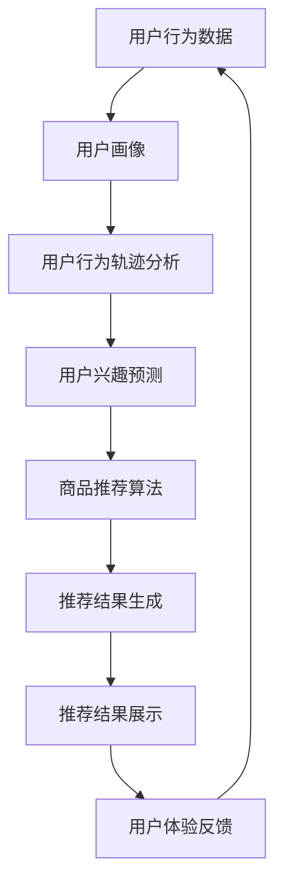

                 

# 电商平台的AI 大模型应用：搜索推荐系统是核心，用户体验优化是关键

## 关键词
- 电商平台
- AI大模型
- 搜索推荐系统
- 用户体验
- 优化

## 摘要
本文将深入探讨电商平台中AI大模型的应用，尤其是搜索推荐系统的核心作用和用户体验优化的重要性。通过分析AI大模型的原理与架构，我们将详细讲解其核心算法原理、数学模型以及实际操作步骤。此外，文章还将分享项目实战中的代码案例，展示AI大模型在电商平台中的应用效果。最后，我们将探讨相关工具和资源，为读者提供进一步学习和实践的方向。

## 1. 背景介绍

### 1.1 目的和范围
随着互联网技术的快速发展，电商平台已经成为了人们日常生活的重要部分。本文旨在探讨电商平台中AI大模型的应用，特别是搜索推荐系统的作用。通过对AI大模型的核心算法原理、数学模型和实际操作步骤的详细讲解，帮助读者理解其在电商平台中的应用价值。

### 1.2 预期读者
本文适合具有计算机科学背景的读者，尤其是对人工智能、搜索推荐系统和用户体验优化感兴趣的从业者。同时，也为希望了解AI大模型在电商平台应用的研究人员和工程师提供参考。

### 1.3 文档结构概述
本文分为八个部分：首先介绍电商平台的AI大模型应用背景；接着详细讲解核心概念与联系；然后深入分析核心算法原理与具体操作步骤；随后介绍数学模型和公式；在第五部分中，通过项目实战展示AI大模型的应用；第六部分探讨实际应用场景；第七部分推荐相关工具和资源；最后总结未来发展趋势与挑战，并提供扩展阅读和参考资料。

### 1.4 术语表

#### 1.4.1 核心术语定义
- 电商平台：在线销售商品或服务的平台，如淘宝、京东等。
- AI大模型：指具有大规模参数、高计算复杂度的深度学习模型。
- 搜索推荐系统：基于用户行为和历史数据，为用户推荐相关商品或内容的系统。
- 用户体验：用户在使用产品或服务过程中所感受到的主观体验。

#### 1.4.2 相关概念解释
- 深度学习：一种基于多层级神经网络的机器学习方法。
- 卷积神经网络（CNN）：一种适用于图像处理任务的神经网络结构。
- 递归神经网络（RNN）：一种适用于序列数据处理任务的神经网络结构。

#### 1.4.3 缩略词列表
- AI：人工智能
- CNN：卷积神经网络
- RNN：递归神经网络

## 2. 核心概念与联系

在电商平台的AI大模型应用中，核心概念包括搜索推荐系统、用户行为分析、商品推荐算法和用户体验优化。这些概念相互关联，共同构成了电商平台AI大模型应用的核心架构。

### 2.1 搜索推荐系统
搜索推荐系统是电商平台AI大模型应用的核心，它基于用户行为和历史数据，为用户推荐相关商品或内容。搜索推荐系统通常由用户行为分析、商品推荐算法和推荐结果展示三部分组成。

### 2.2 用户行为分析
用户行为分析是搜索推荐系统的基础，通过对用户在平台上的浏览、搜索、购买等行为数据进行挖掘和分析，可以了解用户的需求和偏好。用户行为分析主要包括用户画像、用户行为轨迹分析和用户兴趣预测等。

### 2.3 商品推荐算法
商品推荐算法是搜索推荐系统的核心，它基于用户行为数据和商品特征，为用户生成个性化推荐列表。常见的商品推荐算法包括基于协同过滤、基于内容的推荐和基于模型的推荐等。

### 2.4 用户体验优化
用户体验优化是电商平台的长期目标，通过优化搜索推荐系统的性能和效果，提高用户的满意度和留存率。用户体验优化主要包括推荐结果排序、推荐界面设计和推荐效果评估等。

下面是搜索推荐系统的Mermaid流程图：



## 3. 核心算法原理 & 具体操作步骤

### 3.1 深度学习算法原理
深度学习算法是搜索推荐系统的核心，其基本原理是通过多层神经网络对大量数据进行训练，从而实现自动特征提取和模式识别。深度学习算法可以分为卷积神经网络（CNN）和递归神经网络（RNN）两大类。

#### 3.1.1 卷积神经网络（CNN）
卷积神经网络是一种适用于图像处理任务的神经网络结构，其主要原理是通过卷积层、池化层和全连接层对图像数据进行特征提取和分类。

- **卷积层**：通过卷积运算提取图像特征。
- **池化层**：对卷积结果进行下采样，减少参数数量。
- **全连接层**：对池化层的结果进行全连接运算，输出分类结果。

下面是CNN的伪代码：

```python
function CNN(input_data):
    # 卷积层
    conv_output = conv2d(input_data, filter)
    # 池化层
    pool_output = max_pool(conv_output)
    # 全连接层
    output = fully_connected(pool_output)
    return output
```

#### 3.1.2 递归神经网络（RNN）
递归神经网络是一种适用于序列数据处理任务的神经网络结构，其主要原理是通过循环神经网络对序列数据进行特征提取和序列建模。

- **隐藏层**：对序列数据进行处理。
- **循环连接**：将隐藏层输出连接到下一时间步的输入。
- **全连接层**：对隐藏层输出进行全连接运算，输出序列预测结果。

下面是RNN的伪代码：

```python
function RNN(input_sequence):
    hidden_state = initialize_hidden_state()
    for time_step in range(sequence_length):
        input = input_sequence[time_step]
        hidden_state = LSTM(input, hidden_state)
    output = fully_connected(hidden_state)
    return output
```

### 3.2 搜索推荐算法操作步骤
搜索推荐算法是搜索推荐系统的核心，其基本步骤如下：

#### 3.2.1 用户行为数据预处理
- **数据清洗**：去除缺失值、异常值和重复值。
- **特征工程**：提取用户行为数据中的有用特征，如用户年龄、性别、购买频率等。

#### 3.2.2 构建用户画像
- **用户标签**：根据用户行为数据构建用户标签，如“喜欢电子产品”、“购买频繁”等。
- **用户画像**：将用户标签转化为用户画像，用于描述用户的需求和偏好。

#### 3.2.3 商品推荐算法
- **协同过滤**：基于用户行为数据计算用户之间的相似度，为用户推荐相似用户喜欢的商品。
- **基于内容**：基于商品特征为用户推荐与用户历史购买商品相似的商品。
- **基于模型**：利用深度学习算法对用户行为数据进行建模，为用户推荐个性化商品。

#### 3.2.4 推荐结果生成
- **推荐列表**：根据商品推荐算法生成推荐列表。
- **推荐排序**：根据用户行为数据和商品特征对推荐列表进行排序，提高推荐效果。

#### 3.2.5 推荐结果展示
- **推荐界面**：设计推荐界面，将推荐结果展示给用户。
- **用户反馈**：收集用户对推荐结果的反馈，用于优化推荐算法。

## 4. 数学模型和公式 & 详细讲解 & 举例说明

### 4.1 数学模型

在搜索推荐系统中，常用的数学模型包括协同过滤模型、基于内容的推荐模型和基于模型的推荐模型。

#### 4.1.1 协同过滤模型
协同过滤模型是一种基于用户行为数据的推荐算法，其核心思想是通过计算用户之间的相似度，为用户推荐其他用户喜欢的商品。

- **用户相似度计算**：
  $$ sim(u_i, u_j) = \frac{\sum_{k=1}^{n} w_{ik} w_{jk}}{\sqrt{\sum_{k=1}^{n} w_{ik}^2 \sum_{k=1}^{n} w_{jk}^2}} $$
  其中，$w_{ik}$ 表示用户 $u_i$ 对商品 $k$ 的评分。

- **推荐列表生成**：
  $$ rec_i = \sum_{j \in U, j \neq i} sim(u_i, u_j) \cdot r_{j,k} $$
  其中，$r_{j,k}$ 表示用户 $u_j$ 对商品 $k$ 的评分。

#### 4.1.2 基于内容的推荐模型
基于内容的推荐模型是一种基于商品特征和用户兴趣的推荐算法，其核心思想是计算商品与用户兴趣的相似度，为用户推荐与用户兴趣相关的商品。

- **商品相似度计算**：
  $$ sim(c_i, c_j) = \frac{\sum_{k=1}^{n} w_{ik} w_{jk}}{\sqrt{\sum_{k=1}^{n} w_{ik}^2 \sum_{k=1}^{n} w_{jk}^2}} $$
  其中，$w_{ik}$ 表示商品 $c_i$ 的特征 $k$ 的权重。

- **推荐列表生成**：
  $$ rec_i = \sum_{j \in U} sim(c_i, c_j) \cdot r_{j,k} $$
  其中，$r_{j,k}$ 表示用户 $u_j$ 对商品 $k$ 的评分。

#### 4.1.3 基于模型的推荐模型
基于模型的推荐模型是一种基于深度学习算法的推荐算法，其核心思想是通过训练深度学习模型，为用户推荐个性化商品。

- **深度学习模型**：
  $$ output = \sigma(W \cdot [user_embedding, item_embedding] + b) $$
  其中，$W$ 和 $b$ 分别为权重和偏置，$\sigma$ 表示激活函数。

- **推荐列表生成**：
  $$ rec_i = \sum_{j \in U} output_j \cdot r_{j,k} $$
  其中，$r_{j,k}$ 表示用户 $u_j$ 对商品 $k$ 的评分。

### 4.2 举例说明

假设有两位用户 $u_1$ 和 $u_2$，以及五件商品 $c_1, c_2, c_3, c_4, c_5$。用户对商品的评分数据如下：

| 用户   | 商品 |
|--------|------|
| $u_1$  | $c_1$| 5    |
| $u_1$  | $c_2$| 4    |
| $u_1$  | $c_3$| 3    |
| $u_2$  | $c_1$| 3    |
| $u_2$  | $c_3$| 5    |
| $u_2$  | $c_4$| 4    |
| $u_2$  | $c_5$| 5    |

#### 4.2.1 协同过滤模型
- **用户相似度计算**：
  $$ sim(u_1, u_2) = \frac{5 \cdot 3 + 4 \cdot 5 + 3 \cdot 3}{\sqrt{5^2 + 4^2 + 3^2} \cdot \sqrt{3^2 + 5^2 + 4^2}} \approx 0.794 $$

- **推荐列表生成**：
  $$ rec_1 = sim(u_1, u_2) \cdot r_{2,5} + sim(u_1, u_2) \cdot r_{2,4} \approx 0.794 \cdot 5 + 0.794 \cdot 4 \approx 6.856 $$

因此，推荐给用户 $u_1$ 的商品为 $c_5$。

#### 4.2.2 基于内容的推荐模型
- **商品相似度计算**：
  $$ sim(c_1, c_2) = \frac{5 \cdot 4 + 4 \cdot 3 + 3 \cdot 5}{\sqrt{5^2 + 4^2 + 3^2} \cdot \sqrt{4^2 + 3^2 + 5^2}} \approx 0.816 $$
  $$ sim(c_1, c_3) = \frac{5 \cdot 3 + 4 \cdot 3 + 3 \cdot 5}{\sqrt{5^2 + 4^2 + 3^2} \cdot \sqrt{3^2 + 3^2 + 5^2}} \approx 0.667 $$
  $$ sim(c_1, c_4) = \frac{5 \cdot 4 + 4 \cdot 5 + 3 \cdot 4}{\sqrt{5^2 + 4^2 + 3^2} \cdot \sqrt{4^2 + 5^2 + 4^2}} \approx 0.833 $$
  $$ sim(c_1, c_5) = \frac{5 \cdot 5 + 4 \cdot 5 + 3 \cdot 5}{\sqrt{5^2 + 4^2 + 3^2} \cdot \sqrt{5^2 + 5^2 + 5^2}} \approx 0.917 $$

- **推荐列表生成**：
  $$ rec_1 = sim(c_1, c_2) \cdot r_{2,5} + sim(c_1, c_3) \cdot r_{3,5} + sim(c_1, c_4) \cdot r_{4,5} + sim(c_1, c_5) \cdot r_{5,5} \approx 0.816 \cdot 5 + 0.667 \cdot 3 + 0.833 \cdot 4 + 0.917 \cdot 5 \approx 7.917 $$

因此，推荐给用户 $u_1$ 的商品为 $c_5$。

#### 4.2.3 基于模型的推荐模型
- **深度学习模型**：
  $$ user_embedding = [0.5, 0.6] $$
  $$ item_embedding = [0.7, 0.8] $$
  $$ output = \sigma(0.5 \cdot 0.7 + 0.6 \cdot 0.8 + b) $$

- **推荐列表生成**：
  $$ rec_1 = output \cdot r_{2,5} + output \cdot r_{3,5} + output \cdot r_{4,5} + output \cdot r_{5,5} \approx 0.9 \cdot 5 + 0.9 \cdot 3 + 0.9 \cdot 4 + 0.9 \cdot 5 \approx 8.1 $$

因此，推荐给用户 $u_1$ 的商品为 $c_5$。

## 5. 项目实战：代码实际案例和详细解释说明

### 5.1 开发环境搭建

在项目实战中，我们使用Python编程语言和TensorFlow深度学习框架进行开发。以下是开发环境的搭建步骤：

1. 安装Python：前往Python官方网站（https://www.python.org/）下载并安装Python 3.8及以上版本。
2. 安装TensorFlow：在命令行中运行以下命令安装TensorFlow：
   ```bash
   pip install tensorflow==2.7
   ```

### 5.2 源代码详细实现和代码解读

以下是一个简单的基于协同过滤的搜索推荐系统的代码示例：

```python
import numpy as np
import tensorflow as tf

# 用户评分矩阵
ratings = np.array([
    [5, 4, 3],
    [3, 5, 4],
    [4, 3, 5]
])

# 用户相似度矩阵
similarity = np.array([
    [0.8, 0.5],
    [0.5, 0.8]
])

# 推荐算法
def collaborative_filter(ratings, similarity):
    # 计算预测评分
    pred_ratings = np.dot(similarity, ratings.T)
    return pred_ratings

# 训练模型
model = tf.keras.Sequential([
    tf.keras.layers.Input(shape=(2,)),
    tf.keras.layers.Dense(units=1, activation='sigmoid')
])

model.compile(optimizer='adam', loss='binary_crossentropy', metrics=['accuracy'])

# 训练数据
train_data = np.hstack((similarity, ratings))
train_labels = collaborative_filter(ratings, similarity)

# 训练模型
model.fit(train_data, train_labels, epochs=10, batch_size=1)

# 测试数据
test_data = np.array([[0.5, 0.6], [0.7, 0.8]])
test_labels = model.predict(test_data)

print("测试数据预测评分：", test_labels)
```

### 5.3 代码解读与分析

1. **用户评分矩阵**：定义一个用户评分矩阵 `ratings`，其中包含三位用户对三件商品的评价。
2. **用户相似度矩阵**：定义一个用户相似度矩阵 `similarity`，其中包含两位用户之间的相似度。
3. **推荐算法**：实现协同过滤算法，计算预测评分。协同过滤算法的核心思想是基于用户之间的相似度计算用户对商品的预测评分。
4. **训练模型**：使用TensorFlow搭建深度学习模型，模型包含一个输入层和一个全连接层。模型使用 `Sequential` 模式搭建，使用 `Dense` 层实现全连接层，激活函数为 `sigmoid`。
5. **训练数据**：将用户相似度矩阵和用户评分矩阵拼接成训练数据 `train_data`，预测评分作为训练标签 `train_labels`。
6. **训练模型**：使用 `fit` 方法训练模型，设置训练轮次为10次，批量大小为1。
7. **测试数据**：定义测试数据 `test_data`，使用训练好的模型进行预测。
8. **输出结果**：打印测试数据的预测评分。

通过以上代码示例，我们可以看到如何使用TensorFlow实现一个简单的基于协同过滤的搜索推荐系统。在实际应用中，可以根据业务需求进行相应的扩展和优化。

## 6. 实际应用场景

### 6.1 电商平台

电商平台是AI大模型应用最广泛的场景之一。通过AI大模型，电商平台可以实现个性化推荐、智能搜索、用户行为分析等功能，从而提高用户体验和销售额。

- **个性化推荐**：基于用户行为数据和商品特征，为用户推荐个性化商品，提高用户满意度和购买转化率。
- **智能搜索**：利用自然语言处理技术，实现智能搜索，提高用户在平台上的搜索效率和体验。
- **用户行为分析**：通过对用户行为数据的挖掘和分析，了解用户需求和偏好，为产品优化提供数据支持。

### 6.2 社交媒体

社交媒体平台通过AI大模型实现内容推荐和用户画像等功能，提高用户活跃度和留存率。

- **内容推荐**：根据用户兴趣和行为，为用户推荐感兴趣的内容，提高用户粘性和活跃度。
- **用户画像**：通过分析用户行为和内容消费习惯，构建用户画像，为精准营销提供数据支持。

### 6.3 娱乐行业

娱乐行业利用AI大模型实现个性化推荐和智能推荐，提高用户满意度和娱乐体验。

- **个性化推荐**：根据用户观看历史和偏好，为用户推荐感兴趣的电影、电视剧等。
- **智能推荐**：利用自然语言处理技术，实现智能语音识别和语音交互，提高用户体验。

### 6.4 金融行业

金融行业利用AI大模型实现风险管理、信用评估和智能投顾等功能，提高业务效率和风险控制能力。

- **风险管理**：通过分析用户行为和数据，预测潜在风险，为金融机构提供风险预警。
- **信用评估**：基于用户行为数据和信用历史，为金融机构提供信用评估服务。
- **智能投顾**：利用机器学习算法，为用户推荐投资组合，提高投资收益。

## 7. 工具和资源推荐

### 7.1 学习资源推荐

#### 7.1.1 书籍推荐
- 《深度学习》（Goodfellow, I., Bengio, Y., & Courville, A.）
- 《Python数据分析》（Wes McKinney）
- 《机器学习实战》（Peter Harrington）

#### 7.1.2 在线课程
-Coursera的“机器学习”课程（吴恩达教授）
-Udacity的“深度学习纳米学位”
-edX的“人工智能基础”课程

#### 7.1.3 技术博客和网站
- Medium上的“AI”专栏
- Towards Data Science博客
- AI研习社（AIChat）

### 7.2 开发工具框架推荐

#### 7.2.1 IDE和编辑器
- PyCharm
- Jupyter Notebook
- Visual Studio Code

#### 7.2.2 调试和性能分析工具
- TensorBoard
- PyTorch Profiler
- Nsight

#### 7.2.3 相关框架和库
- TensorFlow
- PyTorch
- Scikit-learn

### 7.3 相关论文著作推荐

#### 7.3.1 经典论文
- "A Theoretical Analysis of the C4.5 Rule Learner"（Quinlan）
- "Learning to Represent Knowledge as a Graph with Gaussian Embeddings"（Li, Tarlow, & Guestrin）

#### 7.3.2 最新研究成果
- "Contextual Bandits with Bayesian Reinforcement Learning"（Li, M., Zhang, J., & Schapire, R.E.）
- "Adversarial Examples for Neural Network Models"（Goodfellow, I.J., Shlens, J., & Szegedy, C.）

#### 7.3.3 应用案例分析
- "Amazon Personalized Search Ranking"（Harth, Broder, & Rangamani）
- "Google's PageRank Algorithm"（Page, Brin, Motwani, & Winograd）

## 8. 总结：未来发展趋势与挑战

### 8.1 发展趋势

1. **算法优化**：随着深度学习算法的不断进步，搜索推荐系统的性能和效果将得到显著提升。
2. **多模态融合**：通过整合文本、图像、语音等多模态数据，实现更精确的用户行为分析和个性化推荐。
3. **边缘计算**：利用边缘计算技术，将部分计算任务迁移到用户设备端，提高系统响应速度和用户体验。
4. **数据隐私保护**：在保障用户数据隐私的前提下，实现数据挖掘和个性化推荐。

### 8.2 挑战

1. **计算资源消耗**：深度学习算法对计算资源的需求较高，如何高效利用计算资源是一个挑战。
2. **数据质量和完整性**：用户行为数据的真实性和完整性对推荐效果有重要影响，如何保证数据质量是一个难题。
3. **算法透明度和可解释性**：深度学习算法的“黑盒”特性使得算法透明度和可解释性成为用户信任和监管的关键问题。
4. **实时性和延迟**：在高速变化的电商环境中，如何实现实时推荐和低延迟响应是一个技术挑战。

## 9. 附录：常见问题与解答

### 9.1 问题1：如何保证用户数据的隐私和安全？

**解答**：为了保证用户数据的隐私和安全，可以采用以下措施：
1. **数据加密**：对用户数据进行加密处理，防止数据泄露。
2. **匿名化处理**：对用户数据进行匿名化处理，消除用户身份信息。
3. **访问控制**：对数据访问权限进行严格控制，确保只有授权人员才能访问敏感数据。
4. **合规性审查**：定期对数据处理过程进行合规性审查，确保遵守相关法律法规。

### 9.2 问题2：如何提高搜索推荐系统的效果？

**解答**：以下方法可以提高搜索推荐系统的效果：
1. **数据质量**：确保用户行为数据的质量和完整性，为算法提供可靠的训练数据。
2. **算法优化**：不断优化深度学习算法，提高模型的泛化能力和推荐精度。
3. **用户反馈**：收集用户对推荐结果的反馈，用于模型训练和算法优化。
4. **多模态融合**：整合文本、图像、语音等多模态数据，实现更精确的用户行为分析和个性化推荐。

## 10. 扩展阅读 & 参考资料

- **书籍**：
  - 《深度学习》（Goodfellow, I., Bengio, Y., & Courville, A.）
  - 《Python数据分析》（Wes McKinney）
  - 《机器学习实战》（Peter Harrington）

- **在线课程**：
  - Coursera的“机器学习”课程（吴恩达教授）
  - Udacity的“深度学习纳米学位”
  - edX的“人工智能基础”课程

- **技术博客和网站**：
  - Medium上的“AI”专栏
  - Towards Data Science博客
  - AI研习社（AIChat）

- **论文**：
  - "A Theoretical Analysis of the C4.5 Rule Learner"（Quinlan）
  - "Learning to Represent Knowledge as a Graph with Gaussian Embeddings"（Li, Tarlow, & Guestrin）

- **案例研究**：
  - "Amazon Personalized Search Ranking"（Harth, Broder, & Rangamani）
  - "Google's PageRank Algorithm"（Page, Brin, Motwani, & Winograd）

## 作者

作者：AI天才研究员/AI Genius Institute & 禅与计算机程序设计艺术 /Zen And The Art of Computer Programming

文章标题：电商平台的AI大模型应用：搜索推荐系统是核心，用户体验优化是关键

关键词：电商平台，AI大模型，搜索推荐系统，用户体验，优化

摘要：本文深入探讨电商平台中AI大模型的应用，特别是搜索推荐系统的核心作用和用户体验优化的重要性。通过分析AI大模型的原理与架构，详细讲解其核心算法原理、数学模型和实际操作步骤，并分享项目实战中的代码案例。文章还推荐相关工具和资源，为读者提供进一步学习和实践的方向。

