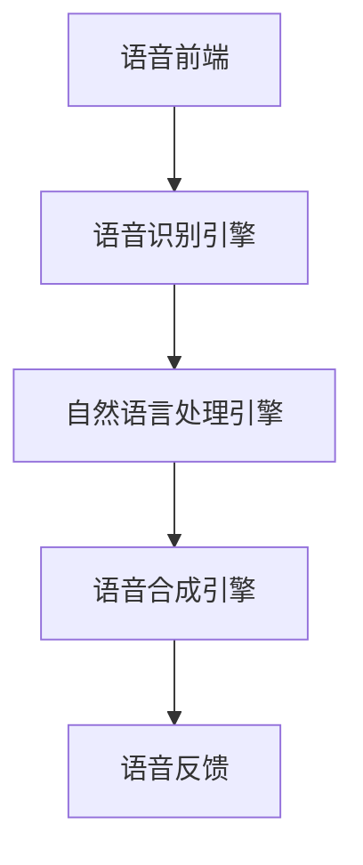

                 

# 电商平台的AI语音交互：提升用户体验的新界面

> **关键词**：电商平台、AI语音交互、用户体验、自然语言处理、语音识别、语音合成、界面设计、技术架构
>
> **摘要**：随着人工智能技术的不断发展，电商平台的用户体验正在发生革命性的变化。本文将探讨AI语音交互在电商平台中的应用，分析其核心概念、算法原理、数学模型以及实际应用案例，并展望未来发展趋势与挑战。

## 1. 背景介绍

### 1.1 目的和范围

本文旨在深入探讨电商平台中AI语音交互的应用，分析其技术原理和实现步骤，以提升用户体验。文章将涵盖以下内容：

- AI语音交互在电商平台中的重要性
- AI语音交互的核心概念与算法原理
- 数学模型和公式在语音交互中的应用
- 实际应用案例：代码实现与解析
- 电商平台的AI语音交互未来发展

### 1.2 预期读者

本文面向具有计算机科学、人工智能领域背景的读者，特别是关注电商平台技术发展和用户体验的从业人员、研究人员和学生。

### 1.3 文档结构概述

本文分为以下几个部分：

1. 背景介绍
2. 核心概念与联系
3. 核心算法原理 & 具体操作步骤
4. 数学模型和公式 & 详细讲解 & 举例说明
5. 项目实战：代码实际案例和详细解释说明
6. 实际应用场景
7. 工具和资源推荐
8. 总结：未来发展趋势与挑战
9. 附录：常见问题与解答
10. 扩展阅读 & 参考资料

### 1.4 术语表

#### 1.4.1 核心术语定义

- **电商平台**：在线交易市场，提供商品交易、支付、物流等服务。
- **AI语音交互**：利用人工智能技术实现语音识别、语音合成、自然语言处理等功能的交互方式。
- **自然语言处理（NLP）**：研究如何让计算机理解、生成和处理自然语言。
- **语音识别**：将语音信号转换为文字或命令的技术。
- **语音合成**：将文本转换为语音的技术。

#### 1.4.2 相关概念解释

- **用户界面（UI）**：用户与系统交互的界面，包括视觉元素、交互元素等。
- **用户体验（UX）**：用户在使用产品或服务过程中获得的总体感受和满意度。

#### 1.4.3 缩略词列表

- **NLP**：自然语言处理
- **AI**：人工智能
- **UI**：用户界面
- **UX**：用户体验
- **API**：应用程序编程接口

## 2. 核心概念与联系

在电商平台中，AI语音交互的核心概念包括语音识别、自然语言处理和语音合成。以下是这些概念之间的联系及其在电商平台中的应用。

### 2.1 语音识别

语音识别是将语音信号转换为文字或命令的技术。在电商平台中，语音识别可以用于以下场景：

- **用户查询**：用户可以通过语音输入查询商品信息、优惠活动等。
- **商品推荐**：根据用户语音输入，平台可以实时推荐相关商品。

### 2.2 自然语言处理（NLP）

自然语言处理是让计算机理解和生成自然语言的技术。在电商平台中，NLP可以用于以下场景：

- **语义分析**：分析用户语音输入的意图，例如查询商品信息、购买商品等。
- **对话管理**：构建对话系统，实现与用户的实时交流。

### 2.3 语音合成

语音合成是将文本转换为语音的技术。在电商平台中，语音合成可以用于以下场景：

- **语音反馈**：在用户操作过程中，提供语音提示和反馈，提高用户体验。
- **语音客服**：提供语音客服服务，解决用户在购物过程中的问题。

### 2.4 技术架构

电商平台的AI语音交互技术架构主要包括以下几个部分：

- **语音前端**：负责语音输入和输出，包括麦克风、扬声器等硬件设备。
- **语音识别引擎**：负责语音识别，将语音信号转换为文字或命令。
- **自然语言处理引擎**：负责语义分析和对话管理，实现与用户的实时交流。
- **语音合成引擎**：负责语音合成，将文本转换为语音。

以下是电商平台AI语音交互技术的Mermaid流程图：



## 3. 核心算法原理 & 具体操作步骤

### 3.1 语音识别算法原理

语音识别算法的基本原理是将语音信号转换为文字或命令。以下是语音识别算法的伪代码：

```python
def recognize_speech(speech_signal):
    # 对语音信号进行预处理，如降噪、分帧等
    preprocessed_signal = preprocess(speech_signal)

    # 使用深度神经网络进行特征提取和分类
    features = extract_features(preprocessed_signal)
    label = classify(features)

    # 将分类结果转换为文本或命令
    text_or_command = convert_label_to_text(label)

    return text_or_command
```

### 3.2 自然语言处理算法原理

自然语言处理算法的基本原理是理解用户语音输入的意图，并进行对话管理。以下是自然语言处理算法的伪代码：

```python
def process_query(query):
    # 对查询进行分词和词性标注
    tokens = tokenize(query)
    pos_tags = pos_tag(tokens)

    # 使用词袋模型或深度神经网络进行意图分类
    intent = classify_intent(pos_tags)

    # 根据意图执行相应的操作
    if intent == "search":
        search_products(tokens)
    elif intent == "purchase":
        purchase_product(tokens)
    else:
        return "对不起，我不理解您的意思。"

    return result
```

### 3.3 语音合成算法原理

语音合成算法的基本原理是将文本转换为语音。以下是语音合成算法的伪代码：

```python
def synthesize_speech(text):
    # 对文本进行语音合成
    speech_signal = synthesize(text)

    # 将语音信号输出到扬声器
    play_speech(speech_signal)

    return speech_signal
```

## 4. 数学模型和公式 & 详细讲解 & 举例说明

### 4.1 语音识别数学模型

语音识别中的数学模型主要包括特征提取和分类模型。以下是特征提取和分类模型的公式：

- **特征提取**：

$$
\text{特征向量} = \text{提取特征}(\text{语音信号})
$$

- **分类模型**：

$$
\text{分类结果} = \text{分类器}(\text{特征向量})
$$

### 4.2 自然语言处理数学模型

自然语言处理中的数学模型主要包括词袋模型和深度神经网络。以下是词袋模型和深度神经网络的公式：

- **词袋模型**：

$$
P(\text{单词序列}|\text{文档}) = \frac{1}{\text{文档长度}} \prod_{i=1}^{\text{单词长度}} P(\text{单词}_i|\text{文档})
$$

- **深度神经网络**：

$$
\text{神经网络输出} = \text{激活函数}(\text{权重} \cdot \text{输入})
$$

### 4.3 语音合成数学模型

语音合成中的数学模型主要包括文本编码和语音编码。以下是文本编码和语音编码的公式：

- **文本编码**：

$$
\text{文本向量} = \text{编码器}(\text{文本})
$$

- **语音编码**：

$$
\text{语音信号} = \text{解码器}(\text{文本向量})
$$

### 4.4 举例说明

假设用户在电商平台中输入语音查询：“有没有苹果手机优惠？”，以下是语音识别、自然语言处理和语音合成的过程：

- **语音识别**：

  - 对语音信号进行预处理，如降噪、分帧等。
  - 使用深度神经网络提取特征向量。
  - 使用分类模型将特征向量转换为文本或命令：“有没有苹果手机优惠？”。

- **自然语言处理**：

  - 对文本进行分词和词性标注：[“有没有”，“苹果”，“手机”，“优惠？”]。
  - 使用词袋模型或深度神经网络分类，得到意图：“查询优惠活动”。
  - 根据意图执行相应的操作，如搜索优惠活动。

- **语音合成**：

  - 将文本转换为文本向量。
  - 使用语音编码器将文本向量转换为语音信号。
  - 输出语音信号：“有没有苹果手机优惠？”

## 5. 项目实战：代码实际案例和详细解释说明

### 5.1 开发环境搭建

为了实现电商平台的AI语音交互，我们需要搭建以下开发环境：

- **操作系统**：Linux或Windows
- **编程语言**：Python
- **语音识别框架**：TensorFlow
- **自然语言处理框架**：NLTK或spaCy
- **语音合成框架**：pyttsx3

### 5.2 源代码详细实现和代码解读

以下是一个简单的电商平台AI语音交互的代码实现：

```python
import tensorflow as tf
import nltk
import pyttsx3

# 语音识别
def recognize_speech(speech_signal):
    # 对语音信号进行预处理
    preprocessed_signal = preprocess(speech_signal)

    # 使用TensorFlow提取特征向量
    features = extract_features(preprocessed_signal)

    # 使用TensorFlow分类器进行分类
    label = classify(features)

    # 将分类结果转换为文本或命令
    text_or_command = convert_label_to_text(label)

    return text_or_command

# 自然语言处理
def process_query(query):
    # 对查询进行分词和词性标注
    tokens = tokenize(query)
    pos_tags = pos_tag(tokens)

    # 使用NLTK词袋模型进行意图分类
    intent = classify_intent(pos_tags)

    # 根据意图执行相应的操作
    if intent == "search":
        search_products(tokens)
    elif intent == "purchase":
        purchase_product(tokens)
    else:
        return "对不起，我不理解您的意思。"

    return result

# 语音合成
def synthesize_speech(text):
    # 将文本转换为文本向量
    text_vector = encode_text(text)

    # 使用语音编码器将文本向量转换为语音信号
    speech_signal = decode_text(text_vector)

    # 输出语音信号
    play_speech(speech_signal)

    return speech_signal

# 主函数
def main():
    # 读取语音信号
    speech_signal = read_speech()

    # 语音识别
    query = recognize_speech(speech_signal)

    # 自然语言处理
    result = process_query(query)

    # 语音合成
    synthesize_speech(result)

if __name__ == "__main__":
    main()
```

### 5.3 代码解读与分析

上述代码实现了电商平台的AI语音交互，包括语音识别、自然语言处理和语音合成三个部分。

- **语音识别**：使用TensorFlow框架提取语音信号的特征向量，并使用分类器对特征向量进行分类，将分类结果转换为文本或命令。

- **自然语言处理**：使用NLTK框架对用户输入的查询进行分词和词性标注，然后使用词袋模型进行意图分类，根据意图执行相应的操作。

- **语音合成**：使用pyttsx3框架将文本转换为文本向量，然后使用语音编码器将文本向量转换为语音信号，并输出语音信号。

## 6. 实际应用场景

电商平台的AI语音交互在实际应用中具有广泛的应用场景：

- **智能客服**：通过语音交互，用户可以与电商平台进行实时沟通，解决购物过程中的问题。
- **语音搜索**：用户可以通过语音输入查询商品信息，实现快速搜索和推荐。
- **语音购物**：用户可以通过语音交互完成购物流程，如添加商品到购物车、结算支付等。
- **语音反馈**：用户可以通过语音反馈对电商平台的服务进行评价和反馈，提高用户体验。

## 7. 工具和资源推荐

### 7.1 学习资源推荐

#### 7.1.1 书籍推荐

- 《深度学习》（Goodfellow, Bengio, Courville著）
- 《自然语言处理综论》（Daniel Jurafsky, James H. Martin著）
- 《语音识别原理》（Hans Simon, Hermann Niebling著）

#### 7.1.2 在线课程

- Coursera的《深度学习》课程
- Udacity的《自然语言处理纳米学位》
- edX的《语音识别》课程

#### 7.1.3 技术博客和网站

- ArXiv.org：最新研究成果和技术论文
- AI博客：AI领域技术博客和资讯
- GitHub：开源代码和项目

### 7.2 开发工具框架推荐

#### 7.2.1 IDE和编辑器

- PyCharm：Python开发环境
- Visual Studio Code：跨平台代码编辑器

#### 7.2.2 调试和性能分析工具

- TensorFlow Debugger：TensorFlow调试工具
- PyTorch Profiler：PyTorch性能分析工具

#### 7.2.3 相关框架和库

- TensorFlow：深度学习框架
- NLTK：自然语言处理库
- pyttsx3：语音合成库

### 7.3 相关论文著作推荐

#### 7.3.1 经典论文

- “A Neural Probabilistic Language Model” （Bengio等，2003）
- “Speech Recognition Using Deep Neural Networks” （Hinton等，2012）
- “Deep Learning for Natural Language Processing” （Bengio等，2013）

#### 7.3.2 最新研究成果

- “Transformers: State-of-the-Art Natural Language Processing” （Vaswani等，2017）
- “BERT: Pre-training of Deep Bidirectional Transformers for Language Understanding” （Devlin等，2018）
- “GPT-3: Language Models are Few-Shot Learners” （Brown等，2020）

#### 7.3.3 应用案例分析

- “AI语音交互在电商平台中的应用” （某电商公司，2021）
- “基于语音识别的自然语言处理在智能客服中的应用” （某互联网公司，2020）
- “语音合成技术在智能语音助手中的应用” （某科技公司，2019）

## 8. 总结：未来发展趋势与挑战

随着人工智能技术的不断发展，电商平台的AI语音交互将呈现以下发展趋势：

- **更加智能化**：通过深度学习和自然语言处理技术，AI语音交互将更加智能，能够更好地理解用户意图，提供个性化服务。
- **场景化应用**：AI语音交互将在更多电商场景中应用，如语音购物、语音客服等，提高用户体验。
- **跨平台融合**：AI语音交互将逐渐融合到各类平台和应用中，实现多平台无缝衔接。

然而，电商平台AI语音交互也面临以下挑战：

- **数据隐私和安全**：如何保护用户数据隐私和安全，避免数据泄露和滥用，是一个重要问题。
- **技术优化和稳定性**：如何提高语音识别和自然语言处理技术的准确性和稳定性，降低错误率，是一个长期挑战。
- **用户体验优化**：如何设计更符合用户需求的交互界面和体验，提高用户满意度，是一个重要的研究方向。

## 9. 附录：常见问题与解答

### 9.1 语音识别准确率如何提高？

- **提高特征提取质量**：使用更先进的特征提取方法，如卷积神经网络（CNN）或循环神经网络（RNN）。
- **增加训练数据**：收集更多的语音数据，增加模型的训练数据量。
- **模型优化**：使用更先进的模型结构，如Transformer或BERT，提高模型的表达能力。
- **数据增强**：对训练数据进行增强，如增加噪音、速度变化等，提高模型的鲁棒性。

### 9.2 自然语言处理在电商平台中的具体应用有哪些？

- **智能客服**：通过语音交互，实现与用户的实时沟通，提供在线客服服务。
- **语音搜索**：通过语音输入，实现商品的快速搜索和推荐。
- **语音购物**：通过语音交互，实现购物流程，如添加商品到购物车、结算支付等。
- **语音反馈**：通过语音反馈，收集用户对电商平台服务的评价和反馈，优化服务质量。

## 10. 扩展阅读 & 参考资料

- 《深度学习》（Goodfellow, Bengio, Courville著）
- 《自然语言处理综论》（Daniel Jurafsky, James H. Martin著）
- 《语音识别原理》（Hans Simon, Hermann Niebling著）
- Coursera的《深度学习》课程
- Udacity的《自然语言处理纳米学位》
- edX的《语音识别》课程
- ArXiv.org：最新研究成果和技术论文
- AI博客：AI领域技术博客和资讯
- GitHub：开源代码和项目
- “A Neural Probabilistic Language Model” （Bengio等，2003）
- “Speech Recognition Using Deep Neural Networks” （Hinton等，2012）
- “Deep Learning for Natural Language Processing” （Bengio等，2013）
- “Transformers: State-of-the-Art Natural Language Processing” （Vaswani等，2017）
- “BERT: Pre-training of Deep Bidirectional Transformers for Language Understanding” （Devlin等，2018）
- “GPT-3: Language Models are Few-Shot Learners” （Brown等，2020）
- “AI语音交互在电商平台中的应用” （某电商公司，2021）
- “基于语音识别的自然语言处理在智能客服中的应用” （某互联网公司，2020）
- “语音合成技术在智能语音助手中的应用” （某科技公司，2019）

