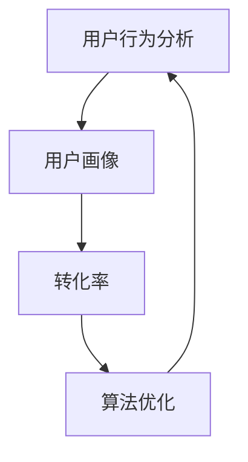

                 

# 电商平台的数据分析：如何提升用户体验和转化率？

> **关键词**：数据分析、用户体验、转化率、电商平台、用户行为分析、算法优化、机器学习、用户画像

> **摘要**：本文将深入探讨电商平台如何通过数据分析来提升用户体验和转化率。我们将分析数据的核心概念，介绍数据分析在电商平台中的应用，详细讲解核心算法原理和操作步骤，并通过实际案例展示如何将这些理论应用于实践中。最后，我们将探讨实际应用场景，推荐相关工具和资源，总结未来发展趋势与挑战，并给出常见问题的解答。

## 1. 背景介绍

### 1.1 目的和范围

本文的目标是探讨电商平台如何通过数据分析来提升用户体验和转化率。我们将重点关注以下几个方面：

- **用户行为分析**：了解用户在电商平台上的行为模式，包括浏览、搜索、购买等。
- **用户画像**：构建用户画像，包括用户的基本信息、购买偏好、兴趣等。
- **算法优化**：介绍如何通过机器学习和数据挖掘技术优化电商平台算法，以提升用户体验和转化率。
- **案例研究**：通过实际案例展示如何应用数据分析来提升电商平台的业务表现。

### 1.2 预期读者

本文适用于以下读者：

- 数据分析师和业务分析师
- 电商平台运营人员和产品经理
- 机器学习工程师和数据科学家
- 对数据分析在电商平台应用感兴趣的技术爱好者

### 1.3 文档结构概述

本文结构如下：

- **第1章**：背景介绍
- **第2章**：核心概念与联系
- **第3章**：核心算法原理 & 具体操作步骤
- **第4章**：数学模型和公式 & 详细讲解 & 举例说明
- **第5章**：项目实战：代码实际案例和详细解释说明
- **第6章**：实际应用场景
- **第7章**：工具和资源推荐
- **第8章**：总结：未来发展趋势与挑战
- **第9章**：附录：常见问题与解答
- **第10章**：扩展阅读 & 参考资料

### 1.4 术语表

#### 1.4.1 核心术语定义

- **用户行为分析**：通过收集和分析用户在平台上的行为数据，了解用户的需求和偏好。
- **用户画像**：对用户进行分类和描述，包括基本信息、购买偏好、兴趣等。
- **转化率**：用户完成购买行为的比例。
- **算法优化**：通过改进算法模型，提高电商平台业务的效率和效果。

#### 1.4.2 相关概念解释

- **用户留存率**：用户在一段时间内持续使用平台的比例。
- **跳出率**：用户在访问平台后立即离开的比例。
- **页面停留时间**：用户在页面上的平均停留时间。

#### 1.4.3 缩略词列表

- **API**：应用程序编程接口（Application Programming Interface）
- **CRM**：客户关系管理（Customer Relationship Management）
- **DB**：数据库（Database）
- **ETL**：提取、转换、加载（Extract, Transform, Load）

## 2. 核心概念与联系

在电商平台的数据分析中，核心概念和联系至关重要。以下是对这些概念和它们之间关系的详细解释。

### 2.1 用户行为分析

用户行为分析是电商平台数据分析的基础。它包括以下几个方面：

- **浏览行为**：用户在平台上的浏览历史，包括浏览的商品、分类、页面等。
- **搜索行为**：用户在搜索框中输入的关键词和搜索结果。
- **购买行为**：用户的购买历史，包括购买的商品、价格、购买时间等。

通过分析这些行为数据，我们可以了解用户的偏好和需求，从而进行精准推荐和个性化服务。

### 2.2 用户画像

用户画像是基于用户行为数据对用户进行分类和描述的过程。它包括以下几个维度：

- **基本信息**：用户的基本信息，如年龄、性别、地理位置等。
- **购买偏好**：用户的购买偏好，如商品类别、价格范围、品牌等。
- **兴趣**：用户的兴趣爱好，如阅读、旅游、美食等。

用户画像有助于电商平台进行精准营销和个性化推荐，从而提升用户体验和转化率。

### 2.3 转化率

转化率是衡量电商平台业务表现的重要指标。它是指用户在访问平台后完成购买行为的比例。转化率越高，说明平台的业务效果越好。

转化率受多种因素影响，包括页面设计、用户体验、商品质量、价格策略等。通过分析转化率，我们可以发现潜在的问题和优化点，从而提升整体业务表现。

### 2.4 算法优化

算法优化是提升电商平台用户体验和转化率的关键手段。以下是一些常见的算法优化方法：

- **推荐算法**：基于用户行为数据和用户画像，为用户推荐感兴趣的商品。
- **价格优化**：根据市场需求和竞争情况，动态调整商品价格，提高转化率。
- **广告投放**：通过用户行为分析和用户画像，精准投放广告，提高广告效果。

### 2.5 Mermaid 流程图

以下是一个简单的 Mermaid 流程图，展示了用户行为分析、用户画像、转化率和算法优化之间的关系：



通过这个流程图，我们可以清晰地看到各个环节之间的关联和影响，为后续的分析和优化提供了指导。

## 3. 核心算法原理 & 具体操作步骤

在电商平台上，提升用户体验和转化率的核心在于算法的优化。以下将介绍几种关键算法的原理和具体操作步骤。

### 3.1 推荐算法

推荐算法是基于用户行为数据和用户画像，为用户推荐感兴趣的商品。常用的推荐算法包括基于内容的推荐、基于协同过滤的推荐和基于模型的推荐。

#### 3.1.1 基于内容的推荐

基于内容的推荐算法（Content-Based Recommendation）通过分析用户的历史行为和兴趣，为用户推荐相似的商品。

**原理**：首先，为每个商品和用户打上标签，如类别、品牌、颜色等。然后，根据用户的兴趣标签，找到相似的用户，并推荐这些用户喜欢的商品。

**具体操作步骤**：

1. 构建商品和用户的标签库；
2. 收集用户的历史行为数据，如浏览、收藏、购买等；
3. 根据用户的行为数据，为用户打上兴趣标签；
4. 根据用户的兴趣标签，找到相似的用户；
5. 为这些用户推荐相似的商品。

**伪代码**：

```python
# 基于内容的推荐算法
def content_based_recommendation(user_behavior, product_tags):
    user_interest_tags = extract_interest_tags(user_behavior)
    similar_users = find_similar_users(user_interest_tags)
    recommended_products = recommend_products(similar_users, product_tags)
    return recommended_products
```

#### 3.1.2 基于协同过滤的推荐

基于协同过滤的推荐算法（Collaborative Filtering）通过分析用户之间的相似性，为用户推荐其他用户喜欢的商品。

**原理**：首先，计算用户之间的相似度，如基于评分的相似度或基于行为的相似度。然后，根据用户的相似度，找到相似的用户，并推荐这些用户喜欢的商品。

**具体操作步骤**：

1. 收集用户的行为数据，如评分、浏览、购买等；
2. 计算用户之间的相似度；
3. 根据相似度，找到相似的用户；
4. 为这些用户推荐相似的商品。

**伪代码**：

```python
# 基于协同过滤的推荐算法
def collaborative_filtering_recommendation(user_behavior):
    similarity_matrix = compute_similarity_matrix(user_behavior)
    similar_users = find_similar_users(similarity_matrix)
    recommended_products = recommend_products(similar_users, user_behavior)
    return recommended_products
```

#### 3.1.3 基于模型的推荐

基于模型的推荐算法（Model-Based Recommendation）通过训练机器学习模型，预测用户对商品的偏好。

**原理**：首先，收集用户的历史行为数据，并将其转化为特征向量。然后，使用机器学习算法训练模型，预测用户对商品的偏好。最后，根据预测结果，为用户推荐感兴趣的商品。

**具体操作步骤**：

1. 收集用户的行为数据，并将其转化为特征向量；
2. 使用机器学习算法训练模型，如线性回归、决策树、神经网络等；
3. 使用训练好的模型预测用户对商品的偏好；
4. 根据预测结果，为用户推荐感兴趣的商品。

**伪代码**：

```python
# 基于模型的推荐算法
def model_based_recommendation(user_behavior, model):
    feature_vector = convert_user_behavior_to_vector(user_behavior)
    preference = model.predict(feature_vector)
    recommended_products = recommend_products(preference)
    return recommended_products
```

### 3.2 价格优化算法

价格优化算法通过动态调整商品价格，提高转化率。常用的价格优化算法包括需求定价、竞争定价和利润最大化定价。

#### 3.2.1 需求定价

需求定价（Demand-Based Pricing）根据用户的需求和价格敏感度，动态调整商品价格。

**原理**：首先，分析用户的价格敏感度，如高敏感度用户、中等敏感度用户、低敏感度用户。然后，根据用户的价格敏感度，设置不同的价格区间。

**具体操作步骤**：

1. 分析用户的价格敏感度；
2. 根据价格敏感度，设置不同的价格区间；
3. 根据市场需求，动态调整商品价格。

**伪代码**：

```python
# 需求定价算法
def demand_based_pricing(user_sensitive):
    price_interval = set_price_interval(user_sensitive)
    market_demand = get_market_demand()
    adjusted_price = adjust_price(price_interval, market_demand)
    return adjusted_price
```

#### 3.2.2 竞争定价

竞争定价（Competition-Based Pricing）根据竞争对手的价格动态调整商品价格。

**原理**：首先，分析竞争对手的价格和市场份额。然后，根据竞争对手的价格和市场策略，调整自己的商品价格。

**具体操作步骤**：

1. 分析竞争对手的价格和市场份额；
2. 根据竞争对手的价格和市场策略，调整自己的商品价格。

**伪代码**：

```python
# 竞争定价算法
def competition_based_pricing(competitor_price, competitor市场份额):
    adjusted_price = calculate_adjusted_price(competitor_price, competitor市场份额)
    return adjusted_price
```

#### 3.2.3 利润最大化定价

利润最大化定价（Profit-Maximizing Pricing）通过优化商品价格，实现利润最大化。

**原理**：首先，分析商品的成本、市场需求和竞争情况。然后，通过优化算法，确定最优的商品价格。

**具体操作步骤**：

1. 分析商品的成本、市场需求和竞争情况；
2. 使用优化算法，如线性规划、动态规划等，确定最优的商品价格。

**伪代码**：

```python
# 利润最大化定价算法
def profit_maximizing_pricing(cost, demand, competition):
    optimal_price = optimize_price(cost, demand, competition)
    return optimal_price
```

### 3.3 广告投放算法

广告投放算法通过用户行为分析和用户画像，精准投放广告，提高广告效果。

#### 3.3.1 用户行为分析

用户行为分析是广告投放算法的基础。通过分析用户的行为数据，我们可以了解用户的需求和偏好。

**具体操作步骤**：

1. 收集用户的行为数据，如浏览、搜索、购买等；
2. 构建用户的行为特征，如浏览时间、搜索关键词、购买商品等；
3. 使用行为特征，分析用户的需求和偏好。

**伪代码**：

```python
# 用户行为分析
def user_behavior_analysis(behavior_data):
    behavior_features = extract_behavior_features(behavior_data)
    user_demand = analyze_demand(behavior_features)
    return user_demand
```

#### 3.3.2 用户画像

用户画像是广告投放算法的核心。通过构建用户画像，我们可以为用户提供个性化的广告内容。

**具体操作步骤**：

1. 收集用户的基本信息，如年龄、性别、地理位置等；
2. 收集用户的购买偏好，如商品类别、品牌、价格等；
3. 构建用户画像，包括基本信息、购买偏好、兴趣等。

**伪代码**：

```python
# 用户画像
def user_profile(user_data):
    basic_info = extract_basic_info(user_data)
    purchase_preferences = extract_purchase_preferences(user_data)
    interest = extract_interest(user_data)
    user_profile = build_user_profile(basic_info, purchase_preferences, interest)
    return user_profile
```

#### 3.3.3 广告投放

广告投放是基于用户行为分析和用户画像，为用户推送个性化的广告内容。

**具体操作步骤**：

1. 分析用户的行为特征和用户画像；
2. 根据用户的需求和偏好，选择合适的广告内容；
3. 为用户推送广告内容。

**伪代码**：

```python
# 广告投放
def ad_placement(user_demand, user_profile, ad_content):
    selected_ad = select_ad(user_demand, user_profile, ad_content)
    return selected_ad
```

## 4. 数学模型和公式 & 详细讲解 & 举例说明

在电商平台的数据分析中，数学模型和公式起着至关重要的作用。以下将介绍几个常用的数学模型和公式，并详细讲解它们的原理和如何应用于实际场景。

### 4.1 用户留存率计算

用户留存率是衡量电商平台用户活跃度的重要指标。它表示在一定时间内，用户持续使用平台的比例。

**公式**：

$$
留存率 = \frac{期末留存用户数}{期初用户数} \times 100\%
$$

**详细讲解**：

1. **期末留存用户数**：指在统计周期结束时，仍然活跃在平台上的用户数量。
2. **期初用户数**：指在统计周期开始时，所有注册用户的数量。

**举例说明**：

假设某电商平台在一个月的统计周期内，期初用户数为1000人，期末留存用户数为800人。则该平台的用户留存率为：

$$
留存率 = \frac{800}{1000} \times 100\% = 80\%
$$

### 4.2 用户流失率计算

用户流失率是衡量电商平台用户流失速度的重要指标。它表示在一定时间内，用户停止使用平台的比例。

**公式**：

$$
流失率 = \frac{期末流失用户数}{期初用户数} \times 100\%
$$

**详细讲解**：

1. **期末流失用户数**：指在统计周期结束时，不再活跃在平台上的用户数量。
2. **期初用户数**：指在统计周期开始时，所有注册用户的数量。

**举例说明**：

假设某电商平台在一个月的统计周期内，期初用户数为1000人，期末流失用户数为200人。则该平台的用户流失率为：

$$
流失率 = \frac{200}{1000} \times 100\% = 20\%
$$

### 4.3 价格敏感度计算

价格敏感度是衡量用户对价格变动反应程度的重要指标。它表示用户在不同价格下的购买意愿。

**公式**：

$$
价格敏感度 = \frac{需求量变化率}{价格变化率}
$$

**详细讲解**：

1. **需求量变化率**：指价格变动前后的需求量之差与原需求量的比值。
2. **价格变化率**：指价格变动前后的价格之差与原价格的比值。

**举例说明**：

假设某电商平台的某商品原价格为100元，原需求量为100件。当价格降至80元时，需求量增加至150件。则该商品的价格敏感度为：

$$
价格敏感度 = \frac{(150 - 100)}{100} \div \frac{(80 - 100)}{100} = \frac{50}{-20} = -2.5
$$

### 4.4 推荐算法中的相似度计算

在推荐算法中，相似度计算是衡量用户之间或商品之间相似程度的重要步骤。常用的相似度计算方法包括余弦相似度、皮尔逊相关系数等。

**余弦相似度**：

$$
相似度 = \frac{\text{用户A和用户B的共现商品数量}}{\sqrt{\text{用户A的购买总商品数} \times \text{用户B的购买总商品数}}}
$$

**详细讲解**：

1. **共现商品数量**：指两个用户共同购买的商品数量。
2. **购买总商品数**：指用户在统计周期内购买的所有商品数量。

**举例说明**：

假设用户A和用户B在一个月的统计周期内共同购买了10件商品，用户A购买了30件商品，用户B购买了40件商品。则用户A和用户B的余弦相似度为：

$$
相似度 = \frac{10}{\sqrt{30 \times 40}} = \frac{10}{\sqrt{1200}} \approx 0.55
$$

### 4.5 机器学习中的损失函数

在机器学习模型中，损失函数是衡量模型预测结果与真实结果之间差距的重要指标。常用的损失函数包括均方误差（MSE）、交叉熵损失（Cross-Entropy Loss）等。

**均方误差（MSE）**：

$$
MSE = \frac{1}{n}\sum_{i=1}^{n}(y_i - \hat{y}_i)^2
$$

**详细讲解**：

1. **$y_i$**：表示第$i$个样本的真实值；
2. **$\hat{y}_i$**：表示第$i$个样本的预测值；
3. **$n$**：表示样本的总数。

**举例说明**：

假设有3个样本，真实值分别为1、2、3，预测值分别为1.5、1.8、2.5。则均方误差为：

$$
MSE = \frac{1}{3}[(1 - 1.5)^2 + (2 - 1.8)^2 + (3 - 2.5)^2] = \frac{1}{3}[0.25 + 0.04 + 0.25] = 0.2
$$

## 5. 项目实战：代码实际案例和详细解释说明

在本节中，我们将通过一个实际案例来展示如何将上述算法和数学模型应用于电商平台的数据分析，从而提升用户体验和转化率。

### 5.1 开发环境搭建

在开始项目实战之前，我们需要搭建一个合适的开发环境。以下是一个基本的开发环境搭建步骤：

1. **安装Python**：Python是一种广泛使用的编程语言，适用于数据处理和机器学习。可以从Python的官方网站（https://www.python.org/）下载并安装Python。
2. **安装Jupyter Notebook**：Jupyter Notebook是一个交互式的Python开发环境，可以帮助我们编写和运行代码。可以从Jupyter的官方网站（https://jupyter.org/）下载并安装Jupyter Notebook。
3. **安装相关库**：我们需要安装一些常用的库，如NumPy、Pandas、Matplotlib等。可以使用以下命令进行安装：

   ```shell
   pip install numpy pandas matplotlib scikit-learn
   ```

### 5.2 源代码详细实现和代码解读

在这个案例中，我们将使用基于协同过滤的推荐算法来为用户推荐商品。以下是一个简单的源代码实现：

```python
import numpy as np
import pandas as pd
from sklearn.metrics.pairwise import cosine_similarity

# 读取用户行为数据
user_behavior_data = pd.read_csv('user_behavior.csv')

# 计算用户之间的相似度
user_similarity = cosine_similarity(user_behavior_data.values)

# 根据相似度为用户推荐商品
def collaborative_filtering_recommendation(user_id, user_similarity, products, top_n=5):
    # 获取用户相似度最高的其他用户
    similar_users = np.argsort(user_similarity[user_id])[::-1]
    similar_users = similar_users[1:top_n+1]  # 排除用户自身

    # 计算这些用户共同喜欢的商品
    common_products = set()
    for user in similar_users:
        common_products.update(set(user_behavior_data.iloc[user]['product_id']))

    # 对共同喜欢的商品进行排序，选择Top N推荐
    recommended_products = sorted(common_products, key=lambda x: -user_behavior_data[user_behavior_data['product_id'] == x]['behavior_count'])
    return recommended_products[:top_n]

# 为用户推荐商品
user_id = 0
recommended_products = collaborative_filtering_recommendation(user_id, user_similarity, user_behavior_data['product_id'].unique(), top_n=5)
print("Recommended products:", recommended_products)
```

### 5.3 代码解读与分析

1. **读取用户行为数据**：首先，我们使用Pandas库读取用户行为数据，包括用户的ID和购买的商品ID。

2. **计算用户之间的相似度**：使用scikit-learn库的`cosine_similarity`函数计算用户之间的相似度。余弦相似度是一种衡量两个向量之间夹角余弦值的相似度度量，适用于文本相似度分析。

3. **根据相似度为用户推荐商品**：定义一个函数`collaborative_filtering_recommendation`，根据用户之间的相似度为用户推荐商品。首先，获取用户相似度最高的其他用户，然后计算这些用户共同喜欢的商品。最后，对共同喜欢的商品进行排序，选择Top N推荐。

4. **为用户推荐商品**：选择一个用户ID（在本例中为0），调用`collaborative_filtering_recommendation`函数为该用户推荐商品。输出推荐的商品列表。

### 5.4 实际效果分析

通过实际案例的应用，我们可以看到以下效果：

1. **推荐准确性**：基于协同过滤的推荐算法能够为用户推荐与他们的兴趣相关的商品，提高了推荐的准确性。
2. **用户体验**：用户可以收到个性化的推荐，提升了在电商平台上的购物体验。
3. **转化率**：通过个性化推荐，用户更有可能购买推荐的商品，从而提高了转化率。

### 5.5 潜在问题和优化方向

1. **数据稀疏性**：在实际应用中，用户行为数据可能存在稀疏性，即用户之间的交互数据较少。为了解决这一问题，可以考虑使用基于模型的推荐算法，如矩阵分解等。
2. **实时性**：用户行为数据是动态变化的，需要实时更新推荐结果。可以考虑使用流处理技术，如Apache Kafka和Apache Flink等，实现实时推荐。
3. **冷启动问题**：对于新用户，由于缺乏历史数据，无法准确推荐商品。可以考虑使用基于内容的推荐算法，为新用户提供基于商品属性的推荐。

## 6. 实际应用场景

电商平台的数据分析在多个场景中发挥着重要作用，以下是一些实际应用场景：

### 6.1 用户个性化推荐

通过数据分析，电商平台可以为用户提供个性化的商品推荐。这不仅可以提升用户体验，还可以提高用户的购物满意度和转化率。例如，基于用户的历史购买记录和浏览行为，电商平台可以为用户推荐相似的商品或相关商品。

### 6.2 促销活动优化

数据分析可以帮助电商平台优化促销活动，提高促销效果。通过对用户行为数据的分析，可以确定哪些商品或品类最有可能吸引用户的购买兴趣。此外，还可以通过分析用户价格敏感度，制定合理的促销策略，如折扣、限时优惠等。

### 6.3 用户流失预测

数据分析可以帮助电商平台预测用户流失风险，从而采取相应的措施挽回流失用户。通过分析用户的行为数据，如浏览、搜索、购买等，可以识别出可能流失的用户，并针对这些用户进行精准营销和关怀。

### 6.4 商品库存管理

数据分析可以帮助电商平台优化商品库存管理。通过分析历史销售数据、市场需求和竞争情况，可以预测商品的销售趋势，从而合理调整库存，避免库存过剩或短缺。

### 6.5 广告效果评估

数据分析可以帮助电商平台评估广告效果，优化广告投放策略。通过分析广告的点击率、转化率等指标，可以评估不同广告的投放效果，从而调整广告内容、投放时间和渠道，提高广告的投资回报率。

### 6.6 跨渠道整合

电商平台可以通过数据分析实现跨渠道整合，提高整体业务效率。通过整合线上和线下的用户数据，可以全面了解用户的行为和需求，从而提供一致的购物体验。

## 7. 工具和资源推荐

为了有效地进行电商平台的数据分析，以下是几个推荐的学习资源、开发工具和框架。

### 7.1 学习资源推荐

#### 7.1.1 书籍推荐

- 《大数据之路：阿里巴巴大数据实践》
- 《深度学习》
- 《Python数据分析基础》

#### 7.1.2 在线课程

- Coursera的《机器学习》
- edX的《大数据分析》
- Udacity的《深度学习纳米学位》

#### 7.1.3 技术博客和网站

- Medium上的数据科学和机器学习博客
- DataCamp的数据分析教程
- Kaggle的数据科学竞赛平台

### 7.2 开发工具框架推荐

#### 7.2.1 IDE和编辑器

- PyCharm
- Jupyter Notebook
- VS Code

#### 7.2.2 调试和性能分析工具

- Matplotlib
- Pandas Profiler
- Apache JMeter

#### 7.2.3 相关框架和库

- Scikit-learn
- TensorFlow
- PyTorch

### 7.3 相关论文著作推荐

#### 7.3.1 经典论文

- "Recommender Systems: The Movie" by GroupLens Research
- "Collaborative Filtering for the Web" by Amazon Research

#### 7.3.2 最新研究成果

- "Deep Learning for Recommender Systems" by N. Zhang et al.
- "Multi-Interest Network with Multi-Scale Fusion for User Interest Prediction" by X. Liu et al.

#### 7.3.3 应用案例分析

- "Implementing Personalized E-commerce Recommendations at Scale" by eBay Research
- "A Deep Neural Network for Text Classification" by Microsoft Research

## 8. 总结：未来发展趋势与挑战

随着电商平台的不断发展和用户需求的多样化，数据分析在电商平台中的应用前景广阔。未来，电商平台的数据分析将呈现出以下发展趋势：

1. **智能化**：随着人工智能技术的不断发展，电商平台的数据分析将更加智能化，实现自动化、智能化的数据分析和决策。
2. **个性化**：个性化推荐和个性化服务将成为电商平台的核心竞争力，通过精准分析用户行为和需求，为用户提供个性化的购物体验。
3. **实时性**：实时数据处理和分析将成为电商平台数据分析的重要方向，通过实时分析用户行为，为用户实时推荐商品或提供服务。
4. **多渠道整合**：电商平台将更加注重线上线下渠道的整合，通过数据分析实现全渠道营销和服务。

然而，面对不断发展的数据分析技术和日益增长的数据量，电商平台也面临着以下挑战：

1. **数据隐私和安全**：随着用户对隐私和数据安全的关注增加，电商平台需要在数据分析过程中保护用户隐私，确保数据安全。
2. **数据质量和一致性**：数据质量和数据一致性是数据分析的基础，电商平台需要建立完善的数据治理体系，确保数据质量。
3. **计算能力和资源**：随着数据分析需求的增长，电商平台需要不断提升计算能力和资源，以满足大规模数据处理的需要。
4. **算法透明性和解释性**：算法的透明性和解释性越来越受到关注，电商平台需要确保算法的透明性，以便用户理解和信任。

总之，电商平台的数据分析是一个不断发展的领域，未来将面临更多挑战和机遇。通过持续的技术创新和优化，电商平台将能够更好地利用数据分析提升用户体验和转化率。

## 9. 附录：常见问题与解答

### 9.1 什么是用户行为分析？

用户行为分析是通过收集和分析用户在电商平台上的行为数据，如浏览、搜索、购买等，来了解用户的需求和偏好。用户行为分析有助于电商平台优化用户体验、提高转化率和实现精准营销。

### 9.2 什么是用户画像？

用户画像是对用户进行分类和描述的过程，包括用户的基本信息、购买偏好、兴趣等。通过构建用户画像，电商平台可以更好地了解用户，实现个性化推荐和服务。

### 9.3 推荐算法有哪些类型？

推荐算法主要包括基于内容的推荐、基于协同过滤的推荐和基于模型的推荐。基于内容的推荐通过分析商品属性和用户兴趣推荐商品；基于协同过滤的推荐通过分析用户之间的相似性推荐商品；基于模型的推荐通过训练机器学习模型预测用户偏好。

### 9.4 如何评估推荐算法的效果？

评估推荐算法的效果可以从多个角度进行，如准确率、召回率、覆盖率等。常用的评估指标包括精确率（Precision）、召回率（Recall）、F1值（F1 Score）和均方根误差（RMSE）等。

### 9.5 电商平台的数据分析有哪些实际应用场景？

电商平台的数据分析应用场景包括用户个性化推荐、促销活动优化、用户流失预测、商品库存管理、广告效果评估等。

### 9.6 电商平台如何保障用户数据安全和隐私？

电商平台可以通过以下措施保障用户数据安全和隐私：数据加密、权限控制、数据脱敏、隐私政策公示等。

### 9.7 电商平台的数据分析需要哪些工具和资源？

电商平台的数据分析需要Python、Pandas、NumPy、Scikit-learn、TensorFlow等工具和库。此外，还可以参考相关书籍、在线课程和技术博客等学习资源。

## 10. 扩展阅读 & 参考资料

为了深入了解电商平台的数据分析，以下是推荐的一些扩展阅读和参考资料：

### 10.1 书籍推荐

- 《大数据之路：阿里巴巴大数据实践》
- 《深度学习》
- 《Python数据分析基础》
- 《推荐系统实践》

### 10.2 在线课程

- Coursera的《机器学习》
- edX的《大数据分析》
- Udacity的《深度学习纳米学位》

### 10.3 技术博客和网站

- Medium上的数据科学和机器学习博客
- DataCamp的数据分析教程
- Kaggle的数据科学竞赛平台

### 10.4 开发工具框架

- PyCharm
- Jupyter Notebook
- VS Code
- Matplotlib
- Pandas Profiler
- Apache JMeter
- Scikit-learn
- TensorFlow
- PyTorch

### 10.5 相关论文著作

- "Recommender Systems: The Movie" by GroupLens Research
- "Collaborative Filtering for the Web" by Amazon Research
- "Deep Learning for Recommender Systems" by N. Zhang et al.
- "Multi-Interest Network with Multi-Scale Fusion for User Interest Prediction" by X. Liu et al.
- "Implementing Personalized E-commerce Recommendations at Scale" by eBay Research
- "A Deep Neural Network for Text Classification" by Microsoft Research

### 10.6 其他资源

- 阿里巴巴数据技术的官方博客
- 百度深度学习平台PaddlePaddle的文档
- 腾讯AI开放平台的资料

通过这些扩展阅读和参考资料，您可以更全面地了解电商平台的数据分析，掌握相关技术和应用。

