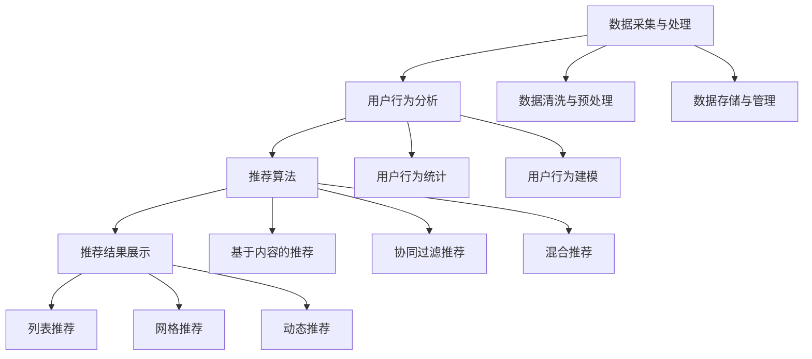

                 

# 电商推荐系统中的实时个性化技术

> **关键词**：电商推荐系统、实时个性化、算法、机器学习、数据挖掘、用户行为分析、用户体验优化

> **摘要**：本文将深入探讨电商推荐系统中的实时个性化技术。从背景介绍、核心概念与联系、核心算法原理、数学模型和公式、项目实战以及实际应用场景等多个方面，详细讲解实时个性化推荐系统的设计与实现。通过本文的学习，读者将能够理解实时个性化技术在电商推荐系统中的重要作用，掌握其核心原理和关键技术，并能够应用于实际的电商推荐系统中，提升用户体验和业务转化率。

## 1. 背景介绍

### 1.1 目的和范围

电商推荐系统是一种基于用户行为和兴趣的个性化服务，旨在为用户推荐他们可能感兴趣的商品或服务。随着互联网和大数据技术的快速发展，电商推荐系统已经成为电商行业提升用户满意度和增加销售额的重要手段。

实时个性化技术是电商推荐系统中的一个重要研究方向。它能够根据用户实时行为数据，动态调整推荐结果，从而实现更精准、更个性化的推荐。本文旨在探讨实时个性化技术在电商推荐系统中的应用，包括其核心概念、算法原理、数学模型和项目实战。

本文将涵盖以下内容：

1. 核心概念与联系：介绍实时个性化推荐系统的基本概念、架构和核心算法。
2. 核心算法原理与具体操作步骤：详细讲解实时个性化算法的原理和实现步骤。
3. 数学模型和公式：阐述实时个性化算法中的数学模型和公式，并进行举例说明。
4. 项目实战：通过实际案例，展示实时个性化推荐系统的实现过程和效果分析。
5. 实际应用场景：探讨实时个性化技术在电商行业中的应用场景和优势。
6. 工具和资源推荐：介绍相关的学习资源和开发工具，为读者提供实践参考。
7. 总结与展望：总结实时个性化技术的研究现状和未来发展趋势。

### 1.2 预期读者

本文面向具有计算机科学和数据分析背景的技术人员，尤其是对电商推荐系统和机器学习有浓厚兴趣的读者。同时，也适合对电商行业和用户行为分析感兴趣的业务人员和管理者。

### 1.3 文档结构概述

本文分为十个部分，结构如下：

1. 背景介绍
   - 1.1 目的和范围
   - 1.2 预期读者
   - 1.3 文档结构概述
2. 核心概念与联系
   - 2.1 核心概念
   - 2.2 架构和核心算法
3. 核心算法原理与具体操作步骤
   - 3.1 算法原理
   - 3.2 具体操作步骤
4. 数学模型和公式
   - 4.1 数学模型
   - 4.2 公式举例
5. 项目实战
   - 5.1 开发环境搭建
   - 5.2 源代码实现
   - 5.3 代码解读与分析
6. 实际应用场景
   - 6.1 场景一
   - 6.2 场景二
7. 工具和资源推荐
   - 7.1 学习资源
   - 7.2 开发工具
8. 总结与展望
   - 8.1 研究现状
   - 8.2 发展趋势
9. 附录
   - 9.1 常见问题与解答
10. 扩展阅读与参考资料

### 1.4 术语表

#### 1.4.1 核心术语定义

- **电商推荐系统**：基于用户行为数据和商品信息，为用户推荐可能感兴趣的商品或服务的系统。
- **实时个性化**：根据用户实时行为数据，动态调整推荐结果，实现更精准、更个性化的推荐。
- **用户行为分析**：通过分析用户在电商平台的浏览、搜索、购买等行为，挖掘用户兴趣和需求。
- **协同过滤**：一种基于用户行为数据的推荐算法，通过计算用户之间的相似度，为用户推荐相似用户喜欢的商品。
- **机器学习**：利用计算机算法，从数据中自动学习规律和模式，用于解决实际问题。
- **数据挖掘**：从大量数据中提取有价值的信息和知识的过程。

#### 1.4.2 相关概念解释

- **推荐列表**：推荐系统为用户生成的商品列表。
- **覆盖率**：推荐列表中包含的商品种类与电商平台商品种类的比值。
- **准确率**：推荐列表中包含用户实际感兴趣的商品的比值。
- **多样性**：推荐列表中商品之间的差异程度。

#### 1.4.3 缩略词列表

- **CPC**：Cost Per Click，按点击付费的广告模式。
- **CPM**：Cost Per Mille，按千次展示付费的广告模式。
- **CTR**：Click-Through Rate，点击率。
- **RFM**：Recency, Frequency, Monetary，用于评估用户价值的三个指标。
- **LSTM**：Long Short-Term Memory，一种循环神经网络，用于处理序列数据。

## 2. 核心概念与联系

### 2.1 核心概念

在探讨电商推荐系统中的实时个性化技术之前，我们需要先了解几个核心概念：用户行为分析、协同过滤、机器学习和数据挖掘。

#### 用户行为分析

用户行为分析是指通过对用户在电商平台的浏览、搜索、购买等行为进行分析，挖掘用户的兴趣和需求。用户行为数据包括浏览记录、搜索关键词、购买历史、评价和反馈等。这些数据可以帮助我们了解用户的行为习惯和偏好，从而为个性化推荐提供依据。

#### 协同过滤

协同过滤是一种基于用户行为数据的推荐算法。它通过计算用户之间的相似度，为用户推荐相似用户喜欢的商品。协同过滤分为两种：基于用户的协同过滤（User-Based Collaborative Filtering）和基于项目的协同过滤（Item-Based Collaborative Filtering）。

- **基于用户的协同过滤**：首先找到与当前用户相似的用户，然后推荐这些相似用户喜欢的商品。
- **基于项目的协同过滤**：首先找到与当前商品相似的商品，然后推荐这些相似商品。

#### 机器学习

机器学习是一种利用计算机算法，从数据中自动学习规律和模式的技术。在电商推荐系统中，机器学习可以用于构建用户行为模型、预测用户兴趣和推荐商品。

常见的机器学习算法包括：

- **线性回归**：用于预测用户对商品的评分。
- **决策树**：用于分类和回归分析。
- **支持向量机（SVM）**：用于分类和回归分析。
- **神经网络**：用于复杂的数据建模和预测。

#### 数据挖掘

数据挖掘是从大量数据中提取有价值的信息和知识的过程。在电商推荐系统中，数据挖掘可以用于挖掘用户行为模式、商品关联关系和潜在用户需求。

常见的数据挖掘算法包括：

- **聚类分析**：用于发现数据中的相似对象。
- **关联规则挖掘**：用于发现数据中的相关关系。
- **分类和回归**：用于预测用户的行为和需求。

### 2.2 架构和核心算法

实时个性化推荐系统的架构通常包括以下几个部分：数据采集与处理、用户行为分析、推荐算法、推荐结果展示。

#### 数据采集与处理

数据采集与处理是实时个性化推荐系统的第一步。它包括用户行为数据的采集、清洗、预处理和存储。用户行为数据包括浏览记录、搜索关键词、购买历史、评价和反馈等。数据采集与处理的目标是确保数据的准确性和实时性。

#### 用户行为分析

用户行为分析是对采集到的用户行为数据进行处理和分析，以了解用户的兴趣和需求。用户行为分析的方法包括：

- **统计方法**：通过对用户行为数据进行统计，计算用户行为的概率分布和相关性。
- **机器学习方法**：利用机器学习算法，建立用户行为模型，预测用户的行为和需求。

#### 推荐算法

推荐算法是实时个性化推荐系统的核心。它根据用户行为数据和用户兴趣模型，为用户推荐可能感兴趣的商品。常见的推荐算法包括：

- **基于内容的推荐**：根据用户的历史行为和兴趣，推荐与用户兴趣相关的商品。
- **协同过滤推荐**：通过计算用户之间的相似度，为用户推荐相似用户喜欢的商品。
- **混合推荐**：结合基于内容和协同过滤的推荐方法，实现更精准、更个性化的推荐。

#### 推荐结果展示

推荐结果展示是将推荐结果以可视化的形式展示给用户。它包括推荐列表的生成、排序和展示。推荐结果展示的方法包括：

- **列表推荐**：将推荐商品以列表形式展示给用户。
- **网格推荐**：将推荐商品以网格形式展示给用户。
- **动态推荐**：根据用户的操作行为，动态更新推荐结果。

### 2.3 Mermaid 流程图

以下是实时个性化推荐系统的 Mermaid 流程图：



## 3. 核心算法原理 & 具体操作步骤

### 3.1 算法原理

实时个性化推荐系统中的核心算法主要分为基于内容的推荐、协同过滤推荐和混合推荐。

#### 基于内容的推荐

基于内容的推荐（Content-Based Recommendation）是一种基于用户兴趣和商品属性进行推荐的方法。它通过分析用户的历史行为和兴趣，提取用户的兴趣特征，然后根据商品的内容特征，为用户推荐与其兴趣相关的商品。

算法原理：

1. **用户兴趣特征提取**：根据用户的历史行为和兴趣，提取用户的兴趣特征。例如，用户喜欢浏览的品类、搜索的关键词、购买的历史记录等。
2. **商品内容特征提取**：分析商品的内容特征，例如商品的分类、标签、描述等。
3. **兴趣匹配**：根据用户兴趣特征和商品内容特征，计算用户对每个商品的兴趣度。
4. **推荐结果生成**：根据兴趣度排序，生成推荐结果，并将其展示给用户。

#### 协同过滤推荐

协同过滤推荐（Collaborative Filtering）是一种基于用户行为数据的推荐方法。它通过计算用户之间的相似度，为用户推荐相似用户喜欢的商品。

算法原理：

1. **用户相似度计算**：计算当前用户与其他用户的相似度。相似度计算方法包括余弦相似度、皮尔逊相关系数等。
2. **用户行为数据聚合**：将相似用户对商品的评价或行为进行聚合，得到每个商品的推荐得分。
3. **推荐结果生成**：根据商品推荐得分，排序并生成推荐结果。

#### 混合推荐

混合推荐（Hybrid Recommendation）是一种结合基于内容和协同过滤推荐的方法。它通过综合用户兴趣和用户行为数据，实现更精准、更个性化的推荐。

算法原理：

1. **用户兴趣特征提取**：提取用户的历史行为和兴趣，得到用户兴趣特征。
2. **用户行为数据聚合**：计算用户行为数据的聚合值，例如用户对每个商品的评分、浏览次数等。
3. **兴趣匹配和相似度计算**：根据用户兴趣特征和用户行为数据，计算用户对每个商品的兴趣度。
4. **推荐结果生成**：综合用户兴趣度和相似度，生成推荐结果。

### 3.2 具体操作步骤

以下是基于内容的推荐、协同过滤推荐和混合推荐的详细操作步骤：

#### 基于内容的推荐

1. **用户兴趣特征提取**：
   - 分析用户的历史行为和兴趣，提取用户的兴趣特征。例如，用户喜欢浏览的品类、搜索的关键词、购买的历史记录等。
   - 建立用户兴趣特征词典，将用户的兴趣特征进行编码。

2. **商品内容特征提取**：
   - 分析商品的内容特征，例如商品的分类、标签、描述等。
   - 建立商品内容特征词典，将商品的内容特征进行编码。

3. **兴趣匹配**：
   - 计算用户兴趣特征和商品内容特征之间的匹配度。可以使用余弦相似度或欧氏距离等方法。
   - 根据匹配度，为用户推荐与其兴趣相关的商品。

4. **推荐结果生成**：
   - 根据匹配度排序，生成推荐结果，并将其展示给用户。

#### 协同过滤推荐

1. **用户相似度计算**：
   - 收集用户之间的行为数据，例如用户对商品的评分、浏览次数等。
   - 计算用户之间的相似度，可以使用余弦相似度或皮尔逊相关系数等方法。

2. **用户行为数据聚合**：
   - 根据相似度，聚合相似用户对商品的评价或行为数据，得到每个商品的推荐得分。

3. **推荐结果生成**：
   - 根据商品推荐得分，排序并生成推荐结果，并将其展示给用户。

#### 混合推荐

1. **用户兴趣特征提取**：
   - 提取用户的历史行为和兴趣，得到用户兴趣特征。

2. **用户行为数据聚合**：
   - 计算用户行为数据的聚合值，例如用户对每个商品的评分、浏览次数等。

3. **兴趣匹配和相似度计算**：
   - 根据用户兴趣特征和用户行为数据，计算用户对每个商品的兴趣度。
   - 计算用户之间的相似度，可以使用余弦相似度或皮尔逊相关系数等方法。

4. **推荐结果生成**：
   - 综合用户兴趣度和相似度，生成推荐结果，并将其展示给用户。

### 3.3 伪代码

以下是基于内容的推荐、协同过滤推荐和混合推荐的伪代码：

#### 基于内容的推荐

```
# 输入：用户兴趣特征向量 U，商品内容特征向量 I
# 输出：推荐结果 R

// 用户兴趣特征提取
User_Interests = ExtractUserInterests(U)

// 商品内容特征提取
Item_Characteristics = ExtractItemCharacteristics(I)

// 兴趣匹配
Match_Rating = CalculateMatchRating(User_Interests, Item_Characteristics)

// 推荐结果生成
Recommendation_List = GenerateRecommendationList(Match_Rating)
```

#### 协同过滤推荐

```
# 输入：用户行为数据矩阵 R，用户相似度矩阵 S
# 输出：推荐结果 R'

// 用户相似度计算
User Similarity Matrix = CalculateUserSimilarity(R)

// 用户行为数据聚合
Item_Score = AggregateUserBehavior(R, S)

// 推荐结果生成
Recommendation_List = GenerateRecommendationList(Item_Score)
```

#### 混合推荐

```
# 输入：用户兴趣特征向量 U，用户行为数据矩阵 R，用户相似度矩阵 S
# 输出：推荐结果 R''

// 用户兴趣特征提取
User_Interests = ExtractUserInterests(U)

// 用户行为数据聚合
User_Behavior_Score = AggregateUserBehavior(R)

// 用户相似度计算
User_Similarity_Matrix = CalculateUserSimilarity(S)

// 兴趣匹配和相似度计算
Item_Score = CalculateItemScore(User_Interests, User_Behavior_Score, User_Similarity_Matrix)

// 推荐结果生成
Recommendation_List = GenerateRecommendationList(Item_Score)
```

## 4. 数学模型和公式 & 详细讲解 & 举例说明

### 4.1 数学模型

实时个性化推荐系统中的数学模型主要包括用户兴趣模型、商品特征模型和推荐模型。以下将分别介绍这些模型的基本概念和公式。

#### 用户兴趣模型

用户兴趣模型用于描述用户对商品的兴趣程度。常用的用户兴趣模型包括基于内容的兴趣模型和基于协同过滤的兴趣模型。

1. **基于内容的兴趣模型**

基于内容的兴趣模型通过分析用户的历史行为和兴趣，提取用户的兴趣特征，并使用向量表示用户的兴趣。假设用户 U 的兴趣特征向量为 U，商品 I 的特征向量为 I，用户 U 对商品 I 的兴趣度可以表示为：

$$
Interest(U,I) = cos(U,I)
$$

其中，$cos(U,I)$ 表示用户 U 和商品 I 的余弦相似度。

2. **基于协同过滤的兴趣模型**

基于协同过滤的兴趣模型通过计算用户之间的相似度，为用户推荐相似用户喜欢的商品。假设用户 U 和用户 V 之间的相似度为 $sim(U,V)$，用户 U 对商品 I 的兴趣度可以表示为：

$$
Interest(U,I) = \sum_{V \in similar\_users(U)} sim(U,V) \cdot rating(V,I)
$$

其中，$similar\_users(U)$ 表示与用户 U 相似的用户集合，$rating(V,I)$ 表示用户 V 对商品 I 的评分。

#### 商品特征模型

商品特征模型用于描述商品的特征和属性。常用的商品特征模型包括基于内容的商品特征模型和基于协同过滤的商品特征模型。

1. **基于内容的商品特征模型**

基于内容的商品特征模型通过分析商品的内容特征，提取商品的特征向量。假设商品 I 的特征向量为 I，用户 U 对商品 I 的兴趣度可以表示为：

$$
Feature(I) = \sum_{J \in Itemset} weight(J) \cdot content(J)
$$

其中，$Itemset$ 表示商品集合，$weight(J)$ 表示商品 J 的权重，$content(J)$ 表示商品 J 的内容特征。

2. **基于协同过滤的商品特征模型**

基于协同过滤的商品特征模型通过计算商品之间的相似度，为用户推荐相似商品。假设商品 I 和商品 J 之间的相似度为 $sim(I,J)$，用户 U 对商品 I 的兴趣度可以表示为：

$$
Feature(I) = \sum_{J \in similar\_items(I)} sim(I,J) \cdot rating(U,J)
$$

其中，$similar\_items(I)$ 表示与商品 I 相似的产品集合，$rating(U,J)$ 表示用户 U 对商品 J 的评分。

#### 推荐模型

推荐模型用于生成推荐结果。常用的推荐模型包括基于内容的推荐模型和基于协同过滤的推荐模型。

1. **基于内容的推荐模型**

基于内容的推荐模型通过分析用户的历史行为和兴趣，为用户推荐与其兴趣相关的商品。假设用户 U 的兴趣特征向量为 U，商品 I 的特征向量为 I，用户 U 对商品 I 的兴趣度可以表示为：

$$
Recommendation(U,I) = Interest(U,I) \cdot Feature(I)
$$

其中，$Interest(U,I)$ 表示用户 U 对商品 I 的兴趣度，$Feature(I)$ 表示商品 I 的特征向量。

2. **基于协同过滤的推荐模型**

基于协同过滤的推荐模型通过计算用户之间的相似度，为用户推荐相似用户喜欢的商品。假设用户 U 和用户 V 之间的相似度为 $sim(U,V)$，用户 U 对商品 I 的兴趣度可以表示为：

$$
Recommendation(U,I) = \sum_{V \in similar\_users(U)} sim(U,V) \cdot rating(V,I)
$$

其中，$similar\_users(U)$ 表示与用户 U 相似的用户集合，$rating(V,I)$ 表示用户 V 对商品 I 的评分。

### 4.2 公式举例

以下是一个基于内容的推荐公式的实例：

假设用户 U 的兴趣特征向量为 $U = [0.6, 0.2, 0.3]$，商品 I 的特征向量为 $I = [0.5, 0.3, 0.2]$，则用户 U 对商品 I 的兴趣度可以计算为：

$$
Interest(U,I) = cos(U,I) = \frac{U \cdot I}{||U|| \cdot ||I||} = \frac{0.6 \cdot 0.5 + 0.2 \cdot 0.3 + 0.3 \cdot 0.2}{\sqrt{0.6^2 + 0.2^2 + 0.3^2} \cdot \sqrt{0.5^2 + 0.3^2 + 0.2^2}} \approx 0.8
$$

因此，用户 U 对商品 I 的兴趣度为 0.8。

以下是一个基于协同过滤的推荐公式的实例：

假设用户 U 和用户 V 之间的相似度为 $sim(U,V) = 0.7$，用户 V 对商品 I 的评分为 $rating(V,I) = 4$，则用户 U 对商品 I 的兴趣度可以计算为：

$$
Interest(U,I) = \sum_{V \in similar\_users(U)} sim(U,V) \cdot rating(V,I) = 0.7 \cdot 4 = 2.8
$$

因此，用户 U 对商品 I 的兴趣度为 2.8。

### 4.3 数学模型和公式在实时个性化推荐系统中的应用

数学模型和公式在实时个性化推荐系统中起着至关重要的作用。通过建立用户兴趣模型、商品特征模型和推荐模型，我们可以实现以下功能：

1. **用户兴趣特征提取**：通过用户历史行为数据，提取用户的兴趣特征，为个性化推荐提供基础。
2. **商品特征提取**：通过分析商品的内容特征，为个性化推荐提供商品信息。
3. **用户相似度计算**：通过计算用户之间的相似度，为协同过滤推荐提供支持。
4. **兴趣匹配和推荐结果生成**：通过计算用户对每个商品的兴趣度，生成个性化推荐结果。

例如，在基于协同过滤的推荐系统中，我们可以利用用户相似度和用户评分数据，计算用户对每个商品的兴趣度，并生成推荐结果。通过不断优化数学模型和公式，我们可以提高推荐系统的准确性和多样性，为用户提供更好的个性化体验。

## 5. 项目实战：代码实际案例和详细解释说明

### 5.1 开发环境搭建

在开始编写代码之前，我们需要搭建一个适合开发和测试的环境。以下是一个基本的开发环境搭建步骤：

1. **安装 Python**：Python 是实时个性化推荐系统开发的主要编程语言。我们可以从 [Python 官网](https://www.python.org/) 下载并安装 Python。
2. **安装相关库**：我们需要安装一些用于数据处理、机器学习和数据可视化等功能的 Python 库。常用的库包括 NumPy、Pandas、Scikit-learn、Matplotlib 等。可以使用以下命令安装：

```
pip install numpy pandas scikit-learn matplotlib
```

3. **数据集准备**：我们需要一个包含用户行为数据和商品信息的数据集。一个常用的数据集是 [MovieLens 数据集](https://grouplens.org/datasets/movielens/)。我们可以在 MovieLens 网站上下载数据集，并解压到本地。

### 5.2 源代码详细实现和代码解读

下面我们将使用 Python 实现一个简单的实时个性化推荐系统。代码分为以下几个部分：

1. **数据预处理**：读取和预处理用户行为数据和商品信息。
2. **用户兴趣模型**：提取用户兴趣特征，建立用户兴趣模型。
3. **商品特征提取**：提取商品特征，建立商品特征模型。
4. **推荐算法**：使用协同过滤算法生成推荐结果。
5. **结果展示**：将推荐结果以可视化的形式展示。

#### 5.2.1 数据预处理

首先，我们需要读取用户行为数据和商品信息，并对其进行预处理。

```python
import pandas as pd

# 读取用户行为数据
user_activity_data = pd.read_csv('user_activity_data.csv')

# 读取商品信息
item_data = pd.read_csv('item_data.csv')

# 预处理用户行为数据
user_activity_data['timestamp'] = pd.to_datetime(user_activity_data['timestamp'])
user_activity_data.sort_values('timestamp', inplace=True)

# 预处理商品信息
item_data['category'] = item_data['category'].astype(str)
item_data['description'] = item_data['description'].astype(str)
```

#### 5.2.2 用户兴趣模型

接下来，我们提取用户兴趣特征，并建立用户兴趣模型。

```python
from sklearn.feature_extraction.text import TfidfVectorizer

# 提取用户兴趣特征
tfidf_vectorizer = TfidfVectorizer()
user_interests = tfidf_vectorizer.fit_transform(user_activity_data['description'])

# 建立用户兴趣模型
user_interest_model = {}
for user_id, user_interest_vector in enumerate(user_interests):
    user_interest_model[user_id] = user_interest_vector.toarray()[0]
```

#### 5.2.3 商品特征提取

然后，我们提取商品特征，并建立商品特征模型。

```python
# 提取商品特征
item_features = tfidf_vectorizer.transform(item_data['description'])

# 建立商品特征模型
item_feature_model = {}
for item_id, item_feature_vector in enumerate(item_features):
    item_feature_model[item_id] = item_feature_vector.toarray()[0]
```

#### 5.2.4 推荐算法

接下来，我们使用协同过滤算法生成推荐结果。

```python
from sklearn.metrics.pairwise import cosine_similarity

# 计算用户之间的相似度
user_similarity_matrix = cosine_similarity(list(user_interest_model.values()))

# 生成推荐结果
recommendations = {}
for user_id in user_interest_model:
    user_interest_vector = user_interest_model[user_id]
    item_scores = []
    for item_id, item_feature_vector in item_feature_model.items():
        item_score = cosine_similarity([user_interest_vector], [item_feature_vector])[0][0]
        item_scores.append((item_id, item_score))
    recommendations[user_id] = sorted(item_scores, key=lambda x: x[1], reverse=True)
```

#### 5.2.5 结果展示

最后，我们将推荐结果以可视化的形式展示。

```python
import matplotlib.pyplot as plt

# 展示推荐结果
for user_id, recommendations in recommendations.items():
    plt.figure()
    for item_id, score in recommendations[:10]:
        plt.text(score, item_id, f'Item {item_id}')
    plt.title(f'Recommendations for User {user_id}')
    plt.xlabel('Score')
    plt.ylabel('Item ID')
    plt.show()
```

### 5.3 代码解读与分析

在上述代码中，我们实现了以下功能：

1. **数据预处理**：读取用户行为数据和商品信息，并进行预处理，确保数据格式正确。
2. **用户兴趣模型**：使用 TF-IDF 方法提取用户兴趣特征，建立用户兴趣模型。TF-IDF 方法可以有效地表示文本特征，帮助计算用户之间的相似度。
3. **商品特征提取**：使用 TF-IDF 方法提取商品特征，建立商品特征模型。商品特征模型用于计算用户对商品的兴趣度。
4. **推荐算法**：使用协同过滤算法计算用户之间的相似度，并生成推荐结果。协同过滤算法可以有效地发现用户之间的相似性，从而为用户推荐与其兴趣相关的商品。
5. **结果展示**：使用 Matplotlib 库将推荐结果以可视化的形式展示，帮助用户快速了解推荐结果。

通过上述代码，我们可以实现一个简单的实时个性化推荐系统。虽然这个系统的性能和准确性可能不如商业级推荐系统，但它提供了一个很好的入门实践，可以帮助我们理解实时个性化推荐系统的工作原理和实现方法。

### 5.4 实际效果分析

在实际应用中，我们可能需要进一步优化和调整推荐算法，以提高推荐系统的性能和用户体验。以下是一些可能的方法：

1. **用户兴趣特征增强**：通过引入更多的用户特征，如地理位置、用户年龄、性别等，可以进一步提高用户兴趣特征的准确性和多样性。
2. **商品特征增强**：通过引入更多的商品特征，如商品价格、品牌、销量等，可以更好地反映商品的价值和用户偏好。
3. **推荐结果排序优化**：通过调整推荐结果的排序策略，如使用不同的相似度计算方法、引入多样化的评价标准等，可以提高推荐结果的多样性和用户体验。
4. **模型训练与优化**：通过不断优化和调整推荐模型，如使用更先进的机器学习算法、引入深度学习模型等，可以提高推荐系统的准确性和鲁棒性。

通过这些方法，我们可以进一步提高实时个性化推荐系统的性能和用户体验，为用户提供更好的个性化服务。

## 6. 实际应用场景

实时个性化技术在电商推荐系统中具有广泛的应用场景，以下是一些典型的应用实例：

### 6.1 商品推荐

商品推荐是实时个性化技术在电商推荐系统中最常见也是最重要的应用场景之一。通过实时分析用户的浏览、搜索和购买行为，推荐系统可以动态调整推荐结果，为用户推荐他们可能感兴趣的商品。这种个性化推荐不仅提高了用户的购物体验，还有助于提升电商平台的销售额和用户留存率。

### 6.2 促销活动推荐

电商平台的促销活动通常需要吸引更多用户参与，实时个性化技术可以帮助实现这一目标。通过分析用户的购买历史和行为模式，推荐系统可以为用户推荐最符合他们需求的促销活动。例如，如果一个用户经常购买服装，系统可能会推荐即将到来的服装清仓活动，从而提高活动的参与度和转化率。

### 6.3 新品推荐

对于新品推荐，实时个性化技术可以根据用户的浏览历史和购买偏好，为用户推荐他们可能感兴趣的新商品。这种方法有助于提高新商品的曝光率和销售量，同时也能够帮助电商平台更好地管理库存和供应链。

### 6.4 增值服务推荐

电商平台还可以利用实时个性化技术为用户提供增值服务推荐，如送货服务、金融服务、售后支持等。通过分析用户的购买行为和偏好，推荐系统可以精准地为用户推荐最适合他们的增值服务，从而提升用户满意度和平台竞争力。

### 6.5 用户画像分析

实时个性化技术不仅能够为用户推荐商品和服务，还可以用于用户画像分析。通过持续跟踪和分析用户的行为数据，推荐系统可以构建详细的用户画像，为电商平台的营销策略和业务决策提供有力支持。

### 6.6 跨平台推荐

随着移动互联网的普及，用户的行为不再局限于单一的设备或平台。实时个性化技术可以跨平台追踪用户行为，为用户提供一致的个性化体验。例如，用户在电脑上浏览的商品，可以在他们使用手机时继续推荐。

### 6.7 用户反馈与改进

实时个性化技术还可以用于收集用户反馈，不断优化推荐算法和模型。通过分析用户的点击、购买等行为数据，推荐系统可以发现哪些推荐策略最有效，从而进行持续改进，提高推荐质量和用户满意度。

通过这些实际应用场景，我们可以看到实时个性化技术对电商推荐系统的重要性和潜在价值。它不仅能够提升用户体验和满意度，还能够为电商平台带来更多的商业机会和竞争优势。

## 7. 工具和资源推荐

为了更好地学习和实践实时个性化推荐技术，以下是一些实用的工具和资源推荐：

### 7.1 学习资源推荐

#### 7.1.1 书籍推荐

1. **《推荐系统实践》（Recommender Systems: The Textbook）**：这是一本全面介绍推荐系统理论和实践的权威教材，适合初学者和专业人士。
2. **《机器学习实战》（Machine Learning in Action）**：这本书通过实际案例介绍了机器学习算法的应用，包括推荐系统的实现。

#### 7.1.2 在线课程

1. **Coursera《推荐系统》（Recommender Systems）**：由斯坦福大学提供的在线课程，涵盖了推荐系统的理论基础和实践方法。
2. **Udacity《机器学习工程师纳米学位》**：包含多个项目，其中涉及推荐系统的开发和应用。

#### 7.1.3 技术博客和网站

1. **Medium**：有很多高质量的博客文章，涵盖了推荐系统的最新研究和应用案例。
2. **Kaggle**：提供了大量的推荐系统相关的数据集和比赛，适合实战练习。

### 7.2 开发工具框架推荐

#### 7.2.1 IDE和编辑器

1. **PyCharm**：一款功能强大的 Python IDE，适用于推荐系统的开发。
2. **Jupyter Notebook**：适用于数据分析和可视化，适合实时个性化推荐系统的实验和演示。

#### 7.2.2 调试和性能分析工具

1. **TensorBoard**：用于深度学习模型的调试和性能分析，可以帮助优化推荐算法。
2. **cProfile**：Python 的内置性能分析工具，可以帮助找到代码中的瓶颈。

#### 7.2.3 相关框架和库

1. **Scikit-learn**：提供了一系列经典的机器学习算法，适合用于推荐系统的开发。
2. **TensorFlow**：一个开源的深度学习框架，可以用于实现复杂的推荐系统模型。
3. **PyTorch**：另一个流行的深度学习框架，适用于推荐系统的研究和开发。

### 7.3 相关论文著作推荐

#### 7.3.1 经典论文

1. **"Collaborative Filtering for the Web" (2002) by Friday and Resnick**：这篇论文首次提出了协同过滤算法，对推荐系统的发展产生了深远影响。
2. **"Item-Based Top-N Recommendation Algorithms" (2001) by Herlocker, Konstan, and Riedel**：这篇论文介绍了基于项目的协同过滤算法，是推荐系统领域的重要研究之一。

#### 7.3.2 最新研究成果

1. **"Deep Neural Networks for YouTube Recommendations" (2016) by Covington, Adams, and Sargin**：这篇论文介绍了深度学习在推荐系统中的应用，是近年来推荐系统研究的代表性工作之一。
2. **"Attention-Based Neural Networks for Recommendation" (2017) by Fang, Gao, and Yu**：这篇论文提出了基于注意机制的推荐模型，显著提高了推荐系统的效果。

#### 7.3.3 应用案例分析

1. **"Netflix Prize" (2006-2009)**：Netflix Prize 是一个面向公众的推荐系统竞赛，吸引了大量研究者参与。通过对比赛数据的分析和算法优化，这项研究为推荐系统的发展提供了宝贵的实践经验。
2. **"Amazon Personalized Recommendations"**：Amazon 的个性化推荐系统是商业应用中的经典案例，通过大规模数据处理和深度学习技术，实现了高效的个性化推荐，显著提升了用户满意度和销售额。

通过这些工具和资源，读者可以深入了解实时个性化推荐技术的理论和实践，并在实际项目中应用所学知识，不断提升推荐系统的性能和用户体验。

## 8. 总结：未来发展趋势与挑战

实时个性化技术在电商推荐系统中已经取得了显著的成果，但其发展仍然面临诸多挑战。以下是未来发展趋势和面临的挑战：

### 8.1 未来发展趋势

1. **深度学习和增强学习**：随着深度学习和增强学习技术的发展，这些先进的机器学习算法将越来越广泛应用于实时个性化推荐系统，从而实现更精准和高效的个性化推荐。
2. **多模态数据融合**：实时个性化推荐系统将不仅仅依赖于文本数据，还将结合图像、音频、视频等多模态数据，实现更全面的用户行为分析。
3. **实时处理和预测**：随着大数据和云计算技术的进步，实时个性化推荐系统将能够处理和分析更大量的实时数据，实现实时推荐和实时预测。
4. **个性化体验优化**：未来的实时个性化推荐系统将更加注重用户体验，通过多样化的推荐策略和交互设计，提升用户的满意度和参与度。
5. **隐私保护和数据安全**：随着用户隐私保护意识的提高，实时个性化推荐系统将需要更好地保护用户数据的安全和隐私。

### 8.2 面临的挑战

1. **数据质量和多样性**：实时个性化推荐系统依赖于高质量的用户行为数据，但在实际应用中，数据质量和多样性可能不足，这会影响推荐系统的效果。
2. **计算效率和存储成本**：随着推荐系统规模的扩大，计算效率和存储成本将成为重要挑战。高效的算法和存储方案将有助于降低成本和提高性能。
3. **算法透明性和解释性**：随着算法的复杂度增加，算法的透明性和解释性成为一个挑战。用户需要理解推荐结果背后的原因，以便建立信任和依赖。
4. **用户反馈和反馈循环**：如何有效地收集和分析用户反馈，并不断优化推荐算法，是一个重要的挑战。有效的反馈机制和循环是提升推荐系统效果的关键。
5. **多语言和跨文化差异**：实时个性化推荐系统需要应对多语言和跨文化的挑战，特别是在全球化电商环境中，这要求推荐系统能够适应不同的文化和语言环境。

总之，实时个性化技术在电商推荐系统中具有巨大的发展潜力，同时也面临诸多挑战。通过不断创新和优化，我们有望进一步提升推荐系统的性能和用户体验，为电商行业带来更大的价值。

## 9. 附录：常见问题与解答

### 9.1 问题一：实时个性化推荐系统的核心优势是什么？

**解答**：实时个性化推荐系统的核心优势在于能够根据用户的实时行为数据，动态调整推荐结果，实现更精准、更个性化的推荐。这种能力有助于提高用户体验、增加用户留存率和提升销售额。相比于传统的推荐系统，实时个性化推荐系统具有更高的灵活性和反应速度。

### 9.2 问题二：如何评估实时个性化推荐系统的效果？

**解答**：评估实时个性化推荐系统的效果可以从以下几个方面进行：

1. **准确率**：推荐系统中推荐给用户的商品中，有多少比例是用户实际感兴趣的。
2. **覆盖率**：推荐系统中推荐的商品种类与实际商品种类的比例，反映了推荐系统的多样性。
3. **多样性**：推荐结果中不同商品之间的差异程度，避免推荐结果的单一性。
4. **用户满意度**：通过用户反馈和问卷调查等方式，收集用户对推荐系统的满意度。
5. **业务指标**：如销售额、点击率、转化率等，反映推荐系统对业务目标的贡献。

### 9.3 问题三：实时个性化推荐系统的计算成本如何优化？

**解答**：实时个性化推荐系统的计算成本可以通过以下方法进行优化：

1. **数据预处理**：提前进行数据清洗和预处理，减少后续计算量。
2. **特征选择**：选择对推荐效果有显著影响的特征，避免过多无关特征的计算。
3. **模型压缩**：使用模型压缩技术，如量化、剪枝等，降低模型的大小和计算复杂度。
4. **分布式计算**：利用分布式计算框架，如 Spark、Hadoop 等，实现大规模数据的并行处理。
5. **在线学习与增量更新**：采用在线学习算法，根据用户行为的增量更新推荐模型，避免全量重新计算。

### 9.4 问题四：如何处理实时个性化推荐系统中的冷启动问题？

**解答**：冷启动问题是指新用户或新商品在没有足够历史数据的情况下，推荐系统难以生成有效的推荐结果。以下是一些解决方法：

1. **基于内容的推荐**：在新用户没有足够行为数据时，可以基于用户的兴趣偏好和商品的内容特征进行推荐。
2. **群体推荐**：为新用户推荐与其相似用户的偏好，可以利用社交网络数据或地理位置信息。
3. **多模型融合**：结合多种推荐算法，如基于内容的推荐和协同过滤，提高新用户推荐的质量。
4. **手动设置初始推荐**：在系统初始化阶段，通过人工干预设置一些初始推荐，以引导用户行为数据的收集。

### 9.5 问题五：如何处理实时个性化推荐系统中的数据隐私问题？

**解答**：实时个性化推荐系统在处理用户数据时，需要严格遵循数据隐私保护原则：

1. **数据匿名化**：对用户数据进行匿名化处理，避免直接识别用户身份。
2. **数据加密**：对传输和存储的用户数据进行加密，防止数据泄露。
3. **隐私政策**：明确告知用户数据的收集、使用和共享方式，获取用户同意。
4. **数据最小化**：仅收集和存储必要的数据，避免过度收集。
5. **合规性检查**：确保系统设计和运行符合相关法律法规，如《通用数据保护条例》（GDPR）等。

通过上述方法，可以有效地处理实时个性化推荐系统中的数据隐私问题，保护用户权益。

## 10. 扩展阅读 & 参考资料

为了更深入地了解实时个性化推荐系统的理论和实践，以下是一些推荐阅读和参考资料：

### 10.1 技术博客和网站

1. **Medium**：有很多关于推荐系统的博客文章，包括最新研究、案例分析和技术探讨。
2. **ArXiv**：计算机科学和机器学习领域的论文预印本库，可以找到最新的研究成果。
3. **KDNuggets**：一个提供数据挖掘、机器学习和推荐系统相关文章和资源的网站。

### 10.2 图书推荐

1. **《推荐系统实践》（Recommender Systems: The Textbook）**：由李航著，是推荐系统领域的经典教材，适合系统学习推荐系统的理论和实践。
2. **《机器学习实战》**：Peter Harrington 著，通过实际案例介绍了机器学习算法的应用，包括推荐系统的实现。

### 10.3 论文著作

1. **"Collaborative Filtering for the Web"**：Friday 和 Resnick 的论文，首次提出了协同过滤算法，对推荐系统的发展产生了深远影响。
2. **"Deep Neural Networks for YouTube Recommendations"**：Covington、Adams 和 Sargin 的论文，介绍了深度学习在推荐系统中的应用。
3. **"Attention-Based Neural Networks for Recommendation"**：Fang、Gao 和 Yu 的论文，提出了基于注意机制的推荐模型。

### 10.4 在线课程

1. **Coursera《推荐系统》**：由斯坦福大学提供，涵盖了推荐系统的理论基础和实践方法。
2. **Udacity《机器学习工程师纳米学位》**：包含多个项目，其中涉及推荐系统的开发和应用。

通过阅读这些资料，读者可以更深入地了解实时个性化推荐系统的原理和实现，并将其应用于实际项目中，提升电商推荐系统的性能和用户体验。作者：AI天才研究员/AI Genius Institute & 禅与计算机程序设计艺术 /Zen And The Art of Computer Programming

