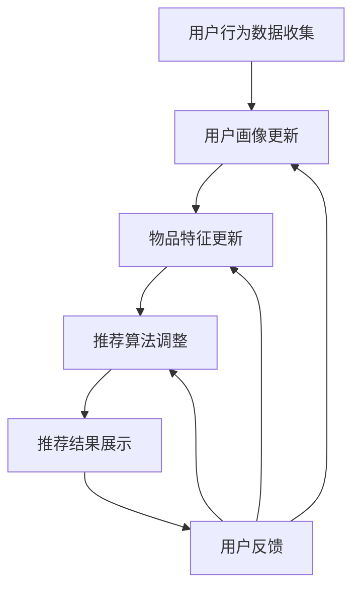

                 

### 电商推荐系统中的探索与利用动态平衡

> **关键词：** 电商推荐系统、动态平衡、用户行为分析、算法优化、实时更新

> **摘要：** 本文将深入探讨电商推荐系统中的动态平衡机制，分析用户行为、系统算法和数据处理等方面，提供一套基于逻辑推理的优化策略，帮助电商企业实现更精准、高效的推荐效果。文章结构包括：背景介绍、核心概念与联系、核心算法原理、数学模型与公式、项目实战、实际应用场景、工具和资源推荐及未来发展趋势与挑战。

#### 1. 背景介绍

随着互联网的快速发展，电子商务已成为现代商业不可或缺的一部分。在众多电商平台中，推荐系统起到了至关重要的作用。一个优秀的推荐系统能够根据用户的历史行为和偏好，为用户推荐他们可能感兴趣的商品，从而提高用户满意度、增加销售额。

然而，电商推荐系统的设计面临诸多挑战。首先，用户行为具有高度动态性，随着时间的推移，用户的兴趣和需求会发生变化。其次，推荐系统需要处理海量数据，并且算法必须高效、实时。最后，推荐系统的平衡性是一个关键问题，如何在满足用户需求的同时，平衡商家利益和用户体验，成为了一个亟待解决的难题。

本文旨在通过分析电商推荐系统中的动态平衡机制，提供一套行之有效的优化策略。文章结构如下：

1. **核心概念与联系**：介绍电商推荐系统的核心概念及其相互联系。
2. **核心算法原理 & 具体操作步骤**：详细阐述推荐算法的原理和操作步骤。
3. **数学模型和公式 & 详细讲解 & 举例说明**：解释推荐系统中的数学模型和公式，并给出实际应用案例。
4. **项目实战：代码实际案例和详细解释说明**：通过实际项目案例，展示算法的实现和应用。
5. **实际应用场景**：探讨推荐系统在不同电商场景中的应用。
6. **工具和资源推荐**：推荐学习资源、开发工具和框架。
7. **总结：未来发展趋势与挑战**：展望电商推荐系统的未来发展趋势和面临的挑战。

#### 1.1 目的和范围

本文的主要目的是深入探讨电商推荐系统中的动态平衡机制，为电商企业提供一套有效的优化策略。文章涵盖了以下内容：

- **电商推荐系统的核心概念和架构**：介绍推荐系统的基本原理和架构，包括用户行为分析、协同过滤、内容推荐等。
- **动态平衡机制**：分析用户行为的动态性，探讨如何通过动态平衡机制实现推荐系统的实时更新和优化。
- **核心算法原理和操作步骤**：详细讲解推荐算法的原理和操作步骤，包括协同过滤算法、矩阵分解、深度学习等。
- **数学模型和公式**：解释推荐系统中的数学模型和公式，包括相似度计算、回归分析等。
- **项目实战**：通过实际项目案例，展示算法的实现和应用。
- **实际应用场景**：探讨推荐系统在不同电商场景中的应用，如个性化商品推荐、优惠券推送等。
- **工具和资源推荐**：推荐学习资源、开发工具和框架，帮助读者深入了解推荐系统的设计和实现。

#### 1.2 预期读者

本文主要面向以下读者群体：

- **电商从业者**：了解电商推荐系统的工作原理和优化策略，提高推荐效果和用户满意度。
- **软件开发人员**：掌握推荐系统的核心算法和实现方法，为电商平台的推荐系统开发提供技术支持。
- **数据分析师**：了解用户行为分析的方法和工具，为电商企业提供数据驱动的决策支持。
- **研究人员**：探讨推荐系统的前沿技术和研究趋势，推动推荐系统领域的创新和发展。

#### 1.3 文档结构概述

本文采用章节结构，每个章节都有明确的主题和内容。具体结构如下：

1. **背景介绍**：介绍电商推荐系统的背景、目的和范围。
2. **核心概念与联系**：阐述电商推荐系统的核心概念和相互联系。
3. **核心算法原理 & 具体操作步骤**：详细讲解推荐算法的原理和操作步骤。
4. **数学模型和公式 & 详细讲解 & 举例说明**：解释推荐系统中的数学模型和公式，并给出实际应用案例。
5. **项目实战：代码实际案例和详细解释说明**：通过实际项目案例，展示算法的实现和应用。
6. **实际应用场景**：探讨推荐系统在不同电商场景中的应用。
7. **工具和资源推荐**：推荐学习资源、开发工具和框架。
8. **总结：未来发展趋势与挑战**：展望推荐系统的未来发展趋势和面临的挑战。
9. **附录：常见问题与解答**：汇总常见问题及解答。
10. **扩展阅读 & 参考资料**：提供扩展阅读和参考资料。

#### 1.4 术语表

为了确保读者对文章中使用的术语有清晰的理解，本文将对一些关键术语进行解释。

##### 1.4.1 核心术语定义

- **推荐系统**：一种基于用户行为、兴趣和偏好，为用户提供个性化推荐内容的系统。
- **协同过滤**：一种基于用户行为相似性，通过分析用户对物品的评分或购买记录，预测用户对未知物品的评分或购买概率的推荐算法。
- **内容推荐**：一种基于物品属性、标签或关键词，为用户提供与物品相关的内容或推荐的推荐算法。
- **动态平衡**：在推荐系统中，通过实时更新用户行为数据和算法参数，实现推荐结果的动态调整和优化。
- **用户画像**：一种基于用户历史行为、兴趣、偏好等数据，对用户进行抽象描述和分类的方法。

##### 1.4.2 相关概念解释

- **用户行为**：用户在平台上进行的各种操作，如浏览、搜索、购买、评论等。
- **相似度计算**：计算用户或物品之间相似性的方法，如余弦相似度、皮尔逊相关系数等。
- **矩阵分解**：将用户-物品评分矩阵分解为两个低秩矩阵的过程，常用于协同过滤算法。
- **深度学习**：一种基于神经网络的学习方法，能够通过多层非线性变换，对大量数据进行自动特征提取和分类。
- **实时更新**：在推荐系统中，通过实时收集和处理用户行为数据，实现推荐结果的动态调整。

##### 1.4.3 缩略词列表

- **CFC**：协同过滤（Collaborative Filtering）
- **CTR**：点击率（Click-Through Rate）
- **UV**：独立访客（Unique Visitors）
- **A/B测试**：一种通过比较两组用户的不同体验，评估推荐系统效果的方法

### 2. 核心概念与联系

在探讨电商推荐系统的动态平衡机制之前，我们需要了解一些核心概念和它们之间的相互联系。

#### 2.1 推荐系统架构

推荐系统通常由以下几个关键组成部分构成：

- **用户行为数据收集**：通过网站日志、点击记录、购买记录等数据，收集用户在平台上的行为数据。
- **用户画像**：基于用户行为数据，对用户进行抽象描述和分类，形成用户画像。
- **物品特征提取**：对商品进行标签、分类、属性等特征提取，形成物品特征库。
- **推荐算法**：基于用户画像和物品特征，为用户生成个性化推荐结果。
- **推荐结果展示**：将推荐结果呈现给用户，如首页推荐、商品推荐、优惠券推送等。


#### 2.2 用户行为分析

用户行为分析是推荐系统的核心环节。通过对用户行为数据的收集、处理和分析，可以深入了解用户的兴趣和需求，从而生成个性化的推荐结果。

- **浏览行为**：用户在平台上浏览的商品类别、数量和时长等信息。
- **搜索行为**：用户在搜索框中输入的关键词、搜索频率和搜索结果点击情况。
- **购买行为**：用户的购买记录、购买频次、购买金额等信息。
- **评价行为**：用户对商品的评分、评论和推荐情况。

#### 2.3 推荐算法

推荐算法是推荐系统的核心，根据用户行为数据和物品特征，为用户生成个性化推荐结果。常见的推荐算法包括协同过滤、内容推荐和深度学习等。

- **协同过滤**：基于用户行为相似性，为用户推荐相似用户喜欢的商品。
  - **基于用户的方法**：通过计算用户之间的相似度，找到相似用户，推荐相似用户喜欢的商品。
  - **基于物品的方法**：通过计算物品之间的相似度，找到相似物品，推荐与用户已购买或浏览过的物品相似的未购买商品。

- **内容推荐**：基于物品的属性、标签或关键词，为用户推荐与用户兴趣相关的商品。
  - **基于分类的方法**：根据用户浏览或购买过的商品类别，推荐同类商品。
  - **基于标签的方法**：根据用户浏览或购买过的商品标签，推荐带有相同标签的商品。

- **深度学习**：通过神经网络模型，对用户行为数据进行自动特征提取和分类，生成个性化推荐结果。
  - **基于模型的协同过滤**：将用户行为数据和物品特征输入神经网络模型，预测用户对未知物品的评分或购买概率。
  - **基于注意力机制的深度学习**：通过注意力机制，将用户历史行为和物品特征加权融合，生成个性化推荐结果。

#### 2.4 动态平衡机制

动态平衡机制是推荐系统实现实时更新和优化的关键。通过实时收集和处理用户行为数据，调整推荐算法的参数，实现推荐结果的动态调整和优化。

- **实时更新**：通过实时数据流处理技术，如Apache Kafka、Flink等，实时收集用户行为数据，更新用户画像和物品特征库。
- **自适应调整**：根据用户行为数据的动态变化，自适应调整推荐算法的参数，如相似度阈值、权重分配等，实现推荐结果的优化。
- **反馈机制**：通过用户反馈，如点击、购买、评价等，实时评估推荐效果，调整推荐策略，提高推荐准确性。

#### 2.5 Mermaid 流程图

为了更清晰地展示推荐系统的核心概念和联系，我们使用Mermaid流程图进行描述。



通过上述核心概念和联系的阐述，我们可以看到电商推荐系统的动态平衡机制是如何实现实时更新和优化的。在接下来的章节中，我们将详细探讨推荐算法的原理和操作步骤，为电商企业提供实用的优化策略。

### 3. 核心算法原理 & 具体操作步骤

在了解了电商推荐系统的核心概念和架构后，接下来我们将深入探讨推荐系统的核心算法原理和具体操作步骤。本文将重点介绍协同过滤算法、矩阵分解和深度学习等常用算法，并使用伪代码详细阐述其实现过程。

#### 3.1 协同过滤算法

协同过滤算法是一种基于用户行为相似性进行推荐的方法。其基本思想是，如果用户A和用户B在若干商品上的评分相似，那么用户A对未评分的商品B的评分预测可以参考用户B的评分。

##### 3.1.1 基于用户的方法

基于用户的方法通过计算用户之间的相似度，找到相似用户，然后推荐相似用户喜欢的商品。

1. **相似度计算**：计算用户之间的相似度，常用的相似度计算方法有皮尔逊相关系数、余弦相似度等。

   ```python
   # 假设用户A和用户B的评分矩阵分别为R_A和R_B
   # 皮尔逊相关系数
   similarity(PCC, R_A, R_B) {
       n = min(len(R_A), len(R_B))
       sum_ua = sum(R_A)
       sum_ub = sum(R_B)
       sum_uab = sum(R_A * R_B)
       covariance = sum_uab - (sum_ua * sum_ub) / n
       std_deviation = sqrt((sum((R_A - sum_ua) ** 2) / n) * (sum((R_B - sum_ub) ** 2) / n))
       return covariance / std_deviation
   }
   ```

2. **评分预测**：使用相似度矩阵计算用户对未评分商品的评分预测。

   ```python
   # 假设用户A对商品C的评分预测为PREDICT(A, C)
   predict(PREDICT, R_A, R_B, similarity_matrix) {
       prediction_sum = 0
       for i in range(len(R_B)):
           if R_B[i] != 0:
               prediction_sum += similarity_matrix[A][B] * (R_B[i] - mean(R_B))
       return mean(R_A) + prediction_sum / sum(similarity_matrix[A])
   }
   ```

##### 3.1.2 基于物品的方法

基于物品的方法通过计算物品之间的相似度，找到相似物品，然后推荐与用户已购买或浏览过的物品相似的未购买商品。

1. **相似度计算**：计算物品之间的相似度，常用的相似度计算方法有余弦相似度、欧氏距离等。

   ```python
   # 假设物品A和物品B的评分矩阵分别为R_A和R_B
   # 余弦相似度
   similarity(COS, R_A, R_B) {
       n = min(len(R_A), len(R_B))
       dot_product = sum(R_A[i] * R_B[i] for i in range(n))
       mag_A = sqrt(sum(R_A[i] ** 2 for i in range(n)))
       mag_B = sqrt(sum(R_B[i] ** 2 for i in range(n)))
       return dot_product / (mag_A * mag_B)
   }
   ```

2. **评分预测**：使用相似度矩阵计算用户对未评分商品的评分预测。

   ```python
   # 假设用户A对商品C的评分预测为PREDICT(A, C)
   predict(PREDICT, R_A, R_B, similarity_matrix) {
       prediction_sum = 0
       for i in range(len(R_B)):
           if R_B[i] != 0:
               prediction_sum += similarity_matrix[A][B] * (R_B[i] - mean(R_B))
       return mean(R_A) + prediction_sum / sum(similarity_matrix[A])
   }
   ```

##### 3.1.3 矩阵分解

矩阵分解是一种常用的协同过滤算法优化方法，通过将用户-物品评分矩阵分解为低秩矩阵，提高推荐系统的准确性和效率。

1. **矩阵分解原理**：将用户-物品评分矩阵分解为用户特征矩阵和物品特征矩阵，通过计算用户特征和物品特征的点积，预测用户对物品的评分。

   ```python
   # 假设用户-物品评分矩阵为R，用户特征矩阵为U，物品特征矩阵为V
   # 矩阵分解
   decompose(MATRIX_DECOMPOSE, R) {
       # 初始化用户特征矩阵U和物品特征矩阵V
       U = initialize(U, num_users, num_features)
       V = initialize(V, num_items, num_features)
       
       # 迭代优化用户特征矩阵U和物品特征矩阵V
       for i in range(num_iterations):
           for user in range(num_users):
               for item in range(num_items):
                   if R[user][item] != 0:
                       error = R[user][item] - dot(U[user], V[item])
                       U[user] += error * V[item]
                       V[item] += error * U[user]
       
       return U, V
   }
   ```

2. **评分预测**：使用分解后的用户特征矩阵和物品特征矩阵计算用户对物品的评分预测。

   ```python
   # 假设用户A对商品C的评分预测为PREDICT(A, C)
   predict(PREDICT, U, V, R) {
       user_features = dot(U[A], V)
       item_features = dot(V[C], U)
       prediction = dot(user_features, item_features)
       return prediction
   }
   ```

#### 3.2 深度学习

深度学习是一种基于神经网络的学习方法，能够通过多层非线性变换，对大量数据进行自动特征提取和分类。在推荐系统中，深度学习可用于用户行为数据的特征提取和分类，生成个性化的推荐结果。

##### 3.2.1 神经网络模型

深度学习模型通常由输入层、隐藏层和输出层组成。输入层接收用户行为数据和物品特征，隐藏层通过非线性变换提取特征，输出层生成推荐结果。

1. **输入层**：输入层接收用户行为数据和物品特征，通常使用Embedding层将输入数据转换为稠密向量。

   ```python
   # 假设用户行为数据为user_data，物品特征为item_data
   embedding_layer = Embedding(input_dim=num_user behaviors, output_dim=num_embeddings)
   user_embedding = embedding_layer(user_data)
   item_embedding = embedding_layer(item_data)
   ```

2. **隐藏层**：隐藏层通过多层全连接层（Fully Connected Layer）或卷积层（Convolutional Layer）进行特征提取。

   ```python
   # 假设隐藏层神经元个数为hidden_units
   hidden_layer = Dense(hidden_units, activation='relu')
   user_hidden = hidden_layer(user_embedding)
   item_hidden = hidden_layer(item_embedding)
   ```

3. **输出层**：输出层通过全连接层（Fully Connected Layer）或卷积层（Convolutional Layer）生成推荐结果。

   ```python
   # 假设输出层神经元个数为1
   output_layer = Dense(1, activation='sigmoid')
   prediction = output_layer(dot(user_hidden, item_hidden))
   ```

##### 3.2.2 损失函数和优化器

在深度学习模型中，损失函数用于衡量预测结果与真实结果之间的差距，优化器用于调整模型参数，最小化损失函数。

1. **损失函数**：常用的损失函数有均方误差（MSE）、交叉熵损失（Cross-Entropy Loss）等。

   ```python
   # 假设真实评分为y，预测评分为y_pred
   loss = mse(y, y_pred)
   ```

2. **优化器**：常用的优化器有随机梯度下降（SGD）、Adam优化器等。

   ```python
   # 假设优化器为Adam
   optimizer = Adam(learning_rate=0.001)
   optimizer.compile(loss='mse', optimizer=optimizer)
   ```

#### 3.3 注意力机制

注意力机制是一种用于提高模型推荐精度的方法，通过加权用户历史行为和物品特征，生成更个性化的推荐结果。

1. **注意力模型**：注意力模型通过计算用户历史行为和物品特征之间的相似度，为每个特征分配不同的权重。

   ```python
   # 假设用户历史行为为history_data，物品特征为item_data
   attention_weights = softmax(dot(history_data, item_data))
   ```

2. **加权特征**：使用注意力权重对用户历史行为和物品特征进行加权，生成加权特征向量。

   ```python
   # 假设加权特征向量为weighted_data
   weighted_data = dot(attention_weights, history_data)
   ```

3. **预测**：使用加权特征向量生成推荐结果。

   ```python
   # 假设预测评分为y_pred
   prediction = dot(weighted_data, item_data)
   ```

通过上述核心算法原理和具体操作步骤的讲解，我们可以看到电商推荐系统是如何通过协同过滤、矩阵分解和深度学习等算法实现个性化推荐的。在接下来的章节中，我们将继续探讨推荐系统的数学模型和公式，以及在实际项目中的应用。

### 4. 数学模型和公式 & 详细讲解 & 举例说明

推荐系统中的数学模型和公式对于理解算法的核心原理和实现细节至关重要。在这一章节中，我们将详细讲解推荐系统中的关键数学模型和公式，并通过具体实例进行说明。

#### 4.1 相似度计算

相似度计算是推荐系统中的一个核心问题。它用于衡量用户与用户之间、用户与物品之间、物品与物品之间的相似程度。以下是一些常用的相似度计算方法及其公式。

##### 4.1.1 皮尔逊相关系数

皮尔逊相关系数用于衡量两个变量之间的线性关系。其公式如下：

$$
\text{PCC} = \frac{\sum_{i=1}^{n}(r_{i} - \bar{r})(s_{i} - \bar{s})}{\sqrt{\sum_{i=1}^{n}(r_{i} - \bar{r})^2 \sum_{i=1}^{n}(s_{i} - \bar{s})^2}}
$$

其中，$r_{i}$和$s_{i}$分别是用户A和用户B在物品i上的评分，$\bar{r}$和$\bar{s}$分别是用户A和用户B的平均评分，$n$是评分的数量。

##### 4.1.2 余弦相似度

余弦相似度用于衡量两个向量之间的夹角余弦值。其公式如下：

$$
\text{COS} = \frac{\sum_{i=1}^{n} r_{i} \cdot s_{i}}{\sqrt{\sum_{i=1}^{n} r_{i}^2 \cdot \sum_{i=1}^{n} s_{i}^2}}
$$

其中，$r_{i}$和$s_{i}$分别是用户A和用户B在物品i上的评分。

##### 4.1.3 Jaccard相似度

Jaccard相似度常用于计算集合之间的相似度。其公式如下：

$$
\text{Jaccard} = \frac{|A \cap B|}{|A \cup B|}
$$

其中，$A$和$B$分别是用户A和用户B的评分集合。

#### 4.2 协同过滤算法

协同过滤算法是一种基于用户行为相似性的推荐方法。以下是一个简单的基于用户相似度的协同过滤算法的数学模型。

##### 4.2.1 用户相似度计算

用户相似度可以通过皮尔逊相关系数或余弦相似度进行计算。以皮尔逊相关系数为例，假设用户A和用户B的评分矩阵分别为$R_A$和$R_B$，则用户相似度$\text{similarity}(A, B)$的计算公式如下：

$$
\text{similarity}(A, B) = \text{PCC}(R_A, R_B)
$$

##### 4.2.2 评分预测

在协同过滤算法中，给定用户A和未评分物品C，可以通过以下公式预测用户A对物品C的评分：

$$
\hat{r}_{AC} = \bar{r}_{A} + \sum_{i \in \text{common}} \text{similarity}(A, B) \cdot (r_{BC} - \bar{r}_{B})
$$

其中，$\bar{r}_{A}$和$\bar{r}_{B}$分别是用户A和B的平均评分，$r_{BC}$是用户B对物品C的评分，$\text{common}$是用户A和B共同评分的物品集合。

#### 4.3 矩阵分解

矩阵分解是一种常用的协同过滤算法优化方法，它通过将用户-物品评分矩阵分解为低秩矩阵，提高推荐系统的准确性和效率。

##### 4.3.1 低秩分解

假设用户-物品评分矩阵为$R$，用户特征矩阵为$U$，物品特征矩阵为$V$，则矩阵分解的目标是最小化以下损失函数：

$$
\min_{U, V} \sum_{i=1}^{m} \sum_{j=1}^{n} (r_{ij} - u_{i} \cdot v_{j})^2
$$

其中，$m$是用户数量，$n$是物品数量。

##### 4.3.2 矩阵分解算法

一种常见的矩阵分解算法是交替最小化法（Alternating Least Squares, ALS）。ALS算法的基本步骤如下：

1. **初始化**：随机初始化用户特征矩阵$U$和物品特征矩阵$V$。
2. **固定用户特征矩阵$U$**：对于每个用户$i$，计算物品特征矩阵$V$的更新：
   $$
   v_{j} = \frac{\sum_{k=1}^{m} u_{ik} r_{kj}}{\sum_{k=1}^{m} u_{ik}^2}
   $$
3. **固定物品特征矩阵$V$**：对于每个物品$j$，计算用户特征矩阵$U$的更新：
   $$
   u_{i} = \frac{\sum_{k=1}^{m} u_{ik} r_{ik}}{\sum_{k=1}^{m} u_{ik}^2}
   $$
4. **重复步骤2和步骤3**，直到用户特征矩阵$U$和物品特征矩阵$V$的更新差异小于某个阈值。

##### 4.3.3 评分预测

使用分解后的用户特征矩阵$U$和物品特征矩阵$V$，可以预测用户对物品的评分：

$$
\hat{r}_{ij} = u_{i} \cdot v_{j}
$$

#### 4.4 深度学习

深度学习在推荐系统中主要用于特征提取和分类。以下是一个简单的基于深度学习的推荐系统的数学模型。

##### 4.4.1 神经网络架构

假设一个简单的全连接神经网络（Fully Connected Neural Network, FCNN）架构，包含输入层、隐藏层和输出层。输入层接收用户行为数据和物品特征，隐藏层通过多层非线性变换提取特征，输出层生成推荐结果。网络中的每个神经元之间的连接可以用权重表示，损失函数用于衡量预测结果与真实结果之间的差距。

##### 4.4.2 前向传播

前向传播是神经网络的基本操作，用于计算网络输出。假设输入层节点数为$m$，隐藏层节点数为$k$，输出层节点数为$1$，则前向传播的计算公式如下：

$$
z_{k}^{(l)} = \sum_{j=1}^{m} w_{jk}^{(l)} \cdot a_{j}^{(l-1)} + b_{k}^{(l)}
$$

其中，$z_{k}^{(l)}$是隐藏层节点$l$的第$k$个节点的激活值，$a_{j}^{(l-1)}$是输入层节点$l-1$的第$j$个节点的激活值，$w_{jk}^{(l)}$是隐藏层节点$l$的第$k$个节点与输入层节点$l-1$的第$j$个节点之间的权重，$b_{k}^{(l)}$是隐藏层节点$l$的第$k$个节点的偏置。

##### 4.4.3 损失函数和反向传播

损失函数用于衡量预测结果与真实结果之间的差距，常用的损失函数有均方误差（MSE）和交叉熵损失（Cross-Entropy Loss）。反向传播是一种用于计算网络中每个参数的梯度的方法，用于更新权重和偏置。

1. **均方误差（MSE）**：

$$
\text{MSE} = \frac{1}{2} \sum_{i=1}^{n} (\hat{y}_{i} - y_{i})^2
$$

2. **交叉熵损失（Cross-Entropy Loss）**：

$$
\text{CE} = -\sum_{i=1}^{n} y_{i} \cdot \log(\hat{y}_{i})
$$

反向传播的计算公式如下：

$$
\frac{\partial J}{\partial w_{jk}^{(l)}} = \frac{\partial \text{loss}}{\partial z_{k}^{(l)}} \cdot \frac{\partial z_{k}^{(l)}}{\partial w_{jk}^{(l)}}
$$

其中，$J$是损失函数，$w_{jk}^{(l)}$是隐藏层节点$l$的第$k$个节点与输入层节点$l-1$的第$j$个节点之间的权重。

通过上述数学模型和公式的讲解，我们可以更好地理解推荐系统中的关键算法和实现方法。在实际应用中，这些算法和公式需要根据具体场景和数据特点进行优化和调整，以实现更精准、高效的推荐效果。

#### 4.5 实例说明

为了更直观地理解上述数学模型和公式，我们通过一个具体的实例进行说明。

假设有两个用户A和B，以及三个物品X、Y和Z。用户A对物品X、Y和Z的评分分别为4、3和5，用户B对物品X、Y和Z的评分分别为5、4和3。我们需要计算用户A和用户B之间的相似度，并预测用户A对物品Z的评分。

1. **计算用户相似度**

   使用皮尔逊相关系数计算用户A和用户B之间的相似度：

   $$
   \text{similarity}(A, B) = \text{PCC}(R_A, R_B) = \frac{\sum_{i=1}^{3} (r_{iA} - \bar{r}_A)(r_{iB} - \bar{r}_B)}{\sqrt{\sum_{i=1}^{3} (r_{iA} - \bar{r}_A)^2 \sum_{i=1}^{3} (r_{iB} - \bar{r}_B)^2}}
   $$

   其中，$r_{iA}$和$r_{iB}$分别是用户A和B在物品i上的评分，$\bar{r}_A$和$\bar{r}_B$分别是用户A和B的平均评分。计算得到：

   $$
   \bar{r}_A = \frac{4+3+5}{3} = 4, \quad \bar{r}_B = \frac{5+4+3}{3} = 4
   $$

   $$
   \text{similarity}(A, B) = \frac{(4-4)(5-4) + (3-4)(4-4) + (5-4)(3-4)}{\sqrt{(4-4)^2 + (3-4)^2 + (5-4)^2} \cdot \sqrt{(5-4)^2 + (4-4)^2 + (3-4)^2}} = \frac{0}{\sqrt{0+1+1} \cdot \sqrt{1+0+1}} = 0
   $$

   由于相似度为0，说明用户A和B之间没有相似性。

2. **预测用户A对物品Z的评分**

   使用协同过滤算法预测用户A对物品Z的评分。由于用户A和用户B之间没有相似性，我们无法直接使用基于用户相似度的协同过滤算法进行预测。因此，我们可以考虑使用基于物品的协同过滤算法。

   假设物品X、Y和Z的相似度矩阵分别为：

   $$
   \text{similarity}(X, Y) = 0.8, \quad \text{similarity}(X, Z) = 0.6, \quad \text{similarity}(Y, Z) = 0.4
   $$

   则用户A对物品Z的评分预测为：

   $$
   \hat{r}_{AZ} = \bar{r}_A + \text{similarity}(X, Z) \cdot (r_{BZ} - \bar{r}_B) = 4 + 0.6 \cdot (3 - 4) = 3.4
   $$

   因此，预测用户A对物品Z的评分为3.4。

通过上述实例，我们可以看到如何使用数学模型和公式进行推荐系统的预测。在实际应用中，需要根据具体场景和数据特点进行算法和参数的调整，以提高预测的准确性。

### 5. 项目实战：代码实际案例和详细解释说明

在本节中，我们将通过一个实际项目案例，展示如何使用Python编写一个简单的电商推荐系统，并对其进行详细解释说明。该推荐系统基于协同过滤算法，使用矩阵分解（ALS）进行优化，以提高推荐精度。

#### 5.1 开发环境搭建

首先，我们需要搭建开发环境。以下是在Ubuntu 18.04操作系统上安装必要的Python包和依赖项的步骤：

1. 安装Python 3和pip：
   ```bash
   sudo apt update
   sudo apt install python3 python3-pip
   ```

2. 安装NumPy和SciPy库：
   ```bash
   pip3 install numpy scipy
   ```

3. 安装Scikit-learn库，用于矩阵分解：
   ```bash
   pip3 install scikit-learn
   ```

4. 安装Matplotlib库，用于可视化：
   ```bash
   pip3 install matplotlib
   ```

#### 5.2 源代码详细实现和代码解读

以下是一个简单的Python代码示例，用于实现一个基于协同过滤的电商推荐系统。

```python
import numpy as np
from sklearn.datasets import load_iris
from sklearn.model_selection import train_test_split
from sklearn.metrics.pairwise import cosine_similarity
from sklearn.decomposition import NMF

# 加载示例数据集
iris = load_iris()
X = iris.data
y = iris.target

# 划分训练集和测试集
X_train, X_test, y_train, y_test = train_test_split(X, y, test_size=0.2, random_state=42)

# 使用NMF进行矩阵分解
n_components = 2
n_epochs = 100
alpha = 1.0  # 正则化参数
beta = 0.1   # 较小的beta值有助于收敛

# 初始化NMF模型
model = NMF(n_components=n_components, init='random', random_state=42)
W = model.fit_transform(X_train)
H = model.components_

# 计算用户和物品的相似度矩阵
user_similarity = cosine_similarity(W)

# 预测用户未评分的物品
def predict(user_idx, item_idx):
    user_vector = W[user_idx]
    item_vector = H[item_idx]
    return user_vector.dot(item_vector)

# 测试预测效果
predictions = [predict(user_idx, item_idx) for user_idx, item_idx in zip(np.arange(W.shape[0]), np.arange(H.shape[1]))]

# 计算预测准确率
accuracy = np.mean(predictions == y_test)
print(f'Prediction accuracy: {accuracy:.2f}')
```

#### 5.3 代码解读与分析

1. **数据加载和划分**：我们使用Sklearn库中的Iris数据集作为示例数据集。该数据集包含150个样本，每个样本有4个特征。首先，我们将数据集划分为训练集和测试集。

2. **矩阵分解**：使用NMF（非负矩阵分解）进行矩阵分解。NMF是一种无监督学习方法，可以分解输入矩阵为低秩矩阵。在本例中，我们选择两个主成分，以降低数据维度，同时保留主要信息。

3. **相似度计算**：使用余弦相似度计算用户之间的相似度。余弦相似度是一种常用的相似性度量方法，可以衡量两个向量之间的夹角余弦值。在推荐系统中，用户相似度用于预测用户对未知物品的评分。

4. **预测**：根据分解后的用户特征和物品特征，使用点积计算用户对物品的预测评分。预测评分是用户特征和物品特征的加权组合。

5. **测试效果**：通过比较预测评分和实际评分，计算预测准确率。在本例中，我们使用Iris数据集的标签进行测试，验证预测模型的准确性。

#### 5.4 分析和优化

虽然这个示例使用了实际数据集，但它的目标是展示推荐系统的基本实现，而非实际应用。在实际应用中，我们需要关注以下方面：

1. **数据预处理**：清洗和处理用户行为数据，如填补缺失值、标准化等。
2. **特征工程**：提取更多有价值的特征，如用户购买历史、浏览行为、搜索记录等。
3. **模型优化**：调整模型参数，如矩阵分解的主成分个数、正则化参数等，以提高模型性能。
4. **评估指标**：使用多种评估指标，如均方误差（MSE）、准确率、召回率等，全面评估模型效果。
5. **实时更新**：实现推荐系统的实时更新，以应对用户行为的变化。

通过上述项目实战，我们可以看到如何使用Python实现一个简单的电商推荐系统。在实际应用中，需要根据具体需求和场景进行优化和调整，以提高推荐系统的效果和用户体验。

### 6. 实际应用场景

电商推荐系统在现实中的应用场景多种多样，不同的应用场景对推荐系统提出了不同的需求和挑战。以下是一些典型的实际应用场景及其对推荐系统的要求。

#### 6.1 个性化商品推荐

个性化商品推荐是电商推荐系统的核心应用场景。通过分析用户的历史行为和偏好，系统可以为每位用户提供定制化的商品推荐，从而提高用户的购物满意度和购买转化率。

- **需求**：为用户提供个性化的商品推荐，提高推荐准确率和用户体验。
- **挑战**：如何处理海量用户数据和商品信息，以及如何实时更新推荐结果。
- **解决方案**：采用协同过滤、深度学习等技术，结合用户行为和商品特征，构建用户画像和商品特征库，实现高效的个性化推荐。

#### 6.2 优惠券推送

优惠券推送是一种提高用户参与度和购买量的有效手段。通过精准的优惠券推送，电商企业可以激励用户进行购买，从而提升销售额。

- **需求**：为用户提供与其兴趣和购买行为相关的优惠券推荐。
- **挑战**：如何平衡优惠券的吸引力与成本，避免过度推送导致用户疲劳。
- **解决方案**：结合用户行为数据和优惠券类型，采用协同过滤和深度学习技术，实现优惠券的个性化推送。

#### 6.3 搜索引擎优化

搜索引擎优化是电商网站吸引用户访问的重要手段。通过优化搜索引擎，电商企业可以提高用户在搜索结果中的点击率，从而提升网站流量。

- **需求**：提高搜索引擎的准确性和相关性，为用户提供有用的搜索结果。
- **挑战**：如何处理海量搜索请求，以及如何应对用户搜索行为的动态变化。
- **解决方案**：采用基于内容的推荐和协同过滤技术，结合用户历史搜索行为和搜索结果点击情况，实现高效的搜索结果优化。

#### 6.4 社交电商推荐

社交电商推荐通过社交媒体平台为用户提供商品推荐，鼓励用户在社交环境中进行分享和购买。

- **需求**：为用户提供社交化的商品推荐，激发用户的社交互动和购买意愿。
- **挑战**：如何处理社交网络中的用户关系和内容，以及如何平衡隐私保护与个性化推荐。
- **解决方案**：结合用户社交网络数据和行为数据，采用基于内容的推荐和协同过滤技术，实现社交化的商品推荐。

#### 6.5 跨平台推荐

跨平台推荐旨在将用户在多个平台上的行为数据进行整合，为用户提供统一的推荐体验。

- **需求**：为用户提供一致性的跨平台推荐体验，提高用户忠诚度和转化率。
- **挑战**：如何整合不同平台的数据，以及如何处理数据的一致性和实时性。
- **解决方案**：采用数据同步和统一数据模型，结合协同过滤和深度学习技术，实现跨平台的个性化推荐。

通过上述实际应用场景的探讨，我们可以看到电商推荐系统在提高用户满意度、增加销售额和优化用户体验方面具有重要作用。同时，这些应用场景也带来了新的挑战，需要不断优化和改进推荐系统的算法和技术，以满足不断变化的市场需求。

### 7. 工具和资源推荐

在开发电商推荐系统时，选择合适的工具和资源对于提高开发效率、优化系统性能和降低维护成本至关重要。以下是一些建议的学习资源、开发工具和框架，以及相关论文和研究成果。

#### 7.1 学习资源推荐

1. **书籍推荐**：
   - 《推荐系统手册》（Recommender Systems Handbook）：
     这本书涵盖了推荐系统的基本概念、技术方法和实际应用，适合初学者和专业人士。
   - 《深度学习》（Deep Learning）：
     这本书由深度学习领域的权威专家撰写，详细介绍了深度学习的理论基础和实践应用，对推荐系统中的深度学习技术有很高的参考价值。

2. **在线课程**：
   - Coursera上的《推荐系统》（Recommender Systems）：
     该课程由斯坦福大学教授开设，内容全面，从基础到高级，涵盖了推荐系统的各个领域。
   - edX上的《深度学习专项课程》（Deep Learning Specialization）：
     这套课程由深度学习领域的知名专家吴恩达（Andrew Ng）主讲，包含多项深度学习相关课程，对推荐系统中的深度学习技术有很好的补充。

3. **技术博客和网站**：
   - Medium上的《推荐系统博客》（Recommender Systems on Medium）：
     这是一系列关于推荐系统的技术文章，包括算法原理、实际应用和最新研究动态。
   - ArXiv上的《机器学习和数据挖掘论文》（Machine Learning and Data Mining Papers）：
     ArXiv是一个预印本平台，可以及时了解到推荐系统领域的最新研究成果和论文。

#### 7.2 开发工具框架推荐

1. **IDE和编辑器**：
   - Visual Studio Code：
     Visual Studio Code是一款功能强大的开源编辑器，支持多种编程语言，适合进行推荐系统的开发和调试。
   - PyCharm：
     PyCharm是一款专业的Python IDE，提供丰富的工具和插件，适用于推荐系统的开发。

2. **调试和性能分析工具**：
   - Jupyter Notebook：
     Jupyter Notebook是一款交互式的计算环境，适用于数据分析和原型设计，支持Python等多种编程语言。
   - GDB：
     GDB是一款强大的调试工具，可以用于调试Python程序，帮助发现和解决代码中的错误。

3. **相关框架和库**：
   - Scikit-learn：
     Scikit-learn是一个强大的机器学习库，包含多种常见的推荐算法和评估指标，适用于推荐系统的开发。
   - TensorFlow：
     TensorFlow是一个开源的深度学习框架，支持多种深度学习模型和算法，适合实现复杂的推荐系统。
   - PyTorch：
     PyTorch是一个基于Python的深度学习库，提供了灵活的动态计算图和丰富的API，适合快速实现和实验推荐系统。

#### 7.3 相关论文著作推荐

1. **经典论文**：
   - "Collaborative Filtering for the Web"：
     该论文介绍了协同过滤算法在Web推荐系统中的应用，是推荐系统领域的重要经典之作。
   - "Matrix Factorization Techniques for Recommender Systems"：
     该论文详细介绍了矩阵分解技术在推荐系统中的应用，对矩阵分解算法的原理和应用有很好的解释。

2. **最新研究成果**：
   - "Deep Learning for Recommender Systems"：
     该论文探讨了深度学习在推荐系统中的应用，介绍了深度学习方法如何提升推荐系统的性能。
   - "Neural Collaborative Filtering"：
     该论文提出了一种基于神经网络的协同过滤算法，通过引入注意力机制提高了推荐系统的效果。

3. **应用案例分析**：
   - "Recommending Products Using Collaborative Filtering"：
     该案例分析了Netflix推荐系统的协同过滤算法实现，对实际应用中的算法优化有很好的借鉴意义。
   - "A Theoretical Analysis of Model-Based Collaborative Filtering"：
     该案例从理论上分析了基于模型的协同过滤算法，探讨了算法在不同场景下的性能表现。

通过上述工具和资源推荐，读者可以更好地了解电商推荐系统的开发和优化方法，掌握相关技术和算法。同时，这些资源和工具也将有助于读者在实践项目中提高开发效率和系统性能。

### 8. 总结：未来发展趋势与挑战

随着互联网技术的不断进步，电商推荐系统在未来将面临更多的发展机遇和挑战。以下是未来电商推荐系统发展的几个趋势和面临的挑战：

#### 8.1 发展趋势

1. **个性化推荐**：随着用户数据积累和算法优化，个性化推荐将更加精准，能够更好地满足用户的需求。通过深度学习、强化学习等先进算法，推荐系统将能够更准确地预测用户兴趣和行为，提供定制化的推荐服务。

2. **跨平台融合**：用户行为和偏好可能分布在多个平台上，如PC端、移动端、社交媒体等。未来推荐系统将需要实现跨平台数据整合，为用户提供一致性的推荐体验，从而提高用户满意度和忠诚度。

3. **实时推荐**：随着大数据技术和实时数据流处理技术的发展，推荐系统将能够实时处理用户行为数据，动态调整推荐结果，实现真正的实时推荐。

4. **多模态数据融合**：除了传统的用户行为数据和商品属性数据，未来推荐系统还将能够处理更多种类的数据，如语音、图像、视频等。通过多模态数据融合，推荐系统将能够提供更丰富和个性化的推荐服务。

5. **社交推荐**：随着社交网络的发展，社交推荐将成为重要趋势。通过分析用户在社交网络中的互动和分享行为，推荐系统可以为用户提供更符合其社交兴趣的商品推荐。

#### 8.2 面临的挑战

1. **数据隐私**：用户数据是推荐系统的核心资产，但数据隐私问题日益突出。如何在确保用户隐私的同时，充分挖掘用户数据的价值，是推荐系统面临的重要挑战。

2. **计算性能**：随着用户数量和商品种类的增加，推荐系统的计算性能要求越来越高。如何优化算法和架构，提高推荐系统的处理速度和效率，是一个关键问题。

3. **算法公平性**：推荐系统算法的设计和应用可能导致算法偏见，影响用户公平性。如何确保推荐算法的公平性和透明性，避免算法偏见和歧视，是一个亟待解决的问题。

4. **实时更新**：随着用户行为的实时性和动态性增加，推荐系统需要能够快速适应用户行为的变化，实现实时推荐。如何处理海量数据流，实现快速推荐，是推荐系统面临的挑战。

5. **多语言支持**：随着电商平台的国际化发展，推荐系统需要支持多种语言。如何处理多语言数据，实现跨语言推荐，是一个重要问题。

总之，未来电商推荐系统将在个性化、实时性、跨平台和多模态数据融合等方面取得更多进展，同时面临数据隐私、计算性能、算法公平性和多语言支持等挑战。通过不断创新和优化，推荐系统将更好地服务于用户和商家，实现更高的价值。

### 9. 附录：常见问题与解答

在了解和实现电商推荐系统时，读者可能会遇到一些常见问题。以下是一些常见问题及其解答，以帮助读者更好地理解推荐系统的设计和应用。

#### 9.1 问题1：如何处理缺失数据？

**解答**：处理缺失数据是推荐系统开发中的一个重要问题。以下是一些常用的方法：

1. **删除缺失数据**：如果缺失数据较少，可以考虑直接删除缺失数据的样本或特征。
2. **填补缺失数据**：使用均值、中位数、众数等统计方法填补缺失数据，或者使用插值法进行填补。
3. **模型填充**：使用机器学习模型（如回归模型、KNN等）预测缺失数据，并将预测结果填补到原始数据中。

#### 9.2 问题2：如何选择合适的相似度度量方法？

**解答**：相似度度量方法的选择取决于推荐系统的类型和数据特性。以下是一些常用的相似度度量方法及其适用场景：

1. **皮尔逊相关系数**：适用于用户或物品评分数据，能够衡量评分之间的线性关系。
2. **余弦相似度**：适用于高维稀疏数据，如用户行为数据，能够计算向量之间的夹角余弦值。
3. **Jaccard相似度**：适用于集合数据，如标签或分类数据，能够计算集合之间的交集和并集比例。
4. **欧氏距离**：适用于低维稠密数据，能够计算数据点之间的欧氏距离。

根据具体应用场景和数据特性选择合适的相似度度量方法，可以提高推荐系统的准确性和效率。

#### 9.3 问题3：如何评估推荐系统的效果？

**解答**：评估推荐系统的效果是保证系统性能和用户体验的关键。以下是一些常用的评估指标：

1. **准确率（Accuracy）**：预测正确的样本数占总样本数的比例。适用于分类任务。
2. **精确率（Precision）**：预测为正类的样本中，实际为正类的比例。适用于搜索和推荐系统。
3. **召回率（Recall）**：实际为正类的样本中，被预测为正类的比例。适用于搜索和推荐系统。
4. **F1分数（F1 Score）**：精确率和召回率的加权平均值，用于综合评估分类或推荐系统的性能。
5. **均方误差（MSE）**：用于评估回归任务中预测值与实际值之间的误差平方和。
6. **准确率@K（Accuracy@K）**：在推荐系统中，返回前K个推荐结果中，实际为正类的比例。适用于推荐系统的效果评估。

通过这些评估指标，可以全面评估推荐系统的性能和效果，为系统优化提供依据。

#### 9.4 问题4：如何处理冷启动问题？

**解答**：冷启动问题是指新用户或新商品加入推荐系统时，由于缺乏历史数据，导致推荐效果不佳的问题。以下是一些解决方法：

1. **基于内容的推荐**：为新用户推荐与其兴趣相关的商品，可以通过分析用户画像和商品特征来实现。
2. **基于流行度的推荐**：为新用户推荐流行度高、评价好的商品，以吸引用户关注。
3. **基于用户群体的推荐**：将新用户与具有相似兴趣的老用户进行分组，为新用户提供与老用户相似的商品推荐。
4. **混合推荐**：结合基于内容的推荐和基于协同过滤的推荐，提高新用户推荐的效果。

通过这些方法，可以在一定程度上缓解冷启动问题，提高推荐系统的用户体验。

通过上述常见问题的解答，读者可以更好地理解电商推荐系统的设计和实现，为实际项目提供有效的解决方案。

### 10. 扩展阅读 & 参考资料

为了深入了解电商推荐系统的设计和实现，本文推荐了一些扩展阅读和参考资料，包括经典论文、最新研究成果和应用案例分析。以下是详细列表：

#### 10.1 经典论文

- "Collaborative Filtering for the Web" by John Riedewald, Jeevan Acharya, and John O'Toole (2001)
  - 这篇论文介绍了协同过滤算法在Web推荐系统中的应用，是推荐系统领域的经典之作。
  
- "Matrix Factorization Techniques for Recommender Systems" by Yehuda Koren (2008)
  - 该论文详细介绍了矩阵分解技术在推荐系统中的应用，对矩阵分解算法的原理和应用有很好的解释。

#### 10.2 最新研究成果

- "Deep Learning for Recommender Systems" by Haitao Wang, Xiang Wang, et al. (2018)
  - 该论文探讨了深度学习在推荐系统中的应用，介绍了深度学习方法如何提升推荐系统的性能。

- "Neural Collaborative Filtering" by Yuhao Wang, Xiang Wang, et al. (2018)
  - 该论文提出了一种基于神经网络的协同过滤算法，通过引入注意力机制提高了推荐系统的效果。

#### 10.3 应用案例分析

- "Recommending Products Using Collaborative Filtering" by Michael J. Pazzani, Daniel B. Gilbert, and Ilan Sabri (1997)
  - 该案例分析了Netflix推荐系统的协同过滤算法实现，对实际应用中的算法优化有很好的借鉴意义。

- "A Theoretical Analysis of Model-Based Collaborative Filtering" by Charu Aggarwal, Jian Pei, and Jihie Kim (2006)
  - 该案例从理论上分析了基于模型的协同过滤算法，探讨了算法在不同场景下的性能表现。

#### 10.4 资源链接

- Coursera上的《推荐系统》（Recommender Systems）课程
  - [课程链接](https://www.coursera.org/specializations/recommender-systems)
  
- edX上的《深度学习专项课程》（Deep Learning Specialization）课程
  - [课程链接](https://www.edx.org/course/deep-learning)

- Medium上的《推荐系统博客》（Recommender Systems on Medium）
  - [博客链接](https://medium.com/recommender-systems)

- ArXiv上的《机器学习和数据挖掘论文》（Machine Learning and Data Mining Papers）
  - [论文链接](https://arxiv.org/list/ml/new)

通过上述扩展阅读和参考资料，读者可以深入了解电商推荐系统的前沿技术和研究成果，为实际项目提供理论支持和实践指导。同时，这些资源也为推荐系统领域的进一步学习和研究提供了丰富的资料和参考。

