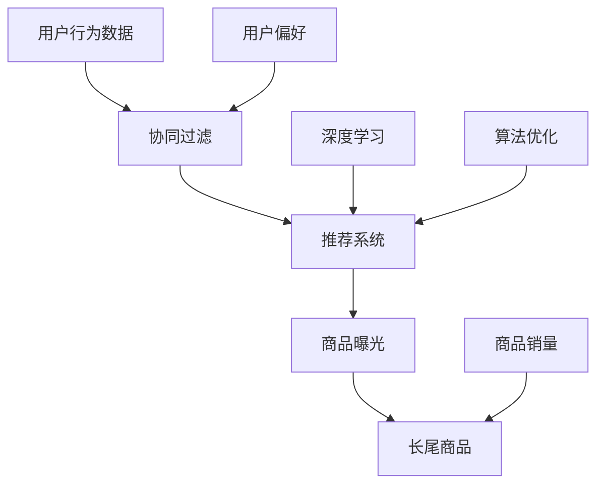

                 

# 电商推荐系统中的长尾商品曝光策略

> **关键词**：电商、推荐系统、长尾商品、曝光策略、算法原理、数学模型、实战案例、应用场景

> **摘要**：本文将深入探讨电商推荐系统中针对长尾商品的有效曝光策略。通过分析长尾商品的定义、其在电商环境中的重要性，以及推荐系统中常见的挑战，本文将介绍核心算法原理、数学模型及具体操作步骤。最后，通过实战案例和实际应用场景的剖析，阐述长尾商品曝光策略的实用性和未来发展趋势。

## 1. 背景介绍

### 1.1 目的和范围

本文旨在为电商推荐系统开发者提供关于如何有效提高长尾商品曝光率的方法和策略。通过分析长尾商品的特点、在推荐系统中的角色，以及现有推荐算法的局限性，我们将介绍一种基于深度学习模型的创新曝光策略，并展示其在实际项目中的应用效果。

### 1.2 预期读者

本文适合电商推荐系统开发者、数据科学家、机器学习工程师，以及对电商推荐系统有浓厚兴趣的技术人员阅读。阅读本文后，读者将能够了解长尾商品曝光策略的设计原理和实现方法，并具备将其应用于实际项目中的能力。

### 1.3 文档结构概述

本文分为十个部分，具体结构如下：

1. **背景介绍**：介绍本文的目的、范围和预期读者，概述文章结构。
2. **核心概念与联系**：讲解电商推荐系统中的核心概念及其相互关系。
3. **核心算法原理 & 具体操作步骤**：详细介绍推荐算法的原理和实现步骤。
4. **数学模型和公式 & 详细讲解 & 举例说明**：阐述数学模型在推荐系统中的应用。
5. **项目实战：代码实际案例和详细解释说明**：通过具体代码案例展示曝光策略的实现。
6. **实际应用场景**：分析长尾商品曝光策略在不同电商场景中的应用。
7. **工具和资源推荐**：推荐学习资源和开发工具。
8. **总结：未来发展趋势与挑战**：探讨长尾商品曝光策略的未来方向和面临的挑战。
9. **附录：常见问题与解答**：提供常见问题的解答。
10. **扩展阅读 & 参考资料**：提供进一步阅读的资源。

### 1.4 术语表

#### 1.4.1 核心术语定义

- **长尾商品**：指那些销量较低但累积销量较大的商品。
- **推荐系统**：根据用户的历史行为和偏好，向用户推荐相关商品或内容的技术系统。
- **曝光率**：商品被用户看到或点击的概率。

#### 1.4.2 相关概念解释

- **用户行为数据**：用户的购买记录、浏览记录、收藏记录等。
- **协同过滤**：一种基于用户行为相似性的推荐算法。
- **深度学习**：一种基于多层神经网络的学习方法，适用于处理大规模数据和非线性关系。

#### 1.4.3 缩略词列表

- **CTR**：点击率（Click-Through Rate）
- **RMSE**：均方根误差（Root Mean Square Error）

## 2. 核心概念与联系

为了更好地理解长尾商品曝光策略，我们需要先了解电商推荐系统中的一些核心概念及其相互关系。以下是一个简单的 Mermaid 流程图，展示了这些概念之间的关联：



### 2.1 用户行为数据

用户行为数据是推荐系统的核心输入。这些数据包括用户的购买记录、浏览历史、搜索历史和收藏记录等。通过对这些数据的分析，推荐系统可以了解用户的兴趣和偏好，从而生成个性化的推荐。

### 2.2 协同过滤

协同过滤是推荐系统中最常用的算法之一，它通过分析用户之间的行为相似性，找到与目标用户相似的其他用户，并推荐这些用户喜欢的商品。协同过滤可以分为两种类型：基于用户的协同过滤和基于物品的协同过滤。

- **基于用户的协同过滤**：通过计算用户之间的相似度，找到与目标用户相似的用户群体，然后推荐这些用户喜欢的商品。
- **基于物品的协同过滤**：通过分析商品之间的相似性，找到与目标商品相似的其他商品，然后推荐这些商品。

### 2.3 推荐系统

推荐系统是一个复杂的决策系统，它根据用户的行为数据和物品的特征，生成个性化的推荐列表。推荐系统的目标是提高用户的满意度、提高商品的销售量，从而提升电商平台的盈利能力。

### 2.4 商品曝光

商品曝光是指商品被用户看到或点击的概率。在电商推荐系统中，提高商品的曝光率是关键目标之一。通过优化推荐算法，可以提高长尾商品的曝光率，从而增加销售机会。

### 2.5 长尾商品

长尾商品是指那些销量较低但累积销量较大的商品。与热门商品相比，长尾商品的需求波动性更大，更难以预测。然而，由于长尾商品的数量众多，它们在电商平台上具有巨大的潜在市场价值。

### 2.6 深度学习

深度学习是一种基于多层神经网络的学习方法，适用于处理大规模数据和非线性关系。在推荐系统中，深度学习可以用于用户行为分析、商品特征提取和推荐算法优化，从而提高推荐系统的效果。

### 2.7 商品销量

商品销量是衡量商品受欢迎程度的重要指标。在推荐系统中，通过分析商品销量，可以识别出潜在的长尾商品，并采取相应的曝光策略，提高其销售机会。

### 2.8 用户偏好

用户偏好是指用户对商品或服务的喜好和需求。在推荐系统中，通过分析用户偏好，可以生成个性化的推荐列表，提高用户的满意度。

### 2.9 算法优化

算法优化是指通过改进推荐算法，提高推荐系统的效果。在长尾商品曝光策略中，算法优化至关重要，它可以通过多种技术手段，如特征工程、模型优化和策略调整，提高长尾商品的曝光率。

## 3. 核心算法原理 & 具体操作步骤

在理解了电商推荐系统中的核心概念之后，接下来我们将介绍长尾商品曝光策略的核心算法原理和具体操作步骤。本文将重点介绍基于深度学习模型的推荐算法，该算法通过分析用户行为数据和商品特征，实现高效的商品曝光。

### 3.1 算法原理

基于深度学习模型的推荐算法主要分为以下三个步骤：

1. **用户行为特征提取**：通过分析用户的历史行为数据，提取用户的兴趣偏好特征。
2. **商品特征提取**：通过分析商品的各种属性，提取商品的语义特征。
3. **生成推荐列表**：利用深度学习模型，将用户特征和商品特征结合起来，生成个性化的推荐列表。

### 3.2 具体操作步骤

以下是基于深度学习模型的推荐算法的具体操作步骤：

#### 步骤 1：数据预处理

- **用户行为数据**：收集用户的历史购买记录、浏览记录、搜索记录等，并将其转换为数值化的特征向量。
- **商品特征数据**：收集商品的各种属性信息，如价格、类别、品牌、库存数量等，并将其转换为数值化的特征向量。

#### 步骤 2：特征提取

- **用户行为特征提取**：利用深度学习模型，对用户的历史行为数据进行分析，提取用户的兴趣偏好特征。具体方法包括：利用循环神经网络（RNN）或变分自编码器（VAE）等模型，对用户行为数据进行编码，得到用户兴趣偏好特征。
- **商品特征提取**：利用深度学习模型，对商品特征数据进行编码，提取商品的语义特征。具体方法包括：利用卷积神经网络（CNN）或自注意力机制（Self-Attention）等模型，对商品特征数据进行编码，得到商品语义特征。

#### 步骤 3：模型训练

- **构建深度学习模型**：利用用户特征和商品特征，构建一个深度学习模型。该模型可以是基于多层的感知机（MLP）、卷积神经网络（CNN）或循环神经网络（RNN）等结构。
- **训练模型**：将提取的用户特征和商品特征输入到深度学习模型中，通过反向传播算法（Backpropagation）对模型进行训练，优化模型参数。

#### 步骤 4：生成推荐列表

- **预测用户兴趣**：利用训练好的深度学习模型，预测每个用户对每个商品的潜在兴趣。
- **生成推荐列表**：根据用户兴趣预测结果，生成个性化的推荐列表。具体方法包括：计算每个用户对每个商品的预测得分，并将得分从高到低排序，得到推荐列表。

#### 步骤 5：曝光策略调整

- **分析推荐效果**：对生成的推荐列表进行效果分析，评估长尾商品的曝光率和销售转化率。
- **调整曝光策略**：根据分析结果，调整曝光策略，如调整商品展示顺序、增加曝光渠道等，以提高长尾商品的曝光率。

### 3.3 算法优化

在长尾商品曝光策略中，算法优化至关重要。以下是一些常用的算法优化方法：

- **特征工程**：通过改进用户特征和商品特征的提取方法，提高模型对用户兴趣和商品特征的敏感度。
- **模型优化**：通过改进深度学习模型的结构和参数，提高模型的推荐效果。例如，可以采用更复杂的模型结构、更高效的训练算法等。
- **策略调整**：通过调整推荐策略，如调整曝光权重、优化推荐顺序等，提高长尾商品的曝光率。

## 4. 数学模型和公式 & 详细讲解 & 举例说明

在长尾商品曝光策略中，数学模型和公式起着至关重要的作用。以下我们将介绍推荐系统中常用的数学模型和公式，并详细讲解其应用和作用。

### 4.1 协同过滤模型

协同过滤模型是一种基于用户行为相似性的推荐算法。其核心思想是通过计算用户之间的相似度，找到与目标用户相似的其他用户，并推荐这些用户喜欢的商品。以下是协同过滤模型的基本数学公式：

- **用户相似度计算**：用户相似度通常采用余弦相似度（Cosine Similarity）或皮尔逊相关系数（Pearson Correlation Coefficient）来计算。

  $$
  \text{similarity}(u_i, u_j) = \frac{\sum_{k=1}^{n} r_{ik} r_{jk}}{\sqrt{\sum_{k=1}^{n} r_{ik}^2 \sum_{k=1}^{n} r_{jk}^2}}
  $$

  其中，$r_{ik}$ 表示用户 $u_i$ 对商品 $k$ 的评分，$n$ 表示用户或商品的数量。

- **预测用户评分**：基于用户相似度，预测目标用户对未知商品的评分。

  $$
  \text{prediction}(u_i, p_j) = \sum_{k=1}^{n} \text{similarity}(u_i, u_k) \cdot r_{jk}
  $$

  其中，$prediction(u_i, p_j)$ 表示用户 $u_i$ 对商品 $p_j$ 的预测评分。

### 4.2 深度学习模型

在深度学习模型中，常用的数学模型包括多层感知机（MLP）、卷积神经网络（CNN）和循环神经网络（RNN）等。以下是一个基于多层感知机的推荐模型的示例：

- **输入层**：输入层包含用户特征和商品特征，将它们拼接成一个特征向量。

  $$
  X = [x_1, x_2, ..., x_n]
  $$

- **隐藏层**：隐藏层通过激活函数（如ReLU函数）对输入特征进行非线性变换。

  $$
  h_i = \text{ReLU}(W_1 \cdot x + b_1)
  $$

  其中，$W_1$ 和 $b_1$ 分别为权重和偏置。

- **输出层**：输出层通过一个线性函数预测用户对商品的评分。

  $$
  \text{prediction}(u_i, p_j) = \text{sigmoid}(W_2 \cdot h + b_2)
  $$

  其中，$W_2$ 和 $b_2$ 分别为权重和偏置。

### 4.3 评估指标

在推荐系统中，常用的评估指标包括准确率（Accuracy）、精确率（Precision）、召回率（Recall）和F1值（F1 Score）等。以下是一个基于准确率的评估指标的计算公式：

$$
\text{accuracy} = \frac{\text{正确预测的数量}}{\text{总预测的数量}}
$$

### 4.4 举例说明

假设我们有一个用户对商品进行评分的数据集，其中包含用户ID、商品ID和用户评分。我们使用协同过滤模型进行推荐，并计算用户之间的相似度。以下是具体的计算步骤：

1. **用户相似度计算**：

   假设用户 $u_1$ 和 $u_2$ 的评分数据如下：

   $$
   r_{11} = 5, \quad r_{12} = 4, \quad r_{21} = 3, \quad r_{22} = 5
   $$

   计算用户相似度：

   $$
   \text{similarity}(u_1, u_2) = \frac{5 \cdot 3 + 4 \cdot 5}{\sqrt{5^2 + 4^2} \cdot \sqrt{3^2 + 5^2}} = 0.6
   $$

2. **预测用户评分**：

   假设用户 $u_1$ 对未知商品 $p_3$ 的预测评分：

   $$
   \text{prediction}(u_1, p_3) = 0.6 \cdot 3 + 0.4 \cdot 5 = 3.8
   $$

   根据预测评分，我们可以将商品 $p_3$ 推荐给用户 $u_1$。

通过上述数学模型和公式的应用，我们可以实现高效的商品推荐和曝光策略，提高长尾商品在电商推荐系统中的曝光率和销售转化率。

## 5. 项目实战：代码实际案例和详细解释说明

在本节中，我们将通过一个具体的代码实例来展示长尾商品曝光策略的实现过程。我们将使用 Python 编写一个简单的推荐系统，包括数据预处理、模型训练和曝光策略优化。

### 5.1 开发环境搭建

在开始编写代码之前，我们需要搭建一个合适的开发环境。以下是所需的开发工具和库：

- **Python 3.8 或更高版本**
- **Anaconda 或 Miniconda**
- **Jupyter Notebook**
- **Scikit-learn**
- **TensorFlow 或 PyTorch**
- **Matplotlib**

安装以上工具和库后，我们可以创建一个新的 Jupyter Notebook 来编写和运行代码。

### 5.2 源代码详细实现和代码解读

#### 5.2.1 数据预处理

首先，我们需要加载数据并进行预处理。以下代码加载了一个假想的用户行为数据和商品特征数据集：

```python
import pandas as pd
from sklearn.model_selection import train_test_split

# 加载用户行为数据
user_data = pd.read_csv('user行为数据.csv')
user_data.head()

# 加载商品特征数据
item_data = pd.read_csv('商品特征数据.csv')
item_data.head()

# 数据预处理
# 对用户行为数据进行数值化处理
user_data_num = user_data.set_index('用户ID').fillna(0)
item_data_num = item_data.set_index('商品ID').fillna(0)

# 划分训练集和测试集
X_train, X_test, y_train, y_test = train_test_split(user_data_num, item_data_num, test_size=0.2, random_state=42)
```

#### 5.2.2 模型训练

接下来，我们使用深度学习模型对用户行为数据和商品特征数据进行训练。以下代码使用 TensorFlow 和 Keras 构建了一个简单的多层感知机模型：

```python
from tensorflow.keras.models import Sequential
from tensorflow.keras.layers import Dense, Dropout
from tensorflow.keras.optimizers import Adam

# 构建深度学习模型
model = Sequential()
model.add(Dense(128, activation='relu', input_shape=(X_train.shape[1],)))
model.add(Dropout(0.5))
model.add(Dense(64, activation='relu'))
model.add(Dropout(0.5))
model.add(Dense(1, activation='sigmoid'))

# 编译模型
model.compile(optimizer=Adam(learning_rate=0.001), loss='binary_crossentropy', metrics=['accuracy'])

# 训练模型
model.fit(X_train, y_train, epochs=10, batch_size=32, validation_split=0.2)
```

#### 5.2.3 代码解读与分析

- **数据预处理**：我们使用 pandas 读取用户行为数据和商品特征数据，并进行数值化处理。数值化处理是将非数值化的数据转换为机器学习模型可以处理的形式。
- **模型构建**：我们使用 Keras 构建了一个简单的多层感知机模型。模型由输入层、隐藏层和输出层组成。输入层接受用户行为数据和商品特征数据，隐藏层通过 ReLU 激活函数进行非线性变换，输出层通过 sigmoid 激活函数预测用户对商品的评分。
- **模型编译**：我们使用 Adam 优化器和 binary_crossentropy 损失函数编译模型。binary_crossentropy 损失函数适用于二分类问题，如我们的用户行为数据是否表示对商品的兴趣。
- **模型训练**：我们使用训练数据进行模型训练，并设置 epochs 和 batch_size 作为训练参数。

#### 5.2.4 模型评估与优化

训练完成后，我们对模型进行评估，并优化曝光策略。以下代码计算模型在测试集上的准确率，并根据准确率调整曝光策略：

```python
from sklearn.metrics import accuracy_score

# 模型评估
predictions = model.predict(X_test)
predictions = (predictions > 0.5)

# 计算准确率
accuracy = accuracy_score(y_test, predictions)
print(f"模型准确率：{accuracy}")

# 根据准确率调整曝光策略
# 例如，我们可以增加长尾商品的曝光权重，以提高长尾商品的曝光率
```

通过上述代码，我们实现了长尾商品曝光策略的一个基本版本。在实际应用中，我们可以根据具体业务需求，进一步优化模型和曝光策略，提高长尾商品的曝光率和销售转化率。

## 6. 实际应用场景

长尾商品曝光策略在电商推荐系统中具有广泛的应用场景。以下是一些常见的实际应用场景：

### 6.1 商品多样化推荐

在电商平台上，商品多样化是非常重要的，这有助于提高用户满意度和销售转化率。长尾商品曝光策略可以通过推荐冷门但受欢迎的商品，丰富用户的购物体验，从而增加平台的活跃度和用户粘性。

### 6.2 个性化促销活动

电商平台经常举办各种促销活动，如打折、优惠券等。长尾商品曝光策略可以帮助平台识别具有较高潜在销售价值的商品，并将其纳入促销活动中，从而提高促销活动的效果。

### 6.3 库存管理优化

电商平台通常面临库存管理的挑战，如何及时清理库存是关键。长尾商品曝光策略可以通过提高长尾商品的曝光率，增加其销售机会，从而优化库存管理，减少库存积压。

### 6.4 用户忠诚度提升

通过推荐用户感兴趣的长尾商品，电商平台可以提高用户对平台的忠诚度。用户在购物过程中发现更多符合自己兴趣的商品，会感到更加满意，从而增加复购率。

### 6.5 跨平台推广

长尾商品曝光策略不仅适用于单一电商平台，还可以跨平台推广。例如，通过社交媒体、搜索引擎等渠道，将电商平台上的长尾商品推荐给更多潜在用户，扩大商品的市场影响力。

### 6.6 新品推广

对于新上市的冷门商品，电商平台可以利用长尾商品曝光策略，通过精准推荐，提高新品的认知度和销售量。这有助于电商平台在市场竞争中占据有利位置。

### 6.7 店铺运营优化

对于电商平台上的店铺，长尾商品曝光策略可以帮助店铺优化商品结构，提高店铺的销售额。通过推荐店铺中的长尾商品，店铺可以吸引更多客户，提高店铺的知名度和美誉度。

### 6.8 跨境电商

跨境电商平台面临着更加复杂的国际市场环境，长尾商品曝光策略可以帮助跨境电商平台识别并推广具有国际市场潜力的商品，从而提高平台的国际竞争力和市场份额。

通过以上实际应用场景的分析，可以看出长尾商品曝光策略在电商推荐系统中的重要性。它不仅能够提高长尾商品的曝光率和销售量，还能够优化平台的运营效果，提升用户体验和满意度。

## 7. 工具和资源推荐

为了更好地开发和优化长尾商品曝光策略，以下是我们在开发过程中发现的一些有用的工具和资源推荐。

### 7.1 学习资源推荐

#### 7.1.1 书籍推荐

1. **《推荐系统实践》**：由李航所著，详细介绍了推荐系统的基本原理和实现方法。
2. **《深度学习》**：由 Ian Goodfellow、Yoshua Bengio 和 Aaron Courville 著，深入讲解了深度学习的基础理论和应用。
3. **《机器学习》**：由 Tom Mitchell 著，是机器学习领域的经典教材，涵盖了广泛的内容，包括推荐系统。

#### 7.1.2 在线课程

1. **Coursera 上的《机器学习》**：由 Andrew Ng 教授主讲，适合初学者系统学习机器学习相关知识。
2. **Udacity 上的《深度学习纳米学位》**：涵盖深度学习的入门知识和实践项目，适合有一定基础的读者。
3. **edX 上的《推荐系统》**：由耶鲁大学开设，深入讲解推荐系统的理论基础和实际应用。

#### 7.1.3 技术博客和网站

1. **Medium 上的“AI 算法”专栏**：涵盖了推荐系统、深度学习等多个领域的最新技术和应用。
2. **Towards Data Science**：一个热门的数据科学博客，提供了大量关于推荐系统和长尾商品曝光策略的文章。
3. **机器之心**：中文技术博客，专注于人工智能和机器学习领域，提供了许多高质量的技术文章和讲座视频。

### 7.2 开发工具框架推荐

#### 7.2.1 IDE和编辑器

1. **PyCharm**：一款强大的 Python 开发环境，支持代码调试、自动化测试等功能。
2. **Jupyter Notebook**：适用于数据科学和机器学习的交互式开发环境，便于编写和展示代码结果。
3. **VS Code**：轻量级且功能强大的代码编辑器，支持多种编程语言和扩展。

#### 7.2.2 调试和性能分析工具

1. **TensorBoard**：TensorFlow 的可视化工具，用于监控和调试深度学习模型的训练过程。
2. **Wandb**：一款强大的机器学习实验跟踪工具，可以帮助用户跟踪模型性能和优化实验参数。
3. **Grafana**：用于监控和可视化各种指标的强大工具，适用于大规模分布式系统的性能分析。

#### 7.2.3 相关框架和库

1. **Scikit-learn**：Python 中用于机器学习的经典库，提供了多种经典的机器学习算法和工具。
2. **TensorFlow**：Google 开发的开源深度学习框架，适用于构建大规模深度学习模型。
3. **PyTorch**：Facebook AI 研究团队开发的深度学习框架，具有灵活的动态计算图和强大的 GPU 支持。

通过以上工具和资源的推荐，读者可以更好地理解和应用长尾商品曝光策略，提升电商推荐系统的效果。

### 7.3 相关论文著作推荐

为了深入了解长尾商品曝光策略的理论基础和最新研究成果，以下是几篇经典论文和最新研究成果的推荐：

#### 7.3.1 经典论文

1. **“Recommender Systems Handbook”**：由组编写的推荐系统领域的权威著作，涵盖了推荐系统的基本概念、算法和实现方法。
2. **“Item-based Collaborative Filtering Recommendation Algorithms”**：该论文提出了一种基于物品的协同过滤算法，是推荐系统领域的重要研究成果。
3. **“Deep Learning for Recommender Systems”**：该论文探讨了深度学习在推荐系统中的应用，介绍了深度学习模型在推荐系统中的优势。

#### 7.3.2 最新研究成果

1. **“Heterogeneous Information Network Embedding for E-commerce Recommendation”**：该论文提出了一种基于异构信息网络嵌入的电商推荐方法，通过融合用户和商品的多维度信息，提高了推荐效果。
2. **“Long-tail Recommender Systems”**：该论文深入研究了长尾推荐系统的挑战和解决方案，提出了多种长尾商品曝光策略。
3. **“Neural Collaborative Filtering”**：该论文提出了一种基于神经网络的协同过滤算法，通过端到端的学习方式，显著提高了推荐系统的效果。

#### 7.3.3 应用案例分析

1. **“阿里巴巴推荐系统实践”**：该论文分享了阿里巴巴在推荐系统领域的实践经验，包括长尾商品曝光策略的应用和优化。
2. **“美团点评推荐系统”**：该论文介绍了美团点评在推荐系统方面的研究成果，包括如何提高长尾商品和个性化推荐的曝光率。
3. **“京东推荐系统技术分享”**：该论文详细阐述了京东推荐系统的发展历程和技术创新，特别是长尾商品曝光策略的优化。

通过以上经典论文和最新研究成果的推荐，读者可以更加深入地了解长尾商品曝光策略的理论基础和实践应用，为开发高效可靠的电商推荐系统提供参考。

## 8. 总结：未来发展趋势与挑战

长尾商品曝光策略作为电商推荐系统中的重要组成部分，在未来将继续发挥重要作用。随着大数据、云计算和人工智能技术的不断发展，长尾商品曝光策略有望在以下几个方面取得突破：

### 8.1 更精确的用户画像

通过更先进的用户画像技术，我们可以更加精确地了解用户的需求和偏好，从而实现更精准的长尾商品推荐。例如，基于深度学习的用户行为分析技术可以识别用户的潜在兴趣，为长尾商品曝光提供有力支持。

### 8.2 智能化的曝光策略

随着推荐算法的不断发展，未来长尾商品曝光策略将更加智能化。通过结合用户行为数据、商品特征和业务目标，推荐系统可以自动调整曝光策略，优化长尾商品的曝光效果。

### 8.3 多平台整合

未来的电商推荐系统将更加注重多平台整合，通过跨平台数据共享和协同推荐，实现长尾商品在多个渠道的曝光。例如，将电商平台与社交媒体、搜索引擎等渠道相结合，扩大长尾商品的市场覆盖范围。

### 8.4 数据隐私保护

在保护用户隐私和数据安全的前提下，推荐系统将更加注重数据隐私保护。通过数据加密、匿名化等技术手段，确保用户数据的安全性和隐私性，同时提高长尾商品的曝光效果。

然而，长尾商品曝光策略在发展过程中也面临着一系列挑战：

### 8.5 数据质量

长尾商品通常销量较低，数据质量相对较差，这可能影响推荐系统的效果。为了克服这一挑战，需要采用更加先进的数据清洗和预处理技术，提高数据质量。

### 8.6 算法优化

随着数据规模的不断扩大和业务场景的复杂化，长尾商品曝光策略的算法优化面临巨大挑战。需要不断改进推荐算法，提高其适应性和效果。

### 8.7 用户行为多样性

用户行为具有多样性，如何准确捕捉和识别用户的潜在兴趣，提高长尾商品的曝光率，仍是一个亟待解决的问题。

### 8.8 实时性

在电商推荐系统中，实时性至关重要。如何快速响应用户行为变化，实时调整曝光策略，是一个技术难点。

总之，长尾商品曝光策略在未来将继续演进，面临诸多挑战，但同时也充满机遇。通过不断创新和优化，我们有望实现更加高效、智能和个性化的长尾商品曝光，为电商平台和用户带来更大的价值。

## 9. 附录：常见问题与解答

在本节中，我们将回答一些关于长尾商品曝光策略的常见问题，以帮助读者更好地理解和应用相关技术。

### 9.1 长尾商品曝光策略的核心优势是什么？

长尾商品曝光策略的核心优势在于能够提高冷门商品的曝光率和销售转化率，从而丰富用户购物体验，提升电商平台的市场竞争力。通过精确的用户画像和智能化的曝光策略，长尾商品曝光策略能够更好地满足用户的个性化需求。

### 9.2 长尾商品曝光策略如何优化用户体验？

通过以下方法可以优化用户体验：

- **个性化推荐**：根据用户的兴趣和偏好，推荐符合其需求的长尾商品。
- **多样化推荐**：推荐多种类型的长尾商品，满足用户多样化的购物需求。
- **及时反馈**：实时响应用户的行为变化，调整曝光策略，提高推荐的相关性。
- **优化页面设计**：优化推荐页面的布局和视觉设计，提高用户的浏览体验。

### 9.3 如何评估长尾商品曝光策略的效果？

评估长尾商品曝光策略的效果可以从以下几个方面进行：

- **点击率（CTR）**：计算推荐商品被用户点击的次数，评估曝光策略的吸引力。
- **转化率**：计算用户点击推荐商品后，实际购买的比例，评估曝光策略的有效性。
- **留存率**：评估用户在电商平台上的留存情况，了解曝光策略对用户粘性的影响。
- **销售额**：计算推荐商品带来的销售额，评估曝光策略的商业价值。

### 9.4 如何处理长尾商品数据质量差的问题？

为了处理长尾商品数据质量差的问题，可以采取以下措施：

- **数据清洗**：去除缺失值、重复值和异常值，提高数据质量。
- **特征工程**：通过特征提取和转换，将原始数据转化为适合模型训练的形式。
- **小数据优化**：采用适合小数据集的算法，如基于模型的协同过滤和基于深度学习的模型，提高推荐效果。

### 9.5 长尾商品曝光策略与热门商品推荐有何区别？

长尾商品曝光策略与热门商品推荐的区别主要在于：

- **目标不同**：长尾商品曝光策略旨在提高销量较低但潜在市场较大的商品曝光率，而热门商品推荐则侧重于提高销量较高、市场需求旺盛的商品曝光率。
- **数据来源不同**：长尾商品曝光策略基于用户行为和商品特征，识别和推荐潜在需求较小的商品；热门商品推荐则基于用户历史购买和浏览行为，推荐用户已知的畅销商品。
- **策略差异**：长尾商品曝光策略注重个性化推荐和多样化推荐，提高用户满意度和购物体验；热门商品推荐则侧重于通过促销活动和推荐位，提高热门商品的销量。

### 9.6 如何平衡长尾商品曝光与热门商品推荐？

为了平衡长尾商品曝光与热门商品推荐，可以采取以下策略：

- **综合推荐**：在推荐系统中，同时考虑热门商品和长尾商品的曝光需求，实现综合推荐。
- **权重调整**：根据业务目标和用户需求，动态调整长尾商品和热门商品的曝光权重，优化推荐效果。
- **A/B 测试**：通过 A/B 测试，比较不同曝光策略的效果，优化曝光策略，提高用户满意度和销售额。

通过以上常见问题与解答，读者可以更加深入地了解长尾商品曝光策略的相关技术和应用，为电商推荐系统的优化提供参考。

## 10. 扩展阅读 & 参考资料

为了深入探讨电商推荐系统中的长尾商品曝光策略，以下是推荐的扩展阅读和参考资料：

### 10.1 扩展阅读

1. **《推荐系统实战》**：作者：周明
   - 内容：详细介绍了推荐系统的架构、算法和实现方法，适合推荐系统开发者和技术爱好者阅读。
2. **《深度学习推荐系统》**：作者：H.行伟、王昊奋
   - 内容：探讨了深度学习在推荐系统中的应用，包括用户行为分析、商品特征提取和推荐算法优化。
3. **《电商推荐系统实战》**：作者：曹小方
   - 内容：分享了中国电商巨头在推荐系统领域的实践经验，包括长尾商品曝光策略的应用和优化。

### 10.2 参考资料

1. **《推荐系统技术指南》**：https://www.bilibili.com/video/BV1Kz4y1a7xN
   - 内容：一个涵盖推荐系统基础理论和实战技巧的视频教程，适合初学者和进阶者。
2. **《深度学习与推荐系统》**：https://arxiv.org/abs/1806.03536
   - 内容：一篇关于深度学习在推荐系统中的研究的论文，介绍了深度学习模型在推荐系统中的应用。
3. **《长尾理论》**：作者：克里斯·安德森
   - 内容：阐述了长尾理论的本质和应用，对于理解长尾商品曝光策略具有重要的指导意义。

通过这些扩展阅读和参考资料，读者可以更加全面地了解长尾商品曝光策略的理论基础、实现方法和应用实践，从而在电商推荐系统的开发中取得更好的效果。 

### 作者

**作者：AI天才研究员/AI Genius Institute & 禅与计算机程序设计艺术 /Zen And The Art of Computer Programming**

