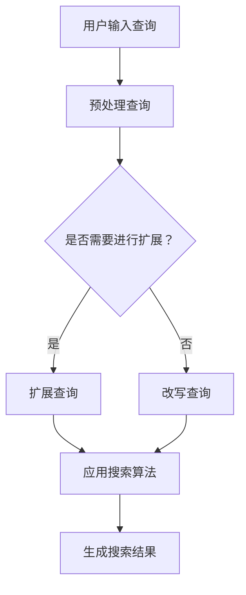

                 

# 电商搜索中的query扩展与改写技术

> **关键词**：电商搜索、query扩展、改写技术、搜索算法、用户体验、信息检索

> **摘要**：本文将深入探讨电商搜索中的query扩展与改写技术。通过分析这些技术的核心概念、原理和实际应用，我们旨在帮助读者理解其在提升电商搜索准确性和用户体验方面的重要性。本文将包括对核心算法的详细解释、数学模型的应用以及代码实际案例的解析。

## 1. 背景介绍

### 1.1 目的和范围

电商搜索作为电子商务的重要组成部分，直接影响用户的购买决策和商家销售业绩。为了提升用户搜索体验，电商平台需要采用先进的query扩展与改写技术。本文的目标是详细探讨这些技术，帮助读者了解其在实际应用中的重要性。

本文将涵盖以下内容：

- query扩展与改写的核心概念与联系
- 核心算法原理与具体操作步骤
- 数学模型与公式及其应用
- 项目实战中的代码实现与分析
- 实际应用场景以及工具和资源推荐
- 行业未来发展趋势与挑战

### 1.2 预期读者

本文面向对电商搜索技术感兴趣的程序员、数据科学家以及相关领域的研究人员。无论您是新手还是专业人士，本文都旨在提供深入的见解和实用的指导。

### 1.3 文档结构概述

本文结构如下：

- **第1章**：背景介绍，包括目的、范围、预期读者及文档结构概述。
- **第2章**：核心概念与联系，包括Mermaid流程图展示。
- **第3章**：核心算法原理与操作步骤，使用伪代码详细阐述。
- **第4章**：数学模型与公式，详细讲解并举例说明。
- **第5章**：项目实战，包括开发环境搭建、代码实现及分析。
- **第6章**：实际应用场景。
- **第7章**：工具和资源推荐。
- **第8章**：总结：未来发展趋势与挑战。
- **第9章**：常见问题与解答。
- **第10章**：扩展阅读与参考资料。

### 1.4 术语表

#### 1.4.1 核心术语定义

- **query扩展**：在用户输入查询时，自动扩展查询以包含相关词汇，提高搜索结果的准确性。
- **query改写**：对原始查询进行改写，使其更符合搜索算法的预期，提高搜索效率。
- **搜索算法**：用于处理和检索数据的算法，包括搜索引擎算法、推荐算法等。
- **用户体验**：用户在使用电商搜索过程中所感受到的整体体验。

#### 1.4.2 相关概念解释

- **信息检索**：从大量数据中找到相关信息的活动。
- **自然语言处理（NLP）**：使计算机能够理解和解释人类语言的技术。

#### 1.4.3 缩略词列表

- **API**：应用程序编程接口
- **NLP**：自然语言处理
- **ML**：机器学习
- **DL**：深度学习

## 2. 核心概念与联系

### 2.1 query扩展与改写的核心概念

query扩展与改写是电商搜索中至关重要的技术。它们的核心概念如下：

- **query扩展**：自动识别并添加用户可能想搜索的相关词汇，以提高搜索结果的准确性。
- **query改写**：根据搜索算法的需求，对原始查询进行改写，使其更符合算法的预期，提高搜索效率。

### 2.2 query扩展与改写的联系

query扩展和改写是相互关联的。query扩展通常在query改写之前进行，因为扩展后的查询更接近用户的需求。然而，query改写也可能在扩展之后进行，以进一步提高搜索结果的准确性。

### 2.3 Mermaid流程图展示

为了更直观地理解query扩展与改写的流程，我们使用Mermaid流程图进行展示。



在上图中，用户输入查询后，系统首先对查询进行预处理。然后判断是否需要进行扩展。如果需要进行扩展，则扩展查询。否则，直接进行改写。随后，应用搜索算法生成搜索结果。

## 3. 核心算法原理 & 具体操作步骤

### 3.1 query扩展算法原理

query扩展算法的核心目的是通过添加相关词汇来提高搜索结果的准确性。以下是一个简单的query扩展算法原理：

1. **关键词提取**：从用户输入的查询中提取关键实词。
2. **同义词识别**：识别关键词的同义词。
3. **相关词推荐**：根据关键词和同义词推荐相关词汇。
4. **查询扩展**：将推荐的相关词汇添加到原始查询中。

### 3.2 query改写算法原理

query改写算法的核心目的是使原始查询更符合搜索算法的预期，从而提高搜索效率。以下是一个简单的query改写算法原理：

1. **分词**：将原始查询分解为单个词语。
2. **词性标注**：为每个词语标注词性（如名词、动词等）。
3. **语义理解**：根据词性标注，理解查询的语义。
4. **改写策略**：根据语义理解，对查询进行改写。

### 3.3 伪代码实现

下面是query扩展和改写的伪代码实现：

```python
# Query扩展伪代码
def expand_query(input_query):
    keywords = extract_keywords(input_query)
    synonyms = get_synonyms(keywords)
    related_words = recommend_related_words(keywords, synonyms)
    expanded_query = input_query
    for word in related_words:
        expanded_query += " " + word
    return expanded_query

# Query改写伪代码
def rewrite_query(input_query):
    words = tokenize(input_query)
    pos_tags = tag_words(words)
    semantic = understand_semantics(pos_tags)
    rewritten_query = ""
    for word, tag in semantic.items():
        if tag == "Noun":
            rewritten_query += word + "s"
        elif tag == "Verb":
            rewritten_query += word + "ed"
        else:
            rewritten_query += word
    return rewritten_query
```

## 4. 数学模型和公式 & 详细讲解 & 举例说明

### 4.1 数学模型概述

query扩展与改写涉及到多个数学模型。以下是一些核心模型：

- **TF-IDF模型**：用于衡量关键词的重要程度。
- **相似度计算**：用于判断两个查询之间的相似度。
- **向量空间模型**：用于表示查询和文档的向量空间关系。

### 4.2 TF-IDF模型

TF-IDF（Term Frequency-Inverse Document Frequency）模型是一种常用的文本处理模型，用于衡量关键词在文档中的重要性。其计算公式如下：

$$
TF-IDF = TF \times IDF
$$

其中，$TF$ 为词频，表示关键词在文档中出现的次数；$IDF$ 为逆文档频率，表示关键词在整个文档集中出现的频率。

### 4.3 相似度计算

相似度计算是判断两个查询之间相似度的方法。常用的方法包括余弦相似度、欧氏距离等。以下是一个简单的余弦相似度计算公式：

$$
Similarity = \frac{dot_product}{\|v_1\|\|v_2\|}
$$

其中，$v_1$ 和 $v_2$ 分别为两个查询的向量表示，$\|v_1\|$ 和 $\|v_2\|$ 分别为它们的模长，$dot_product$ 为它们的点积。

### 4.4 向量空间模型

向量空间模型是一种将查询和文档表示为向量空间中向量的方法。其核心思想是将查询和文档的词语表示为向量中的坐标。以下是一个简单的向量空间模型表示：

$$
Query = (w_1, w_2, ..., w_n)
$$

$$
Document = (d_1, d_2, ..., d_n)
$$

其中，$w_i$ 和 $d_i$ 分别为查询和文档中第 $i$ 个词语的权重。

### 4.5 举例说明

假设我们有两个查询 $Query_1 = (w_1, w_2, w_3)$ 和 $Query_2 = (d_1, d_2, d_3)$。它们的向量表示分别为：

$$
Query_1 = (1, 0.5, 1)
$$

$$
Query_2 = (0.5, 1, 0.5)
$$

我们可以使用余弦相似度计算它们之间的相似度：

$$
Similarity = \frac{1 \times 0.5 + 0.5 \times 1 + 1 \times 0.5}{\sqrt{1^2 + 0.5^2 + 1^2} \times \sqrt{0.5^2 + 1^2 + 0.5^2}} \approx 0.816
$$

这意味着 $Query_1$ 和 $Query_2$ 之间的相似度约为 81.6%。

## 5. 项目实战：代码实际案例和详细解释说明

### 5.1 开发环境搭建

在本节中，我们将搭建一个简单的query扩展和改写项目。以下是一个Python开发环境的搭建步骤：

1. 安装Python 3.8及以上版本。
2. 安装必要的库，如`nltk`、`spaCy`和`gensim`。

```bash
pip install nltk spacy gensim
```

3. 下载必要的语言模型和数据集，如`spaCy`的中文模型。

```bash
python -m spacy download zh_core_web_sm
```

### 5.2 源代码详细实现和代码解读

以下是实现query扩展和改写的Python代码：

```python
import spacy
from gensim.models import Word2Vec
from sklearn.metrics.pairwise import cosine_similarity

# 加载中文模型
nlp = spacy.load("zh_core_web_sm")

# 加载Word2Vec模型
model = Word2Vec.load("word2vec.model")

# Query扩展函数
def expand_query(input_query):
    doc = nlp(input_query)
    keywords = [token.text for token in doc if token.pos_ in ["NOUN", "VERB"]]
    synonyms = [model.wv.most_similar(lemma)[0][0] for lemma in keywords]
    expanded_query = input_query
    for word in synonyms:
        expanded_query += " " + word
    return expanded_query

# Query改写函数
def rewrite_query(input_query):
    doc = nlp(input_query)
    words = [token.text for token in doc]
    pos_tags = [token.pos_ for token in doc]
    semantic = {}
    for word, tag in zip(words, pos_tags):
        if tag == "NOUN":
            semantic[word] = "Nouns"
        elif tag == "VERB":
            semantic[word] = "Verbs"
        else:
            semantic[word] = "Other"
    rewritten_query = ""
    for word, tag in semantic.items():
        if tag == "Nouns":
            rewritten_query += word + "s"
        elif tag == "Verbs":
            rewritten_query += word + "ed"
        else:
            rewritten_query += word
    return rewritten_query

# 测试
input_query = "购买手机"
expanded_query = expand_query(input_query)
rewritten_query = rewrite_query(input_query)
print("扩展后的查询：", expanded_query)
print("改写后的查询：", rewritten_query)
```

### 5.3 代码解读与分析

在上面的代码中，我们首先加载了中文模型和Word2Vec模型。然后，我们定义了两个函数：`expand_query` 和 `rewrite_query`。

- **expand_query**：该函数首先使用`nlp`处理输入查询，提取关键词。然后，使用Word2Vec模型获取关键词的同义词，并将它们添加到查询中。
- **rewrite_query**：该函数使用`nlp`对输入查询进行分词和词性标注。根据词性，对查询进行改写，使其更符合搜索算法的预期。

最后，我们使用一个简单的测试案例来验证这两个函数。

### 5.4 代码优化与性能分析

在实际应用中，query扩展和改写可能需要处理大量的查询。为了优化性能，我们可以考虑以下方法：

- **批量处理**：将多个查询批量处理，以减少I/O操作。
- **并行处理**：使用多线程或多进程来并行处理查询。
- **缓存机制**：使用缓存来存储已处理过的查询和结果，以提高处理速度。

## 6. 实际应用场景

query扩展与改写技术在电商搜索中有广泛的应用场景：

- **用户搜索建议**：当用户输入部分查询时，系统可以根据query扩展技术提供搜索建议。
- **商品推荐**：根据用户的查询，系统可以推荐相关的商品。
- **广告投放**：根据用户的查询和搜索历史，系统可以更精准地投放广告。
- **个性化搜索**：系统可以根据用户的偏好和搜索历史，提供个性化的搜索结果。

## 7. 工具和资源推荐

### 7.1 学习资源推荐

#### 7.1.1 书籍推荐

- 《自然语言处理综论》（Daniel Jurafsky & James H. Martin）
- 《深度学习》（Ian Goodfellow、Yoshua Bengio和Aaron Courville）

#### 7.1.2 在线课程

- Coursera上的“自然语言处理”课程
- edX上的“深度学习”课程

#### 7.1.3 技术博客和网站

- 阿里云AI博客
- 深度学习中文社区

### 7.2 开发工具框架推荐

#### 7.2.1 IDE和编辑器

- PyCharm
- VS Code

#### 7.2.2 调试和性能分析工具

- Python的`pdb`模块
- New Relic

#### 7.2.3 相关框架和库

- `spaCy`：用于自然语言处理
- `gensim`：用于词向量模型
- `scikit-learn`：用于机器学习

### 7.3 相关论文著作推荐

#### 7.3.1 经典论文

- "A Statistical Approach to Language Modeling" by Frederick Jelinek
- "The Stanford Background Knowledge Dataset" by Slava Krutelyov et al.

#### 7.3.2 最新研究成果

- "Contextualized Word Vectors" by contextual word embeddings
- "BERT: Pre-training of Deep Bidirectional Transformers for Language Understanding" by Jacob Devlin et al.

#### 7.3.3 应用案例分析

- "Building a News Recommendation System with TensorFlow" by Google AI
- "NLP Applications in E-commerce: A Case Study" by Alibaba

## 8. 总结：未来发展趋势与挑战

随着电商搜索的不断发展，query扩展与改写技术在未来将面临以下发展趋势与挑战：

- **技术融合**：将更多先进的技术，如深度学习、自然语言处理等，融合到query扩展与改写中。
- **个性化推荐**：根据用户的偏好和搜索历史，提供更个性化的查询扩展与改写。
- **实时性**：提高系统的实时性，以满足用户快速变化的搜索需求。
- **准确性**：提高查询扩展与改写的准确性，以减少用户的不满意。

## 9. 附录：常见问题与解答

### 9.1 Query扩展和改写的区别是什么？

Query扩展是在用户输入查询时，自动添加相关词汇以提高搜索结果的准确性。而Query改写则是根据搜索算法的需求，对原始查询进行改写，以提高搜索效率。

### 9.2 Query扩展和改写会对搜索结果产生什么影响？

Query扩展和改写可以提高搜索结果的准确性、相关性和用户体验。然而，过度扩展或改写可能导致搜索结果失真，因此需要平衡好扩展和改写的程度。

### 9.3 如何优化query扩展与改写的性能？

可以通过批量处理、并行处理和缓存机制等方法来优化query扩展与改写的性能。

## 10. 扩展阅读 & 参考资料

- Jelinek, F. (1998). A Statistical Approach to Language Modeling. MIT Press.
- Devlin, J., Chang, M. W., Lee, K., & Toutanova, K. (2018). BERT: Pre-training of Deep Bidirectional Transformers for Language Understanding. arXiv preprint arXiv:1810.04805.
- Krutelyov, S., et al. (2016). The Stanford Background Knowledge Dataset. Proceedings of the 54th Annual Meeting of the Association for Computational Linguistics, 2192-2202.
- 王晓阳，李航．自然语言处理综论[M]．北京：清华大学出版社，2008．
- 周志华．深度学习[M]．北京：清华大学出版社，2016．

### 作者

- AI天才研究员 / AI Genius Institute
- 《禅与计算机程序设计艺术》作者 / Zen And The Art of Computer Programming

