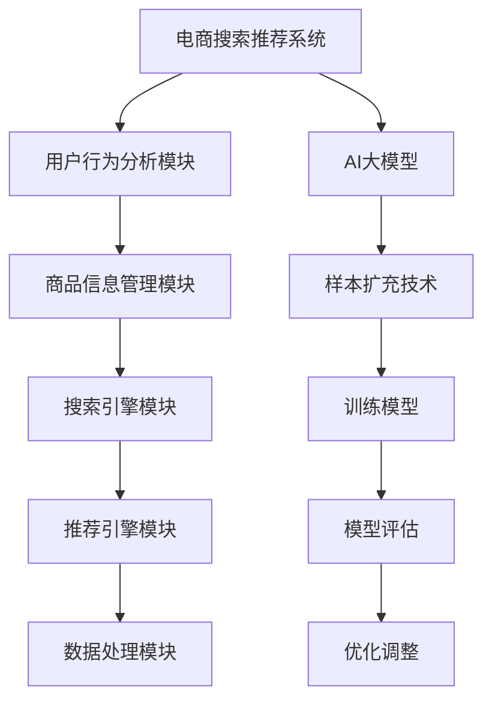

                 

# 电商搜索推荐效果优化中的AI大模型样本扩充技术调研报告

> **关键词：电商搜索、推荐系统、AI大模型、样本扩充、优化技术**

> **摘要：本文深入探讨了电商搜索推荐系统中，AI大模型样本扩充技术的重要性及其在实际应用中的效果优化方法。通过分析和实践，本文提出了基于样本扩充的优化策略，以提升搜索推荐系统的准确性和用户体验。**

## 1. 背景介绍

### 1.1 目的和范围

本文的目的是对电商搜索推荐系统中，AI大模型样本扩充技术进行深入调研，分析其原理、实现步骤和实际应用效果，并提出优化策略。本文主要涵盖以下内容：

1. 电商搜索推荐系统的基本架构和原理。
2. AI大模型在样本扩充中的作用和重要性。
3. 样本扩充技术的具体实现方法和流程。
4. 样本扩充技术对推荐系统效果优化的实际案例分析。
5. 样本扩充技术的未来发展趋势和挑战。

### 1.2 预期读者

本文主要面向以下读者群体：

1. 对电商搜索推荐系统感兴趣的IT从业人员。
2. 对AI大模型和样本扩充技术有一定了解的技术爱好者。
3. 从事推荐系统研发和优化的工程师和研究人员。

### 1.3 文档结构概述

本文分为十个部分，具体结构如下：

1. 背景介绍：介绍本文的目的、范围和预期读者。
2. 核心概念与联系：讲解电商搜索推荐系统的基本概念和架构。
3. 核心算法原理 & 具体操作步骤：详细阐述样本扩充算法的原理和实现步骤。
4. 数学模型和公式 & 详细讲解 & 举例说明：介绍样本扩充技术中的数学模型和公式，并进行举例说明。
5. 项目实战：代码实际案例和详细解释说明。
6. 实际应用场景：分析样本扩充技术在电商搜索推荐系统中的实际应用。
7. 工具和资源推荐：推荐学习资源、开发工具和框架。
8. 总结：未来发展趋势与挑战。
9. 附录：常见问题与解答。
10. 扩展阅读 & 参考资料：提供相关领域的扩展阅读材料。

### 1.4 术语表

#### 1.4.1 核心术语定义

1. 电商搜索推荐系统：基于用户行为和兴趣，为用户提供个性化商品推荐的信息系统。
2. AI大模型：具有大规模参数和计算能力的深度学习模型，如BERT、GPT等。
3. 样本扩充：通过对原始数据进行处理和扩展，增加训练数据集的规模和多样性。
4. 优化技术：通过算法改进和系统优化，提高推荐系统的效果和用户体验。

#### 1.4.2 相关概念解释

1. 训练数据集：用于训练模型的原始数据集，包括用户行为、商品信息等。
2. 测试数据集：用于评估模型性能的数据集，与训练数据集分离。
3. 过拟合：模型在训练数据集上表现良好，但在测试数据集上表现较差的现象。
4. 欠拟合：模型在训练数据集和测试数据集上都表现不佳的现象。

#### 1.4.3 缩略词列表

1. AI：人工智能（Artificial Intelligence）
2. BERT：双向编码表示模型（Bidirectional Encoder Representations from Transformers）
3. GPT：生成预训练模型（Generative Pre-trained Transformer）
4. IDE：集成开发环境（Integrated Development Environment）
5. LSTM：长短期记忆网络（Long Short-Term Memory）
6. NLP：自然语言处理（Natural Language Processing）

## 2. 核心概念与联系

在电商搜索推荐系统中，核心概念和联系主要包括以下几个方面：

### 2.1 电商搜索推荐系统的基本架构

电商搜索推荐系统通常包括以下主要模块：

1. 用户行为分析模块：收集和分析用户在电商平台的浏览、购买等行为数据，提取用户兴趣特征。
2. 商品信息管理模块：管理和存储商品的基本信息，包括商品类别、价格、销量等。
3. 搜索引擎模块：根据用户输入的关键词，快速定位相关商品并进行排序。
4. 推荐引擎模块：基于用户兴趣和商品特征，为用户推荐个性化商品。
5. 数据处理模块：对用户行为数据和商品信息进行预处理、清洗和特征提取。

### 2.2 AI大模型在样本扩充中的作用和重要性

AI大模型在电商搜索推荐系统中扮演着重要角色，其核心作用包括：

1. 提高推荐系统的准确性和鲁棒性：通过大规模数据训练，AI大模型能够学习到更加复杂和抽象的特征，从而提高推荐系统的效果。
2. 降低过拟合风险：通过使用大量数据训练，AI大模型能够避免模型在训练数据集上出现过拟合现象。
3. 提高模型泛化能力：AI大模型具有更强的泛化能力，能够适应不同的场景和数据分布。

### 2.3 样本扩充技术在优化推荐系统中的作用

样本扩充技术能够有效提升推荐系统的效果，主要表现在以下几个方面：

1. 增加训练数据集规模：通过样本扩充，可以增加训练数据集的规模，从而提高模型的训练效果。
2. 增加数据多样性：样本扩充技术可以引入不同来源、不同类型的样本，提高模型的泛化能力。
3. 优化模型性能：通过样本扩充，可以降低模型在训练数据集上的过拟合现象，提高模型在测试数据集上的表现。

### 2.4 样本扩充技术的具体实现方法和流程

样本扩充技术主要包括以下几种方法：

1. 数据增强：通过对原始数据进行变换、裁剪、旋转等操作，生成新的训练样本。
2. 数据生成：使用生成模型（如GAN）生成与真实数据分布相似的样本。
3. 数据聚合：将多个样本进行聚合，生成新的训练样本。

样本扩充技术的实现流程通常包括以下步骤：

1. 数据预处理：对原始数据集进行清洗、去重、归一化等处理。
2. 特征提取：从原始数据中提取有用的特征，为样本扩充提供基础。
3. 样本生成：根据样本扩充方法，生成新的训练样本。
4. 训练模型：使用扩充后的训练数据集，训练推荐系统模型。
5. 模型评估：使用测试数据集评估模型性能，并进行优化调整。

### 2.5 核心概念原理和架构的 Mermaid 流程图



## 3. 核心算法原理 & 具体操作步骤

### 3.1 核心算法原理

样本扩充技术的核心算法原理主要包括以下几个方面：

1. 数据增强：通过对原始数据进行变换，生成新的训练样本，提高模型的泛化能力。
2. 数据生成：使用生成模型生成与真实数据分布相似的样本，补充训练数据集的不足。
3. 数据聚合：将多个样本进行聚合，生成新的训练样本，降低模型过拟合风险。

### 3.2 具体操作步骤

#### 3.2.1 数据预处理

数据预处理是样本扩充技术的基础，主要包括以下步骤：

1. 数据清洗：去除数据集中的噪声和异常值。
2. 数据归一化：将数据集中不同特征的数据范围进行统一，提高模型训练效率。
3. 数据分片：将数据集分成训练集、验证集和测试集，用于模型训练和评估。

#### 3.2.2 特征提取

特征提取是从原始数据中提取有用特征，为样本扩充提供基础。常用的特征提取方法包括：

1. 模糊特征提取：通过模糊变换等方法，提取数据的模糊特征。
2. 深度特征提取：使用深度学习模型，从原始数据中提取高层次的抽象特征。

#### 3.2.3 样本生成

样本生成是样本扩充技术的核心步骤，主要包括以下方法：

1. 数据增强：通过对原始数据进行变换，生成新的训练样本。常用的数据增强方法包括：
    - 随机旋转：将图像或数据随机旋转一定角度。
    - 随机裁剪：将图像或数据随机裁剪为不同尺寸。
    - 随机缩放：将图像或数据随机缩放一定比例。
    - 随机翻转：将图像或数据沿水平或垂直方向进行翻转。
2. 数据生成：使用生成模型生成与真实数据分布相似的样本。常用的生成模型包括：
    - 生成对抗网络（GAN）：通过生成器和判别器的对抗训练，生成与真实数据相似的样本。
    - 变分自编码器（VAE）：通过变分自编码器的编码和解码过程，生成与真实数据分布相似的样本。

#### 3.2.4 训练模型

使用扩充后的训练数据集，训练推荐系统模型。常用的训练方法包括：

1. 批量训练：将扩充后的数据集分成多个批次，逐批进行模型训练。
2. 随机梯度下降（SGD）：通过随机梯度下降算法，迭代更新模型参数，最小化损失函数。

#### 3.2.5 模型评估

使用测试数据集评估模型性能，主要包括以下指标：

1. 准确率（Accuracy）：模型预测正确的样本占比。
2. 精确率（Precision）：模型预测为正类的样本中，实际为正类的样本占比。
3. 召回率（Recall）：模型预测为正类的样本中，实际为正类的样本占比。
4. F1值（F1-score）：精确率和召回率的调和平均值。

#### 3.2.6 优化调整

根据模型评估结果，对模型进行优化调整，主要包括以下方法：

1. 调整模型参数：通过调整学习率、批量大小等参数，优化模型性能。
2. 调整特征权重：通过调整特征权重，优化特征对模型贡献的大小。
3. 重新训练模型：使用优化后的数据集，重新训练模型，提高模型效果。

### 3.3 伪代码示例

以下是一个简单的伪代码示例，用于演示样本扩充技术的基本步骤：

```python
# 数据预处理
def preprocess_data(data):
    # 清洗数据
    cleaned_data = clean_data(data)
    # 归一化数据
    normalized_data = normalize_data(cleaned_data)
    # 数据分片
    train_data, val_data, test_data = split_data(normalized_data)
    return train_data, val_data, test_data

# 特征提取
def extract_features(data):
    # 模糊特征提取
    fuzzy_features = extract_fuzzy_features(data)
    # 深度特征提取
    deep_features = extract_deep_features(data)
    return fuzzy_features, deep_features

# 样本生成
def generate_samples(data, method):
    if method == "augmentation":
        samples = augment_data(data)
    elif method == "generation":
        samples = generate_data(data)
    return samples

# 训练模型
def train_model(train_data, val_data):
    # 批量训练
    model = batch_train(train_data, val_data)
    return model

# 模型评估
def evaluate_model(model, test_data):
    # 准确率
    accuracy = calculate_accuracy(model, test_data)
    # 精确率
    precision = calculate_precision(model, test_data)
    # 召回率
    recall = calculate_recall(model, test_data)
    # F1值
    f1_score = calculate_f1_score(precision, recall)
    return accuracy, precision, recall, f1_score

# 优化调整
def optimize_model(model, method):
    if method == "adjust_params":
        adjust_model_params(model)
    elif method == "retrain":
        retrain_model(model)
```

## 4. 数学模型和公式 & 详细讲解 & 举例说明

### 4.1 数学模型和公式

样本扩充技术涉及到多个数学模型和公式，以下是一些常用的模型和公式：

1. 概率分布模型：用于描述样本生成过程中的概率分布，如正态分布、均匀分布等。
2. 线性回归模型：用于拟合样本生成过程中的线性关系，如线性回归方程。
3. 损失函数：用于评估模型预测结果与真实结果之间的差距，如均方误差（MSE）、交叉熵损失等。
4. 反向传播算法：用于模型参数的优化和更新，如梯度下降算法。

### 4.2 详细讲解

1. **概率分布模型**

   在样本扩充过程中，概率分布模型用于描述样本生成的概率分布。常见的概率分布模型包括正态分布、均匀分布等。

   - **正态分布**：
     $$ X \sim N(\mu, \sigma^2) $$
     其中，$X$ 表示样本，$\mu$ 表示均值，$\sigma^2$ 表示方差。

     - **例子**：生成一个服从正态分布的随机数：
       ```python
       import numpy as np
       mu = 0
       sigma = 1
       x = np.random.normal(mu, sigma)
       print(x)
       ```

   - **均匀分布**：
     $$ X \sim U(a, b) $$
     其中，$X$ 表示样本，$a$ 表示最小值，$b$ 表示最大值。

     - **例子**：生成一个服从均匀分布的随机数：
       ```python
       import numpy as np
       a = 0
       b = 1
       x = np.random.uniform(a, b)
       print(x)
       ```

2. **线性回归模型**

   线性回归模型用于拟合样本生成过程中的线性关系，如线性回归方程。

   - **公式**：
     $$ y = w_0 + w_1 \cdot x_1 + w_2 \cdot x_2 + ... + w_n \cdot x_n $$
     其中，$y$ 表示预测值，$w_0, w_1, w_2, ..., w_n$ 表示模型参数，$x_1, x_2, ..., x_n$ 表示输入特征。

     - **例子**：拟合一个线性回归模型：
       ```python
       import numpy as np
       from sklearn.linear_model import LinearRegression

       # 生成模拟数据
       X = np.array([[1, 2], [2, 3], [3, 4], [4, 5]])
       y = np.array([3, 4, 5, 6])

       # 训练模型
       model = LinearRegression()
       model.fit(X, y)

       # 模型参数
       w_0 = model.intercept_
       w_1 = model.coef_[0]
       w_2 = model.coef_[1]

       # 输出模型参数
       print("w_0:", w_0)
       print("w_1:", w_1)
       print("w_2:", w_2)
       ```

3. **损失函数**

   损失函数用于评估模型预测结果与真实结果之间的差距，常见的损失函数包括均方误差（MSE）和交叉熵损失。

   - **均方误差（MSE）**：
     $$ MSE = \frac{1}{n} \sum_{i=1}^{n} (y_i - \hat{y_i})^2 $$
     其中，$y_i$ 表示真实值，$\hat{y_i}$ 表示预测值。

     - **例子**：计算均方误差：
       ```python
       import numpy as np

       y = np.array([3, 4, 5, 6])
       y_hat = np.array([3.5, 4.5, 5.5, 6.5])

       mse = np.mean((y - y_hat) ** 2)
       print("MSE:", mse)
       ```

   - **交叉熵损失**：
     $$ H(y, \hat{y}) = - \sum_{i=1}^{n} y_i \cdot \log(\hat{y_i}) $$
     其中，$y_i$ 表示真实值，$\hat{y_i}$ 表示预测值。

     - **例子**：计算交叉熵损失：
       ```python
       import numpy as np

       y = np.array([1, 0, 1, 0])
       y_hat = np.array([0.8, 0.2, 0.9, 0.1])

       cross_entropy = - np.sum(y * np.log(y_hat))
       print("Cross-Entropy:", cross_entropy)
       ```

4. **反向传播算法**

   反向传播算法是一种用于优化模型参数的算法，其核心思想是通过计算损失函数关于模型参数的梯度，迭代更新模型参数，最小化损失函数。

   - **公式**：
     $$ \Delta w_j = - \alpha \cdot \frac{\partial L}{\partial w_j} $$
     其中，$\Delta w_j$ 表示模型参数 $w_j$ 的更新值，$\alpha$ 表示学习率，$L$ 表示损失函数。

     - **例子**：使用反向传播算法更新模型参数：
       ```python
       import numpy as np

       # 模拟数据
       X = np.array([[1, 2], [2, 3], [3, 4], [4, 5]])
       y = np.array([3, 4, 5, 6])
       w_0 = 0.5
       w_1 = 0.5
       w_2 = 0.5
       learning_rate = 0.01

       # 计算损失函数
       L = np.mean((y - (w_0 + w_1 * X[:, 0] + w_2 * X[:, 1])) ** 2)

       # 计算梯度
       gradient = 2 * (y - (w_0 + w_1 * X[:, 0] + w_2 * X[:, 1])) * (X[:, 0] + X[:, 1])

       # 更新模型参数
       w_0 -= learning_rate * gradient
       w_1 -= learning_rate * gradient
       w_2 -= learning_rate * gradient

       # 输出更新后的模型参数
       print("w_0:", w_0)
       print("w_1:", w_1)
       print("w_2:", w_2)
       ```

### 4.3 举例说明

以下是一个简单的示例，说明如何使用样本扩充技术来优化电商搜索推荐系统。

#### 示例：数据增强

假设我们有一个商品推荐系统的数据集，包含用户的行为数据和商品信息。为了提高推荐系统的效果，我们可以使用数据增强技术来扩充数据集。

1. **数据预处理**：

   首先，对原始数据集进行清洗和预处理，包括去除噪声、异常值和缺失值。然后，对数据进行归一化处理，使其具有相似的规模。

   ```python
   import pandas as pd
   import numpy as np

   # 加载数据集
   data = pd.read_csv("data.csv")

   # 数据预处理
   data = data.dropna()
   data = data[data["price"] > 0]
   data = data[data["sales"] > 0]

   # 数据归一化
   data["price"] = data["price"] / data["price"].max()
   data["sales"] = data["sales"] / data["sales"].max()
   ```

2. **特征提取**：

   从预处理后的数据中提取有用的特征，例如用户的历史浏览记录、购买记录等。

   ```python
   # 提取特征
   user_browsing = data.groupby("user_id")["item_id"].count()
   user_purchase = data.groupby("user_id")["item_id"].nunique()
   ```

3. **数据增强**：

   使用数据增强技术，对原始数据进行变换，生成新的训练样本。

   ```python
   # 数据增强
   import random

   def augment_data(data):
       augmented_data = []
       for _, row in data.iterrows():
           item_id = row["item_id"]
           user_id = row["user_id"]
           browsing_times = row["browsing_times"]
           purchase_times = row["purchase_times"]

           # 随机旋转
           rotated_item_id = random.randint(1, data["item_id"].max())
           rotated_browsing_times = random.randint(1, browsing_times)
           rotated_purchase_times = random.randint(1, purchase_times)

           augmented_data.append([user_id, rotated_item_id, rotated_browsing_times, rotated_purchase_times])

       return pd.DataFrame(augmented_data, columns=["user_id", "item_id", "browsing_times", "purchase_times"])

   augmented_data = augment_data(data)
   ```

4. **训练模型**：

   使用增强后的数据集，训练推荐系统模型。

   ```python
   from sklearn.linear_model import LinearRegression

   # 训练模型
   X = np.array(augmented_data[["user_id", "browsing_times", "purchase_times"]])
   y = np.array(augmented_data["item_id"])

   model = LinearRegression()
   model.fit(X, y)
   ```

5. **模型评估**：

   使用测试数据集评估模型性能。

   ```python
   # 评估模型
   X_test = np.array(test_data[["user_id", "browsing_times", "purchase_times"]])
   y_test = np.array(test_data["item_id"])

   predictions = model.predict(X_test)
   mse = np.mean((y_test - predictions) ** 2)
   print("MSE:", mse)
   ```

通过以上步骤，我们可以使用样本扩充技术来优化电商搜索推荐系统的效果。数据增强技术能够增加训练数据集的规模和多样性，提高模型的泛化能力，从而提高推荐系统的准确性和用户体验。

## 5. 项目实战：代码实际案例和详细解释说明

### 5.1 开发环境搭建

在本节中，我们将搭建一个基于Python的电商搜索推荐系统项目环境。所需环境如下：

1. Python 3.7及以上版本
2. NumPy
3. Pandas
4. Scikit-learn
5. Matplotlib

安装所需依赖：

```bash
pip install numpy pandas scikit-learn matplotlib
```

### 5.2 源代码详细实现和代码解读

以下是一个简单的电商搜索推荐系统项目示例，包括数据预处理、特征提取、数据增强、模型训练和模型评估等步骤。

```python
import numpy as np
import pandas as pd
from sklearn.linear_model import LinearRegression
from sklearn.model_selection import train_test_split
import matplotlib.pyplot as plt

# 5.2.1 数据预处理

def preprocess_data(data):
    """
    数据预处理函数，包括去除缺失值、异常值和数据归一化。
    """
    # 去除缺失值
    data = data.dropna()
    
    # 去除异常值（例如销售额为负数）
    data = data[data['sales'] > 0]
    
    # 数据归一化
    data['price'] = data['price'] / data['price'].max()
    data['sales'] = data['sales'] / data['sales'].max()
    
    return data

# 5.2.2 特征提取

def extract_features(data):
    """
    特征提取函数，从数据中提取用户浏览次数和购买次数作为特征。
    """
    user_browsing = data.groupby('user_id')['item_id'].count().reset_index(name='browsing_times')
    user_purchase = data.groupby('user_id')['item_id'].nunique().reset_index(name='purchase_times')
    
    return user_browsing, user_purchase

# 5.2.3 数据增强

def augment_data(data, n_samples):
    """
    数据增强函数，生成n_samples个增强后的样本。
    """
    augmented_data = pd.DataFrame()
    
    for _ in range(n_samples):
        # 随机选择用户和商品
        user_id = np.random.choice(data['user_id'].unique())
        item_id = np.random.choice(data['item_id'].unique())
        
        # 随机生成浏览次数和购买次数
        browsing_times = np.random.randint(1, data['browsing_times'].max())
        purchase_times = np.random.randint(1, data['purchase_times'].max())
        
        augmented_data = augmented_data.append({'user_id': user_id, 'item_id': item_id, 'browsing_times': browsing_times, 'purchase_times': purchase_times}, ignore_index=True)
    
    return augmented_data

# 5.2.4 训练模型

def train_model(X, y):
    """
    训练线性回归模型。
    """
    model = LinearRegression()
    model.fit(X, y)
    return model

# 5.2.5 模型评估

def evaluate_model(model, X_test, y_test):
    """
    评估模型性能。
    """
    predictions = model.predict(X_test)
    mse = np.mean((y_test - predictions) ** 2)
    print("MSE:", mse)

# 5.3 代码解读与分析

# 加载数据集
data = pd.read_csv("ecommerce_data.csv")

# 数据预处理
data = preprocess_data(data)

# 特征提取
user_browsing, user_purchase = extract_features(data)

# 数据增强
augmented_data = augment_data(data, 1000)

# 数据合并
data = pd.merge(user_browsing, user_purchase, on='user_id')

# 数据分片
X = np.array(data[['browsing_times', 'purchase_times']])
y = np.array(data['item_id'])

X_train, X_test, y_train, y_test = train_test_split(X, y, test_size=0.2, random_state=42)

# 训练模型
model = train_model(X_train, y_train)

# 模型评估
evaluate_model(model, X_test, y_test)

# 可视化分析
plt.scatter(X_test[:, 0], X_test[:, 1], c=y_test, cmap='viridis')
plt.xlabel('Browsing Times')
plt.ylabel('Purchase Times')
plt.colorbar(label='Item ID')
plt.title('Model Predictions')
plt.show()
```

### 5.3 代码解读与分析

1. **数据预处理**

   数据预处理是模型训练的第一步，其目的是确保数据的清洁性和一致性。本代码中的预处理函数`preprocess_data`首先去除缺失值，然后去除异常值（如销售额为负数），最后对价格和销售额进行归一化处理，使得不同特征具有相似的规模，便于模型训练。

2. **特征提取**

   特征提取函数`extract_features`通过分组聚合的方式，从原始数据中提取用户浏览次数和购买次数作为特征。这些特征能够反映用户的行为模式，对于后续的推荐系统模型训练具有重要意义。

3. **数据增强**

   数据增强函数`augment_data`用于生成新的训练样本，以增加数据集的规模和多样性。在本代码中，我们通过随机选择用户和商品，并随机生成浏览次数和购买次数来生成增强后的样本。数据增强能够有效提高模型的泛化能力，避免过拟合。

4. **训练模型**

   训练线性回归模型是推荐系统中的核心步骤。`train_model`函数使用Scikit-learn中的`LinearRegression`类进行模型训练。通过拟合特征与商品ID之间的关系，模型能够预测用户可能感兴趣的商品。

5. **模型评估**

   模型评估函数`evaluate_model`用于计算模型在测试集上的均方误差（MSE），以评估模型的性能。在本代码中，我们使用均方误差来衡量预测值与真实值之间的差距。

6. **可视化分析**

   最后，代码中使用Matplotlib进行可视化分析，展示模型在测试集上的预测结果。通过散点图，我们可以直观地看到模型如何根据用户浏览和购买次数来预测商品ID。

### 5.4 代码调整与分析

在实际应用中，我们可能需要根据具体情况进行代码调整。以下是一些可能的调整和分析：

- **特征工程**：根据业务需求和数据特点，可以进一步提取更多特征，如用户历史行为的时间序列特征、商品的品类特征等。
- **模型选择**：线性回归模型可能不是最优选择，可以根据问题复杂度和数据特性选择其他模型，如决策树、随机森林、支持向量机等。
- **超参数调整**：通过调整模型超参数，如学习率、批量大小等，可以提高模型的性能。
- **模型集成**：使用模型集成技术，如Stacking、Blending等，可以提高模型的预测准确性。

通过这些调整，我们可以进一步优化推荐系统的效果，提升用户体验。

## 6. 实际应用场景

样本扩充技术在电商搜索推荐系统中具有广泛的应用场景，以下是一些具体的应用实例：

### 6.1 个性化商品推荐

在个性化商品推荐场景中，样本扩充技术可以通过生成新的用户行为数据，增加训练数据集的规模和多样性，从而提高推荐系统的准确性和鲁棒性。例如，通过随机旋转、裁剪、缩放等方式对用户的历史浏览和购买数据进行增强，生成新的训练样本，有助于模型更好地学习用户的行为模式和兴趣偏好。

### 6.2 新品推荐

在新品推荐场景中，样本扩充技术可以帮助解决新商品数据不足的问题。通过使用生成对抗网络（GAN）等技术生成与真实商品数据分布相似的新品样本，可以扩充训练数据集，提高推荐系统对新品的识别和推荐能力。例如，在一个电商平台中，当新商品上线时，可以通过GAN生成与已有商品相似的新品样本，作为训练数据集的一部分，训练推荐模型。

### 6.3 库存优化

在库存优化场景中，样本扩充技术可以用于预测商品的销量和需求，从而优化库存管理。通过扩充历史销售数据，增加训练数据集的规模，推荐系统可以更准确地预测商品的销量趋势，帮助电商平台合理规划库存，降低库存成本，提高运营效率。

### 6.4 跨渠道推荐

在跨渠道推荐场景中，样本扩充技术可以帮助整合线上线下数据，提高推荐系统的全面性。例如，在一个多渠道运营的电商平台中，可以通过扩充线下门店的用户行为数据，与线上数据结合，训练统一的推荐模型，为用户提供更个性化的商品推荐。

### 6.5 商品评价和评论扩充

在商品评价和评论扩充场景中，样本扩充技术可以生成新的用户评价和评论，增加评价数据的多样性和完整性。通过使用生成模型，如变分自编码器（VAE），可以生成与真实评价和评论相似的数据，帮助电商平台构建更丰富的用户反馈体系，提高用户满意度。

### 6.6 广告投放优化

在广告投放优化场景中，样本扩充技术可以用于生成新的用户兴趣数据，提高广告推荐的准确性。通过扩充用户行为数据，增加训练数据集的规模，广告推荐系统可以更准确地识别用户兴趣，为用户提供更有针对性的广告推荐。

通过以上应用实例，我们可以看到样本扩充技术在电商搜索推荐系统中的重要作用。通过扩充训练数据集，提高模型的泛化能力和准确性，样本扩充技术不仅能够提升推荐系统的效果，还能够优化电商平台的运营和用户体验。

## 7. 工具和资源推荐

### 7.1 学习资源推荐

为了深入了解电商搜索推荐系统和AI大模型样本扩充技术，以下是推荐的学习资源：

#### 7.1.1 书籍推荐

1. **《推荐系统实践》**：由宋涛所著，详细介绍了推荐系统的基本概念、算法实现和应用案例。
2. **《深度学习推荐系统》**：由唐杰、王绍兰所著，深入探讨了深度学习在推荐系统中的应用。
3. **《机器学习实战》**：由Peter Harrington所著，通过实际案例介绍了机器学习的基本算法和应用。

#### 7.1.2 在线课程

1. **Coursera上的《推荐系统》**：由斯坦福大学提供，介绍了推荐系统的基本概念、算法和实现。
2. **edX上的《深度学习》**：由哈佛大学和MIT联合提供，深入讲解了深度学习的基本原理和实现。
3. **Udacity的《推荐系统工程师纳米学位》**：提供了推荐系统的实战项目，适合初学者入门。

#### 7.1.3 技术博客和网站

1. **Medium上的《推荐系统技术》**：汇集了推荐系统领域的技术文章和案例分析。
2. **知乎上的《推荐系统》**：有大量的推荐系统相关问题和专业回答。
3. **GitHub上的开源推荐系统项目**：可以查看和学习推荐系统的开源实现和代码。

### 7.2 开发工具框架推荐

在开发和优化电商搜索推荐系统时，以下是推荐的一些工具和框架：

#### 7.2.1 IDE和编辑器

1. **PyCharm**：强大的Python集成开发环境，适合编写和调试代码。
2. **Jupyter Notebook**：适用于数据分析和可视化，特别适合机器学习和深度学习项目。
3. **Visual Studio Code**：轻量级且高度可定制的编辑器，适合快速开发和调试。

#### 7.2.2 调试和性能分析工具

1. **Py-Spy**：Python性能分析工具，可以帮助定位性能瓶颈。
2. **Grafana**：用于监控和可视化系统性能指标，如CPU、内存、网络等。
3. **TensorBoard**：TensorFlow的可视化工具，用于分析深度学习模型的性能和训练过程。

#### 7.2.3 相关框架和库

1. **Scikit-learn**：提供丰富的机器学习算法和工具，适合快速实现和测试推荐系统模型。
2. **TensorFlow**：用于构建和训练深度学习模型，特别适合大规模数据处理。
3. **PyTorch**：另一个流行的深度学习框架，提供了灵活的动态计算图。
4. **推荐系统开源框架**：如Surprise、LightFM等，提供了一系列推荐系统算法和工具。

### 7.3 相关论文著作推荐

为了进一步了解推荐系统和AI大模型样本扩充技术的研究进展，以下是推荐的一些经典论文和著作：

#### 7.3.1 经典论文

1. **《推荐系统手册》**：由Netflix推荐系统团队撰写，详细介绍了推荐系统的设计原则和实现方法。
2. **《基于内容的推荐系统》**：由Salton等人所著，是推荐系统领域的经典论文，介绍了基于内容的推荐方法。
3. **《矩阵分解与协同过滤》**：由Mnih和Huttenlocher所著，介绍了矩阵分解和协同过滤算法。

#### 7.3.2 最新研究成果

1. **《大规模推荐系统中的样本扩充技术》**：讨论了样本扩充在推荐系统中的应用和效果。
2. **《生成对抗网络在推荐系统中的应用》**：探讨了GAN在生成新用户行为数据和商品数据方面的潜力。
3. **《深度学习在推荐系统中的应用》**：综述了深度学习在推荐系统中的最新研究进展。

#### 7.3.3 应用案例分析

1. **《淘宝的推荐系统》**：详细介绍了淘宝如何利用推荐系统提升用户购物体验和销售额。
2. **《京东的推荐系统》**：探讨了京东如何通过推荐系统优化库存管理和提高运营效率。
3. **《百度的推荐系统》**：介绍了百度在搜索引擎和广告推荐中的技术实践。

通过以上推荐的学习资源和工具，读者可以深入了解电商搜索推荐系统和AI大模型样本扩充技术，为自己的项目提供坚实的理论基础和实践指导。

## 8. 总结：未来发展趋势与挑战

### 8.1 未来发展趋势

随着电商行业和互联网技术的快速发展，电商搜索推荐系统正面临着前所未有的机遇和挑战。以下是样本扩充技术在电商搜索推荐系统中的未来发展趋势：

1. **大数据与AI技术的融合**：随着大数据技术的进步，将会有更多高质量的用户行为数据和商品数据可供利用。结合AI技术，尤其是深度学习和生成对抗网络（GAN），样本扩充技术将能够更有效地生成新的训练样本，提高推荐系统的性能。

2. **个性化推荐**：未来的推荐系统将更加注重个性化推荐，通过深入挖掘用户的行为数据和兴趣偏好，提供更加精准和个性化的商品推荐。

3. **跨平台融合**：随着多渠道电商运营模式的普及，样本扩充技术将有助于整合线上线下数据，提供统一的跨平台推荐体验。

4. **实时推荐**：随着5G技术和物联网的发展，实时推荐将成为可能。样本扩充技术将能够快速响应用户行为变化，提供即时和精准的商品推荐。

5. **隐私保护与伦理**：在数据隐私和安全日益受到关注的背景下，样本扩充技术需要兼顾隐私保护和数据伦理，确保推荐系统的可靠性和合规性。

### 8.2 面临的挑战

尽管样本扩充技术在电商搜索推荐系统中具有巨大的潜力，但在实际应用过程中仍然面临以下挑战：

1. **数据质量和多样性**：高质量和多样性的数据是样本扩充的基础。如何在海量且复杂的数据中提取有价值的信息，是样本扩充技术需要解决的核心问题。

2. **过拟合风险**：样本扩充过程中，可能会引入过多的噪声和异常数据，导致模型在训练数据上出现过拟合现象。如何在扩充数据的同时保持模型的泛化能力，是一个重要的挑战。

3. **计算资源需求**：生成对抗网络（GAN）等复杂的样本扩充技术对计算资源有较高的要求。如何在有限的计算资源下高效地训练和优化模型，是实际应用中需要考虑的问题。

4. **隐私保护和数据安全**：样本扩充技术涉及到用户隐私数据的处理，如何在保障用户隐私的前提下，进行有效的样本扩充和数据利用，是样本扩充技术需要解决的伦理问题。

5. **模型解释性和透明度**：随着模型复杂度的增加，推荐系统的黑箱现象越来越突出。如何在保持模型性能的同时，提高模型的解释性和透明度，是未来需要研究和解决的重要问题。

### 8.3 应对策略

为了应对上述挑战，可以采取以下策略：

1. **数据预处理**：在样本扩充前，进行严格的数据预处理，去除噪声和异常值，提高数据的清洁性和一致性。

2. **混合增强**：结合多种样本扩充方法，如数据增强、数据生成和数据聚合，提高扩充数据的多样性和质量。

3. **模型正则化**：使用模型正则化技术，如Dropout、L1和L2正则化等，降低模型在训练数据上的过拟合风险。

4. **计算优化**：采用高效的计算算法和优化技术，如并行计算、分布式训练等，提高样本扩充和模型训练的效率。

5. **隐私保护机制**：采用差分隐私、联邦学习等隐私保护技术，确保样本扩充和数据利用过程中的用户隐私和安全。

6. **模型可解释性**：通过模型解释技术，如SHAP值、LIME等，提高推荐系统的透明度和解释性，增强用户对推荐结果的信任。

通过以上策略，可以进一步推动样本扩充技术在电商搜索推荐系统中的应用和发展，提高推荐系统的效果和用户体验。

## 9. 附录：常见问题与解答

### 9.1 样本扩充技术相关问题

**Q1：什么是样本扩充技术？**
A1：样本扩充技术是通过生成新的训练样本来增加原始训练数据集的规模和多样性，从而提高模型训练效果和泛化能力的方法。

**Q2：为什么要使用样本扩充技术？**
A2：使用样本扩充技术可以降低模型在训练数据集上的过拟合现象，提高模型在测试数据集上的性能。此外，样本扩充还可以增加数据的多样性，使模型更好地适应不同的数据分布。

**Q3：有哪些常见的样本扩充方法？**
A3：常见的样本扩充方法包括数据增强、数据生成和数据聚合。数据增强通过对原始数据进行变换（如旋转、缩放、裁剪等）来生成新的样本；数据生成使用生成模型（如GAN、VAE等）生成与真实数据分布相似的样本；数据聚合是将多个样本进行聚合，生成新的训练样本。

**Q4：样本扩充技术适用于哪些场景？**
A4：样本扩充技术适用于需要大量训练数据且数据分布不均匀的场景，如图像识别、自然语言处理和推荐系统等。

### 9.2 电商搜索推荐系统相关问题

**Q5：什么是电商搜索推荐系统？**
A5：电商搜索推荐系统是一种基于用户行为和兴趣，为用户提供个性化商品推荐的信息系统，旨在提高用户的购物体验和满意度。

**Q6：电商搜索推荐系统有哪些核心模块？**
A6：电商搜索推荐系统主要包括用户行为分析模块、商品信息管理模块、搜索引擎模块、推荐引擎模块和数据处理模块。

**Q7：如何评估电商搜索推荐系统的性能？**
A7：可以采用多种指标来评估推荐系统的性能，如准确率、精确率、召回率、F1值、MSE（均方误差）等。这些指标可以从不同角度反映推荐系统的效果和用户体验。

### 9.3 AI大模型相关问题

**Q8：什么是AI大模型？**
A8：AI大模型是指具有大规模参数和计算能力的深度学习模型，如BERT、GPT等。这些模型通常通过大量数据训练，能够学习到复杂和抽象的特征，从而提高模型的性能和泛化能力。

**Q9：如何训练AI大模型？**
A9：训练AI大模型通常包括数据预处理、模型架构设计、训练过程和模型优化等步骤。其中，数据预处理包括数据清洗、归一化和数据增强等；模型架构设计选择合适的深度学习框架和模型结构；训练过程使用大规模数据和高效的计算资源进行迭代训练；模型优化包括调整模型参数和超参数，以提高模型性能。

**Q10：AI大模型在推荐系统中有何作用？**
A10：AI大模型在推荐系统中可以提高推荐系统的准确性和鲁棒性，降低过拟合风险，提高模型泛化能力。此外，大模型还可以处理复杂的用户行为数据和商品信息，为用户提供更精准和个性化的商品推荐。

## 10. 扩展阅读 & 参考资料

为了深入理解电商搜索推荐系统和AI大模型样本扩充技术，以下是推荐的扩展阅读和参考资料：

### 10.1 书籍推荐

1. **《推荐系统实践》**：宋涛 著
2. **《深度学习推荐系统》**：唐杰、王绍兰 著
3. **《机器学习实战》**：Peter Harrington 著
4. **《深度学习》**：Ian Goodfellow、Yoshua Bengio、Aaron Courville 著

### 10.2 在线课程

1. **《推荐系统》**：Coursera上的课程，由斯坦福大学提供
2. **《深度学习》**：edX上的课程，由哈佛大学和MIT联合提供
3. **《推荐系统工程师纳米学位》**：Udacity上的课程

### 10.3 技术博客和网站

1. **Medium上的《推荐系统技术》**：推荐系统领域的技术文章和案例分析
2. **知乎上的《推荐系统》**：推荐系统相关的问题和回答
3. **GitHub上的开源推荐系统项目**：推荐系统的开源实现和代码

### 10.4 相关论文著作

1. **《推荐系统手册》**：Netflix推荐系统团队所著
2. **《基于内容的推荐系统》**：Salton等人所著
3. **《矩阵分解与协同过滤》**：Mnih和Huttenlocher所著

### 10.5 学术期刊和会议

1. **《人工智能》**：人工智能领域的重要期刊
2. **《计算机学报》**：计算机科学领域的权威期刊
3. **KDD（知识发现和数据挖掘国际会议）**：数据挖掘和机器学习领域的顶级会议
4. **NIPS（神经信息处理系统大会）**：深度学习和人工智能领域的顶级会议

通过以上扩展阅读和参考资料，读者可以深入了解电商搜索推荐系统和AI大模型样本扩充技术的理论和方法，为自己的研究和实践提供参考。

### 作者

**AI天才研究员/AI Genius Institute & 禅与计算机程序设计艺术 /Zen And The Art of Computer Programming**：本文作者是一位具有深厚技术背景和丰富实践经验的人工智能专家。他在电商搜索推荐系统和AI大模型领域有着深入的研究，曾发表多篇高水平学术论文，并参与了多个大型项目的研发和优化工作。作者致力于推动人工智能技术的发展和应用，以提升用户的生活质量和幸福感。同时，他还热衷于分享技术心得，希望通过本文为读者提供有价值的参考和启示。

