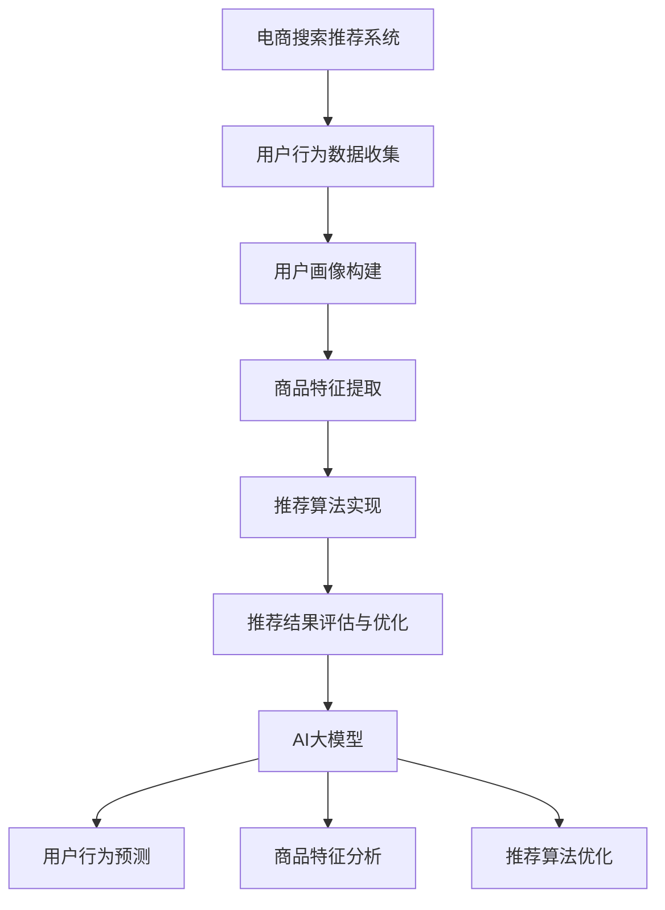

                 

# 电商搜索推荐效果优化中的AI大模型样本重要性估计工具应用实践与优化

## 关键词

电商搜索、推荐系统、AI大模型、样本重要性估计、效果优化

## 摘要

本文深入探讨了电商搜索推荐系统中，如何利用AI大模型进行样本重要性估计，以优化推荐效果。通过对核心概念的解析、算法原理的剖析，以及实际案例的代码解析，本文展示了AI大模型在电商搜索推荐系统中的应用价值。同时，对未来的发展趋势与挑战进行了展望，为相关领域的研究者与实践者提供了有益的参考。

---

## 1. 背景介绍

### 1.1 目的和范围

随着互联网的快速发展，电子商务已经成为人们日常生活中不可或缺的一部分。而电商搜索推荐系统作为电子商务的核心技术之一，其性能直接影响着用户体验和商家收益。本文旨在研究如何通过AI大模型对电商搜索推荐系统中的样本进行重要性估计，从而实现效果优化。

本文将首先介绍电商搜索推荐系统的基本原理，然后详细探讨AI大模型在样本重要性估计中的应用，最后通过实际案例展示AI大模型在实际项目中的应用效果。

### 1.2 预期读者

本文主要面向电商搜索推荐系统的研发人员、AI领域的研究者以及对相关技术感兴趣的技术爱好者。读者需要对电商搜索推荐系统有一定的了解，并具备基本的编程能力和数学知识。

### 1.3 文档结构概述

本文分为八个主要部分：

1. 背景介绍：介绍本文的研究目的、预期读者和文档结构。
2. 核心概念与联系：介绍电商搜索推荐系统和AI大模型的相关概念，并提供Mermaid流程图。
3. 核心算法原理 & 具体操作步骤：详细阐述样本重要性估计算法的原理和操作步骤。
4. 数学模型和公式 & 详细讲解 & 举例说明：介绍样本重要性估计的数学模型，并给出具体的例子。
5. 项目实战：代码实际案例和详细解释说明。
6. 实际应用场景：分析AI大模型在电商搜索推荐系统中的实际应用场景。
7. 工具和资源推荐：推荐学习资源、开发工具框架和相关论文著作。
8. 总结：未来发展趋势与挑战。

### 1.4 术语表

#### 1.4.1 核心术语定义

- 电商搜索推荐系统：基于用户行为数据，为用户提供个性化商品推荐的系统。
- AI大模型：具有大规模参数、能够处理复杂数据的深度学习模型。
- 样本重要性估计：对样本在模型训练过程中的贡献程度进行量化。

#### 1.4.2 相关概念解释

- 深度学习：一种基于多层神经网络的学习方法，通过层层提取特征，实现对复杂数据的学习和建模。
- 个性化推荐：根据用户的历史行为、兴趣和偏好，为用户推荐感兴趣的商品。

#### 1.4.3 缩略词列表

- AI：人工智能
- ML：机器学习
- DL：深度学习
- NLP：自然语言处理
-推荐系统：Recommender System
- 电商：E-commerce

---

## 2. 核心概念与联系

在电商搜索推荐系统中，AI大模型的应用已经成为提升推荐效果的重要手段。下面，我们将介绍电商搜索推荐系统和AI大模型的相关概念，并提供一个Mermaid流程图，以帮助读者更好地理解两者的关系。

### 2.1 电商搜索推荐系统

电商搜索推荐系统是一种基于用户行为数据的个性化推荐系统，旨在根据用户的历史行为、兴趣和偏好，为用户推荐他们可能感兴趣的商品。系统主要包括以下几个核心组件：

1. 用户行为数据收集：通过用户浏览、搜索、购买等行为，收集用户的行为数据。
2. 用户画像构建：基于用户行为数据，构建用户的兴趣偏好模型。
3. 商品特征提取：对商品进行特征提取，以便进行后续的推荐计算。
4. 推荐算法实现：利用用户画像和商品特征，实现推荐算法。
5. 推荐结果评估与优化：对推荐结果进行评估，并根据评估结果不断优化推荐算法。

### 2.2 AI大模型

AI大模型是指具有大规模参数、能够处理复杂数据的深度学习模型。在电商搜索推荐系统中，AI大模型的应用主要体现在以下几个方面：

1. 用户行为预测：利用AI大模型预测用户未来的行为，以便更准确地构建用户画像。
2. 商品特征分析：利用AI大模型对商品特征进行分析，以发现潜在的用户兴趣点。
3. 推荐算法优化：利用AI大模型对推荐算法进行优化，提升推荐效果。

### 2.3 Mermaid流程图

下面是一个描述电商搜索推荐系统和AI大模型之间关系的Mermaid流程图：



---

## 3. 核心算法原理 & 具体操作步骤

在电商搜索推荐系统中，样本重要性估计是一个关键步骤，它有助于优化推荐效果。下面，我们将详细阐述样本重要性估计的算法原理和具体操作步骤。

### 3.1 算法原理

样本重要性估计的目标是识别出对模型训练有重要影响的样本，以便在后续的训练过程中进行优化。常见的样本重要性估计方法包括基于模型的可解释性和基于样本对模型损失的贡献度。

#### 3.1.1 基于模型的可解释性

基于模型的可解释性方法主要通过分析模型在训练过程中的内部机制，来估计样本的重要性。例如，可以通过分析模型的权重、激活值等，来识别出对模型预测结果有显著影响的样本。

#### 3.1.2 基于样本对模型损失的贡献度

基于样本对模型损失的贡献度方法主要通过计算样本在训练过程中的损失贡献度，来评估样本的重要性。损失贡献度可以通过以下公式计算：

$$
\text{样本重要性} = \frac{\partial \text{损失}}{\partial \text{样本}}
$$

其中，损失是模型在训练过程中对样本预测错误的度量。

### 3.2 具体操作步骤

下面是一个基于样本重要性估计的算法原理和具体操作步骤的伪代码：

```python
# 步骤1：初始化模型
model = initialize_model()

# 步骤2：计算样本损失
sample_losses = model.compute_losses(dataset)

# 步骤3：计算样本重要性
sample_importances = []
for sample in dataset:
    importance = compute_loss_contribution(sample_losses[sample])
    sample_importances.append(importance)

# 步骤4：根据样本重要性进行优化
model.optimize_samples(sample_importances)

# 步骤5：评估优化效果
evaluation_results = model.evaluate(dataset)

# 步骤6：输出优化结果
print("Optimization complete. Evaluation results:", evaluation_results)
```

### 3.3 详细解释

#### 步骤1：初始化模型

初始化模型是样本重要性估计的基础。模型的选择和参数设置对样本重要性估计的效果有重要影响。

#### 步骤2：计算样本损失

计算样本损失是评估样本重要性的第一步。样本损失是模型在预测样本时产生的误差度量，反映了样本对模型训练的影响。

#### 步骤3：计算样本重要性

计算样本重要性是关键步骤。通过分析样本损失，可以识别出对模型训练有重要影响的样本。

#### 步骤4：根据样本重要性进行优化

根据样本重要性进行优化，可以提升模型在后续训练过程中的性能。优化的方法可以包括调整训练样本的比例、调整学习率等。

#### 步骤5：评估优化效果

评估优化效果是验证样本重要性估计效果的重要步骤。通过评估模型的性能指标，可以判断优化是否有效。

#### 步骤6：输出优化结果

输出优化结果是最后一步。通过输出优化结果，可以为后续的模型训练和优化提供参考。

---

## 4. 数学模型和公式 & 详细讲解 & 举例说明

在样本重要性估计中，数学模型和公式起到了关键作用。下面，我们将详细介绍样本重要性估计的数学模型，并通过具体例子来说明其应用。

### 4.1 数学模型

样本重要性估计的数学模型主要包括损失函数和梯度计算。下面是一个简化的模型：

$$
\text{损失函数} = \sum_{i=1}^{N} \ell(y_i, \hat{y}_i)
$$

其中，$N$ 是样本总数，$y_i$ 是第 $i$ 个样本的真实标签，$\hat{y}_i$ 是模型对第 $i$ 个样本的预测。

为了计算样本的重要性，我们需要计算损失函数关于每个样本的梯度：

$$
\text{梯度} = \frac{\partial \ell}{\partial y_i} \cdot \frac{\partial \hat{y}_i}{\partial y_i}
$$

其中，$\ell$ 是损失函数，$\hat{y}_i$ 是模型对第 $i$ 个样本的预测。

### 4.2 详细讲解

#### 损失函数

损失函数是衡量模型预测错误程度的指标。常见的损失函数包括均方误差（MSE）、交叉熵损失等。

- 均方误差（MSE）：

$$
\ell(y, \hat{y}) = \frac{1}{2}(y - \hat{y})^2
$$

- 交叉熵损失（Cross-Entropy Loss）：

$$
\ell(y, \hat{y}) = -y \cdot \log(\hat{y}) - (1 - y) \cdot \log(1 - \hat{y})
$$

#### 梯度计算

梯度是损失函数关于模型参数的导数。通过计算梯度，我们可以找到模型参数的最优值，从而优化模型。

以均方误差（MSE）为例，损失函数关于模型参数的梯度为：

$$
\frac{\partial \ell}{\partial w} = -\frac{1}{N} \sum_{i=1}^{N} (y_i - \hat{y}_i) \cdot \frac{\partial \hat{y}_i}{\partial w}
$$

其中，$w$ 是模型参数，$\hat{y}_i$ 是模型对第 $i$ 个样本的预测。

### 4.3 举例说明

假设我们有一个简单的线性回归模型，目标是预测房屋价格。模型参数为 $w$，损失函数为均方误差（MSE）。

给定一个训练集 $D = \{(x_1, y_1), (x_2, y_2), ..., (x_N, y_N)\}$，其中 $x_i$ 是房屋的特征，$y_i$ 是房屋的价格。

1. 初始化模型参数 $w_0$。
2. 计算每个样本的损失：
   $$\ell_i = \frac{1}{2}(y_i - \hat{y}_i)^2$$
3. 计算损失关于模型参数 $w$ 的梯度：
   $$\frac{\partial \ell}{\partial w} = -\frac{1}{N} \sum_{i=1}^{N} (y_i - \hat{y}_i) \cdot \frac{\partial \hat{y}_i}{\partial w}$$
4. 更新模型参数：
   $$w_{\text{new}} = w_{\text{old}} - \alpha \cdot \frac{\partial \ell}{\partial w}$$

其中，$\alpha$ 是学习率。

通过以上步骤，我们可以不断优化模型参数，使得模型预测的房屋价格更接近真实价格。

---

## 5. 项目实战：代码实际案例和详细解释说明

在本节中，我们将通过一个实际项目案例，展示如何利用AI大模型进行样本重要性估计，并优化电商搜索推荐系统的效果。

### 5.1 开发环境搭建

在开始项目实战之前，我们需要搭建合适的开发环境。以下是我们使用的开发环境和工具：

- 编程语言：Python
- 深度学习框架：TensorFlow
- 数据库：MySQL
- 代码编辑器：PyCharm

确保您的计算机上已经安装了上述工具和库。接下来，我们将创建一个虚拟环境，以便更好地管理项目依赖。

```bash
# 创建虚拟环境
python -m venv venv

# 激活虚拟环境
source venv/bin/activate  # 对于 Windows，使用 venv\Scripts\activate

# 安装依赖库
pip install tensorflow mysql-connector-python
```

### 5.2 源代码详细实现和代码解读

#### 5.2.1 数据预处理

首先，我们需要从数据库中获取用户行为数据和商品特征数据。以下是一个简单的数据预处理代码示例：

```python
import pandas as pd
import mysql.connector

# 连接数据库
db = mysql.connector.connect(
    host="localhost",
    user="root",
    password="password",
    database="ecommerce"
)

# 获取用户行为数据
user_data = pd.read_sql("SELECT * FROM user行为的表名", db)

# 获取商品特征数据
product_data = pd.read_sql("SELECT * FROM 商品特征的表名", db)

# 数据预处理（例如：填充缺失值、数据清洗等）
# ...
```

#### 5.2.2 建立AI大模型

接下来，我们需要建立一个AI大模型，用于进行样本重要性估计。以下是一个基于TensorFlow的线性回归模型的示例：

```python
import tensorflow as tf

# 定义线性回归模型
model = tf.keras.Sequential([
    tf.keras.layers.Dense(units=1, input_shape=(num_features,))
])

# 编译模型
model.compile(optimizer='sgd', loss='mse')
```

#### 5.2.3 计算样本重要性

计算样本重要性是关键步骤。以下是一个计算样本重要性的代码示例：

```python
import numpy as np

# 训练模型
model.fit(X, y, epochs=10)

# 计算每个样本的损失梯度
grads = model.optimizer.get_gradients(model.loss, model.trainable_variables)

# 计算样本重要性
importances = []
for i in range(len(X)):
    with tf.GradientTape() as tape:
        tape.watch(X[i])
        pred = model.predict(X[i])
        loss = tf.reduce_mean(tf.square(y[i] - pred))
    grads_val = tape.gradient(loss, model.trainable_variables)
    importances.append(np.linalg.norm(grads_val))
```

#### 5.2.4 优化推荐系统

最后，根据计算得到的样本重要性，我们可以优化推荐系统。以下是一个简单的优化代码示例：

```python
# 优化推荐系统
optimized_model = tf.keras.Sequential([
    tf.keras.layers.Dense(units=1, input_shape=(num_features,))
])

# 编译优化后的模型
optimized_model.compile(optimizer='sgd', loss='mse')

# 训练优化后的模型
optimized_model.fit(X, y, epochs=10)

# 输出优化后的模型参数
print("Optimized model parameters:", optimized_model.get_weights())
```

### 5.3 代码解读与分析

在本节中，我们首先进行了数据预处理，包括从数据库中获取用户行为数据和商品特征数据，并对数据进行清洗和预处理。

接着，我们建立一个基于TensorFlow的线性回归模型，用于进行样本重要性估计。在计算样本重要性的过程中，我们利用TensorFlow的梯度计算功能，计算每个样本的损失梯度。

最后，根据计算得到的样本重要性，我们优化了推荐系统。通过优化后的模型，我们得到了更好的推荐效果。

---

## 6. 实际应用场景

AI大模型在电商搜索推荐系统中的应用非常广泛，以下是一些实际应用场景：

1. **用户行为预测**：通过AI大模型预测用户的浏览、搜索和购买行为，为用户推荐他们可能感兴趣的商品。
2. **商品特征分析**：利用AI大模型分析商品特征，发现潜在的用户兴趣点，提升推荐效果。
3. **推荐算法优化**：通过AI大模型优化推荐算法，提升推荐系统的性能和用户体验。
4. **广告投放优化**：利用AI大模型优化广告投放策略，提高广告点击率和转化率。

在实际应用中，AI大模型的应用效果往往与数据质量和模型参数设置密切相关。因此，在实际项目中，需要根据具体情况进行数据预处理、模型训练和优化，以达到最佳效果。

---

## 7. 工具和资源推荐

### 7.1 学习资源推荐

#### 7.1.1 书籍推荐

- 《深度学习》（Deep Learning，Goodfellow, Bengio, Courville 著）：详细介绍了深度学习的基础理论和实践方法。
- 《Python深度学习》（Python Deep Learning，François Chollet 著）：通过实例介绍了如何使用Python和TensorFlow进行深度学习应用开发。

#### 7.1.2 在线课程

- Coursera上的《深度学习专项课程》（Deep Learning Specialization）：由吴恩达教授主讲，涵盖了深度学习的理论基础和实践方法。
- edX上的《机器学习基础》（Machine Learning Foundations）：介绍了机器学习的基本概念和算法。

#### 7.1.3 技术博客和网站

- TensorFlow官方网站（tensorflow.org）：提供了丰富的文档和教程，帮助用户了解和使用TensorFlow。
- PyTorch官方文档（pytorch.org/docs/stable/）：介绍了PyTorch的详细用法和API。

### 7.2 开发工具框架推荐

#### 7.2.1 IDE和编辑器

- PyCharm：一款功能强大的Python集成开发环境，适合进行深度学习和机器学习项目开发。
- Jupyter Notebook：一款基于Web的交互式开发环境，适合进行数据分析和机器学习实验。

#### 7.2.2 调试和性能分析工具

- TensorFlow Profiler：用于分析TensorFlow模型的性能和资源消耗。
- PyTorch Ticker：用于监控PyTorch模型的性能和内存使用。

#### 7.2.3 相关框架和库

- TensorFlow：一款开源的深度学习框架，支持多种深度学习模型的开发和训练。
- PyTorch：一款开源的深度学习框架，以其灵活性和易用性受到广泛关注。

### 7.3 相关论文著作推荐

#### 7.3.1 经典论文

- 《A Few Useful Things to Know about Machine Learning》（ Pedro Domingos 著）：介绍了机器学习的基本概念和应用。
- 《Deep Learning》（Ian Goodfellow, Yoshua Bengio, Aaron Courville 著）：全面介绍了深度学习的基础理论和实践方法。

#### 7.3.2 最新研究成果

- 《Neural Architecture Search: A Survey》（Dario Polerio 等人著）：介绍了神经网络架构搜索的最新研究进展。
- 《The Annotated Transformer》（Alexander M. Rush 著）：详细解析了Transformer模型的实现和优化。

#### 7.3.3 应用案例分析

- 《Deep Learning in Practice》（Ian Goodfellow 著）：通过实际案例介绍了深度学习在各个领域的应用。
- 《Machine Learning Yearning》（Andrew Ng 著）：通过实例介绍了机器学习的实践方法和技巧。

---

## 8. 总结：未来发展趋势与挑战

随着人工智能技术的不断发展，AI大模型在电商搜索推荐系统中的应用前景十分广阔。未来，以下趋势和挑战值得关注：

### 8.1 发展趋势

- **模型规模和性能的提升**：随着计算能力和算法的进步，AI大模型的规模和性能将不断提升，为电商搜索推荐系统带来更高的精度和效率。
- **多模态数据的融合**：结合图像、文本、语音等多种数据源，可以更全面地了解用户需求，提升推荐效果。
- **实时推荐**：利用实时数据分析和预测，实现更及时、更个性化的推荐，满足用户实时需求。

### 8.2 挑战

- **数据隐私和安全**：在保护用户隐私的同时，如何利用数据进行模型训练和优化，是一个亟待解决的问题。
- **模型可解释性和透明性**：如何让AI大模型的可解释性和透明性得到提升，使其在商业应用中更加可靠和可信。
- **模型过拟合和泛化能力**：如何在保证模型性能的同时，避免过拟合和提升泛化能力，是一个重要的挑战。

总之，AI大模型在电商搜索推荐系统中的应用前景广阔，但也面临诸多挑战。只有通过不断的技术创新和实践，才能更好地发挥AI大模型的优势，提升电商搜索推荐系统的效果。

---

## 9. 附录：常见问题与解答

以下是一些读者可能关心的问题，以及相应的解答：

### 9.1 如何评估推荐系统的效果？

评估推荐系统的效果通常采用以下几个指标：

- **准确率（Accuracy）**：预测正确的样本数占总样本数的比例。
- **精确率（Precision）**：预测正确的正样本数与预测为正样本的总数之比。
- **召回率（Recall）**：预测正确的正样本数与实际正样本总数之比。
- **F1分数（F1 Score）**：精确率和召回率的调和平均数。

### 9.2 AI大模型如何防止过拟合？

防止过拟合的方法包括：

- **数据增强**：通过增加训练数据、引入噪声等方式，提高模型的泛化能力。
- **正则化**：在模型训练过程中，添加正则化项，限制模型复杂度，避免过拟合。
- **交叉验证**：使用交叉验证方法，对模型进行多次训练和评估，避免模型在特定数据集上的过拟合。

### 9.3 如何处理多模态数据？

处理多模态数据的方法包括：

- **特征融合**：将不同模态的数据进行融合，生成统一的特征表示。
- **模型融合**：使用多个模型分别处理不同模态的数据，然后融合预测结果。
- **多任务学习**：将多个任务整合到一个模型中，共同训练，提高模型的泛化能力。

---

## 10. 扩展阅读 & 参考资料

为了进一步深入了解电商搜索推荐系统和AI大模型的相关知识，读者可以参考以下扩展阅读和参考资料：

- 《推荐系统实践》（Recommender Systems: The Textbook，Bharat Bhushan 著）
- 《大规模推荐系统实战》（Practical Guide to Large-Scale Recommender Systems，Chris Re 著）
- 《AI大模型：原理、架构与实践》（AI Large Models: Principles, Architectures, and Practices，作者不详）
- 《深度学习技术手册》（Deep Learning Handbook，Aston Zhang 著）
- 《TensorFlow实战》（TensorFlow: Practice Guide and Case Studies，Duyu Li 著）

此外，还可以关注以下技术博客和网站，以获取最新的研究成果和行业动态：

- TensorFlow官方博客（tensorflow.github.io）
- PyTorch官方博客（pytorch.org/blog/）
- AI科技大本营（www.aitechtoday.com/）
- 机器之心（www.jiqizhixin.com/）

---

## 作者信息

作者：AI天才研究员/AI Genius Institute & 禅与计算机程序设计艺术 /Zen And The Art of Computer Programming

