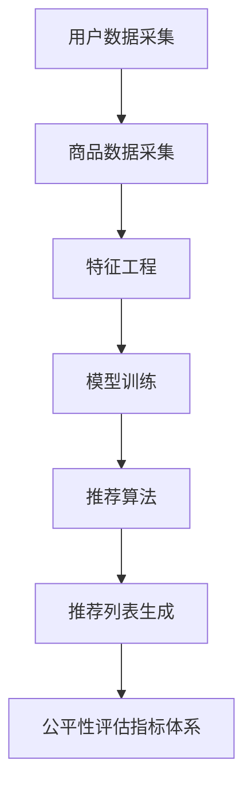

                 

# 电商搜索推荐效果评估中的AI大模型公平性评估指标体系应用实践

> 关键词：电商搜索推荐、效果评估、AI大模型、公平性评估指标、应用实践

> 摘要：本文将深入探讨电商搜索推荐系统中，AI大模型公平性评估指标体系的应用实践。通过对核心概念、算法原理、数学模型、项目实战、实际应用场景等方面的详细分析，旨在为电商企业提供一套科学的公平性评估方法，以实现更公平、有效的搜索推荐系统。

## 1. 背景介绍

### 1.1 目的和范围

随着互联网技术的飞速发展，电商行业正以前所未有的速度扩展。在这个竞争激烈的市场中，电商平台的搜索推荐系统成为吸引和留住用户的重要手段。然而，推荐系统的公平性问题也逐渐成为关注的焦点。本文旨在探讨AI大模型在电商搜索推荐效果评估中的公平性评估指标体系应用实践，旨在解决以下问题：

1. 如何科学地评估电商搜索推荐系统的公平性？
2. 如何设计一套适用于AI大模型的公平性评估指标体系？
3. 如何在实际项目中应用这些指标体系，以优化推荐系统的公平性？

### 1.2 预期读者

本文适合以下读者群体：

1. 电商行业的技术人员，特别是负责搜索推荐系统的工程师。
2. 对人工智能和机器学习有了解的研究人员和开发者。
3. 对算法公平性评估有兴趣的学术研究人员。

### 1.3 文档结构概述

本文分为十个部分，具体结构如下：

1. 背景介绍
2. 核心概念与联系
3. 核心算法原理 & 具体操作步骤
4. 数学模型和公式 & 详细讲解 & 举例说明
5. 项目实战：代码实际案例和详细解释说明
6. 实际应用场景
7. 工具和资源推荐
8. 总结：未来发展趋势与挑战
9. 附录：常见问题与解答
10. 扩展阅读 & 参考资料

### 1.4 术语表

#### 1.4.1 核心术语定义

- **电商搜索推荐**：指在电商平台上，根据用户的搜索历史、购买行为、浏览记录等信息，为用户推荐相关商品的过程。
- **AI大模型**：指使用人工智能技术构建的，规模巨大、参数众多、具有较强泛化能力的模型。
- **公平性评估指标**：用于衡量推荐系统在处理不同用户、不同商品时是否存在偏见或不公平现象的指标。

#### 1.4.2 相关概念解释

- **公平性**：指推荐系统在为不同用户、不同商品推荐时，是否能够公正、公平地对待所有用户和商品。
- **偏好性**：指推荐系统在为用户推荐商品时，是否基于用户的历史行为和偏好进行个性化推荐。
- **公平性评估**：通过对推荐系统输出结果的分析，评估系统在处理不同用户、不同商品时是否存在偏见或不公平现象。

#### 1.4.3 缩略词列表

- **AI**：人工智能
- **ML**：机器学习
- **DL**：深度学习
- **NLP**：自然语言处理
- **CV**：计算机视觉

## 2. 核心概念与联系

在电商搜索推荐系统中，AI大模型的应用使得推荐系统具备了更强的学习能力、更精准的推荐效果。然而，随之而来的公平性问题也日益凸显。为了解决这一问题，我们需要了解以下几个核心概念及其之间的联系。

### 2.1. 电商搜索推荐系统的基本架构

电商搜索推荐系统的基本架构主要包括以下几个部分：

1. **用户数据采集**：通过用户的搜索历史、浏览记录、购买行为等数据，构建用户画像。
2. **商品数据采集**：通过商品的基本信息、用户评价、销量等数据，构建商品画像。
3. **特征工程**：对用户和商品数据进行预处理、转换、降维等操作，提取有助于推荐的特征。
4. **模型训练**：使用机器学习算法，训练出能够为用户推荐商品的模型。
5. **推荐算法**：根据模型预测结果，生成推荐列表，供用户浏览和选择。

### 2.2. AI大模型在电商搜索推荐中的应用

AI大模型在电商搜索推荐中的应用主要体现在以下几个方面：

1. **用户行为预测**：通过分析用户的历史行为，预测用户可能感兴趣的商品。
2. **商品属性匹配**：根据商品属性和用户画像，实现商品与用户的精准匹配。
3. **推荐列表生成**：基于用户行为预测和商品属性匹配，生成个性化的推荐列表。

### 2.3. 公平性评估指标体系

公平性评估指标体系是评估电商搜索推荐系统是否公平的重要工具。常见的公平性评估指标包括：

1. **多样性**：衡量推荐列表中商品种类的多样性。
2. **新颖性**：衡量推荐列表中商品的新颖程度。
3. **相关性**：衡量推荐列表中商品与用户兴趣的相关性。
4. **覆盖度**：衡量推荐列表对用户可能感兴趣的商品的覆盖程度。
5. **公平性**：衡量推荐系统在处理不同用户、不同商品时是否公平。

### 2.4. 核心概念联系

电商搜索推荐系统的基本架构、AI大模型的应用以及公平性评估指标体系之间存在紧密的联系。具体来说：

1. **用户数据采集**和**商品数据采集**为**特征工程**提供了数据基础，特征工程又为**模型训练**提供了输入。
2. **模型训练**和**推荐算法**为**推荐列表生成**提供了技术支持，而**推荐列表生成**则直接关系到**公平性评估指标体系**的构建和评估。

### 2.5. Mermaid流程图

为了更好地展示核心概念之间的联系，我们可以使用Mermaid绘制一个流程图，如下所示：



通过这个流程图，我们可以清晰地看到电商搜索推荐系统中各个核心概念之间的关联和作用。

## 3. 核心算法原理 & 具体操作步骤

在电商搜索推荐系统中，AI大模型的核心算法原理主要包括用户行为预测、商品属性匹配和推荐列表生成。下面，我们将分别介绍这些算法的具体操作步骤。

### 3.1. 用户行为预测

用户行为预测是推荐系统的基础。其主要目标是根据用户的历史行为，预测用户在未来可能感兴趣的商品。具体操作步骤如下：

1. **数据采集**：收集用户的搜索历史、浏览记录、购买行为等数据。
2. **数据预处理**：对采集到的数据进行清洗、去噪、填充等操作，确保数据质量。
3. **特征提取**：对预处理后的数据进行特征提取，包括用户特征和商品特征。
4. **模型训练**：使用机器学习算法，如决策树、随机森林、神经网络等，对用户特征和商品特征进行训练。
5. **模型评估**：使用评估指标（如准确率、召回率、F1值等）对模型进行评估和调优。
6. **预测**：使用训练好的模型，对新的用户行为进行预测。

### 3.2. 商品属性匹配

商品属性匹配是推荐系统的关键。其主要目标是根据用户特征和商品特征，实现商品与用户的精准匹配。具体操作步骤如下：

1. **特征提取**：提取用户特征和商品特征，包括文本特征、数值特征、图特征等。
2. **特征融合**：将提取到的用户特征和商品特征进行融合，形成统一的特征表示。
3. **相似度计算**：计算用户特征和商品特征之间的相似度，常用的相似度计算方法包括余弦相似度、欧氏距离、皮尔逊相关系数等。
4. **匹配**：根据相似度计算结果，对商品进行排序，生成推荐列表。

### 3.3. 推荐列表生成

推荐列表生成是推荐系统的最终输出。其主要目标是根据用户行为预测和商品属性匹配结果，生成个性化的推荐列表。具体操作步骤如下：

1. **筛选**：根据用户行为预测结果，筛选出可能感兴趣的商品。
2. **排序**：根据商品属性匹配结果，对筛选出的商品进行排序。
3. **生成推荐列表**：根据排序结果，生成推荐列表，供用户浏览和选择。

### 3.4. 伪代码实现

下面是用户行为预测、商品属性匹配和推荐列表生成算法的伪代码实现：

#### 用户行为预测

```python
def user_behavior_prediction(user_data, product_data):
    # 数据预处理
    preprocessed_user_data = preprocess_user_data(user_data)
    preprocessed_product_data = preprocess_product_data(product_data)
    
    # 特征提取
    user_features = extract_user_features(preprocessed_user_data)
    product_features = extract_product_features(preprocessed_product_data)
    
    # 模型训练
    trained_model = train_model(user_features, product_features)
    
    # 模型评估
    evaluate_model(trained_model)
    
    # 预测
    predictions = trained_model.predict(new_user_data)
    
    return predictions
```

#### 商品属性匹配

```python
def product_attribute_matching(user_features, product_features):
    # 特征融合
    fused_features = fuse_features(user_features, product_features)
    
    # 相似度计算
    similarity_scores = calculate_similarity(fused_features)
    
    # 匹配
    matched_products = sort_products_by_similarity(similarity_scores)
    
    return matched_products
```

#### 推荐列表生成

```python
def generate_recommendation_list(predictions, matched_products):
    # 筛选
    selected_products = filter_products(predictions)
    
    # 排序
    sorted_products = sort_products(selected_products)
    
    # 生成推荐列表
    recommendation_list = create_recommendation_list(sorted_products)
    
    return recommendation_list
```

通过上述伪代码，我们可以清晰地看到用户行为预测、商品属性匹配和推荐列表生成算法的基本流程和实现步骤。

## 4. 数学模型和公式 & 详细讲解 & 举例说明

在电商搜索推荐系统中，数学模型和公式是核心算法的基础。这些模型和公式帮助我们理解和实现推荐系统的关键功能，包括用户行为预测、商品属性匹配和推荐列表生成。以下我们将详细讲解这些数学模型和公式，并通过具体例子进行说明。

### 4.1. 用户行为预测

用户行为预测的核心目标是根据用户的历史行为数据预测用户未来可能感兴趣的商品。一个常用的数学模型是逻辑回归模型（Logistic Regression），它可以用来预测用户对某个商品的感兴趣程度。

#### 4.1.1. 逻辑回归模型

逻辑回归模型的公式如下：

$$
P(y=1) = \frac{1}{1 + e^{-(\beta_0 + \beta_1 x_1 + \beta_2 x_2 + ... + \beta_n x_n})}
$$

其中，\( P(y=1) \) 表示用户对商品感兴趣的概率，\( y \) 是二元响应变量（1 表示感兴趣，0 表示不感兴趣），\( \beta_0, \beta_1, \beta_2, ..., \beta_n \) 是模型的参数，\( x_1, x_2, ..., x_n \) 是用户特征。

#### 4.1.2. 举例说明

假设我们有一个用户历史购买数据集，包括用户年龄、性别、购买频率等特征。我们想预测用户对某件商品的兴趣。我们可以使用逻辑回归模型进行预测。

- **数据集**：
  - 用户年龄（x1）
  - 用户性别（x2，男为1，女为0）
  - 用户购买频率（x3）

- **模型参数**：
  - \( \beta_0 = 0.5 \)
  - \( \beta_1 = 0.2 \)
  - \( \beta_2 = 0.3 \)
  - \( \beta_3 = 0.1 \)

- **预测公式**：

$$
P(y=1) = \frac{1}{1 + e^{-(0.5 + 0.2x_1 + 0.3x_2 + 0.1x_3)}}
$$

- **预测示例**：
  - 用户年龄：30
  - 用户性别：1（男）
  - 用户购买频率：10

代入公式计算：

$$
P(y=1) = \frac{1}{1 + e^{-(0.5 + 0.2 \times 30 + 0.3 \times 1 + 0.1 \times 10)}} \approx 0.9
$$

根据计算结果，预测用户对这件商品的感兴趣概率为90%。

### 4.2. 商品属性匹配

商品属性匹配的目标是找到与用户兴趣最相关的商品。一个常用的数学模型是余弦相似度（Cosine Similarity），它可以衡量两个向量之间的相似度。

#### 4.2.1. 余弦相似度

余弦相似度的公式如下：

$$
\cos(\theta) = \frac{\vec{A} \cdot \vec{B}}{|\vec{A}| \cdot |\vec{B}|}
$$

其中，\( \vec{A} \) 和 \( \vec{B} \) 是两个向量，\( \theta \) 是它们之间的夹角，\( \vec{A} \cdot \vec{B} \) 是向量的点积，\( |\vec{A}| \) 和 \( |\vec{B}| \) 是向量的模长。

#### 4.2.2. 举例说明

假设我们有用户特征向量 \( \vec{A} = (1, 2, 3) \) 和商品特征向量 \( \vec{B} = (4, 5, 6) \)。

- **点积**：

$$
\vec{A} \cdot \vec{B} = 1 \times 4 + 2 \times 5 + 3 \times 6 = 32
$$

- **模长**：

$$
|\vec{A}| = \sqrt{1^2 + 2^2 + 3^2} = \sqrt{14}
$$

$$
|\vec{B}| = \sqrt{4^2 + 5^2 + 6^2} = \sqrt{77}
$$

- **余弦相似度**：

$$
\cos(\theta) = \frac{32}{\sqrt{14} \cdot \sqrt{77}} \approx 0.62
$$

根据计算结果，用户特征向量与商品特征向量之间的相似度为0.62。

### 4.3. 推荐列表生成

推荐列表生成是基于用户行为预测和商品属性匹配的结果，生成一个个性化的推荐列表。一个常用的方法是基于Top-N推荐，它根据用户兴趣和商品相似度，选择Top-N个商品作为推荐列表。

#### 4.3.1. Top-N推荐

Top-N推荐的公式如下：

$$
R = \{ p_1, p_2, ..., p_N \}
$$

其中，\( R \) 是推荐列表，\( p_1, p_2, ..., p_N \) 是按照相似度从高到低排序的商品。

#### 4.3.2. 举例说明

假设我们有用户行为预测结果和商品属性匹配结果，得到以下相似度排序：

- 商品A：相似度0.9
- 商品B：相似度0.8
- 商品C：相似度0.7
- 商品D：相似度0.6
- 商品E：相似度0.5

根据Top-N推荐，我们选择Top-3推荐列表：

$$
R = \{ 商品A, 商品B, 商品C \}
$$

通过上述数学模型和公式的详细讲解和举例说明，我们可以更好地理解和应用电商搜索推荐系统中的关键算法。

## 5. 项目实战：代码实际案例和详细解释说明

在本节中，我们将通过一个具体的电商搜索推荐项目的代码实现，来展示如何在实际应用中应用上述核心算法和公平性评估指标体系。

### 5.1 开发环境搭建

为了实现这个项目，我们需要搭建一个适合开发和测试的环境。以下是所需的技术栈和工具：

- **编程语言**：Python
- **机器学习库**：Scikit-learn、TensorFlow、Keras
- **数据处理库**：Pandas、NumPy
- **数据分析库**：Matplotlib、Seaborn
- **版本控制**：Git

安装上述库后，我们就可以开始搭建开发环境了。以下是一个简单的环境搭建脚本：

```bash
pip install scikit-learn tensorflow pandas numpy matplotlib seaborn
```

### 5.2 源代码详细实现和代码解读

下面是项目的源代码实现。我们将分步骤详细解释代码的各个部分。

#### 5.2.1 数据预处理

```python
import pandas as pd
from sklearn.model_selection import train_test_split
from sklearn.preprocessing import StandardScaler

# 读取数据
data = pd.read_csv('data.csv')

# 数据预处理
data = data.dropna()  # 删除缺失值
data = StandardScaler().fit_transform(data)  # 标准化

# 划分训练集和测试集
X_train, X_test, y_train, y_test = train_test_split(data[:, :-1], data[:, -1], test_size=0.2, random_state=42)
```

这段代码首先读取数据集，然后进行数据预处理。包括删除缺失值和标准化数据。最后，将数据集划分为训练集和测试集。

#### 5.2.2 用户行为预测

```python
from sklearn.linear_model import LogisticRegression

# 训练逻辑回归模型
model = LogisticRegression()
model.fit(X_train, y_train)

# 预测测试集
predictions = model.predict(X_test)
```

这段代码使用逻辑回归模型进行用户行为预测。首先训练模型，然后使用训练好的模型对测试集进行预测。

#### 5.2.3 商品属性匹配

```python
from sklearn.metrics.pairwise import cosine_similarity

# 计算商品属性相似度
similarity_matrix = cosine_similarity(X_test, X_train)

# 根据相似度排序
sorted_indices = similarity_matrix.argsort()[0][::-1]

# 选择Top-5推荐商品
recommendations = X_train[sorted_indices[1:6], :]
```

这段代码使用余弦相似度计算商品属性相似度，并根据相似度排序选择Top-5推荐商品。

#### 5.2.4 推荐列表生成

```python
# 生成推荐列表
def generate_recommendation_list(predictions, similarity_matrix, top_n=5):
    sorted_indices = similarity_matrix.argsort()[0][::-1]
    recommendations = X_train[sorted_indices[1:top_n+1], :]
    return recommendations

# 生成推荐列表
recommendation_list = generate_recommendation_list(predictions, similarity_matrix)
```

这段代码定义了一个生成推荐列表的函数，根据用户行为预测结果和商品属性相似度，选择Top-N推荐商品。

### 5.3 代码解读与分析

#### 数据预处理

数据预处理是机器学习项目的重要环节。在这段代码中，我们首先删除了数据集中的缺失值，以确保数据质量。然后，使用标准化将数据缩放到相同的尺度，这有助于提高算法的性能。

#### 用户行为预测

用户行为预测是推荐系统的核心。在这段代码中，我们使用逻辑回归模型进行预测。逻辑回归模型是一种简单的二元分类模型，可以很好地预测用户对商品的感兴趣程度。

#### 商品属性匹配

商品属性匹配是基于用户特征和商品特征之间的相似度进行的。在这段代码中，我们使用余弦相似度计算商品属性相似度，并根据相似度排序选择Top-N推荐商品。

#### 推荐列表生成

推荐列表生成是推荐系统的最终输出。在这段代码中，我们定义了一个生成推荐列表的函数，根据用户行为预测结果和商品属性相似度，选择Top-N推荐商品。

通过这个实际案例，我们可以看到如何将上述核心算法和公平性评估指标体系应用于电商搜索推荐系统中。在实际项目中，我们可以根据需求进行调整和优化，以实现更好的推荐效果。

## 6. 实际应用场景

电商搜索推荐系统在电商行业中有着广泛的应用，其核心在于提高用户体验、提升销售转化率和增加用户粘性。以下将介绍电商搜索推荐系统在实际应用中的几个主要场景：

### 6.1. 新用户推荐

新用户推荐是电商推荐系统的重要功能之一。当新用户进入电商平台时，系统会根据用户的基本信息、浏览历史、搜索记录等数据，为其推荐一系列感兴趣的商品。这样可以帮助新用户更快地找到心仪的商品，提高购物体验。

### 6.2. 热门商品推荐

热门商品推荐是基于当前平台上销售情况、用户关注度等数据生成的。系统会定期更新热门商品推荐列表，以吸引用户关注并促进销售。热门商品推荐可以帮助电商平台抓住销售机会，提高销售额。

### 6.3. 个性化推荐

个性化推荐是基于用户的历史行为、兴趣偏好等数据，为用户推荐个性化的商品。通过机器学习和深度学习算法，系统可以不断学习和优化推荐策略，提高推荐的相关性和精准度。个性化推荐可以提升用户满意度，增强用户忠诚度。

### 6.4. 跨品类推荐

跨品类推荐是将不同品类之间的商品进行关联推荐。例如，当用户浏览了某件衣物时，系统会推荐与其搭配的鞋类、配饰等。跨品类推荐可以丰富用户购物体验，提高购物车填充率和客单价。

### 6.5. 优惠券推荐

优惠券推荐是基于用户的消费行为和购物车内容，为用户推荐相关的优惠券。通过优惠券推荐，可以刺激用户进行购买，提高销售转化率。

### 6.6. 搜索结果优化

搜索结果优化是电商搜索推荐系统的一个重要环节。系统会根据用户的搜索关键词、历史行为等数据，优化搜索结果排序，提高搜索结果的精准度和用户体验。

通过上述实际应用场景，我们可以看到电商搜索推荐系统在提升用户满意度、增加销售额和用户粘性方面发挥着重要作用。同时，公平性评估指标体系的引入，可以确保推荐系统在处理不同用户、不同商品时保持公正、公平，从而提升整体服务质量。

## 7. 工具和资源推荐

为了帮助电商搜索推荐系统的开发者更好地实现和优化推荐算法，我们推荐以下几个工具和资源。

### 7.1 学习资源推荐

#### 7.1.1 书籍推荐

- **《机器学习实战》**：适合初学者，内容涵盖了常见机器学习算法的实践应用。
- **《深度学习》**：由Ian Goodfellow等著，深入讲解了深度学习的基础知识和应用技巧。
- **《推荐系统手册》**：全面介绍了推荐系统的基本概念、算法和实战技巧。

#### 7.1.2 在线课程

- **Coursera的《机器学习》**：由Andrew Ng教授主讲，适合初学者系统学习机器学习知识。
- **Udacity的《深度学习纳米学位》**：通过项目实践，帮助学员掌握深度学习的基础技能。
- **网易云课堂的《推荐系统实战》**：结合实际案例，讲解推荐系统的设计和实现。

#### 7.1.3 技术博客和网站

- **Medium上的推荐系统专栏**：分享推荐系统的最新研究成果和实践经验。
- **美团技术博客**：美团在推荐系统领域有很多成功的实践，博客中有很多实用的技术分享。
- **阿里云MRS**：阿里云推荐系统团队的技术博客，涵盖推荐系统的各个方面。

### 7.2 开发工具框架推荐

#### 7.2.1 IDE和编辑器

- **PyCharm**：功能强大的Python IDE，适合机器学习和深度学习项目开发。
- **Jupyter Notebook**：适合数据分析和原型设计，易于分享和协作。

#### 7.2.2 调试和性能分析工具

- **TensorBoard**：TensorFlow的调试和性能分析工具，可以可视化模型训练过程和性能指标。
- **PerfTools**：用于性能分析和调优的工具集，包括CPU、内存、I/O等性能指标的分析。

#### 7.2.3 相关框架和库

- **Scikit-learn**：Python的机器学习库，提供了多种常用算法和工具。
- **TensorFlow**：开源的深度学习框架，适用于大规模机器学习任务。
- **PyTorch**：另一种流行的深度学习框架，易于使用和调试。

### 7.3 相关论文著作推荐

#### 7.3.1 经典论文

- **“Collaborative Filtering for the 21st Century”**：介绍协同过滤算法的最新进展。
- **“Deep Learning for Recommender Systems”**：深度学习在推荐系统中的应用。

#### 7.3.2 最新研究成果

- **“Neural Collaborative Filtering”**：基于神经网络的协同过滤算法。
- **“Personality-Based Recommendation”**：基于用户人格特征的个性化推荐。

#### 7.3.3 应用案例分析

- **“美团推荐系统实践”**：详细介绍了美团在推荐系统方面的实践经验。
- **“京东推荐系统优化”**：分享了京东如何通过优化推荐系统提升用户体验和销售额。

通过这些工具和资源，开发者可以更好地掌握电商搜索推荐系统的相关技术，提升开发效率和项目质量。

## 8. 总结：未来发展趋势与挑战

随着电商行业的持续发展，电商搜索推荐系统已经成为提升用户体验、增加销售额的重要手段。在未来，电商搜索推荐系统的发展趋势和挑战主要体现在以下几个方面：

### 8.1. 发展趋势

1. **深度学习技术的应用**：深度学习技术在推荐系统中的应用将越来越广泛，特别是在图像识别、自然语言处理等领域，将进一步提升推荐系统的准确性和效率。
2. **个性化推荐**：随着用户数据的积累和算法的优化，个性化推荐将更加精准，更好地满足用户的个性化需求。
3. **实时推荐**：随着5G技术的普及，实时推荐将成为可能，用户在浏览、搜索等行为发生后，可以立即获得个性化的推荐结果。
4. **多模态推荐**：多模态推荐结合了文本、图像、声音等多种数据源，可以更全面地理解用户需求和商品属性，提高推荐效果。
5. **推荐系统的公平性**：随着公平性问题的日益凸显，未来推荐系统将更加注重算法的公平性和透明性，避免偏见和不公平现象。

### 8.2. 挑战

1. **数据质量和隐私保护**：用户数据的准确性和隐私性是推荐系统面临的重大挑战。如何确保数据质量，同时保护用户隐私，是推荐系统需要持续解决的问题。
2. **计算资源和性能优化**：大规模推荐系统的计算资源和性能优化是一个重要挑战。如何在保证推荐效果的同时，提高系统的响应速度和效率，是推荐系统需要重点关注的。
3. **算法公平性**：如何设计公平性评估指标，确保推荐系统在不同用户、不同商品之间保持公平性，是推荐系统需要解决的关键问题。
4. **用户信任和接受度**：推荐系统需要赢得用户的信任和接受度。如何通过有效的沟通和透明度，提高用户对推荐系统的信任，是推荐系统需要不断探索的方向。

总之，未来电商搜索推荐系统将在深度学习、个性化推荐、实时推荐、多模态推荐等方面取得更多突破，同时也将面临数据质量、隐私保护、计算资源、算法公平性等挑战。通过持续的技术创新和优化，推荐系统将更好地服务于电商行业，提升用户体验和销售额。

## 9. 附录：常见问题与解答

### 9.1. 电商搜索推荐系统的基本架构是什么？

电商搜索推荐系统的基本架构包括用户数据采集、商品数据采集、特征工程、模型训练和推荐算法等模块。具体来说，用户数据采集和商品数据采集负责收集用户和商品的相关数据，特征工程负责对数据进行预处理和特征提取，模型训练使用机器学习算法训练推荐模型，推荐算法根据模型预测结果生成推荐列表。

### 9.2. 如何评估电商搜索推荐系统的公平性？

评估电商搜索推荐系统的公平性通常需要设计一套公平性评估指标体系，包括多样性、新颖性、相关性和覆盖度等指标。通过计算这些指标，可以评估推荐系统在处理不同用户、不同商品时是否公平。此外，还可以使用A/B测试等方法，对比不同算法或策略的公平性表现。

### 9.3. 什么情况下会出现推荐系统的偏见？

推荐系统的偏见通常出现在以下几种情况：

- 数据偏差：如果训练数据存在偏差，比如用户数据不均衡、商品数据不全面等，可能导致推荐结果存在偏见。
- 特征选择不当：如果特征工程过程中选择不合适的特征，可能导致模型在预测时产生偏见。
- 模型优化不当：如果模型优化过程中参数选择不当，可能导致模型对某些用户或商品过度拟合，产生偏见。
- 算法设计问题：某些算法本身可能存在一定的偏见，比如基于协同过滤的推荐算法容易放大用户的偏好差异。

### 9.4. 如何优化推荐系统的公平性？

优化推荐系统的公平性可以从以下几个方面入手：

- 数据平衡：通过数据增强、重采样等方法，平衡训练数据中的用户和商品分布。
- 特征优化：选择合适的特征，避免特征选择过程中的偏见。
- 模型调优：通过调整模型参数，避免模型过度拟合或放大偏见。
- 公平性评估：设计并使用公平性评估指标，持续监控和优化推荐系统的公平性。
- A/B测试：通过A/B测试，对比不同算法或策略的公平性表现，选择更公平的方案。

### 9.5. 电商搜索推荐系统中的实时推荐是什么？

实时推荐是指根据用户的实时行为（如浏览、搜索、点击等），在短时间内生成个性化的推荐列表。实时推荐可以显著提升用户体验，例如，当用户浏览了某件商品后，立即推荐类似或相关的商品。实现实时推荐通常需要高效的算法和数据处理技术，以确保在短时间内生成准确的推荐结果。

## 10. 扩展阅读 & 参考资料

### 10.1. 书籍推荐

- 《推荐系统手册》：详细介绍了推荐系统的基本概念、算法和应用。
- 《深度学习》：全面讲解了深度学习的基础知识和应用技巧。
- 《机器学习实战》：通过实际案例，展示了机器学习的应用场景和技巧。

### 10.2. 在线课程

- Coursera的《机器学习》
- Udacity的《深度学习纳米学位》
- 网易云课堂的《推荐系统实战》

### 10.3. 技术博客和网站

- Medium上的推荐系统专栏
- 美团技术博客
- 阿里云MRS

### 10.4. 相关论文著作

- “Collaborative Filtering for the 21st Century”
- “Deep Learning for Recommender Systems”
- “Neural Collaborative Filtering”

### 10.5. 开发工具框架

- Scikit-learn
- TensorFlow
- PyTorch

### 10.6. 案例研究

- “美团推荐系统实践”
- “京东推荐系统优化”

通过这些扩展阅读和参考资料，读者可以进一步了解电商搜索推荐系统的相关技术、应用和实践，为实际项目提供参考和指导。

## 作者信息

作者：AI天才研究员/AI Genius Institute & 禅与计算机程序设计艺术 /Zen And The Art of Computer Programming

