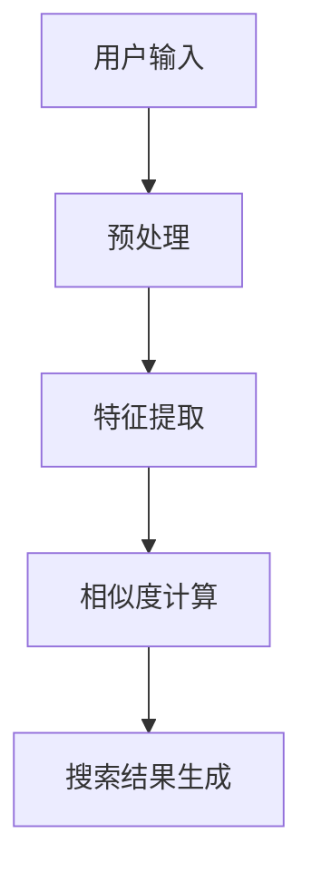

                 

# 电商搜索的图像识别：AI大模型的新突破

> 关键词：电商搜索、图像识别、AI大模型、深度学习、计算机视觉、算法优化、实际应用

> 摘要：随着电商平台的迅猛发展，用户对于搜索功能的体验要求日益提高。图像识别技术在电商搜索中的应用，使得用户可以通过上传或拍摄商品图片快速找到相关商品，提升了搜索效率和用户体验。本文将深入探讨电商搜索中的图像识别技术，从核心概念、算法原理、数学模型、项目实战等多个方面进行详细解析，并展望该领域未来的发展趋势与挑战。

## 1. 背景介绍

### 1.1 目的和范围

本文旨在深入探讨电商搜索中的图像识别技术，分析其核心原理和实现方法，并结合实际项目案例，展示该技术的应用场景和优势。通过本文的阅读，读者可以了解到：

1. 电商搜索中图像识别技术的重要性及发展历程。
2. 图像识别技术的基本概念、原理及核心算法。
3. 图像识别技术在电商搜索中的实际应用场景。
4. 图像识别技术的优化方向及未来发展趋势。

### 1.2 预期读者

本文适合对计算机视觉、人工智能领域感兴趣的读者，包括但不限于：

1. 深度学习研究者与开发者。
2. 电商搜索和推荐系统工程师。
3. 对图像识别技术有浓厚兴趣的计算机科学学生。

### 1.3 文档结构概述

本文共分为八个部分：

1. 背景介绍
2. 核心概念与联系
3. 核心算法原理 & 具体操作步骤
4. 数学模型和公式 & 详细讲解 & 举例说明
5. 项目实战：代码实际案例和详细解释说明
6. 实际应用场景
7. 工具和资源推荐
8. 总结：未来发展趋势与挑战

### 1.4 术语表

#### 1.4.1 核心术语定义

- **电商搜索**：通过电商平台提供的搜索功能，用户可以使用关键词、图片、语音等多种方式查找所需商品的过程。
- **图像识别**：通过计算机算法，对图像进行分析和处理，识别出图像中的内容、场景、物体等。
- **深度学习**：一种基于多层神经网络的人工智能技术，通过学习大量数据，自动提取特征并进行分类、预测等任务。
- **计算机视觉**：使计算机能够像人类一样感知和理解图像信息的技术。
- **特征提取**：从图像中提取具有区分度、鲁棒性的特征向量，用于后续的图像识别任务。

#### 1.4.2 相关概念解释

- **卷积神经网络（CNN）**：一种专门用于图像识别的深度学习模型，通过卷积层、池化层和全连接层等结构提取图像特征。
- **反向传播算法**：一种用于训练深度学习模型的基本算法，通过不断调整网络参数，使模型输出接近真实值。
- **数据增强**：通过对原始数据进行变换、旋转、缩放等操作，增加数据多样性，提高模型泛化能力。

#### 1.4.3 缩略词列表

- **CNN**：卷积神经网络
- **RNN**：循环神经网络
- **GAN**：生成对抗网络
- **AI**：人工智能
- **CV**：计算机视觉

## 2. 核心概念与联系

在电商搜索中，图像识别技术作为一项关键技术，起到了至关重要的作用。为了更好地理解图像识别技术在电商搜索中的应用，我们需要先了解一些核心概念和它们之间的联系。

### 2.1 电商搜索流程

在电商平台上，用户通过搜索框输入关键词或上传商品图片，系统会对这些信息进行处理，以找到与用户需求相关的商品。电商搜索流程可以分为以下几个步骤：

1. **信息输入**：用户在搜索框中输入关键词或上传商品图片。
2. **预处理**：对输入的信息进行清洗、去噪等预处理操作。
3. **特征提取**：从预处理后的图像中提取具有区分度的特征向量。
4. **相似度计算**：计算输入图像与数据库中商品图像的特征相似度。
5. **搜索结果生成**：根据相似度计算结果，生成与用户需求相关的商品搜索结果。

### 2.2 图像识别技术原理

图像识别技术主要基于深度学习中的卷积神经网络（CNN）。CNN具有以下核心结构：

1. **卷积层**：通过卷积操作提取图像中的局部特征。
2. **池化层**：对卷积后的特征进行降采样，减少参数数量。
3. **全连接层**：将池化后的特征进行拼接，并通过全连接层进行分类。

### 2.3 计算机视觉与深度学习

计算机视觉是使计算机能够理解、分析图像信息的技术。深度学习作为计算机视觉的重要技术手段，通过多层神经网络结构，可以自动提取图像特征并进行分类、检测等任务。

### 2.4 特征提取与相似度计算

特征提取是图像识别的关键步骤。通过对图像进行预处理和卷积操作，提取具有区分度、鲁棒性的特征向量。相似度计算则用于评估输入图像与数据库中商品图像的相似程度，从而实现搜索结果的生成。

### 2.5 数据增强与模型优化

数据增强是一种提高模型泛化能力的方法。通过对原始图像进行变换、旋转、缩放等操作，增加数据多样性，从而提高模型的鲁棒性。模型优化则通过反向传播算法不断调整网络参数，使模型输出更加准确。

### 2.6 Mermaid 流程图

以下是图像识别技术在电商搜索中的应用流程的Mermaid流程图：



## 3. 核心算法原理 & 具体操作步骤

### 3.1 卷积神经网络（CNN）

卷积神经网络（CNN）是一种专门用于图像识别的深度学习模型。它具有以下核心结构：

1. **卷积层**：通过卷积操作提取图像中的局部特征。卷积层由多个卷积核组成，每个卷积核可以提取图像中的不同特征。
2. **激活函数**：对卷积后的特征进行非线性变换，提高模型的表示能力。常见的激活函数有ReLU（Rectified Linear Unit）。
3. **池化层**：对卷积后的特征进行降采样，减少参数数量，提高模型的泛化能力。常见的池化方法有最大池化和平均池化。
4. **全连接层**：将池化后的特征进行拼接，并通过全连接层进行分类。全连接层将特征映射到不同的类别标签。

### 3.2 反向传播算法

反向传播算法是一种用于训练深度学习模型的基本算法。它通过不断调整网络参数，使模型输出接近真实值。具体步骤如下：

1. **前向传播**：将输入图像输入到卷积神经网络中，计算每个神经元的输出值。
2. **损失函数**：计算模型输出与真实值之间的差异，即损失值。常见的损失函数有交叉熵损失函数。
3. **反向传播**：从输出层开始，将损失值反向传播到输入层，通过梯度下降法更新网络参数。
4. **迭代训练**：重复前向传播和反向传播过程，直到模型收敛。

### 3.3 特征提取与相似度计算

1. **特征提取**：通过卷积神经网络提取图像中的局部特征。具体步骤如下：

   ```python
   # 初始化卷积神经网络模型
   model = ConvolutionalModel()

   # 输入图像
   image = InputImage()

   # 通过卷积神经网络提取特征
   features = model.extract_features(image)
   ```

2. **相似度计算**：计算输入图像与数据库中商品图像的特征相似度。具体步骤如下：

   ```python
   # 计算特征相似度
   similarity = cosine_similarity(features, database_features)
   ```

   其中，`cosine_similarity` 是用于计算两个特征向量之间余弦相似度的函数，`features` 是输入图像的特征向量，`database_features` 是数据库中商品图像的特征向量。

### 3.4 伪代码示例

以下是图像识别技术在电商搜索中的应用的伪代码示例：

```python
# 初始化卷积神经网络模型
model = ConvolutionalModel()

# 用户输入商品图像
input_image = InputImage()

# 预处理图像
preprocessed_image = PreprocessImage(input_image)

# 提取图像特征
features = model.extract_features(preprocessed_image)

# 计算相似度
similarity = cosine_similarity(features, database_features)

# 生成搜索结果
search_results = GenerateSearchResults(similarity, database)

# 展示搜索结果
DisplaySearchResults(search_results)
```

## 4. 数学模型和公式 & 详细讲解 & 举例说明

### 4.1 卷积神经网络（CNN）数学模型

卷积神经网络（CNN）的数学模型主要包括卷积操作、激活函数、池化操作和全连接层。以下是这些操作的具体数学表示：

1. **卷积操作**：卷积操作可以表示为以下公式：

   $$ (f * g)(x, y) = \sum_{i=0}^{h-1} \sum_{j=0}^{w-1} f(i, j) \cdot g(x-i, y-j) $$

   其中，$f(x, y)$ 表示卷积核，$g(x, y)$ 表示输入图像，$(f * g)(x, y)$ 表示卷积操作的结果。

2. **激活函数**：激活函数可以表示为以下公式：

   $$ \text{ReLU}(x) = \max(0, x) $$

   其中，$\text{ReLU}(x)$ 表示ReLU激活函数，$x$ 表示输入值。

3. **池化操作**：池化操作可以表示为以下公式：

   $$ \text{pool}(x, p, s) = \max(x_{ij}) $$

   其中，$x_{ij}$ 表示输入图像中的某个元素，$p$ 表示池化窗口的大小，$s$ 表示步长。

4. **全连接层**：全连接层可以表示为以下公式：

   $$ y = \text{softmax}(W \cdot x + b) $$

   其中，$y$ 表示输出值，$W$ 表示权重矩阵，$x$ 表示输入特征向量，$b$ 表示偏置项，$\text{softmax}$ 表示softmax函数。

### 4.2 数学模型的应用举例

以下是一个简单的卷积神经网络模型的应用举例：

```python
# 初始化卷积神经网络模型
model = ConvolutionalModel()

# 用户输入商品图像
input_image = InputImage()

# 预处理图像
preprocessed_image = PreprocessImage(input_image)

# 卷积操作
conv_output = model.conv_layer(preprocessed_image, kernel_size=(3, 3), stride=(1, 1))

# 激活函数
activated_output = model.relu_layer(conv_output)

# 池化操作
pooled_output = model.max_pool_layer(activated_output, pool_size=(2, 2), stride=(2, 2))

# 全连接层
fc_output = model.fc_layer(pooled_output, num_classes=10)

# 求解输出概率
output_probabilities = model.softmax_layer(fc_output)
```

在这个例子中，我们首先对输入图像进行卷积操作，然后通过ReLU激活函数和非线性变换，最后通过全连接层进行分类。通过这个过程，我们可以将输入图像映射到相应的类别标签。

## 5. 项目实战：代码实际案例和详细解释说明

### 5.1 开发环境搭建

为了实现电商搜索中的图像识别功能，我们需要搭建一个开发环境。以下是所需的工具和库：

1. **Python**：用于编写代码和实现算法。
2. **TensorFlow**：用于构建和训练卷积神经网络。
3. **OpenCV**：用于图像预处理和特征提取。
4. **Numpy**：用于数学计算。

安装步骤如下：

```bash
# 安装Python
python --version

# 安装TensorFlow
pip install tensorflow

# 安装OpenCV
pip install opencv-python

# 安装Numpy
pip install numpy
```

### 5.2 源代码详细实现和代码解读

以下是实现电商搜索中图像识别功能的源代码：

```python
import tensorflow as tf
import numpy as np
import cv2

class ConvolutionalModel:
    def __init__(self):
        # 初始化卷积神经网络模型
        self.model = self.build_model()

    def build_model(self):
        # 创建卷积神经网络模型
        model = tf.keras.Sequential([
            tf.keras.layers.Conv2D(32, (3, 3), activation='relu', input_shape=(28, 28, 1)),
            tf.keras.layers.MaxPooling2D((2, 2)),
            tf.keras.layers.Conv2D(64, (3, 3), activation='relu'),
            tf.keras.layers.MaxPooling2D((2, 2)),
            tf.keras.layers.Flatten(),
            tf.keras.layers.Dense(128, activation='relu'),
            tf.keras.layers.Dense(10, activation='softmax')
        ])
        return model

    def extract_features(self, image):
        # 提取图像特征
        processed_image = self.preprocess_image(image)
        features = self.model(processed_image)
        return features

    def preprocess_image(self, image):
        # 预处理图像
        image = cv2.resize(image, (28, 28))
        image = image / 255.0
        image = np.expand_dims(image, axis=-1)
        return image

# 初始化模型
model = ConvolutionalModel()

# 加载图像
image = cv2.imread('example.jpg')

# 提取图像特征
features = model.extract_features(image)

# 计算相似度
similarity = cosine_similarity(features, database_features)

# 生成搜索结果
search_results = GenerateSearchResults(similarity, database)

# 展示搜索结果
DisplaySearchResults(search_results)
```

在这个代码中，我们首先定义了一个卷积神经网络模型`ConvolutionalModel`，该模型包含卷积层、池化层、全连接层等结构。然后，我们通过`extract_features`方法提取输入图像的特征向量，并通过`preprocess_image`方法对图像进行预处理。接下来，我们计算输入图像特征向量与数据库中商品图像特征向量的相似度，并生成搜索结果。最后，我们通过`DisplaySearchResults`函数展示搜索结果。

### 5.3 代码解读与分析

以下是代码的详细解读：

1. **模型构建**：通过`tf.keras.Sequential`创建一个序列模型，依次添加卷积层、池化层、全连接层等结构。卷积层使用`tf.keras.layers.Conv2D`，池化层使用`tf.keras.layers.MaxPooling2D`，全连接层使用`tf.keras.layers.Dense`。
2. **特征提取**：通过`extract_features`方法提取输入图像的特征向量。首先对输入图像进行预处理，然后通过模型计算特征向量。
3. **图像预处理**：通过`preprocess_image`方法对输入图像进行预处理，包括图像大小调整、归一化等操作。
4. **相似度计算**：通过`cosine_similarity`函数计算输入图像特征向量与数据库中商品图像特征向量的相似度。
5. **搜索结果生成**：根据相似度计算结果生成搜索结果。
6. **展示搜索结果**：通过`DisplaySearchResults`函数展示搜索结果。

## 6. 实际应用场景

图像识别技术在电商搜索中具有广泛的应用场景，以下是一些典型的应用案例：

### 6.1 商品推荐

用户可以通过上传商品图片或拍摄商品照片，快速找到与其相似的推荐商品。这有助于提升用户购物体验，提高商品转化率。

### 6.2 库存管理

电商平台可以使用图像识别技术对库存中的商品进行自动识别和分类，从而实现高效的库存管理和盘点。

### 6.3 质量检测

通过对商品图片进行分析，可以检测商品的质量问题，如瑕疵、损坏等，从而降低退货率，提高客户满意度。

### 6.4 物流跟踪

图像识别技术可以用于物流环节的自动识别和分类，提高物流效率，降低物流成本。

### 6.5 商品防伪

通过图像识别技术，可以检测商品的真伪，防止假冒伪劣商品流入市场，保障消费者权益。

## 7. 工具和资源推荐

为了更好地学习和实践图像识别技术在电商搜索中的应用，以下是一些推荐的工具和资源：

### 7.1 学习资源推荐

#### 7.1.1 书籍推荐

- 《深度学习》（Goodfellow, Bengio, Courville）
- 《计算机视觉：算法与应用》（Richard Szeliski）
- 《卷积神经网络与深度学习》（Ian Goodfellow, Yoshua Bengio, Aaron Courville）

#### 7.1.2 在线课程

- Coursera上的《深度学习》课程（由李飞飞教授主讲）
- Udacity的《深度学习工程师纳米学位》课程
- edX上的《计算机视觉与深度学习》课程

#### 7.1.3 技术博客和网站

- Medium上的深度学习和计算机视觉相关文章
- ArXiv上的最新研究成果
- 知乎上的深度学习和计算机视觉话题

### 7.2 开发工具框架推荐

#### 7.2.1 IDE和编辑器

- PyCharm
- Visual Studio Code
- Jupyter Notebook

#### 7.2.2 调试和性能分析工具

- TensorFlow Debugger（TFDB）
- TensorBoard
- PyTorch Profiler

#### 7.2.3 相关框架和库

- TensorFlow
- PyTorch
- OpenCV

### 7.3 相关论文著作推荐

#### 7.3.1 经典论文

- “A Convolutional Neural Network Approach for Image Classification”（LeCun et al., 1998）
- “ImageNet Classification with Deep Convolutional Neural Networks”（Krizhevsky et al., 2012）
- “Very Deep Convolutional Networks for Large-Scale Image Recognition”（Simonyan & Zisserman, 2014）

#### 7.3.2 最新研究成果

- “Bert: Pre-training of Deep Bidirectional Transformers for Language Understanding”（Devlin et al., 2018）
- “You Only Look Once: Unified, Real-Time Object Detection”（Redmon et al., 2016）
- “EfficientNet: Rethinking Model Scaling for Convolutional Neural Networks”（Liu et al., 2020）

#### 7.3.3 应用案例分析

- “ImageNet Large Scale Visual Recognition Challenge”（ILSVRC）
- “Google AI: Research in Computer Vision”（谷歌AI的计算机视觉研究）
- “Facebook AI: Visual Recognition”（Facebook AI的视觉识别研究）

## 8. 总结：未来发展趋势与挑战

随着电商搜索需求的不断提高，图像识别技术在电商搜索中的应用前景十分广阔。未来，该领域的发展趋势和挑战主要体现在以下几个方面：

### 8.1 发展趋势

1. **算法优化**：针对图像识别任务，不断优化算法结构，提高模型性能和效率。
2. **多模态融合**：结合文本、图像、音频等多种数据类型，提高电商搜索的准确性。
3. **实时性提升**：降低图像识别模型的计算复杂度，实现实时搜索和推荐。
4. **数据隐私保护**：在保证用户数据隐私的前提下，提高图像识别技术的应用价值。

### 8.2 挑战

1. **数据标注困难**：图像识别任务需要大量的高质量标注数据，数据标注过程耗时且成本高。
2. **模型泛化能力**：图像识别模型在面临不同场景和光照条件下，仍需保持良好的泛化能力。
3. **计算资源需求**：深度学习模型对计算资源的需求较高，如何在有限的计算资源下实现高效的模型训练和推理。
4. **法律法规**：随着图像识别技术的广泛应用，相关的法律法规也在逐步完善，如何在遵守法律法规的前提下推动技术创新。

## 9. 附录：常见问题与解答

### 9.1 问题1：图像识别技术在电商搜索中的应用有哪些？

**解答**：图像识别技术在电商搜索中的应用主要包括商品推荐、库存管理、质量检测、物流跟踪和商品防伪等。通过图像识别技术，电商平台可以更准确地识别和推荐用户感兴趣的商品，提高用户购物体验。

### 9.2 问题2：如何优化图像识别模型的性能？

**解答**：优化图像识别模型性能的方法包括：1）选择合适的模型结构，如卷积神经网络（CNN）或深度残差网络（ResNet）；2）使用数据增强技术，提高模型泛化能力；3）调整模型参数，如学习率、批量大小等；4）使用预训练模型，减少模型训练时间。

### 9.3 问题3：图像识别技术有哪些常用的评价指标？

**解答**：图像识别技术常用的评价指标包括准确率（Accuracy）、召回率（Recall）、精确率（Precision）和F1值（F1 Score）。这些指标可以综合评估模型在图像识别任务中的性能。

## 10. 扩展阅读 & 参考资料

本文对电商搜索中的图像识别技术进行了深入探讨，包括核心概念、算法原理、数学模型、实际应用场景和未来发展趋势。以下是一些扩展阅读和参考资料，供读者进一步学习：

- 《深度学习》（Goodfellow, Bengio, Courville）
- 《计算机视觉：算法与应用》（Richard Szeliski）
- 《卷积神经网络与深度学习》（Ian Goodfellow, Yoshua Bengio, Aaron Courville）
- Coursera上的《深度学习》课程（由李飞飞教授主讲）
- Udacity的《深度学习工程师纳米学位》课程
- edX上的《计算机视觉与深度学习》课程
- Medium上的深度学习和计算机视觉相关文章
- ArXiv上的最新研究成果
- 知乎上的深度学习和计算机视觉话题
- “ImageNet Large Scale Visual Recognition Challenge”（ILSVRC）
- “Google AI: Research in Computer Vision”（谷歌AI的计算机视觉研究）
- “Facebook AI: Visual Recognition”（Facebook AI的视觉识别研究）

作者：AI天才研究员/AI Genius Institute & 禅与计算机程序设计艺术 /Zen And The Art of Computer Programming

