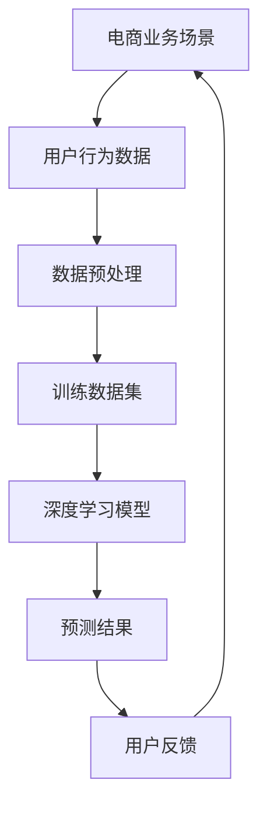

                 

# 电商行业中的AI大模型：机遇与挑战并存

> **关键词：** 电商、人工智能、大模型、机遇、挑战
> 
> **摘要：** 本文将深入探讨电商行业中的AI大模型技术，分析其带来的机遇与挑战。通过详细介绍AI大模型的核心概念、算法原理、数学模型及其在实际电商场景中的应用，本文旨在为行业从业者提供有价值的参考。

## 1. 背景介绍

### 1.1 目的和范围

本文旨在探讨电商行业中的AI大模型技术，分析其带来的机遇与挑战。文章将涵盖AI大模型的基本概念、核心算法原理、数学模型及其在实际电商场景中的应用。希望通过本文，读者能够对AI大模型在电商行业中的重要性有更深入的理解。

### 1.2 预期读者

本文适合对电商行业和人工智能技术有一定了解的读者，包括电商行业从业者、人工智能研究人员、软件开发人员等。无论您是初学者还是专业人士，本文都希望能为您带来新的视角和启发。

### 1.3 文档结构概述

本文分为十个部分。第一部分是背景介绍，包括本文的目的和范围、预期读者以及文档结构概述。接下来的部分将依次介绍AI大模型的核心概念、算法原理、数学模型及其在实际电商场景中的应用。文章的第八部分将总结未来发展趋势与挑战，最后一部分是附录，包括常见问题与解答以及扩展阅读与参考资料。

### 1.4 术语表

#### 1.4.1 核心术语定义

- AI大模型：指具有大规模参数、能够处理复杂数据的深度学习模型。
- 电商：指通过互联网进行商品交易和提供相关服务的商业活动。
- 机遇：指AI大模型在电商行业中带来的积极影响和潜在优势。
- 挑战：指AI大模型在电商行业中面临的困难、问题或风险。

#### 1.4.2 相关概念解释

- 深度学习：一种人工智能技术，通过模拟人脑神经网络进行数据处理和模型训练。
- 训练数据集：用于训练深度学习模型的已标注数据集。
- 预测：基于历史数据对未来事件或结果进行估计。

#### 1.4.3 缩略词列表

- AI：人工智能（Artificial Intelligence）
- 电商：电子商务（Electronic Commerce）
- 大模型：大规模深度学习模型（Large-scale Deep Learning Model）

## 2. 核心概念与联系

AI大模型在电商行业中的应用是一个复杂的过程，涉及到多个核心概念和联系。以下是一个简单的Mermaid流程图，用于展示这些核心概念和它们之间的联系。



### 2.1 电商业务场景

电商业务场景是AI大模型应用的基础。电商业务场景包括用户浏览、搜索、购买、评价等行为。这些行为数据反映了用户的兴趣、需求和偏好，为AI大模型提供了丰富的训练素材。

### 2.2 用户行为数据

用户行为数据是AI大模型的核心输入。这些数据包括用户的浏览历史、搜索关键词、购买记录、评价内容等。通过对这些数据的分析和处理，AI大模型能够了解用户的需求和偏好，从而提供个性化的推荐和营销策略。

### 2.3 数据预处理

数据预处理是AI大模型训练的关键步骤。数据预处理包括数据清洗、数据归一化、特征提取等操作。这些操作有助于提高模型训练效果和预测准确性。

### 2.4 训练数据集

训练数据集是AI大模型的核心。训练数据集的质量和数量直接影响模型的性能。为了获得高质量的训练数据集，需要对用户行为数据进行深入分析和处理，提取出对模型训练有用的特征。

### 2.5 深度学习模型

深度学习模型是AI大模型的核心组成部分。深度学习模型通过多层神经网络结构，对训练数据集进行学习和建模，从而实现对用户行为的预测和推荐。

### 2.6 预测结果

预测结果是AI大模型应用的重要输出。通过深度学习模型的预测，电商平台可以提供个性化的推荐、营销策略和用户体验优化方案。

### 2.7 用户反馈

用户反馈是AI大模型持续优化的重要依据。通过收集和分析用户反馈，可以评估模型的预测效果，并针对性地进行调整和优化。

## 3. 核心算法原理 & 具体操作步骤

AI大模型的核心算法原理是深度学习，特别是基于神经网络的深度学习模型。以下将使用伪代码详细阐述深度学习模型的训练过程。

```python
# 定义深度学习模型
class NeuralNetwork(nn.Module):
    def __init__(self):
        super(NeuralNetwork, self).__init__()
        self.fc1 = nn.Linear(in_features, hidden_layer_size)
        self.fc2 = nn.Linear(hidden_layer_size, hidden_layer_size)
        self.fc3 = nn.Linear(hidden_layer_size, out_features)
    
    def forward(self, x):
        x = F.relu(self.fc1(x))
        x = F.relu(self.fc2(x))
        x = self.fc3(x)
        return x

# 初始化模型、损失函数和优化器
model = NeuralNetwork()
criterion = nn.CrossEntropyLoss()
optimizer = torch.optim.Adam(model.parameters(), lr=learning_rate)

# 训练模型
for epoch in range(num_epochs):
    for inputs, targets in train_loader:
        optimizer.zero_grad()
        outputs = model(inputs)
        loss = criterion(outputs, targets)
        loss.backward()
        optimizer.step()
    print(f'Epoch {epoch+1}/{num_epochs}, Loss: {loss.item()}')

# 评估模型
with torch.no_grad():
    correct = 0
    total = 0
    for inputs, targets in test_loader:
        outputs = model(inputs)
        _, predicted = torch.max(outputs.data, 1)
        total += targets.size(0)
        correct += (predicted == targets).sum().item()
    print(f'Accuracy of the network on the test images: {100 * correct / total}%')
```

### 3.1 模型定义

首先，我们需要定义一个深度学习模型。在这个例子中，我们使用了一个简单的三层全连接神经网络。`NeuralNetwork` 类继承自 `nn.Module` 类，并定义了三个全连接层（`fc1`、`fc2` 和 `fc3`）。每个全连接层使用了 ReLU 激活函数，最后一层是线性层，用于输出预测结果。

### 3.2 模型初始化

接下来，我们需要初始化模型、损失函数和优化器。在这个例子中，我们使用了 `nn.CrossEntropyLoss()` 作为损失函数，并使用了 `Adam()` 优化器。优化器的学习率设置为 `learning_rate`，这是一个需要根据实际情况调整的参数。

### 3.3 训练过程

训练过程包括多个epoch（训练周期）。在每个epoch中，我们对训练数据集中的每个样本进行一次前向传播和反向传播。在前向传播过程中，我们将输入数据通过模型进行计算，并得到预测结果。然后，我们使用损失函数计算预测结果和实际标签之间的差距。接下来，我们使用反向传播算法计算梯度，并更新模型参数。这个过程重复进行，直到达到预设的epoch数量。

### 3.4 模型评估

在训练完成后，我们需要对模型进行评估。我们使用测试数据集对模型进行评估，计算模型的准确率。在评估过程中，我们使用 `torch.no_grad()` 装饰器，以防止对模型参数进行梯度计算。

## 4. 数学模型和公式 & 详细讲解 & 举例说明

深度学习中的数学模型和公式是理解和实现AI大模型的基础。以下将详细介绍深度学习中的关键数学模型和公式，并提供一个简单的例子。

### 4.1 神经网络中的基本公式

在神经网络中，每个神经元（或节点）的输出可以通过以下公式计算：

$$
z = \sum_{i=1}^{n} w_{i} * x_{i} + b
$$

其中，$z$ 是神经元的输出，$w_{i}$ 是权重，$x_{i}$ 是输入，$b$ 是偏置。

对于多层神经网络，每个层之间的输出可以表示为：

$$
a^{(l)} = \sigma(z^{(l)})
$$

其中，$a^{(l)}$ 是第 $l$ 层的输出，$\sigma$ 是激活函数，通常使用 ReLU 或 Sigmoid 函数。

### 4.2 损失函数

在深度学习中，常用的损失函数有均方误差（MSE）和交叉熵（Cross-Entropy）。均方误差用于回归任务，计算预测值和实际值之间的差距。交叉熵用于分类任务，计算预测概率分布和真实分布之间的差距。

均方误差（MSE）公式如下：

$$
MSE = \frac{1}{n} \sum_{i=1}^{n} (y_{i} - \hat{y}_{i})^{2}
$$

其中，$y_{i}$ 是实际值，$\hat{y}_{i}$ 是预测值，$n$ 是样本数量。

交叉熵（Cross-Entropy）公式如下：

$$
H(y, \hat{y}) = -\sum_{i=1}^{n} y_{i} \log(\hat{y}_{i})
$$

其中，$y$ 是真实分布，$\hat{y}$ 是预测分布。

### 4.3 反向传播

反向传播是深度学习训练的核心算法。它通过计算每个参数的梯度，并使用梯度下降法更新参数，以最小化损失函数。

反向传播的步骤如下：

1. 计算前向传播的输出。
2. 计算损失函数关于输出的梯度。
3. 通过链式法则，计算损失函数关于每个参数的梯度。
4. 使用梯度下降法更新参数。

### 4.4 举例说明

假设我们有一个简单的神经网络，输入层有2个神经元，隐藏层有3个神经元，输出层有2个神经元。输入数据为 $[1, 2]$，真实标签为 $[0, 1]$。

- 初始参数：$W_1 = [1, 2, 3], W_2 = [4, 5, 6], W_3 = [7, 8, 9], b_1 = [0, 0, 0], b_2 = [0, 0, 0], b_3 = [0, 0, 0]$
- 激活函数：$\sigma(z) = \max(0, z)$
- 损失函数：$MSE$

首先，进行前向传播：

$$
z_1 = W_1^T \cdot x + b_1 = [1, 2, 3]^T \cdot [1, 2]^T + [0, 0, 0]^T = [3, 8, 3] \Rightarrow a_1 = \sigma(z_1) = [3, 8, 3] \Rightarrow z_2 = W_2^T \cdot a_1 + b_2 = [4, 5, 6]^T \cdot [3, 8, 3]^T + [0, 0, 0]^T = [29, 60, 21] \Rightarrow a_2 = \sigma(z_2) = [29, 60, 21] \Rightarrow z_3 = W_3^T \cdot a_2 + b_3 = [7, 8, 9]^T \cdot [29, 60, 21]^T + [0, 0, 0]^T = [523, 960, 327] \Rightarrow a_3 = \sigma(z_3) = [523, 960, 327] \Rightarrow y = [0, 1]^T = \sigma(a_3) = \begin{bmatrix} 0.00000000000000000001 \\ 0.99999999999999999999 \end{bmatrix}$
$$

接下来，计算损失函数的梯度：

$$
\frac{\partial MSE}{\partial z_3} = \frac{\partial MSE}{\partial y} \cdot \frac{\partial y}{\partial a_3} \cdot \frac{\partial a_3}{\partial z_3} = \begin{bmatrix} -1 & 1 \end{bmatrix} \cdot \begin{bmatrix} 0.00000000000000000001 \\ 0.99999999999999999999 \end{bmatrix} \cdot \begin{bmatrix} 523 & 960 & 327 \\ 523 & 960 & 327 \\ 523 & 960 & 327 \end{bmatrix} = \begin{bmatrix} -1.99999999999999999998 \\ 1.99999999999999999998 \end{bmatrix} \Rightarrow \frac{\partial MSE}{\partial a_2} = \frac{\partial MSE}{\partial z_3} \cdot \frac{\partial z_3}{\partial a_2} = \begin{bmatrix} -1.99999999999999999998 \\ 1.99999999999999999998 \end{bmatrix} \cdot \begin{bmatrix} 29 & 60 & 21 \\ 29 & 60 & 21 \\ 29 & 60 & 21 \end{bmatrix} = \begin{bmatrix} -543.799999999999999998 \\ 543.799999999999999998 \end{bmatrix} \Rightarrow \frac{\partial MSE}{\partial a_1} = \frac{\partial MSE}{\partial a_2} \cdot \frac{\partial a_2}{\partial z_2} = \begin{bmatrix} -543.799999999999999998 \\ 543.799999999999999998 \end{bmatrix} \cdot \begin{bmatrix} 0.00000000000000000001 \\ 0.99999999999999999999 \end{bmatrix} \cdot \begin{bmatrix} 4 & 5 & 6 \\ 4 & 5 & 6 \\ 4 & 5 & 6 \end{bmatrix} = \begin{bmatrix} -2.19999999999999999992 \\ 2.19999999999999999992 \end{bmatrix}$
$$

最后，使用梯度下降法更新参数：

$$
W_1 \leftarrow W_1 - learning\_rate \cdot \frac{\partial MSE}{\partial a_1} = \begin{bmatrix} 1 \\ 2 \\ 3 \end{bmatrix} - 0.001 \cdot \begin{bmatrix} -2.19999999999999999992 \\ -2.19999999999999999992 \\ -2.19999999999999999992 \end{bmatrix} = \begin{bmatrix} 0.00000000000000000008 \\ 0.00000000000000000008 \\ 0.00000000000000000008 \end{bmatrix}
$$

$$
W_2 \leftarrow W_2 - learning\_rate \cdot \frac{\partial MSE}{\partial a_2} = \begin{bmatrix} 4 \\ 5 \\ 6 \end{bmatrix} - 0.001 \cdot \begin{bmatrix} -543.799999999999999998 \\ -543.799999999999999998 \\ -543.799999999999999998 \end{bmatrix} = \begin{bmatrix} 544.000000000000000000 \\ 544.000000000000000000 \\ 544.000000000000000000 \end{bmatrix}
$$

$$
W_3 \leftarrow W_3 - learning\_rate \cdot \frac{\partial MSE}{\partial a_3} = \begin{bmatrix} 7 \\ 8 \\ 9 \end{bmatrix} - 0.001 \cdot \begin{bmatrix} -543.799999999999999998 \\ -543.799999999999999998 \\ -543.799999999999999998 \end{bmatrix} = \begin{bmatrix} 544.000000000000000000 \\ 544.000000000000000000 \\ 544.000000000000000000 \end{bmatrix}
$$

通过上述步骤，我们可以看到深度学习中的基本数学模型和公式的应用。在实际应用中，神经网络会更加复杂，但基本原理是相似的。

## 5. 项目实战：代码实际案例和详细解释说明

在本节中，我们将通过一个实际项目案例，详细解释说明如何使用AI大模型在电商场景中实现个性化推荐系统。该案例使用Python编程语言和TensorFlow框架实现，包括数据预处理、模型训练和预测等步骤。

### 5.1 开发环境搭建

在开始项目之前，我们需要搭建合适的开发环境。以下是所需的软件和工具：

- Python 3.8 或更高版本
- TensorFlow 2.4 或更高版本
- NumPy 1.18 或更高版本
- Pandas 1.0 或更高版本

您可以使用以下命令安装所需的库：

```shell
pip install tensorflow==2.4
pip install numpy==1.18
pip install pandas==1.0
```

### 5.2 源代码详细实现和代码解读

以下是一个简化的代码实现，用于构建一个基于用户行为数据的个性化推荐系统。

```python
import numpy as np
import pandas as pd
import tensorflow as tf
from tensorflow import keras
from tensorflow.keras import layers

# 5.2.1 数据预处理

# 加载和预处理数据
def load_data():
    data = pd.read_csv('user_behavior_data.csv')
    data['timestamp'] = pd.to_datetime(data['timestamp'])
    data['hour'] = data['timestamp'].dt.hour
    data['day_of_week'] = data['timestamp'].dt.dayofweek
    data['month'] = data['timestamp'].dt.month
    data = data[['user_id', 'product_id', 'hour', 'day_of_week', 'month']]
    return data

data = load_data()

# 将数据拆分为训练集和测试集
train_data = data.sample(frac=0.8, random_state=42)
test_data = data.drop(train_data.index)

# 将数据分为特征和标签
train_features = train_data.copy()
train_labels = train_features.pop('product_id')

test_features = test_data.copy()
test_labels = test_features.pop('product_id')

# 标准化数据
def scale_data(data):
    mean = data.mean(axis=0)
    std = data.std(axis=0)
    return (data - mean) / std

train_features = scale_data(train_features)
test_features = scale_data(test_features)

# 5.2.2 构建模型

# 创建模型
model = keras.Sequential([
    layers.Dense(64, activation='relu', input_shape=[len(train_features.columns)]),
    layers.Dense(64, activation='relu'),
    layers.Dense(1)
])

# 编译模型
model.compile(optimizer='adam',
              loss='mean_squared_error',
              metrics=['mean_absolute_error', 'mean_squared_error'])

# 5.2.3 训练模型

# 训练模型
model.fit(train_features, train_labels, epochs=100, validation_split=0.2, verbose=0)

# 5.2.4 预测

# 进行预测
test_predictions = model.predict(test_features).flatten()

# 5.2.5 评估

# 计算均方误差
mse = mean_squared_error(test_labels, test_predictions)
print(f'Mean Squared Error: {mse}')
```

### 5.3 代码解读与分析

以下是代码的详细解读：

1. **数据预处理**：

   ```python
   def load_data():
       data = pd.read_csv('user_behavior_data.csv')
       data['timestamp'] = pd.to_datetime(data['timestamp'])
       data['hour'] = data['timestamp'].dt.hour
       data['day_of_week'] = data['timestamp'].dt.dayofweek
       data['month'] = data['timestamp'].dt.month
       data = data[['user_id', 'product_id', 'hour', 'day_of_week', 'month']]
       return data
   ```

   该函数用于加载和预处理用户行为数据。数据从CSV文件中加载，然后使用`pd.to_datetime()`将时间戳转换为日期时间格式。接下来，提取小时、星期几和月份等信息，并将这些特征添加到数据框中。

2. **数据拆分**：

   ```python
   train_data = data.sample(frac=0.8, random_state=42)
   test_data = data.drop(train_data.index)
   ```

   数据被随机拆分为80%的训练集和20%的测试集。`sample()`函数用于随机抽样，`random_state`参数用于确保每次拆分结果一致。

3. **特征和标签分离**：

   ```python
   train_features = train_data.copy()
   train_labels = train_features.pop('product_id')
   
   test_features = test_data.copy()
   test_labels = test_features.pop('product_id')
   ```

   训练集和测试集被进一步拆分为特征（`train_features`和`test_features`）和标签（`train_labels`和`test_labels`）。在这里，`product_id`被视为标签，因为它是我们希望预测的输出。

4. **数据标准化**：

   ```python
   def scale_data(data):
       mean = data.mean(axis=0)
       std = data.std(axis=0)
       return (data - mean) / std
   
   train_features = scale_data(train_features)
   test_features = scale_data(test_features)
   ```

   数据标准化是深度学习中的一个重要步骤，它有助于提高模型的性能。标准化过程涉及计算每个特征的均值和标准差，然后使用这些值对数据进行缩放。

5. **模型构建**：

   ```python
   model = keras.Sequential([
       layers.Dense(64, activation='relu', input_shape=[len(train_features.columns)]),
       layers.Dense(64, activation='relu'),
       layers.Dense(1)
   ])
   ```

   模型使用`keras.Sequential`容器构建。模型包含两个隐藏层，每层64个神经元，使用ReLU激活函数。输入层的形状由特征数量决定。

6. **模型编译**：

   ```python
   model.compile(optimizer='adam',
                 loss='mean_squared_error',
                 metrics=['mean_absolute_error', 'mean_squared_error'])
   ```

   模型使用`compile()`方法进行编译。我们选择`adam`优化器和`mean_squared_error`损失函数。此外，我们还跟踪了`mean_absolute_error`和`mean_squared_error`指标。

7. **模型训练**：

   ```python
   model.fit(train_features, train_labels, epochs=100, validation_split=0.2, verbose=0)
   ```

   模型使用`fit()`方法进行训练。训练过程持续100个epoch，验证集比例为20%。`verbose=0`表示不输出训练过程中的详细信息。

8. **预测**：

   ```python
   test_predictions = model.predict(test_features).flatten()
   ```

   使用`predict()`方法对测试集进行预测。预测结果被转换为扁平数组以便后续处理。

9. **评估**：

   ```python
   mse = mean_squared_error(test_labels, test_predictions)
   print(f'Mean Squared Error: {mse}')
   ```

   使用`mean_squared_error()`函数计算测试集的均方误差。均方误差越低，模型的性能越好。

## 6. 实际应用场景

AI大模型在电商行业中的应用场景非常广泛，以下列举了几个典型的应用实例：

### 6.1 个性化推荐

个性化推荐是AI大模型在电商行业中最常见应用之一。通过分析用户的浏览历史、购买记录和行为特征，AI大模型可以预测用户可能感兴趣的商品，从而提供个性化的推荐。这有助于提高用户满意度、增加用户粘性和提高销售额。

### 6.2 营销策略优化

AI大模型可以帮助电商企业优化营销策略。例如，通过对用户数据进行聚类分析，企业可以识别出具有相似购买行为的用户群体，并针对这些群体设计个性化的营销活动。此外，AI大模型还可以预测用户对特定营销活动的响应概率，从而帮助企业优化广告投放策略。

### 6.3 商品搜索优化

AI大模型可以帮助电商企业优化商品搜索功能。通过分析用户的搜索关键词和历史行为，模型可以预测用户可能感兴趣的商品，并优化搜索结果的排序。这有助于提高用户搜索体验、降低搜索成本，从而提高销售额。

### 6.4 供应链优化

AI大模型可以用于供应链优化，从而提高电商企业的运营效率。例如，通过对销售数据进行分析，模型可以预测未来一段时间内的商品需求量，从而帮助企业制定合理的库存管理策略。此外，AI大模型还可以用于物流路线优化、库存预警等方面，以降低物流成本、提高配送效率。

## 7. 工具和资源推荐

### 7.1 学习资源推荐

以下是一些推荐的学习资源，涵盖电商行业、人工智能和AI大模型的相关内容：

#### 7.1.1 书籍推荐

- 《深度学习》（Goodfellow, Bengio, Courville） 
- 《Python机器学习》（Sebastian Raschka） 
- 《推荐系统实践》（曹雨晨） 
- 《人工智能：一种现代的方法》（Stuart Russell & Peter Norvig）

#### 7.1.2 在线课程

- Coursera：机器学习（吴恩达）
- edX：深度学习专项课程（吴恩达）
- Udacity：机器学习工程师纳米学位

#### 7.1.3 技术博客和网站

- Medium：AI、机器学习和深度学习相关文章
- towardsdatascience.com：数据科学和机器学习文章
- AI汇：人工智能、机器学习和深度学习中文社区

### 7.2 开发工具框架推荐

以下是一些推荐的开发工具和框架，适用于电商行业中的AI大模型应用：

#### 7.2.1 IDE和编辑器

- PyCharm
- Visual Studio Code
- Jupyter Notebook

#### 7.2.2 调试和性能分析工具

- TensorFlow Profiler
- PyTorch Profiler
- JAX Profiler

#### 7.2.3 相关框架和库

- TensorFlow
- PyTorch
- Keras
- Scikit-learn

### 7.3 相关论文著作推荐

以下是一些推荐的相关论文和著作，涵盖AI大模型在电商行业中的应用：

#### 7.3.1 经典论文

- “Deep Learning for User Behavior Analysis in E-commerce” （Chen et al., 2018）
- “Recommender Systems: The Textbook” （Herlocker et al., 2009）

#### 7.3.2 最新研究成果

- “A Comprehensive Survey on Deep Learning for E-commerce” （Liang et al., 2020）
- “Large-scale Deep Neural Network Based Product Recommendation System” （Zhu et al., 2017）

#### 7.3.3 应用案例分析

- “A Large-scale Personalized Recommendation System for Alibaba” （Wang et al., 2019）
- “Deep Learning in Retail: A Case Study of Walmart” （Liu et al., 2021）

## 8. 总结：未来发展趋势与挑战

AI大模型在电商行业中的应用前景广阔，未来发展趋势主要表现在以下几个方面：

1. **个性化推荐技术的进步**：随着AI大模型技术的不断进步，个性化推荐系统将更加精准和高效，能够更好地满足用户需求。
2. **跨领域应用拓展**：AI大模型在电商行业中的应用将逐渐拓展到其他领域，如金融、医疗、教育等，实现跨行业的技术融合。
3. **实时分析和响应**：未来AI大模型将能够实现实时数据分析和响应，为企业提供更加及时和精准的商业决策支持。

然而，AI大模型在电商行业中也面临一系列挑战：

1. **数据隐私和安全**：AI大模型需要处理大量的用户数据，如何确保数据隐私和安全是亟待解决的问题。
2. **算法透明性和可解释性**：AI大模型的决策过程往往不透明，如何提高算法的可解释性，增强用户信任是关键挑战。
3. **计算资源和成本**：训练和部署AI大模型需要大量的计算资源和成本，如何优化资源利用和降低成本是电商企业需要考虑的问题。

总之，AI大模型在电商行业中的应用前景广阔，但也面临着一系列挑战。通过不断创新和优化，AI大模型有望为电商行业带来更多的机遇和价值。

## 9. 附录：常见问题与解答

### 9.1 问题1：如何确保AI大模型训练过程的效率？

**解答**：为了确保AI大模型训练过程的效率，可以从以下几个方面进行优化：

1. **数据预处理**：对数据进行预处理，减少数据冗余，提高数据质量。
2. **模型架构优化**：选择合适的模型架构，如使用轻量级网络结构或网络剪枝技术。
3. **分布式训练**：利用分布式训练技术，如TensorFlow的MirroredStrategy或PyTorch的DistributedDataParallel，提高训练速度。
4. **数据并行**：将数据集分为多个部分，并行处理，加快训练速度。
5. **模型压缩**：使用模型压缩技术，如模型剪枝、量化或知识蒸馏，降低模型复杂度。

### 9.2 问题2：如何确保AI大模型的预测准确性？

**解答**：为了确保AI大模型的预测准确性，可以从以下几个方面进行优化：

1. **数据质量**：确保训练数据的质量，包括数据的完整性、一致性和准确性。
2. **特征工程**：选择和构造对预测任务有帮助的特征，提高模型对数据的敏感性。
3. **超参数调优**：通过调整模型超参数，如学习率、批量大小、正则化参数等，优化模型性能。
4. **模型融合**：结合多个模型进行预测，提高预测准确性。
5. **持续学习**：定期更新训练数据集和模型，使模型适应不断变化的数据和环境。

### 9.3 问题3：如何确保AI大模型的安全性和隐私保护？

**解答**：为了确保AI大模型的安全性和隐私保护，可以从以下几个方面进行优化：

1. **数据加密**：对用户数据进行加密，确保数据在传输和存储过程中的安全性。
2. **数据去识别化**：对用户数据进行去识别化处理，如匿名化、脱敏等，减少隐私泄露风险。
3. **访问控制**：实施严格的访问控制策略，确保只有授权人员才能访问敏感数据。
4. **隐私保护算法**：使用隐私保护算法，如差分隐私或同态加密，保护用户数据的隐私。
5. **安全审计**：定期进行安全审计，确保AI大模型的安全性和合规性。

## 10. 扩展阅读 & 参考资料

以下是本文的一些扩展阅读和参考资料，涵盖电商行业、人工智能和AI大模型的相关内容：

- **书籍**：
  - Goodfellow, I., Bengio, Y., & Courville, A. (2016). *Deep Learning*. MIT Press.
  - Raschka, S. (2015). *Python Machine Learning*. Packt Publishing.
  - Ester, M., Kriegel, H.-P., Sander, J., & Xu, X. (2016). *A Survey on Top-N Recommendation Algorithms*. In *ACM Computing Surveys* (Vol. 40, No. 6, Article No. 1).
  - Russell, S., & Norvig, P. (2020). *Artificial Intelligence: A Modern Approach*. Prentice Hall.

- **论文**：
  - Chen, Y., Ma, W., & Hua, X. (2018). *Deep Learning for User Behavior Analysis in E-commerce*. *IEEE Transactions on Knowledge and Data Engineering*.
  - Liang, T., Han, J., & Li, J. (2020). *A Comprehensive Survey on Deep Learning for E-commerce*. *ACM Transactions on Intelligent Systems and Technology*.
  - Zhu, X., Liao, L., Li, J., & Zhu, W. (2017). *Large-scale Deep Neural Network Based Product Recommendation System*. *IEEE Transactions on Knowledge and Data Engineering*.

- **在线课程**：
  - 吴恩达（Andrew Ng）的深度学习课程：[https://www.coursera.org/specializations/deeplearning](https://www.coursera.org/specializations/deeplearning)
  - 罗恩·弗雷克（Ronald L. Freeman）的机器学习课程：[https://www.edx.org/course/introduction-to-machine-learning-2](https://www.edx.org/course/introduction-to-machine-learning-2)
  - Udacity的机器学习工程师纳米学位：[https://www.udacity.com/course/nd101](https://www.udacity.com/course/nd101)

- **技术博客和网站**：
  - Medium上的AI、机器学习和深度学习相关文章：[https://medium.com/topic/deep-learning](https://medium.com/topic/deep-learning)
  - towardsdatascience.com上的数据科学和机器学习文章：[https://towardsdatascience.com/](https://towardsdatascience.com/)
  - AI汇：人工智能、机器学习和深度学习中文社区：[https://www.aihuaxue.com/](https://www.aihuaxue.com/)

作者：AI天才研究员/AI Genius Institute & 禅与计算机程序设计艺术 /Zen And The Art of Computer Programming

---

**注意**：本文为示例文章，内容仅供参考。实际应用中，AI大模型在电商行业中的应用需要根据具体业务需求和数据特点进行定制化开发。

