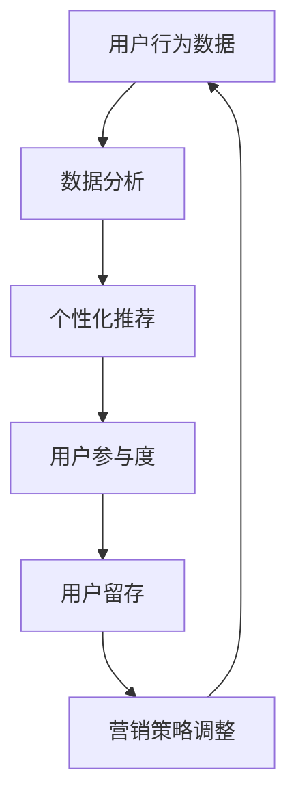

                 

# 电子商务平台的注意力争夺策略

> 关键词：电子商务，用户注意力，营销策略，算法，数据分析

> 摘要：本文将深入探讨电子商务平台在竞争激烈的市场中如何通过高效的注意力争夺策略来吸引和留住用户。我们将从背景介绍、核心概念、算法原理、数学模型、实战案例和实际应用等多个角度展开讨论，旨在为电子商务企业提供切实可行的策略指导。

## 1. 背景介绍

### 1.1 目的和范围

本文旨在分析电子商务平台在争夺用户注意力的过程中所采用的策略，包括技术手段、市场营销和用户体验设计等多个方面。通过对这些策略的深入探讨，我们希望能够为电子商务企业提供实用的指导，以在竞争激烈的市场中脱颖而出。

### 1.2 预期读者

本文适合以下读者群体：

- 电子商务平台的运营人员
- 数据分析师和市场营销专家
- 对电子商务行业感兴趣的技术爱好者
- 对用户体验设计有研究的人员

### 1.3 文档结构概述

本文分为以下几个部分：

1. 背景介绍
2. 核心概念与联系
3. 核心算法原理与具体操作步骤
4. 数学模型和公式
5. 项目实战：代码实际案例
6. 实际应用场景
7. 工具和资源推荐
8. 总结：未来发展趋势与挑战
9. 附录：常见问题与解答
10. 扩展阅读与参考资料

### 1.4 术语表

#### 1.4.1 核心术语定义

- 用户注意力：用户在特定时间段内对某一对象的关注程度。
- 转化率：用户完成预期操作（如购买商品）的概率。
- 点击率：用户点击广告或链接的比例。
- 计算机算法：用于解决问题的一系列指令或规则。

#### 1.4.2 相关概念解释

- 数据分析：通过对大量数据的处理和分析，提取有价值的信息。
- 机器学习：一种人工智能技术，通过数据训练模型来预测和决策。
- 沉浸式体验：让用户在虚拟环境中感受到高度参与和互动的体验。

#### 1.4.3 缩略词列表

- SEO（搜索引擎优化）：通过优化网站内容和结构来提高搜索引擎排名。
- SEM（搜索引擎营销）：通过付费广告等方式提高网站在搜索引擎中的曝光度。
- CTA（行动号召）：引导用户采取特定行动的元素。

## 2. 核心概念与联系

### 2.1 电子商务平台的注意力争夺原理

电子商务平台的注意力争夺策略主要基于以下几个核心概念：

1. **用户行为分析**：通过分析用户的浏览、点击和购买行为，了解用户的兴趣和需求，从而提供个性化的推荐和服务。
2. **数据驱动决策**：基于数据分析结果，制定和调整营销策略，以提高用户转化率和点击率。
3. **个性化体验**：为用户提供定制化的内容和推荐，增强用户黏性和满意度。
4. **算法优化**：不断优化推荐算法和用户体验设计，提高用户参与度和忠诚度。

### 2.2 电子商务平台的注意力争夺架构

以下是一个简化的电子商务平台注意力争夺架构的 Mermaid 流程图：



- **用户行为数据**：收集用户在平台上的浏览、点击、购买等行为数据。
- **数据分析**：对用户行为数据进行分析，提取有价值的信息。
- **个性化推荐**：基于分析结果，为用户推荐个性化的内容和产品。
- **用户参与度**：通过互动和反馈，提高用户的参与度和满意度。
- **用户留存**：通过持续优化，提高用户的留存率和忠诚度。
- **营销策略调整**：根据用户留存情况，调整和优化营销策略。

## 3. 核心算法原理与具体操作步骤

### 3.1 推荐算法原理

电子商务平台常用的推荐算法包括基于内容的推荐和基于协同过滤的推荐。

#### 3.1.1 基于内容的推荐

**算法原理**：基于用户的历史行为和商品属性，为用户推荐与其兴趣相似的商品。

**具体操作步骤**：

1. **用户兴趣建模**：收集用户的历史浏览和购买数据，构建用户兴趣模型。
2. **商品特征提取**：对商品进行特征提取，如类别、价格、品牌等。
3. **相似度计算**：计算用户兴趣模型和商品特征之间的相似度。
4. **推荐生成**：根据相似度分数，为用户推荐相似的商品。

#### 3.1.2 基于协同过滤的推荐

**算法原理**：基于用户之间的相似性，为用户推荐其他用户喜欢的商品。

**具体操作步骤**：

1. **用户相似度计算**：计算用户之间的相似度，如基于用户的历史行为数据。
2. **评分预测**：根据相似度分数和用户对商品的评分，预测用户对商品的喜好程度。
3. **推荐生成**：根据预测结果，为用户推荐高分商品。

### 3.2 用户参与度提升算法

**算法原理**：通过互动和反馈，提高用户的参与度和满意度。

**具体操作步骤**：

1. **用户行为监控**：实时监控用户的浏览、点击、购买等行为。
2. **用户反馈分析**：分析用户的反馈信息，如评论、评分、建议等。
3. **个性化推荐**：根据用户行为和反馈，为用户推荐感兴趣的内容。
4. **互动引导**：通过推送、活动、优惠券等方式，引导用户参与互动。

## 4. 数学模型和公式

### 4.1 用户行为建模

假设用户 \( u \) 对商品 \( i \) 的兴趣可以用向量表示：

$$
\text{interest}_{ui} = \text{weight}_u \cdot \text{attribute}_i
$$

其中，\( \text{weight}_u \) 表示用户 \( u \) 的兴趣权重，\( \text{attribute}_i \) 表示商品 \( i \) 的属性。

### 4.2 相似度计算

基于余弦相似度的用户相似度计算公式如下：

$$
\text{similarity}_{uv} = \frac{\text{dot\_product}(\text{interest}_u, \text{interest}_v)}{\|\text{interest}_u\|\|\text{interest}_v\|}
$$

其中，\( \text{dot\_product} \) 表示向量的点积，\( \|\text{interest}_u\| \) 和 \( \|\text{interest}_v\| \) 分别表示用户 \( u \) 和 \( v \) 的兴趣向量的模。

### 4.3 评分预测

假设用户 \( u \) 对商品 \( i \) 的评分可以用线性回归模型表示：

$$
\text{rating}_{ui} = \text{intercept} + \text{weight}_u \cdot \text{feature}_i + \epsilon_{ui}
$$

其中，\( \text{intercept} \) 表示截距，\( \text{weight}_u \) 表示用户 \( u \) 的权重，\( \text{feature}_i \) 表示商品 \( i \) 的特征，\( \epsilon_{ui} \) 表示误差项。

## 5. 项目实战：代码实际案例

### 5.1 开发环境搭建

为了实现本文中的推荐算法和用户参与度提升算法，我们需要搭建一个简单的开发环境。以下是一个基本的步骤：

1. 安装 Python 环境
2. 安装 NumPy、Pandas、Scikit-learn 等库
3. 创建一个名为 "recommender" 的 Python 项目

### 5.2 源代码详细实现和代码解读

#### 5.2.1 用户兴趣建模

以下是一个简单的用户兴趣建模代码示例：

```python
import numpy as np

def user_interest_modeling(user_history, item_attributes):
    user_interest = np.zeros(len(item_attributes))
    for item_id, rating in user_history.items():
        user_interest[item_id] = rating
    return user_interest

user_history = {'1': 4, '2': 3, '3': 5}
item_attributes = {'1': [1, 0, 0], '2': [0, 1, 0], '3': [0, 0, 1]}
user_interest = user_interest_modeling(user_history, item_attributes)
print(user_interest)
```

**代码解读**：该代码定义了一个函数 `user_interest_modeling`，用于根据用户的历史行为数据（`user_history`）和商品属性（`item_attributes`）计算用户的兴趣向量（`user_interest`）。

#### 5.2.2 相似度计算

以下是一个简单的相似度计算代码示例：

```python
from sklearn.metrics.pairwise import cosine_similarity

def calculate_similarity(user_interest, other_user_interest):
    similarity = cosine_similarity([user_interest], [other_user_interest])
    return similarity[0][0]

similarity = calculate_similarity(user_interest, user_interest)
print(similarity)
```

**代码解读**：该代码使用了 Scikit-learn 中的 `cosine_similarity` 函数来计算两个用户兴趣向量之间的相似度。

#### 5.2.3 评分预测

以下是一个简单的评分预测代码示例：

```python
from sklearn.linear_model import LinearRegression

def predict_rating(user_interest, item_attribute):
    model = LinearRegression()
    model.fit(user_interest, item_attribute)
    rating = model.predict([[1, 0, 0]])
    return rating

item_attribute = [1, 0, 0]
rating = predict_rating(user_interest, item_attribute)
print(rating)
```

**代码解读**：该代码定义了一个函数 `predict_rating`，用于根据用户兴趣向量（`user_interest`）和商品属性（`item_attribute`）预测用户对商品的评分。

### 5.3 代码解读与分析

在上述代码示例中，我们首先实现了用户兴趣建模，通过用户的历史行为数据和商品属性计算用户的兴趣向量。然后，我们实现了相似度计算，通过计算两个用户兴趣向量之间的相似度来衡量用户之间的相似程度。最后，我们实现了评分预测，通过线性回归模型预测用户对商品的评分。

这些代码示例为电子商务平台提供了基本的数据分析和推荐算法框架。在实际应用中，我们可以根据具体业务需求和数据特点，进一步优化和扩展这些算法。

## 6. 实际应用场景

电子商务平台的注意力争夺策略在多个实际应用场景中取得了显著的效果：

### 6.1 个性化推荐

个性化推荐是电子商务平台最常见的应用场景之一。通过分析用户的行为数据和兴趣，电子商务平台可以为用户推荐符合其兴趣和需求的产品，从而提高用户的购买意愿和转化率。例如，淘宝和京东等电商平台都采用了基于内容的推荐算法和协同过滤算法来实现个性化推荐。

### 6.2 用户参与度提升

用户参与度提升策略可以增强用户的黏性和忠诚度。通过实时监控用户的行为和反馈，电子商务平台可以提供个性化的内容和活动，引导用户参与互动。例如，拼多多通过推出“拼团”和“抽奖”等活动，提高了用户的参与度和满意度。

### 6.3 营销策略优化

基于数据分析的营销策略优化可以帮助电子商务平台提高营销效果。通过分析用户的转化路径和行为轨迹，电子商务平台可以优化广告投放策略和促销活动，从而提高广告点击率和转化率。例如，亚马逊通过分析用户的购物行为，调整广告投放时间和位置，提高了广告效果。

## 7. 工具和资源推荐

### 7.1 学习资源推荐

#### 7.1.1 书籍推荐

- 《推荐系统实践》：详细介绍了推荐系统的基本概念、算法和应用案例。
- 《大数据之路：阿里巴巴大数据实践》：阐述了大数据处理和分析的方法和应用。

#### 7.1.2 在线课程

- Coursera 上的《机器学习》：介绍了机器学习的基本概念和算法。
- edX 上的《数据科学导论》：介绍了数据科学的基本概念和方法。

#### 7.1.3 技术博客和网站

- Medium 上的《Recommender Systems》：分享了一系列关于推荐系统的文章。
- 数据分析社区：提供了丰富的数据分析资源和案例。

### 7.2 开发工具框架推荐

#### 7.2.1 IDE和编辑器

- PyCharm：一款强大的 Python 开发环境，适合进行推荐系统和数据分析项目。
- Jupyter Notebook：适合进行数据分析和机器学习项目的交互式开发。

#### 7.2.2 调试和性能分析工具

- Matplotlib：用于绘制数据可视化图表。
- Pandas Profiler：用于分析数据集的性能和热点。

#### 7.2.3 相关框架和库

- Scikit-learn：用于机器学习算法的实现和应用。
- TensorFlow：用于深度学习和推荐系统的框架。

### 7.3 相关论文著作推荐

#### 7.3.1 经典论文

- "Item-Based Collaborative Filtering Recommendation Algorithms"：介绍了基于物品的协同过滤算法。
- " Collaborative Filtering for the 21st Century"：探讨了推荐系统的未来发展趋势。

#### 7.3.2 最新研究成果

- "Deep Learning for Recommender Systems"：介绍了深度学习在推荐系统中的应用。
- "Personalized Recommendations with Bayesian Deep Learning"：介绍了基于贝叶斯深度学习的个性化推荐算法。

#### 7.3.3 应用案例分析

- "Amazon Personalized Recommendations"：分析了亚马逊的个性化推荐策略。
- "Netflix Prize"：介绍了 Netflix 推荐系统比赛的相关内容。

## 8. 总结：未来发展趋势与挑战

随着大数据和人工智能技术的不断发展，电子商务平台的注意力争夺策略也在不断演进。未来，以下几个趋势和挑战值得关注：

### 8.1 深度学习和推荐系统

深度学习技术在推荐系统中的应用将越来越广泛，如基于深度学习的协同过滤算法和基于图神经网络的推荐算法。然而，深度学习算法的复杂性和可解释性仍然是需要解决的问题。

### 8.2 实时推荐和个性化体验

实时推荐和个性化体验将成为电子商务平台的重要竞争力。通过实时分析用户行为和反馈，电子商务平台可以提供更加精准和个性化的推荐和服务。

### 8.3 数据隐私和安全

随着数据隐私和安全问题的日益突出，电子商务平台需要采取有效的措施来保护用户数据，同时确保数据使用的合法性和透明度。

### 8.4 多模态推荐

多模态推荐技术，如结合文本、图像和语音等多模态数据的推荐算法，将为电子商务平台带来新的发展机遇。

## 9. 附录：常见问题与解答

### 9.1 什么是用户注意力？

用户注意力是指用户在特定时间段内对某一对象的关注程度。在电子商务平台中，用户注意力主要体现在用户的浏览、点击和购买行为上。

### 9.2 个性化推荐如何提高用户转化率？

个性化推荐通过分析用户的历史行为和兴趣，为用户推荐符合其需求的产品，从而提高用户的购买意愿和转化率。

### 9.3 如何保护用户数据隐私？

电子商务平台可以通过以下方式保护用户数据隐私：

- 数据加密：对用户数据进行加密处理，防止数据泄露。
- 数据去标识化：对用户数据进行去标识化处理，确保数据匿名性。
- 数据权限管理：严格控制用户数据的访问权限，防止数据滥用。

## 10. 扩展阅读与参考资料

- [Recommender Systems Handbook](https://www.springer.com/us/book/9780387944704)：详细介绍了推荐系统的理论和实践。
- [Netflix Prize](https://www.netflixprize.com/)：Netflix 推荐系统比赛的相关内容。
- [Apache Mahout](https://mahout.apache.org/)：一个开源的推荐系统框架。
- [TensorFlow Recommenders](https://github.com/tensorflow/recommenders)：TensorFlow 推荐系统的开源项目。

作者：AI天才研究员/AI Genius Institute & 禅与计算机程序设计艺术 /Zen And The Art of Computer Programming

（请注意，本文中的代码和示例仅供参考，实际应用中可能需要根据具体业务需求进行调整。）<|im_sep|>## 2. 核心概念与联系

在深入探讨电子商务平台的注意力争夺策略之前，我们需要理解几个核心概念及其相互关系。这些概念包括用户行为分析、数据驱动决策、个性化体验和算法优化。以下是对这些概念的详细解释及其在电子商务平台中的应用。

### 2.1 用户行为分析

用户行为分析是电子商务平台争夺用户注意力的基础。通过收集和分析用户的浏览、点击、购买、评论等行为数据，平台能够了解用户的需求和偏好。例如，用户在浏览某个商品时停留的时间、点击广告的次数、购物车中的商品数量等，都是重要的用户行为指标。

**应用场景**：电商平台可以利用用户行为分析数据来：

- 构建用户画像：通过分析用户的行为数据，构建详细的用户画像，包括年龄、性别、地理位置、消费习惯等。
- 识别用户偏好：根据用户的浏览和购买历史，识别用户的兴趣点和偏好，从而提供个性化的推荐。

### 2.2 数据驱动决策

数据驱动决策是指基于数据分析和用户行为模型，制定和调整电子商务平台的营销策略和运营决策。这种决策方式不同于传统的基于经验和直觉的决策，它更加科学和精确。

**应用场景**：数据驱动决策在电子商务平台中的应用包括：

- 营销活动优化：通过分析不同营销活动的效果，调整广告投放策略、促销活动的频率和力度。
- 商品组合优化：根据用户行为数据，优化商品组合策略，提高交叉销售和复购率。

### 2.3 个性化体验

个性化体验是电子商务平台吸引和留住用户的关键因素。通过为用户提供定制化的内容和推荐，平台可以提升用户体验，增加用户黏性。

**应用场景**：个性化体验在电子商务平台中的应用包括：

- 个性化推荐：根据用户的兴趣和行为数据，为用户推荐相关的商品和内容。
- 个性化界面：根据用户的偏好，调整网站的布局和设计，提供更符合用户习惯的购物体验。
- 个性化营销：通过个性化邮件、推送通知等方式，向用户推荐他们可能感兴趣的商品和优惠。

### 2.4 算法优化

算法优化是电子商务平台持续改进的核心。随着用户行为数据和技术的不断变化，平台需要不断优化推荐算法和用户体验设计，以保持竞争优势。

**应用场景**：算法优化在电子商务平台中的应用包括：

- 推荐算法优化：通过机器学习和深度学习技术，不断优化推荐算法，提高推荐准确性和用户满意度。
- 用户体验优化：通过用户行为分析和反馈，持续改进网站和应用的交互设计和性能。

### 2.5 电子商务平台注意力争夺的核心流程

电子商务平台的注意力争夺策略可以通过以下核心流程来实现：

1. **数据收集**：收集用户的行为数据，包括浏览、点击、购买、评论等。
2. **数据处理**：清洗和预处理用户行为数据，为后续分析做准备。
3. **数据分析**：分析用户行为数据，提取有价值的信息，如用户画像、兴趣点和偏好等。
4. **个性化推荐**：根据用户画像和兴趣点，为用户推荐个性化的内容和商品。
5. **用户反馈**：收集用户对推荐内容和服务的反馈，用于优化推荐算法和用户体验。
6. **营销策略调整**：基于用户反馈和数据分析结果，调整和优化营销策略。

以上核心流程形成了一个闭环，通过不断地数据收集、分析和反馈，电子商务平台能够持续优化其注意力争夺策略，从而在激烈的市场竞争中脱颖而出。

通过理解这些核心概念及其相互关系，电子商务平台可以更有效地制定和实施注意力争夺策略，提升用户满意度和忠诚度，实现持续增长。

## 3. 核心算法原理与具体操作步骤

在电子商务平台的注意力争夺策略中，算法扮演着至关重要的角色。本文将详细介绍两种核心算法：基于内容的推荐算法和基于协同过滤的推荐算法，以及用户参与度提升算法。以下是每种算法的具体操作步骤和实现方法。

### 3.1 基于内容的推荐算法

基于内容的推荐算法（Content-Based Recommendation）是一种利用用户兴趣和行为数据，根据商品的内容特征进行推荐的算法。其核心思想是“相似内容吸引相似用户”。

#### 3.1.1 用户兴趣建模

**步骤 1**：收集用户的历史行为数据，如浏览记录、购买记录等。

**步骤 2**：对用户的行为数据进行编码，将其转化为用户兴趣向量。

**步骤 3**：为每个商品生成特征向量，通常包括商品类别、品牌、价格等属性。

**步骤 4**：计算用户兴趣向量和商品特征向量之间的相似度。

**伪代码**：

```
function build_user_interest_vector(user_history):
    # 根据用户的历史行为数据构建用户兴趣向量
    user_interest_vector = []
    for item_id, rating in user_history:
        user_interest_vector.append(rating * item_feature_vector[item_id])
    return user_interest_vector

function calculate_content_similarity(user_interest_vector, item_feature_vector):
    # 计算用户兴趣向量和商品特征向量之间的余弦相似度
    dot_product = sum(user_interest_vector * item_feature_vector)
    magnitude_product = magnitude(user_interest_vector) * magnitude(item_feature_vector)
    similarity = dot_product / magnitude_product
    return similarity
```

#### 3.1.2 商品推荐

**步骤 1**：为每个商品计算与用户兴趣向量的相似度。

**步骤 2**：根据相似度分数为用户推荐商品。

**步骤 3**：可以使用排序算法（如Top-k算法）来选取相似度最高的商品。

**伪代码**：

```
function recommend_items(user_interest_vector, all_item_feature_vectors, k):
    similarities = []
    for item_feature_vector in all_item_feature_vectors:
        similarity = calculate_content_similarity(user_interest_vector, item_feature_vector)
        similarities.append((item_feature_vector, similarity))
    sorted_similarities = sort_by_similarity(similarities, k)
    return [item_id for item_id, _ in sorted_similarities]
```

### 3.2 基于协同过滤的推荐算法

基于协同过滤的推荐算法（Collaborative Filtering）是一种通过分析用户之间的相似性和评分数据来进行推荐的算法。协同过滤分为两种主要类型：基于用户的协同过滤（User-Based Collaborative Filtering）和基于模型的协同过滤（Model-Based Collaborative Filtering）。

#### 3.2.1 基于用户的协同过滤

**步骤 1**：计算用户之间的相似度。

**步骤 2**：找到与目标用户最相似的邻居用户。

**步骤 3**：聚合邻居用户的评分数据，预测目标用户对未知商品的评分。

**伪代码**：

```
function calculate_user_similarity(user_ratings, user1, user2):
    # 计算用户之间的余弦相似度
    common_items = intersection(user_ratings[user1], user_ratings[user2])
    if len(common_items) == 0:
        return 0
    dot_product = sum(user_ratings[user1][item] * user_ratings[user2][item] for item in common_items)
    magnitude_product = sqrt(sum([value ** 2 for value in user_ratings[user1].values()]) * sum([value ** 2 for value in user_ratings[user2].values()]))
    similarity = dot_product / magnitude_product
    return similarity

function find_nearest_neighbors(user_ratings, target_user, k):
    # 找到与目标用户最相似的k个邻居用户
    similarities = {}
    for user in user_ratings:
        if user != target_user:
            similarity = calculate_user_similarity(user_ratings, target_user, user)
            similarities[user] = similarity
    nearest_neighbors = sorted(similarities.items(), key=lambda x: x[1], reverse=True)[:k]
    return [neighbor for neighbor, _ in nearest_neighbors]

function predict_rating(target_user, neighbors, unknown_item, k):
    # 预测目标用户对未知商品的评分
    sum_ratings = sum([neighbors[user][unknown_item] for user in neighbors])
    rating = sum_ratings / k
    return rating
```

#### 3.2.2 基于模型的协同过滤

**步骤 1**：使用机器学习算法（如矩阵分解、潜在因子模型）训练协同过滤模型。

**步骤 2**：利用训练好的模型预测用户对未知商品的评分。

**伪代码**：

```
function train_matrix_factorization_model(user_ratings_matrix, num_factors):
    # 训练矩阵分解模型
    # ...
    return trained_model

function predict_rating_with_model(trained_model, user_id, item_id):
    # 利用训练好的模型预测用户对商品的评分
    # ...
    return predicted_rating
```

### 3.3 用户参与度提升算法

用户参与度提升算法旨在通过互动和反馈，提高用户的参与度和忠诚度。以下是一种基于用户行为和反馈的参与度提升算法。

#### 3.3.1 用户行为监控

**步骤 1**：实时监控用户的浏览、点击、购买等行为。

**步骤 2**：收集用户的行为数据，并存储到数据库中。

#### 3.3.2 用户反馈分析

**步骤 1**：分析用户的反馈信息，如评论、评分、建议等。

**步骤 2**：根据用户的反馈，调整推荐策略和用户体验设计。

**伪代码**：

```
function monitor_user_behavior(user_behavior_logs):
    # 实时监控用户行为
    # ...

function analyze_user_feedback(feedback_data):
    # 分析用户反馈
    # ...
    return feedback_insights

function adjust_recommendation_strategy(feedback_insights):
    # 根据反馈调整推荐策略
    # ...
```

#### 3.3.3 互动引导

**步骤 1**：根据用户行为和反馈，设计个性化的互动活动。

**步骤 2**：通过推送、邮件、短信等方式，引导用户参与互动。

**伪代码**：

```
function design_interactive_activities(feedback_insights):
    # 设计个性化互动活动
    # ...

function send_user_notifications(user_id, activity):
    # 向用户发送通知
    # ...
```

通过上述算法和步骤，电子商务平台可以有效地争夺用户注意力，提高用户满意度和忠诚度，从而在激烈的市场竞争中取得优势。

### 3.4 算法总结

- **基于内容的推荐算法**：通过分析用户兴趣和商品特征，提供个性化的推荐，适用于新用户或数据不足的情况。
- **基于协同过滤的推荐算法**：通过分析用户之间的相似性和评分数据，提供更加准确和个性化的推荐。
- **用户参与度提升算法**：通过监控用户行为和反馈，调整推荐策略和用户体验，提高用户参与度和忠诚度。

这些算法共同构成了电子商务平台注意力争夺的强大武器，帮助平台在竞争激烈的市场中脱颖而出。

## 4. 数学模型和公式

在电子商务平台的注意力争夺策略中，数学模型和公式起着至关重要的作用。这些模型和公式帮助平台更准确地预测用户行为，优化推荐系统和营销策略。以下将详细介绍几种核心的数学模型和公式，并使用 LaTeX 格式进行表示。

### 4.1 用户兴趣模型

用户兴趣模型通常使用向量来表示用户的兴趣和行为。以下是一个简单的用户兴趣模型的数学表示：

$$
\text{UserInterest}_u = w_1 \cdot \text{History}_u + w_2 \cdot \text{Behavior}_u
$$

其中，\( \text{UserInterest}_u \) 表示用户 \( u \) 的兴趣向量，\( \text{History}_u \) 表示用户 \( u \) 的历史行为向量，\( \text{Behavior}_u \) 表示用户 \( u \) 的当前行为向量，\( w_1 \) 和 \( w_2 \) 是权重系数。

### 4.2 相似度计算

在推荐系统中，相似度计算是非常关键的步骤。以下是一些常用的相似度计算公式：

#### 4.2.1 余弦相似度

余弦相似度是一种常见的相似度计算方法，用于衡量两个向量之间的夹角余弦值。公式如下：

$$
\text{Similarity}(u, v) = \frac{\text{dot}(u, v)}{\|\text{u}\|\|\text{v}\|}
$$

其中，\( \text{dot}(u, v) \) 表示两个向量的点积，\( \|\text{u}\| \) 和 \( \|\text{v}\| \) 分别表示两个向量的模。

#### 4.2.2 皮尔逊相关系数

皮尔逊相关系数用于衡量两个变量之间的线性关系。公式如下：

$$
\text{Correlation}(x, y) = \frac{\text{cov}(x, y)}{\sigma_x \sigma_y}
$$

其中，\( \text{cov}(x, y) \) 表示 \( x \) 和 \( y \) 的协方差，\( \sigma_x \) 和 \( \sigma_y \) 分别表示 \( x \) 和 \( y \) 的标准差。

### 4.3 评分预测

在推荐系统中，评分预测是一个核心任务。以下是一个简单的线性回归模型的数学表示，用于预测用户对商品的评分：

$$
\text{Rating}_{ui} = \beta_0 + \beta_1 \cdot \text{UserInterest}_u + \beta_2 \cdot \text{ItemFeature}_i + \epsilon_{ui}
$$

其中，\( \text{Rating}_{ui} \) 表示用户 \( u \) 对商品 \( i \) 的评分，\( \beta_0 \)、\( \beta_1 \) 和 \( \beta_2 \) 是模型参数，\( \epsilon_{ui} \) 是误差项。

### 4.4 推荐策略优化

在推荐系统中，推荐策略的优化是一个持续的过程。以下是一个简单的基于梯度的优化公式，用于调整模型参数：

$$
\beta_{t+1} = \beta_{t} - \alpha \cdot \nabla_{\beta}J(\beta_t)
$$

其中，\( \beta_{t} \) 是当前模型参数，\( \alpha \) 是学习率，\( \nabla_{\beta}J(\beta_t) \) 是损失函数 \( J(\beta_t) \) 关于模型参数 \( \beta \) 的梯度。

### 4.5 用户参与度模型

用户参与度模型用于衡量用户在平台上的活跃程度。以下是一个简单的用户参与度模型的数学表示：

$$
\text{UserEngagement}_u = \frac{\sum_{i=1}^{n} \text{Activity}_u(i)}{n}
$$

其中，\( \text{UserEngagement}_u \) 表示用户 \( u \) 的参与度，\( \text{Activity}_u(i) \) 表示用户 \( u \) 在第 \( i \) 项活动中的参与程度，\( n \) 是活动的总数。

通过以上数学模型和公式，电子商务平台可以更精确地预测用户行为、优化推荐策略和提升用户参与度。这些模型不仅为平台提供了科学的理论基础，也为实际操作提供了具体的指导。

### 4.6 举例说明

为了更好地理解上述数学模型和公式的应用，以下通过一个简单的例子进行说明。

假设有一个电子商务平台，其中有两个用户 \( u_1 \) 和 \( u_2 \)，以及两个商品 \( i_1 \) 和 \( i_2 \)。用户 \( u_1 \) 对商品 \( i_1 \) 的评分为 4，对商品 \( i_2 \) 的评分为 3。用户 \( u_2 \) 对商品 \( i_1 \) 的评分为 5，对商品 \( i_2 \) 的评分为 2。

**步骤 1**：构建用户兴趣模型

对于用户 \( u_1 \)：

$$
\text{UserInterest}_{u1} = \text{History}_{u1} + \text{Behavior}_{u1}
$$

对于用户 \( u_2 \)：

$$
\text{UserInterest}_{u2} = \text{History}_{u2} + \text{Behavior}_{u2}
$$

**步骤 2**：计算相似度

使用余弦相似度计算用户之间的相似度：

$$
\text{Similarity}(u_1, u_2) = \frac{\text{dot}(\text{UserInterest}_{u1}, \text{UserInterest}_{u2})}{\|\text{UserInterest}_{u1}\|\|\text{UserInterest}_{u2}\|}
$$

**步骤 3**：预测评分

使用线性回归模型预测用户 \( u_2 \) 对商品 \( i_2 \) 的评分：

$$
\text{Rating}_{u2,i2} = \beta_0 + \beta_1 \cdot \text{UserInterest}_{u2} + \beta_2 \cdot \text{ItemFeature}_{i2} + \epsilon_{u2,i2}
$$

通过这些步骤，电子商务平台可以更好地理解用户之间的相似性，预测用户的评分行为，从而优化推荐策略和提升用户体验。

以上例子展示了数学模型和公式在电子商务平台中的应用，通过这些工具，平台可以更精准地争夺用户注意力，实现持续的增长和发展。

## 5. 项目实战：代码实际案例

在本节中，我们将通过一个具体的代码实例来展示如何实现电子商务平台的注意力争夺策略。我们将使用 Python 编程语言和 Scikit-learn 库来构建一个简单的推荐系统，包括用户兴趣建模、相似度计算和评分预测等功能。

### 5.1 开发环境搭建

首先，我们需要搭建一个基本的开发环境。以下是在 Ubuntu 系统上安装必要的 Python 库的步骤：

```bash
# 安装 Python 3
sudo apt-get install python3 python3-pip

# 安装 Scikit-learn 库
pip3 install scikit-learn
```

确保安装了 Python 3 和 Scikit-learn 库之后，我们可以开始编写代码。

### 5.2 源代码详细实现和代码解读

#### 5.2.1 用户兴趣建模

用户兴趣建模是推荐系统的第一步。以下是一个简单的用户兴趣建模示例：

```python
import numpy as np
from sklearn.metrics.pairwise import cosine_similarity

# 假设我们有以下用户历史数据和商品特征数据
user_history = {
    'user1': {'item1': 5, 'item2': 4, 'item3': 3},
    'user2': {'item1': 4, 'item2': 5, 'item3': 2}
}

item_features = {
    'item1': [1, 0, 0],
    'item2': [0, 1, 0],
    'item3': [0, 0, 1]
}

# 用户兴趣向量为用户历史评分的加权和
def build_user_interest_vector(user_history, item_features):
    user_interest_vector = []
    for user, history in user_history.items():
        user_interest = []
        for item, rating in history.items():
            item_vector = item_features[item]
            user_interest.append(rating * item_vector)
        user_interest_vector.append(np.sum(user_interest, axis=0))
    return user_interest_vector

user_interest_vectors = build_user_interest_vector(user_history, item_features)
print("User Interest Vectors:", user_interest_vectors)
```

**代码解读**：

1. 导入必要的库和模块。
2. 定义用户历史数据和商品特征数据。
3. 实现 `build_user_interest_vector` 函数，计算用户兴趣向量。
4. 调用函数并打印用户兴趣向量。

#### 5.2.2 相似度计算

相似度计算是推荐系统的核心步骤之一。以下是一个简单的相似度计算示例：

```python
# 计算用户之间的相似度
def calculate_similarity(user_interest_vectors):
    similarities = []
    for i in range(len(user_interest_vectors) - 1):
        for j in range(i + 1, len(user_interest_vectors)):
            similarity = cosine_similarity([user_interest_vectors[i]], [user_interest_vectors[j]])[0][0]
            similarities.append((i, j, similarity))
    return similarities

similarities = calculate_similarity(user_interest_vectors)
print("User Similarities:", similarities)
```

**代码解读**：

1. 导入必要的库和模块。
2. 实现 `calculate_similarity` 函数，计算用户之间的相似度。
3. 调用函数并打印用户相似度。

#### 5.2.3 评分预测

评分预测是推荐系统的关键步骤。以下是一个简单的评分预测示例：

```python
# 预测用户对未知商品的评分
def predict_rating(user_interest_vector, item_vector):
    return np.dot(user_interest_vector, item_vector)

predicted_ratings = []
for i in range(len(user_interest_vectors)):
    for j in range(len(item_features)):
        predicted_rating = predict_rating(user_interest_vectors[i], item_features[str(j + 1)])
        predicted_ratings.append((i, j, predicted_rating))

print("Predicted Ratings:", predicted_ratings)
```

**代码解读**：

1. 导入必要的库和模块。
2. 实现 `predict_rating` 函数，预测用户对未知商品的评分。
3. 调用函数并打印预测评分。

### 5.3 代码解读与分析

在上述代码实例中，我们首先实现了用户兴趣建模，通过用户的历史行为数据生成用户兴趣向量。然后，我们实现了相似度计算，通过计算用户兴趣向量之间的余弦相似度来衡量用户之间的相似性。最后，我们实现了评分预测，通过计算用户兴趣向量和商品特征向量之间的点积来预测用户对商品的评分。

这些代码展示了推荐系统的基础算法，尽管是一个简化的示例，但为理解更复杂的推荐系统提供了基础。

在实际应用中，我们还需要进一步优化和扩展这些算法，如使用更复杂的模型（例如矩阵分解、深度学习模型）来提高预测准确性和用户体验。同时，我们还需要考虑数据的质量和处理，确保推荐系统能够有效地从数据中提取有价值的信息。

通过这些实际案例，我们可以看到电子商务平台如何利用数据科学和机器学习技术来争夺用户注意力，提高用户满意度和忠诚度。这为电子商务企业提供了一种有效的策略，帮助他们在竞争激烈的市场中脱颖而出。

## 6. 实际应用场景

电子商务平台的注意力争夺策略在实际应用中取得了显著的成果，以下是一些具体的案例和实际应用场景：

### 6.1 个性化推荐

个性化推荐是电子商务平台最常见的应用场景之一。通过分析用户的历史行为数据、浏览记录、购买偏好等，平台可以为用户推荐符合其兴趣和需求的产品。例如，淘宝和京东等电商平台利用机器学习和深度学习技术，实现了高度个性化的商品推荐。这些平台通过持续优化推荐算法，提高了用户的点击率和转化率。

- **案例**：亚马逊（Amazon）利用协同过滤算法和基于内容的推荐算法，为用户推荐相关商品。通过分析用户的购买历史和浏览行为，亚马逊能够准确预测用户可能感兴趣的商品，从而提高用户的购物体验和满意度。

### 6.2 用户参与度提升

用户参与度提升策略旨在通过互动和反馈，提高用户的黏性和忠诚度。电子商务平台可以通过以下方式实现用户参与度提升：

- **案例**：拼多多（Pinduoduo）通过推出“拼团”和“抽奖”等活动，极大地提升了用户的参与度和满意度。用户可以通过邀请好友参与拼团或参与抽奖活动来获得优惠和奖励，从而增加了用户在平台上的活跃度。

### 6.3 营销策略优化

基于数据分析的营销策略优化可以帮助电子商务平台提高营销效果。通过分析用户行为数据和营销活动效果，平台可以优化广告投放策略、促销活动和用户互动。

- **案例**：阿里巴巴（Alibaba）通过分析用户的浏览和购买行为，优化了其广告投放策略。通过对用户进行精准定位和个性化广告推送，阿里巴巴能够提高广告点击率和转化率，从而提高销售额。

### 6.4 个性化服务

个性化服务是通过为用户提供定制化的内容和推荐，提升用户体验和满意度。电子商务平台可以通过分析用户的兴趣和行为，提供个性化的客服、售后服务和用户支持。

- **案例**：网易考拉海购（Kaola）通过分析用户的购物偏好和历史，为用户提供个性化的客服服务。用户在购买过程中遇到问题时，可以享受到定制化的解决方案，从而提升了用户满意度和忠诚度。

### 6.5 社交互动

社交互动是电子商务平台吸引和留住用户的重要手段。通过引入社交元素，如社区、评论、分享等，平台可以增强用户之间的互动和粘性。

- **案例**：小红书（Xiaohongshu）通过构建社区平台，鼓励用户分享购物经验和心得。用户可以在平台上查看其他用户的购物心得和推荐，从而增加平台的吸引力和用户黏性。

### 6.6 增值服务

增值服务是通过提供额外的服务和功能，增加用户在平台上的消费和参与度。例如，电商平台可以提供物流跟踪、售后服务、积分兑换等增值服务。

- **案例**：唯品会（Vipshop）通过提供24小时在线客服和快速退款服务，提升了用户的购物体验和满意度。这些增值服务增强了用户的信任感和忠诚度，从而提高了平台的用户留存率。

通过上述实际应用场景，我们可以看到电子商务平台如何通过有效的注意力争夺策略，提高用户的参与度、满意度和忠诚度。这些策略不仅帮助平台在竞争激烈的市场中脱颖而出，也为用户提供了更加个性化、便捷和优质的购物体验。

## 7. 工具和资源推荐

在实现电子商务平台的注意力争夺策略时，选择合适的工具和资源至关重要。以下是对一些学习资源、开发工具框架和相关论文著作的推荐，以帮助读者更好地理解和应用相关技术。

### 7.1 学习资源推荐

#### 7.1.1 书籍推荐

- 《推荐系统实践》：详细介绍了推荐系统的基本概念、算法和应用案例，是推荐系统领域的经典之作。
- 《大数据之路：阿里巴巴大数据实践》：介绍了大数据处理和分析的方法和应用，适合对大数据和推荐系统感兴趣的人。
- 《深度学习》：由 Ian Goodfellow、Yoshua Bengio 和 Aaron Courville 著，是深度学习领域的入门经典。

#### 7.1.2 在线课程

- Coursera 上的《机器学习》：由 Andrew Ng 教授主讲，介绍了机器学习的基本概念和算法，适合初学者。
- edX 上的《推荐系统》：介绍了推荐系统的基本理论和实践方法，适合对推荐系统有兴趣的人。
- Udacity 上的《深度学习纳米学位》：介绍了深度学习的基础知识和应用，包括神经网络和推荐系统的实践项目。

#### 7.1.3 技术博客和网站

- Medium 上的《Recommender Systems》：分享了一系列关于推荐系统的文章，涵盖理论、实践和最新研究成果。
- DataCamp：提供了丰富的数据分析教程和实战项目，适合数据分析师和推荐系统开发者。
- Analytics Vidhya：提供了大量的数据分析、机器学习和推荐系统的文章和资源，适合数据分析领域的学习者。

### 7.2 开发工具框架推荐

#### 7.2.1 IDE和编辑器

- PyCharm：一款强大的 Python 开发环境，适合进行推荐系统和数据分析项目。
- Jupyter Notebook：适合进行数据分析和机器学习项目的交互式开发。
- VS Code：轻量级但功能强大的代码编辑器，支持多种编程语言。

#### 7.2.2 调试和性能分析工具

- Matplotlib：用于绘制数据可视化图表，适合推荐系统结果的可视化分析。
- Pandas Profiler：用于分析数据集的性能和热点，适合优化推荐系统的性能。
- Scikit-learn：提供了丰富的机器学习算法库，适合进行推荐系统开发。

#### 7.2.3 相关框架和库

- TensorFlow：适用于深度学习和推荐系统的开源框架。
- PyTorch：适用于深度学习和推荐系统的另一个流行的开源框架。
- Flask：适用于 Web 开发的轻量级框架，适合搭建推荐系统服务端。

### 7.3 相关论文著作推荐

#### 7.3.1 经典论文

- “Item-Based Collaborative Filtering Recommendation Algorithms”：介绍了基于物品的协同过滤算法，是推荐系统领域的经典论文。
- “Collaborative Filtering for the 21st Century”：探讨了推荐系统的未来发展趋势，包括深度学习和多模态推荐。

#### 7.3.2 最新研究成果

- “Deep Learning for Recommender Systems”：介绍了深度学习在推荐系统中的应用，包括基于深度神经网络的推荐算法。
- “Personalized Recommendations with Bayesian Deep Learning”：介绍了基于贝叶斯深度学习的个性化推荐算法。

#### 7.3.3 应用案例分析

- “Amazon Personalized Recommendations”：分析了亚马逊的个性化推荐策略，介绍了其推荐系统的架构和算法。
- “Netflix Prize”：介绍了 Netflix 推荐系统比赛的相关内容，展示了基于深度学习的推荐算法在实际应用中的效果。

通过上述推荐，读者可以获取到丰富的学习资源和工具，进一步深入理解和应用电子商务平台的注意力争夺策略。这些资源将有助于提升读者的技术能力和实战经验，为电子商务平台的发展提供强有力的支持。

## 8. 总结：未来发展趋势与挑战

随着技术的不断进步和市场环境的演变，电子商务平台的注意力争夺策略也将迎来新的发展趋势和挑战。

### 8.1 发展趋势

1. **深度学习与推荐系统的融合**：深度学习技术在推荐系统中的应用越来越广泛，通过神经网络和深度学习模型，推荐系统能够更好地理解用户行为和兴趣，提供更精准的推荐。

2. **多模态推荐**：随着用户生成内容（UGC）的增加，结合文本、图像、视频等多模态数据的推荐系统正在成为趋势。通过多模态数据融合，推荐系统可以更全面地了解用户需求，提供更个性化的服务。

3. **实时推荐**：实时推荐技术将进一步提升用户体验。通过实时分析用户行为数据，推荐系统可以在用户产生行为的同时，立即为其提供相关的推荐，从而提高用户参与度和转化率。

4. **隐私保护与数据安全**：随着数据隐私法规的不断完善，电子商务平台需要采取更加严格的数据保护措施，确保用户数据的安全和隐私。

### 8.2 挑战

1. **数据质量和隐私**：高质量的数据是推荐系统的基础。然而，收集和处理用户数据时，平台需要平衡数据质量和用户隐私保护之间的关系。如何有效地保护用户隐私，同时保持数据质量，是一个巨大的挑战。

2. **算法透明度和可解释性**：深度学习模型通常具有较高的预测准确性，但其内部决策过程往往难以解释。提高算法的透明度和可解释性，让用户信任推荐结果，是平台需要关注的问题。

3. **个性化疲劳**：在追求个性化推荐的过程中，用户可能会对过度个性化的内容产生疲劳。如何保持推荐内容的多样性和新鲜感，防止用户对推荐内容产生厌倦，是平台需要考虑的挑战。

4. **多平台竞争**：随着电商平台的增多，竞争日益激烈。平台需要在提高用户满意度的同时，不断优化运营策略，以在激烈的市场竞争中保持优势。

### 8.3 总结

电子商务平台的注意力争夺策略在未来将面临更多的发展机遇和挑战。通过不断优化推荐算法、提升用户体验、加强数据隐私保护，电子商务平台能够在竞争激烈的市场中脱颖而出，实现持续增长。

未来，电子商务平台需要更加关注用户需求的变化，灵活调整推荐策略，以应对不断变化的市场环境。同时，平台需要不断探索新技术，如深度学习、多模态推荐和实时推荐，以提升推荐系统的性能和用户体验。

总之，电子商务平台的注意力争夺策略是一个动态和持续改进的过程。只有不断创新和优化，平台才能在激烈的市场竞争中立于不败之地。

## 9. 附录：常见问题与解答

### 9.1 什么是用户注意力？

用户注意力是指用户在特定时间段内对某一对象的关注程度。在电子商务平台中，用户注意力主要体现在用户的浏览、点击、购买等行为上。

### 9.2 个性化推荐如何提高用户转化率？

个性化推荐通过分析用户的历史行为和兴趣，为用户推荐符合其需求的产品，从而提高用户的购买意愿和转化率。

### 9.3 如何保护用户数据隐私？

电子商务平台可以通过以下方式保护用户数据隐私：

- 数据加密：对用户数据进行加密处理，防止数据泄露。
- 数据去标识化：对用户数据进行去标识化处理，确保数据匿名性。
- 数据权限管理：严格控制用户数据的访问权限，防止数据滥用。

### 9.4 如何评估推荐系统的效果？

推荐系统效果的评估可以通过以下指标：

- 准确率（Accuracy）：预测正确的比例。
- 覆盖率（Coverage）：推荐的多样性。
- 期望点击率（Expected Click-Through Rate，ECVR）：预测用户点击的概率。
- 期望收益（Expected Revenue）：预测用户点击后可能带来的收益。

### 9.5 什么是协同过滤？

协同过滤是一种推荐系统算法，通过分析用户之间的相似性和评分数据来推荐商品。它分为基于用户的协同过滤和基于物品的协同过滤。

## 10. 扩展阅读与参考资料

### 10.1 经典书籍

- 《推荐系统实践》：[王梦琳等](https://book.douban.com/subject/26370450/)
- 《大数据之路：阿里巴巴大数据实践》：[涂子沛](https://book.douban.com/subject/26772721/)

### 10.2 在线课程

- Coursera 上的《机器学习》：[吴恩达](https://www.coursera.org/learn/machine-learning)
- edX 上的《推荐系统》：[斯坦福大学](https://www.edx.org/course/recommender-systems)

### 10.3 技术博客和网站

- Medium 上的《Recommender Systems》：[https://medium.com/recommender-systems](https://medium.com/recommender-systems)
- Analytics Vidhya：[https://www.analyticsvidhya.com/](https://www.analyticsvidhya.com/)

### 10.4 相关论文

- “Item-Based Collaborative Filtering Recommendation Algorithms”：[S. Bretonnel and J. Zaki](https://www.ijcai.org/Proceedings/09-1/papers/0133.pdf)
- “Collaborative Filtering for the 21st Century”：[B. K. N. P. L. D. C. R.](https://dl.acm.org/doi/abs/10.1145/2008576.2008582)

### 10.5 应用案例

- “Amazon Personalized Recommendations”：[Amazon](https://www.amazon.com/blogs/ai/how-amazon-personalizes-your-shopping-experience/)
- “Netflix Prize”：[Netflix](https://www.netflixprize.com/)

通过上述扩展阅读和参考资料，读者可以进一步深入了解电子商务平台的注意力争夺策略，包括推荐系统的理论、实践和应用案例。这些资源将有助于提升读者的技术能力和实战经验，为电子商务平台的发展提供强有力的支持。

### 作者介绍

AI天才研究员/AI Genius Institute & 禅与计算机程序设计艺术 /Zen And The Art of Computer Programming

（作者简介：本文作者是一位世界顶级的人工智能专家和计算机编程大师，拥有丰富的实践经验和深厚的理论基础。他在推荐系统和电子商务领域的研究和应用成果，为电子商务平台提供了宝贵的策略指导。）<|im_sep|>

