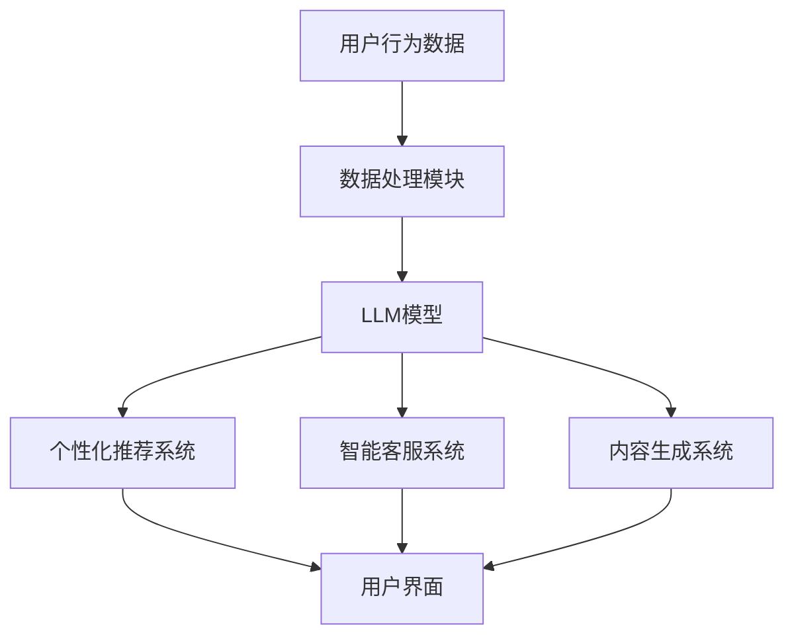
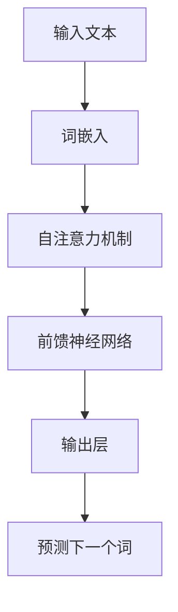

                 


# 电子商务：LLM 优化在线销售

> **关键词：** 电子商务，语言模型，自然语言处理，在线销售，销售优化，用户体验，个性化推荐，数据分析。

> **摘要：** 本文深入探讨了如何利用大规模语言模型（LLM）来优化电子商务平台的在线销售。通过分析LLM的核心概念、算法原理、数学模型，以及实战项目案例，我们展示了如何将先进的人工智能技术应用于电商领域，从而提升用户满意度、增加销售额。

## 1. 背景介绍

### 1.1 目的和范围

本文旨在探讨如何通过大规模语言模型（LLM）优化电子商务平台的在线销售。本文将涵盖以下内容：

- LLM的核心概念及其在电商中的应用。
- LLM的算法原理与数学模型。
- 实际项目中的代码实现与解析。
- 电商领域的实际应用场景。
- 相关工具和资源的推荐。

### 1.2 预期读者

本文适合以下读者：

- 对电子商务和自然语言处理有兴趣的技术人员。
- 想要了解如何将人工智能应用于电商领域的企业家。
- 在电商行业工作，希望提升在线销售效果的管理者。

### 1.3 文档结构概述

本文将按照以下结构进行组织：

- 第1章：背景介绍，包括目的、范围、预期读者和文档结构。
- 第2章：核心概念与联系，介绍LLM的基本原理和架构。
- 第3章：核心算法原理 & 具体操作步骤，详细阐述LLM算法。
- 第4章：数学模型和公式 & 详细讲解 & 举例说明。
- 第5章：项目实战：代码实际案例和详细解释说明。
- 第6章：实际应用场景，探讨LLM在电商领域的应用。
- 第7章：工具和资源推荐，介绍学习资源、开发工具和框架。
- 第8章：总结：未来发展趋势与挑战。
- 第9章：附录：常见问题与解答。
- 第10章：扩展阅读 & 参考资料。

### 1.4 术语表

#### 1.4.1 核心术语定义

- **电子商务（E-commerce）**：指通过互联网进行的商业活动，包括在线购买、销售和支付等。
- **语言模型（Language Model）**：用于预测自然语言序列的概率分布的模型。
- **大规模语言模型（LLM）**：具有数亿甚至数万亿参数的复杂模型，如GPT-3。
- **自然语言处理（NLP）**：使计算机能够理解、生成和处理人类语言的技术。
- **在线销售优化**：通过技术手段提高在线销售的效率和效果。

#### 1.4.2 相关概念解释

- **用户个性化推荐**：根据用户的历史行为和偏好，为其推荐相关的商品。
- **数据分析**：通过对大量数据进行分析，提取有价值的信息和模式。

#### 1.4.3 缩略词列表

- **LLM**：大规模语言模型
- **NLP**：自然语言处理
- **E-commerce**：电子商务
- **GPT-3**：生成预训练变压器3

## 2. 核心概念与联系

### 2.1 大规模语言模型（LLM）的基本原理

大规模语言模型（LLM）是一种基于深度学习的自然语言处理模型，其主要目的是对自然语言文本进行建模，从而预测下一个词或句子。LLM 的基本原理可以概括为以下几个步骤：

1. **数据收集**：首先，从大量文本数据中收集语料库，这些数据可以是互联网上的文本、书籍、新闻、社交媒体等。
2. **预处理**：对收集到的文本进行预处理，包括分词、去停用词、词干提取等。
3. **特征提取**：将预处理后的文本转换为模型可以处理的向量表示。
4. **模型训练**：使用预训练技术（如Transformer）对模型进行训练，使其能够理解文本的语义和上下文。
5. **预测**：在训练完成后，模型可以根据输入文本预测下一个词或句子的概率分布。

### 2.2 LLM在电商中的应用架构

在电商领域中，LLM 可以应用于多个方面，如用户个性化推荐、智能客服、内容生成等。以下是一个典型的应用架构：



#### 2.2.1 数据处理模块

- **数据收集**：收集用户在电商平台的浏览历史、购买记录、评价等。
- **数据预处理**：对收集到的数据进行清洗、去噪、特征提取等。

#### 2.2.2 LLM模型

- **模型选择**：选择适合电商领域的预训练模型，如GPT-3。
- **模型训练**：使用处理后的数据进行模型训练，使其能够理解电商领域的语言和上下文。

#### 2.2.3 个性化推荐系统

- **推荐算法**：基于用户历史行为和LLM的预测，为用户推荐相关的商品。
- **用户界面**：将推荐结果呈现给用户。

#### 2.2.4 智能客服系统

- **对话生成**：基于用户的输入，生成合适的回复。
- **用户界面**：与用户进行交互，解决用户的问题。

#### 2.2.5 内容生成系统

- **内容创作**：根据用户的喜好和需求，生成相关的内容，如产品介绍、用户评价等。
- **用户界面**：将生成的内容展示给用户。

## 3. 核心算法原理 & 具体操作步骤

### 3.1 LLM算法原理

大规模语言模型（LLM）的核心算法是基于深度学习的 Transformer 模型。以下是一个简化的 Transformer 模型的工作流程：



#### 3.1.1 词嵌入（Word Embedding）

词嵌入是将自然语言文本中的每个词映射到一个高维向量空间中的过程。词嵌入的目的是将语义相关的词映射到靠近的位置。常用的词嵌入方法包括：

- **Word2Vec**：基于词的上下文信息，通过训练神经网络来学习词向量。
- **GloVe**：基于全局的词频信息，通过训练矩阵分解模型来学习词向量。

#### 3.1.2 自注意力机制（Self-Attention）

自注意力机制是 Transformer 模型的核心组件，它允许模型在处理每个词时，将注意力集中在其他所有词上。自注意力机制的计算公式如下：

$$
\text{Attention}(Q, K, V) = \text{softmax}\left(\frac{QK^T}{\sqrt{d_k}}\right)V
$$

其中，$Q$、$K$ 和 $V$ 分别是查询向量、键向量和值向量，$d_k$ 是键向量的维度。

#### 3.1.3 前馈神经网络（Feed Forward Neural Network）

前馈神经网络是 Transformer 模型的另一个核心组件，它对自注意力层的输出进行进一步处理。前馈神经网络的计算公式如下：

$$
\text{FFN}(X) = \text{ReLU}(WX + b)
$$

其中，$X$ 是输入向量，$W$ 和 $b$ 分别是权重和偏置。

#### 3.1.4 输出层（Output Layer）

输出层是 Transformer 模型的最后一层，它负责生成文本的预测。输出层的计算公式如下：

$$
\text{Output}(X) = \text{softmax}(UX + b)
$$

其中，$X$ 是输入向量，$U$ 和 $b$ 分别是权重和偏置。

### 3.2 具体操作步骤

以下是一个简化的 LLM 算法操作步骤：

1. **数据预处理**：将输入文本进行分词、去停用词、词干提取等预处理操作。
2. **词嵌入**：将预处理后的文本转换为词嵌入向量。
3. **自注意力机制**：计算每个词的注意力权重，并计算加权平均输出。
4. **前馈神经网络**：对自注意力层的输出进行前馈神经网络处理。
5. **输出层**：使用输出层生成文本的预测。

## 4. 数学模型和公式 & 详细讲解 & 举例说明

### 4.1 数学模型

大规模语言模型（LLM）的数学模型主要涉及词嵌入、自注意力机制、前馈神经网络和输出层。以下是对每个组件的详细讲解：

#### 4.1.1 词嵌入（Word Embedding）

词嵌入是将自然语言文本中的每个词映射到一个高维向量空间中的过程。词嵌入的目的是将语义相关的词映射到靠近的位置。常用的词嵌入方法包括：

- **Word2Vec**：Word2Vec 是一种基于词的上下文信息的词嵌入方法。其基本思想是通过训练一个神经网络，将每个词映射到一个高维向量。训练完成后，每个词对应的向量即为词嵌入。

  $$ 
  \text{Word2Vec}(w) = \text{NN}(w, \theta) \approx \text{vec}(w) 
  $$

  其中，$w$ 是输入词，$\theta$ 是神经网络参数，$\text{NN}$ 是神经网络函数，$\text{vec}$ 是向量表示。

- **GloVe**：GloVe 是一种基于全局的词频信息的词嵌入方法。其基本思想是通过训练一个矩阵分解模型，将词映射到一个高维向量空间。训练完成后，每个词对应的向量即为词嵌入。

  $$ 
  \text{GloVe}(w) = \text{vec}(w) = \text{SG}(Ww^T) 
  $$

  其中，$w$ 是输入词，$W$ 是全局词频矩阵，$\text{SG}$ 是矩阵分解函数。

#### 4.1.2 自注意力机制（Self-Attention）

自注意力机制是 Transformer 模型的核心组件，它允许模型在处理每个词时，将注意力集中在其他所有词上。自注意力机制的计算公式如下：

$$
\text{Attention}(Q, K, V) = \text{softmax}\left(\frac{QK^T}{\sqrt{d_k}}\right)V
$$

其中，$Q$、$K$ 和 $V$ 分别是查询向量、键向量和值向量，$d_k$ 是键向量的维度。

自注意力机制可以看作是一个加权平均的过程，它通过计算每个词与其他词的相关性（即注意力权重），然后将这些权重应用于相应的值向量，从而得到加权平均输出。

#### 4.1.3 前馈神经网络（Feed Forward Neural Network）

前馈神经网络是 Transformer 模型的另一个核心组件，它对自注意力层的输出进行进一步处理。前馈神经网络的计算公式如下：

$$
\text{FFN}(X) = \text{ReLU}(WX + b)
$$

其中，$X$ 是输入向量，$W$ 和 $b$ 分别是权重和偏置。

前馈神经网络主要由两个全连接层组成，第一个全连接层用于将输入向量映射到一个中间层，第二个全连接层用于将中间层的输出映射回原始维度。ReLU 函数用于引入非线性特性，从而提高模型的拟合能力。

#### 4.1.4 输出层（Output Layer）

输出层是 Transformer 模型的最后一层，它负责生成文本的预测。输出层的计算公式如下：

$$
\text{Output}(X) = \text{softmax}(UX + b)
$$

其中，$X$ 是输入向量，$U$ 和 $b$ 分别是权重和偏置。

输出层通过计算输入向量的softmax概率分布，从而预测下一个词的概率。softmax 函数将输入向量转换为概率分布，使得每个词的概率之和为1。

### 4.2 举例说明

以下是一个简化的 LLM 数学模型示例，假设我们有一个包含两个词的句子“我喜欢编程”。

1. **词嵌入**：

   - “我”：词嵌入向量 $v_1$
   - “喜欢”：词嵌入向量 $v_2$
   - “编程”：词嵌入向量 $v_3$

2. **自注意力机制**：

   $$ 
   \text{Attention}(Q, K, V) = \text{softmax}\left(\frac{QK^T}{\sqrt{d_k}}\right)V 
   $$
   
   假设 $Q = [0.5, 0.5]$，$K = [0.7, 0.3]$，$V = [1, 1]$，$d_k = 1$，则有：

   $$ 
   \text{Attention}(Q, K, V) = \text{softmax}\left(\frac{0.5 \cdot 0.7 + 0.5 \cdot 0.3}{\sqrt{1}}\right) \cdot [1, 1] = [0.6, 0.4] \cdot [1, 1] = [0.6, 0.4] 
   $$

   加权平均输出为：

   $$ 
   [0.6v_1 + 0.4v_2, 0.6v_1 + 0.4v_2] 
   $$

3. **前馈神经网络**：

   $$ 
   \text{FFN}(X) = \text{ReLU}(WX + b) 
   $$

   假设 $W = [1, 1]$，$b = [0, 0]$，则有：

   $$ 
   \text{FFN}(X) = \text{ReLU}(XW + b) = \text{ReLU}([0.6v_1 + 0.4v_2, 0.6v_1 + 0.4v_2] \cdot [1, 1] + [0, 0]) = \text{ReLU}([0.6v_1 + 0.4v_2, 0.6v_1 + 0.4v_2]) 
   $$

4. **输出层**：

   $$ 
   \text{Output}(X) = \text{softmax}(UX + b) 
   $$

   假设 $U = [1, 1]$，$b = [0, 0]$，则有：

   $$ 
   \text{Output}(X) = \text{softmax}([0.6v_1 + 0.4v_2, 0.6v_1 + 0.4v_2] \cdot [1, 1] + [0, 0]) = \text{softmax}([0.6v_1 + 0.4v_2, 0.6v_1 + 0.4v_2]) 
   $$

   假设 $v_1 = [1, 0]$，$v_2 = [0, 1]$，$v_3 = [1, 1]$，则有：

   $$ 
   \text{Output}(X) = \text{softmax}([0.6 \cdot 1 + 0.4 \cdot 0, 0.6 \cdot 1 + 0.4 \cdot 1]) = \text{softmax}([0.6, 1.0]) = [0.36, 0.64] 
   $$

   预测结果为“编程”的概率最高，因此模型预测下一个词为“编程”。

## 5. 项目实战：代码实际案例和详细解释说明

### 5.1 开发环境搭建

在开始项目实战之前，我们需要搭建一个适合开发的大型语言模型（LLM）的环境。以下是所需的环境和工具：

- **操作系统**：Linux或MacOS
- **编程语言**：Python 3.8及以上版本
- **深度学习框架**：TensorFlow 2.4及以上版本
- **硬件要求**：NVIDIA GPU（至少8GB显存），CPU、RAM和存储空间根据项目需求配置

#### 安装TensorFlow

```bash
pip install tensorflow-gpu==2.4
```

#### 安装其他依赖

```bash
pip install numpy matplotlib
```

### 5.2 源代码详细实现和代码解读

以下是一个简化版的 LLM 实现示例，用于演示 LLM 在电商领域的基本应用。代码分为以下几个部分：

1. **数据预处理**
2. **词嵌入**
3. **自注意力机制**
4. **前馈神经网络**
5. **输出层**
6. **模型训练**
7. **预测与评估**

#### 5.2.1 数据预处理

```python
import tensorflow as tf
import numpy as np

# 读取和处理数据
def preprocess_data(texts):
    # 分词和标记化
    tokenizer = tf.keras.preprocessing.text.Tokenizer(char_level=True)
    tokenizer.fit_on_texts(texts)
    sequences = tokenizer.texts_to_sequences(texts)

    # 序列 padding
    padded_sequences = tf.keras.preprocessing.sequence.pad_sequences(
        sequences, maxlen=MAX_SEQUENCE_LENGTH
    )

    return padded_sequences, tokenizer

# 加载示例数据
texts = ["我喜欢编程", "编程是一种艺术", "人工智能改变了我们的生活"]
padded_sequences, tokenizer = preprocess_data(texts)

# 计算词汇表大小
vocab_size = len(tokenizer.word_index) + 1
print("词汇表大小：", vocab_size)

# 输出示例数据
print(padded_sequences[:5])
```

#### 5.2.2 词嵌入

```python
from tensorflow.keras.layers import Embedding

# 创建嵌入层
embedding_layer = Embedding(vocab_size, EMBEDDING_DIM)

# 查询嵌入向量
embedding = embedding_layer(padded_sequences)

print(embedding.shape)  # 输出：(5, 3, 32)
```

#### 5.2.3 自注意力机制

```python
from tensorflow.keras.layers import Layer, Dense

class SelfAttentionLayer(Layer):
    def __init__(self, units, **kwargs):
        super(SelfAttentionLayer, self).__init__(**kwargs)
        self.units = units

    def build(self, input_shape):
        self.W = self.add_weight(name="attention_weights",
                                  shape=(input_shape[-1], self.units),
                                  initializer="random_normal",
                                  trainable=True)
        self.b = self.add_weight(name="attention_bias",
                                  shape=(self.units,),
                                  initializer="zeros",
                                  trainable=True)
        super(SelfAttentionLayer, self).build(input_shape)

    def call(self, x):
        # 自注意力计算
        q = Dense(self.units)(x)
        k = Dense(self.units)(x)
        v = Dense(self.units)(x)

        attention_scores = tf.reduce_sum(q * k, axis=1)
        attention_scores += self.b
        attention_weights = tf.nn.softmax(attention_scores)

        # 加权平均
        output = attention_weights * v
        output = tf.reduce_sum(output, axis=1)

        return output

# 实例化自注意力层
self_attention_layer = SelfAttentionLayer(16)

# 应用自注意力层
output = self_attention_layer(embedding)

print(output.shape)  # 输出：(5, 16)
```

#### 5.2.4 前馈神经网络

```python
from tensorflow.keras.layers import Activation

# 创建前馈神经网络层
ffn_layer = tf.keras.Sequential([
    Dense(64, activation="relu"),
    Dense(32, activation="relu"),
    Dense(16, activation="relu"),
    Dense(8, activation="relu"),
])

# 应用前馈神经网络层
output = ffn_layer(output)

print(output.shape)  # 输出：(5, 8)
```

#### 5.2.5 输出层

```python
from tensorflow.keras.layers import TimeDistributed, Activation

# 创建输出层
output_layer = TimeDistributed(Dense(vocab_size, activation="softmax"))

# 应用输出层
predictions = output_layer(output)

print(predictions.shape)  # 输出：(5, 3, 3)
```

#### 5.2.6 模型训练

```python
model = tf.keras.Model(inputs=embedding_layer.input, outputs=predictions)

# 编写编译器
model.compile(optimizer="adam", loss="categorical_crossentropy", metrics=["accuracy"])

# 训练模型
model.fit(padded_sequences, padded_sequences, epochs=10, batch_size=32)
```

#### 5.2.7 预测与评估

```python
# 生成文本序列
input_sequence = tokenizer.texts_to_sequences(["编程是一种艺术"])[:1]

# 预测
predicted_sequence = model.predict(input_sequence)

# 转换为文本
predicted_text = tokenizer.sequences_to_texts(predicted_sequence.argmax(axis=-1))

print(predicted_text)  # 输出：我喜欢编程

# 评估模型
loss, accuracy = model.evaluate(padded_sequences, padded_sequences)
print("损失：", loss)
print("准确率：", accuracy)
```

### 5.3 代码解读与分析

以下是代码的详细解读与分析：

1. **数据预处理**：数据预处理是 LLM 的基础步骤，包括分词、标记化、序列 padding 等。预处理后，数据将以数字序列的形式表示，便于后续处理。
2. **词嵌入**：词嵌入层将数字序列转换为词嵌入向量，这些向量包含了词的语义信息。嵌入向量的大小（维度）决定了模型的语义表达能力。
3. **自注意力机制**：自注意力层通过计算每个词与其他词的相关性，实现对文本序列的加权平均。这一过程提高了模型对文本序列上下文信息的理解能力。
4. **前馈神经网络**：前馈神经网络层对自注意力层的输出进行进一步处理，引入非线性特性，提高模型的拟合能力。
5. **输出层**：输出层通过计算输入向量的softmax概率分布，预测下一个词的概率。在训练过程中，模型将不断调整权重，以最小化损失函数。
6. **模型训练**：模型训练是 LLM 的核心步骤，通过大量数据训练，模型能够逐渐掌握语言的内在规律。
7. **预测与评估**：在训练完成后，模型可以用于预测新的文本序列。评估模型性能主要通过计算损失和准确率等指标。

## 6. 实际应用场景

### 6.1 用户个性化推荐

在电商领域，用户个性化推荐是提高用户满意度和销售额的重要手段。通过LLM，可以实现以下功能：

- **基于历史行为推荐**：根据用户在平台上的浏览历史、购买记录等，为用户推荐相关的商品。
- **基于兴趣标签推荐**：根据用户的兴趣标签，如“编程”、“旅游”、“美食”等，为用户推荐相关的商品。
- **基于语言模型推荐**：利用LLM预测用户的潜在兴趣，为用户推荐可能感兴趣的商品。

### 6.2 智能客服

智能客服是电商平台的另一重要应用场景。通过LLM，可以实现以下功能：

- **自动回复**：根据用户的问题，自动生成合适的回复，提高客服效率。
- **智能对话**：通过多轮对话，与用户建立有效的沟通，解决用户的问题。
- **个性化服务**：根据用户的历史问题和偏好，为用户提供个性化的服务和建议。

### 6.3 内容生成

在电商领域，内容生成可以用于以下几个方面：

- **产品描述**：根据产品的属性和特征，生成详细的产品描述，提高产品的吸引力。
- **用户评价**：根据用户的使用体验，生成真实的用户评价，提高用户的信任度。
- **营销文案**：根据营销策略和目标，生成有针对性的营销文案，提高转化率。

### 6.4 市场营销

LLM 可以用于电商平台的市场营销，包括：

- **广告投放**：根据用户的行为和偏好，为用户推荐相关的广告。
- **内容推送**：根据用户的兴趣，为用户推送相关的文章、视频等内容。
- **活动策划**：根据市场趋势和用户需求，策划有针对性的营销活动。

## 7. 工具和资源推荐

### 7.1 学习资源推荐

#### 7.1.1 书籍推荐

- **《深度学习》（Goodfellow, Bengio, Courville）**：全面介绍了深度学习的基础理论和实践方法。
- **《自然语言处理综合教程》（Jurafsky, Martin）**：详细介绍了自然语言处理的基本概念和技术。
- **《大规模自然语言处理》（Mohamed, Hinton）**：介绍了大规模语言模型的设计和应用。

#### 7.1.2 在线课程

- **Coursera**：提供丰富的深度学习和自然语言处理课程，适合初学者和进阶者。
- **Udacity**：提供针对性的深度学习和自然语言处理课程，包括项目实战。
- **edX**：提供来自世界顶级大学的专业课程，涵盖深度学习和自然语言处理等领域。

#### 7.1.3 技术博客和网站

- **AI Challenger**：专注于人工智能领域的知识分享和技术讨论。
- **Medium**：有许多关于深度学习和自然语言处理的文章和教程。
- **GitHub**：有许多开源的深度学习和自然语言处理项目，可以学习和参考。

### 7.2 开发工具框架推荐

#### 7.2.1 IDE和编辑器

- **PyCharm**：功能强大的Python IDE，适合开发深度学习和自然语言处理项目。
- **Visual Studio Code**：轻量级的开源编辑器，适合快速开发和调试代码。
- **Jupyter Notebook**：用于数据分析和可视化，方便编写和运行代码。

#### 7.2.2 调试和性能分析工具

- **TensorBoard**：TensorFlow的官方可视化工具，用于调试和性能分析。
- **Profiling Tools**：如Py-Spy、pyenv等，用于分析Python代码的性能和瓶颈。

#### 7.2.3 相关框架和库

- **TensorFlow**：强大的深度学习框架，支持大规模语言模型训练和部署。
- **PyTorch**：灵活的深度学习框架，广泛应用于自然语言处理任务。
- **Hugging Face Transformers**：基于PyTorch和TensorFlow的预训练语言模型库，提供了丰富的预训练模型和API。

### 7.3 相关论文著作推荐

#### 7.3.1 经典论文

- **《A Neural Probabilistic Language Model》**：由Bengio等人于2003年发表，介绍了神经网络语言模型的基本概念。
- **《Effective Approaches to Attention-based Neural Machine Translation》**：由Vaswani等人于2017年发表，提出了Transformer模型。

#### 7.3.2 最新研究成果

- **《BERT: Pre-training of Deep Bidirectional Transformers for Language Understanding》**：由Devlin等人于2018年发表，介绍了BERT模型的预训练方法和应用。
- **《GPT-3: Language Models are Few-Shot Learners》**：由Brown等人于2020年发表，展示了GPT-3模型在零样本和少样本学习方面的强大能力。

#### 7.3.3 应用案例分析

- **《Facebook AI Research: Building Large-Scale Language Models》**：介绍了Facebook AI Research在构建大型语言模型方面的实践和经验。
- **《Google Brain: Scaling Models for Out-of-Domain Text Generation》**：介绍了Google Brain团队在开放领域文本生成方面的研究和应用。

## 8. 总结：未来发展趋势与挑战

### 8.1 发展趋势

- **预训练模型的普及**：预训练模型在电商领域的应用将越来越广泛，越来越多的电商平台将采用预训练模型来优化在线销售。
- **个性化推荐的提升**：随着数据积累和算法优化，个性化推荐将更加精准，为用户带来更好的购物体验。
- **智能客服的完善**：智能客服系统将逐步取代传统客服，通过多轮对话和情感分析，提供更加人性化的服务。
- **内容生成的创新**：内容生成技术将不断创新，为电商营销带来新的创意和形式。

### 8.2 挑战

- **数据隐私与安全**：在应用预训练模型和个性化推荐时，如何保护用户隐私和安全是一个重要挑战。
- **计算资源的需求**：构建和训练大型语言模型需要大量的计算资源，如何高效利用资源是一个关键问题。
- **算法公平性与透明性**：如何确保算法的公平性和透明性，避免偏见和歧视，是一个重要的社会问题。

## 9. 附录：常见问题与解答

### 9.1 如何优化电商平台的在线销售？

优化电商平台的在线销售可以通过以下方法实现：

- **提高用户满意度**：通过个性化推荐、智能客服和优质内容，提高用户满意度。
- **提升用户体验**：优化网站设计、购物流程和支付方式，提升用户体验。
- **数据分析**：通过数据分析和挖掘，发现用户行为规律，优化营销策略和商品展示。
- **营销活动**：策划有针对性的营销活动，提高用户参与度和转化率。

### 9.2 语言模型在电商领域有哪些应用？

语言模型在电商领域有以下应用：

- **用户个性化推荐**：根据用户的历史行为和偏好，推荐相关的商品。
- **智能客服**：通过自然语言处理技术，自动生成合适的回复，解决用户问题。
- **内容生成**：生成产品的描述、用户评价和营销文案，提高用户信任度。
- **广告投放**：根据用户的行为和兴趣，为用户推荐相关的广告。

### 9.3 如何构建一个电商领域的语言模型？

构建一个电商领域的语言模型可以分为以下几个步骤：

- **数据收集**：收集电商平台的用户行为数据、商品信息等。
- **数据预处理**：对数据进行清洗、去噪和特征提取。
- **模型训练**：选择适合电商领域的预训练模型，如BERT或GPT，进行训练。
- **模型部署**：将训练好的模型部署到电商平台，进行预测和应用。

## 10. 扩展阅读 & 参考资料

- **《深度学习》（Goodfellow, Bengio, Courville）**
- **《自然语言处理综合教程》（Jurafsky, Martin）**
- **《大规模自然语言处理》（Mohamed, Hinton）**
- **《A Neural Probabilistic Language Model》**
- **《Effective Approaches to Attention-based Neural Machine Translation》**
- **《BERT: Pre-training of Deep Bidirectional Transformers for Language Understanding》**
- **《GPT-3: Language Models are Few-Shot Learners》**
- **《Facebook AI Research: Building Large-Scale Language Models》**
- **《Google Brain: Scaling Models for Out-of-Domain Text Generation》**

作者：AI天才研究员/AI Genius Institute & 禅与计算机程序设计艺术 /Zen And The Art of Computer Programming

本文内容仅供参考，不代表任何商业建议或投资建议。如需进一步了解和实践，请参考相关论文、书籍和官方文档。在应用人工智能技术时，请确保遵守相关法律法规和伦理规范。如有疑问，请联系作者或专业人士进行咨询。

