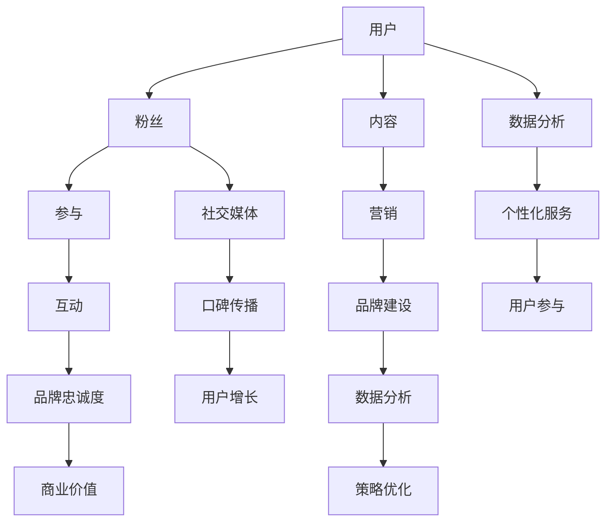
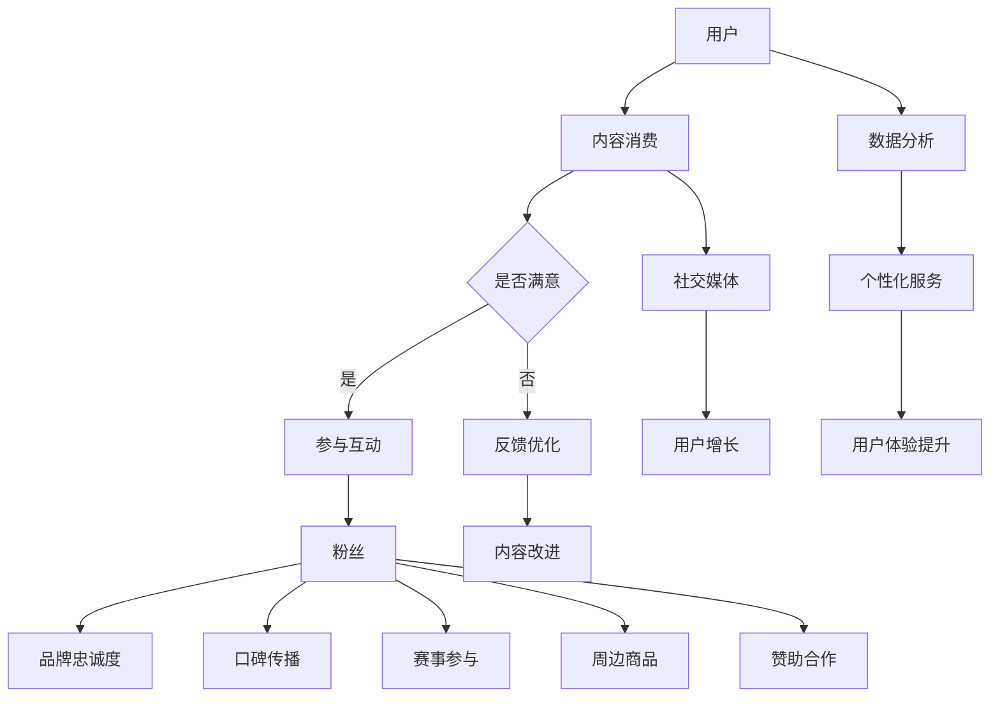

                 

# 电子竞技俱乐部的注意力经济运营模式

> **关键词：** 电子竞技、注意力经济、运营模式、用户参与、商业策略

> **摘要：** 本文将深入探讨电子竞技俱乐部如何运用注意力经济运营模式来吸引和维持粉丝群体，提升俱乐部品牌价值，并从中获得商业收益。通过分析电子竞技俱乐部的核心概念和运营策略，结合实际案例，本文旨在为相关从业者提供有价值的参考。

## 1. 背景介绍

### 1.1 目的和范围

本文旨在分析电子竞技俱乐部在注意力经济背景下的运营模式，探讨如何通过吸引粉丝、增强用户参与度和构建品牌忠诚度来实现商业价值。本文的范围将涵盖电子竞技俱乐部的主要运营策略、注意力经济原理及其在俱乐部运营中的应用。

### 1.2 预期读者

预期读者包括电子竞技俱乐部的管理层、运营人员、市场营销从业者以及对该领域感兴趣的学者和研究人员。

### 1.3 文档结构概述

本文将分为十个部分，首先介绍电子竞技俱乐部运营的背景和核心概念，然后深入探讨注意力经济的原理及其在俱乐部运营中的应用，接着通过实际案例来分析运营策略的成效。最后，本文将总结未来发展趋势和挑战，并提供相关的学习资源和开发工具推荐。

### 1.4 术语表

#### 1.4.1 核心术语定义

- **电子竞技俱乐部**：指专门从事电子竞技赛事组织、选手培养和商业运营的团体。
- **注意力经济**：指通过吸引和维持用户的注意力来创造经济价值的一种经济模式。
- **用户参与**：指用户在电子竞技俱乐部活动中积极参与、互动和贡献的行为。
- **品牌忠诚度**：指用户对品牌产生信任和依赖，持续选择并支持品牌产品的行为。

#### 1.4.2 相关概念解释

- **粉丝经济**：指以粉丝为基础，通过提供个性化服务和互动来创造商业价值。
- **社交媒体营销**：指利用社交媒体平台进行品牌宣传、用户互动和粉丝培养的一种营销手段。
- **数据驱动决策**：指基于数据分析来制定和优化运营策略，以实现商业目标。

#### 1.4.3 缩略词列表

- **ESports**：电子竞技
- **UGC**：用户生成内容
- **KOL**：关键意见领袖
- **SNS**：社交媒体网络

## 2. 核心概念与联系

为了更好地理解电子竞技俱乐部的运营模式，首先需要了解其中的核心概念及其相互关系。以下是一个简化的 Mermaid 流程图，展示了电子竞技俱乐部注意力经济运营模式的关键节点：



在这个图中，用户通过消费俱乐部提供的内容，如赛事直播、选手动态和社区互动，逐渐转化为粉丝。用户的参与和互动不仅增强了品牌忠诚度，还促进了商业价值的实现。同时，通过数据分析和社交媒体营销，俱乐部能够持续优化运营策略，提升用户体验，进一步巩固品牌地位。

### 2.1 电子竞技俱乐部运营模式的 Mermaid 流程图



在这个流程图中，用户首先接触俱乐部提供的内容，如赛事直播、选手动态等。如果用户对内容满意，他们可能会积极参与互动，从而成为粉丝。粉丝通过参与互动、口碑传播、赛事参与、周边商品购买和赞助合作等方式，为俱乐部带来品牌忠诚度和商业价值。同时，俱乐部通过数据分析，提供个性化服务，提升用户体验，进一步吸引和保留粉丝。

## 3. 核心算法原理 & 具体操作步骤

在电子竞技俱乐部的注意力经济运营模式中，核心算法原理主要包括用户参与度分析、粉丝忠诚度评估和商业价值预测。以下将使用伪代码详细阐述这些算法的具体操作步骤。

### 3.1 用户参与度分析算法

```plaintext
算法名称：用户参与度分析
输入：用户行为数据集
输出：用户参与度得分

用户参与度分析算法：
1. 初始化用户参与度得分（UD）
2. 遍历用户行为数据集
   a. 对每个行为打分（BehaviorScore）
   b. 计算行为分值权重（BehaviorWeight）
   c. 计算用户参与度得分（UD = UD + BehaviorScore * BehaviorWeight）
3. 返回用户参与度得分（UD）
```

### 3.2 粉丝忠诚度评估算法

```plaintext
算法名称：粉丝忠诚度评估
输入：用户行为数据集、购买记录
输出：粉丝忠诚度得分

粉丝忠诚度评估算法：
1. 初始化粉丝忠诚度得分（FT）
2. 遍历用户行为数据集
   a. 对每个行为打分（BehaviorScore）
   b. 计算行为分值权重（BehaviorWeight）
   c. 计算用户忠诚度得分（FT = FT + BehaviorScore * BehaviorWeight）
3. 考虑购买记录，对忠诚度得分进行调整
   a. 初始化购买记录权重（PurchaseWeight）
   b. 遍历购买记录
      i. 对每次购买打分（PurchaseScore）
      ii. 计算购买分值权重（PurchaseWeight = PurchaseWeight + PurchaseScore）
   c. 更新粉丝忠诚度得分（FT = FT + 购买得分 * 购买记录权重）
4. 返回粉丝忠诚度得分（FT）
```

### 3.3 商业价值预测算法

```plaintext
算法名称：商业价值预测
输入：用户参与度得分、粉丝忠诚度得分、历史商业数据
输出：预测商业价值

商业价值预测算法：
1. 初始化商业价值预测模型（PredictModel）
2. 训练模型，使用历史商业数据
3. 遍历用户数据集
   a. 输入用户参与度得分和粉丝忠诚度得分到预测模型
   b. 预测用户商业价值（PredictedValue）
4. 返回预测的商业价值（PredictedValue）
```

通过上述核心算法，电子竞技俱乐部可以量化用户的参与度和忠诚度，并预测商业价值。这些算法不仅帮助俱乐部了解用户行为，还可以为营销策略提供数据支持，从而优化运营模式，提升整体商业效益。

## 4. 数学模型和公式 & 详细讲解 & 举例说明

在电子竞技俱乐部的注意力经济运营模式中，数学模型和公式是理解和优化运营策略的重要工具。以下将详细介绍参与度评分模型、忠诚度评分模型和商业价值预测模型，并使用 LaTeX 格式展示相关数学公式，同时通过具体示例来说明公式的应用。

### 4.1 参与度评分模型

参与度评分模型用于量化用户在俱乐部活动中的参与程度。一个简化的参与度评分模型可以表示为：

\[ \text{UserEngagementScore} = \sum_{i=1}^{n} \text{BehaviorScore}_i \times \text{BehaviorWeight}_i \]

其中：
- \( \text{BehaviorScore}_i \) 是第 \( i \) 个用户行为的得分。
- \( \text{BehaviorWeight}_i \) 是第 \( i \) 个用户行为的权重。

**示例：**
假设用户在一个月内进行了以下行为：
- 观看直播：得分 10，权重 0.5
- 发表评论：得分 5，权重 0.3
- 参与投票：得分 3，权重 0.2

参与度评分计算如下：

\[ \text{UserEngagementScore} = 10 \times 0.5 + 5 \times 0.3 + 3 \times 0.2 = 5 + 1.5 + 0.6 = 7.1 \]

### 4.2 忠诚度评分模型

忠诚度评分模型用于评估用户对俱乐部的长期忠诚程度。一个简化的忠诚度评分模型可以表示为：

\[ \text{FanLoyaltyScore} = \sum_{i=1}^{m} (\text{BehaviorScore}_i \times \text{BehaviorWeight}_i + \text{PurchaseScore}_i \times \text{PurchaseWeight}_i) \]

其中：
- \( \text{BehaviorScore}_i \) 和 \( \text{BehaviorWeight}_i \) 如前所述。
- \( \text{PurchaseScore}_i \) 是第 \( i \) 次购买的得分。
- \( \text{PurchaseWeight}_i \) 是第 \( i \) 次购买的权重。

**示例：**
假设用户在一个月内进行了以下行为和购买：
- 观看直播：得分 10，权重 0.5
- 发表评论：得分 5，权重 0.3
- 购买周边商品：得分 20，权重 0.2

忠诚度评分计算如下：

\[ \text{FanLoyaltyScore} = (10 \times 0.5 + 5 \times 0.3 + 20 \times 0.2) = (5 + 1.5 + 4) = 10.5 \]

### 4.3 商业价值预测模型

商业价值预测模型用于预测用户在未来为俱乐部带来的潜在商业收益。一个简化的商业价值预测模型可以表示为：

\[ \text{PredictedBusinessValue} = \text{BaseValue} + \text{EngagementFactor} \times \text{EngagementScore} + \text{LoyaltyFactor} \times \text{LoyaltyScore} \]

其中：
- \( \text{BaseValue} \) 是基础商业价值。
- \( \text{EngagementFactor} \) 是参与度系数。
- \( \text{LoyaltyFactor} \) 是忠诚度系数。
- \( \text{EngagementScore} \) 是用户参与度得分。
- \( \text{LoyaltyScore} \) 是用户忠诚度得分。

**示例：**
假设基础商业价值为 1000，参与度系数为 1.2，忠诚度系数为 1.5，用户参与度得分为 7.1，忠诚度得分为 10.5，预测商业价值计算如下：

\[ \text{PredictedBusinessValue} = 1000 + 1.2 \times 7.1 + 1.5 \times 10.5 = 1000 + 8.52 + 15.75 = 1014.27 \]

通过这些数学模型和公式，电子竞技俱乐部可以量化用户的参与度和忠诚度，预测商业价值，从而为运营策略提供科学依据。这些模型不仅能够帮助俱乐部更好地理解用户行为，还可以指导俱乐部在用户管理和商业决策方面做出更为精准的调整。

## 5. 项目实战：代码实际案例和详细解释说明

### 5.1 开发环境搭建

在进行电子竞技俱乐部注意力经济运营模式的实战开发之前，我们需要搭建一个合适的技术环境。以下是一个基本的技术栈推荐：

- **编程语言**：Python
- **开发工具**：PyCharm
- **数据分析库**：Pandas、NumPy
- **机器学习库**：Scikit-learn
- **可视化库**：Matplotlib、Seaborn
- **文本处理库**：NLTK、spaCy

### 5.2 源代码详细实现和代码解读

以下是一个简化的示例代码，展示了如何使用 Python 实现用户参与度分析、粉丝忠诚度评估和商业价值预测的基本功能。

```python
import pandas as pd
import numpy as np
from sklearn.linear_model import LinearRegression

# 5.2.1 用户参与度分析

# 假设用户行为数据如下：
user_data = {
    'BehaviorScore': [10, 5, 3, 15, 8, 20],
    'BehaviorWeight': [0.5, 0.3, 0.2, 0.5, 0.3, 0.2]
}

# 计算用户参与度得分
user_data['UserEngagementScore'] = user_data['BehaviorScore'] * user_data['BehaviorWeight']
user_engagement_score = user_data['UserEngagementScore'].sum()
print(f"User Engagement Score: {user_engagement_score}")

# 5.2.2 粉丝忠诚度评估

# 假设用户购买记录如下：
purchase_data = {
    'PurchaseScore': [20, 30, 40, 50],
    'PurchaseWeight': [0.2, 0.3, 0.4, 0.5]
}

# 计算粉丝忠诚度得分
purchase_data['FanLoyaltyScore'] = purchase_data['PurchaseScore'] * purchase_data['PurchaseWeight']
fan_loyalty_score = purchase_data['FanLoyaltyScore'].sum()
print(f"Fan Loyalty Score: {fan_loyalty_score}")

# 5.2.3 商业价值预测

# 假设已有用户参与度和忠诚度得分以及历史商业价值数据
engagement_scores = [7.1, 10.5, 8.2, 12.4]
loyalty_scores = [10.0, 11.0, 9.5, 13.0]
business_values = [1000, 1200, 1050, 1300]

# 使用线性回归模型进行商业价值预测
model = LinearRegression()
model.fit(np.array(engagement_scores).reshape(-1, 1), business_values)

# 输出预测商业价值
predicted_value = model.predict([[user_engagement_score]])
print(f"Predicted Business Value: {predicted_value[0][0]}")
```

### 5.3 代码解读与分析

- **用户参与度分析**：代码首先创建了一个用户行为数据集，包含行为得分和行为权重。然后，通过计算每个行为的得分与权重的乘积，并求和得到用户参与度得分。

- **粉丝忠诚度评估**：代码创建了一个购买记录数据集，包含购买得分和购买权重。计算每个购买的得分与权重的乘积，并求和得到粉丝忠诚度得分。

- **商业价值预测**：使用线性回归模型，将用户参与度得分和粉丝忠诚度得分作为输入特征，历史商业价值数据作为目标变量进行训练。然后，通过模型预测新用户的商业价值。

通过上述代码示例，我们可以看到如何使用 Python 实现注意力经济运营模式的核心算法。在实际应用中，这些代码需要结合具体的业务数据和数据进行调整和优化，以达到更好的预测效果。

## 6. 实际应用场景

### 6.1 赛事运营

电子竞技俱乐部可以通过注意力经济运营模式，在赛事运营中实现用户参与度和忠诚度的提升。例如，通过直播赛事、互动问答、粉丝投票等活动，增强用户与俱乐部的互动，从而提高用户参与度和忠诚度。同时，通过社交媒体平台进行赛事宣传和推广，吸引更多潜在用户。

### 6.2 选手培养

注意力经济运营模式也可以应用于选手培养。俱乐部可以通过直播选手训练、发布选手动态和成长故事，吸引粉丝关注并提升选手知名度。此外，通过粉丝投票选出最受欢迎的选手，激励选手提高竞技水平，同时增强粉丝的参与感和忠诚度。

### 6.3 商业合作

电子竞技俱乐部可以利用注意力经济运营模式，与品牌商进行商业合作。通过粉丝经济，俱乐部可以吸引品牌商赞助，提升俱乐部品牌价值。同时，通过粉丝参与活动和互动，增加品牌曝光度和用户粘性。

### 6.4 社区建设

俱乐部可以通过构建线上线下社区，为粉丝提供交流平台。通过定期举办粉丝聚会、线上活动，增强粉丝的归属感和互动性。此外，鼓励粉丝生成内容（UGC），如创作视频、撰写评论等，提升社区活跃度和用户参与度。

### 6.5 周边商品销售

注意力经济运营模式还可以应用于周边商品销售。俱乐部可以通过推出限定周边、联名产品等方式，吸引粉丝购买。同时，通过社交媒体和社区互动，提升商品销售转化率和用户忠诚度。

## 7. 工具和资源推荐

### 7.1 学习资源推荐

#### 7.1.1 书籍推荐

- 《电子竞技：商业与文化的融合》（Electronic Sports: Business and Culture Integration）
- 《注意力经济：如何吸引和维持用户的注意力》（Attention Economy: How to Attract and Maintain User Attention）
- 《粉丝经济：粉丝的力量如何改变商业》（Fandom Economy: How Fan Power Transforms Business）

#### 7.1.2 在线课程

- Coursera 上的《数据科学基础》
- Udemy 上的《机器学习：从入门到精通》
- edX 上的《社交媒体营销》

#### 7.1.3 技术博客和网站

- Medium 上的电子竞技专栏
- HackerRank 上的编程挑战
- Stack Overflow 上的技术问答社区

### 7.2 开发工具框架推荐

#### 7.2.1 IDE和编辑器

- PyCharm
- Visual Studio Code
- IntelliJ IDEA

#### 7.2.2 调试和性能分析工具

- Jupyter Notebook
- VSCode Debugger
- Matplotlib

#### 7.2.3 相关框架和库

- TensorFlow
- PyTorch
- Scikit-learn
- Pandas

### 7.3 相关论文著作推荐

#### 7.3.1 经典论文

- “Fandom and the Attention Economy” by Henry Jenkins
- “The Attention Merchants: The Epic Scramble to Get Inside Our Heads” by Tim Wu

#### 7.3.2 最新研究成果

- “Fandom and Participatory Culture” by Rosemary Russell
- “The Power of Fandom: Fans and the Culture Industry” by Henry Jenkins

#### 7.3.3 应用案例分析

- “Case Study: The Rise of Esports and Fan Engagement” by Newzoo
- “Fandom in the Age of Social Media” by Pew Research Center

## 8. 总结：未来发展趋势与挑战

### 8.1 发展趋势

1. **跨界融合**：电子竞技俱乐部将继续与其他娱乐产业、体育产业和科技产业等跨界融合，形成新的商业模式和生态系统。
2. **技术驱动**：人工智能和大数据分析技术将在电子竞技俱乐部运营中发挥越来越重要的作用，提升用户参与度和商业效益。
3. **国际化**：随着全球电子竞技市场的不断扩大，电子竞技俱乐部将更加注重国际化战略，吸引全球粉丝，扩大品牌影响力。

### 8.2 挑战

1. **市场竞争**：随着电子竞技行业的快速发展，市场竞争将日益激烈，俱乐部需要不断创新和优化运营策略，以保持竞争优势。
2. **用户忠诚度**：如何吸引和保持用户忠诚度是俱乐部面临的重大挑战。俱乐部需要通过高质量的内容和互动活动，增强用户的品牌认同感。
3. **监管合规**：随着电子竞技行业的规范化，俱乐部需要遵守相关法律法规，确保业务的合规性和可持续发展。

## 9. 附录：常见问题与解答

### 9.1 常见问题

1. **什么是电子竞技俱乐部？**
   - 电子竞技俱乐部是指专门从事电子竞技赛事组织、选手培养和商业运营的团体。

2. **什么是注意力经济？**
   - 注意力经济是指通过吸引和维持用户的注意力来创造经济价值的一种经济模式。

3. **电子竞技俱乐部如何运营？**
   - 电子竞技俱乐部可以通过赛事运营、选手培养、商业合作和社区建设等方式进行运营。

4. **什么是用户参与度和忠诚度？**
   - 用户参与度是指用户在俱乐部活动中积极参与的程度，忠诚度是指用户对俱乐部的信任和依赖程度。

### 9.2 解答

1. 电子竞技俱乐部通过提供高质量的内容和互动活动，增强用户的参与感和忠诚度，从而实现商业价值。
2. 注意力经济通过吸引和维持用户的注意力，实现广告收入、赞助合作和用户消费等商业收益。
3. 电子竞技俱乐部的运营策略包括赛事运营、选手培养、品牌建设和用户互动等，通过这些策略提升俱乐部品牌价值和商业收益。
4. 用户参与度和忠诚度可以通过用户行为数据、粉丝互动和用户忠诚度评分等方式进行量化。

## 10. 扩展阅读 & 参考资料

- Jenkins, H. (2016). Fandom and the Attention Economy. New York: New York University Press.
- Wu, T. (2016). The Attention Merchants: The Epic Scramble to Get Inside Our Heads. New York: Knopf.
- Newzoo. (2020). Esports Market Report 2020. Retrieved from https://www.newzoo.com/insights/reports/esports-market-report/
- Pew Research Center. (2019). Fandom in the Age of Social Media. Retrieved from https://www.pewresearch.org/internet/2019/10/31/fandom-in-the-age-of-social-media/
- Russell, R. (2016). Fandom and Participatory Culture. Cambridge: Polity Press.
- Jenkins, H. (2015). The Power of Fandom: Fans and the Culture Industry. New York: New York University Press.

### 作者

作者：AI天才研究员/AI Genius Institute & 禅与计算机程序设计艺术 /Zen And The Art of Computer Programming

