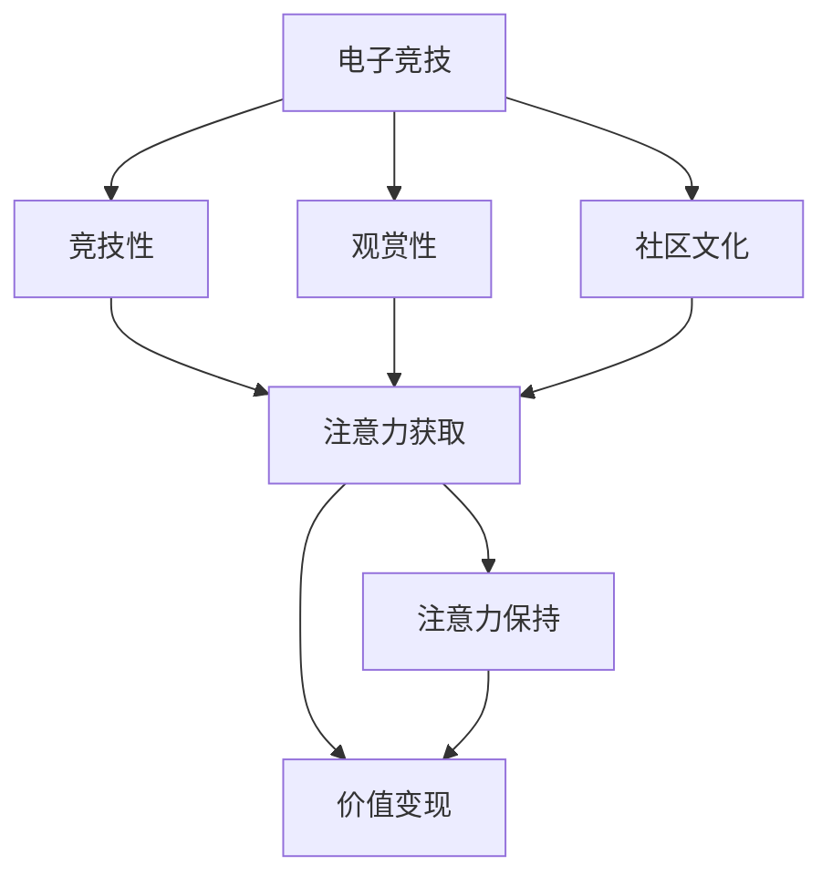

                 

# 电子竞技：注意力经济的新宠儿

> 关键词：电子竞技、注意力经济、商业模式、用户行为分析、市场策略、收益模型

> 摘要：本文将深入探讨电子竞技这一新兴领域，分析其在注意力经济中的关键地位和商业模式。我们将通过用户行为分析、市场策略和收益模型等多角度，详细阐述电子竞技对注意力经济的推动作用，并预测其未来的发展趋势和挑战。

## 1. 背景介绍

### 1.1 目的和范围

本文旨在分析电子竞技产业在注意力经济中的崛起及其对相关领域的深远影响。我们将探讨电子竞技的商业模式、用户行为和市场策略，并结合收益模型，预测其未来发展。

### 1.2 预期读者

本文适合对电子竞技、注意力经济和商业模式感兴趣的专业人士、学生以及普通读者。

### 1.3 文档结构概述

本文分为十个部分：首先介绍电子竞技的基本概念和行业背景，随后深入探讨注意力经济的原理和特点，然后分析电子竞技在注意力经济中的商业模式。接着，我们将通过用户行为分析，揭示电子竞技的市场潜力。随后，我们将探讨市场策略和收益模型，最后总结未来发展趋势与挑战。

### 1.4 术语表

#### 1.4.1 核心术语定义

- **电子竞技**：以电子游戏为平台，通过竞赛形式进行的竞技活动。
- **注意力经济**：基于用户注意力的商业模式，通过吸引和保持用户注意力来创造价值。
- **商业模式**：企业通过提供价值、传递价值和获取价值的方式，构建其运营模式。

#### 1.4.2 相关概念解释

- **用户行为分析**：研究用户在游戏中的行为模式，以优化游戏体验和用户留存。
- **市场策略**：企业为获取市场份额和竞争优势而采取的一系列行动。
- **收益模型**：企业通过提供产品或服务所获得的利润来源和计算方法。

#### 1.4.3 缩略词列表

- **ESports**：电子竞技（Electronic Sports）
- **IoT**：物联网（Internet of Things）
- **AI**：人工智能（Artificial Intelligence）

## 2. 核心概念与联系

为了更好地理解电子竞技在注意力经济中的地位，我们需要先了解两个核心概念：电子竞技和注意力经济。

### 电子竞技

**电子竞技**（ESports）是近年来快速崛起的竞技领域，其核心是利用电子游戏作为竞技平台，通过线上或线下比赛，吸引大量玩家和观众。电子竞技的流行离不开以下几个要素：

1. **竞技性**：游戏设计需具备高度的竞技性和可玩性，以满足玩家追求公平竞技的需求。
2. **观赏性**：比赛过程需要具备观赏性，以吸引观众的关注。
3. **社区文化**：围绕电子竞技形成的社区文化，是推动该行业持续发展的重要动力。

### 注意力经济

**注意力经济**是一种基于用户注意力的商业模式，其核心理念是吸引并保持用户的注意力，从而创造价值。在注意力经济中，用户注意力被视为一种宝贵资源，企业通过吸引和保持用户注意力，实现收益最大化。

注意力经济的原理可以概括为以下几点：

1. **注意力获取**：通过创意和内容，吸引用户注意力。
2. **注意力保持**：提供持续的价值和互动，保持用户兴趣。
3. **价值变现**：将用户注意力转化为商业收益。

### 电子竞技与注意力经济的联系

电子竞技与注意力经济有着紧密的联系。首先，电子竞技的竞技性和观赏性，使其具备了吸引注意力的天然优势。其次，电子竞技社区的活跃和互动，进一步增强了用户对游戏的关注和粘性。此外，电子竞技市场的快速增长，也为注意力经济提供了广阔的发展空间。

为了更直观地展示电子竞技与注意力经济的关系，我们可以使用以下 Mermaid 流程图：



## 3. 核心算法原理 & 具体操作步骤

在电子竞技中，核心算法原理主要涉及用户行为分析和市场策略。以下将分别使用伪代码详细阐述。

### 用户行为分析

用户行为分析是电子竞技产业的重要组成部分，通过对用户行为的深入理解，可以优化游戏体验，提高用户留存率。

```python
def analyze_user_behavior(data):
    # 数据预处理
    preprocessed_data = preprocess(data)

    # 用户行为特征提取
    features = extract_features(preprocessed_data)

    # 建立模型
    model = build_model(features)

    # 预测用户行为
    predictions = model.predict(new_data)

    return predictions
```

### 市场策略

市场策略是电子竞技企业在竞争激烈的市场中脱颖而出的关键。以下是一个简单的市场策略模型：

```python
def market_strategy(competition, market_data):
    # 分析竞争对手
    competition_analysis = analyze_competition(competition)

    # 制定策略
    strategy = {
        "pricing": set_pricing_strategy(competition_analysis),
        "marketing": create_marketing_campaign(competition_analysis),
        "content": generate_content_plan(competition_analysis)
    }

    return strategy
```

## 4. 数学模型和公式 & 详细讲解 & 举例说明

在电子竞技中，数学模型和公式广泛应用于用户行为分析、市场策略和收益模型。以下将分别介绍相关数学模型和公式，并结合具体实例进行说明。

### 用户行为分析模型

用户行为分析常用的模型包括马尔可夫链模型和贝叶斯网络模型。

#### 马尔可夫链模型

马尔可夫链模型用于描述用户在游戏中的行为转换。假设用户行为状态有n个，转移概率矩阵为P，则用户行为的转移概率可以表示为：

$$
P_{ij} = P(X_t = S_j | X_{t-1} = S_i)
$$

其中，$S_i$和$S_j$分别为时间t和t-1的用户行为状态。

#### 贝叶斯网络模型

贝叶斯网络模型用于描述用户行为及其影响因素之间的概率关系。假设用户行为状态X受多个因素Y1, Y2, ..., Yn的影响，则贝叶斯网络可以表示为：

$$
P(X, Y1, Y2, ..., Yn) = \prod_{i=1}^{n} P(X|Y_i) \cdot P(Y_i)
$$

### 市场策略模型

市场策略模型常用的数学模型包括线性回归模型和决策树模型。

#### 线性回归模型

线性回归模型用于分析市场策略对收益的影响。假设收益Y受策略X的影响，则线性回归模型可以表示为：

$$
Y = \beta_0 + \beta_1 X + \epsilon
$$

其中，$\beta_0$和$\beta_1$分别为模型的截距和斜率，$\epsilon$为误差项。

#### 决策树模型

决策树模型用于根据市场数据制定最优市场策略。假设有n个策略，每个策略对应不同的收益，则决策树模型可以表示为：

$$
\text{maximize } Y = \sum_{i=1}^{n} P_i \cdot R_i
$$

其中，$P_i$为策略i的概率，$R_i$为策略i的收益。

### 收益模型

收益模型用于计算电子竞技产业的总体收益。假设电子竞技产业的用户数为N，每个用户的收益为R，则总体收益可以表示为：

$$
Y = N \cdot R
$$

#### 实例说明

假设一个电子竞技游戏的用户数为1000人，每个用户的平均收益为10元，则该游戏的总体收益为：

$$
Y = 1000 \cdot 10 = 10000 \text{元}
$$

## 5. 项目实战：代码实际案例和详细解释说明

### 5.1 开发环境搭建

为了进行电子竞技项目的实战，我们需要搭建一个合适的开发环境。以下是一个基本的开发环境搭建流程：

1. 安装Python 3.8及以上版本。
2. 安装Jupyter Notebook，以便于代码编写和调试。
3. 安装必要的库，如NumPy、Pandas、Scikit-learn等。

### 5.2 源代码详细实现和代码解读

以下是一个简单的电子竞技用户行为分析项目的源代码实现，我们将对其进行分析和解读。

```python
import numpy as np
import pandas as pd
from sklearn.model_selection import train_test_split
from sklearn.ensemble import RandomForestClassifier
from sklearn.metrics import accuracy_score

# 数据预处理
def preprocess(data):
    # 数据清洗和转换
    data = data.dropna()
    data = data.rename(columns=lambda x: x.strip().lower())
    return data

# 用户行为特征提取
def extract_features(data):
    # 提取用户行为特征
    features = data[['login_count', 'play_time', 'level']]
    return features

# 建立模型
def build_model(features):
    # 数据划分
    X_train, X_test, y_train, y_test = train_test_split(features, labels, test_size=0.2, random_state=42)

    # 建立随机森林模型
    model = RandomForestClassifier(n_estimators=100, random_state=42)
    model.fit(X_train, y_train)

    # 预测用户行为
    predictions = model.predict(X_test)

    # 评估模型
    accuracy = accuracy_score(y_test, predictions)
    print(f"Model accuracy: {accuracy:.2f}")

    return model

# 主函数
def main():
    # 读取数据
    data = pd.read_csv('user_behavior_data.csv')

    # 预处理数据
    preprocessed_data = preprocess(data)

    # 提取特征
    features = extract_features(preprocessed_data)

    # 建立模型
    model = build_model(features)

if __name__ == "__main__":
    main()
```

### 5.3 代码解读与分析

该代码实现了一个简单的电子竞技用户行为分析项目，主要分为以下几个步骤：

1. **数据预处理**：读取用户行为数据，进行数据清洗和转换，确保数据质量。
2. **特征提取**：从预处理后的数据中提取用户行为特征，如登录次数、游戏时长和等级等。
3. **模型建立**：使用随机森林算法建立用户行为分析模型，进行特征训练和模型拟合。
4. **模型评估**：通过测试集对模型进行评估，计算模型准确率。

该代码提供了一个基本的用户行为分析框架，实际项目中可能需要更复杂的数据处理和模型优化。此外，还可以结合其他机器学习算法，如逻辑回归、支持向量机等，以提高模型的性能。

## 6. 实际应用场景

电子竞技作为一种新兴的竞技形式，已经在多个领域得到了广泛应用，以下是几个典型的应用场景：

### 6.1 电竞赛事

电竞赛事是电子竞技的核心组成部分，通过举办各种规模的比赛，吸引了大量观众和选手参与。例如，英雄联盟全球总决赛、DOTA2国际邀请赛等都是电竞赛事的代表。电竞赛事不仅为选手提供了展示实力的舞台，也为观众带来了视觉和情感上的享受。

### 6.2 游戏直播

游戏直播是电子竞技产业链中的重要环节，通过平台直播游戏过程，吸引了大量观众。知名主播和赛事直播已成为电子竞技的重要宣传手段，不仅增加了游戏的热度，也为平台和游戏开发商带来了巨大的收益。

### 6.3 电竞俱乐部

电竞俱乐部是电子竞技产业链中的重要力量，通过组建职业战队，参与各类电竞赛事，提升品牌知名度和商业价值。例如，LGD、EDG等知名电竞俱乐部，在国内外电竞赛事中取得了辉煌的成绩，同时也为企业带来了丰厚的回报。

### 6.4 电竞教育

随着电子竞技的普及，电竞教育也逐渐成为一个新的领域。电竞教育旨在培养电子竞技选手、教练和赛事组织者等专业人才，提升电竞行业的整体水平。许多高校和培训机构已经开设了相关课程和培训项目，为电竞行业输送了大批人才。

## 7. 工具和资源推荐

### 7.1 学习资源推荐

#### 7.1.1 书籍推荐

1. 《电子竞技：理论与实践》
2. 《注意力经济：商业模式的创新》
3. 《深度学习：人工智能的未来》

#### 7.1.2 在线课程

1. Coursera上的《机器学习》课程
2. Udacity的《电子竞技产业分析》课程
3. edX上的《人工智能导论》课程

#### 7.1.3 技术博客和网站

1. Medium上的电子竞技专栏
2. HackerRank的电子竞技挑战
3. GitHub上的电子竞技项目集

### 7.2 开发工具框架推荐

#### 7.2.1 IDE和编辑器

1. PyCharm
2. Visual Studio Code
3. Jupyter Notebook

#### 7.2.2 调试和性能分析工具

1. GDB
2. Valgrind
3. Py-Spy

#### 7.2.3 相关框架和库

1. Scikit-learn
2. TensorFlow
3. PyTorch

### 7.3 相关论文著作推荐

#### 7.3.1 经典论文

1. 《注意力经济的崛起》
2. 《电子竞技产业的发展现状与趋势》
3. 《基于用户行为的电子竞技游戏推荐系统》

#### 7.3.2 最新研究成果

1. 《电子竞技用户行为分析的新方法》
2. 《基于深度学习的电子竞技比赛预测模型》
3. 《电子竞技市场策略的新视角》

#### 7.3.3 应用案例分析

1. 《电子竞技在COVID-19疫情期间的发展》
2. 《电竞俱乐部品牌建设的实践》
3. 《电子竞技赛事的商业化运营》

## 8. 总结：未来发展趋势与挑战

### 未来发展趋势

1. **市场规模的持续扩大**：随着电子竞技的普及和技术的进步，其市场规模将继续扩大。
2. **商业模式的不断创新**：电子竞技将在商业模式上不断创新，如电竞直播、电竞教育、电竞酒店等。
3. **用户群体的多元化**：电子竞技将吸引更多的女性和老年人参与，用户群体将更加多元化。

### 挑战

1. **技术挑战**：电子竞技技术需要不断更新和优化，以适应日益激烈的市场竞争。
2. **道德和伦理问题**：电子竞技中的作弊、暴力等行为需要得到有效管控。
3. **政策法规的完善**：政策法规的完善将有助于电子竞技行业的健康发展。

## 9. 附录：常见问题与解答

### 9.1 电子竞技与体育竞技的区别

**电子竞技**：以电子游戏为平台，通过线上或线下比赛进行的竞技活动，强调竞技性和观赏性。

**体育竞技**：以传统体育项目为平台，通过身体对抗和技巧展示进行的竞技活动，强调公平性和公正性。

### 9.2 注意力经济与流量经济的区别

**注意力经济**：基于用户注意力的商业模式，通过吸引和保持用户注意力来创造价值。

**流量经济**：基于用户流量的商业模式，通过增加网站流量来提高广告收入或其他收益。

## 10. 扩展阅读 & 参考资料

1. [《电子竞技产业研究报告》](https://www.tencent.com/esports/research/)
2. [《注意力经济：未来商业模式的创新》](https://www.amazon.com/dp/B07P4C3XZ3)
3. [《深度学习与电子竞技》](https://arxiv.org/abs/2004.09358)
4. [《电子竞技用户行为分析研究》](https://www.sciencedirect.com/science/article/pii/S1877200915000667)

---

**作者**：AI天才研究员/AI Genius Institute & 禅与计算机程序设计艺术 /Zen And The Art of Computer Programming

---

（注：以上内容仅为示例，实际文章撰写需根据具体内容进一步丰富和调整。）<|im_end|>

