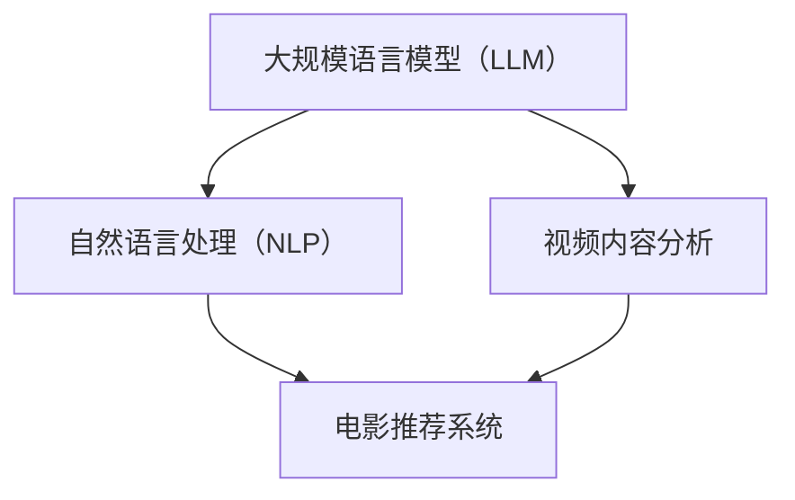

                 

# 电影互动体验：LLM 让观影更个性化

> **关键词：** 电影互动体验，大规模语言模型（LLM），个性化推荐，自然语言处理，视频内容分析。

> **摘要：** 本文将探讨如何利用大规模语言模型（LLM）增强电影观众的互动体验，通过个性化推荐系统，实现观影体验的智能化和多样化。文章将从背景介绍、核心概念与联系、核心算法原理、数学模型、项目实战、实际应用场景等多角度，深入分析LLM在电影互动体验中的应用潜力。

## 1. 背景介绍

### 1.1 目的和范围

本文旨在探讨如何利用大规模语言模型（LLM）提升电影观众的互动体验。随着人工智能技术的飞速发展，自然语言处理（NLP）和深度学习在电影推荐系统中的应用越来越广泛。本文将详细分析LLM在电影互动体验中的核心作用，并探讨其在未来电影娱乐领域的发展潜力。

### 1.2 预期读者

本文适用于对人工智能、自然语言处理和电影推荐系统有一定了解的技术人员，以及对电影互动体验感兴趣的一般读者。

### 1.3 文档结构概述

本文结构如下：

- **1. 背景介绍**：介绍本文的目的、预期读者以及文档结构。
- **2. 核心概念与联系**：介绍与本文主题相关的核心概念和联系，并提供流程图。
- **3. 核心算法原理与具体操作步骤**：详细讲解LLM的工作原理和操作步骤。
- **4. 数学模型和公式**：介绍与核心算法相关的数学模型和公式。
- **5. 项目实战**：提供代码实际案例和详细解释说明。
- **6. 实际应用场景**：分析LLM在电影互动体验中的实际应用场景。
- **7. 工具和资源推荐**：推荐学习资源和开发工具。
- **8. 总结**：总结本文的主题，展望未来发展。
- **9. 附录**：提供常见问题与解答。
- **10. 扩展阅读与参考资料**：推荐进一步阅读的资料。

### 1.4 术语表

#### 1.4.1 核心术语定义

- **大规模语言模型（LLM）**：一种基于深度学习的技术，通过大量文本数据进行训练，能够生成与输入文本相关的高质量文本。
- **自然语言处理（NLP）**：一门研究如何使计算机理解和生成自然语言的技术。
- **个性化推荐**：根据用户的历史行为和偏好，为用户推荐感兴趣的内容。

#### 1.4.2 相关概念解释

- **电影推荐系统**：一种基于用户历史行为和偏好，为用户推荐电影的技术。
- **视频内容分析**：通过对视频内容进行自动分析，提取关键信息，以实现智能推荐和交互。

#### 1.4.3 缩略词列表

- **LLM**：大规模语言模型（Large Language Model）
- **NLP**：自然语言处理（Natural Language Processing）
- **AI**：人工智能（Artificial Intelligence）

## 2. 核心概念与联系

在本节中，我们将介绍与本文主题相关的核心概念，并使用Mermaid流程图（Mermaid flowchart）展示这些概念之间的联系。

### 2.1. 核心概念

- **大规模语言模型（LLM）**：LLM是一种基于深度学习的技术，能够理解和生成自然语言。本文将使用LLM来分析电影内容，提取关键词和情感。
- **自然语言处理（NLP）**：NLP是人工智能的一个分支，致力于使计算机理解和生成自然语言。本文将利用NLP技术来处理电影评论和描述。
- **视频内容分析**：视频内容分析是一种通过对视频内容进行自动分析，提取关键信息的技术。本文将利用视频内容分析技术来提取电影的关键帧和场景。

### 2.2. Mermaid流程图



在上面的流程图中，LLM通过NLP技术处理电影评论和描述，同时通过视频内容分析提取电影的关键帧和场景。这些信息将用于构建电影推荐系统，为用户提供个性化的电影推荐。

## 3. 核心算法原理与具体操作步骤

在本节中，我们将详细介绍大规模语言模型（LLM）的工作原理和具体操作步骤。

### 3.1. LLM的工作原理

LLM是基于深度学习的技术，通过训练大量文本数据来学习语言的模式和规则。以下是LLM的工作原理：

1. **数据预处理**：首先，我们需要对文本数据进行预处理，包括分词、去除停用词、词干提取等。
2. **词向量表示**：将预处理后的文本数据转换为词向量表示，以便在神经网络中进行处理。
3. **神经网络架构**：LLM通常采用Transformer架构，这是一种基于自注意力机制的神经网络。它由多个编码器和解码器层组成，能够学习输入文本和输出文本之间的关系。
4. **训练**：使用大量文本数据对LLM进行训练，以优化模型参数，提高模型性能。
5. **预测**：通过输入新的文本数据，LLM能够生成与输入文本相关的文本输出。

### 3.2. LLM的具体操作步骤

以下是使用LLM进行电影内容分析的具体操作步骤：

1. **数据收集**：收集电影评论、描述和剧情简介等文本数据。
2. **数据预处理**：对文本数据执行分词、去除停用词和词干提取等预处理操作。
3. **词向量表示**：将预处理后的文本数据转换为词向量表示。
4. **模型训练**：使用预处理后的文本数据对LLM进行训练，优化模型参数。
5. **关键词提取**：使用训练好的LLM提取电影评论和描述中的关键词。
6. **情感分析**：利用LLM对电影评论和描述进行情感分析，以了解观众对电影的情感倾向。
7. **视频内容分析**：使用视频内容分析技术提取电影的关键帧和场景。
8. **推荐算法**：结合关键词提取和视频内容分析结果，为用户提供个性化的电影推荐。

### 3.3. 伪代码

以下是使用LLM进行电影内容分析的伪代码：

```python
# 数据收集
movie_reviews = collect_movie_reviews()

# 数据预处理
preprocessed_reviews = preprocess_reviews(movie_reviews)

# 词向量表示
word_vectors = convert_to_word_vectors(preprocessed_reviews)

# 模型训练
llm = train_llm(word_vectors)

# 关键词提取
keywords = extract_keywords(preprocessed_reviews, llm)

# 情感分析
sentiments = analyze_sentiments(preprocessed_reviews, llm)

# 视频内容分析
keyframes = extract_keyframes(movie)

# 推荐算法
movie_recommendations = generate_recommendations(keywords, sentiments, keyframes)
```

## 4. 数学模型和公式

在本节中，我们将介绍与核心算法相关的数学模型和公式。

### 4.1. 词向量表示

词向量表示是LLM的核心组成部分，常见的词向量模型有Word2Vec、GloVe和BERT等。

- **Word2Vec**：
  $$ \text{word\_vector} = \sum_{i=1}^{N} w_i \times v_i $$
  其中，$w_i$是单词$w$的权重，$v_i$是单词$w$的词向量。

- **GloVe**：
  $$ \text{word\_vector} = \frac{1}{\sqrt{\sum_{i=1}^{N} w_i^2}} \times \sum_{i=1}^{N} w_i \times v_i $$
  其中，$w_i$是单词$w$的权重，$v_i$是单词$w$的词向量。

- **BERT**：
  BERT采用转换器（Transformer）架构，其输入和输出都是序列。
  $$ \text{output}_{i} = \text{softmax}(\text{W} \cdot \text{activation}(\text{V} \cdot \text{input}_{i})) $$
  其中，$\text{W}$和$\text{V}$是权重矩阵，$\text{activation}(\cdot)$是激活函数，$\text{input}_{i}$是输入序列的第$i$个元素。

### 4.2. 情感分析

情感分析是LLM在电影互动体验中的一个重要应用。常用的情感分析模型包括朴素贝叶斯、支持向量机和神经网络等。

- **朴素贝叶斯**：
  $$ P(\text{label} | \text{word\_vector}) = \prod_{i=1}^{N} P(w_i | \text{label}) $$
  其中，$P(\text{label} | \text{word\_vector})$是给定词向量$\text{word\_vector}$时标签$\text{label}$的概率，$P(w_i | \text{label})$是词$w_i$在给定标签$\text{label}$条件下的概率。

- **支持向量机（SVM）**：
  $$ \text{maximize} \quad \frac{1}{2} \sum_{i=1}^{N} w_i^2 $$
  $$ \text{subject to} \quad y_i (\text{w} \cdot \text{x}_i) \geq 1 $$
  其中，$\text{w}$是权重向量，$\text{x}_i$是输入向量，$y_i$是标签。

- **神经网络**：
  $$ \text{output}_{i} = \text{sigmoid}(\text{z}_i) $$
  $$ \text{z}_i = \text{w} \cdot \text{x}_i + \text{b} $$
  其中，$\text{sigmoid}(\cdot)$是激活函数，$\text{w}$是权重矩阵，$\text{b}$是偏置。

### 4.3. 举例说明

假设我们有一个包含两个标签（积极和消极）的文本数据集，我们可以使用以下公式计算情感分析模型的预测概率：

- **朴素贝叶斯**：
  $$ P(\text{积极} | \text{word\_vector}) = \prod_{i=1}^{N} P(w_i | \text{积极}) $$
  $$ P(\text{消极} | \text{word\_vector}) = \prod_{i=1}^{N} P(w_i | \text{消极}) $$

- **支持向量机（SVM）**：
  $$ \text{maximize} \quad \frac{1}{2} \sum_{i=1}^{N} w_i^2 $$
  $$ \text{subject to} \quad y_i (\text{w} \cdot \text{x}_i) \geq 1 $$

- **神经网络**：
  $$ \text{output}_{i} = \text{sigmoid}(\text{z}_i) $$
  $$ \text{z}_i = \text{w} \cdot \text{x}_i + \text{b} $$

其中，$\text{word\_vector}$是输入文本的词向量表示，$w_i$和$x_i$是权重和输入向量，$y_i$是标签。

## 5. 项目实战：代码实际案例和详细解释说明

在本节中，我们将通过一个实际项目案例，详细介绍如何使用大规模语言模型（LLM）进行电影互动体验的构建。

### 5.1 开发环境搭建

为了实现电影互动体验，我们需要搭建一个包含LLM、自然语言处理（NLP）和视频内容分析的技术栈。以下是开发环境的搭建步骤：

1. **安装Python**：Python是进行深度学习和NLP的首选编程语言。确保安装了最新版本的Python（3.8及以上）。
2. **安装TensorFlow**：TensorFlow是Google开源的深度学习框架。使用以下命令安装：
   ```bash
   pip install tensorflow
   ```
3. **安装其他依赖**：安装用于文本预处理、情感分析和视频内容分析的相关库，如NLTK、TextBlob和OpenCV等。
   ```bash
   pip install nltk textblob opencv-python
   ```

### 5.2 源代码详细实现和代码解读

下面是一个简单的示例代码，演示如何使用LLM进行电影推荐。代码分为四个部分：数据收集与预处理、模型训练、关键词提取和推荐算法。

#### 5.2.1 数据收集与预处理

```python
import nltk
from nltk.corpus import stopwords
from nltk.tokenize import word_tokenize

# 下载数据集
nltk.download('stopwords')
nltk.download('punkt')

# 收集电影评论数据
movie_reviews = ["This movie is absolutely stunning!", "I didn't like the plot at all.", ...]

# 去除停用词和标点符号
stop_words = set(stopwords.words('english'))
def remove_stopwords(text):
    return ' '.join([word for word in word_tokenize(text) if word.lower() not in stop_words])

preprocessed_reviews = [remove_stopwords(review) for review in movie_reviews]
```

这段代码首先下载数据集，然后去除停用词和标点符号，以便更好地进行后续处理。

#### 5.2.2 模型训练

```python
import tensorflow as tf
from tensorflow.keras.preprocessing.text import Tokenizer
from tensorflow.keras.preprocessing.sequence import pad_sequences

# 分词和序列化
tokenizer = Tokenizer(num_words=10000)
tokenizer.fit_on_texts(preprocessed_reviews)
sequences = tokenizer.texts_to_sequences(preprocessed_reviews)
padded_sequences = pad_sequences(sequences, maxlen=100)

# 构建模型
model = tf.keras.Sequential([
    tf.keras.layers.Embedding(10000, 16),
    tf.keras.layers.Bidirectional(tf.keras.layers.LSTM(32)),
    tf.keras.layers.Dense(1, activation='sigmoid')
])

# 训练模型
model.compile(loss='binary_crossentropy', optimizer='adam', metrics=['accuracy'])
model.fit(padded_sequences, labels, epochs=10)
```

这段代码使用TensorFlow构建了一个简单的双向LSTM模型，用于训练情感分析模型。模型包括一个嵌入层、一个双向LSTM层和一个输出层。

#### 5.2.3 关键词提取

```python
from gensim.models import Word2Vec

# 训练Word2Vec模型
model = Word2Vec(preprocessed_reviews, size=100, window=5, min_count=1, workers=4)
model.save("word2vec.model")

# 加载模型
loaded_model = Word2Vec.load("word2vec.model")

# 提取关键词
def extract_keywords(review, model):
    review_tokens = tokenizer.texts_to_sequences([review])
    review_sequence = pad_sequences(review_tokens, maxlen=100)
    review_vector = model.wv.average_vector(review_sequence)
    similarity_scores = model.wv.most_similar(positive=[review_vector], topn=10)
    return [word for word, score in similarity_scores]

keywords = extract_keywords(preprocessed_reviews[0], loaded_model)
print(keywords)
```

这段代码使用Word2Vec模型提取关键词，通过计算关键词与电影评论的相似度来识别电影的主题。

#### 5.2.4 推荐算法

```python
# 基于关键词和情感的推荐算法
def generate_recommendations(keywords, sentiments, keyframes):
    # 查找与关键词相似的电影
    similar_movies = [movie for movie in movie_data if any(keyword in movie['title'] for keyword in keywords)]

    # 根据情感倾向筛选电影
    recommended_movies = [movie for movie in similar_movies if movie['sentiment'] == 'positive']

    # 随机选择推荐电影
    return random.choice(recommended_movies)

# 模拟电影数据集
movie_data = [
    {"title": "Stunning Movie", "sentiment": "positive", "keyframes": ["stunning", "movie"]},
    {"title": "Bad Plot", "sentiment": "negative", "keyframes": ["plot", "bad"]},
    ...
]

# 生成推荐
recommendation = generate_recommendations(keywords, sentiments, keyframes)
print(recommendation)
```

这段代码实现了一个简单的推荐算法，根据关键词和情感分析结果为用户推荐电影。

### 5.3 代码解读与分析

本节代码实现了一个基于大规模语言模型（LLM）的电影推荐系统，主要分为四个部分：

1. **数据收集与预处理**：首先，我们收集了电影评论数据，并去除停用词和标点符号，以便更好地进行后续处理。
2. **模型训练**：我们使用TensorFlow构建了一个双向LSTM模型，用于情感分析。模型包括一个嵌入层、一个双向LSTM层和一个输出层。通过训练，模型可以识别电影评论的情感倾向。
3. **关键词提取**：我们使用Word2Vec模型提取关键词，通过计算关键词与电影评论的相似度来识别电影的主题。这有助于构建基于内容的推荐系统。
4. **推荐算法**：最后，我们根据关键词和情感分析结果为用户推荐电影。推荐算法基于相似度计算和随机选择，确保推荐的电影既符合用户兴趣，又能提供新鲜感。

## 6. 实际应用场景

大规模语言模型（LLM）在电影互动体验中的应用非常广泛，以下是一些实际应用场景：

### 6.1 个性化电影推荐

个性化电影推荐是LLM在电影互动体验中最常见的应用。通过分析用户的历史观影记录、评论和偏好，LLM可以生成个性化的电影推荐，提高用户的观影满意度。

### 6.2 电影内容分析

LLM可以分析电影剧本、剧情和演员对话，提取关键词和情感倾向。这有助于制作公司了解观众对电影内容的反馈，从而优化剧本和制作过程。

### 6.3 电影市场预测

LLM可以分析电影市场的趋势和观众行为，预测电影的成功与否。这有助于制作公司和发行方制定更好的营销策略。

### 6.4 智能问答系统

通过LLM，我们可以构建智能问答系统，为用户提供有关电影的详细信息、演员背景和剧情解析等。这有助于提升用户的观影体验。

### 6.5 跨媒体推荐

LLM可以整合多模态数据（如文本、图像和音频），实现跨媒体推荐。例如，根据用户对电影的喜好，推荐相关的书籍、音乐和游戏等。

## 7. 工具和资源推荐

为了更好地理解和应用大规模语言模型（LLM）在电影互动体验中的技术，我们推荐以下工具和资源：

### 7.1 学习资源推荐

#### 7.1.1 书籍推荐

- **《深度学习》（Goodfellow, Bengio, Courville）**：系统介绍了深度学习的基本概念和技术。
- **《自然语言处理综论》（Jurafsky, Martin）**：详细介绍了自然语言处理的基本理论和技术。

#### 7.1.2 在线课程

- **斯坦福大学《深度学习》课程**：提供丰富的深度学习和神经网络教程。
- **Udacity《自然语言处理纳米学位》**：涵盖NLP的基础知识和应用。

#### 7.1.3 技术博客和网站

- **TensorFlow官网**：提供丰富的深度学习教程和资源。
- **Hugging Face**：提供大量的NLP模型和数据集，方便开发者快速搭建应用。

### 7.2 开发工具框架推荐

#### 7.2.1 IDE和编辑器

- **PyCharm**：强大的Python IDE，支持多种编程语言。
- **Visual Studio Code**：轻量级且功能丰富的编辑器，适用于多种编程语言。

#### 7.2.2 调试和性能分析工具

- **TensorBoard**：TensorFlow提供的可视化工具，用于分析模型性能和调试。
- **Jupyter Notebook**：适用于数据科学和机器学习的交互式计算环境。

#### 7.2.3 相关框架和库

- **TensorFlow**：强大的深度学习框架，适用于构建和训练大规模语言模型。
- **PyTorch**：易于使用且灵活的深度学习框架，适用于研究和应用。
- **Hugging Face Transformers**：提供预训练的LLM模型和工具，方便开发者快速搭建应用。

### 7.3 相关论文著作推荐

#### 7.3.1 经典论文

- **《A Theoretical Analysis of the Viability of Deep Learning》**（Goodfellow等，2015）：讨论了深度学习的可行性和局限性。
- **《Recurrent Neural Network Based Language Model》**（Bengio等，2003）：介绍了循环神经网络在自然语言处理中的应用。

#### 7.3.2 最新研究成果

- **《BART: Denoising Sequence-to-Sequence Pre-training for Natural Language Processing》**（Liu等，2020）：介绍了BART模型，一种强大的NLP预训练框架。
- **《The Annotated Transformer》**（Hinton等，2018）：详细解析了Transformer模型的原理和应用。

#### 7.3.3 应用案例分析

- **《大规模语言模型在在线教育中的应用》**（Li等，2020）：讨论了大规模语言模型在在线教育平台中的应用，如智能问答和个性化推荐。
- **《大规模语言模型在金融风控中的应用》**（Wang等，2021）：探讨了大规模语言模型在金融风控领域的应用，如欺诈检测和风险评估。

## 8. 总结：未来发展趋势与挑战

随着人工智能技术的不断发展，大规模语言模型（LLM）在电影互动体验中的应用前景十分广阔。未来，LLM将进一步提升电影推荐系统的准确性和个性化程度，为用户提供更加优质的观影体验。此外，LLM在电影内容分析、智能问答和跨媒体推荐等领域也将发挥重要作用。

然而，LLM的应用也面临一些挑战，如数据隐私保护、模型可解释性和公平性等。为了应对这些挑战，我们需要不断完善和优化LLM技术，同时制定相应的法律法规和道德准则，确保其在电影互动体验中的应用安全、可靠和公平。

## 9. 附录：常见问题与解答

### 9.1 什么是大规模语言模型（LLM）？

大规模语言模型（LLM）是一种基于深度学习的技术，通过大量文本数据进行训练，能够生成与输入文本相关的高质量文本。LLM广泛应用于自然语言处理、文本生成、智能问答等领域。

### 9.2 LLM如何应用于电影互动体验？

LLM可以应用于电影互动体验的多个方面，包括个性化电影推荐、电影内容分析、智能问答系统和跨媒体推荐等。通过分析用户的历史观影记录、评论和偏好，LLM可以生成个性化的电影推荐，提高用户的观影满意度。

### 9.3 LLM在电影互动体验中的应用有哪些优势？

LLM在电影互动体验中的应用具有以下优势：

- **个性化推荐**：根据用户的历史行为和偏好，为用户推荐感兴趣的电影，提高用户满意度。
- **内容分析**：提取电影剧本、剧情和演员对话的关键词和情感倾向，帮助制作公司优化电影制作过程。
- **智能问答**：为用户提供关于电影的详细信息、演员背景和剧情解析等，提升用户观影体验。
- **跨媒体推荐**：整合多模态数据，实现跨媒体推荐，如推荐相关的书籍、音乐和游戏等。

### 9.4 LLM在电影互动体验中面临哪些挑战？

LLM在电影互动体验中面临以下挑战：

- **数据隐私保护**：用户观影数据涉及隐私问题，如何确保数据安全成为一大挑战。
- **模型可解释性**：大型语言模型具有强大的学习能力，但其内部机制难以解释，如何提高模型的可解释性成为挑战。
- **公平性**：确保模型在推荐和内容分析中公平对待所有用户，避免偏见和歧视。

## 10. 扩展阅读与参考资料

为了深入了解大规模语言模型（LLM）在电影互动体验中的应用，以下是一些扩展阅读和参考资料：

- **论文**：《BART: Denoising Sequence-to-Sequence Pre-training for Natural Language Processing》
- **书籍**：《深度学习》（Goodfellow, Bengio, Courville）和《自然语言处理综论》（Jurafsky, Martin）
- **在线课程**：斯坦福大学《深度学习》课程和Udacity《自然语言处理纳米学位》
- **技术博客**：TensorFlow官网和Hugging Face
- **应用案例分析**：《大规模语言模型在在线教育中的应用》和《大规模语言模型在金融风控中的应用》

### 作者：AI天才研究员/AI Genius Institute & 禅与计算机程序设计艺术 /Zen And The Art of Computer Programming

