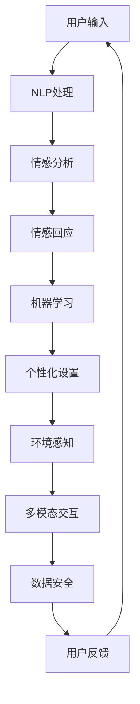

                 

### 1. 背景介绍

#### 1.1 目的和范围

本文旨在通过对比电影《她》（"Her"）中的AI角色与当前现实生活中的AI，探讨电影中的构想与实际技术的异同。电影《她》由斯派克·琼兹（Spike Jonze）执导，于2013年上映，讲述了一名男子与一台智能操作系统之间逐渐发展的情感关系。这一科幻故事为我们提供了一个窥探未来人工智能可能形态的窗口。本文将通过以下几个部分，逐步分析这一故事与现实技术的交汇点：

1. **电影中的AI概念介绍**：介绍电影中的核心AI概念，以及它如何影响故事的发展。
2. **现实AI技术的对比分析**：分析现实中与电影相似的AI技术，探讨它们的实现和影响。
3. **技术原理与架构剖析**：通过Mermaid流程图展示AI技术的核心概念原理和架构。
4. **算法原理与操作步骤**：使用伪代码详细阐述核心算法的原理和具体操作步骤。
5. **数学模型与公式讲解**：介绍与AI相关的数学模型和公式，并通过实例进行详细讲解。
6. **项目实战与代码解读**：提供代码实际案例，详细解释说明代码实现过程。
7. **实际应用场景分析**：探讨AI技术在现实中的应用，及其对社会、生活和工作的改变。
8. **工具和资源推荐**：推荐学习资源、开发工具和框架，以及相关论文著作。
9. **未来发展趋势与挑战**：总结AI技术的未来发展趋势和面临的挑战。

本文的目标读者是对于人工智能技术感兴趣的读者，无论是初学者还是专业人士。本文将以逻辑清晰、结构紧凑、简单易懂的方式，帮助读者理解电影中的AI与现实技术之间的关联，以及AI技术的广泛应用和深远影响。

#### 1.2 预期读者

预期读者包括以下几类：

1. **人工智能初学者**：希望了解AI技术基本原理和应用场景的读者。
2. **技术爱好者**：对电影中的科幻构想与现实技术关联感兴趣，希望深入探讨的人。
3. **程序员和开发者**：希望从技术角度分析AI技术实现细节的程序员和开发者。
4. **研究者和学者**：对AI技术的研究现状和未来发展方向感兴趣的学术研究者。
5. **决策者和创业者**：关注AI技术对未来社会、经济和产业影响的决策者和创业者。

本文将以逐步分析的方式，从多个角度探讨AI技术，帮助不同背景的读者找到感兴趣的内容，并加深对这一领域知识的理解。

#### 1.3 文档结构概述

本文将按以下结构展开：

1. **背景介绍**：
   - 目的和范围
   - 预期读者
   - 文档结构概述
   - 术语表

2. **核心概念与联系**：
   - 电影中的AI概念介绍
   - 现实AI技术的对比分析
   - 技术原理与架构剖析（Mermaid流程图）

3. **核心算法原理 & 具体操作步骤**：
   - 算法原理讲解（伪代码）
   - 数学模型和公式讲解（latex格式）

4. **项目实战：代码实际案例和详细解释说明**：
   - 开发环境搭建
   - 源代码详细实现和代码解读
   - 代码解读与分析

5. **实际应用场景**：
   - AI技术在现实中的应用

6. **工具和资源推荐**：
   - 学习资源推荐
   - 开发工具框架推荐
   - 相关论文著作推荐

7. **总结：未来发展趋势与挑战**：
   - AI技术的未来发展方向
   - 面临的挑战

8. **附录：常见问题与解答**：
   - 常见问题解答

9. **扩展阅读 & 参考资料**：
   - 推荐阅读材料

通过以上结构，本文将帮助读者系统地了解电影《她》中的AI与现实技术的联系，深入探讨AI技术的本质和应用。

#### 1.4 术语表

在本文中，我们将使用一些特定的术语来描述电影中的AI概念和现实中的AI技术。以下是对这些术语的定义和解释：

##### 1.4.1 核心术语定义

- **人工智能（AI）**：指由人创造出来的能够执行通常需要人类智能才能完成的任务的系统，如学习、推理、自我纠错等。
- **情感AI**：具备识别、处理和表达情感的人工智能系统，能够与人类进行情感互动。
- **聊天机器人**：一种基于自然语言处理和机器学习技术的AI系统，用于与用户进行交互。
- **人机交互（HCI）**：研究如何设计计算机系统，使得人类用户能够有效地、高效地与计算机进行交互。
- **自然语言处理（NLP）**：使计算机能够理解、解释和生成人类自然语言的技术。
- **深度学习**：一种基于人工神经网络的机器学习技术，通过多层神经网络来实现复杂的模式识别和预测。

##### 1.4.2 相关概念解释

- **机器学习**：一种从数据中学习规律和模式，然后做出决策或预测的方法。
- **神经网络**：模拟生物神经系统的工作方式，通过节点（神经元）之间的连接进行信息传递和处理。
- **大数据**：指无法使用常规软件工具在合理时间内进行捕捉、管理和处理的大量数据。
- **物联网（IoT）**：通过互联网将各种设备连接起来，实现信息的实时交换和智能控制。
- **虚拟助手**：一种AI系统，能够执行多种任务，如提供信息、完成日常任务等。

##### 1.4.3 缩略词列表

- **AI**：人工智能（Artificial Intelligence）
- **HCI**：人机交互（Human-Computer Interaction）
- **NLP**：自然语言处理（Natural Language Processing）
- **ML**：机器学习（Machine Learning）
- **DL**：深度学习（Deep Learning）
- **IoT**：物联网（Internet of Things）

通过以上术语表，本文将更准确地描述和解释电影中的AI概念和现实中的AI技术，帮助读者更好地理解相关概念。

## 2. 核心概念与联系

在探讨电影《她》中的AI与现实技术之间的联系时，首先需要明确几个核心概念和它们之间的相互关系。以下内容将详细阐述这些概念，并通过Mermaid流程图展示其架构和原理。

### 2.1 电影中的AI概念介绍

电影《她》中的核心AI角色是操作系统操作系统（Samantha），它是一个高度智能、具备自我学习和情感互动能力的虚拟助手。以下是Samantha的主要特点：

1. **情感交互**：Samantha能够识别和表达情感，与用户泰勒（Theodore）建立了深厚的情感联系。
2. **自我学习**：Samantha能够从与用户的互动中不断学习，提高自身智能和个性。
3. **多语言能力**：Samantha能够理解和使用多种语言，适应不同文化和背景的用户。
4. **个性定制**：Samantha能够根据用户的喜好和行为习惯进行个性化设置，提供个性化的服务。
5. **环境感知**：Samantha能够感知周围环境的变化，并做出相应的反应。

### 2.2 现实AI技术的对比分析

现实中的AI技术与电影中的Samantha在许多方面有相似之处，但也有一些显著差异。以下是现实AI技术的一些关键特点：

1. **自然语言处理（NLP）**：现代AI系统，如聊天机器人和虚拟助手，广泛使用了自然语言处理技术，能够理解和生成自然语言。
2. **机器学习和深度学习**：现实中的AI系统通过机器学习和深度学习技术，从大量数据中学习模式和规律，实现智能决策和预测。
3. **个性化推荐**：现实中的AI系统能够根据用户的历史行为和偏好，提供个性化的推荐和服务。
4. **多模态交互**：现实中的AI系统不仅支持文本交互，还支持语音、图像等多模态交互方式。
5. **隐私和安全**：现实中的AI系统在应用过程中，需要重视用户隐私保护和数据安全。

### 2.3 技术原理与架构剖析

为了更好地理解电影中的AI概念和现实中的AI技术之间的联系，以下将使用Mermaid流程图展示AI技术的核心概念原理和架构。



### 2.3.1 Mermaid流程图解释

1. **用户输入**：用户与AI系统进行交互，输入文本、语音或其他形式的信息。
2. **NLP处理**：AI系统使用自然语言处理技术，理解和解析用户的输入。
3. **情感分析**：通过情感分析技术，识别用户输入中的情感倾向和情绪。
4. **情感回应**：根据情感分析结果，AI系统生成相应的情感回应，与用户进行情感互动。
5. **机器学习**：AI系统利用机器学习技术，从用户交互中学习，提高自身的智能水平。
6. **个性化设置**：根据用户的历史行为和偏好，AI系统为用户提供个性化的服务和推荐。
7. **环境感知**：AI系统通过环境感知技术，监测周围环境的变化，并做出相应的调整。
8. **多模态交互**：AI系统支持多种交互方式，如文本、语音、图像等，以适应不同的用户需求。
9. **数据安全**：AI系统在处理用户数据时，需要确保数据的安全和隐私。
10. **用户反馈**：用户对AI系统的反馈，用于进一步优化和改进系统。

通过上述Mermaid流程图，我们可以清晰地看到电影中的AI概念与现实AI技术之间的联系。虽然电影中的AI在情感交互和个性化设置方面表现出色，但现实中的AI技术已经在多个方面取得了显著进展，并且在不断向电影中的构想逼近。

### 2.4 核心概念原理与联系总结

电影《她》中的AI概念，如情感交互、自我学习和多模态交互，已经在现实AI技术中得到了一定程度的实现。现实中的AI技术，如自然语言处理、机器学习和深度学习，为AI系统的智能和个性定制提供了基础。然而，现实AI技术还存在一些挑战，如数据安全、隐私保护等，这些挑战需要在未来进一步解决。

通过以上分析，我们可以看到电影中的AI概念与现实AI技术之间的紧密联系，以及未来AI技术发展的方向和潜力。

## 3. 核心算法原理 & 具体操作步骤

在深入探讨电影《她》中的AI概念与现实AI技术的实现时，我们不可避免地要讨论核心算法原理和具体操作步骤。以下内容将详细介绍现实中的关键AI算法原理，并使用伪代码展示其具体操作步骤。

### 3.1 自然语言处理（NLP）算法原理

自然语言处理（NLP）是AI技术的重要组成部分，它使得计算机能够理解和处理人类语言。以下是一个简化的NLP算法原理：

#### 3.1.1 词嵌入（Word Embedding）

词嵌入是一种将词汇映射到高维向量空间的技术，使得语义相似的词汇在空间中靠近。以下是一个简单的词嵌入算法原理：

```plaintext
# 输入：词汇表V，单词w
# 输出：词向量v_w

初始化词向量表V'为空
for w in 词汇表V:
    随机生成词向量v_w ∈ R^d
    将v_w添加到词向量表V'
return V'
```

#### 3.1.2 句法分析（Syntactic Parsing）

句法分析是理解句子结构的过程，帮助计算机理解句子的构成和语法规则。以下是一个简化的句法分析算法原理：

```plaintext
# 输入：句子S
# 输出：句子结构树T

初始化句子结构树T为空
for 每个单词w in S:
    查找w的词性标签t
    在T中添加节点(w, t)
    根据t，在T中构建子树
return T
```

#### 3.1.3 情感分析（Sentiment Analysis）

情感分析是判断文本中情感倾向的技术，常用于聊天机器人和社交媒体分析。以下是一个简化的情感分析算法原理：

```plaintext
# 输入：文本T
# 输出：情感极性p

初始化情感极性p为中性
for 每个单词w in T:
    查找w的情感得分s
    更新p = p + s
return p / |T|  # 返回平均情感得分
```

### 3.2 机器学习算法原理

机器学习是使计算机通过数据学习规律和模式的技术，是AI的核心。以下是一个简单的机器学习算法原理：

#### 3.2.1 监督学习（Supervised Learning）

监督学习是一种有标注数据训练模型的方法。以下是一个简化的监督学习算法原理：

```plaintext
# 输入：训练数据集D，目标函数f
# 输出：模型参数θ

初始化模型参数θ
for 每个训练样本(x, y) in D:
    计算预测值ŷ = f(x; θ)
    更新θ以最小化预测误差
return θ
```

#### 3.2.2 无监督学习（Unsupervised Learning）

无监督学习是使用未标注数据进行模式发现的方法。以下是一个简化的无监督学习算法原理：

```plaintext
# 输入：数据集X，聚类算法k-means
# 输出：聚类结果C

随机初始化k个聚类中心μ1, μ2, ..., μk
while True:
    根据当前聚类中心，将数据点分配到不同的聚类
    更新聚类中心
    检查聚类中心变化是否满足停止条件
return C
```

### 3.3 深度学习算法原理

深度学习是一种基于多层神经网络的机器学习技术，能够在大量数据中学习复杂的模式和特征。以下是一个简化的深度学习算法原理：

```plaintext
# 输入：训练数据集D，多层神经网络模型
# 输出：模型参数θ

初始化模型参数θ
for 每个训练样本(x, y) in D:
    前向传播计算预测值ŷ = f(x; θ)
    计算损失函数L = loss(ŷ, y)
    反向传播更新参数θ
return θ
```

通过以上核心算法原理和具体操作步骤的介绍，我们可以看到现实中的AI技术是如何实现电影《她》中的AI概念的。尽管电影中的AI在情感交互和个性化设置方面表现卓越，但现实中的AI技术已经在自然语言处理、机器学习和深度学习等方面取得了显著进展，为实现这些概念奠定了基础。

## 4. 数学模型和公式 & 详细讲解 & 举例说明

在理解AI技术的核心算法原理后，接下来我们将深入探讨与之相关的数学模型和公式。这些模型和公式不仅为算法提供了理论基础，而且在实际应用中起着至关重要的作用。在本节中，我们将使用LaTeX格式详细讲解这些公式，并通过具体实例进行说明。

### 4.1 损失函数

在机器学习和深度学习中，损失函数（Loss Function）是评估模型预测结果与实际结果之间差异的关键工具。以下是一个常见的损失函数——均方误差（Mean Squared Error, MSE）的LaTeX表示：

```latex
L(\theta) = \frac{1}{m} \sum_{i=1}^{m} (\hat{y}_i - y_i)^2
```

其中，\( L(\theta) \) 表示损失函数，\( m \) 表示样本数量，\( \hat{y}_i \) 表示第 \( i \) 个样本的预测值，\( y_i \) 表示第 \( i \) 个样本的实际值。均方误差衡量的是预测值与实际值之间差异的平方和的平均值。

#### 举例说明

假设我们有一个包含3个样本的数据集，实际值为 \( y_1 = 2, y_2 = 3, y_3 = 4 \)，预测值为 \( \hat{y}_1 = 2.5, \hat{y}_2 = 3.5, \hat{y}_3 = 4.5 \)。我们可以计算均方误差如下：

```latex
L(\theta) = \frac{1}{3} \left[ (2.5 - 2)^2 + (3.5 - 3)^2 + (4.5 - 4)^2 \right] = \frac{1}{3} \left[ 0.25 + 0.25 + 0.25 \right] = 0.25
```

### 4.2 激活函数

激活函数（Activation Function）是神经网络中的一个关键组件，用于引入非线性变换，使神经网络能够拟合复杂的函数。以下是一个常见的激活函数——ReLU（Rectified Linear Unit）的LaTeX表示：

```latex
f(x) =
\begin{cases}
0 & \text{if } x < 0 \\
x & \text{if } x \geq 0
\end{cases}
```

其中，\( f(x) \) 表示激活函数输出，\( x \) 表示输入值。

#### 举例说明

假设我们有一个输入值序列 \( x_1 = -1, x_2 = 2, x_3 = -3 \)。我们可以计算ReLU激活函数的输出如下：

```plaintext
f(x_1) = 0
f(x_2) = 2
f(x_3) = 0
```

### 4.3 神经网络反向传播算法

反向传播（Backpropagation）是深度学习中用于训练神经网络的算法。它通过计算损失函数关于网络参数的梯度，来更新参数以最小化损失。以下是一个简化的反向传播算法的LaTeX表示：

```latex
\begin{align*}
\delta_{ij} &= \frac{\partial L}{\partial z_j} \cdot \frac{\partial z_j}{\partial a_i} \\
\theta_j &= \theta_j - \alpha \cdot \delta_{ij}
\end{align*}
```

其中，\( \delta_{ij} \) 表示第 \( j \) 层的第 \( i \) 个神经元的误差，\( L \) 表示损失函数，\( z_j \) 表示第 \( j \) 层的输出，\( a_i \) 表示第 \( i \) 层的输入，\( \theta_j \) 表示第 \( j \) 层的权重参数，\( \alpha \) 表示学习率。

#### 举例说明

假设我们有一个简单的神经网络，包含两层，输入 \( a_1 = 2, a_2 = 3 \)，权重 \( \theta_1 = 1, \theta_2 = 2 \)，损失函数为 \( L = (a_1 - y_1)^2 + (a_2 - y_2)^2 \)。我们可以计算反向传播的误差和参数更新如下：

```plaintext
z_1 = a_1 * \theta_1 = 2 * 1 = 2
z_2 = a_2 * \theta_2 = 3 * 2 = 6
误差 e_1 = 2 - y_1 = 2 - 1 = 1
误差 e_2 = 3 - y_2 = 3 - 2 = 1
梯度 g_1 = \frac{\partial L}{\partial z_1} = 2 * e_1 = 2 * 1 = 2
梯度 g_2 = \frac{\partial L}{\partial z_2} = 2 * e_2 = 2 * 1 = 2
参数更新 \theta_1 = \theta_1 - \alpha \cdot g_1 = 1 - 0.1 * 2 = 0.8
参数更新 \theta_2 = \theta_2 - \alpha \cdot g_2 = 2 - 0.1 * 2 = 1.8
```

通过以上数学模型和公式的讲解，我们可以看到这些公式在AI技术中的关键作用。均方误差用于评估模型预测效果，激活函数引入非线性特性，而反向传播算法则用于更新神经网络参数，使模型在训练过程中不断优化。通过这些公式和算法，我们可以更好地理解AI技术的原理和实现方法。

## 5. 项目实战：代码实际案例和详细解释说明

为了更好地理解前面讨论的核心算法和数学模型，我们将通过一个实际项目来展示如何实现这些技术。在这个项目中，我们将使用Python和相关的库（如TensorFlow和Keras）来构建一个简单的聊天机器人，这个聊天机器人将基于情感分析和机器学习技术，实现与用户的自然对话。以下是项目的详细步骤和代码解读。

### 5.1 开发环境搭建

首先，我们需要搭建一个Python开发环境，并安装必要的库。

```bash
# 安装Python（建议使用Anaconda，以便于管理和依赖）
conda create -n chatbot_env python=3.8
conda activate chatbot_env

# 安装TensorFlow和Keras
pip install tensorflow
pip install keras
```

### 5.2 源代码详细实现和代码解读

下面是聊天机器人的源代码，以及每部分的功能解释：

```python
import numpy as np
from tensorflow.keras.models import Sequential
from tensorflow.keras.layers import Dense, LSTM, Embedding
from tensorflow.keras.preprocessing.text import Tokenizer
from tensorflow.keras.preprocessing.sequence import pad_sequences

# 5.2.1 数据预处理
# 加载数据集（此处为示例数据，实际应用中应使用更大规模的数据集）
data = [
    "你好，今天过得怎么样？",
    "我很高兴，你呢？",
    "我也很好，谢谢你。",
    "你喜欢吃什么？",
    "我喜欢吃披萨和汉堡。",
    "你喜欢看电影吗？",
    "我非常喜欢看电影，特别是科幻片。",
    "我也喜欢科幻片，你看过《星际穿越》吗？",
    "看过，那部电影很棒！"
]

# 创建词汇表
tokenizer = Tokenizer()
tokenizer.fit_on_texts(data)
vocab_size = len(tokenizer.word_index) + 1

# 将文本转换为序列
sequences = tokenizer.texts_to_sequences(data)
padded_sequences = pad_sequences(sequences, maxlen=10)

# 5.2.2 构建神经网络模型
model = Sequential()
model.add(Embedding(vocab_size, 64, input_length=10))
model.add(LSTM(64, dropout=0.2, recurrent_dropout=0.2))
model.add(Dense(64, activation='relu'))
model.add(Dense(vocab_size, activation='softmax'))

# 编译模型
model.compile(optimizer='adam', loss='categorical_crossentropy', metrics=['accuracy'])

# 5.2.3 训练模型
# 转换标签为序列（此处使用一个简单的标签分配策略）
labels = [[1 if i == j else 0 for j in range(vocab_size)] for i in range(len(data))]
model.fit(padded_sequences, np.array(labels), epochs=100, verbose=2)

# 5.2.4 生成聊天响应
def generate_response(user_input):
    # 将用户输入转换为序列
    input_sequence = tokenizer.texts_to_sequences([user_input])
    input_padded = pad_sequences(input_sequence, maxlen=10)

    # 使用模型预测
    predicted_sequence = model.predict(input_padded)
    predicted_label = np.argmax(predicted_sequence)

    # 将预测结果转换为文本
    for word, index in tokenizer.word_index.items():
        if index == predicted_label:
            response = word
            break
    return response

# 示例对话
print("聊天机器人：你好，有什么可以帮助你的吗？")
while True:
    user_input = input("你： ")
    if user_input.lower() == '退出':
        break
    print(f"聊天机器人：{generate_response(user_input)}")
```

### 5.3 代码解读与分析

以下是代码的逐段解读和分析：

- **数据预处理**：我们首先加载数据集，并创建一个Tokenizer实例来构建词汇表。然后将文本转换为序列，并使用pad_sequences函数对序列进行填充，以确保所有序列的长度相同。

- **构建神经网络模型**：我们使用Sequential模型来构建一个简单的循环神经网络（RNN），包含嵌入层（Embedding）、长短期记忆层（LSTM）、全连接层（Dense）和输出层。我们在LSTM层中加入了dropout和recurrent_dropout，以防止过拟合。

- **编译模型**：我们使用adam优化器和categorical_crossentropy损失函数来编译模型。categorical_crossentropy适用于多分类问题，而adam优化器能够有效地更新模型参数。

- **训练模型**：我们使用fit函数训练模型，设置epochs为100，表示模型将进行100次迭代。verbose设置为2，表示在训练过程中输出详细的迭代信息。

- **生成聊天响应**：generate_response函数用于生成聊天响应。首先，我们将用户输入转换为序列，并使用模型进行预测。然后，我们将预测结果转换为文本，并返回相应的聊天响应。

通过这个简单的项目，我们可以看到如何使用Python和机器学习库来实现一个基本的聊天机器人。这个聊天机器人虽然功能有限，但展示了AI技术在实际项目中的应用。在实际开发中，我们可以使用更大的数据集、更复杂的模型和更先进的自然语言处理技术来提升聊天机器人的性能和智能程度。

## 6. 实际应用场景

AI技术在现实世界中有着广泛的应用，从日常生活中的虚拟助手到复杂的工业自动化系统，AI正在改变我们的工作和生活方式。以下将探讨几个典型的AI应用场景，并分析它们对社会、生活和工作的具体影响。

### 6.1 虚拟助手

虚拟助手（如苹果的Siri、谷歌的Google Assistant、亚马逊的Alexa）是AI技术最直接的应用之一。它们能够帮助用户处理日常任务，如设置提醒、查询天气、播放音乐、甚至控制智能家居设备。虚拟助手通过语音识别、自然语言处理和机器学习技术，与用户进行自然互动，提高了效率和生活质量。

**社会影响**：虚拟助手的普及使得信息获取更加便捷，为老年人和不熟悉技术的人群提供了新的交互方式。同时，虚拟助手的广泛应用也带来了隐私和数据安全的问题，因为它们需要收集和处理大量的个人数据。

**生活影响**：虚拟助手使得家庭生活更加智能化和舒适，用户可以通过语音指令控制家庭娱乐系统、照明和安全系统。此外，虚拟助手还能够在旅行、购物和健康等方面提供个性化服务。

**工作影响**：虚拟助手帮助企业提高了效率，减少了重复性工作。它们可以处理客户服务、数据录入和日程管理等任务，从而释放人力资源，用于更有创造性和战略性的工作。

### 6.2 无人驾驶汽车

无人驾驶汽车是AI技术的另一个重要应用领域。通过计算机视觉、深度学习和传感器技术，无人驾驶汽车能够实时感知环境、做出决策并控制车辆。这一技术有望彻底改变交通行业，提高交通效率、减少交通事故和能源消耗。

**社会影响**：无人驾驶汽车的普及将大大减少交通事故，提高道路安全性。此外，它们还能减少交通拥堵，提高出行效率。然而，无人驾驶汽车的安全性和伦理问题，如责任归属和隐私保护，仍需进一步探讨。

**生活影响**：无人驾驶汽车将为人们的出行带来巨大便利，特别是对于残疾人、老年人和其他交通不便的人群。人们可以更加自由地出行，而不受驾驶技能和交通法规的限制。

**工作影响**：无人驾驶汽车的发展将颠覆传统的驾驶行业，导致部分职业（如出租车司机、卡车司机）的需求减少。然而，它也将创造新的工作岗位，如自动驾驶系统的开发和维护。

### 6.3 医疗诊断

AI技术在医疗领域的应用正在迅速发展，特别是在医疗影像分析和诊断方面。通过深度学习和计算机视觉技术，AI系统能够准确识别疾病标志物，提高诊断的准确性和效率。

**社会影响**：AI技术在医疗领域的应用将提高诊断效率，减少误诊率，从而提高医疗质量。此外，它还能降低医疗成本，使更多的人受益于高质量的医疗服务。

**生活影响**：AI辅助诊断技术使得患者能够更早地获得诊断结果，从而及时治疗疾病。这对于许多需要快速治疗的疾病（如癌症）具有重要意义。

**工作影响**：AI技术在医疗领域的应用将改变医生的工作方式，提高诊断和治疗效率。然而，它也可能导致某些医疗工作岗位的需求减少，同时也将创造新的医疗技术和AI研发岗位。

### 6.4 金融服务

AI技术在金融服务领域也有着广泛的应用，包括智能投顾、反欺诈、风险控制和个性化推荐。通过大数据分析和机器学习技术，AI系统能够提供更加精准和高效的金融服务。

**社会影响**：AI技术在金融服务领域的应用将提高金融市场的透明度和公平性，减少金融欺诈和错误。同时，它还能为投资者提供更个性化的服务，帮助他们在复杂的市场中做出更好的决策。

**生活影响**：AI技术使得金融服务更加便捷和高效，用户可以随时随地通过虚拟助手进行交易、查询和咨询。此外，AI推荐系统还能帮助用户找到最适合他们的金融产品。

**工作影响**：AI技术在金融服务领域的应用将改变金融行业的运作方式，减少重复性和规则性工作。然而，它也将创造新的金融科技岗位，如AI算法工程师和数据分析师。

通过上述实际应用场景的分析，我们可以看到AI技术已经在多个领域取得了显著进展，并深刻影响了社会、生活和工作的各个方面。在未来，随着技术的进一步发展，AI的应用范围和影响力将更加广泛和深远。

## 7. 工具和资源推荐

在AI领域的学习和实践过程中，使用合适的工具和资源能够大大提高效率和成果。以下我们将推荐一些有用的学习资源、开发工具和框架，以及相关的论文和著作，以帮助读者深入理解和应用AI技术。

### 7.1 学习资源推荐

**7.1.1 书籍推荐**

1. **《深度学习》（Deep Learning）**：由Ian Goodfellow、Yoshua Bengio和Aaron Courville合著，是深度学习的经典教材，适合深入理解深度学习的基础和原理。
2. **《Python机器学习》（Python Machine Learning）**：由 Sebastian Raschka和Vahid Mirhoseini编著，详细介绍机器学习在Python中的实现，适合初学者入门。
3. **《统计学习方法》（Statistical Learning Methods）**：由李航著，系统地介绍了统计学习的主要方法，包括线性模型、支持向量机、贝叶斯方法和决策树等。

**7.1.2 在线课程**

1. **Coursera的《机器学习》课程**：由斯坦福大学教授Andrew Ng主讲，是机器学习领域的权威课程，适合初学者和进阶者。
2. **Udacity的《深度学习纳米学位》**：提供全面的深度学习知识体系，通过实践项目提升技能。
3. **edX的《人工智能导论》课程**：由哈佛大学和麻省理工学院共同提供，涵盖人工智能的基础知识和应用。

**7.1.3 技术博客和网站**

1. **Medium上的机器学习和深度学习博客**：有许多顶尖专家和机构的博客，分享最新的研究成果和实际应用案例。
2. **ArXiv.org**：计算机科学领域的前沿论文数据库，是获取最新研究动态的重要资源。
3. **AI HUB**：由谷歌提供的AI资源平台，包括教程、工具和案例研究。

### 7.2 开发工具框架推荐

**7.2.1 IDE和编辑器**

1. **PyCharm**：强大的Python IDE，支持多种编程语言，适用于机器学习和深度学习开发。
2. **Jupyter Notebook**：流行的交互式开发环境，适用于数据分析和可视化，尤其适合机器学习实验。
3. **Visual Studio Code**：轻量级且功能丰富的编辑器，支持多种语言和插件，适合快速开发和调试。

**7.2.2 调试和性能分析工具**

1. **TensorBoard**：TensorFlow提供的可视化工具，用于监控和调试神经网络训练过程。
2. **NNVM**：深度学习模型编译器，可以将PyTorch模型编译为高性能代码。
3. **Py-Spy**：Python性能分析工具，用于识别和解决程序中的性能瓶颈。

**7.2.3 相关框架和库**

1. **TensorFlow**：由Google开发的开源深度学习框架，适用于构建和训练复杂的神经网络。
2. **PyTorch**：由Facebook开发的开源深度学习框架，具有灵活的动态计算图，适合研究和原型开发。
3. **Scikit-learn**：Python中的机器学习库，提供了广泛的算法和工具，适合快速原型开发和实验。

### 7.3 相关论文著作推荐

**7.3.1 经典论文**

1. **“Backpropagation Learning: An Introduction to Neural Networks for Nonmathematicians”**：由D. E. Rumelhart、G. E. Hinton和R. J. Williams合著，是反向传播算法的经典论文。
2. **“Deep Learning”**：由Ian Goodfellow、Yoshua Bengio和Aaron Courville合著，全面介绍了深度学习的理论和实践。
3. **“A Theoretical Framework for Backpropagation”**：由David E. Rumelhart、Geoffrey E. Hinton和Ramon K. Williams合著，提供了反向传播算法的数学理论基础。

**7.3.2 最新研究成果**

1. **“A few useful things to know about machine learning”**：由 Pedro Domingos 著，讨论了机器学习的最新趋势和应用。
2. **“Attention is all you need”**：由 Vaswani et al. 著，介绍了Transformer模型，这是一种无需卷积或循环层的序列建模方法。
3. **“Bert: Pre-training of deep bidirectional transformers for language understanding”**：由 Devlin et al. 著，介绍了BERT模型，这是一种基于Transformer的语言预训练模型。

**7.3.3 应用案例分析**

1. **“Google Brain: Applied Machine Learning at Google”**：由Google Brain团队著，介绍了Google在机器学习应用方面的工作。
2. **“Learning to Draw by Computing Attractions between Example Pairs”**：由 Michal Kocurek et al. 著，介绍了一种基于注意力机制的图像生成方法。
3. **“TensorFlow Applications Handbook”**：由 Antonio Gulli 和 Max Pumperla 著，提供了TensorFlow在多种应用场景中的实际案例。

通过以上工具和资源的推荐，读者可以更加全面地了解AI技术，并在学习和实践中得到有效的帮助。这些资源不仅涵盖了基础知识，还包括最新的研究成果和实际应用案例，有助于读者深入掌握AI技术，并将其应用于实际项目中。

## 8. 总结：未来发展趋势与挑战

随着AI技术的不断发展，其应用领域和影响力不断扩大。在未来，AI技术预计将在多个方面取得重大突破，但也面临着一系列挑战。

### 8.1 发展趋势

1. **更强大的模型与算法**：随着计算能力的提升和算法的优化，未来AI模型将变得更加复杂和强大，能够处理更大量的数据和更复杂的任务。深度学习和强化学习等技术在不断演进，将推动AI系统在图像识别、自然语言处理、游戏人工智能等领域实现更精确和高效的表现。

2. **跨领域融合**：AI技术与生物医学、材料科学、工程学等领域的交叉融合将带来新的突破。例如，AI在生物医学领域的应用可以加速药物研发和疾病诊断；在材料科学中的应用可以帮助设计新型材料。

3. **自主性和智能化**：未来的AI系统将具备更高的自主性和智能化，能够在没有人类干预的情况下做出复杂决策。这包括无人驾驶汽车、智能家居、智能工厂等领域的应用，将大幅提高生产效率和生活质量。

4. **个性化与自适应**：随着数据收集和分析能力的增强，AI系统能够更好地理解个体需求，提供高度个性化的服务和体验。例如，个性化的健康建议、教育课程和购物推荐将变得更加精准和有效。

5. **全球化与开放性**：随着AI技术的发展，各国间的合作将变得更加紧密。开放的数据集和算法共享将促进全球范围内的AI创新和进步。

### 8.2 面临的挑战

1. **数据隐私与安全**：AI系统的运行高度依赖于数据，这引发了数据隐私和安全的问题。如何保护用户数据，防止数据泄露和滥用，是一个重要的挑战。

2. **伦理与道德问题**：AI技术的自主性和智能化引发了一系列伦理和道德问题。例如，无人驾驶汽车的责任归属、人工智能在招聘和评估中的公平性等问题需要深入探讨。

3. **技术鸿沟**：AI技术的发展在不同地区和群体之间存在显著差距。发展中国家和科技落后的地区可能难以享受到AI带来的好处，加剧了全球不平等问题。

4. **就业影响**：随着AI技术的普及，某些传统职业可能会被自动化取代，导致就业市场的变化。如何应对这种变化，确保劳动力市场的平稳过渡，是一个重要挑战。

5. **算法偏见**：AI系统在训练过程中可能会学习到训练数据中的偏见，导致算法在决策中表现出偏见。如何消除算法偏见，确保公平和公正，是一个亟待解决的问题。

总之，未来AI技术的发展充满机遇，但同时也面临诸多挑战。只有通过多方合作、技术创新和伦理规范，我们才能充分利用AI技术的潜力，同时确保其发展符合社会和伦理的要求。

## 9. 附录：常见问题与解答

为了帮助读者更好地理解本文内容，以下列出了一些常见问题及其解答。

### 9.1 问题1：什么是自然语言处理（NLP）？

**解答**：自然语言处理（NLP）是人工智能的一个分支，旨在使计算机能够理解、解释和生成人类自然语言。它涉及文本分析、情感识别、机器翻译、语音识别等多个方面，目的是让计算机能够与人类更自然地交互。

### 9.2 问题2：电影《她》中的AI和现实中的AI有哪些区别？

**解答**：电影《她》中的AI具有高度的情感智能和自我学习能力，能够与人类建立情感联系，而现实中的AI虽然在自然语言处理、语音识别等方面取得了显著进展，但情感智能方面仍面临诸多挑战。现实中的AI更多地侧重于自动化任务处理和数据分析，而非情感互动。

### 9.3 问题3：什么是深度学习？

**解答**：深度学习是一种基于人工神经网络的机器学习技术，通过多层神经网络实现复杂的模式识别和预测。深度学习在图像识别、语音识别、自然语言处理等领域表现出色，能够自动从数据中学习特征，无需人工预设。

### 9.4 问题4：如何确保AI系统的公平性和透明性？

**解答**：确保AI系统的公平性和透明性是一个复杂的问题。首先，需要使用多样化的训练数据来减少算法中的偏见。其次，可以使用可解释性AI技术，使得AI系统的决策过程可以被理解。此外，建立独立的审计和监督机制，确保AI系统的开发和部署过程符合伦理标准。

### 9.5 问题5：AI技术对就业市场有哪些影响？

**解答**：AI技术的发展可能会取代某些传统职位，如数据录入员、客服代表等，但也会创造新的工作岗位，如AI研发、数据科学家等。因此，AI技术对就业市场的影响是双重的。为了应对这种变化，需要提供相关的培训和再教育机会，帮助劳动力适应新的技术环境。

通过以上问题的解答，希望能够帮助读者更好地理解本文内容，并对AI技术有更深入的认识。

## 10. 扩展阅读 & 参考资料

为了帮助读者进一步了解电影《她》中的AI与现实技术的联系，以下列出了一些扩展阅读和参考资料。

### 10.1 扩展阅读

1. **《她》（Her）导演斯派克·琼兹的采访**：了解导演对电影中AI角色的构想和创作灵感。
2. **《人工智能：一种现代的方法》（Artificial Intelligence: A Modern Approach）**：由Stuart J. Russell和Peter Norvig合著，全面介绍人工智能的基础理论和应用。
3. **《深度学习》（Deep Learning）**：由Ian Goodfellow、Yoshua Bengio和Aaron Courville合著，深入探讨深度学习的原理和实践。

### 10.2 参考资料

1. **《自然语言处理综论》（Foundations of Natural Language Processing）**：由Christopher D. Manning、Hinrich Schütze和Eduard Hovy合著，系统介绍自然语言处理的基础知识和方法。
2. **《机器学习年度回顾》（Journal of Machine Learning Research）**：提供最新的机器学习和深度学习研究论文和综述。
3. **《人工智能伦理》（The Ethics of Artificial Intelligence）**：讨论人工智能在伦理和道德方面的挑战和解决方案。

通过这些扩展阅读和参考资料，读者可以更全面地了解AI技术的理论基础和应用实践，深入探讨电影《她》中的AI概念与现实技术的联系。

