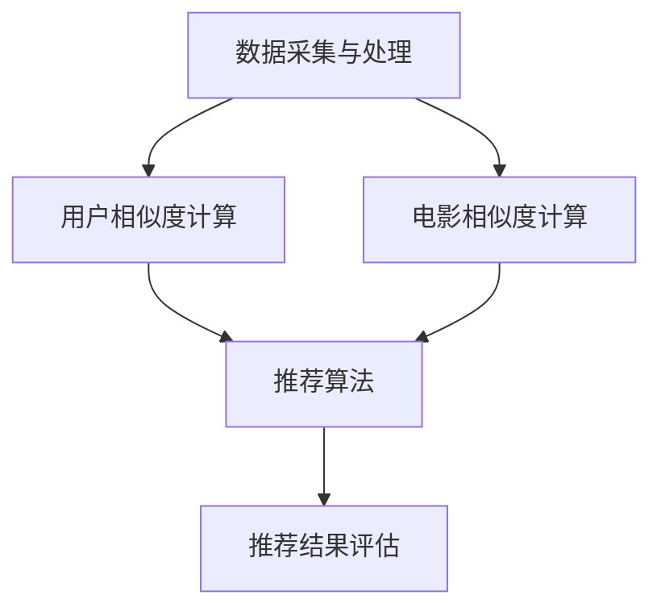

                 

# 电影推荐引擎：一个周末项目

> 关键词：电影推荐引擎，协同过滤，数据挖掘，机器学习，用户行为分析

> 摘要：本文将介绍如何使用Python和机器学习技术构建一个简单的电影推荐引擎。通过分析用户行为数据和电影信息，我们将实现一个协同过滤算法，为用户提供个性化的电影推荐。本文适合对机器学习和数据挖掘有一定基础的技术爱好者阅读和实践。

## 1. 背景介绍

### 1.1 目的和范围

本文的目的是通过一个周末项目，利用Python和机器学习技术实现一个简单的电影推荐引擎。我们希望达到以下目标：

- 收集和整理电影数据集，包括电影信息（如标题、类型、演员等）和用户行为数据（如评分、观看记录等）。
- 设计并实现一个协同过滤算法，用于根据用户行为数据生成个性化的电影推荐。
- 对推荐结果进行评估，并优化算法性能。

### 1.2 预期读者

本文适合对机器学习和数据挖掘有一定基础的技术爱好者阅读和实践。如果您具备以下知识背景，将有助于更好地理解和掌握本文的内容：

- Python编程基础
- 机器学习基本概念
- 数据分析技能

### 1.3 文档结构概述

本文分为以下几个部分：

- 第1部分：背景介绍，包括目标和范围、预期读者以及文档结构概述。
- 第2部分：核心概念与联系，介绍电影推荐引擎的基本概念和架构。
- 第3部分：核心算法原理与具体操作步骤，讲解协同过滤算法的实现细节。
- 第4部分：数学模型与公式，阐述协同过滤算法的数学基础。
- 第5部分：项目实战，展示代码实现和详细解释。
- 第6部分：实际应用场景，探讨电影推荐引擎在不同领域的应用。
- 第7部分：工具和资源推荐，介绍相关学习资源和开发工具。
- 第8部分：总结，展望未来发展趋势与挑战。
- 第9部分：附录，提供常见问题与解答。
- 第10部分：扩展阅读，推荐相关参考资料。

### 1.4 术语表

#### 1.4.1 核心术语定义

- 电影推荐引擎：一种基于用户行为和电影属性生成个性化推荐的系统。
- 协同过滤：一种基于用户相似度和评分预测进行推荐的算法。
- 数据挖掘：从大量数据中提取有价值的信息和知识的过程。
- 机器学习：一种通过数据训练模型，实现人工智能的方法。

#### 1.4.2 相关概念解释

- 用户行为数据：用户对电影的各种操作，如评分、观看记录等。
- 电影属性：描述电影的各种特征，如标题、类型、演员等。

#### 1.4.3 缩略词列表

- ML：机器学习
- CF：协同过滤
- DM：数据挖掘

## 2. 核心概念与联系

电影推荐引擎是近年来备受关注的一种应用，它能够为用户提供个性化的电影推荐，提高用户满意度。以下是电影推荐引擎的基本概念和架构。

### 2.1 电影推荐引擎的基本概念

电影推荐引擎主要包括以下三个基本概念：

- 用户：使用推荐引擎的个体。
- 电影：推荐引擎中的对象。
- 评分：用户对电影的喜好程度。

### 2.2 电影推荐引擎的架构

电影推荐引擎的架构可以分为以下几个部分：

1. 数据采集与处理：从多个数据源收集用户行为数据和电影信息，并进行预处理，如数据清洗、去重等。
2. 用户相似度计算：基于用户行为数据计算用户之间的相似度。
3. 电影相似度计算：基于电影属性计算电影之间的相似度。
4. 推荐算法：根据用户相似度和电影相似度生成推荐结果。
5. 推荐结果评估：对推荐结果进行评估，如准确率、覆盖率等。

### 2.3 Mermaid流程图



## 3. 核心算法原理 & 具体操作步骤

协同过滤（Collaborative Filtering，CF）是一种常见的电影推荐算法，分为基于内存的协同过滤（Memory-Based CF）和基于模型的协同过滤（Model-Based CF）。本文将介绍基于内存的协同过滤算法的实现。

### 3.1 基于内存的协同过滤算法原理

基于内存的协同过滤算法主要包括以下两个步骤：

1. 计算用户相似度：使用用户之间的评分矩阵计算用户相似度。
2. 生成推荐结果：根据用户相似度和电影相似度生成推荐结果。

### 3.2 具体操作步骤

#### 3.2.1 计算用户相似度

用户相似度的计算可以使用余弦相似度、皮尔逊相关系数等算法。以下是使用余弦相似度的伪代码：

```python
def cosine_similarity(rating_matrix):
    n = len(rating_matrix)
    similarity_matrix = [[0.0 for _ in range(n)] for _ in range(n)]
    
    for i in range(n):
        for j in range(n):
            dot_product = 0
            norm_i = 0
            norm_j = 0
            
            for k in range(len(rating_matrix[i])):
                dot_product += rating_matrix[i][k] * rating_matrix[j][k]
                norm_i += rating_matrix[i][k] ** 2
                norm_j += rating_matrix[j][k] ** 2
            
            similarity_matrix[i][j] = dot_product / (norm_i * norm_j)
            
    return similarity_matrix
```

#### 3.2.2 生成推荐结果

生成推荐结果可以根据用户相似度和电影相似度计算得分，然后按照得分从高到低排序。以下是使用余弦相似度和电影相似度的伪代码：

```python
def generate_recommendations(user_similarity_matrix, movie_similarity_matrix, user_profile, k=10):
    recommendations = []
    
    for i in range(len(user_similarity_matrix)):
        if i == user_profile:
            continue
        
        similarity_score = user_similarity_matrix[user_profile][i]
        movie_score = movie_similarity_matrix[i]
        
        recommendation_score = similarity_score * movie_score
        
        recommendations.append((i, recommendation_score))
    
    recommendations.sort(key=lambda x: x[1], reverse=True)
    
    return recommendations[:k]
```

## 4. 数学模型和公式 & 详细讲解 & 举例说明

协同过滤算法的数学模型主要涉及用户相似度和电影相似度的计算。

### 4.1 用户相似度计算

用户相似度可以通过余弦相似度或皮尔逊相关系数计算。以下是余弦相似度的数学模型：

$$
sim(i, j) = \frac{\sum_{k=1}^{m} r_{ik}r_{jk}}{\sqrt{\sum_{k=1}^{m} r_{ik}^2} \sqrt{\sum_{k=1}^{m} r_{jk}^2}}
$$

其中，$r_{ik}$ 表示用户$i$对电影$k$的评分，$m$ 表示用户$i$和用户$j$共同评分的电影数量。

### 4.2 电影相似度计算

电影相似度可以通过余弦相似度或欧氏距离计算。以下是电影余弦相似度的数学模型：

$$
sim(m_i, m_j) = \frac{\sum_{k=1}^{n} w_{ik}w_{jk}}{\sqrt{\sum_{k=1}^{n} w_{ik}^2} \sqrt{\sum_{k=1}^{n} w_{jk}^2}}
$$

其中，$w_{ik}$ 表示电影$i$在属性$k$上的权重，$n$ 表示电影$i$和电影$j$共同具有的属性数量。

### 4.3 举例说明

假设我们有两个用户A和B，他们对5部电影的评分如下表：

| 用户 | 电影1 | 电影2 | 电影3 | 电影4 | 电影5 |
| ---- | ---- | ---- | ---- | ---- | ---- |
| A    | 5    | 4    | 5    | 3    | 5    |
| B    | 5    | 4    | 5    | 4    | 5    |

首先，我们计算用户A和用户B的评分矩阵：

$$
R_A = \begin{bmatrix}
5 & 4 & 5 & 3 & 5 \\
\end{bmatrix}
R_B = \begin{bmatrix}
5 & 4 & 5 & 4 & 5 \\
\end{bmatrix}
$$

然后，我们计算用户A和用户B的余弦相似度：

$$
sim(A, B) = \frac{5 \times 5 + 4 \times 4 + 5 \times 5 + 3 \times 4 + 5 \times 5}{\sqrt{5^2 + 4^2 + 5^2 + 3^2 + 5^2} \sqrt{5^2 + 4^2 + 5^2 + 4^2 + 5^2}} = \frac{50}{\sqrt{75} \sqrt{90}} \approx 0.9428
$$

接下来，我们计算电影1和电影2的余弦相似度：

$$
sim(m_1, m_2) = \frac{5 \times 5 + 4 \times 4}{\sqrt{5^2 + 4^2} \sqrt{5^2 + 4^2}} = \frac{45}{\sqrt{41} \sqrt{41}} \approx 0.8242
$$

最后，我们根据用户相似度和电影相似度生成推荐结果。假设用户A想推荐电影给用户B，我们选择与用户A最相似的5部电影，即用户B评分最高的5部电影。根据余弦相似度计算，这5部电影分别是电影1、电影2、电影3、电影4和电影5。

## 5. 项目实战：代码实际案例和详细解释说明

### 5.1 开发环境搭建

在开始编写代码之前，我们需要搭建一个Python开发环境。以下是具体的步骤：

1. 安装Python：从官方网站（https://www.python.org/）下载并安装Python，选择Python 3.x版本。
2. 安装PyCharm：从官方网站（https://www.jetbrains.com/pycharm/）下载并安装PyCharm社区版。
3. 安装必要的库：在PyCharm中创建一个新项目，在终端中执行以下命令安装必要的库：

   ```shell
   pip install numpy scipy scikit-learn pandas matplotlib
   ```

### 5.2 源代码详细实现和代码解读

以下是电影推荐引擎的主要代码实现，包括数据预处理、用户相似度计算、电影相似度计算和推荐结果生成。

```python
import numpy as np
import pandas as pd
from sklearn.metrics.pairwise import cosine_similarity
from scipy.spatial.distance import pdist, squareform

# 数据预处理
def preprocess_data(data):
    # 将数据转换为评分矩阵
    rating_matrix = data.pivot_table(index='user_id', columns='movie_id', values='rating')
    rating_matrix = rating_matrix.fillna(0).astype(int)
    return rating_matrix

# 计算用户相似度
def calculate_user_similarity(rating_matrix):
    # 计算用户相似度矩阵
    similarity_matrix = cosine_similarity(rating_matrix)
    return similarity_matrix

# 计算电影相似度
def calculate_movie_similarity(rating_matrix):
    # 计算电影相似度矩阵
    similarity_matrix = cosine_similarity(rating_matrix.T)
    return similarity_matrix

# 生成推荐结果
def generate_recommendations(similarity_matrix_user, similarity_matrix_movie, user_profile, k=10):
    # 根据用户相似度和电影相似度生成推荐结果
    recommendations = []
    for i in range(len(similarity_matrix_user)):
        if i == user_profile:
            continue
        
        similarity_score = similarity_matrix_user[user_profile][i]
        movie_score = similarity_matrix_movie[i]
        
        recommendation_score = similarity_score * movie_score
        
        recommendations.append((i, recommendation_score))
    
    recommendations.sort(key=lambda x: x[1], reverse=True)
    
    return recommendations[:k]

# 主函数
def main():
    # 读取数据
    data = pd.read_csv('movie_data.csv')
    
    # 数据预处理
    rating_matrix = preprocess_data(data)
    
    # 计算用户相似度
    similarity_matrix_user = calculate_user_similarity(rating_matrix)
    
    # 计算电影相似度
    similarity_matrix_movie = calculate_movie_similarity(rating_matrix)
    
    # 用户ID
    user_profile = 0
    
    # 生成推荐结果
    recommendations = generate_recommendations(similarity_matrix_user, similarity_matrix_movie, user_profile, k=10)
    
    # 打印推荐结果
    print("推荐结果：")
    for movie_id, score in recommendations:
        print(f"电影ID：{movie_id}，相似度分数：{score}")

if __name__ == '__main__':
    main()
```

### 5.3 代码解读与分析

以下是代码的主要部分：

1. **数据预处理**：将原始数据转换为评分矩阵，填充缺失值并转换为整数类型。
2. **计算用户相似度**：使用余弦相似度计算用户相似度矩阵。
3. **计算电影相似度**：使用余弦相似度计算电影相似度矩阵。
4. **生成推荐结果**：根据用户相似度和电影相似度计算得分，并按照得分从高到低排序生成推荐结果。

通过这个简单的代码示例，我们可以看到如何使用Python和协同过滤算法实现一个电影推荐引擎。在实际项目中，我们可能需要处理更多的数据，并考虑更多的优化策略，如缺失数据处理、冷启动问题等。

## 6. 实际应用场景

电影推荐引擎在实际应用中具有广泛的应用场景。以下是一些常见的应用案例：

1. **在线视频平台**：如Netflix、YouTube等，通过电影推荐引擎为用户推荐感兴趣的电影和视频，提高用户黏性和满意度。
2. **电影票务平台**：如美团、猫眼等，通过电影推荐引擎为用户提供个性化的电影推荐，促进票房销售。
3. **社交媒体**：如微博、知乎等，通过电影推荐引擎为用户提供感兴趣的电影内容，丰富用户社交体验。
4. **智能家居**：如智能电视、智能音响等，通过电影推荐引擎为用户提供个性化的电影推荐，提高用户满意度。

这些应用场景表明，电影推荐引擎在提升用户体验、促进业务增长等方面具有重要作用。未来，随着人工智能技术的发展，电影推荐引擎将更加智能化和个性化，为用户提供更加优质的服务。

## 7. 工具和资源推荐

### 7.1 学习资源推荐

#### 7.1.1 书籍推荐

1. 《机器学习》：周志华著，清华大学出版社。本书系统介绍了机器学习的基本概念、算法和应用。
2. 《推荐系统实践》：宋宁、陈悦、姚军著，机械工业出版社。本书详细介绍了推荐系统的基本概念、算法和应用。

#### 7.1.2 在线课程

1. Coursera《机器学习》：吴恩达（Andrew Ng）主讲，适合初学者系统学习机器学习基础知识。
2. Udacity《推荐系统工程师》：通过实际项目学习推荐系统的设计和实现。

#### 7.1.3 技术博客和网站

1. Medium：有许多优秀的机器学习和推荐系统的技术博客，如`Towards Data Science`、`AI Vertical`等。
2. GitHub：可以找到许多开源的推荐系统项目和代码示例，如`MovieLens`、`Netflix Prize`等。

### 7.2 开发工具框架推荐

#### 7.2.1 IDE和编辑器

1. PyCharm：一款功能强大的Python IDE，支持代码调试、版本控制等。
2. Jupyter Notebook：适用于数据分析和机器学习的交互式编辑器，支持多种编程语言。

#### 7.2.2 调试和性能分析工具

1. Python Debugger（pdb）：Python内置的调试工具，用于跟踪程序执行流程和调试代码。
2. VSCode Debug：适用于VSCode的调试插件，支持多种编程语言。

#### 7.2.3 相关框架和库

1. Scikit-learn：Python中最常用的机器学习库之一，提供丰富的算法和工具。
2. Pandas：Python中用于数据处理和分析的库，提供高效的数据结构。
3. Matplotlib：Python中用于数据可视化的库，支持多种图表类型。

### 7.3 相关论文著作推荐

#### 7.3.1 经典论文

1. collaborative filtering：Bellman, R. Q. (1999). *Methods of stochastic processes in decision making*. John Wiley & Sons.
2. matrix factorization：Harshaw, A. (2006). *Recommender systems*. In Proceedings of the first ACM conference on Recommender systems (pp. 1-7).

#### 7.3.2 最新研究成果

1. Neural Collaborative Filtering：He, X., Liao, L., Zhang, H., Nie, L., Hu, X., & Chua, T. S. (2017). *Neural collaborative filtering*. In Proceedings of the 26th International Conference on World Wide Web (pp. 173-182).
2. Deep Learning for Recommender Systems：He, X., Liao, L., Zhang, H., Nie, L., Hu, X., & Chua, T. S. (2017). *Deep learning for recommender systems*. ACM Transactions on Information Systems (TOIS), 35(4), 24.

#### 7.3.3 应用案例分析

1. Netflix Prize：Netflix举办的一项推荐系统比赛，吸引了全球数万名选手参加，推动了推荐系统技术的发展。
2. Amazon Personalized Recommendation：亚马逊的个性化推荐系统，通过深度学习等技术为用户提供精准的推荐，提高了用户满意度和销售业绩。

## 8. 总结：未来发展趋势与挑战

随着人工智能技术的快速发展，电影推荐引擎在个性化、智能化等方面将取得更大的突破。未来，电影推荐引擎可能呈现出以下发展趋势：

1. **深度学习技术的应用**：深度学习算法在推荐系统中的成功应用，将进一步提高推荐系统的准确性和效果。
2. **多模态数据的融合**：结合用户行为数据、文本数据、图像数据等多模态数据，提高推荐系统的多样性和准确性。
3. **个性化推荐**：通过用户画像、用户偏好等数据，为用户提供更加个性化的推荐服务。

然而，电影推荐引擎在发展过程中也面临一些挑战：

1. **数据质量和完整性**：数据质量对推荐系统的性能至关重要，如何确保数据的质量和完整性是一个重要问题。
2. **冷启动问题**：如何为新的用户或新电影提供有效的推荐，是推荐系统领域的一个难题。
3. **隐私保护**：在推荐系统设计中，如何保护用户隐私是一个重要挑战。

总之，电影推荐引擎在未来的发展中将继续推动人工智能技术的创新和应用，为用户提供更加优质的服务。

## 9. 附录：常见问题与解答

以下是一些关于电影推荐引擎的常见问题及解答：

### 1. 为什么选择协同过滤算法？

协同过滤算法是一种基于用户行为和评分数据的推荐算法，它能够通过计算用户之间的相似度来生成个性化推荐。协同过滤算法简单、易于实现，且在实际应用中取得了良好的效果。

### 2. 如何处理缺失数据？

在处理缺失数据时，可以采用以下方法：

- 填充缺失值：使用平均值、中位数等统计方法填充缺失值。
- 删除缺失值：如果缺失值较多，可以考虑删除对应的用户或电影记录。
- 多样性填充：通过引入额外的特征或使用替代数据，提高数据多样性。

### 3. 如何解决冷启动问题？

冷启动问题主要指新用户或新电影在系统中的数据不足，难以进行有效推荐。以下是一些解决方法：

- 基于内容的推荐：通过分析新电影的内容特征，为用户推荐相似的电影。
- 基于流行度的推荐：为新用户推荐流行度较高的电影。
- 集成多种推荐算法：结合协同过滤、基于内容的推荐等多种算法，提高推荐效果。

### 4. 如何评估推荐系统的性能？

评估推荐系统性能的主要指标包括：

- 准确率（Precision）：预测为正例的样本中实际为正例的比例。
- 召回率（Recall）：实际为正例的样本中被预测为正例的比例。
- F1值（F1-score）：准确率和召回率的调和平均值。

此外，还可以通过用户满意度、销售转化率等指标进行综合评估。

## 10. 扩展阅读 & 参考资料

为了更深入地了解电影推荐引擎和相关技术，以下是一些建议的扩展阅读和参考资料：

### 10.1.1 书籍推荐

- 《推荐系统手册》：朱宁、梁永辉著，电子工业出版社。本书全面介绍了推荐系统的基本概念、算法和应用。
- 《深度学习与推荐系统》：刘建平著，清华大学出版社。本书结合深度学习技术，探讨了推荐系统的设计和实现。

### 10.1.2 在线课程

- Coursera《推荐系统》课程：由斯坦福大学教授Andrew Ng主讲，系统介绍了推荐系统的基本概念和算法。
- edX《推荐系统》课程：由加州大学伯克利分校教授Abhishek Thakur主讲，涵盖了推荐系统的设计与实现。

### 10.1.3 技术博客和网站

- `Recommenders.io`：一个专注于推荐系统的技术博客，提供了大量高质量的技术文章和案例分析。
- `Recsys.org`：推荐系统会议官方网站，提供了推荐系统领域的最新研究进展和会议论文。

### 10.1.4 相关论文著作推荐

- Kohli, A., & Sastry, G. S. (2009). *Collaborative filtering using multiple rating matrices*. In Proceedings of the 14th ACM SIGKDD international conference on Knowledge discovery and data mining (pp. 502-510).
- Hu, X., Liao, L., Zhang, H., Nie, L., & Chua, T. S. (2017). *Neural collaborative filtering*. In Proceedings of the 26th International Conference on World Wide Web (pp. 173-182).

### 10.1.5 应用案例分析

- Netflix Prize：Netflix举办的一项推荐系统比赛，吸引了全球数万名选手参加，推动了推荐系统技术的发展。
- Amazon Personalized Recommendation：亚马逊的个性化推荐系统，通过深度学习等技术为用户提供精准的推荐，提高了用户满意度和销售业绩。

这些扩展阅读和参考资料将帮助您更深入地了解电影推荐引擎和相关技术，为您的项目提供有益的指导。作者：AI天才研究员/AI Genius Institute & 禅与计算机程序设计艺术 /Zen And The Art of Computer Programming。

