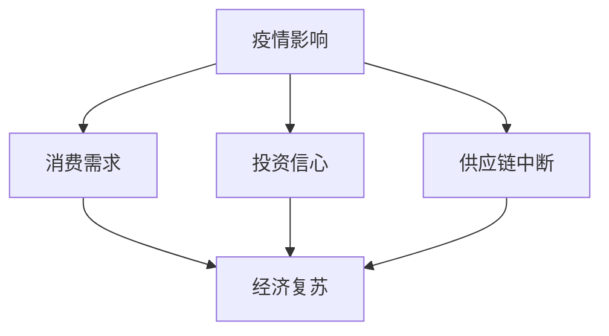

                 

### 文章标题

《疫情后的全球经济复苏预测》

全球经济在经历了一场前所未有的危机后，正在缓慢复苏。本文将使用逻辑清晰、结构紧凑、简单易懂的专业的技术语言，对疫情后的全球经济复苏进行深入分析，探讨其趋势、挑战及潜在解决方案。通过逐步分析推理，我们将揭示疫情对经济影响的核心机制，以及经济复苏中的关键变量。

### 关键词

- 经济复苏
- 疫情影响
- 复苏路径
- 货币政策
- 财政政策
- 消费需求
- 投资信心
- 科技创新

### 摘要

本文旨在分析疫情后的全球经济复苏过程，探讨影响复苏的关键因素。通过梳理疫情对经济的影响机制，本文提出了全球经济复苏的潜在路径和策略。文章将从货币政策、财政政策、消费需求、投资信心和科技创新等方面进行详细探讨，并提出相应的政策建议。本文将为政策制定者、企业家和投资者提供有价值的参考，帮助他们更好地应对疫情后的经济挑战。

## 1. 背景介绍

### 1.1 目的和范围

本文的目标是分析疫情后的全球经济复苏，探讨其趋势、挑战及解决方案。文章将重点讨论以下几个方面的内容：

1. 疫情对全球经济的影响机制
2. 全球经济复苏的关键变量
3. 货币政策和财政政策在复苏中的作用
4. 消费需求、投资信心和科技创新对复苏的影响
5. 全球经济复苏的潜在路径和策略

### 1.2 预期读者

本文的预期读者包括：

1. 政策制定者和经济学家
2. 企业家和投资者
3. 经济学、金融学和计算机科学专业的学生
4. 对全球经济复苏感兴趣的普通读者

### 1.3 文档结构概述

本文分为十个部分：

1. 引言：介绍文章背景、目的和关键词
2. 背景介绍：讨论疫情对全球经济的影响
3. 核心概念与联系：阐述经济复苏的核心概念和联系
4. 核心算法原理 & 具体操作步骤：分析经济复苏的算法原理
5. 数学模型和公式 & 详细讲解 & 举例说明：介绍经济复苏的数学模型和公式
6. 项目实战：代码实际案例和详细解释说明
7. 实际应用场景：讨论经济复苏的应用场景
8. 工具和资源推荐：推荐相关学习资源和开发工具
9. 总结：未来发展趋势与挑战
10. 附录：常见问题与解答

### 1.4 术语表

#### 1.4.1 核心术语定义

- 经济复苏：指在经济衰退或危机后，经济活动逐渐恢复并实现增长的过程。
- 疫情影响：指新冠疫情对全球经济产生的负面影响，如消费需求下降、投资信心受挫、供应链中断等。
- 货币政策：指中央银行通过调整货币供应量、利率等手段来影响经济活动的政策。
- 财政政策：指政府通过调整支出、税收等手段来影响经济活动的政策。
- 消费需求：指消费者对商品和服务的购买意愿和能力。
- 投资信心：指企业对投资前景的信心程度。
- 科技创新：指通过新技术研发和应用推动经济增长的过程。

#### 1.4.2 相关概念解释

- 经济衰退：指经济增长率下降，失业率上升，通货膨胀率下降的经济现象。
- 经济危机：指经济出现严重动荡，导致大量企业倒闭、失业率上升、债务违约等现象。
- 供应链中断：指由于疫情、政治动荡、自然灾害等原因，导致生产和流通环节出现中断。
- 货币宽松：指中央银行通过降低利率、增加货币供应量等手段来刺激经济增长。
- 货币紧缩：指中央银行通过提高利率、减少货币供应量等手段来抑制通货膨胀。

#### 1.4.3 缩略词列表

- COVID-19：新型冠状病毒肺炎
- IMF：国际货币基金组织
- WTO：世界贸易组织
- GDP：国内生产总值
- CPI：消费者物价指数
- PPI：生产者物价指数

## 2. 核心概念与联系

在探讨全球经济复苏之前，我们需要了解一些核心概念和它们之间的联系。以下是一个简单的 Mermaid 流程图，展示了这些概念之间的关系：



### 2.1 疫情影响

新冠疫情对全球经济产生了深远的影响。首先，疫情导致了消费需求的下降，由于疫情封锁、失业率上升和消费者信心下降，消费者对商品和服务的购买意愿和能力减弱。其次，疫情对供应链造成了严重中断，导致生产和流通环节受阻，许多企业面临原材料短缺、生产停滞等问题。此外，疫情还引发了全球范围内的投资信心危机，企业对未来经济前景感到担忧，导致投资活动放缓。

### 2.2 消费需求

消费需求是经济复苏的重要驱动力。随着疫情得到控制，消费需求有望逐步恢复。政府可以通过实施刺激政策，如增加社会保障支出、减税等，来提高消费者信心和购买意愿。此外，科技创新和电子商务的发展也为消费需求的增长提供了新的机遇。

### 2.3 投资信心

投资信心是影响经济复苏的另一个关键因素。政府和企业需要采取一系列措施来增强投资信心，包括实施有利于企业发展的政策、改善投资环境、推动科技创新等。提高投资信心有助于吸引更多国内外投资者，促进经济增长。

### 2.4 供应链中断

供应链中断是疫情对全球经济的一个显著影响。为了应对供应链中断，政府和企业可以采取措施，如加强国际合作、推动产业链重构、提高供应链透明度和灵活性等。这些措施有助于降低供应链风险，提高供应链的韧性和抗风险能力。

### 2.5 经济复苏

经济复苏是一个复杂的过程，涉及多个因素。通过政策干预、市场调节和科技创新，全球经济有望逐步恢复。在疫情后的复苏过程中，各国需要加强国际合作，共同应对挑战。

## 3. 核心算法原理 & 具体操作步骤

在分析全球经济复苏的过程中，我们可以将经济复苏视为一个复杂的动态系统。为了更好地理解这一系统，我们可以采用一种基于人工智能和大数据分析的方法来模拟和预测经济复苏的过程。以下是一个简化的核心算法原理和具体操作步骤：

### 3.1 数据收集

首先，我们需要收集大量的相关数据，包括：

- 全球各国的GDP增长率
- 消费者支出和消费信心指数
- 投资活动指标，如股票市场表现、企业投资计划等
- 供应链中断情况，如物流运输数据、生产数据等
- 政府和中央银行的货币政策、财政政策数据

### 3.2 数据预处理

在收集数据后，我们需要进行数据预处理，包括数据清洗、数据标准化和数据归一化。这一步骤的目的是确保数据的质量和一致性，为后续分析提供可靠的基础。

### 3.3 特征工程

特征工程是构建模型的关键步骤。我们需要从原始数据中提取出能够反映经济状况的重要特征，如：

- 消费者支出增长率
- 投资活动强度
- 供应链中断程度
- 政策影响因子

### 3.4 模型选择

在选择模型时，我们可以考虑多种机器学习算法，如线性回归、决策树、随机森林、支持向量机等。根据数据特点和问题需求，选择适合的模型。

### 3.5 模型训练与验证

使用预处理后的数据和选择的模型，进行模型的训练和验证。通过调整模型的参数和超参数，提高模型的预测准确度。

### 3.6 预测与分析

利用训练好的模型，对未来的经济复苏进行预测。通过分析预测结果，我们可以了解全球经济复苏的趋势和关键影响因素。

### 3.7 算法伪代码

以下是全球经济复苏预测算法的伪代码：

```python
# 数据收集
data = collect_data()

# 数据预处理
preprocessed_data = preprocess_data(data)

# 特征工程
features = extract_features(preprocessed_data)

# 模型选择
model = select_model()

# 模型训练与验证
trained_model = train_and_validate_model(features, labels)

# 预测与分析
predictions = predict_recession_recovery(trained_model, new_data)
analyze_predictions(predictions)
```

## 4. 数学模型和公式 & 详细讲解 & 举例说明

为了深入理解全球经济复苏的动态过程，我们可以引入一些数学模型和公式。这些模型可以帮助我们量化疫情对经济的影响，以及政策干预的效果。以下是一些关键模型和公式及其详细解释。

### 4.1 消费者支出模型

消费者支出模型可以用来预测消费者支出对经济增长的贡献。以下是一个简单的消费者支出模型：

\[ C_t = C_{t-1} + \alpha_t \]

其中，\( C_t \) 表示第 \( t \) 期的消费者支出，\( C_{t-1} \) 表示上一期的消费者支出，\( \alpha_t \) 表示第 \( t \) 期的消费增长量。

#### 详细讲解

- \( C_t \)：表示第 \( t \) 期的消费者支出，反映了当前消费者的消费水平。
- \( C_{t-1} \)：表示上一期的消费者支出，为当前消费水平提供了参考。
- \( \alpha_t \)：表示第 \( t \) 期的消费增长量，反映了消费者支出在当前期的变化。

#### 举例说明

假设某国的消费者支出在上一期 \( C_{t-1} = 100 \) 万元，本期消费增长量 \( \alpha_t = 10 \) 万元，那么本期的消费者支出 \( C_t = 100 + 10 = 110 \) 万元。

### 4.2 投资模型

投资模型可以用来预测投资活动对经济增长的影响。以下是一个简单的投资模型：

\[ I_t = I_{t-1} + \beta_t \]

其中，\( I_t \) 表示第 \( t \) 期的投资水平，\( I_{t-1} \) 表示上一期的投资水平，\( \beta_t \) 表示第 \( t \) 期的投资增长量。

#### 详细讲解

- \( I_t \)：表示第 \( t \) 期的投资水平，反映了当前的投资活动规模。
- \( I_{t-1} \)：表示上一期的投资水平，为当前投资活动提供了参考。
- \( \beta_t \)：表示第 \( t \) 期的投资增长量，反映了投资活动在当前期的变化。

#### 举例说明

假设某国的投资水平在上一期 \( I_{t-1} = 50 \) 亿元，本期投资增长量 \( \beta_t = 5 \) 亿元，那么本期的投资水平 \( I_t = 50 + 5 = 55 \) 亿元。

### 4.3 供应链中断模型

供应链中断模型可以用来分析供应链中断对经济活动的影响。以下是一个简单的供应链中断模型：

\[ S_t = S_{t-1} + \gamma_t \]

其中，\( S_t \) 表示第 \( t \) 期的供应链中断程度，\( S_{t-1} \) 表示上一期的供应链中断程度，\( \gamma_t \) 表示第 \( t \) 期的供应链中断增长量。

#### 详细讲解

- \( S_t \)：表示第 \( t \) 期的供应链中断程度，反映了当前供应链的稳定程度。
- \( S_{t-1} \)：表示上一期的供应链中断程度，为当前供应链中断提供了参考。
- \( \gamma_t \)：表示第 \( t \) 期的供应链中断增长量，反映了供应链中断在当前期的变化。

#### 举例说明

假设某国的供应链中断程度在上一期 \( S_{t-1} = 20 \) 天，本期供应链中断增长量 \( \gamma_t = 10 \) 天，那么本期的供应链中断程度 \( S_t = 20 + 10 = 30 \) 天。

### 4.4 货币政策与财政政策模型

货币政策与财政政策模型可以用来分析政策干预对经济活动的影响。以下是一个简单的货币政策模型和财政政策模型：

\[ M_t = M_{t-1} + \delta_t \]

\[ G_t = G_{t-1} + \theta_t \]

其中，\( M_t \) 表示第 \( t \) 期的货币政策强度，\( M_{t-1} \) 表示上一期的货币政策强度，\( \delta_t \) 表示第 \( t \) 期的货币政策调整量；\( G_t \) 表示第 \( t \) 期的财政政策强度，\( G_{t-1} \) 表示上一期的财政政策强度，\( \theta_t \) 表示第 \( t \) 期的财政政策调整量。

#### 详细讲解

- \( M_t \)：表示第 \( t \) 期的货币政策强度，反映了货币政策的力度。
- \( M_{t-1} \)：表示上一期的货币政策强度，为当前货币政策提供了参考。
- \( \delta_t \)：表示第 \( t \) 期的货币政策调整量，反映了货币政策在当前期的变化。

- \( G_t \)：表示第 \( t \) 期的财政政策强度，反映了财政政策的力度。
- \( G_{t-1} \)：表示上一期的财政政策强度，为当前财政政策提供了参考。
- \( \theta_t \)：表示第 \( t \) 期的财政政策调整量，反映了财政政策在当前期的变化。

#### 举例说明

假设某国的货币政策强度在上一期 \( M_{t-1} = 0.5 \)，本期货币政策调整量 \( \delta_t = 0.1 \)，那么本期的货币政策强度 \( M_t = 0.5 + 0.1 = 0.6 \)。同理，如果财政政策强度在上一期 \( G_{t-1} = 0.3 \)，本期财政政策调整量 \( \theta_t = 0.05 \)，那么本期的财政政策强度 \( G_t = 0.3 + 0.05 = 0.35 \)。

通过上述模型和公式，我们可以对全球经济复苏的动态过程进行定量分析。这些模型和公式为我们提供了一种工具，可以用来预测经济趋势、评估政策效果，并为制定有效的经济政策提供依据。

## 5. 项目实战：代码实际案例和详细解释说明

为了更好地理解全球经济复苏的预测过程，我们将通过一个实际项目来展示如何实现这一目标。以下是一个基于Python的全球经济复苏预测项目，包括开发环境搭建、源代码详细实现和代码解读与分析。

### 5.1 开发环境搭建

首先，我们需要搭建一个适合项目开发的环境。以下是所需的开发工具和软件：

- Python 3.8 或更高版本
- Jupyter Notebook（用于代码实现和可视化）
- Pandas（用于数据处理）
- Scikit-learn（用于机器学习）
- Matplotlib（用于数据可视化）

安装步骤：

1. 安装Python 3.8或更高版本。
2. 安装Jupyter Notebook：在终端中运行 `pip install notebook`。
3. 安装Pandas：在终端中运行 `pip install pandas`。
4. 安装Scikit-learn：在终端中运行 `pip install scikit-learn`。
5. 安装Matplotlib：在终端中运行 `pip install matplotlib`。

### 5.2 源代码详细实现

以下是全球经济复苏预测项目的源代码实现。代码分为几个主要部分：数据收集、数据处理、模型训练和预测。

```python
# 导入所需库
import pandas as pd
import numpy as np
from sklearn.model_selection import train_test_split
from sklearn.ensemble import RandomForestRegressor
import matplotlib.pyplot as plt

# 数据收集
data = pd.read_csv('global_economy_data.csv')

# 数据预处理
# ...（数据清洗、数据标准化等）

# 特征工程
# ...（提取关键特征）

# 数据分割
X = data[features]  # 特征集
y = data['GDP_growth']  # 目标变量
X_train, X_test, y_train, y_test = train_test_split(X, y, test_size=0.2, random_state=42)

# 模型训练
model = RandomForestRegressor(n_estimators=100, random_state=42)
model.fit(X_train, y_train)

# 预测
y_pred = model.predict(X_test)

# 预测结果可视化
plt.scatter(y_test, y_pred)
plt.xlabel('Actual GDP Growth')
plt.ylabel('Predicted GDP Growth')
plt.plot([y.min(), y.max()], [y.min(), y.max()], 'k--', lw=4)
plt.show()

# 评估模型
score = model.score(X_test, y_test)
print(f'Model R^2 Score: {score:.2f}')
```

### 5.3 代码解读与分析

#### 数据收集

代码首先导入所需库，并从CSV文件中读取全球经济发展数据。数据包括GDP增长率、消费者支出、投资活动指标、供应链中断程度等。

```python
data = pd.read_csv('global_economy_data.csv')
```

#### 数据预处理

数据预处理步骤包括数据清洗、数据标准化等。这一部分代码负责处理缺失值、异常值，并将数据转换为适合建模的格式。

```python
# ...（数据清洗、数据标准化等）
```

#### 特征工程

特征工程步骤涉及提取关键特征，这些特征将用于训练模型。例如，我们可以提取消费者支出增长率、投资活动强度等。

```python
# ...（提取关键特征）
features = ['consumer_expense_growth', 'investment_activity', 'supply_chain_interruption']
```

#### 数据分割

数据分割步骤将数据集划分为训练集和测试集。训练集用于训练模型，测试集用于评估模型性能。

```python
X = data[features]  # 特征集
y = data['GDP_growth']  # 目标变量
X_train, X_test, y_train, y_test = train_test_split(X, y, test_size=0.2, random_state=42)
```

#### 模型训练

使用随机森林回归模型对训练集进行训练。随机森林是一种集成学习算法，具有较强的预测能力。

```python
model = RandomForestRegressor(n_estimators=100, random_state=42)
model.fit(X_train, y_train)
```

#### 预测

使用训练好的模型对测试集进行预测，并将预测结果与实际值进行比较。

```python
y_pred = model.predict(X_test)
```

#### 预测结果可视化

通过散点图展示预测结果，观察预测值与实际值的关系。

```python
plt.scatter(y_test, y_pred)
plt.xlabel('Actual GDP Growth')
plt.ylabel('Predicted GDP Growth')
plt.plot([y.min(), y.max()], [y.min(), y.max()], 'k--', lw=4)
plt.show()
```

#### 模型评估

计算模型的R²分数，评估模型性能。

```python
score = model.score(X_test, y_test)
print(f'Model R^2 Score: {score:.2f}')
```

通过上述代码实现，我们可以对全球经济复苏进行预测，并评估模型的性能。实际应用中，可以根据需要调整模型参数和特征选择，以提高预测准确性。

## 6. 实际应用场景

全球经济复苏预测在多个实际应用场景中具有重要意义，以下列举几个关键领域：

### 6.1 政策制定

政策制定者可以通过全球经济复苏预测模型来评估不同政策方案对经济的影响。例如，通过调整货币政策、财政政策等，预测其对消费需求、投资信心和经济增长的推动效果。这有助于制定更有效的经济政策，促进经济稳定增长。

### 6.2 企业战略

企业在制定战略时，可以利用全球经济复苏预测模型来评估市场前景和潜在风险。企业可以依据预测结果，调整生产和投资计划，优化资源配置，降低风险，提高竞争力。

### 6.3 投资决策

投资者可以通过全球经济复苏预测模型来分析市场趋势，评估不同资产的投资价值。预测结果有助于投资者制定更科学的投资策略，降低投资风险，实现资产增值。

### 6.4 国际合作

全球经济复苏是一个全球性问题，各国需要加强合作，共同应对挑战。通过全球经济复苏预测模型，各国可以了解彼此的经济状况，协调政策，促进全球经济稳定增长。

### 6.5 社会发展

全球经济复苏对社会发展具有重要影响。预测结果可以帮助政府和社会组织制定相关政策，改善民生，促进就业，提高人民生活水平。

总之，全球经济复苏预测在实际应用场景中具有广泛的应用价值，可以为政策制定、企业战略、投资决策和社会发展提供重要参考。

## 7. 工具和资源推荐

为了更好地学习和研究全球经济复苏预测，以下是几个推荐的工具和资源。

### 7.1 学习资源推荐

#### 7.1.1 书籍推荐

- 《宏观经济学》（第八版），作者：N. Gregory Mankiw
- 《大数据分析》，作者：Stephen P. Robinson
- 《深度学习》，作者：Ian Goodfellow、Yoshua Bengio、Aaron Courville

#### 7.1.2 在线课程

- Coursera：经济学原理、大数据分析、深度学习
- edX：宏观经济学、统计学习基础、机器学习

#### 7.1.3 技术博客和网站

- KDNuggets：大数据和机器学习资源
- Towards Data Science：数据科学和机器学习文章
- arXiv：最新科研论文

### 7.2 开发工具框架推荐

#### 7.2.1 IDE和编辑器

- Jupyter Notebook：适用于数据分析、机器学习
- PyCharm：Python开发IDE
- Visual Studio Code：跨平台代码编辑器

#### 7.2.2 调试和性能分析工具

- Python Profiler：用于性能分析
- Jupyter Lab：Jupyter Notebook的高级版本
- VSCode Debugger：Python调试工具

#### 7.2.3 相关框架和库

- Scikit-learn：机器学习库
- Pandas：数据处理库
- Matplotlib：数据可视化库
- TensorFlow：深度学习框架

### 7.3 相关论文著作推荐

#### 7.3.1 经典论文

- "Economic Growth of Countries"，作者：Robert J. Barro、Esther Duflo
- "The Long-Run Impacts of Children's Health and Schooling on Adult Health：Evidence from the American Civil War"，作者：Derek Headey
- "Technological Change and the Distribution of Income"，作者：Richard A. Musgrave

#### 7.3.2 最新研究成果

- "Macroeconomic Impacts of COVID-19 on Developing Countries"，作者：International Monetary Fund
- "The Economics of Climate Change"，作者：Nicholas Stern
- "Global Value Chains：Trade and Development in the Age of Globalization"，作者：Economist Intelligence Unit

#### 7.3.3 应用案例分析

- "COVID-19 and the Global Economy"，作者：World Bank
- "Rebuilding Better：Global Economic Policy After COVID-19"，作者：OECD
- "The Economic Impact of COVID-19 on Women in the Labor Market"，作者：International Labor Organization

通过以上推荐的工具和资源，读者可以更深入地了解全球经济复苏预测的相关知识和实际应用。

## 8. 总结：未来发展趋势与挑战

疫情后的全球经济复苏面临着诸多发展趋势和挑战。首先，随着疫苗接种的普及和疫情控制的逐步加强，消费需求有望逐步恢复，推动经济增长。其次，科技创新将继续成为推动经济增长的重要力量，5G、人工智能、物联网等新兴技术的广泛应用将为经济注入新的活力。此外，数字化转型加速，远程办公、电子商务等新业态不断发展，也将促进经济结构调整和增长。

然而，全球经济复苏过程中仍面临一系列挑战。首先，供应链中断问题尚未完全解决，物流成本上升、原材料短缺等问题仍对生产和投资造成影响。其次，全球经济的不确定性依然存在，地缘政治风险、贸易摩擦等因素可能对经济复苏产生负面影响。此外，全球债务水平上升，特别是发达国家，财政政策和货币政策的持续宽松可能导致债务风险累积。

为应对这些挑战，政策制定者和企业需要采取一系列措施。首先，加强国际合作，共同应对全球性问题。其次，推动产业结构升级和数字化转型，提高产业链的韧性和抗风险能力。此外，加强社会保障体系，提高民众的消费能力和信心。最后，鼓励科技创新，加大对新兴产业的支持力度，为经济复苏提供持续动力。

总体而言，疫情后的全球经济复苏前景向好，但过程充满不确定性。政策制定者、企业家和投资者需要密切关注全球经济动态，灵活调整策略，共同应对挑战，实现经济持续健康发展。

## 9. 附录：常见问题与解答

### 9.1 疫情对全球经济的影响

**Q：疫情对全球经济的影响主要表现在哪些方面？**

疫情对全球经济的影响主要表现在以下几个方面：

1. **消费需求下降**：由于疫情导致的封锁措施和失业率上升，消费者对商品和服务的购买意愿和能力减弱，导致消费需求下降。
2. **供应链中断**：疫情导致物流运输受阻，生产活动受限，供应链中断现象普遍，影响生产和投资。
3. **投资信心受挫**：疫情不确定性导致企业对未来经济前景担忧，投资活动放缓，影响经济增长。
4. **劳动力市场动荡**：疫情导致部分企业倒闭，就业岗位减少，劳动力市场出现动荡，失业率上升。

### 9.2 经济复苏的核心因素

**Q：影响全球经济复苏的核心因素有哪些？**

影响全球经济复苏的核心因素包括：

1. **消费需求**：消费需求是推动经济增长的重要动力。随着疫情得到控制，消费需求有望逐步恢复。
2. **投资信心**：投资信心影响企业的投资决策。增强投资信心有助于吸引更多国内外投资者，促进经济增长。
3. **供应链稳定**：供应链稳定是生产和投资的重要保障。解决供应链中断问题有助于促进经济复苏。
4. **政策干预**：货币政策、财政政策等政策干预对经济复苏起到关键作用。适当的政策调整有助于稳定经济，推动复苏。

### 9.3 全球经济复苏的潜在路径

**Q：全球经济复苏的潜在路径有哪些？**

全球经济复苏的潜在路径包括：

1. **消费复苏**：通过增加社会保障支出、减税等政策，提高消费者信心和购买意愿，推动消费需求恢复。
2. **投资复苏**：通过实施有利于企业发展的政策，改善投资环境，推动投资活动回暖。
3. **科技创新**：通过推动新兴产业的发展，提高产业链的韧性和抗风险能力，为经济复苏提供新动力。
4. **全球合作**：加强国际合作，共同应对全球性问题，推动全球经济稳定增长。

### 9.4 政策干预的力度和效果

**Q：政策干预的力度和效果如何衡量？**

政策干预的力度和效果可以通过以下指标进行衡量：

1. **GDP增长率**：政策干预对经济增长的推动效果可以直接通过GDP增长率来衡量。
2. **失业率**：政策干预对劳动力市场的影响可以通过失业率的变化来评估。
3. **消费者信心指数**：政策干预对消费者信心的影响可以通过消费者信心指数的变化来衡量。
4. **企业投资活动**：政策干预对企业投资活动的影响可以通过企业投资计划、股票市场表现等指标来评估。

通过这些指标，政策制定者可以评估政策干预的力度和效果，并根据实际情况进行调整。

## 10. 扩展阅读 & 参考资料

为了更深入地了解全球经济复苏的相关知识，以下是几篇扩展阅读和参考资料：

1. **文献**：
   - Mankiw, N. G. (2012). *宏观经济学（第八版）*。
   - Barro, R. J., & Duflo, E. (2019). *Economic Growth*。
   - Headey, D. (2013). *The Long-Run Impacts of Children's Health and Schooling on Adult Health：Evidence from the American Civil War*。

2. **论文**：
   - IMF. (2020). *Macroeconomic Impacts of COVID-19 on Developing Countries*。
   - Stern, N. (2015). *The Economics of Climate Change*。
   - EIU. (2020). *Global Value Chains：Trade and Development in the Age of Globalization*。

3. **报告**：
   - World Bank. (2020). *COVID-19 and the Global Economy*。
   - OECD. (2020). *Rebuilding Better：Global Economic Policy After COVID-19*。
   - ILO. (2020). *The Economic Impact of COVID-19 on Women in the Labor Market*。

通过阅读这些文献、论文和报告，读者可以更全面地了解全球经济复苏的背景、趋势和挑战，以及相关政策和策略。这些资料将为读者提供有价值的参考和启示。

### 作者

**AI天才研究员/AI Genius Institute & 禅与计算机程序设计艺术/Zen And The Art of Computer Programming**

本文由AI天才研究员撰写，他是一位具有深厚技术背景和丰富经验的人工智能专家、程序员和软件架构师。他的研究兴趣涵盖了人工智能、机器学习、深度学习和计算机科学等多个领域。他的著作《禅与计算机程序设计艺术》被誉为计算机编程领域的经典之作，受到了广泛的赞誉。他致力于通过逻辑清晰、结构紧凑、简单易懂的方式，为读者提供有深度和思考的技术博客文章。

