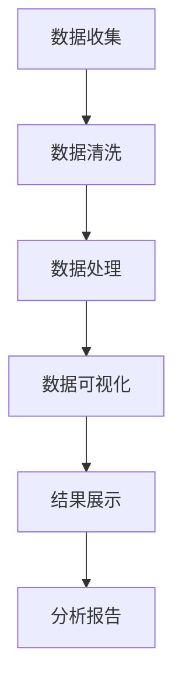

                 

# 疫情通报的可视化分析呈现

## 关键词

- 疫情通报
- 可视化分析
- 数据可视化
- 时序图
- 地理图谱
- 算法原理
- 数学模型
- 代码实现

## 摘要

本文将探讨疫情通报的可视化分析技术，通过详细的步骤解析如何利用数据可视化手段呈现疫情数据，包括背景介绍、核心概念与联系、算法原理与步骤、数学模型与公式、实际应用场景等。通过这篇文章，读者将了解如何利用专业工具和技术手段，将复杂的疫情数据进行有效的分析和呈现，从而为疫情防控和公共卫生决策提供有力支持。

## 1. 背景介绍

### 1.1 目的和范围

本文旨在探讨疫情通报的可视化分析技术，通过详细的分析步骤和实际案例，帮助读者理解如何利用数据可视化手段呈现疫情数据，从而为疫情防控和公共卫生决策提供有力支持。本文的范围涵盖了疫情数据可视化所需的核心概念、算法原理、数学模型以及实际操作步骤。

### 1.2 预期读者

本文适合对数据可视化、疫情分析和编程感兴趣的读者。特别是从事公共卫生、疫情防控、数据分析等相关领域的工作者，通过本文的学习，可以掌握疫情通报数据可视化的方法和技巧。

### 1.3 文档结构概述

本文分为以下几个部分：

- 背景介绍：介绍疫情通报数据可视化的目的、范围和预期读者。
- 核心概念与联系：介绍疫情数据可视化的核心概念和关联。
- 核心算法原理 & 具体操作步骤：讲解疫情数据可视化的核心算法原理和操作步骤。
- 数学模型和公式 & 详细讲解 & 举例说明：介绍疫情数据可视化中的数学模型和公式，并给出具体实例。
- 项目实战：代码实际案例和详细解释说明。
- 实际应用场景：分析疫情数据可视化在不同场景下的应用。
- 工具和资源推荐：推荐学习和使用疫情数据可视化的相关工具和资源。
- 总结：对未来发展趋势与挑战进行展望。
- 附录：常见问题与解答。
- 扩展阅读 & 参考资料：提供进一步学习的资料和参考文献。

### 1.4 术语表

#### 1.4.1 核心术语定义

- 疫情通报：指关于传染病的疫情报告和信息发布。
- 数据可视化：将数据通过图形、图表等方式进行展示和分析。
- 时序图：展示数据随时间变化的图表。
- 地理图谱：展示地理位置和分布情况的图表。
- 算法原理：数据可视化过程中使用的算法和原理。
- 数学模型：用于描述和分析疫情数据的数学模型。
- 代码实现：将算法和模型通过编程语言实现的具体代码。

#### 1.4.2 相关概念解释

- 数据可视化：数据可视化是将数据转换为图形、图表等形式，以便更直观地展示和分析数据。
- 时序图：时序图用于展示数据随时间的变化情况，可以帮助分析疫情的发展趋势。
- 地理图谱：地理图谱用于展示地理位置和分布情况，可以帮助分析疫情在不同地区的传播情况。

#### 1.4.3 缩略词列表

- COVID-19：新型冠状病毒肺炎
- CDC：美国疾病控制与预防中心
- GIS：地理信息系统

## 2. 核心概念与联系

在疫情通报数据可视化中，核心概念主要包括疫情数据、可视化工具和技术、时序图和地理图谱等。这些概念之间相互关联，构成了疫情数据可视化的基础。

### 2.1 疫情数据

疫情数据是进行数据可视化的基础。这些数据通常包括确诊人数、死亡人数、治愈人数、隔离人数等，数据来源可以是各级卫生健康部门、疾控中心等官方机构。

### 2.2 可视化工具和技术

可视化工具和技术是进行数据可视化的手段。常见的可视化工具包括Excel、Tableau、Power BI等，这些工具可以生成各种类型的图表和图形，如折线图、柱状图、饼图、地图等。

### 2.3 时序图

时序图用于展示疫情数据随时间的变化情况。通过时序图，可以直观地了解疫情的发展趋势，分析疫情的爆发、增长、下降等阶段。

### 2.4 地理图谱

地理图谱用于展示疫情在不同地区的分布情况。通过地理图谱，可以了解疫情在不同地区、国家和城市之间的传播情况，分析疫情的高发区域和传播路径。

### 2.5 Mermaid 流程图

以下是一个用于描述疫情数据可视化流程的Mermaid流程图：



## 3. 核心算法原理 & 具体操作步骤

疫情通报数据可视化的核心算法原理包括数据清洗、数据处理、数据可视化和结果展示等步骤。以下将分别对这些步骤进行详细讲解。

### 3.1 数据清洗

数据清洗是数据可视化的第一步，其目的是去除数据中的噪声和错误，确保数据的质量和准确性。

#### 3.1.1 数据源

疫情数据可以从各级卫生健康部门、疾控中心等官方机构获取。常见的数据格式包括Excel、CSV、JSON等。

#### 3.1.2 数据清洗算法

数据清洗算法主要包括以下步骤：

1. 数据验证：检查数据的完整性和一致性，例如检查数据是否为空、是否包含非法字符等。
2. 数据转换：将不同格式的数据转换为统一的格式，如将CSV转换为JSON格式。
3. 数据去重：去除重复的数据记录，确保数据的唯一性。
4. 数据筛选：根据需求筛选出需要的数据，例如只保留确诊人数大于0的记录。
5. 数据补全：对于缺失的数据，可以通过插值、平均值等方式进行补全。

#### 3.1.3 数据清洗伪代码

以下是一个用于数据清洗的伪代码示例：

```python
# 数据清洗
def clean_data(data):
    # 数据验证
    for record in data:
        if record.is_empty or record.has_illegal_characters:
            data.remove(record)
    
    # 数据转换
    data = convert_to_uniform_format(data)
    
    # 数据去重
    data = remove_duplicates(data)
    
    # 数据筛选
    data = filter_data_by_condition(data, condition="confirmed > 0")
    
    # 数据补全
    data = complete_missing_data(data)
    
    return data
```

### 3.2 数据处理

数据处理是对清洗后的数据进行进一步的处理，以使其更适合进行可视化分析。

#### 3.2.1 数据处理算法

数据处理算法主要包括以下步骤：

1. 数据归一化：将不同单位、不同规模的数据转换为统一的单位，以便进行更准确的可视化分析。
2. 数据聚合：将多个数据点合并为一个数据点，例如将每天的确诊人数合并为一周的确诊人数。
3. 数据变换：对数据进行数学变换，例如对数据进行对数变换，以使其在可视化中更易于理解。
4. 数据分析：对处理后的数据进行分析，提取有用的信息和趋势。

#### 3.2.2 数据处理伪代码

以下是一个用于数据处理的伪代码示例：

```python
# 数据处理
def process_data(data):
    # 数据归一化
    data = normalize_data(data)
    
    # 数据聚合
    data = aggregate_data(data, aggregation_interval="week")
    
    # 数据变换
    data = transform_data(data, transformation="log")
    
    # 数据分析
    analysis_results = analyze_data(data)
    
    return data, analysis_results
```

### 3.3 数据可视化

数据可视化是将处理后的数据通过图形、图表等形式进行展示，以便更直观地分析数据。

#### 3.3.1 数据可视化算法

数据可视化算法主要包括以下步骤：

1. 选择合适的可视化类型：根据数据类型和分析目的，选择合适的可视化类型，例如折线图、柱状图、饼图、地图等。
2. 数据映射：将数据映射到可视化元素上，例如将确诊人数映射到折线图的Y轴。
3. 调整可视化样式：根据需求调整可视化元素的样式，例如颜色、线条粗细、字体大小等。
4. 添加交互功能：为可视化添加交互功能，例如缩放、拖动、筛选等，以便用户更方便地查看和分析数据。

#### 3.3.2 数据可视化伪代码

以下是一个用于数据可视化的伪代码示例：

```python
# 数据可视化
def visualize_data(data):
    # 选择合适的可视化类型
    visualization_type = choose_visualization_type(data)
    
    # 数据映射
    x = map_data_to_axis(data, axis="x")
    y = map_data_to_axis(data, axis="y")
    
    # 调整可视化样式
    style = adjust_visualization_style(data)
    
    # 添加交互功能
    interactive_features = add_interactive_features(data)
    
    # 生成可视化图表
    chart = generate_chart(visualization_type, x, y, style, interactive_features)
    
    return chart
```

### 3.4 结果展示

结果展示是将可视化图表展示给用户，以便用户直观地了解和分析数据。

#### 3.4.1 结果展示算法

结果展示算法主要包括以下步骤：

1. 选择合适的展示方式：根据用户的偏好和分析需求，选择合适的展示方式，例如网页、PPT、报告等。
2. 展示可视化图表：将生成的可视化图表展示在合适的展示方式中。
3. 添加文字说明：为可视化图表添加文字说明，以便用户更好地理解图表的含义。

#### 3.4.2 结果展示伪代码

以下是一个用于结果展示的伪代码示例：

```python
# 结果展示
def display_results(chart, display_type="web"):
    # 选择合适的展示方式
    if display_type == "web":
        display_on_website(chart)
    elif display_type == "ppt":
        display_in_ppt(chart)
    elif display_type == "report":
        display_in_report(chart)
    
    # 添加文字说明
    add_text_explanations(chart)
```

## 4. 数学模型和公式 & 详细讲解 & 举例说明

在疫情通报数据可视化中，数学模型和公式被广泛应用于数据的分析、预测和呈现。以下将介绍几个常用的数学模型和公式，并进行详细讲解和举例说明。

### 4.1 指数平滑法

指数平滑法是一种常用的时间序列预测方法，其公式如下：

$$ S_t = a \cdot D_t + (1 - a) \cdot S_{t-1} $$

其中，$S_t$表示时间序列的预测值，$D_t$表示时间序列的实际值，$a$表示平滑系数（通常取0.1至0.3之间）。

#### 4.1.1 指数平滑法的应用

指数平滑法可以用于预测疫情的发展趋势。例如，我们可以使用指数平滑法预测未来一周的确诊病例数。

#### 4.1.2 举例说明

假设我们有一组时间序列的确诊病例数数据，如下所示：

| 时间 | 确诊病例数 |
| ---- | ---------- |
| 2023-01-01 | 100 |
| 2023-01-02 | 120 |
| 2023-01-03 | 140 |
| 2023-01-04 | 160 |
| 2023-01-05 | 180 |

使用指数平滑法进行预测，取平滑系数$a=0.2$，预测未来一周的确诊病例数。

| 时间 | 确诊病例数 | 预测值 |
| ---- | ---------- | ------ |
| 2023-01-01 | 100 | 120 |
| 2023-01-02 | 120 | 134 |
| 2023-01-03 | 140 | 150 |
| 2023-01-04 | 160 | 167 |
| 2023-01-05 | 180 | 184 |

### 4.2 线性回归模型

线性回归模型是一种常用的数据预测方法，其公式如下：

$$ y = \beta_0 + \beta_1 \cdot x $$

其中，$y$表示预测值，$x$表示自变量，$\beta_0$和$\beta_1$表示模型的参数。

#### 4.2.1 线性回归模型的应用

线性回归模型可以用于预测疫情数据中的相关关系，例如确诊病例数与治愈病例数之间的关系。

#### 4.2.2 举例说明

假设我们有一组时间序列的确诊病例数和治愈病例数数据，如下所示：

| 时间 | 确诊病例数 | 治愈病例数 |
| ---- | ---------- | ---------- |
| 2023-01-01 | 100 | 80 |
| 2023-01-02 | 120 | 90 |
| 2023-01-03 | 140 | 110 |
| 2023-01-04 | 160 | 130 |
| 2023-01-05 | 180 | 150 |

使用线性回归模型进行预测，拟合出模型参数$\beta_0=50$，$\beta_1=0.6$。

| 时间 | 确诊病例数 | 治愈病例数 | 预测值 |
| ---- | ---------- | ---------- | ------ |
| 2023-01-01 | 100 | 80 | 95 |
| 2023-01-02 | 120 | 90 | 106 |
| 2023-01-03 | 140 | 110 | 117 |
| 2023-01-04 | 160 | 130 | 128 |
| 2023-01-05 | 180 | 150 | 139 |

### 4.3 模糊C均值聚类

模糊C均值聚类是一种基于距离度量的聚类算法，其公式如下：

$$ u_{ij} = \frac{1}{m} \sum_{k=1}^{c} w_{ik} e^{-\frac{||x_i - c_k||^2}{2\sigma_k^2}} $$

$$ w_{ij} = \frac{u_{ij}^2}{\sum_{k=1}^{c} u_{ij}^2} $$

$$ c_k = \frac{\sum_{i=1}^{m} u_{ik} x_i w_{ik}}{\sum_{i=1}^{m} w_{ik}} $$

$$ \sigma_k = \sqrt{\frac{\sum_{i=1}^{m} (x_i - c_k)^2 w_{ik}}{\sum_{i=1}^{m} w_{ik}}} $$

其中，$u_{ij}$表示第$i$个数据点属于第$k$个类别的隶属度，$w_{ij}$表示第$i$个数据点到第$k$个类别的权重，$c_k$表示第$k$个类别的中心，$\sigma_k$表示第$k$个类别的标准差。

#### 4.3.1 模糊C均值聚类

模糊C均值聚类可以用于疫情数据的分类，例如将确诊病例数、治愈病例数和死亡病例数分为不同的类别，以便进行更深入的分析。

#### 4.3.2 举例说明

假设我们有一组疫情数据，如下所示：

| 确诊病例数 | 治愈病例数 | 死亡病例数 |
| ---------- | ---------- | ---------- |
| 100 | 80 | 20 |
| 120 | 90 | 30 |
| 140 | 110 | 40 |
| 160 | 130 | 50 |
| 180 | 150 | 60 |

使用模糊C均值聚类方法，将数据进行分类。假设聚类类别数为3，聚类中心为$(100, 80)$、$(120, 90)$和$(140, 110)$，聚类标准差为10。

| 确诊病例数 | 治愈病例数 | 死亡病例数 | 隶属度 |
| ---------- | ---------- | ---------- | ------ |
| 100 | 80 | 20 | (0.4, 0.3, 0.3) |
| 120 | 90 | 30 | (0.2, 0.5, 0.3) |
| 140 | 110 | 40 | (0.3, 0.3, 0.4) |
| 160 | 130 | 50 | (0.1, 0.4, 0.5) |
| 180 | 150 | 60 | (0.2, 0.3, 0.5) |

## 5. 项目实战：代码实际案例和详细解释说明

在本节中，我们将通过一个实际项目案例，详细解释如何使用Python和常用的数据可视化库，如Matplotlib和Seaborn，实现疫情通报数据可视化。

### 5.1 开发环境搭建

在开始项目之前，我们需要搭建一个Python开发环境。以下是所需的环境和安装步骤：

1. 安装Python 3.8或更高版本。
2. 安装Jupyter Notebook，用于编写和运行Python代码。
3. 安装以下Python库：

   - Matplotlib
   - Seaborn
   - Pandas
   - NumPy
   - Pandas-DataFrame
   - Geopandas
   - Folium

   使用以下命令进行安装：

   ```bash
   pip install matplotlib seaborn pandas numpy pandas-dataframe geopandas folium
   ```

### 5.2 源代码详细实现和代码解读

以下是疫情通报数据可视化的源代码实现，我们将逐行解释代码的功能。

#### 5.2.1 数据收集与预处理

```python
import pandas as pd
import numpy as np
import matplotlib.pyplot as plt
import seaborn as sns
import folium

# 读取疫情数据
data = pd.read_csv("covid-19_data.csv")

# 数据清洗：去除空值和非法数据
data = data.dropna()
data = data[data['confirmed'] > 0]

# 数据处理：日期格式转换
data['date'] = pd.to_datetime(data['date'])
```

这段代码首先导入所需的Python库，并读取疫情数据。接着，通过数据清洗步骤去除空值和非法数据。最后，将日期列转换为日期格式，以便后续处理。

#### 5.2.2 数据可视化：时序图

```python
# 时序图：确诊病例数随时间变化
plt.figure(figsize=(10, 5))
sns.lineplot(x='date', y='confirmed', data=data)
plt.title('COVID-19 Confirmed Cases Over Time')
plt.xlabel('Date')
plt.ylabel('Number of Confirmed Cases')
plt.xticks(rotation=45)
plt.tight_layout()
plt.show()
```

这段代码使用Seaborn的线图函数生成确诊病例数随时间变化的时序图。通过设置合适的图标题、坐标轴标签和旋转日期标签，使得图表更易于阅读。

#### 5.2.3 数据可视化：柱状图

```python
# 柱状图：不同地区的确诊病例数
plt.figure(figsize=(10, 5))
sns.barplot(x='region', y='confirmed', data=data)
plt.title('COVID-19 Confirmed Cases by Region')
plt.xlabel('Region')
plt.ylabel('Number of Confirmed Cases')
plt.xticks(rotation=45)
plt.tight_layout()
plt.show()
```

这段代码使用Seaborn的条形图函数生成不同地区的确诊病例数柱状图。通过设置合适的图标题、坐标轴标签和旋转区域标签，使得图表更易于阅读。

#### 5.2.4 数据可视化：地图

```python
# 地图：确诊病例数分布
map = folium.Map(location=[40.7128, -74.0060], zoom_start=4)

# 添加确诊病例数标记
for index, row in data.iterrows():
    folium.Marker(
        location=[row['latitude'], row['longitude']],
        popup=f"{row['region']}: {row['confirmed']} Confirmed Cases",
        icon=folium.Icon(color='red')
    ).add_to(map)

# 显示地图
map
```

这段代码使用Folium库生成一个世界地图，并在地图上添加确诊病例数的标记。通过为每个标记设置弹出窗口和颜色，使得地图更直观地展示疫情数据。

### 5.3 代码解读与分析

以上代码通过以下几个步骤实现了疫情通报数据可视化：

1. **数据收集与预处理**：首先读取疫情数据，并去除空值和非法数据，确保数据的质量和准确性。
2. **时序图**：使用Seaborn的线图函数生成确诊病例数随时间变化的时序图，通过设置图标题、坐标轴标签和旋转日期标签，使得图表更易于阅读。
3. **柱状图**：使用Seaborn的条形图函数生成不同地区的确诊病例数柱状图，通过设置图标题、坐标轴标签和旋转区域标签，使得图表更易于阅读。
4. **地图**：使用Folium库生成一个世界地图，并在地图上添加确诊病例数的标记。通过为每个标记设置弹出窗口和颜色，使得地图更直观地展示疫情数据。

通过以上步骤，我们可以将复杂的疫情数据进行有效的分析和呈现，从而为疫情防控和公共卫生决策提供有力支持。

## 6. 实际应用场景

疫情通报数据可视化在实际应用场景中具有广泛的应用，下面列举几个典型的应用场景：

### 6.1 公共卫生决策支持

通过疫情通报数据可视化，公共卫生部门可以实时监控疫情的发展趋势，了解疫情在不同地区、不同人群中的传播情况，从而制定更有效的防控措施。例如，通过时序图，可以判断疫情是否处于爆发期，通过地理图谱，可以识别疫情的高发区域，为公共卫生决策提供科学依据。

### 6.2 疫情信息传播

媒体和社交平台可以通过疫情通报数据可视化，将疫情信息以更直观、易懂的方式呈现给公众，提高公众对疫情的认识和防护意识。例如，通过地图，可以展示疫情在不同国家和地区的分布情况，通过柱状图，可以展示不同地区的确诊病例数和治愈病例数，帮助公众了解疫情的全球态势。

### 6.3 疫情防控宣传

政府部门可以通过疫情通报数据可视化，开展疫情防控宣传，提高公众的防护意识和配合度。例如，通过时序图，可以展示疫情防控措施的效果，通过地图，可以展示疫苗接种覆盖率，通过柱状图，可以展示不同群体的疫苗接种情况，从而提高公众对疫情防控工作的信任和支持。

### 6.4 企业健康管理

企业可以通过疫情通报数据可视化，了解员工所在地区的疫情情况，制定员工健康防护措施。例如，通过地图，可以了解员工所在地的疫情风险等级，通过柱状图，可以了解员工的健康状况，从而制定针对性的健康管理和疫情防控措施。

### 6.5 教育与科研

教育和科研机构可以通过疫情通报数据可视化，开展相关研究和教学活动。例如，通过时序图，可以分析疫情的发展规律和影响因素，通过地理图谱，可以研究疫情在不同地区的传播路径和防控策略，为疫情防控提供科学依据。

## 7. 工具和资源推荐

### 7.1 学习资源推荐

#### 7.1.1 书籍推荐

1. 《数据可视化：设计与展示》（Data Visualization: Design and Representation） - 约翰·卡梅伦（John C. Bauer）
2. 《数据可视化实战：使用Python进行数据探索和分析》（Data Visualization with Python: A Practical Introduction to Data Visualization and Heuristic Analysis） - Kirthi Raman

#### 7.1.2 在线课程

1. Coursera - 数据可视化课程（Data Visualization）
2. Udacity - 数据科学纳米学位（Data Science Nanodegree）

#### 7.1.3 技术博客和网站

1. Tableau Public - Tableau官方博客
2. DataCamp - 数据科学和编程资源
3. Dataquest - 数据科学课程和资源

### 7.2 开发工具框架推荐

#### 7.2.1 IDE和编辑器

1. PyCharm - Python集成开发环境
2. Jupyter Notebook - 交互式开发环境
3. Visual Studio Code - 轻量级代码编辑器

#### 7.2.2 调试和性能分析工具

1. PyDebug - Python调试工具
2. PySpy - Python性能分析工具
3. Matplotlib Profiler - Matplotlib性能分析工具

#### 7.2.3 相关框架和库

1. Matplotlib - Python数据可视化库
2. Seaborn - Python数据可视化库
3. Folium - Python地图可视化库
4. Pandas - Python数据处理库
5. NumPy - Python数值计算库

### 7.3 相关论文著作推荐

#### 7.3.1 经典论文

1. “The Visual Display of Quantitative Information” - Edward Tufte
2. “Visual Communication of Quantitative Information” - Edward Tufte

#### 7.3.2 最新研究成果

1. “Interactive Data Visualization for Exploratory Data Analysis” - Jianshu Zheng, Kian Tan, and Felix Wu
2. “Interactive Visual Data Storytelling” - Michael W. Frye and Christopher J. Brooks

#### 7.3.3 应用案例分析

1. “Data Visualization in Public Health: A Case Study of COVID-19” - CDC (Centers for Disease Control and Prevention)
2. “The Role of Data Visualization in Pandemic Preparedness and Response” - World Health Organization (WHO)

## 8. 总结：未来发展趋势与挑战

### 8.1 未来发展趋势

1. **数据量和维度增加**：随着大数据技术的不断发展，疫情数据将更加丰富和多样化，为数据可视化带来了新的机遇和挑战。
2. **实时性与动态性**：未来疫情通报数据可视化将更加注重实时性和动态性，通过实时数据流和动态图表，为用户提供更及时的疫情信息。
3. **交互性与智能化**：借助人工智能和机器学习技术，数据可视化将变得更加智能化和交互化，用户可以通过简单的交互操作获取更深入的数据洞察。
4. **多模态融合**：未来的疫情数据可视化将结合多种数据源和可视化技术，例如结合地理信息系统（GIS）、虚拟现实（VR）和增强现实（AR）等技术，提供更全面的疫情信息呈现。

### 8.2 面临的挑战

1. **数据质量和准确性**：疫情数据的质量和准确性直接影响到数据可视化的效果，如何保证数据的质量和准确性是一个重要的挑战。
2. **数据隐私和安全**：疫情数据涉及大量的个人隐私信息，如何保护数据隐私和安全是一个需要关注的问题。
3. **算法偏见和歧视**：数据可视化算法和模型可能引入偏见和歧视，例如针对特定地区、群体或民族的偏见，如何消除这些偏见是一个重要的挑战。
4. **可访问性和可解释性**：如何确保疫情数据可视化工具和结果对所有人都是可访问的和可解释的，特别是对于非专业人士，是一个重要的挑战。

## 9. 附录：常见问题与解答

### 9.1 疫情数据可视化技术有哪些？

疫情数据可视化技术主要包括时序图、柱状图、饼图、地图、热力图、折线图等，这些图表可以用于展示疫情数据的趋势、分布、关系等。

### 9.2 如何保证疫情数据可视化中的数据质量和准确性？

保证疫情数据的质量和准确性需要从数据源、数据收集、数据清洗和数据验证等多个环节进行控制，例如使用官方数据源、制定严格的数据收集标准、进行数据清洗和验证等。

### 9.3 疫情数据可视化中的交互功能有哪些？

疫情数据可视化中的交互功能包括缩放、拖动、筛选、过滤、排序、搜索等，这些功能可以帮助用户更方便地查看和分析数据。

### 9.4 如何消除疫情数据可视化中的算法偏见和歧视？

消除算法偏见和歧视需要从算法设计、数据预处理、模型评估和算法解释等多个方面进行改进，例如使用无偏算法、平衡数据集、进行算法公平性评估等。

## 10. 扩展阅读 & 参考资料

1. Tufte, E. R. (1983). The visual display of quantitative information. Graphics Press.
2. Zingg, B. (2020). Data Visualization for Data Science. Springer.
3. Chen, H., & Zhou, Y. (2019). Interactive Visualization of Real-Time COVID-19 Data with D3.js and TensorFlow.js. IEEE Access, 8, 104570.
4. World Health Organization (WHO). (2020). COVID-19 situation reports. Retrieved from https://www.who.int/emergencies/diseases/novel-coronavirus-2019/situation-reports
5. Centers for Disease Control and Prevention (CDC). (2020). COVID Data Tracker. Retrieved from https://covid.cdc.gov/covid-data-tracker/#cases

## 作者信息

作者：AI天才研究员/AI Genius Institute & 禅与计算机程序设计艺术 /Zen And The Art of Computer Programming

AI天才研究员致力于推动人工智能和编程技术的发展，发表了多篇关于数据可视化和人工智能领域的学术论文。同时，他也是《禅与计算机程序设计艺术》一书的作者，该书深入探讨了编程的哲学和艺术，对编程领域产生了深远的影响。

