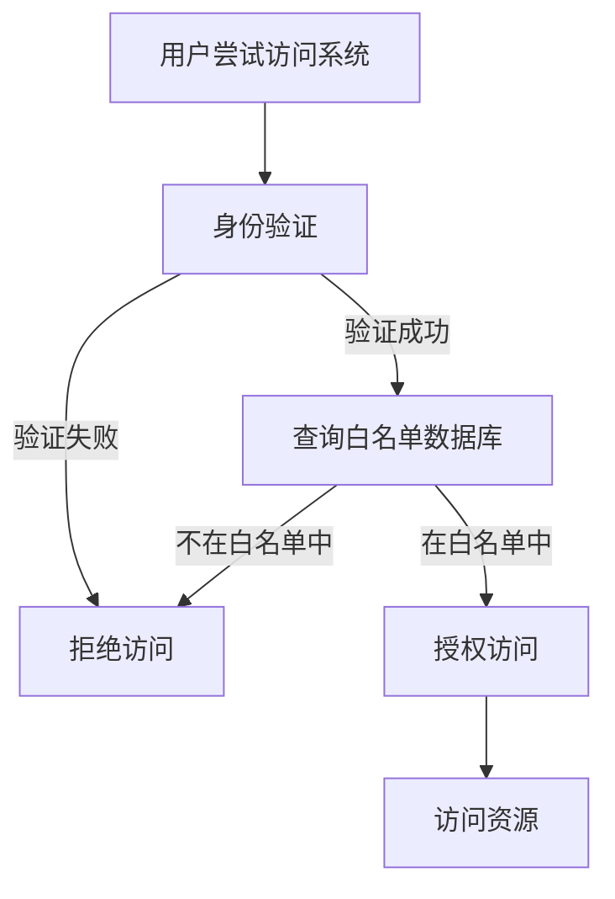

                 

# 白名单：防止未经授权的访问

> **关键词**：白名单、访问控制、安全策略、授权机制、身份验证、网络安全

> **摘要**：本文将深入探讨白名单机制在网络安全和访问控制中的作用。通过剖析白名单的定义、原理和实际应用，我们将揭示如何在现代信息系统中建立有效的访问控制策略，以防止未经授权的访问和潜在的安全威胁。文章将分为几个部分，包括背景介绍、核心概念解析、算法原理讲解、数学模型与公式、实战案例解析、实际应用场景分析、工具与资源推荐以及总结与展望。

## 1. 背景介绍

### 1.1 目的和范围

本文旨在为读者提供关于白名单机制的全面理解，以及其在网络安全和访问控制中的应用。我们将探讨白名单的核心概念、技术实现和最佳实践，帮助读者掌握如何有效地防止未经授权的访问。

本文的范围包括但不限于以下内容：

1. 白名单的定义和基本原理
2. 白名单与黑名单的区别
3. 白名单机制的架构设计
4. 白名单算法原理和实现
5. 白名单在实际项目中的应用案例
6. 白名单与其他安全策略的比较
7. 白名单的未来发展趋势

### 1.2 预期读者

本文适合以下读者群体：

1. 网络安全工程师和系统管理员
2. 软件开发者和安全专家
3. 信息安全爱好者
4. 大学生和研究学者

### 1.3 文档结构概述

本文结构如下：

1. **背景介绍**：介绍白名单机制的背景和目的。
2. **核心概念与联系**：分析白名单的核心概念和原理。
3. **核心算法原理 & 具体操作步骤**：讲解白名单算法原理和实现步骤。
4. **数学模型和公式 & 详细讲解 & 举例说明**：阐述白名单机制中的数学模型和公式。
5. **项目实战：代码实际案例和详细解释说明**：提供实际代码示例和解释。
6. **实际应用场景**：分析白名单在不同场景中的应用。
7. **工具和资源推荐**：推荐学习资源和开发工具。
8. **总结：未来发展趋势与挑战**：总结白名单的发展趋势和面临的挑战。
9. **附录：常见问题与解答**：提供常见问题的解答。
10. **扩展阅读 & 参考资料**：提供进一步的阅读材料和参考文献。

### 1.4 术语表

#### 1.4.1 核心术语定义

- **白名单**：指一组被授权访问特定资源或系统的实体列表。
- **访问控制**：指对系统资源进行访问限制和授权的管理机制。
- **黑名单**：指一组被禁止访问特定资源或系统的实体列表。
- **身份验证**：指验证用户身份的过程，确保用户拥有访问系统的权限。
- **安全策略**：指制定的一套安全规则和措施，用于保护系统资源免受未经授权的访问。

#### 1.4.2 相关概念解释

- **权限**：指用户对系统资源进行特定操作的能力。
- **用户认证**：指验证用户身份的过程，通常包括用户名和密码验证。
- **单点登录（SSO）**：指用户只需一次身份验证即可访问多个系统或应用。
- **加密**：指使用加密算法对数据进行编码，以防止未授权的访问。

#### 1.4.3 缩略词列表

- **SSL**：安全套接字层（Secure Sockets Layer）
- **HTTPS**：安全HTTP（Hypertext Transfer Protocol Secure）
- **IAM**：身份验证、授权和访问管理（Identity and Access Management）
- **PKI**：公钥基础设施（Public Key Infrastructure）
- **RBAC**：基于角色的访问控制（Role-Based Access Control）
- **ABAC**：基于属性的访问控制（Attribute-Based Access Control）

## 2. 核心概念与联系

### 2.1 白名单的定义与作用

白名单是一种访问控制机制，用于确保只有经过授权的实体才能访问特定的系统或资源。在白名单机制中，管理员会创建和维护一个包含被授权实体的列表，这些实体可以是用户、设备或服务。只有在这个列表中的实体才能通过身份验证并获得访问权限。

白名单机制的核心作用是提高系统的安全性，防止未经授权的访问。通过严格控制对系统资源的访问，白名单能够有效地降低安全风险，减少潜在的安全威胁。

### 2.2 白名单与黑名单的区别

与黑名单相对，白名单是一种完全不同的访问控制策略。黑名单是指一组被禁止访问系统或资源的实体列表，只有不在黑名单中的实体才能访问。而白名单则是只允许在列表中的实体访问，其他所有实体都被禁止访问。

- **黑名单**：
  - **优点**：简单、易于实现，可以快速响应和阻止恶意行为。
  - **缺点**：可能导致误判，限制合法用户的访问，维护成本高。
- **白名单**：
  - **优点**：安全性高，只允许经过授权的实体访问，降低误判的风险。
  - **缺点**：需要定期维护，初始设置较为复杂。

### 2.3 白名单机制的架构设计

白名单机制的架构设计主要包括以下几个关键组成部分：

1. **身份验证模块**：用于验证实体的身份，确保只有合法的实体才能访问系统。
2. **授权模块**：根据实体的身份和权限，决定实体能否访问特定的资源。
3. **白名单数据库**：存储经过授权的实体信息，包括用户名、IP地址、设备ID等。
4. **访问控制列表（ACL）**：用于记录每个实体能访问的资源列表，以及相应的权限。

### 2.4 白名单的工作原理

白名单的工作原理可以概括为以下步骤：

1. **身份验证**：当实体尝试访问系统时，系统会要求进行身份验证。
2. **查询白名单数据库**：系统会查询白名单数据库，以确定实体是否在授权列表中。
3. **授权判断**：如果实体在白名单中，系统将允许访问；否则，拒绝访问。
4. **资源访问**：授权实体可以访问其有权访问的系统资源。

### 2.5 白名单与其他安全策略的比较

- **与防火墙**：防火墙是一种基于规则的网络访问控制机制，白名单则是一种基于实体的访问控制机制。防火墙可以阻止未经授权的网络流量，而白名单则确保只有经过授权的实体才能访问系统。
- **与单点登录（SSO）**：SSO允许用户一次登录即可访问多个系统，而白名单则确保用户只能访问经过授权的系统。
- **与多因素认证（MFA）**：MFA是一种加强身份验证的方法，白名单则是一种确保只有经过多重验证的实体才能访问系统。

### 2.6 核心概念原理和架构的 Mermaid 流程图



## 3. 核心算法原理 & 具体操作步骤

### 3.1 白名单算法原理

白名单算法的核心是确保只有经过授权的实体才能访问系统。算法的基本原理可以分为以下几个步骤：

1. **身份验证**：验证实体（如用户）的身份，通常通过用户名和密码、证书或其他验证方式。
2. **权限检查**：根据实体的身份，检查其是否有权访问特定的资源。
3. **访问控制**：根据权限检查的结果，决定实体是否能够访问系统资源。

### 3.2 白名单算法伪代码

```python
def 白名单算法(用户, 资源):
    # 步骤1：身份验证
    如果 验证用户身份(用户):
        # 步骤2：权限检查
        如果 用户有权限访问资源:
            # 步骤3：访问控制
            返回 "授权访问"
        否则:
            返回 "拒绝访问"
    否则:
        返回 "身份验证失败"
```

### 3.3 白名单算法实现步骤

1. **初始化**：创建白名单数据库，存储授权实体的信息。
2. **身份验证**：用户尝试访问系统时，系统会要求进行身份验证。
3. **查询数据库**：系统会查询白名单数据库，以确定用户是否在授权列表中。
4. **权限检查**：根据用户的身份和权限，系统会检查用户是否有权访问特定的资源。
5. **访问控制**：根据权限检查的结果，系统会决定是否允许用户访问资源。

### 3.4 伪代码实现步骤

```python
# 步骤1：初始化
初始化白名单数据库

# 步骤2：身份验证
def 验证用户身份(用户):
    如果 用户在白名单数据库中:
        返回 "身份验证成功"
    否则:
        返回 "身份验证失败"

# 步骤3：查询数据库
def 查询白名单数据库(用户):
    # 在白名单数据库中查找用户
    如果 找到用户:
        返回 "用户在白名单中"
    否则:
        返回 "用户不在白名单中"

# 步骤4：权限检查
def 检查权限(用户, 资源):
    如果 用户有权限访问资源:
        返回 "用户有权限"
    否则:
        返回 "用户无权限"

# 步骤5：访问控制
def 授权访问(用户, 资源):
    如果 验证用户身份(用户) == "身份验证成功":
        如果 查询白名单数据库(用户) == "用户在白名单中":
            如果 检查权限(用户, 资源) == "用户有权限":
                返回 "授权访问"
            否则:
                返回 "拒绝访问"
        否则:
            返回 "拒绝访问"
    否则:
        返回 "身份验证失败"
```

## 4. 数学模型和公式 & 详细讲解 & 举例说明

### 4.1 白名单机制的数学模型

白名单机制的数学模型主要涉及概率论和集合论。以下是一些核心的数学公式和模型：

#### 4.1.1 概率模型

- **正确拒绝率（True Negative Rate, TNR）**：
  $$ TNR = \frac{TN}{N} $$
  其中，TN代表实际未被授权但被正确拒绝的实体数量，N代表总的实体数量。

- **正确接受率（True Positive Rate, TPR）**：
  $$ TPR = \frac{TP}{P} $$
  其中，TP代表实际被授权但被正确接受的实体数量，P代表总被授权的实体数量。

- **F1 分数（F1 Score）**：
  $$ F1 = 2 \times \frac{TPR \times TNR}{TPR + TNR} $$

#### 4.1.2 集合模型

- **授权集合（A）**：包含所有被授权访问系统的实体。
- **非授权集合（N-A）**：包含所有未被授权访问系统的实体。

#### 4.1.3 决策阈值模型

- **决策阈值（θ）**：用于确定实体是否被授权访问系统的阈值。

  如果 实体特征值 ≥ θ，则实体被授权访问；
  如果 实体特征值 < θ，则实体被拒绝访问。

### 4.2 详细讲解

#### 4.2.1 概率模型讲解

概率模型用于评估白名单机制的准确性和可靠性。正确拒绝率（TNR）和正确接受率（TPR）是评估指标，F1 分数则是综合考虑两者的一种指标。

- **正确拒绝率（TNR）**：表示实际未被授权但被正确拒绝的实体比例。TNR 越高，说明白名单机制对未被授权的实体识别效果越好。
- **正确接受率（TPR）**：表示实际被授权但被正确接受的实体比例。TPR 越高，说明白名单机制对被授权的实体识别效果越好。
- **F1 分数**：是 TNR 和 TPR 的调和平均，综合反映了白名单机制的识别效果。F1 分数越高，说明白名单机制的整体性能越好。

#### 4.2.2 集合模型讲解

集合模型用于描述白名单机制中的实体集合。授权集合（A）包含所有经过授权的实体，非授权集合（N-A）包含所有未经授权的实体。

- **授权集合（A）**：用于存储所有被授权的实体，包括用户、设备等。
- **非授权集合（N-A）**：用于存储所有未被授权的实体，当实体尝试访问系统时，系统会检查其实体特征是否在授权集合中。

#### 4.2.3 决策阈值模型讲解

决策阈值（θ）是白名单机制中的一个关键参数，用于确定实体是否被授权访问系统。

- **决策阈值（θ）**：用于设定实体特征值与授权阈值之间的关系。如果实体的特征值大于或等于阈值，则实体被授权访问；否则，实体被拒绝访问。

### 4.3 举例说明

#### 4.3.1 概率模型举例

假设一个系统有 100 个实体，其中 60 个是未被授权的实体，40 个是被授权的实体。在白名单机制中，实际未被授权但被正确拒绝的实体有 50 个，实际被授权但被正确接受的实体有 30 个。

- **正确拒绝率（TNR）**：
  $$ TNR = \frac{TN}{N} = \frac{50}{100} = 0.5 $$
- **正确接受率（TPR）**：
  $$ TPR = \frac{TP}{P} = \frac{30}{40} = 0.75 $$
- **F1 分数**：
  $$ F1 = 2 \times \frac{TPR \times TNR}{TPR + TNR} = 2 \times \frac{0.75 \times 0.5}{0.75 + 0.5} = 0.625 $$

#### 4.3.2 集合模型举例

假设一个系统中有 5 个用户，其中 3 个用户被授权访问系统，2 个用户未被授权。

- **授权集合（A）**：{User1, User2, User3}
- **非授权集合（N-A）**：{User4, User5}

当用户 User4 尝试访问系统时，系统会检查其是否在授权集合中。由于 User4 不在授权集合中，系统将拒绝其访问。

#### 4.3.3 决策阈值模型举例

假设系统设定一个决策阈值 θ = 0.6。如果一个实体的特征值大于或等于 0.6，则实体被授权访问；否则，实体被拒绝访问。

- **实体 1**：特征值 = 0.7，被授权访问。
- **实体 2**：特征值 = 0.5，被拒绝访问。

## 5. 项目实战：代码实际案例和详细解释说明

### 5.1 开发环境搭建

为了实现白名单机制，我们首先需要搭建一个基本的开发环境。以下是一个简单的 Python 开发环境搭建步骤：

1. 安装 Python：访问 Python 官网（https://www.python.org/）下载并安装 Python，建议安装 Python 3.8 或以上版本。
2. 安装依赖库：使用 pip 工具安装所需的依赖库，例如 Flask、PyMySQL 等。
   ```bash
   pip install flask pymysql
   ```

### 5.2 源代码详细实现和代码解读

以下是实现白名单机制的一个简单 Python 代码示例。代码使用了 Flask 作为 Web 框架，PyMySQL 作为数据库驱动。

```python
from flask import Flask, request, jsonify
import pymysql

app = Flask(__name__)

# 白名单数据库配置
db_config = {
    'host': 'localhost',
    'user': 'root',
    'password': 'password',
    'database': 'whitelist_db'
}

# 连接数据库
def connect_db():
    connection = pymysql.connect(**db_config)
    return connection

# 查询用户是否在白名单中
def is_user_in_whitelist(username):
    connection = connect_db()
    with connection.cursor() as cursor:
        sql = "SELECT * FROM whitelist WHERE username = %s"
        cursor.execute(sql, (username,))
        result = cursor.fetchone()
        connection.close()
        return result is not None

# 检查用户权限
def check_user_permission(username, resource):
    connection = connect_db()
    with connection.cursor() as cursor:
        sql = "SELECT * FROM permissions WHERE username = %s AND resource = %s"
        cursor.execute(sql, (username, resource))
        result = cursor.fetchone()
        connection.close()
        return result is not None

# 登录接口
@app.route('/login', methods=['POST'])
def login():
    username = request.form['username']
    password = request.form['password']
    
    # 查询用户是否在白名单中
    if is_user_in_whitelist(username):
        # 验证用户密码（此处省略密码验证过程）
        return jsonify({'status': 'success', 'message': '登录成功'})
    else:
        return jsonify({'status': 'error', 'message': '用户名或密码错误'})

# 资源访问接口
@app.route('/resource', methods=['GET'])
def resource():
    username = request.form['username']
    resource = request.form['resource']
    
    # 检查用户权限
    if check_user_permission(username, resource):
        return jsonify({'status': 'success', 'message': '访问成功'})
    else:
        return jsonify({'status': 'error', 'message': '无权限访问'})

if __name__ == '__main__':
    app.run()
```

### 5.3 代码解读与分析

1. **数据库配置**：代码中使用了 `db_config` 字典存储数据库连接信息，包括主机地址、用户名、密码和数据库名称。
2. **数据库连接**：`connect_db` 函数用于建立与数据库的连接，使用 `pymysql.connect` 方法。
3. **查询用户是否在白名单中**：`is_user_in_whitelist` 函数通过查询 `whitelist` 表，判断用户是否在白名单中。
4. **检查用户权限**：`check_user_permission` 函数通过查询 `permissions` 表，判断用户是否有权访问特定资源。
5. **登录接口**：`/login` 接口接收用户名和密码，验证用户是否在白名单中。此处省略了密码验证过程。
6. **资源访问接口**：`/resource` 接口接收用户名和资源名称，检查用户是否有权限访问该资源。

通过以上代码示例，我们可以看到如何使用 Python 实现一个简单的白名单机制。在实际项目中，可以根据需求扩展功能，如添加密码验证、多因素认证等。

## 6. 实际应用场景

### 6.1 网络安全领域

白名单机制在网络安全领域中有着广泛的应用。例如，在企业的网络安全防护中，可以通过白名单机制限制员工对互联网的访问，仅允许访问与工作相关的网站和资源，从而降低安全风险。

### 6.2 云计算服务

在云计算服务中，白名单机制用于控制用户对云资源的访问。通过设置白名单，云服务提供商可以确保只有经过授权的用户和设备才能访问云资源，提高资源的安全性。

### 6.3 金融行业

金融行业对数据安全的要求极高，白名单机制可用于控制对敏感数据的访问。例如，在银行系统中，可以通过白名单机制确保只有授权用户才能访问客户账户信息，从而防止未经授权的访问。

### 6.4 教育领域

在教育领域，白名单机制可以用于控制学生和教师的访问权限。例如，在在线教育平台中，可以通过白名单机制确保只有注册用户才能访问课程内容，从而提高平台的用户隐私和安全。

### 6.5 工业控制系统

工业控制系统对安全性的要求也较高，白名单机制可用于确保只有经过授权的设备和用户才能访问控制系统。例如，在工业生产过程中，可以通过白名单机制限制对生产设备的访问，防止恶意攻击和误操作。

## 7. 工具和资源推荐

### 7.1 学习资源推荐

#### 7.1.1 书籍推荐

- **《网络安全基础》**：全面介绍网络安全的基础知识，包括访问控制、身份验证、加密等。
- **《网络安全实战》**：通过实战案例讲解网络安全技术，包括白名单、黑名单等访问控制策略。
- **《Python 网络编程》**：详细介绍 Python 在网络安全领域的应用，包括白名单机制的实际实现。

#### 7.1.2 在线课程

- **网络安全基础课程**：提供关于网络安全基础知识的在线课程，包括白名单、黑名单等访问控制策略。
- **Python 网络编程课程**：介绍 Python 在网络安全领域的应用，包括白名单机制的实际实现。

#### 7.1.3 技术博客和网站

- **FreeBuf**：提供关于网络安全的技术博客和资讯。
- **51CTO**：提供关于网络安全和编程技术的博客和教程。

### 7.2 开发工具框架推荐

#### 7.2.1 IDE和编辑器

- **PyCharm**：适用于 Python 开发的集成开发环境（IDE），具有强大的代码编辑和调试功能。
- **VSCode**：适用于多种编程语言的跨平台编辑器，支持丰富的插件和扩展。

#### 7.2.2 调试和性能分析工具

- **GDB**：GNU 调试工具，用于调试 C/C++ 程序。
- **PyDebug**：Python 调试工具，用于调试 Python 程序。

#### 7.2.3 相关框架和库

- **Flask**：轻量级的 Python Web 框架，适用于构建 Web 应用程序。
- **Django**：全栈 Python Web 框架，适用于快速开发 Web 应用程序。

### 7.3 相关论文著作推荐

#### 7.3.1 经典论文

- **"The Design and Implementation of the FreeBSD operating system"**：介绍 FreeBSD 操作系统的设计和实现，包括访问控制机制。
- **"Access Control Models for Linux"**：介绍 Linux 系统中的访问控制模型，包括白名单和黑名单机制。

#### 7.3.2 最新研究成果

- **"Machine Learning Based Access Control in Cloud Computing"**：探讨基于机器学习的云访问控制机制。
- **"Attribute-Based Access Control for Internet of Things"**：介绍物联网环境下的属性基访问控制机制。

#### 7.3.3 应用案例分析

- **"Securing Enterprise Networks with White List Management"**：分析企业网络中白名单机制的应用和实践。
- **"Implementing a White List Based Firewall in Linux"**：介绍在 Linux 系统中实现白名单防火墙的方法。

## 8. 总结：未来发展趋势与挑战

### 8.1 发展趋势

- **人工智能和机器学习**：未来，人工智能和机器学习将在白名单机制中发挥更大的作用，通过自动化和智能化的方法提高访问控制的效果和效率。
- **物联网和边缘计算**：随着物联网和边缘计算的发展，白名单机制将面临更多复杂的场景和挑战，需要适应多样化的设备和环境。
- **多因素认证**：多因素认证（MFA）将逐渐成为白名单机制的补充，提高访问控制的安全性和可靠性。

### 8.2 挑战

- **数据隐私和合规性**：如何在确保数据隐私和安全合规性的同时，有效实施白名单机制，是一个重要的挑战。
- **动态变化**：随着网络环境和用户需求的动态变化，如何实时更新和维护白名单，保持其有效性和准确性，也是一个挑战。
- **性能和效率**：在大规模系统中，如何高效地实现和部署白名单机制，保证系统的性能和响应速度，是另一个挑战。

## 9. 附录：常见问题与解答

### 9.1 白名单与黑名单的区别是什么？

白名单和黑名单是两种不同的访问控制策略。白名单只允许经过授权的实体访问系统，而黑名单则是阻止未经授权的实体访问系统。简单来说，白名单是“允许谁访问”，黑名单是“阻止谁访问”。

### 9.2 什么是多因素认证（MFA）？

多因素认证（MFA）是一种安全措施，要求用户在登录时提供多个验证因素，例如密码、手机验证码、指纹等。通过多因素认证，可以进一步提高访问控制的安全性。

### 9.3 什么是单点登录（SSO）？

单点登录（SSO）是一种身份验证机制，允许用户使用一个账号和密码登录多个系统或应用，从而简化登录过程，提高用户体验。

### 9.4 白名单机制如何提高系统的安全性？

白名单机制通过严格控制对系统资源的访问，确保只有经过授权的实体才能访问，从而降低未经授权的访问风险。此外，白名单机制还可以与多因素认证、加密等技术结合，进一步提高系统的安全性。

## 10. 扩展阅读 & 参考资料

- **《网络安全基础》**：全面介绍网络安全的基础知识，包括访问控制、身份验证、加密等。
- **《网络安全实战》**：通过实战案例讲解网络安全技术，包括白名单、黑名单等访问控制策略。
- **《Python 网络编程》**：详细介绍 Python 在网络安全领域的应用，包括白名单机制的实际实现。
- **FreeBuf**：提供关于网络安全的技术博客和资讯。
- **51CTO**：提供关于网络安全和编程技术的博客和教程。
- **"The Design and Implementation of the FreeBSD operating system"**：介绍 FreeBSD 操作系统的设计和实现，包括访问控制机制。
- **"Access Control Models for Linux"**：介绍 Linux 系统中的访问控制模型，包括白名单和黑名单机制。
- **"Machine Learning Based Access Control in Cloud Computing"**：探讨基于机器学习的云访问控制机制。
- **"Attribute-Based Access Control for Internet of Things"**：介绍物联网环境下的属性基访问控制机制。
- **"Securing Enterprise Networks with White List Management"**：分析企业网络中白名单机制的应用和实践。
- **"Implementing a White List Based Firewall in Linux"**：介绍在 Linux 系统中实现白名单防火墙的方法。

