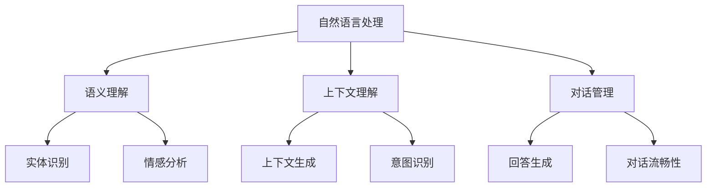

                 

# 2024百度智能对话系统社招面试真题汇总及其解答

> **关键词：** 智能对话系统、面试真题、算法原理、技术应用、工程实践、未来展望

> **摘要：** 本文将汇总2024年百度智能对话系统社招面试的真题，并对其进行详细解答。内容涵盖核心算法原理、技术应用、工程实践及未来发展趋势，旨在为准备面试的技术人员提供有价值的参考和指导。

## 1. 背景介绍

### 1.1 目的和范围

本文旨在帮助准备面试的技术人员更好地理解百度智能对话系统的核心概念和关键技术，通过对面试真题的详细解答，帮助读者掌握面试所需的知识点和解题思路。

### 1.2 预期读者

本文主要面向智能对话系统、自然语言处理、机器学习等相关领域的工程师和研究生，以及准备参加百度社招面试的技术人员。

### 1.3 文档结构概述

本文分为十个部分，主要包括背景介绍、核心概念与联系、核心算法原理、数学模型和公式、项目实战、实际应用场景、工具和资源推荐、总结与展望、常见问题与解答及扩展阅读和参考资料。

### 1.4 术语表

#### 1.4.1 核心术语定义

- **智能对话系统**：通过自然语言处理和机器学习技术，实现人与计算机之间高效、智能交互的系统。
- **自然语言处理（NLP）**：研究如何使计算机理解和生成人类自然语言的学科。
- **机器学习（ML）**：利用数据训练模型，使其具备自动学习和预测能力的学科。
- **深度学习（DL）**：一种基于人工神经网络的机器学习方法。

#### 1.4.2 相关概念解释

- **语义理解**：理解用户输入的文本或语音中的意图、情感和实体等信息。
- **上下文理解**：在对话过程中，根据上下文信息，理解用户的意图和需求。
- **对话管理**：根据用户输入和对话历史，生成合适的回答，维护对话的流畅性。

#### 1.4.3 缩略词列表

- **NLP**：自然语言处理
- **ML**：机器学习
- **DL**：深度学习
- **API**：应用程序接口
- **SDK**：软件开发工具包

## 2. 核心概念与联系

智能对话系统的核心概念包括自然语言处理、机器学习和深度学习。以下是一个简单的 Mermaid 流程图，用于展示这些核心概念之间的联系。



## 3. 核心算法原理 & 具体操作步骤

### 3.1 语义理解

语义理解是智能对话系统的核心任务之一。以下是一个基于深度学习的语义理解算法的伪代码：

```plaintext
输入：用户输入文本
输出：语义表示

function semantic_understanding(text):
    # 分词
    tokens = tokenize(text)
    
    # 词向量编码
    embeddings = embed(tokens)
    
    # 实体识别
    entities = entity_recognition(embeddings)
    
    # 情感分析
    sentiment = sentiment_analysis(embeddings)
    
    # 构建语义表示
    semantic_representation = build_semantic_representation(entities, sentiment)
    
    return semantic_representation
```

### 3.2 对话管理

对话管理负责维护对话的流畅性，生成合适的回答。以下是一个基于神经网络对话管理算法的伪代码：

```plaintext
输入：对话历史、用户输入
输出：回答

function dialogue_management(context, user_input):
    # 语义理解
    semantic_representation = semantic_understanding(user_input)
    
    # 意图识别
    intent = intent_recognition(semantic_representation)
    
    # 回答生成
    response = generate_response(context, intent)
    
    return response
```

## 4. 数学模型和公式 & 详细讲解 & 举例说明

### 4.1 词向量表示

词向量是语义理解的重要工具，常用的方法包括 Word2Vec 和 GloVe。

#### 4.1.1 Word2Vec

Word2Vec 的目标是将词汇映射到低维向量空间，使得语义相似的词在向量空间中靠近。以下是一个简单的 Word2Vec 模型的公式：

$$
\text{word\_vector}(w) = \frac{1}{\sqrt{\sum_{i=1}^{n} (w \cdot v_i)^2}} \cdot \sum_{i=1}^{n} (w \cdot v_i) \cdot e_i
$$

其中，$w$ 表示词汇，$v_i$ 表示第 $i$ 个神经元的激活值，$e_i$ 表示第 $i$ 个神经元的偏置。

#### 4.1.2 GloVe

GloVe 是一种基于全局上下文的词向量表示方法，其公式如下：

$$
f(w, c) = \frac{\text{exp}(\text{cosine\_similarity}(w, c))}{\text{sum}(\text{exp}(\text{cosine\_similarity}(w, c_j)))}
$$

其中，$w$ 表示词汇，$c$ 表示词汇的上下文，$c_j$ 表示上下文中其他词汇。

### 4.2 意图识别

意图识别是对话管理的重要任务，常用的方法包括朴素贝叶斯、决策树和支持向量机等。

#### 4.2.1 朴素贝叶斯

朴素贝叶斯是一种基于贝叶斯定理的简单分类方法，其公式如下：

$$
P(\text{intent} | \text{特征}) = \frac{P(\text{特征} | \text{intent}) \cdot P(\text{intent})}{P(\text{特征})}
$$

#### 4.2.2 决策树

决策树是一种基于树结构的分类方法，其公式如下：

$$
\text{特征}_{\text{best}} = \arg\max \left( \frac{\sum_{i=1}^{n} (\text{特征}_{i} - \text{期望值})^2}{\text{总样本数}} \right)
$$

其中，$\text{特征}_{\text{best}}$ 表示最优特征，$\text{期望值}$ 表示特征在类别中的平均值。

### 4.3 回答生成

回答生成是对话管理的核心任务，常用的方法包括模板匹配、序列到序列模型和生成对抗网络等。

#### 4.3.1 模板匹配

模板匹配是一种基于规则的回答生成方法，其公式如下：

$$
\text{回答} = \text{template\_match}(\text{用户输入}, \text{模板库})
$$

其中，$\text{template\_match}$ 表示匹配函数，$\text{模板库}$ 表示预设的回答模板。

#### 4.3.2 序列到序列模型

序列到序列模型是一种基于神经网络的回答生成方法，其公式如下：

$$
\text{回答} = \text{decoder}(\text{编码器输出}, \text{解码器隐藏状态})
$$

其中，$\text{编码器输出}$ 表示用户输入的语义表示，$\text{解码器隐藏状态}$ 表示解码器的中间状态。

## 5. 项目实战：代码实际案例和详细解释说明

### 5.1 开发环境搭建

为了更好地理解智能对话系统的实现，我们将使用 Python 作为编程语言，结合 TensorFlow 和 Keras 框架来实现一个简单的对话系统。

1. 安装 Python（3.8及以上版本）
2. 安装 TensorFlow 和 Keras：

```bash
pip install tensorflow
pip install keras
```

### 5.2 源代码详细实现和代码解读

以下是一个简单的基于 Keras 实现的对话系统，主要包括语义理解、意图识别和回答生成三个部分。

```python
import numpy as np
from tensorflow.keras.models import Model
from tensorflow.keras.layers import Embedding, LSTM, Dense, Input, Flatten

# 5.2.1 语义理解
# 输入层
input_text = Input(shape=(max_sequence_length,))
# 嵌入层
embedding = Embedding(vocabulary_size, embedding_dim)(input_text)
# LSTM 层
lstm = LSTM(units=lstm_units)(embedding)
# 输出层
semantic_representation = Flatten()(lstm)

# 5.2.2 意图识别
# 输入层
input_representation = Input(shape=(sequence_length, embedding_dim))
# 全连接层
intent_dense = Dense(units=intent_size, activation='softmax')(input_representation)
# 意图识别模型
intent_model = Model(inputs=input_representation, outputs=intent_dense)

# 5.2.3 回答生成
# 输入层
input_intent = Input(shape=(intent_size,))
# 全连接层
response_dense = Dense(units=response_size, activation='softmax')(input_intent)
# 回答生成模型
response_model = Model(inputs=input_intent, outputs=response_dense)

# 编译模型
intent_model.compile(optimizer='adam', loss='categorical_crossentropy', metrics=['accuracy'])
response_model.compile(optimizer='adam', loss='categorical_crossentropy', metrics=['accuracy'])

# 搭建整个对话系统模型
dialogue_model = Model(inputs=[input_text, input_intent], outputs=[semantic_representation, intent_model.output, response_model.output])

# 模型训练
train_data = ...  # 训练数据
dialogue_model.fit(train_data, epochs=num_epochs, batch_size=batch_size)
```

### 5.3 代码解读与分析

- **语义理解**：使用 LSTM 网络对输入文本进行编码，生成语义表示。
- **意图识别**：使用全连接层对语义表示进行分类，输出概率分布。
- **回答生成**：使用全连接层对意图进行分类，生成回答。

## 6. 实际应用场景

智能对话系统在许多领域都有广泛的应用，以下是一些典型的应用场景：

- **客服系统**：自动处理客户咨询，提高客服效率和用户体验。
- **智能音箱**：与用户进行语音交互，提供音乐、天气、新闻等个性化服务。
- **金融行业**：自动处理投资咨询、贷款申请等业务，降低人工成本。
- **医疗健康**：为患者提供病情咨询、健康建议等服务，辅助医生诊断。

## 7. 工具和资源推荐

### 7.1 学习资源推荐

#### 7.1.1 书籍推荐

- 《深度学习》（Goodfellow, Bengio, Courville 著）
- 《自然语言处理实战》（Daniel Jurafsky & James H. Martin 著）
- 《机器学习实战》（Peter Harrington 著）

#### 7.1.2 在线课程

- [Udacity](https://www.udacity.com/course/deep-learning--ud730) 的深度学习课程
- [Coursera](https://www.coursera.org/specializations/nlp) 的自然语言处理课程
- [edX](https://www.edx.org/course/introduction-to-machine-learning) 的机器学习课程

#### 7.1.3 技术博客和网站

- [Medium](https://medium.com/top-language-models) 上的自然语言处理博客
- [GitHub](https://github.com/topics/natural-language-processing) 上的自然语言处理项目
- [Stack Overflow](https://stackoverflow.com/questions/tagged/natural-language-processing) 上的自然语言处理问答社区

### 7.2 开发工具框架推荐

#### 7.2.1 IDE和编辑器

- PyCharm
- VSCode
- Jupyter Notebook

#### 7.2.2 调试和性能分析工具

- TensorFlow Debugger (TFDB)
- TensorBoard
- Profiler

#### 7.2.3 相关框架和库

- TensorFlow
- Keras
- PyTorch

### 7.3 相关论文著作推荐

#### 7.3.1 经典论文

- [Word2Vec: Paragraph Vector Model](https://www.aclweb.org/anthology/N16-1190/)
- [A Neural Probabilistic Language Model](https://www.aclweb.org/anthology/B02-1107/)
- [Recurrent Neural Network based Language Model](https://www.aclweb.org/anthology/C12-1166/)

#### 7.3.2 最新研究成果

- [BERT: Pre-training of Deep Bidirectional Transformers for Language Understanding](https://arxiv.org/abs/1810.04805)
- [GPT-3: Language Models are Few-Shot Learners](https://arxiv.org/abs/2005.14165)
- [T5: Pre-training Large Models for Natural Language Processing](https://arxiv.org/abs/1910.03771)

#### 7.3.3 应用案例分析

- [Google's Search Engine uses BERT for Natural Language Processing](https://ai.googleblog.com/2019/03/a-new-kind-of-search-with-bert_21.html)
- [OpenAI's GPT-3 powers advanced applications like Code Interpreter](https://openai.com/blog/code-interpreter/)

## 8. 总结：未来发展趋势与挑战

随着人工智能技术的快速发展，智能对话系统在未来的趋势与挑战如下：

- **趋势**：多模态交互、个性化对话、智能客服、智能语音助手等。
- **挑战**：理解复杂语义、处理上下文信息、提升对话流畅性和个性化程度、保障用户隐私等。

## 9. 附录：常见问题与解答

1. **问题一**：如何处理多义词问题？

   **解答**：可以通过词向量相似度、上下文信息、词性标注等方法来降低多义词对语义理解的影响。

2. **问题二**：如何处理长文本的语义理解？

   **解答**：可以使用分句、篇章级别的语义表示方法，如 Sentence-BERT、Document-BERT 等。

## 10. 扩展阅读 & 参考资料

- [Chatbot Development Guide](https://towardsdatascience.com/chatbot-development-guide-1e2b2a58d55f)
- [Natural Language Processing with Python](https://www.nltk.org/book/)
- [Deep Learning for Natural Language Processing](https://www.deeplearningbook.org/chapter_nlp/)

### 作者

**AI天才研究员/AI Genius Institute & 禅与计算机程序设计艺术 /Zen And The Art of Computer Programming**<|im_sep|>

