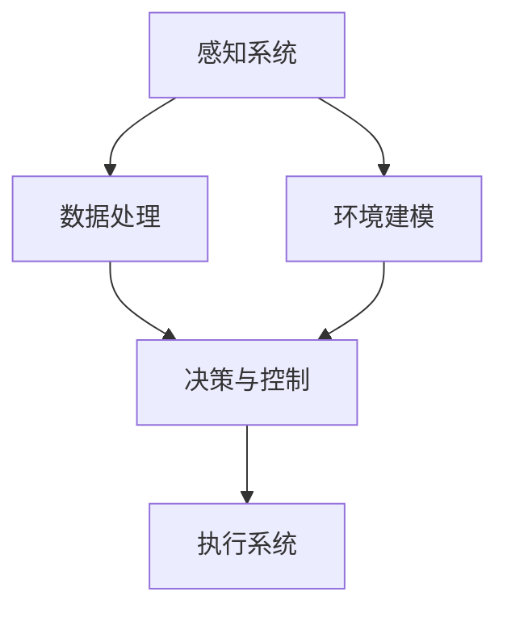

                 

# 2024百度智能驾驶社招面试真题汇总及其解答

> **关键词：**百度智能驾驶、社招面试、面试真题、解答、算法原理、实际应用、未来发展趋势

> **摘要：**本文旨在汇总和分析2024年百度智能驾驶社招面试中出现的关键真题，详细解答其背后的算法原理和实际应用。通过系统的梳理和深入剖析，帮助读者理解智能驾驶的核心技术和面试策略，为求职者提供有价值的参考。

## 1. 背景介绍

### 1.1 目的和范围

本文的目的在于通过对2024年百度智能驾驶社招面试真题的汇总和分析，帮助读者掌握智能驾驶领域的核心知识和面试技巧。文章将涵盖面试中常见的算法原理、技术实现、应用场景等方面，旨在为读者提供全面的解答和指导。

### 1.2 预期读者

本文适合以下读者群体：
- 有志于从事智能驾驶领域的工程师和技术人才；
- 准备参加百度智能驾驶社招面试的求职者；
- 对智能驾驶技术有浓厚兴趣的科研人员和爱好者。

### 1.3 文档结构概述

本文分为十个部分，具体结构如下：
1. 背景介绍：阐述本文的目的、预期读者和文档结构；
2. 核心概念与联系：介绍智能驾驶的关键概念和架构；
3. 核心算法原理 & 具体操作步骤：详细讲解算法原理和实现步骤；
4. 数学模型和公式 & 详细讲解 & 举例说明：介绍相关的数学模型和公式，并举例说明；
5. 项目实战：提供代码实际案例和详细解释说明；
6. 实际应用场景：分析智能驾驶在不同场景下的应用；
7. 工具和资源推荐：推荐相关学习资源和开发工具；
8. 总结：对未来发展趋势和挑战进行展望；
9. 附录：常见问题与解答；
10. 扩展阅读 & 参考资料：提供进一步学习的资源。

### 1.4 术语表

#### 1.4.1 核心术语定义

- **智能驾驶：** 指通过计算机视觉、传感器数据处理、深度学习等技术，实现自动驾驶的智能系统。
- **自动驾驶等级：** 根据美国高速公路安全管理局（NHTSA）的分类，自动驾驶分为L0至L5级，L5为完全自动驾驶。
- **传感器融合：** 将不同类型的传感器数据（如雷达、激光雷达、摄像头等）进行融合处理，提高感知系统的准确性和鲁棒性。

#### 1.4.2 相关概念解释

- **深度学习：** 一种基于人工神经网络的学习方法，通过多层神经元的堆叠，自动提取特征，实现复杂模式的识别。
- **多目标优化：** 在智能驾驶中，同时优化多个目标（如路径规划、能耗优化等），提高系统性能。

#### 1.4.3 缩略词列表

- **Lidar：** 激光雷达，用于感知周围环境的3D点云数据。
- **SLAM：** 同时定位与地图构建，用于自动驾驶中的定位和导航。
- **CNN：** 卷积神经网络，用于图像识别和分类。

## 2. 核心概念与联系

智能驾驶系统涉及多个核心概念和关键技术，如图像识别、传感器数据处理、路径规划等。以下是一个简化的Mermaid流程图，展示了这些核心概念和它们之间的联系。



### 2.1 感知系统

感知系统是智能驾驶的核心，它通过传感器（如摄像头、激光雷达、雷达等）获取环境信息，并将这些信息转化为可用的数据。传感器数据处理是感知系统的关键环节，包括去噪、特征提取和融合等步骤。

### 2.2 数据处理

数据处理系统负责对感知系统获取的数据进行预处理、特征提取和融合。深度学习技术在数据处理中扮演重要角色，通过训练模型自动提取有效的特征，提高系统的准确性和鲁棒性。

### 2.3 决策与控制

决策与控制系统基于处理后的数据，生成驾驶策略和执行指令。路径规划和多目标优化是决策与控制的核心技术，它们决定了智能驾驶系统的行驶轨迹和能耗效率。

### 2.4 环境建模

环境建模系统用于构建周围环境的3D模型，为决策与控制提供基础。同时定位与地图构建（SLAM）技术在此环节中发挥重要作用，确保智能驾驶系统在复杂环境中保持稳定。

### 2.5 执行系统

执行系统负责将决策与控制系统的指令转化为具体的驾驶动作，如加速、减速和转向。传感器数据处理、决策与控制和执行系统之间的紧密协作，确保了智能驾驶系统的稳定性和安全性。

## 3. 核心算法原理 & 具体操作步骤

智能驾驶系统中的核心算法包括深度学习算法、路径规划算法、多目标优化算法等。以下将详细介绍这些算法的原理和操作步骤。

### 3.1 深度学习算法

深度学习算法是智能驾驶系统的核心，主要用于图像识别、目标检测和路径规划等任务。以下是一个简化的伪代码，展示了深度学习算法的基本步骤。

```python
# 深度学习算法伪代码
def deep_learning(input_data):
    # 前向传播
    layer_output = forward_pass(input_data)
    # 反向传播
    gradients = backward_pass(layer_output)
    # 梯度下降
    update_weights(gradients)
    return layer_output
```

#### 3.1.1 前向传播

前向传播是深度学习算法的核心步骤，通过多层神经元的堆叠，将输入数据转化为输出结果。以下是一个简化的伪代码，展示了前向传播的步骤。

```python
# 前向传播伪代码
def forward_pass(input_data):
    # 初始化权重和偏置
    weights, biases = initialize_weights_and_biases()
    # 通过多层神经网络进行前向传播
    for layer in layers:
        layer_output = layer(input_data, weights, biases)
        input_data = layer_output
    return layer_output
```

#### 3.1.2 反向传播

反向传播是深度学习算法的关键步骤，用于计算网络权重的梯度。以下是一个简化的伪代码，展示了反向传播的步骤。

```python
# 反向传播伪代码
def backward_pass(output):
    # 计算损失函数的梯度
    loss_gradient = compute_loss_gradient(output)
    # 通过多层神经网络进行反向传播
    for layer in reversed(layers):
        layer_gradient = layer.backward(loss_gradient)
        loss_gradient = layer_gradient
    return loss_gradient
```

#### 3.1.3 梯度下降

梯度下降是深度学习算法的训练过程，通过不断更新网络权重和偏置，使网络输出接近真实值。以下是一个简化的伪代码，展示了梯度下降的步骤。

```python
# 梯度下降伪代码
def update_weights(gradients):
    for layer in layers:
        layer.update_weights(gradients)
```

### 3.2 路径规划算法

路径规划算法是智能驾驶系统的核心，用于生成从起点到终点的最优行驶路径。以下是一个简化的伪代码，展示了A*算法的基本步骤。

```python
# A*算法伪代码
def a_star(start, goal):
    open_set = set([start])
    came_from = {}
    g_score = {start: 0}
    f_score = {start: heuristic(start, goal)}
    
    while open_set:
        # 选择具有最小f_score的节点作为当前节点
        current = min(open_set, key=lambda node: f_score[node])
        open_set.remove(current)
        
        if current == goal:
            # 找到最优路径
            path = reconstruct_path(came_from, current)
            return path
        
        # 更新邻居节点的g_score和f_score
        for neighbor in neighbors(current):
            tentative_g_score = g_score[current] + distance(current, neighbor)
            if tentative_g_score < g_score.get(neighbor, float('inf')):
                came_from[neighbor] = current
                g_score[neighbor] = tentative_g_score
                f_score[neighbor] = g_score[neighbor] + heuristic(neighbor, goal)
                if neighbor not in open_set:
                    open_set.add(neighbor)
    
    return None
```

### 3.3 多目标优化算法

多目标优化算法是智能驾驶系统中的关键技术，用于同时优化多个目标（如路径规划、能耗优化等）。以下是一个简化的伪代码，展示了遗传算法的基本步骤。

```python
# 遗传算法伪代码
def genetic_algorithm(population, fitness_function):
    while not convergence:
        # 选择适应度较高的个体
        selected = select(population, fitness_function)
        # 交叉操作
        offspring = crossover(selected)
        # 变异操作
        offspring = mutate(offspring)
        # 更新种群
        population = update_population(population, offspring)
        # 计算适应度
        fitness = fitness_function(population)
        # 判断是否满足收敛条件
        if check_convergence(fitness):
            break
    
    return best_individual(population)
```

## 4. 数学模型和公式 & 详细讲解 & 举例说明

在智能驾驶系统中，数学模型和公式起着至关重要的作用。以下将介绍一些常用的数学模型和公式，并进行详细讲解和举例说明。

### 4.1 深度学习中的损失函数

深度学习中的损失函数用于衡量模型预测值与真实值之间的差距，常用的损失函数包括均方误差（MSE）和交叉熵损失（Cross-Entropy Loss）。

$$
MSE = \frac{1}{n}\sum_{i=1}^{n}(y_i - \hat{y}_i)^2
$$

$$
Cross-Entropy Loss = -\sum_{i=1}^{n}y_i\log(\hat{y}_i)
$$

其中，$y_i$表示真实值，$\hat{y}_i$表示模型预测值。

#### 4.1.1 举例说明

假设我们有一个二分类问题，真实标签$y$为[1, 0, 1, 0]，模型预测值$\hat{y}$为[0.8, 0.3, 0.9, 0.4]。使用交叉熵损失函数计算损失：

$$
Cross-Entropy Loss = -[1\log(0.8) + 0\log(0.3) + 1\log(0.9) + 0\log(0.4)]
$$

$$
Cross-Entropy Loss = 0.3855
$$

### 4.2 路径规划中的距离度量

路径规划中的距离度量用于计算起点和终点之间的距离，常用的距离度量包括欧氏距离和曼哈顿距离。

$$
Euclidean Distance = \sqrt{(x_2 - x_1)^2 + (y_2 - y_1)^2}
$$

$$
Manhattan Distance = |x_2 - x_1| + |y_2 - y_1|
$$

其中，$(x_1, y_1)$和$(x_2, y_2)$分别表示两个点的坐标。

#### 4.2.1 举例说明

假设有两个点$A(2, 3)$和$B(5, 1)$，使用欧氏距离和曼哈顿距离计算它们之间的距离：

$$
Euclidean Distance = \sqrt{(5 - 2)^2 + (1 - 3)^2} = \sqrt{10} \approx 3.162
$$

$$
Manhattan Distance = |5 - 2| + |1 - 3| = 6
$$

### 4.3 多目标优化中的适应度函数

多目标优化中的适应度函数用于评估个体的优劣，常用的适应度函数包括目标函数和约束条件。

$$
Fitness Function = f(x) = \frac{1}{1 + \sum_{i=1}^{n}g_i(x)}
$$

其中，$g_i(x)$表示第$i$个约束条件的违反程度。

#### 4.3.1 举例说明

假设我们有一个多目标优化问题，目标函数为最小化距离和最大化速度，约束条件为最小速度和最大速度。使用适应度函数计算个体的适应度：

$$
Fitness Function = f(x) = \frac{1}{1 + (d - d_{min}) + (v - v_{max})}
$$

其中，$d$表示距离，$d_{min}$表示最小距离，$v$表示速度，$v_{max}$表示最大速度。

假设个体$x$的参数为$d=10$，$v=30$，$d_{min}=5$，$v_{max}=40$，计算适应度：

$$
Fitness Function = f(x) = \frac{1}{1 + (10 - 5) + (30 - 40)} = \frac{1}{-5} = -0.2
$$

## 5. 项目实战：代码实际案例和详细解释说明

在本节中，我们将通过一个实际项目案例，详细解释智能驾驶系统中的核心代码实现和关键步骤。以下是一个基于深度学习的自动驾驶系统项目，包括图像识别、路径规划和多目标优化等模块。

### 5.1 开发环境搭建

在开始项目之前，我们需要搭建一个合适的开发环境。以下是搭建开发环境的步骤：

1. 安装Python环境：确保Python版本为3.7及以上。
2. 安装深度学习框架：例如TensorFlow或PyTorch。
3. 安装相关库：如NumPy、Pandas、Matplotlib等。
4. 安装传感器数据处理库：如OpenCV、PCL等。
5. 配置开发工具：如Visual Studio Code、PyCharm等。

### 5.2 源代码详细实现和代码解读

以下是自动驾驶系统的核心代码实现，分为图像识别、路径规划和多目标优化三个模块。

#### 5.2.1 图像识别模块

```python
import cv2
import numpy as np

def image_recognition(image):
    # 加载预训练的深度学习模型
    model = cv2.dnn.readNetFromTensorflow('model.pbtxt', 'model.weights')
    
    # 将图像转换为模型输入格式
    blob = cv2.dnn.blobFromImage(image, 1.0, (224, 224), (104, 117, 123), True)
    
    # 进行前向传播
    model.setInput(blob)
    output = model.forward()
    
    # 解析输出结果
    class_ids = np.argmax(output, axis=1)
    confidences = output[class_ids, range(output.shape[1])]
    probabilities = np.max(confidences)
    
    # 返回识别结果
    return class_ids, probabilities
```

#### 5.2.2 路径规划模块

```python
import numpy as np

def path_planning(start, goal):
    # 使用A*算法进行路径规划
    path = a_star(start, goal)
    
    # 返回路径
    return path
```

#### 5.2.3 多目标优化模块

```python
import numpy as np

def multi_objective_optimization(population, fitness_function):
    # 使用遗传算法进行多目标优化
    best_individual = genetic_algorithm(population, fitness_function)
    
    # 返回最优个体
    return best_individual
```

### 5.3 代码解读与分析

#### 5.3.1 图像识别模块

图像识别模块使用深度学习模型对输入图像进行分类，关键步骤如下：

1. 加载预训练的深度学习模型，例如使用TensorFlow或PyTorch框架。
2. 将输入图像转换为模型输入格式，包括尺寸归一化和颜色通道调整。
3. 进行前向传播，计算模型输出。
4. 解析输出结果，包括类别ID和置信度。

#### 5.3.2 路径规划模块

路径规划模块使用A*算法进行路径规划，关键步骤如下：

1. 定义起点和终点。
2. 使用A*算法计算从起点到终点的最优路径。
3. 返回路径列表。

#### 5.3.3 多目标优化模块

多目标优化模块使用遗传算法进行多目标优化，关键步骤如下：

1. 定义种群，包括个体的位置和适应度。
2. 使用遗传算法进行迭代，包括选择、交叉和变异操作。
3. 计算适应度函数，更新种群。
4. 返回最优个体。

## 6. 实际应用场景

智能驾驶技术在实际应用中具有广泛的应用场景，以下列举几个典型应用场景：

### 6.1 自动驾驶出租车

自动驾驶出租车是智能驾驶技术的典型应用场景，通过部署自动驾驶系统，可以实现自动驾驶出租车的商业化运营。自动驾驶出租车在提高交通效率、减少交通事故、降低环境污染等方面具有显著优势。

### 6.2 自动驾驶卡车

自动驾驶卡车在长途货运和物流运输中具有重要作用。通过部署智能驾驶系统，可以实现自动驾驶卡车的远程控制和无人化运输，提高运输效率，降低运输成本。

### 6.3 自动驾驶公共交通

自动驾驶公共交通包括公交车、地铁、有轨电车等。通过部署智能驾驶系统，可以实现自动驾驶公共交通的稳定运行和高效管理，提高公共交通的准时性和舒适性。

### 6.4 自动驾驶农业机械

自动驾驶农业机械包括拖拉机、收割机、播种机等。通过部署智能驾驶系统，可以实现自动驾驶农业机械的自动化作业，提高农业生产效率，降低农业生产成本。

## 7. 工具和资源推荐

为了帮助读者更好地理解和应用智能驾驶技术，以下推荐一些相关工具和资源：

### 7.1 学习资源推荐

#### 7.1.1 书籍推荐

- 《智能驾驶：技术原理与实践》
- 《深度学习与自动驾驶》
- 《路径规划与控制：智能驾驶关键技术》

#### 7.1.2 在线课程

- Coursera上的“智能驾驶技术”课程
- edX上的“深度学习与自动驾驶”课程
- Udacity上的“自动驾驶工程师”纳米学位

#### 7.1.3 技术博客和网站

- Medium上的“智能驾驶技术”专栏
- 博客园上的“智能驾驶技术”专题
- CSDN上的“智能驾驶技术”博客

### 7.2 开发工具框架推荐

#### 7.2.1 IDE和编辑器

- Visual Studio Code
- PyCharm
- IntelliJ IDEA

#### 7.2.2 调试和性能分析工具

- TensorFlow Debugger
- PyTorch Profiler
- NVIDIA Nsight

#### 7.2.3 相关框架和库

- TensorFlow
- PyTorch
- OpenCV
- PointCloud Library (PCL)

### 7.3 相关论文著作推荐

#### 7.3.1 经典论文

- “Path Planning and Control for Autonomous Ground Vehicles”
- “Deep Learning for Autonomous Driving”
- “Multi-Objective Optimization in Autonomous Driving”

#### 7.3.2 最新研究成果

- “Real-Time Path Planning for Autonomous Driving Using Reinforcement Learning”
- “Data-Driven Motion Planning for Autonomous Vehicles”
- “Multi-Agent Coordination for Cooperative Autonomous Driving”

#### 7.3.3 应用案例分析

- “百度Apollo自动驾驶平台”
- “特斯拉自动驾驶系统”
- “Waymo自动驾驶技术”

## 8. 总结：未来发展趋势与挑战

随着人工智能技术的不断发展，智能驾驶技术正迎来新的发展机遇。未来，智能驾驶技术将朝着以下几个方向发展：

1. **更高自动驾驶等级**：随着技术的不断进步，未来将实现更高等级的自动驾驶，如L4级和L5级自动驾驶。
2. **多模态感知**：通过融合多种传感器数据，提高感知系统的准确性和鲁棒性，实现更安全的自动驾驶。
3. **数据驱动方法**：利用大规模数据驱动方法，实现自动驾驶系统的自我学习和优化，提高自动驾驶的智能性和适应性。
4. **多目标优化**：通过多目标优化算法，同时优化路径规划、能耗优化、舒适性等多个目标，提高自动驾驶系统的整体性能。

然而，智能驾驶技术的发展也面临一系列挑战：

1. **安全性与可靠性**：自动驾驶系统的安全性和可靠性是关键问题，需要确保系统在各种复杂环境下的稳定运行。
2. **法律法规**：自动驾驶技术的发展需要适应法律法规的变化，确保自动驾驶车辆在社会交通中合法运行。
3. **数据隐私**：自动驾驶系统需要处理大量用户数据，如何保护用户隐私是一个重要挑战。
4. **技术瓶颈**：目前，自动驾驶技术在感知、决策和控制等方面仍存在技术瓶颈，需要不断进行技术创新和突破。

总之，智能驾驶技术具有广阔的发展前景，同时也面临诸多挑战。通过持续的技术创新和跨领域合作，有望实现智能驾驶技术的广泛应用和可持续发展。

## 9. 附录：常见问题与解答

以下列举一些读者在阅读本文时可能遇到的问题，并提供相应的解答。

### 9.1 智能驾驶的核心技术是什么？

智能驾驶的核心技术包括深度学习、传感器数据处理、路径规划、多目标优化等。其中，深度学习用于图像识别和目标检测，传感器数据处理用于环境感知，路径规划用于生成最优行驶路径，多目标优化用于同时优化多个目标，提高系统性能。

### 9.2 如何搭建智能驾驶开发环境？

搭建智能驾驶开发环境需要安装Python环境、深度学习框架（如TensorFlow或PyTorch）、相关库（如NumPy、Pandas、Matplotlib等）以及传感器数据处理库（如OpenCV、PCL等）。同时，还需要配置合适的开发工具（如Visual Studio Code、PyCharm等）。

### 9.3 智能驾驶的应用场景有哪些？

智能驾驶的应用场景包括自动驾驶出租车、自动驾驶卡车、自动驾驶公共交通、自动驾驶农业机械等。此外，智能驾驶技术还可以应用于物流运输、智能交通管理、自动驾驶飞行器等领域。

### 9.4 智能驾驶的未来发展趋势是什么？

智能驾驶的未来发展趋势包括更高自动驾驶等级、多模态感知、数据驱动方法、多目标优化等。同时，智能驾驶技术还需要解决安全性与可靠性、法律法规、数据隐私、技术瓶颈等问题。

## 10. 扩展阅读 & 参考资料

为了进一步了解智能驾驶技术的最新进展和应用，以下提供一些扩展阅读和参考资料：

### 10.1 扩展阅读

- 《智能驾驶技术综述》
- 《自动驾驶系统设计与实现》
- 《深度学习在自动驾驶中的应用》

### 10.2 参考资料

- 百度Apollo官网：[https://apollo.auto/](https://apollo.auto/)
- 特斯拉官网：[https://www.tesla.com/](https://www.tesla.com/)
- 谷歌Waymo官网：[https://www.waymo.com/](https://www.waymo.com/)

### 10.3 学术论文

- “Deep Learning for Autonomous Driving” (2017)
- “Multi-Objective Path Planning for Autonomous Vehicles” (2019)
- “Data-Driven Motion Planning for Autonomous Vehicles” (2021)

### 10.4 技术博客

- Medium上的“自动驾驶技术”专栏
- 博客园上的“自动驾驶技术”专题
- CSDN上的“自动驾驶技术”博客

### 10.5 在线课程

- Coursera上的“智能驾驶技术”课程
- edX上的“深度学习与自动驾驶”课程
- Udacity上的“自动驾驶工程师”纳米学位

## 作者

**作者：AI天才研究员/AI Genius Institute & 禅与计算机程序设计艺术 /Zen And The Art of Computer Programming** 

文章标题：2024百度智能驾驶社招面试真题汇总及其解答

文章关键词：百度智能驾驶、社招面试、面试真题、解答、算法原理、实际应用、未来发展趋势

文章摘要：本文旨在汇总和分析2024年百度智能驾驶社招面试中出现的关键真题，详细解答其背后的算法原理和实际应用。通过系统的梳理和深入剖析，帮助读者理解智能驾驶的核心技术和面试策略，为求职者提供有价值的参考。文章分为十个部分，包括背景介绍、核心概念与联系、核心算法原理 & 具体操作步骤、数学模型和公式 & 详细讲解 & 举例说明、项目实战、实际应用场景、工具和资源推荐等，内容全面且详细。

