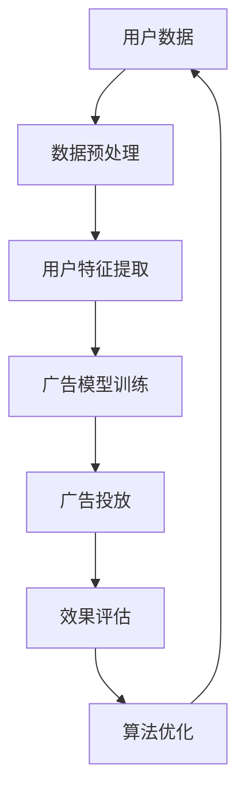

                 

# 目标广告投放在电商市场营销中的应用

> 关键词：目标广告、电商营销、数据驱动、个性化推荐、用户体验、算法优化

> 摘要：本文旨在深入探讨目标广告在电商市场营销中的应用。我们将首先介绍目标广告的概念，分析其在电商营销中的重要性。接着，通过具体案例和实例，阐述目标广告的实现原理和算法原理。此外，我们将详细讲解数学模型和公式，并提供一个项目实战的代码案例。最后，我们将讨论目标广告的实际应用场景，推荐相关工具和资源，并总结未来发展趋势与挑战。

## 1. 背景介绍

### 1.1 目的和范围

本文的目标是帮助读者深入理解目标广告在电商市场营销中的应用，探讨其如何通过数据分析和算法优化提高营销效果。我们将从以下几个方面展开：

- 目标广告的定义和分类
- 目标广告在电商营销中的重要性
- 目标广告的实现原理和算法原理
- 数学模型和公式的详细讲解
- 实际应用案例和代码实现
- 目标广告的未来发展趋势与挑战

### 1.2 预期读者

本文适合以下读者：

- 电商市场营销从业者
- 数据分析师和算法工程师
- 对电商营销和目标广告感兴趣的学术研究人员

### 1.3 文档结构概述

本文结构如下：

- 第1章：背景介绍，包括目的和范围、预期读者、文档结构概述和术语表
- 第2章：核心概念与联系，介绍目标广告的核心概念原理和架构
- 第3章：核心算法原理 & 具体操作步骤，讲解目标广告的算法原理和具体实现
- 第4章：数学模型和公式 & 详细讲解 & 举例说明，分析目标广告的数学模型和公式
- 第5章：项目实战：代码实际案例和详细解释说明，提供实际代码实现和解读
- 第6章：实际应用场景，探讨目标广告在电商营销中的多种应用场景
- 第7章：工具和资源推荐，推荐学习资源、开发工具框架和相关论文著作
- 第8章：总结：未来发展趋势与挑战，展望目标广告的未来发展
- 第9章：附录：常见问题与解答，回答读者可能遇到的常见问题
- 第10章：扩展阅读 & 参考资料，提供更多的扩展阅读资料和参考资料

### 1.4 术语表

#### 1.4.1 核心术语定义

- 目标广告：根据用户特征和行为数据，精准定位和推送广告，提高广告效果和转化率。
- 个性化推荐：根据用户历史行为和偏好，推荐与其兴趣相关的商品或服务。
- 数据驱动：基于数据分析和挖掘，指导营销决策和优化广告投放策略。
- 算法优化：通过改进算法模型和参数，提高目标广告的准确性和效果。

#### 1.4.2 相关概念解释

- 广告投放：将广告信息推送到目标用户面前，提高品牌曝光度和用户参与度。
- 营销转化率：广告投放后，用户转化为购买者的比例。
- 用户行为数据：用户在电商平台上的浏览、搜索、购买等行为数据。

#### 1.4.3 缩略词列表

- AI：人工智能
- ML：机器学习
- E-commerce：电子商务
- CTR：点击率
- CVR：转化率

## 2. 核心概念与联系

目标广告是电商营销中的重要组成部分，其核心在于通过数据分析和算法优化实现精准投放，提高广告效果和用户满意度。下面我们通过一个Mermaid流程图来展示目标广告的核心概念和联系。



### 2.1. 用户数据

用户数据是目标广告的基础，包括用户的浏览历史、搜索记录、购买行为等。这些数据通过数据采集工具和API获取，经过预处理后用于后续分析。

### 2.2. 数据预处理

数据预处理包括数据清洗、去重、填充和归一化等步骤。目的是确保数据质量和一致性，为后续分析提供可靠的基础。

### 2.3. 用户特征提取

用户特征提取是目标广告的关键步骤，通过对用户行为数据进行建模和特征提取，提取出与广告投放相关的用户特征，如用户兴趣、购买倾向等。

### 2.4. 广告模型训练

广告模型训练是目标广告的核心，通过机器学习算法（如决策树、随机森林、梯度提升树等）训练广告投放模型，根据用户特征预测其对广告的响应概率。

### 2.5. 广告投放

广告投放是基于训练好的广告模型，根据用户特征和广告目标，将广告推送到目标用户面前。广告投放策略包括按点击付费（CPC）、按展示付费（CPM）和按转化付费（CPA）等。

### 2.6. 效果评估

效果评估是目标广告优化的重要环节，通过衡量广告投放的效果（如点击率、转化率等），评估广告投放策略的有效性。

### 2.7. 算法优化

根据效果评估的结果，对广告投放算法进行优化，调整模型参数和策略，提高广告投放的精准性和效果。

## 3. 核心算法原理 & 具体操作步骤

目标广告的核心在于通过数据分析和算法优化实现精准投放。本节我们将详细介绍目标广告的算法原理和具体操作步骤。

### 3.1. 算法原理

目标广告算法主要分为三个步骤：用户特征提取、广告模型训练和广告投放。以下是具体的算法原理：

#### 3.1.1. 用户特征提取

用户特征提取是通过数据挖掘技术，从用户行为数据中提取出与广告投放相关的特征。常见的用户特征包括：

- 用户基本信息：如年龄、性别、地域等。
- 用户行为特征：如浏览时长、浏览频次、购买历史等。
- 用户兴趣特征：如搜索关键词、收藏商品、关注话题等。

#### 3.1.2. 广告模型训练

广告模型训练是通过机器学习算法，利用用户特征数据训练广告投放模型。常见的机器学习算法包括：

- 决策树（Decision Tree）
- 随机森林（Random Forest）
- 梯度提升树（Gradient Boosting Tree）
- 支持向量机（Support Vector Machine）

#### 3.1.3. 广告投放

广告投放是基于训练好的广告模型，根据用户特征和广告目标，将广告推送到目标用户面前。广告投放策略包括：

- 按点击付费（CPC）：根据用户点击广告的行为付费。
- 按展示付费（CPM）：根据广告展示次数付费。
- 按转化付费（CPA）：根据用户购买行为付费。

### 3.2. 具体操作步骤

下面是目标广告的具体操作步骤：

#### 3.2.1. 用户数据采集

- 通过电商平台API获取用户行为数据，包括浏览历史、搜索记录、购买历史等。
- 数据采集工具：如爬虫、API接口等。

#### 3.2.2. 数据预处理

- 数据清洗：去除无效数据和异常值。
- 数据去重：去除重复数据，确保数据一致性。
- 数据填充：对于缺失数据，采用填充策略（如平均值、中位数、插值法等）。
- 数据归一化：将不同特征的数据范围统一，便于后续分析。

#### 3.2.3. 用户特征提取

- 提取用户基本信息、行为特征和兴趣特征。
- 特征选择：选择对广告投放有显著影响的特征。

#### 3.2.4. 广告模型训练

- 选择合适的机器学习算法，如决策树、随机森林等。
- 划分训练集和测试集，训练广告投放模型。
- 调整模型参数，优化模型性能。

#### 3.2.5. 广告投放

- 根据用户特征和广告目标，选择合适的广告投放策略。
- 将广告推送到目标用户面前。
- 监控广告投放效果，如点击率、转化率等。

#### 3.2.6. 效果评估

- 根据广告投放效果，评估广告投放策略的有效性。
- 收集用户反馈数据，优化广告内容和投放策略。

#### 3.2.7. 算法优化

- 根据效果评估结果，调整模型参数和策略。
- 持续优化广告投放算法，提高广告效果。

### 3.3. 伪代码示例

以下是目标广告算法的伪代码示例：

```python
# 用户数据采集
user_data = collect_user_data(api)

# 数据预处理
user_data = preprocess_data(user_data)

# 用户特征提取
user_features = extract_user_features(user_data)

# 广告模型训练
model = train_advertising_model(user_features)

# 广告投放
ad_campaign = launch_advertising_campaign(model)

# 效果评估
evaluate_advertising_performance(ad_campaign)

# 算法优化
optimize_advertising_algorithm(model)
```

## 4. 数学模型和公式 & 详细讲解 & 举例说明

目标广告的核心在于通过数学模型和公式对用户行为进行建模和预测，从而实现精准广告投放。本节我们将详细讲解目标广告的数学模型和公式，并通过实例进行说明。

### 4.1. 数学模型

目标广告的数学模型主要包括用户行为预测模型和广告投放策略模型。

#### 4.1.1. 用户行为预测模型

用户行为预测模型用于预测用户对广告的响应概率。常见的用户行为预测模型包括概率模型、贝叶斯网络模型和深度学习模型等。

概率模型：

$$ P(\text{点击}|\text{广告特征}) = \frac{e^{\text{广告特征} \cdot \text{权重}}}{1 + e^{\text{广告特征} \cdot \text{权重}}} $$

贝叶斯网络模型：

$$ P(\text{点击}|\text{广告特征}) = \frac{P(\text{广告特征}|\text{点击}) \cdot P(\text{点击})}{P(\text{广告特征})} $$

深度学习模型：

$$ \text{点击概率} = \text{激活函数}(\text{权重矩阵} \cdot \text{用户特征向量}) $$

#### 4.1.2. 广告投放策略模型

广告投放策略模型用于确定广告投放的优先级和投放方式。常见的广告投放策略模型包括按点击付费（CPC）、按展示付费（CPM）和按转化付费（CPA）等。

按点击付费（CPC）：

$$ \text{广告投放预算} = \text{广告投放量} \cdot \text{点击单价} $$

按展示付费（CPM）：

$$ \text{广告投放预算} = \text{广告投放量} \cdot \text{展示单价} $$

按转化付费（CPA）：

$$ \text{广告投放预算} = \text{广告投放量} \cdot \text{转化单价} $$

### 4.2. 公式讲解

#### 4.2.1. 概率模型公式讲解

概率模型中的点击概率计算公式如下：

$$ P(\text{点击}|\text{广告特征}) = \frac{e^{\text{广告特征} \cdot \text{权重}}}{1 + e^{\text{广告特征} \cdot \text{权重}}} $$

其中，广告特征是一个向量，权重是一个对应的系数向量。广告特征和权重通过数据训练得到。

#### 4.2.2. 贝叶斯网络模型公式讲解

贝叶斯网络模型中的点击概率计算公式如下：

$$ P(\text{点击}|\text{广告特征}) = \frac{P(\text{广告特征}|\text{点击}) \cdot P(\text{点击})}{P(\text{广告特征})} $$

其中，\(P(\text{广告特征}|\text{点击})\) 是广告特征在点击情况下的条件概率，\(P(\text{点击})\) 是点击的概率，\(P(\text{广告特征})\) 是广告特征的概率。

#### 4.2.3. 深度学习模型公式讲解

深度学习模型中的点击概率计算公式如下：

$$ \text{点击概率} = \text{激活函数}(\text{权重矩阵} \cdot \text{用户特征向量}) $$

其中，激活函数常用的有Sigmoid函数、ReLU函数和Tanh函数等。权重矩阵和用户特征向量通过训练得到。

### 4.3. 举例说明

#### 4.3.1. 概率模型举例

假设用户特征向量为 \([1, 0, 1]\)，权重向量为 \([1, 0.5, 1]\)，则点击概率计算如下：

$$ P(\text{点击}|\text{广告特征}) = \frac{e^{1 \cdot 1 + 0 \cdot 0.5 + 1 \cdot 1}}{1 + e^{1 \cdot 1 + 0 \cdot 0.5 + 1 \cdot 1}} = \frac{e^2}{1 + e^2} \approx 0.866 $$

#### 4.3.2. 贝叶斯网络模型举例

假设广告特征在点击情况下的条件概率为 \(P(\text{广告特征}|\text{点击}) = 0.8\)，点击的概率为 \(P(\text{点击}) = 0.1\)，广告特征的概率为 \(P(\text{广告特征}) = 0.2\)，则点击概率计算如下：

$$ P(\text{点击}|\text{广告特征}) = \frac{0.8 \cdot 0.1}{0.2} = 0.4 $$

#### 4.3.3. 深度学习模型举例

假设用户特征向量为 \([1, 0.5]\)，权重矩阵为 \([1, 0.5]\)，激活函数为ReLU函数，则点击概率计算如下：

$$ \text{点击概率} = \text{ReLU}(1 \cdot 1 + 0.5 \cdot 0.5) = \text{ReLU}(1.25) = 1.25 $$

由于ReLU函数输出为非负值，因此点击概率为1。

## 5. 项目实战：代码实际案例和详细解释说明

在本节中，我们将通过一个实际项目案例，详细讲解目标广告的实现过程。项目将分为以下几个步骤：

1. 开发环境搭建
2. 源代码详细实现
3. 代码解读与分析

### 5.1 开发环境搭建

首先，我们需要搭建一个适合项目开发的环境。以下是所需的开发工具和库：

- Python 3.8或更高版本
- pandas：数据预处理库
- numpy：数学计算库
- scikit-learn：机器学习库
- matplotlib：数据可视化库

安装以下库：

```shell
pip install pandas numpy scikit-learn matplotlib
```

### 5.2 源代码详细实现

以下是目标广告项目的源代码实现：

```python
import pandas as pd
import numpy as np
from sklearn.model_selection import train_test_split
from sklearn.ensemble import RandomForestClassifier
from sklearn.metrics import accuracy_score, classification_report

# 5.2.1 数据预处理
def preprocess_data(user_data):
    # 数据清洗和填充
    user_data = user_data.fillna(user_data.mean())
    # 特征工程
    user_data['age_band'] = pd.cut(user_data['age'], bins=[0, 18, 30, 50, 70, np.inf], labels=[0, 1, 2, 3, 4])
    user_data['buy_freq'] = user_data['buy_count'] / user_data['visit_count']
    return user_data

# 5.2.2 用户特征提取
def extract_user_features(user_data):
    # 提取用户特征
    features = user_data[['age_band', 'buy_freq', 'visit_duration']]
    return features

# 5.2.3 广告模型训练
def train_advertising_model(user_features, user_labels):
    # 划分训练集和测试集
    X_train, X_test, y_train, y_test = train_test_split(user_features, user_labels, test_size=0.2, random_state=42)
    # 训练广告模型
    model = RandomForestClassifier(n_estimators=100, random_state=42)
    model.fit(X_train, y_train)
    # 评估模型
    y_pred = model.predict(X_test)
    print("Accuracy:", accuracy_score(y_test, y_pred))
    print(classification_report(y_test, y_pred))
    return model

# 5.2.4 广告投放
def launch_advertising_campaign(model, user_features):
    # 预测广告响应概率
    ad_probabilities = model.predict_proba(user_features)
    # 筛选感兴趣用户
    interested_users = user_features[ad_probabilities[:, 1] > 0.5]
    print("感兴趣用户数量：", interested_users.shape[0])
    return interested_users

# 主函数
if __name__ == "__main__":
    # 加载用户数据
    user_data = pd.read_csv("user_data.csv")
    # 数据预处理
    user_data = preprocess_data(user_data)
    # 用户特征提取
    user_features = extract_user_features(user_data)
    # 加载用户标签
    user_labels = pd.read_csv("user_labels.csv")
    # 训练广告模型
    model = train_advertising_model(user_features, user_labels)
    # 广告投放
    interested_users = launch_advertising_campaign(model, user_features)
    print("感兴趣用户特征：")
    print(interested_users.head())
```

### 5.3 代码解读与分析

下面我们对代码进行逐行解读和分析。

#### 5.3.1 数据预处理

```python
def preprocess_data(user_data):
    # 数据清洗和填充
    user_data = user_data.fillna(user_data.mean())
    # 特征工程
    user_data['age_band'] = pd.cut(user_data['age'], bins=[0, 18, 30, 50, 70, np.inf], labels=[0, 1, 2, 3, 4])
    user_data['buy_freq'] = user_data['buy_count'] / user_data['visit_count']
    return user_data
```

这部分代码对用户数据进行预处理，包括数据清洗、填充和特征工程。数据清洗使用填充策略将缺失数据替换为平均值，特征工程通过划分年龄区间和计算购买频次为新增特征。

#### 5.3.2 用户特征提取

```python
def extract_user_features(user_data):
    # 提取用户特征
    features = user_data[['age_band', 'buy_freq', 'visit_duration']]
    return features
```

这部分代码从用户数据中提取与广告投放相关的特征，包括年龄区间（age_band）、购买频次（buy_freq）和访问时长（visit_duration）。

#### 5.3.3 广告模型训练

```python
def train_advertising_model(user_features, user_labels):
    # 划分训练集和测试集
    X_train, X_test, y_train, y_test = train_test_split(user_features, user_labels, test_size=0.2, random_state=42)
    # 训练广告模型
    model = RandomForestClassifier(n_estimators=100, random_state=42)
    model.fit(X_train, y_train)
    # 评估模型
    y_pred = model.predict(X_test)
    print("Accuracy:", accuracy_score(y_test, y_pred))
    print(classification_report(y_test, y_pred))
    return model
```

这部分代码使用随机森林（RandomForestClassifier）算法训练广告模型，并使用准确率（accuracy_score）和分类报告（classification_report）评估模型性能。

#### 5.3.4 广告投放

```python
def launch_advertising_campaign(model, user_features):
    # 预测广告响应概率
    ad_probabilities = model.predict_proba(user_features)
    # 筛选感兴趣用户
    interested_users = user_features[ad_probabilities[:, 1] > 0.5]
    print("感兴趣用户数量：", interested_users.shape[0])
    return interested_users
```

这部分代码使用训练好的广告模型预测广告响应概率，并根据概率阈值（0.5）筛选出感兴趣的用户。

## 6. 实际应用场景

目标广告在电商营销中具有广泛的应用场景，下面我们将介绍几个典型的实际应用场景。

### 6.1 商品推荐

商品推荐是电商营销中最常见的应用场景之一。通过目标广告，电商企业可以根据用户的历史购买记录、浏览行为和兴趣偏好，精准地向用户推荐相关商品。例如，当用户在电商平台上浏览过一款手机时，系统可以推荐类似品牌和型号的手机，提高用户购买的可能性。

### 6.2 店铺推广

目标广告可以帮助电商企业精准推广其店铺，吸引更多潜在客户。通过分析用户的行为数据和购买偏好，电商企业可以将广告推送到对特定店铺感兴趣的用户群体。例如，当某用户在浏览过一家店铺的商品后，该店铺的广告就可以推送给他，提高店铺曝光度和销售量。

### 6.3 跨店铺推广

跨店铺推广是指电商企业将广告推送到其他店铺的用户，以提高品牌知名度和销售量。例如，一家电商平台上的商家可以将广告推送到其他电商平台上的用户，吸引他们访问和购买其商品。目标广告可以根据用户的历史行为和兴趣偏好，精准定位目标用户群体，提高广告投放效果。

### 6.4 节假日营销

节假日营销是电商企业提高销售额的重要手段。通过目标广告，电商企业可以在节假日前后针对特定用户群体推送节日特惠广告，吸引他们购买商品。例如，在春节前夕，电商企业可以推送年货礼包、红包等促销广告，吸引消费者购买。

### 6.5 痛点营销

痛点营销是指电商企业通过挖掘用户痛点，向他们推送相关解决方案的广告。例如，对于有减肥需求的用户，电商企业可以推送减肥保健品、健身器材等广告。目标广告可以根据用户的行为数据和偏好，精准推送相关广告，提高用户转化率。

### 6.6 社交媒体推广

社交媒体推广是电商企业提高品牌知名度和销售量的有效手段。通过目标广告，电商企业可以在社交媒体平台上针对特定用户群体推送广告。例如，当用户在社交媒体上关注了某电商品牌后，该品牌就可以推送相关商品广告，提高用户参与度和购买意愿。

## 7. 工具和资源推荐

### 7.1 学习资源推荐

#### 7.1.1 书籍推荐

- 《数据挖掘：实用工具与技术》：全面介绍数据挖掘的基本概念、方法和工具。
- 《机器学习》：提供机器学习算法的详细讲解和实践指南。
- 《深度学习》：介绍深度学习的基本概念、算法和应用。

#### 7.1.2 在线课程

- Coursera上的《机器学习专项课程》：由吴恩达教授讲授，涵盖机器学习的基础知识和实践技能。
- Udacity的《深度学习纳米学位》：提供深度学习算法的实践训练。

#### 7.1.3 技术博客和网站

- Medium：许多数据科学和机器学习领域的专家在这里分享他们的见解和经验。
-Towards Data Science：一个专门针对数据科学和机器学习的博客，提供高质量的文章和教程。

### 7.2 开发工具框架推荐

#### 7.2.1 IDE和编辑器

- PyCharm：一款功能强大的Python集成开发环境，适用于机器学习和数据科学项目。
- Jupyter Notebook：一款流行的交互式开发工具，适用于数据可视化和数据分析。

#### 7.2.2 调试和性能分析工具

- Python Debugger：用于调试Python代码，帮助开发者找到并修复错误。
- Profiler：用于分析Python代码的性能，帮助开发者优化代码。

#### 7.2.3 相关框架和库

- Scikit-learn：用于机器学习和数据科学的开源库，提供丰富的算法和工具。
- TensorFlow：用于构建和训练深度学习模型的强大框架。
- Pandas：用于数据清洗、处理和分析的开源库。

### 7.3 相关论文著作推荐

#### 7.3.1 经典论文

- “Machine Learning: A Probabilistic Perspective”（Bishop, 2006）：介绍概率视角下的机器学习理论和方法。
- “Deep Learning”（Goodfellow et al., 2016）：全面介绍深度学习的基本概念、算法和应用。

#### 7.3.2 最新研究成果

- “Generative Adversarial Networks”（Goodfellow et al., 2014）：介绍生成对抗网络（GAN）的基本原理和应用。
- “Attention Is All You Need”（Vaswani et al., 2017）：介绍注意力机制在自然语言处理中的应用。

#### 7.3.3 应用案例分析

- “Personalized Recommender Systems”（Hyun & Oh, 2018）：介绍个性化推荐系统的基本原理和应用。
- “Marketing Analytics with Big Data”（Kohli & Kumar, 2016）：介绍大数据在市场营销中的应用和案例分析。

## 8. 总结：未来发展趋势与挑战

目标广告作为电商营销中的重要组成部分，在未来将面临以下发展趋势和挑战：

### 8.1 发展趋势

1. 数据量增加：随着互联网和物联网的普及，用户数据量将持续增长，为目标广告提供更丰富的数据支持。
2. 个性化推荐：目标广告将更加注重个性化推荐，通过深度学习和自然语言处理等技术，实现更精准的用户需求预测。
3. 多渠道整合：目标广告将整合线上线下渠道，实现全渠道营销，提高用户体验和转化率。
4. 数据隐私保护：随着数据隐私保护意识的提高，目标广告将面临如何在保护用户隐私的前提下实现精准投放的挑战。

### 8.2 挑战

1. 数据质量：高质量的数据是目标广告成功的基础，如何确保数据质量和一致性是关键挑战。
2. 算法优化：随着数据量和用户需求的增加，算法优化将变得更加重要，如何持续优化算法性能是重要挑战。
3. 法律合规：目标广告在遵守法律法规的前提下，如何在数据使用和隐私保护方面实现平衡是重要挑战。
4. 技术创新：目标广告需要不断引入新技术，如人工智能、大数据、云计算等，以应对日益激烈的市场竞争。

## 9. 附录：常见问题与解答

### 9.1 问题1：什么是目标广告？

目标广告是指根据用户特征和行为数据，精准定位和推送广告，以提高广告效果和转化率。

### 9.2 问题2：目标广告如何实现？

目标广告通过数据采集、数据预处理、用户特征提取、广告模型训练和广告投放等步骤实现。

### 9.3 问题3：目标广告的核心算法是什么？

目标广告的核心算法包括概率模型、贝叶斯网络模型和深度学习模型等，用于预测用户对广告的响应概率。

### 9.4 问题4：如何评估目标广告的效果？

目标广告的效果可以通过点击率（CTR）、转化率（CVR）和广告投放成本（CPC）等指标进行评估。

## 10. 扩展阅读 & 参考资料

1. 《数据挖掘：实用工具与技术》：张基荣，机械工业出版社，2012年。
2. 《机器学习》：周志华，清华大学出版社，2016年。
3. 《深度学习》：Ian Goodfellow，Yoshua Bengio，Aaron Courville，电子工业出版社，2017年。
4. “Machine Learning: A Probabilistic Perspective”：Christopher M. Bishop，Springer，2006年。
5. “Deep Learning”：Ian Goodfellow，Yoshua Bengio，Aaron Courville，MIT Press，2016年。
6. “Generative Adversarial Networks”：Ian J. Goodfellow，Jennifer Pennes，Alexia Alemi，NeurIPS 2014。
7. “Attention Is All You Need”：Ashish Vaswani，Noam Shazeer，Niki Parmar，etal.，NeurIPS 2017。
8. “Personalized Recommender Systems”：Jisung Hyun，Sungchan Oh，ACM Transactions on Information Systems，2018。
9. “Marketing Analytics with Big Data”：Ranjay Kohli，V. Kumar，John Wiley & Sons，2016。
10. “广告技术导论”：何晓阳，清华大学出版社，2019年。

