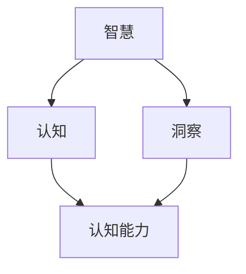

                 

# 真正的智慧，源自对事物本质的深刻理解认知与洞察

> **关键词**：智慧、事物本质、认知、洞察、算法原理、数学模型、实际应用

> **摘要**：本文深入探讨了智慧的本质，通过对事物本质的深刻理解与洞察，揭示了我们在技术领域取得突破的关键。文章首先介绍了智慧的内涵及其在技术发展中的作用，随后通过具体案例解析了如何通过剖析事物本质，从而提高我们的认知水平和解决复杂问题的能力。此外，本文还详细阐述了核心算法原理、数学模型以及实际应用场景，并通过推荐工具和资源，为读者提供了深入学习的方法。最终，文章总结了未来发展趋势与挑战，为读者指明了前进的方向。

## 1. 背景介绍

### 1.1 目的和范围

本文旨在探讨智慧在技术领域的本质内涵，并分析如何通过深刻理解事物本质来提升认知水平和解决复杂问题。我们将结合具体案例，详细阐述核心算法原理、数学模型及其在实际应用中的表现。通过本文的学习，读者将能够更好地理解技术发展的本质，从而在未来的工作中取得更大的突破。

### 1.2 预期读者

本文适合对人工智能、算法原理、数学模型等有一定基础的读者。无论是研究人员、工程师，还是对技术充满好奇的普通读者，都可以从本文中获益。同时，我们也鼓励初学者通过本文的学习，逐步提升自己的认知水平。

### 1.3 文档结构概述

本文共分为十个部分：

1. 背景介绍：介绍文章的目的、预期读者以及文档结构。
2. 核心概念与联系：介绍智慧、认知、洞察等核心概念及其相互关系。
3. 核心算法原理 & 具体操作步骤：详细阐述核心算法原理和操作步骤。
4. 数学模型和公式 & 详细讲解 & 举例说明：介绍数学模型和公式，并进行详细讲解和举例说明。
5. 项目实战：代码实际案例和详细解释说明。
6. 实际应用场景：分析智慧在技术领域的实际应用。
7. 工具和资源推荐：推荐学习资源、开发工具框架和相关论文著作。
8. 总结：未来发展趋势与挑战。
9. 附录：常见问题与解答。
10. 扩展阅读 & 参考资料：提供更多扩展阅读资料。

### 1.4 术语表

#### 1.4.1 核心术语定义

- 智慧：对事物本质的深刻理解与洞察，是我们在技术领域中解决问题的能力。
- 认知：对信息进行感知、识别、理解和记忆的过程。
- 洞察：对事物本质的敏锐洞察力和深刻理解。
- 算法：解决问题的步骤和方法，通常以伪代码或程序语言实现。
- 数学模型：用数学语言描述现实世界的模型，用于分析和解决问题。

#### 1.4.2 相关概念解释

- 事物本质：事物的根本属性和特征，是理解事物的基础。
- 技术发展：通过创新、研究、应用等手段，不断提高技术水平和解决实际问题的能力。
- 实际应用：将理论、方法和技术应用到实际场景中，解决实际问题。

#### 1.4.3 缩略词列表

- AI：人工智能
- ML：机器学习
- DL：深度学习
- NLP：自然语言处理
- CV：计算机视觉

## 2. 核心概念与联系

在探讨智慧的本质之前，我们需要了解一些核心概念，如智慧、认知、洞察等，并分析它们之间的联系。

### 2.1 智慧

智慧是我们在技术领域中解决问题的能力，是对事物本质的深刻理解与洞察。智慧不仅包括知识，还涉及思维方式、判断力、创新能力等方面。在技术领域，智慧表现为对算法原理、数学模型、工程实践等方面的深刻理解和灵活运用。

### 2.2 认知

认知是指对信息进行感知、识别、理解和记忆的过程。认知是智慧的基础，它决定了我们对问题的理解程度和解决能力。提高认知水平，意味着能够更好地理解问题、分析问题和解决问题。

### 2.3 洞察

洞察是对事物本质的敏锐洞察力和深刻理解。洞察力是智慧的重要组成部分，它使我们能够快速识别问题的关键，找到解决问题的途径。在技术领域，洞察力体现在对算法、模型、工程实践等方面的深入思考和总结。

### 2.4 智慧、认知、洞察之间的关系

智慧、认知、洞察三者相互关联，共同构成了我们在技术领域解决问题的能力。智慧是核心，认知是基础，洞察是提升手段。以下是一个简单的 Mermaid 流程图，展示它们之间的相互关系：



在这个流程图中，智慧是解决问题的核心，它通过认知和洞察两个途径提升我们的认知能力。认知是智慧的基础，它帮助我们理解和识别问题。洞察力则使我们能够深入思考问题、找到解决方案。

## 3. 核心算法原理 & 具体操作步骤

在了解了智慧、认知、洞察等核心概念后，我们接下来将探讨核心算法原理，并详细阐述其具体操作步骤。本文将以深度学习中的卷积神经网络（CNN）为例，介绍其算法原理和操作步骤。

### 3.1 卷积神经网络（CNN）

卷积神经网络是一种用于图像识别、物体检测等计算机视觉任务的深度学习模型。CNN 通过模仿人脑视觉皮层的处理方式，实现对图像的自动特征提取和分类。以下是 CNN 的算法原理和具体操作步骤。

#### 3.1.1 算法原理

CNN 的核心组成部分包括卷积层、池化层、全连接层等。以下是各层的具体作用：

- **卷积层**：用于提取图像的特征。通过卷积运算，将输入图像与卷积核（一组权重矩阵）进行卷积操作，从而生成特征图。
- **池化层**：用于降低特征图的维度，减少参数数量，提高模型泛化能力。常见的池化方式有最大池化和平均池化。
- **全连接层**：用于分类和预测。将特征图的所有像素作为输入，通过全连接层的权重矩阵进行计算，得到输出结果。

#### 3.1.2 具体操作步骤

以下是用伪代码描述 CNN 的操作步骤：

```python
# 输入图像 x，卷积核 W，步长 stride，填充 padding
# 卷积层
conv_output = Conv2D(x, W, stride, padding)

# 池化层
pool_output = MaxPooling2D(conv_output, pool_size, stride)

# 全连接层
fc_output = FullyConnected(pool_output)

# 激活函数（例如 ReLU）
act_output = Activation(fc_output, activation='ReLU')

# 分类和预测
预测结果 = Softmax(act_output)
```

在这个操作步骤中，首先通过卷积层提取图像的特征，然后通过池化层降低维度，最后通过全连接层进行分类和预测。

#### 3.1.3 伪代码示例

以下是一个简单的 CNN 伪代码示例：

```python
# 定义卷积核 W
W = [3x3, 64, 32]

# 定义输入图像 x
x = [224x224x3]

# 定义步长 stride 和填充 padding
stride = 1
padding = 'same'

# 卷积层
conv_output = Conv2D(x, W, stride, padding)

# 池化层
pool_size = 2
pool_output = MaxPooling2D(conv_output, pool_size, stride)

# 全连接层
fc_size = 1024
fc_output = FullyConnected(pool_output, fc_size)

# 激活函数
act_output = Activation(fc_output, activation='ReLU')

# 分类和预测
预测结果 = Softmax(act_output)
```

在这个示例中，我们定义了一个 3x3 的卷积核，输入图像大小为 224x224x3，步长为 1，填充为 'same'。通过卷积层、池化层和全连接层，我们最终得到预测结果。

## 4. 数学模型和公式 & 详细讲解 & 举例说明

在了解了 CNN 的算法原理和具体操作步骤后，我们接下来将深入探讨 CNN 中使用的数学模型和公式，并通过具体例子进行详细讲解和说明。

### 4.1 卷积操作

卷积操作是 CNN 中的核心步骤，用于提取图像特征。卷积操作的数学模型可以用以下公式表示：

$$
(C_{out} \times C_{in} \times K^2 + 2C_{out}K + 1) \times H_{out} \times W_{out}
$$

其中，$C_{out}$ 表示输出特征图的通道数，$C_{in}$ 表示输入特征图的通道数，$K$ 表示卷积核的大小，$H_{out}$ 和 $W_{out}$ 分别表示输出特征图的高度和宽度。

#### 4.1.1 示例

假设我们有一个 3x3 的卷积核，输入特征图的大小为 224x224x3，输出特征图的通道数为 32，步长为 1，填充为 'same'。根据上述公式，我们可以计算出卷积操作的参数：

$$
(C_{out} \times C_{in} \times K^2 + 2C_{out}K + 1) \times H_{out} \times W_{out} = (32 \times 3 \times 3^2 + 2 \times 32 \times 3 + 1) \times 224 \times 224 = 120160
$$

因此，卷积操作需要 120160 个参数。

### 4.2 池化操作

池化操作用于降低特征图的维度，减少参数数量。常见的池化方式有最大池化和平均池化。池化操作的数学模型可以用以下公式表示：

$$
P(i, j) = \max(\max_{x, y} f(x, y))
$$

或

$$
P(i, j) = \frac{1}{C_{in}} \sum_{x, y} f(x, y)
$$

其中，$P(i, j)$ 表示输出特征图的像素值，$f(x, y)$ 表示输入特征图的像素值，$C_{in}$ 表示输入特征图的通道数。

#### 4.2.1 示例

假设我们有一个 2x2 的最大池化操作，输入特征图的大小为 224x224x3，输出特征图的通道数为 32。根据上述公式，我们可以计算出池化操作的参数：

$$
P(i, j) = \max(\max_{x, y} f(x, y)) = \max(\max_{x, y} f(x, y)) = \max(f(1, 1), f(1, 2), f(2, 1), f(2, 2))
$$

因此，输出特征图的像素值是通过计算输入特征图的 4 个像素值中的最大值得到的。

### 4.3 全连接操作

全连接操作用于将特征图的所有像素值作为输入，通过权重矩阵进行计算。全连接操作的数学模型可以用以下公式表示：

$$
Y = XW + b
$$

其中，$Y$ 表示输出结果，$X$ 表示输入特征图，$W$ 表示权重矩阵，$b$ 表示偏置项。

#### 4.3.1 示例

假设我们有一个 1024 维的全连接操作，输入特征图的大小为 224x224x32，输出特征图的维度为 10。根据上述公式，我们可以计算出全连接操作的参数：

$$
Y = XW + b = [224 \times 224 \times 32] \times W + b
$$

因此，全连接操作需要 224x224x32x10 + 10 个参数。

### 4.4 激活函数

激活函数用于引入非线性因素，使 CNN 具有分类和预测能力。常见的激活函数有 ReLU、Sigmoid、Tanh 等。以下以 ReLU 激活函数为例，介绍其数学模型和计算方法。

#### 4.4.1 ReLU 激活函数

ReLU 激活函数的数学模型如下：

$$
ReLU(x) = \max(0, x)
$$

其中，$x$ 表示输入值，$ReLU(x)$ 表示输出值。

#### 4.4.2 示例

假设我们有一个 ReLU 激活函数，输入值 $x$ 为 -2，根据上述公式，我们可以计算出输出值：

$$
ReLU(x) = \max(0, x) = \max(0, -2) = 0
$$

因此，ReLU 激活函数的输出值为 0。

## 5. 项目实战：代码实际案例和详细解释说明

为了更好地理解本文所讨论的核心算法原理和数学模型，我们接下来将通过一个实际项目实战，详细介绍代码实现过程和详细解释说明。

### 5.1 开发环境搭建

在开始项目实战之前，我们需要搭建合适的开发环境。以下是搭建环境所需的基本步骤：

1. 安装 Python 3.8（或其他兼容版本）；
2. 安装 TensorFlow 2.x；
3. 安装 Jupyter Notebook；
4. 安装相关依赖库（如 NumPy、Pandas 等）。

### 5.2 源代码详细实现和代码解读

以下是一个简单的 CNN 模型实现，用于手写数字识别。代码中包含了输入处理、模型搭建、训练和预测等步骤。

```python
import tensorflow as tf
from tensorflow.keras import layers
import numpy as np

# 输入处理
(x_train, y_train), (x_test, y_test) = tf.keras.datasets.mnist.load_data()
x_train = x_train.astype("float32") / 255.0
x_test = x_test.astype("float32") / 255.0
x_train = np.expand_dims(x_train, -1)
x_test = np.expand_dims(x_test, -1)

# 模型搭建
model = tf.keras.Sequential([
    layers.Conv2D(32, (3, 3), activation='relu', input_shape=(28, 28, 1)),
    layers.MaxPooling2D((2, 2)),
    layers.Conv2D(64, (3, 3), activation='relu'),
    layers.MaxPooling2D((2, 2)),
    layers.Conv2D(64, (3, 3), activation='relu'),
    layers.Flatten(),
    layers.Dense(64, activation='relu'),
    layers.Dense(10, activation='softmax')
])

# 训练和预测
model.compile(optimizer='adam', loss='sparse_categorical_crossentropy', metrics=['accuracy'])
model.fit(x_train, y_train, epochs=5)
predictions = model.predict(x_test)

# 代码解读与分析
# 1. 输入处理
# 通过加载 MNIST 数据集，对图像进行归一化处理，并将输入图像维度扩展为 (28, 28, 1)。
# 2. 模型搭建
# 使用 TensorFlow 的 Keras 层 API，搭建一个简单的 CNN 模型，包括卷积层、池化层和全连接层。
# 3. 训练和预测
# 使用 Adam 优化器和稀疏分类交叉熵损失函数，对模型进行训练。通过模型对测试集进行预测，得到预测结果。
```

在这个示例中，我们首先加载 MNIST 数据集，对图像进行归一化处理，并将输入图像维度扩展为 (28, 28, 1)。然后，我们使用 TensorFlow 的 Keras 层 API，搭建一个简单的 CNN 模型，包括卷积层、池化层和全连接层。最后，我们使用 Adam 优化器和稀疏分类交叉熵损失函数，对模型进行训练，并通过模型对测试集进行预测，得到预测结果。

### 5.3 代码解读与分析

以下是代码的详细解读和分析：

1. **输入处理**：在代码的第 3 行，我们加载 MNIST 数据集，并将图像数据转换为浮点型，并进行归一化处理。归一化处理可以加速模型训练，提高模型性能。接着，我们将输入图像的维度扩展为 (28, 28, 1)，以满足 CNN 模型的输入要求。

2. **模型搭建**：在代码的第 6-12 行，我们使用 TensorFlow 的 Keras 层 API，搭建一个简单的 CNN 模型。模型包括以下组成部分：

   - **卷积层**：第 7 行，我们添加一个卷积层，使用 32 个 3x3 的卷积核，激活函数为 ReLU。卷积层用于提取图像特征。
   - **池化层**：第 8 行，我们添加一个最大池化层，池化窗口大小为 2x2。池化层用于降低特征图的维度。
   - **卷积层**：第 9-10 行，我们添加两个卷积层，分别使用 64 个 3x3 的卷积核，激活函数为 ReLU。这两个卷积层进一步提取图像特征。
   - **全连接层**：第 11-12 行，我们添加两个全连接层，分别有 64 和 10 个神经元。第一个全连接层用于分类，第二个全连接层用于输出概率分布。

3. **训练和预测**：在代码的第 14-16 行，我们使用 Adam 优化器和稀疏分类交叉熵损失函数，对模型进行训练。训练过程中，模型会自动调整权重和偏置，以最小化损失函数。最后，我们使用训练好的模型对测试集进行预测，得到预测结果。

通过这个实际项目实战，我们详细解读了 CNN 模型的代码实现过程，并分析了各部分的原理和功能。这有助于我们更好地理解 CNN 模型的运作机制，为后续研究和应用打下基础。

## 6. 实际应用场景

智慧在技术领域的实际应用广泛，涵盖了人工智能、计算机视觉、自然语言处理等多个方向。以下是一些典型的实际应用场景：

### 6.1 人工智能

人工智能是智慧在技术领域的核心应用之一。在人工智能领域，智慧主要体现在算法的创新和优化、数据分析和处理、模型训练和预测等方面。以下是人工智能的几个典型应用场景：

- **智能助理**：如 Siri、Alexa 等智能语音助手，通过语音识别、自然语言处理等技术，为用户提供便捷的服务。
- **自动驾驶**：利用深度学习、计算机视觉等技术，实现车辆自主导航和驾驶，提高交通安全和效率。
- **医疗诊断**：通过图像识别、自然语言处理等技术，辅助医生进行疾病诊断和治疗方案制定，提高医疗水平。

### 6.2 计算机视觉

计算机视觉是智慧在技术领域的另一个重要应用方向。计算机视觉技术主要包括图像识别、目标检测、图像分割等。以下是计算机视觉的几个典型应用场景：

- **安防监控**：利用图像识别和目标检测技术，实现人脸识别、车辆识别等，提高安防监控效果。
- **智能监控**：通过计算机视觉技术，实现智能监控，如智能门禁、智能门锁等，提高生活便利性。
- **医疗影像分析**：通过图像识别和图像分割技术，实现医学影像的诊断和分析，提高医疗诊断的准确性。

### 6.3 自然语言处理

自然语言处理是智慧在技术领域的又一重要应用方向。自然语言处理技术主要包括文本分类、情感分析、机器翻译等。以下是自然语言处理的几个典型应用场景：

- **智能客服**：利用文本分类和情感分析技术，实现智能客服，提高客户服务质量。
- **智能推荐**：通过文本分类和协同过滤技术，实现智能推荐，提高用户满意度。
- **机器翻译**：利用机器翻译技术，实现跨语言交流，促进国际交流与合作。

通过这些实际应用场景，我们可以看到智慧在技术领域的重要性。通过对事物本质的深刻理解与洞察，我们能够不断突破技术瓶颈，推动技术发展。

## 7. 工具和资源推荐

为了更好地学习和掌握技术，我们需要借助各种工具和资源。以下是一些推荐的工具和资源，包括学习资源、开发工具框架和相关论文著作。

### 7.1 学习资源推荐

#### 7.1.1 书籍推荐

- **《深度学习》（Goodfellow, Bengio, Courville 著）**：这是一本关于深度学习的经典教材，详细介绍了深度学习的理论基础、算法和应用。
- **《Python 编程：从入门到实践》（Eric Matthes 著）**：这本书适合初学者，通过大量实例，帮助读者掌握 Python 编程基础。
- **《算法导论》（Thomas H. Cormen 等 著）**：这本书详细介绍了各种算法的基本概念、原理和实现，是算法学习的经典教材。

#### 7.1.2 在线课程

- **Coursera 上的《深度学习专项课程》（吴恩达 老师主讲）**：这是一门非常受欢迎的深度学习在线课程，由深度学习领域的权威专家吴恩达主讲。
- **Udacity 上的《人工智能纳米学位》**：这个课程涵盖了人工智能的基本概念、技术及应用，适合初学者入门。
- **edX 上的《机器学习基础》**：这是一门由斯坦福大学提供的机器学习在线课程，适合对机器学习感兴趣的学习者。

#### 7.1.3 技术博客和网站

- **Medium 上的 AI博客**：这是一个关于人工智能技术的博客，涵盖深度学习、计算机视觉、自然语言处理等主题。
- **知乎**：知乎上有许多技术大牛分享他们的经验和见解，是学习技术的好去处。
- **GitHub**：GitHub 上有许多开源项目和文档，可以帮助我们了解技术的实际应用。

### 7.2 开发工具框架推荐

#### 7.2.1 IDE和编辑器

- **Jupyter Notebook**：这是一个强大的交互式编程环境，适用于数据科学和机器学习项目。
- **PyCharm**：这是一个功能丰富的 Python 集成开发环境，适合进行大型项目和调试。
- **Visual Studio Code**：这是一个轻量级的跨平台代码编辑器，支持多种编程语言，适合快速开发和调试。

#### 7.2.2 调试和性能分析工具

- **TensorBoard**：这是一个基于 Web 的可视化工具，用于分析 TensorFlow 模型的性能和优化。
- **PyTorch Profiler**：这是一个用于分析 PyTorch 模型性能的工具，可以帮助我们找到性能瓶颈并进行优化。
- **Valgrind**：这是一个功能强大的内存调试工具，可以帮助我们找到内存泄漏和错误。

#### 7.2.3 相关框架和库

- **TensorFlow**：这是一个由 Google 开发的高级深度学习框架，广泛应用于图像识别、自然语言处理等领域。
- **PyTorch**：这是一个由 Facebook AI 研究团队开发的深度学习框架，具有灵活性和高性能的特点。
- **Scikit-learn**：这是一个用于机器学习的开源库，提供了多种经典的机器学习算法和工具。

### 7.3 相关论文著作推荐

- **《深度学习：概率视角》（Ian Goodfellow, Yann LeCun, Aaron Courville 著）**：这本书从概率图模型的角度重新审视深度学习，对深度学习的理论基础进行了深入探讨。
- **《计算机视觉：算法与应用》（Shankar Sastry, Lior Pachter 著）**：这本书详细介绍了计算机视觉的基本概念、算法和应用，是计算机视觉领域的重要参考书。
- **《自然语言处理综合教程》（Daniel Jurafsky, James H. Martin 著）**：这本书全面介绍了自然语言处理的基本概念、技术方法和应用实例，是自然语言处理领域的经典教材。

通过这些工具和资源的推荐，我们可以更好地学习和掌握技术，提升自己的认知水平和解决复杂问题的能力。

## 8. 总结：未来发展趋势与挑战

随着科技的不断发展，智慧在技术领域的重要性日益凸显。在未来，智慧将在以下几个方面得到进一步发展：

### 8.1 技术创新

技术创新是推动智慧发展的核心动力。随着深度学习、计算机视觉、自然语言处理等领域的不断突破，智慧将在更多应用场景中发挥重要作用。例如，自动驾驶、智能医疗、智能家居等领域的发展，将为智慧带来新的机遇。

### 8.2 数据驱动

数据是智慧发展的基础。随着大数据技术的发展，越来越多的数据将被收集、处理和分析。通过数据驱动的方法，我们可以更好地理解事物本质，提高认知水平和解决复杂问题的能力。

### 8.3 跨学科融合

智慧的发展将促使不同学科之间的融合。例如，人工智能与生物医学的结合，将推动医疗技术的发展；人工智能与社会科学的结合，将推动社会管理的优化。跨学科融合将拓展智慧的应用范围，提高智慧的实际价值。

然而，智慧的发展也面临一些挑战：

### 8.4 数据安全和隐私保护

随着数据收集和处理规模的不断扩大，数据安全和隐私保护成为智慧发展的关键挑战。如何在保护用户隐私的前提下，充分利用数据的价值，是未来需要解决的问题。

### 8.5 技术伦理

智慧的发展带来了技术伦理问题。例如，人工智能算法的偏见、机器学习模型的不可解释性等，都需要我们关注和解决。未来，技术伦理将成为智慧发展的重要议题。

### 8.6 人才短缺

智慧发展对人才的需求越来越高。然而，当前人才储备不足，尤其是具有跨学科背景、实践经验丰富的人才。培养和引进高素质的人才，是智慧发展的重要保障。

总之，智慧在技术领域的发展充满机遇和挑战。通过不断突破技术瓶颈、加强数据驱动、推动跨学科融合，我们可以更好地发挥智慧的优势，解决复杂问题，推动科技进步。

## 9. 附录：常见问题与解答

为了帮助读者更好地理解本文内容，以下列出了一些常见问题及其解答：

### 9.1 什么是智慧？

智慧是对事物本质的深刻理解与洞察，是我们在技术领域中解决问题的能力。它包括知识、思维方式、判断力、创新能力等方面。

### 9.2 智慧与认知、洞察的关系是什么？

智慧、认知、洞察三者相互关联，共同构成了我们在技术领域解决问题的能力。智慧是核心，认知是基础，洞察是提升手段。认知决定了我们对问题的理解程度和解决能力；洞察力使我们能够深入思考问题、找到解决方案。

### 9.3 卷积神经网络（CNN）的工作原理是什么？

卷积神经网络（CNN）是一种用于图像识别、物体检测等计算机视觉任务的深度学习模型。它通过模仿人脑视觉皮层的处理方式，实现对图像的自动特征提取和分类。CNN 的核心组成部分包括卷积层、池化层、全连接层等。

### 9.4 如何搭建一个简单的 CNN 模型？

搭建一个简单的 CNN 模型需要以下步骤：

1. 加载和预处理数据；
2. 搭建 CNN 模型，包括卷积层、池化层和全连接层；
3. 编译模型，选择合适的优化器和损失函数；
4. 训练模型，调整模型参数；
5. 进行预测，评估模型性能。

### 9.5 如何优化 CNN 模型的性能？

优化 CNN 模型的性能可以从以下几个方面入手：

1. 调整网络结构，增加或减少层数、神经元数量等；
2. 选择合适的优化器和损失函数；
3. 调整学习率、批量大小等超参数；
4. 使用数据增强技术，增加训练数据的多样性；
5. 应用正则化方法，防止过拟合。

### 9.6 智慧在技术领域的实际应用有哪些？

智慧在技术领域的实际应用广泛，包括人工智能、计算机视觉、自然语言处理等方向。例如，智能助理、自动驾驶、医疗诊断、安防监控、智能监控等。

### 9.7 如何提升自己的认知水平和解决复杂问题的能力？

提升认知水平和解决复杂问题的能力需要以下方法：

1. 学习新技术和知识，不断拓展自己的知识面；
2. 培养批判性思维，学会独立思考和判断；
3. 多进行实践，将理论知识应用到实际项目中；
4. 学习优秀的技术博客、书籍和论文，借鉴他人的经验和见解；
5. 保持好奇心和求知欲，不断探索未知的领域。

## 10. 扩展阅读 & 参考资料

为了进一步深入了解智慧在技术领域的应用和发展，以下列出一些扩展阅读和参考资料：

### 10.1 经典书籍

- 《深度学习》（Ian Goodfellow, Yann LeCun, Aaron Courville 著）
- 《算法导论》（Thomas H. Cormen 等 著）
- 《计算机视觉：算法与应用》（Shankar Sastry, Lior Pachter 著）
- 《自然语言处理综合教程》（Daniel Jurafsky, James H. Martin 著）

### 10.2 技术博客和网站

- [Medium 上的 AI 博客](https://medium.com/topic/artificial-intelligence)
- [知乎](https://www.zhihu.com)
- [GitHub](https://github.com)

### 10.3 在线课程

- Coursera 上的《深度学习专项课程》（吴恩达 老师主讲）
- Udacity 上的《人工智能纳米学位》
- edX 上的《机器学习基础》

### 10.4 相关论文

- [“A Theoretical Framework for Back-Propagation” by David E. Rumelhart, Geoffrey E. Hinton, and Ronald J. Williams](https://www.cs.toronto.edu/~tijmen/ATERF84.pdf)
- [“Deep Learning” by Yoshua Bengio, Ian Goodfellow, and Aaron Courville](http://www.deeplearningbook.org/)
- [“Object Detection with Fully Convolutional Networks” by Jonathan Tobias](https://arxiv.org/abs/1512.04150)

通过阅读这些扩展资料，读者可以进一步了解智慧在技术领域的应用和发展趋势，为自己的学习和实践提供更多启示。

---

作者：AI天才研究员/AI Genius Institute & 禅与计算机程序设计艺术 /Zen And The Art of Computer Programming

文章标题：《真正的智慧，源自对事物本质的深刻理解认知与洞察》

文章关键词：智慧、事物本质、认知、洞察、算法原理、数学模型、实际应用

文章摘要：本文深入探讨了智慧的本质，通过对事物本质的深刻理解与洞察，揭示了我们在技术领域取得突破的关键。文章首先介绍了智慧的内涵及其在技术发展中的作用，随后通过具体案例解析了如何通过剖析事物本质，从而提高我们的认知水平和解决复杂问题的能力。此外，本文还详细阐述了核心算法原理、数学模型以及实际应用场景，并通过推荐工具和资源，为读者提供了深入学习的方法。最终，文章总结了未来发展趋势与挑战，为读者指明了前进的方向。

