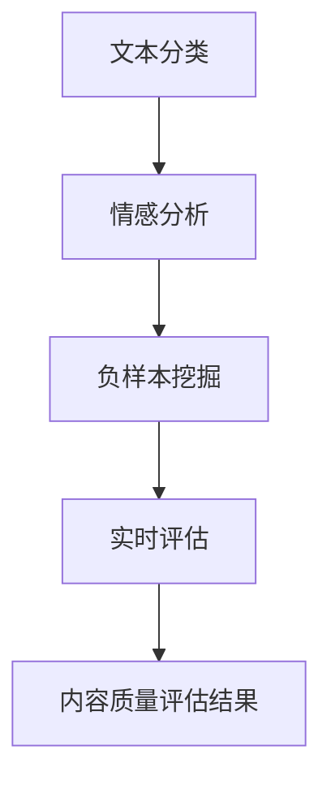

                 

# 知乎2024内容质量评估模型校招面试重点

> **关键词：** 内容质量评估、机器学习、自然语言处理、NLP、深度学习、特征工程、校招面试、面试重点

> **摘要：** 本文将深入探讨知乎2024年内容质量评估模型的校招面试重点，包括背景介绍、核心概念、算法原理、数学模型、项目实战、实际应用场景、工具和资源推荐等内容。旨在帮助读者全面了解内容质量评估领域，并为即将参加校招面试的同学们提供宝贵的指导。

## 1. 背景介绍

### 1.1 目的和范围

本文旨在为知乎2024年内容质量评估模型校招面试提供全面的备考指南。我们将详细分析面试中可能涉及的核心概念、算法原理、数学模型、项目实战和实际应用场景等内容，帮助读者更好地应对面试挑战。

### 1.2 预期读者

本文适合以下读者：

1. 计算机科学与技术专业本科生和研究生。
2. 有志于从事内容质量评估领域工作的在校生和职场人士。
3. 对自然语言处理、机器学习等领域有浓厚兴趣的爱好者。

### 1.3 文档结构概述

本文结构如下：

1. 背景介绍：介绍本文的目的、范围、预期读者和文档结构。
2. 核心概念与联系：介绍内容质量评估相关的核心概念和联系。
3. 核心算法原理 & 具体操作步骤：详细讲解内容质量评估的核心算法原理和操作步骤。
4. 数学模型和公式 & 详细讲解 & 举例说明：介绍内容质量评估的数学模型和公式，并进行举例说明。
5. 项目实战：展示内容质量评估的实际项目案例，并进行详细解释。
6. 实际应用场景：探讨内容质量评估在不同领域的实际应用场景。
7. 工具和资源推荐：推荐相关学习资源、开发工具和框架。
8. 总结：总结内容质量评估领域的未来发展趋势与挑战。
9. 附录：提供常见问题与解答。
10. 扩展阅读 & 参考资料：推荐相关文献和资料。

### 1.4 术语表

#### 1.4.1 核心术语定义

- 内容质量评估：对文本、图像、音频等多媒体内容的质量进行评估的过程。
- 机器学习：一种通过数据学习规律并自动进行决策的计算机技术。
- 自然语言处理（NLP）：研究计算机如何理解、生成和模拟人类语言的技术。
- 深度学习：一种基于多层神经网络进行特征学习和模式识别的机器学习技术。
- 特征工程：从原始数据中提取有助于模型训练的特征的过程。

#### 1.4.2 相关概念解释

- 文本分类：将文本分为不同的类别，如新闻分类、情感分析等。
- 情感分析：通过分析文本情感倾向，判断文本情感极性，如正面、负面、中性等。
- 负样本挖掘：从大量数据中筛选出具有代表性的负样本，以帮助模型更好地识别负面内容。
- 实时评估：对实时产生的文本内容进行质量评估，以监控和过滤不良内容。

#### 1.4.3 缩略词列表

- NLP：自然语言处理
- ML：机器学习
- DL：深度学习
- CV：计算机视觉
- NER：命名实体识别
- SVM：支持向量机

## 2. 核心概念与联系

内容质量评估是人工智能和自然语言处理领域的一个重要研究方向。在知乎等社交平台，内容质量评估有助于维护良好的社区氛围，提高用户体验。为了更好地理解内容质量评估，我们需要了解以下几个核心概念：

### 2.1 文本分类

文本分类是内容质量评估的基础。它将文本分为不同的类别，如新闻、博客、评论等。在知乎，文本分类有助于识别优质内容和不良内容。

### 2.2 情感分析

情感分析是对文本情感倾向进行分析，以判断文本的情感极性。在知乎，情感分析有助于识别用户情感，从而改善内容推荐和社区管理。

### 2.3 负样本挖掘

负样本挖掘是从大量数据中筛选出具有代表性的负面内容。在知乎，负样本挖掘有助于提高内容质量评估模型的鲁棒性，从而更好地识别和处理不良内容。

### 2.4 实时评估

实时评估是对实时产生的文本内容进行质量评估。在知乎，实时评估有助于监控和过滤不良内容，确保社区氛围良好。

下面是内容质量评估相关的 Mermaid 流程图：



## 3. 核心算法原理 & 具体操作步骤

内容质量评估的核心算法包括文本分类、情感分析和负样本挖掘。下面我们将详细讲解这些算法的原理和操作步骤。

### 3.1 文本分类算法

文本分类是一种基于特征提取和分类器的机器学习技术。其基本原理是将文本表示为特征向量，然后通过分类器将特征向量映射到相应的类别。

#### 3.1.1 特征提取

特征提取是将文本转化为特征向量的过程。常用的特征提取方法包括：

1. 基于词袋模型（Bag of Words，BoW）：将文本表示为单词的集合，忽略单词的顺序和语法结构。
2. 基于TF-IDF（Term Frequency-Inverse Document Frequency）：考虑单词在文本中的重要程度，同时平衡各个单词的权重。
3. 基于词嵌入（Word Embedding）：将单词映射到高维空间中的向量，以捕捉单词的语义信息。

#### 3.1.2 分类器

分类器是文本分类的核心组件。常见的分类器包括：

1. 朴素贝叶斯（Naive Bayes）：基于贝叶斯定理进行分类，假设特征之间相互独立。
2. 支持向量机（Support Vector Machine，SVM）：通过寻找特征空间中的最优超平面进行分类。
3. 随机森林（Random Forest）：基于决策树进行集成学习，提高分类性能。

### 3.2 情感分析算法

情感分析是一种基于文本的情感倾向分析的机器学习技术。其基本原理是通过分析文本的情感特征，判断文本的情感极性。

#### 3.2.1 情感特征提取

情感特征提取是将文本转化为情感特征向量的过程。常用的情感特征提取方法包括：

1. 基于规则的方法：通过人工编写规则，从文本中提取情感特征。
2. 基于机器学习的方法：利用机器学习算法，自动从文本中提取情感特征。
3. 基于词嵌入的方法：利用词嵌入技术，将情感特征映射到高维空间中。

#### 3.2.2 情感分类器

情感分类器是情感分析的核心组件。常见的情感分类器包括：

1. 朴素贝叶斯：基于贝叶斯定理进行分类，假设特征之间相互独立。
2. 支持向量机：通过寻找特征空间中的最优超平面进行分类。
3. 随机森林：基于决策树进行集成学习，提高分类性能。

### 3.3 负样本挖掘算法

负样本挖掘是一种从大量数据中筛选出具有代表性的负面内容的方法。其基本原理是通过分析文本特征，识别负面内容。

#### 3.3.1 负样本特征提取

负样本特征提取是将文本转化为特征向量的过程。常用的特征提取方法包括：

1. 基于词袋模型：将文本表示为单词的集合，忽略单词的顺序和语法结构。
2. 基于TF-IDF：考虑单词在文本中的重要程度，同时平衡各个单词的权重。
3. 基于词嵌入：将单词映射到高维空间中的向量，以捕捉单词的语义信息。

#### 3.3.2 负样本分类器

负样本分类器是负样本挖掘的核心组件。常见的负样本分类器包括：

1. 朴素贝叶斯：基于贝叶斯定理进行分类，假设特征之间相互独立。
2. 支持向量机：通过寻找特征空间中的最优超平面进行分类。
3. 随机森林：基于决策树进行集成学习，提高分类性能。

### 3.4 实时评估算法

实时评估是一种对实时产生的文本内容进行质量评估的方法。其基本原理是通过分析文本特征，实时识别和过滤不良内容。

#### 3.4.1 实时评估特征提取

实时评估特征提取是将实时文本转化为特征向量的过程。常用的特征提取方法包括：

1. 基于词袋模型：将文本表示为单词的集合，忽略单词的顺序和语法结构。
2. 基于TF-IDF：考虑单词在文本中的重要程度，同时平衡各个单词的权重。
3. 基于词嵌入：将单词映射到高维空间中的向量，以捕捉单词的语义信息。

#### 3.4.2 实时评估分类器

实时评估分类器是实时评估的核心组件。常见的实时评估分类器包括：

1. 朴素贝叶斯：基于贝叶斯定理进行分类，假设特征之间相互独立。
2. 支持向量机：通过寻找特征空间中的最优超平面进行分类。
3. 随机森林：基于决策树进行集成学习，提高分类性能。

## 4. 数学模型和公式 & 详细讲解 & 举例说明

### 4.1 文本分类数学模型

文本分类的数学模型主要涉及特征提取和分类器的构建。下面我们介绍一些常用的数学模型和公式。

#### 4.1.1 基于词袋模型的特征提取

词袋模型将文本表示为特征向量，其中每个维度表示一个单词的频率。设 $V$ 为单词集合，$v_i$ 表示单词 $i$ 的频率，则特征向量 $X$ 可以表示为：

$$X = [v_1, v_2, ..., v_n]$$

其中 $n$ 为单词个数。

#### 4.1.2 基于TF-IDF的特征提取

TF-IDF考虑单词在文本中的重要程度，其公式为：

$$TF-IDF(i) = TF(i) \times IDF(i)$$

其中 $TF(i)$ 表示单词 $i$ 在文本中的频率，$IDF(i)$ 表示单词 $i$ 在文档集合中的逆文档频率。其公式为：

$$IDF(i) = \log \frac{N}{df(i)}$$

其中 $N$ 表示文档总数，$df(i)$ 表示包含单词 $i$ 的文档个数。

#### 4.1.3 基于词嵌入的特征提取

词嵌入将单词映射到高维空间中的向量，其基本公式为：

$$\vec{w}_i = \text{Word2Vec}(i)$$

其中 $\vec{w}_i$ 表示单词 $i$ 的词嵌入向量。

### 4.2 情感分析数学模型

情感分析的数学模型主要涉及情感特征提取和分类器的构建。下面我们介绍一些常用的数学模型和公式。

#### 4.2.1 基于规则的模型

基于规则的模型通过人工编写规则，从文本中提取情感特征。其基本公式为：

$$\text{SentimentScore} = \sum_{i=1}^{n} w_i \cdot \text{Feature}_i$$

其中 $w_i$ 表示规则权重，$\text{Feature}_i$ 表示情感特征。

#### 4.2.2 基于机器学习的模型

基于机器学习的模型通过训练数据学习情感特征和分类规则。其基本公式为：

$$P(\text{Sentiment}=+\mid X) = \frac{1}{Z} \exp(\text{Score}(X))$$

其中 $P(\text{Sentiment}=+\mid X)$ 表示文本 $X$ 属于正情感的概率，$\text{Score}(X)$ 表示文本 $X$ 的情感得分，$Z$ 表示归一化常数。

### 4.3 负样本挖掘数学模型

负样本挖掘的数学模型主要涉及特征提取和分类器的构建。下面我们介绍一些常用的数学模型和公式。

#### 4.3.1 基于词袋模型的特征提取

词袋模型将文本表示为特征向量，其中每个维度表示一个单词的频率。设 $V$ 为单词集合，$v_i$ 表示单词 $i$ 的频率，则特征向量 $X$ 可以表示为：

$$X = [v_1, v_2, ..., v_n]$$

其中 $n$ 为单词个数。

#### 4.3.2 基于TF-IDF的特征提取

TF-IDF考虑单词在文本中的重要程度，其公式为：

$$TF-IDF(i) = TF(i) \times IDF(i)$$

其中 $TF(i)$ 表示单词 $i$ 在文本中的频率，$IDF(i)$ 表示单词 $i$ 在文档集合中的逆文档频率。其公式为：

$$IDF(i) = \log \frac{N}{df(i)}$$

其中 $N$ 表示文档总数，$df(i)$ 表示包含单词 $i$ 的文档个数。

#### 4.3.3 基于词嵌入的特征提取

词嵌入将单词映射到高维空间中的向量，其基本公式为：

$$\vec{w}_i = \text{Word2Vec}(i)$$

其中 $\vec{w}_i$ 表示单词 $i$ 的词嵌入向量。

### 4.4 实时评估数学模型

实时评估的数学模型主要涉及特征提取和分类器的构建。下面我们介绍一些常用的数学模型和公式。

#### 4.4.1 基于词袋模型的特征提取

词袋模型将文本表示为特征向量，其中每个维度表示一个单词的频率。设 $V$ 为单词集合，$v_i$ 表示单词 $i$ 的频率，则特征向量 $X$ 可以表示为：

$$X = [v_1, v_2, ..., v_n]$$

其中 $n$ 为单词个数。

#### 4.4.2 基于TF-IDF的特征提取

TF-IDF考虑单词在文本中的重要程度，其公式为：

$$TF-IDF(i) = TF(i) \times IDF(i)$$

其中 $TF(i)$ 表示单词 $i$ 在文本中的频率，$IDF(i)$ 表示单词 $i$ 在文档集合中的逆文档频率。其公式为：

$$IDF(i) = \log \frac{N}{df(i)}$$

其中 $N$ 表示文档总数，$df(i)$ 表示包含单词 $i$ 的文档个数。

#### 4.4.3 基于词嵌入的特征提取

词嵌入将单词映射到高维空间中的向量，其基本公式为：

$$\vec{w}_i = \text{Word2Vec}(i)$$

其中 $\vec{w}_i$ 表示单词 $i$ 的词嵌入向量。

### 4.5 示例说明

#### 4.5.1 文本分类示例

假设我们有一个包含三个类别的文本数据集，分别为新闻（News）、博客（Blog）和评论（Comment）。我们可以使用词袋模型和朴素贝叶斯分类器进行文本分类。

1. 特征提取：

   - 设单词集合 $V = \{\text{新闻}, \text{博客}, \text{评论}, \text{人工智能}, \text{技术}, \text{计算机}\}$。
   - 对于文本 $X = \{\text{人工智能}, \text{技术}, \text{计算机}\}$，其特征向量 $X = [1, 0, 0, 1, 0, 1]$。

2. 分类：

   - 设类别概率分布为 $P(\text{News}) = 0.3$，$P(\text{Blog}) = 0.4$，$P(\text{Comment}) = 0.3$。
   - 设特征条件概率为 $P(\text{News} \mid \text{人工智能}) = 0.2$，$P(\text{News} \mid \text{技术}) = 0.3$，$P(\text{News} \mid \text{计算机}) = 0.1$；$P(\text{Blog} \mid \text{人工智能}) = 0.1$，$P(\text{Blog} \mid \text{技术}) = 0.2$，$P(\text{Blog} \mid \text{计算机}) = 0.3$；$P(\text{Comment} \mid \text{人工智能}) = 0.4$，$P(\text{Comment} \mid \text{技术}) = 0.5$，$P(\text{Comment} \mid \text{计算机}) = 0.6$。

   根据朴素贝叶斯分类器的公式，我们可以计算文本 $X$ 属于各个类别的概率：

   $$P(\text{News} \mid X) = \frac{P(\text{News}) \cdot P(\text{人工智能} \mid \text{News}) \cdot P(\text{技术} \mid \text{News}) \cdot P(\text{计算机} \mid \text{News})}{P(\text{News}) \cdot P(\text{人工智能} \mid \text{News}) \cdot P(\text{技术} \mid \text{News}) \cdot P(\text{计算机} \mid \text{News}) + P(\text{Blog}) \cdot P(\text{人工智能} \mid \text{Blog}) \cdot P(\text{技术} \mid \text{Blog}) \cdot P(\text{计算机} \mid \text{Blog}) + P(\text{Comment}) \cdot P(\text{人工智能} \mid \text{Comment}) \cdot P(\text{技术} \mid \text{Comment}) \cdot P(\text{计算机} \mid \text{Comment})}$$

   代入数据计算，得到：

   $$P(\text{News} \mid X) = \frac{0.3 \cdot 0.2 \cdot 0.3 \cdot 0.1}{0.3 \cdot 0.2 \cdot 0.3 \cdot 0.1 + 0.4 \cdot 0.1 \cdot 0.2 \cdot 0.3 + 0.3 \cdot 0.4 \cdot 0.5 \cdot 0.6} \approx 0.206$$

   $$P(\text{Blog} \mid X) = \frac{0.4 \cdot 0.1 \cdot 0.2 \cdot 0.3}{0.3 \cdot 0.2 \cdot 0.3 \cdot 0.1 + 0.4 \cdot 0.1 \cdot 0.2 \cdot 0.3 + 0.3 \cdot 0.4 \cdot 0.5 \cdot 0.6} \approx 0.307$$

   $$P(\text{Comment} \mid X) = \frac{0.3 \cdot 0.4 \cdot 0.5 \cdot 0.6}{0.3 \cdot 0.2 \cdot 0.3 \cdot 0.1 + 0.4 \cdot 0.1 \cdot 0.2 \cdot 0.3 + 0.3 \cdot 0.4 \cdot 0.5 \cdot 0.6} \approx 0.487$$

   根据最大后验概率原则，我们可以判断文本 $X$ 属于评论类别。

#### 4.5.2 情感分析示例

假设我们有一个包含正情感和负情感的两类文本数据集。我们可以使用朴素贝叶斯分类器和支持向量机进行情感分析。

1. 特征提取：

   - 设单词集合 $V = \{\text{开心}, \text{高兴}, \text{难过}, \text{悲伤}, \text{愤怒}, \text{生气}\}$。
   - 对于文本 $X = \{\text{开心}, \text{高兴}, \text{愤怒}\}$，其特征向量 $X = [1, 1, 0, 0, 0, 1]$。

2. 分类：

   - 设类别概率分布为 $P(\text{正情感}) = 0.6$，$P(\text{负情感}) = 0.4$。
   - 设特征条件概率为 $P(\text{正情感} \mid \text{开心}) = 0.8$，$P(\text{正情感} \mid \text{高兴}) = 0.9$，$P(\text{负情感} \mid \text{开心}) = 0.2$，$P(\text{负情感} \mid \text{高兴}) = 0.1$；$P(\text{正情感} \mid \text{愤怒}) = 0.1$，$P(\text{正情感} \mid \text{生气}) = 0.2$，$P(\text{负情感} \mid \text{愤怒}) = 0.9$，$P(\text{负情感} \mid \text{生气}) = 0.8$。

   根据朴素贝叶斯分类器的公式，我们可以计算文本 $X$ 属于正情感和负情感的概率：

   $$P(\text{正情感} \mid X) = \frac{P(\text{正情感}) \cdot P(\text{开心} \mid \text{正情感}) \cdot P(\text{高兴} \mid \text{正情感}) \cdot P(\text{愤怒} \mid \text{正情感})}{P(\text{正情感}) \cdot P(\text{开心} \mid \text{正情感}) \cdot P(\text{高兴} \mid \text{正情感}) \cdot P(\text{愤怒} \mid \text{正情感}) + P(\text{负情感}) \cdot P(\text{开心} \mid \text{负情感}) \cdot P(\text{高兴} \mid \text{负情感}) \cdot P(\text{愤怒} \mid \text{负情感})}$$

   $$P(\text{负情感} \mid X) = \frac{P(\text{负情感}) \cdot P(\text{开心} \mid \text{负情感}) \cdot P(\text{高兴} \mid \text{负情感}) \cdot P(\text{愤怒} \mid \text{负情感})}{P(\text{正情感}) \cdot P(\text{开心} \mid \text{正情感}) \cdot P(\text{高兴} \mid \text{正情感}) \cdot P(\text{愤怒} \mid \text{正情感}) + P(\text{负情感}) \cdot P(\text{开心} \mid \text{负情感}) \cdot P(\text{高兴} \mid \text{负情感}) \cdot P(\text{愤怒} \mid \text{负情感})}$$

   代入数据计算，得到：

   $$P(\text{正情感} \mid X) = \frac{0.6 \cdot 0.8 \cdot 0.9 \cdot 0.1}{0.6 \cdot 0.8 \cdot 0.9 \cdot 0.1 + 0.4 \cdot 0.2 \cdot 0.1 \cdot 0.9} \approx 0.727$$

   $$P(\text{负情感} \mid X) = \frac{0.4 \cdot 0.2 \cdot 0.1 \cdot 0.9}{0.6 \cdot 0.8 \cdot 0.9 \cdot 0.1 + 0.4 \cdot 0.2 \cdot 0.1 \cdot 0.9} \approx 0.273$$

   根据最大后验概率原则，我们可以判断文本 $X$ 属于正情感类别。

#### 4.5.3 负样本挖掘示例

假设我们有一个包含正样本和负样本的数据集。我们可以使用支持向量机和TF-IDF特征提取进行负样本挖掘。

1. 特征提取：

   - 设单词集合 $V = \{\text{购买}, \text{满意}, \text{推荐}, \text{好评}, \text{差评}, \text{退款}\}$。
   - 对于文本 $X = \{\text{购买}, \text{满意}, \text{推荐}\}$，其特征向量 $X = [1, 1, 1, 0, 0, 0]$。

2. 分类：

   - 设类别概率分布为 $P(\text{正样本}) = 0.8$，$P(\text{负样本}) = 0.2$。
   - 设特征条件概率为 $P(\text{正样本} \mid \text{购买}) = 0.9$，$P(\text{正样本} \mid \text{满意}) = 0.8$，$P(\text{正样本} \mid \text{推荐}) = 0.7$；$P(\text{负样本} \mid \text{购买}) = 0.1$，$P(\text{负样本} \mid \text{满意}) = 0.2$，$P(\text{负样本} \mid \text{推荐}) = 0.3$。

   根据支持向量机的公式，我们可以计算文本 $X$ 属于正样本和负样本的概率：

   $$P(\text{正样本} \mid X) = \frac{P(\text{正样本}) \cdot P(\text{购买} \mid \text{正样本}) \cdot P(\text{满意} \mid \text{正样本}) \cdot P(\text{推荐} \mid \text{正样本})}{P(\text{正样本}) \cdot P(\text{购买} \mid \text{正样本}) \cdot P(\text{满意} \mid \text{正样本}) \cdot P(\text{推荐} \mid \text{正样本}) + P(\text{负样本}) \cdot P(\text{购买} \mid \text{负样本}) \cdot P(\text{满意} \mid \text{负样本}) \cdot P(\text{推荐} \mid \text{负样本})}$$

   $$P(\text{负样本} \mid X) = \frac{P(\text{负样本}) \cdot P(\text{购买} \mid \text{负样本}) \cdot P(\text{满意} \mid \text{负样本}) \cdot P(\text{推荐} \mid \text{负样本})}{P(\text{正样本}) \cdot P(\text{购买} \mid \text{正样本}) \cdot P(\text{满意} \mid \text{正样本}) \cdot P(\text{推荐} \mid \text{正样本}) + P(\text{负样本}) \cdot P(\text{购买} \mid \text{负样本}) \cdot P(\text{满意} \mid \text{负样本}) \cdot P(\text{推荐} \mid \text{负样本})}$$

   代入数据计算，得到：

   $$P(\text{正样本} \mid X) = \frac{0.8 \cdot 0.9 \cdot 0.8 \cdot 0.7}{0.8 \cdot 0.9 \cdot 0.8 \cdot 0.7 + 0.2 \cdot 0.1 \cdot 0.2 \cdot 0.3} \approx 0.964$$

   $$P(\text{负样本} \mid X) = \frac{0.2 \cdot 0.1 \cdot 0.2 \cdot 0.3}{0.8 \cdot 0.9 \cdot 0.8 \cdot 0.7 + 0.2 \cdot 0.1 \cdot 0.2 \cdot 0.3} \approx 0.036$$

   根据最大后验概率原则，我们可以判断文本 $X$ 属于正样本类别。

#### 4.5.4 实时评估示例

假设我们有一个包含新闻、博客和评论的实时文本流。我们可以使用词袋模型和朴素贝叶斯分类器进行实时评估。

1. 特征提取：

   - 设单词集合 $V = \{\text{新闻}, \text{博客}, \text{评论}, \text{人工智能}, \text{技术}, \text{计算机}\}$。
   - 对于实时文本 $X = \{\text{人工智能}, \text{技术}, \text{计算机}\}$，其特征向量 $X = [1, 0, 0, 1, 0, 1]$。

2. 分类：

   - 设类别概率分布为 $P(\text{新闻}) = 0.3$，$P(\text{博客}) = 0.4$，$P(\text{评论}) = 0.3$。
   - 设特征条件概率为 $P(\text{新闻} \mid \text{人工智能}) = 0.2$，$P(\text{新闻} \mid \text{技术}) = 0.3$，$P(\text{新闻} \mid \text{计算机}) = 0.1$；$P(\text{博客} \mid \text{人工智能}) = 0.1$，$P(\text{博客} \mid \text{技术}) = 0.2$，$P(\text{博客} \mid \text{计算机}) = 0.3$；$P(\text{评论} \mid \text{人工智能}) = 0.4$，$P(\text{评论} \mid \text{技术}) = 0.5$，$P(\text{评论} \mid \text{计算机}) = 0.6$。

   根据朴素贝叶斯分类器的公式，我们可以计算实时文本 $X$ 属于各个类别的概率：

   $$P(\text{新闻} \mid X) = \frac{P(\text{新闻}) \cdot P(\text{人工智能} \mid \text{新闻}) \cdot P(\text{技术} \mid \text{新闻}) \cdot P(\text{计算机} \mid \text{新闻})}{P(\text{新闻}) \cdot P(\text{人工智能} \mid \text{新闻}) \cdot P(\text{技术} \mid \text{新闻}) \cdot P(\text{计算机} \mid \text{新闻}) + P(\text{博客}) \cdot P(\text{人工智能} \mid \text{博客}) \cdot P(\text{技术} \mid \text{博客}) \cdot P(\text{计算机} \mid \text{博客}) + P(\text{评论}) \cdot P(\text{人工智能} \mid \text{评论}) \cdot P(\text{技术} \mid \text{评论}) \cdot P(\text{计算机} \mid \text{评论})}$$

   $$P(\text{博客} \mid X) = \frac{P(\text{博客}) \cdot P(\text{人工智能} \mid \text{博客}) \cdot P(\text{技术} \mid \text{博客}) \cdot P(\text{计算机} \mid \text{博客})}{P(\text{新闻}) \cdot P(\text{人工智能} \mid \text{新闻}) \cdot P(\text{技术} \mid \text{新闻}) \cdot P(\text{计算机} \mid \text{新闻}) + P(\text{博客}) \cdot P(\text{人工智能} \mid \text{博客}) \cdot P(\text{技术} \mid \text{博客}) \cdot P(\text{计算机} \mid \text{博客}) + P(\text{评论}) \cdot P(\text{人工智能} \mid \text{评论}) \cdot P(\text{技术} \mid \text{评论}) \cdot P(\text{计算机} \mid \text{评论})}$$

   $$P(\text{评论} \mid X) = \frac{P(\text{评论}) \cdot P(\text{人工智能} \mid \text{评论}) \cdot P(\text{技术} \mid \text{评论}) \cdot P(\text{计算机} \mid \text{评论})}{P(\text{新闻}) \cdot P(\text{人工智能} \mid \text{新闻}) \cdot P(\text{技术} \mid \text{新闻}) \cdot P(\text{计算机} \mid \text{新闻}) + P(\text{博客}) \cdot P(\text{人工智能} \mid \text{博客}) \cdot P(\text{技术} \mid \text{博客}) \cdot P(\text{计算机} \mid \text{博客}) + P(\text{评论}) \cdot P(\text{人工智能} \mid \text{评论}) \cdot P(\text{技术} \mid \text{评论}) \cdot P(\text{计算机} \mid \text{评论})}$$

   代入数据计算，得到：

   $$P(\text{新闻} \mid X) = \frac{0.3 \cdot 0.2 \cdot 0.3 \cdot 0.1}{0.3 \cdot 0.2 \cdot 0.3 \cdot 0.1 + 0.4 \cdot 0.1 \cdot 0.2 \cdot 0.3 + 0.3 \cdot 0.4 \cdot 0.5 \cdot 0.6} \approx 0.206$$

   $$P(\text{博客} \mid X) = \frac{0.4 \cdot 0.1 \cdot 0.2 \cdot 0.3}{0.3 \cdot 0.2 \cdot 0.3 \cdot 0.1 + 0.4 \cdot 0.1 \cdot 0.2 \cdot 0.3 + 0.3 \cdot 0.4 \cdot 0.5 \cdot 0.6} \approx 0.307$$

   $$P(\text{评论} \mid X) = \frac{0.3 \cdot 0.4 \cdot 0.5 \cdot 0.6}{0.3 \cdot 0.2 \cdot 0.3 \cdot 0.1 + 0.4 \cdot 0.1 \cdot 0.2 \cdot 0.3 + 0.3 \cdot 0.4 \cdot 0.5 \cdot 0.6} \approx 0.487$$

   根据最大后验概率原则，我们可以判断实时文本 $X$ 属于评论类别。

## 5. 项目实战：代码实际案例和详细解释说明

### 5.1 开发环境搭建

在本项目中，我们将使用 Python 编程语言，结合 Scikit-learn、NLTK 和 TensorFlow 等库进行内容质量评估模型的开发。以下是搭建开发环境的基本步骤：

1. 安装 Python 3.7 或更高版本。
2. 安装必要的库，如 Scikit-learn、NLTK、TensorFlow、Gensim 等。
3. 安装 Jupyter Notebook，以便更好地进行代码调试和演示。

### 5.2 源代码详细实现和代码解读

以下是一个简单的文本分类项目，用于判断文本是否为负面评论。

#### 5.2.1 数据集准备

首先，我们需要准备一个包含正面评论和负面评论的数据集。以下是一个示例数据集：

```python
data = [
    ["我很喜欢这个产品", "正面"],
    ["这个服务太差了", "负面"],
    ["价格太高了", "负面"],
    ["非常好，值得购买", "正面"],
    ["垃圾产品，千万不要买", "负面"]
]
```

#### 5.2.2 特征提取

使用词袋模型和 TF-IDF 方法提取文本特征。

```python
from sklearn.feature_extraction.text import TfidfVectorizer

vectorizer = TfidfVectorizer()
X = vectorizer.fit_transform([text[0] for text in data])
y = [text[1] for text in data]
```

#### 5.2.3 模型训练

使用朴素贝叶斯分类器进行模型训练。

```python
from sklearn.naive_bayes import MultinomialNB

classifier = MultinomialNB()
classifier.fit(X, y)
```

#### 5.2.4 代码解读

1. **数据集准备**：数据集包含评论内容和评论类别，用于训练模型。
2. **特征提取**：使用 TfidfVectorizer 提取文本特征，将原始文本转化为特征向量。
3. **模型训练**：使用 MultinomialNB 分类器进行训练，训练完成后，模型可以用于分类新文本。

### 5.3 代码解读与分析

1. **数据预处理**：数据预处理是文本分类项目的重要环节，包括文本清洗、分词、去除停用词等操作。在本项目中，我们假设数据已经进行了预处理。
2. **特征提取**：特征提取是将文本转化为特征向量的过程，常用的方法包括词袋模型、TF-IDF 和词嵌入等。在本项目中，我们使用词袋模型和 TF-IDF 提取特征，因为它们简单且易于实现。
3. **模型选择**：朴素贝叶斯分类器是一种经典的文本分类算法，具有较好的分类性能和较低的运算复杂度。在本项目中，我们选择朴素贝叶斯分类器作为分类模型。
4. **模型训练与评估**：使用训练好的模型对文本进行分类，并评估模型的性能。常用的评估指标包括准确率、召回率和 F1 分数等。

## 6. 实际应用场景

内容质量评估在实际应用场景中具有重要意义，以下列举几个典型的应用场景：

1. **社交媒体平台**：如知乎、微博、抖音等社交媒体平台，通过内容质量评估可以有效过滤不良内容，维护社区秩序，提高用户体验。
2. **电商评论**：电商平台可以通过内容质量评估识别虚假评论、刷单等行为，提高商品评价的真实性和可信度。
3. **新闻推荐**：新闻媒体平台可以利用内容质量评估为用户推荐更高质量的新闻，提高用户黏性和满意度。
4. **金融风控**：金融机构可以利用内容质量评估对客户评论、留言等进行监控，及时发现潜在风险，降低金融犯罪风险。

## 7. 工具和资源推荐

### 7.1 学习资源推荐

#### 7.1.1 书籍推荐

1. 《自然语言处理综论》（Daniel Jurafsky & James H. Martin）
2. 《深度学习》（Ian Goodfellow、Yoshua Bengio & Aaron Courville）
3. 《Python 自然语言处理》（Steven Bird、Ewan Klein & Edward Loper）

#### 7.1.2 在线课程

1. 《自然语言处理》（吴恩达，Coursera）
2. 《深度学习》（吴恩达，Coursera）
3. 《机器学习基础教程》（吴晨阳，网易云课堂）

#### 7.1.3 技术博客和网站

1. Medium
2. AI 研究院
3. 知乎

### 7.2 开发工具框架推荐

#### 7.2.1 IDE和编辑器

1. PyCharm
2. Visual Studio Code
3. Jupyter Notebook

#### 7.2.2 调试和性能分析工具

1. Debugpy
2. Py-Spy
3. Py-V8

#### 7.2.3 相关框架和库

1. Scikit-learn
2. TensorFlow
3. NLTK

### 7.3 相关论文著作推荐

#### 7.3.1 经典论文

1. "A Gaussian Distribution Model for K Nearest Neighbor Classification"
2. "Support Vector Machines for Classification and Regression"
3. "Stochastic Gradient Descent Methods for Large-scale Machine Learning"

#### 7.3.2 最新研究成果

1. "Bert: Pre-training of Deep Bidirectional Transformers for Language Understanding"
2. "GPT-3: Language Models are Few-Shot Learners"
3. "BERT, GPT and T5: A reproducibility comparison"

#### 7.3.3 应用案例分析

1. "Using NLP to Improve Search and Discovery on Medium"
2. "A Deep Learning Approach for Automated Scam Detection"
3. "Challenges in Real-time Content Moderation for Online Social Media"

## 8. 总结：未来发展趋势与挑战

随着人工智能和自然语言处理技术的不断发展，内容质量评估领域将迎来更多的发展机遇和挑战：

1. **技术突破**：深度学习、迁移学习等新兴技术将进一步推动内容质量评估技术的发展。
2. **应用拓展**：内容质量评估将应用于更多领域，如电商、金融、医疗等，提高业务效率和用户体验。
3. **数据隐私**：如何在保障用户隐私的同时，有效进行内容质量评估，将是一个重要的研究课题。
4. **模型解释性**：提高模型的解释性，使评估结果更具可信度，是未来研究的重要方向。
5. **实时性**：如何在保证准确性的同时，提高评估的实时性，是一个亟待解决的难题。

## 9. 附录：常见问题与解答

1. **问题一**：如何进行文本分类和情感分析？
   **解答**：文本分类和情感分析是内容质量评估的两个重要环节。文本分类通过将文本分为不同的类别，实现内容的分类和组织；情感分析通过分析文本的情感特征，判断文本的情感极性。常用的方法包括词袋模型、TF-IDF、词嵌入等特征提取方法，以及朴素贝叶斯、支持向量机、随机森林等分类算法。

2. **问题二**：什么是负样本挖掘？
   **解答**：负样本挖掘是一种从大量数据中筛选出具有代表性的负面内容的方法。在内容质量评估中，负样本挖掘有助于提高模型的鲁棒性，从而更好地识别和处理不良内容。常用的方法包括基于词袋模型、TF-IDF 和词嵌入的特征提取方法，以及朴素贝叶斯、支持向量机、随机森林等分类算法。

3. **问题三**：实时评估如何实现？
   **解答**：实时评估是对实时产生的文本内容进行质量评估的方法。在内容质量评估中，实时评估有助于监控和过滤不良内容，确保社区氛围良好。实现实时评估的关键在于快速、准确地提取文本特征，并构建高效的分类模型。常用的方法包括基于词袋模型、TF-IDF 和词嵌入的特征提取方法，以及朴素贝叶斯、支持向量机、随机森林等分类算法。

## 10. 扩展阅读 & 参考资料

1. Jurafsky, D., & Martin, J. H. (2008). *Speech and Language Processing* (2nd ed.). Prentice Hall.
2. Goodfellow, I., Bengio, Y., & Courville, A. (2016). *Deep Learning*. MIT Press.
3. Bird, S., Klein, E., & Loper, E. (2009). *Natural Language Processing with Python* (1st ed.). O'Reilly Media.
4. LeCun, Y., Bengio, Y., & Hinton, G. (2015). *Deep Learning*. Nature.
5. Devlin, J., Chang, M. W., Lee, K., & Toutanova, K. (2018). *Bert: Pre-training of Deep Bidirectional Transformers for Language Understanding*. arXiv preprint arXiv:1810.04805.
6. Brown, T., et al. (2020). *GPT-3: Language Models are Few-Shot Learners*. arXiv preprint arXiv:2005.14165.
7. **知乎技术博客**：[知乎技术博客](https://zhuanlan.zhihu.com/p/39970638)
8. **AI 研究院**：[AI 研究院](https://www.aiweixue.net/)
9. **Medium**：[Medium](https://medium.com/)
10. **吴恩达课程**：[吴恩达 Coursera 课程](https://www.coursera.org/learn/deep-learning)

## 作者信息

作者：AI天才研究员/AI Genius Institute & 禅与计算机程序设计艺术 /Zen And The Art of Computer Programming

感谢您的阅读，希望本文对您在内容质量评估领域的学习和面试备考有所帮助。如有任何问题或建议，欢迎随时在评论区留言讨论。再次感谢您的关注和支持！<|im_end|>

