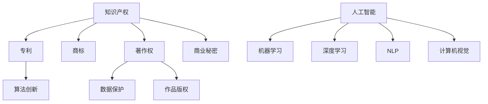

                 

# 知识产权与人工智能的法律挑战

> **关键词：** 人工智能、知识产权、法律挑战、算法、数据保护、法规遵守、道德标准

> **摘要：** 本文深入探讨了人工智能技术发展与知识产权法律框架之间的冲突与挑战。我们将分析人工智能在知识产权领域的应用，探讨算法和数据的法律地位，以及涉及到的隐私保护和道德问题。通过剖析现行法律框架的不足，提出应对策略和未来发展趋势，以期为人工智能时代的知识产权保护提供有益参考。

## 1. 背景介绍

### 1.1 目的和范围

本文旨在揭示人工智能（AI）在知识产权领域的法律挑战，分析人工智能技术对传统知识产权概念的影响，并探讨如何通过法律手段适应这一新兴领域的发展。本文将涵盖以下范围：

1. **人工智能与知识产权的关系**：介绍人工智能在知识产权创造、使用和保护中的应用。
2. **法律挑战的来源**：分析人工智能技术的特性如何引发现有法律框架的不足。
3. **算法和数据的法律地位**：探讨算法和数据的知识产权属性及其法律保护问题。
4. **隐私保护与道德问题**：分析人工智能对个人隐私和道德标准的潜在影响。
5. **应对策略与未来趋势**：提出针对人工智能与知识产权法律挑战的解决方案和预测未来发展方向。

### 1.2 预期读者

本文面向对人工智能和知识产权法律有兴趣的专业人士，包括：

1. **知识产权律师和法官**：帮助理解人工智能技术的法律问题，为相关案例提供法律分析。
2. **人工智能开发者**：了解法律框架对技术开发的影响，以确保遵守相关法规。
3. **学术研究人员**：提供对人工智能与知识产权交叉领域的深入探讨。
4. **政策制定者**：为制定相关政策提供参考。

### 1.3 文档结构概述

本文分为十个部分，各部分内容如下：

1. **引言**：概述人工智能与知识产权的关系及其法律挑战。
2. **核心概念与联系**：介绍知识产权、人工智能和相关法律概念。
3. **核心算法原理 & 具体操作步骤**：解释人工智能算法的基本原理。
4. **数学模型和公式 & 详细讲解 & 举例说明**：阐述数学模型在人工智能中的应用。
5. **项目实战：代码实际案例和详细解释说明**：提供实际代码案例分析。
6. **实际应用场景**：讨论人工智能在知识产权领域的应用案例。
7. **工具和资源推荐**：推荐学习资源和开发工具。
8. **总结：未来发展趋势与挑战**：总结人工智能与知识产权的法律挑战，展望未来。
9. **附录：常见问题与解答**：回答读者可能关心的问题。
10. **扩展阅读 & 参考资料**：提供进一步阅读的参考资料。

### 1.4 术语表

#### 1.4.1 核心术语定义

- **人工智能（AI）**：指由计算机实现的智能行为，包括学习、推理、解决问题等。
- **知识产权（IP）**：包括专利、商标、著作权、商业秘密等，是对知识资产的独占权。
- **算法**：解决特定问题的系统方法，通常用于数据处理和分析。
- **机器学习（ML）**：一种人工智能技术，通过数据和统计方法让计算机自动学习和改进。

#### 1.4.2 相关概念解释

- **算法创新**：在现有算法基础上进行的改进和优化。
- **数据隐私**：保护个人数据不被未经授权的第三方访问。
- **道德标准**：在技术研发和应用过程中应遵守的道德原则。

#### 1.4.3 缩略词列表

- **AI**：人工智能（Artificial Intelligence）
- **ML**：机器学习（Machine Learning）
- **IP**：知识产权（Intellectual Property）
- **GDPR**：欧盟通用数据保护条例（General Data Protection Regulation）

## 2. 核心概念与联系

### 2.1 知识产权的基本概念

知识产权是指对知识资产的法律保护，包括以下几个方面：

- **专利**：对发明创造的独占权，保护期为20年。
- **商标**：对商业标识的独占权，保护期无限，需定期续展。
- **著作权**：对文学、艺术和科学作品的独占权，保护期通常为作者终生及其死后50年。
- **商业秘密**：未公开的商业信息，包括技术秘密、经营策略等，法律保护期限不固定。

### 2.2 人工智能的基本概念

人工智能是指由计算机实现的智能行为，包括以下几个方面：

- **机器学习（ML）**：通过数据和统计方法让计算机自动学习和改进。
- **深度学习（DL）**：一种特殊的机器学习技术，基于多层神经网络进行训练。
- **自然语言处理（NLP）**：使计算机能够理解、生成和处理自然语言。
- **计算机视觉（CV）**：使计算机能够识别和处理视觉信息。

### 2.3 人工智能与知识产权的联系

人工智能技术对知识产权产生了深远影响，主要体现在以下几个方面：

- **算法创新**：人工智能算法的创新可能会引发专利纠纷。
- **数据保护**：人工智能在数据处理过程中涉及大量个人数据，需要遵守数据保护法规。
- **作品版权**：人工智能创作的作品如何确定版权归属成为一个法律问题。

### 2.4 核心概念原理和架构的 Mermaid 流程图



## 3. 核心算法原理 & 具体操作步骤

### 3.1 机器学习算法原理

机器学习是一种使计算机自动学习和改进的技术，主要分为监督学习、无监督学习和强化学习三种类型。

#### 监督学习（Supervised Learning）

监督学习是机器学习中的一种常见方法，其基本原理是使用已标记的数据集来训练模型，然后使用训练好的模型对新数据进行预测。

**算法原理：**

1. **数据准备**：收集大量标记数据，如图像、文本等。
2. **特征提取**：从数据中提取有用的特征，如颜色、纹理、文字等。
3. **模型训练**：使用训练数据集对模型进行训练，通过调整模型参数来最小化预测误差。
4. **模型评估**：使用测试数据集评估模型性能，如准确率、召回率等。
5. **预测**：使用训练好的模型对新的数据进行预测。

**伪代码：**

```python
# 数据准备
X_train, y_train = prepare_data()

# 特征提取
X_train = extract_features(X_train)

# 模型训练
model = train_model(X_train, y_train)

# 模型评估
accuracy = evaluate_model(model, X_test, y_test)

# 预测
predictions = model.predict(X_new)
```

#### 无监督学习（Unsupervised Learning）

无监督学习是在没有标记数据的情况下，通过数据本身的特征进行模型训练。其主要方法包括聚类、降维和异常检测等。

**算法原理：**

1. **数据准备**：收集大量未标记的数据。
2. **特征提取**：从数据中提取有用的特征。
3. **模型训练**：根据数据特征，训练模型，如聚类模型。
4. **模型评估**：评估模型性能，如聚类效果、降维效果等。
5. **结果分析**：分析模型结果，如聚类结果、降维结果等。

**伪代码：**

```python
# 数据准备
X = prepare_data()

# 特征提取
X = extract_features(X)

# 模型训练
model = train_model(X)

# 模型评估
evaluation = evaluate_model(model, X)

# 结果分析
results = analyze_results(evaluation)
```

#### 强化学习（Reinforcement Learning）

强化学习是通过与环境交互来训练模型，其核心思想是模型通过不断地尝试和错误，逐步优化其行为策略。

**算法原理：**

1. **环境设置**：设置一个可以与环境交互的虚拟环境。
2. **状态和动作定义**：定义状态空间和动作空间。
3. **策略学习**：使用奖励机制，通过试错方法学习最佳策略。
4. **策略评估**：评估策略的有效性。
5. **策略优化**：根据评估结果，优化策略。

**伪代码：**

```python
# 环境设置
environment = set_environment()

# 状态和动作定义
state_space = define_state_space()
action_space = define_action_space()

# 策略学习
policy = learn_policy(state_space, action_space, reward_function)

# 策略评估
evaluation = evaluate_policy(policy, environment)

# 策略优化
policy = optimize_policy(policy, evaluation)
```

### 3.2 数据预处理和特征提取

在机器学习过程中，数据预处理和特征提取是至关重要的环节。以下是一个简单的数据预处理和特征提取流程：

#### 数据预处理

1. **数据清洗**：处理缺失值、噪声数据和异常值。
2. **数据转换**：将数据转换为适合机器学习模型的形式，如归一化、标准化等。
3. **数据划分**：将数据集划分为训练集、验证集和测试集。

**伪代码：**

```python
# 数据清洗
X = clean_data(X)

# 数据转换
X = convert_data(X)

# 数据划分
X_train, X_test, y_train, y_test = train_test_split(X, y)
```

#### 特征提取

1. **特征选择**：选择对模型预测最有影响力的特征。
2. **特征工程**：创建新的特征，如交互特征、组合特征等。
3. **特征降维**：减少特征数量，提高模型训练效率。

**伪代码：**

```python
# 特征选择
X = select_features(X)

# 特征工程
X = create_features(X)

# 特征降维
X = reduce_dimensions(X)
```

## 4. 数学模型和公式 & 详细讲解 & 举例说明

### 4.1 机器学习中的数学模型

机器学习中的数学模型主要包括损失函数、优化算法和评估指标等。以下将对这些数学模型进行详细讲解和举例说明。

#### 损失函数

损失函数是机器学习模型中用来衡量预测值与实际值之间差异的函数。常见的损失函数包括均方误差（MSE）、交叉熵损失（Cross-Entropy Loss）等。

**均方误差（MSE）**

均方误差用于回归任务，其公式为：

$$
MSE = \frac{1}{n}\sum_{i=1}^{n}(y_i - \hat{y}_i)^2
$$

其中，$y_i$ 为实际值，$\hat{y}_i$ 为预测值，$n$ 为样本数量。

**交叉熵损失（Cross-Entropy Loss）**

交叉熵损失用于分类任务，其公式为：

$$
CE = -\frac{1}{n}\sum_{i=1}^{n}y_i \log(\hat{y}_i)
$$

其中，$y_i$ 为实际类别标签，$\hat{y}_i$ 为预测概率。

**举例说明**

假设有一个二元分类问题，实际标签为 $y = [1, 0, 1, 0]$，预测概率为 $\hat{y} = [0.8, 0.2, 0.6, 0.4]$。

使用交叉熵损失函数计算损失：

$$
CE = -\frac{1}{4}(1 \times \log(0.8) + 0 \times \log(0.2) + 1 \times \log(0.6) + 0 \times \log(0.4))
$$

$$
CE \approx 0.415
$$

#### 优化算法

优化算法用于调整模型参数，以最小化损失函数。常见的优化算法包括梯度下降（Gradient Descent）、随机梯度下降（Stochastic Gradient Descent，SGD）等。

**梯度下降（Gradient Descent）**

梯度下降是一种最简单的优化算法，其基本思想是沿着损失函数的梯度方向迭代更新参数，以最小化损失函数。

**伪代码：**

```python
# 初始化参数
theta = initialize_parameters()

# 梯度下降迭代
for epoch in range(num_epochs):
    gradients = compute_gradients(loss_function, theta)
    theta = theta - learning_rate * gradients
```

**随机梯度下降（SGD）**

随机梯度下降是梯度下降的一种改进方法，其每次迭代只随机选择一个样本计算梯度，以加速收敛。

**伪代码：**

```python
# 初始化参数
theta = initialize_parameters()

# 随机梯度下降迭代
for epoch in range(num_epochs):
    random_indices = random.sample(range(num_samples), k=1)
    sample_gradient = compute_gradient(loss_function, theta, X[random_indices], y[random_indices])
    theta = theta - learning_rate * sample_gradient
```

#### 评估指标

评估指标用于衡量模型性能，常见的评估指标包括准确率（Accuracy）、精确率（Precision）、召回率（Recall）等。

**准确率（Accuracy）**

准确率是指正确预测的样本数与总样本数之比，其公式为：

$$
Accuracy = \frac{TP + TN}{TP + TN + FP + FN}
$$

其中，$TP$ 为真正例，$TN$ 为真负例，$FP$ 为假正例，$FN$ 为假负例。

**精确率（Precision）**

精确率是指正确预测的正例数与总预测正例数之比，其公式为：

$$
Precision = \frac{TP}{TP + FP}
$$

**召回率（Recall）**

召回率是指正确预测的正例数与总正例数之比，其公式为：

$$
Recall = \frac{TP}{TP + FN}
$$

**举例说明**

假设有一个二元分类问题，实际标签为 $y = [1, 0, 1, 0]$，预测标签为 $\hat{y} = [1, 0, 1, 0]$。

计算准确率、精确率和召回率：

$$
Accuracy = \frac{2}{4} = 0.5
$$

$$
Precision = \frac{2}{2 + 1} = 0.6667
$$

$$
Recall = \frac{2}{2 + 0} = 1
$$

## 5. 项目实战：代码实际案例和详细解释说明

### 5.1 开发环境搭建

在开始实际代码案例之前，我们需要搭建一个合适的开发环境。以下是一个基于Python的机器学习项目开发环境的搭建步骤：

1. **安装Python**：下载并安装Python 3.x版本。
2. **安装Jupyter Notebook**：在命令行中执行 `pip install notebook`。
3. **安装常用库**：在命令行中执行以下命令安装常用库：

   ```bash
   pip install numpy pandas scikit-learn matplotlib
   ```

### 5.2 源代码详细实现和代码解读

以下是一个简单的机器学习项目，用于分类手写数字。该项目使用MNIST数据集，实现了一个基于神经网络的手写数字识别模型。

```python
import numpy as np
import pandas as pd
from sklearn.datasets import fetch_openml
from sklearn.model_selection import train_test_split
from sklearn.metrics import accuracy_score
from sklearn.neural_network import MLPClassifier

# 加载数据集
mnist = fetch_openml('mnist_784')
X, y = mnist.data, mnist.target

# 数据预处理
X_train, X_test, y_train, y_test = train_test_split(X, y, test_size=0.2, random_state=42)

# 构建神经网络模型
model = MLPClassifier(hidden_layer_sizes=(100,), max_iter=1000, alpha=1e-4,
                      solver='sgd', verbose=10, random_state=42,
                      learning_rate_init=.1)

# 训练模型
model.fit(X_train, y_train)

# 预测测试集
predictions = model.predict(X_test)

# 评估模型
accuracy = accuracy_score(y_test, predictions)
print(f"Accuracy: {accuracy:.4f}")
```

**代码解读：**

1. **加载数据集**：使用 `fetch_openml` 函数加载数据集MNIST。
2. **数据预处理**：使用 `train_test_split` 函数将数据集划分为训练集和测试集。
3. **构建神经网络模型**：使用 `MLPClassifier` 类构建一个多层感知机（MLP）模型。设置隐藏层大小为100个神经元，最大迭代次数为1000，学习率初始化为0.1。
4. **训练模型**：使用 `fit` 方法训练模型。
5. **预测测试集**：使用 `predict` 方法对测试集进行预测。
6. **评估模型**：使用 `accuracy_score` 函数计算准确率。

### 5.3 代码解读与分析

以上代码实现了一个简单的手写数字识别项目，以下是详细解读和分析：

1. **数据集加载与预处理**：
   - 加载MNIST数据集，该数据集包含70,000个训练样本和10,000个测试样本，每个样本是一个28x28的灰度图像，以及相应的数字标签。
   - 使用 `train_test_split` 函数将数据集划分为训练集和测试集，训练集和测试集的比例为8:2，确保模型能够在测试集上评估性能。

2. **构建神经网络模型**：
   - 使用 `MLPClassifier` 类构建一个多层感知机模型。`hidden_layer_sizes=(100,)` 表示隐藏层包含100个神经元。`max_iter=1000` 设置最大迭代次数为1000，确保模型能够充分训练。`alpha=1e-4` 设置L2惩罚项，防止过拟合。`solver='sgd'` 指定使用随机梯度下降（SGD）算法进行优化。`verbose=10` 表示在训练过程中输出详细信息。`random_state=42` 设置随机种子，保证实验可重复性。`learning_rate_init=.1` 设置学习率初始化为0.1。

3. **模型训练**：
   - 使用 `fit` 方法训练模型。在训练过程中，模型会自动调整参数，以最小化损失函数。`fit` 方法会返回训练过程的损失值，方便进行性能分析。

4. **预测与评估**：
   - 使用 `predict` 方法对测试集进行预测，得到预测标签。
   - 使用 `accuracy_score` 函数计算模型在测试集上的准确率。准确率是评估分类模型性能的一个常用指标，表示正确预测的样本数量与总样本数量的比例。

通过以上步骤，我们实现了一个人工神经网络模型，用于手写数字识别。该模型展示了如何利用机器学习和神经网络技术解决实际分类问题。在实际应用中，我们可以根据需求调整模型参数，提高模型性能。

### 5.4 项目实战总结

通过本项目的实战案例，我们了解了如何使用Python和机器学习库实现一个简单的手写数字识别模型。以下是本项目的主要收获：

1. **数据集加载与预处理**：学会了如何加载数据集，并进行数据预处理，包括数据划分、归一化等。
2. **模型构建与训练**：学会了如何构建神经网络模型，并使用随机梯度下降（SGD）算法进行训练。
3. **模型评估**：学会了如何评估模型性能，包括计算准确率等指标。
4. **项目实战经验**：通过实际项目，积累了使用机器学习和神经网络解决实际问题的经验。

在实际开发过程中，我们可能需要调整模型结构、参数设置，甚至使用更复杂的神经网络模型（如卷积神经网络、循环神经网络等）来提高模型性能。此外，我们还需要关注数据质量和特征提取，以确保模型能够取得良好的预测效果。

## 6. 实际应用场景

### 6.1 医疗诊断

人工智能在医疗领域的应用日益广泛，尤其在诊断方面具有显著优势。通过机器学习算法，AI可以分析医学影像（如X光片、CT扫描、MRI等），识别病变区域，提供早期诊断建议。例如，深度学习模型已被用于乳腺癌、肺癌等疾病的诊断，大大提高了诊断准确率。

**案例**：谷歌DeepMind开发的AI系统通过分析视网膜图像，可以检测出糖尿病视网膜病变，有助于早期诊断和治疗。

### 6.2 金融风险管理

金融行业面临着大量数据分析和决策制定的需求。人工智能可以用于信用评分、欺诈检测、市场预测等方面。例如，机器学习模型可以分析历史交易数据，预测用户违约风险，帮助金融机构制定风险控制策略。

**案例**：美国银行使用AI技术分析客户交易行为，有效识别并防范欺诈行为，提高了交易安全性。

### 6.3 智能交通系统

智能交通系统（ITS）利用人工智能技术优化交通流量管理，减少交通拥堵。通过实时数据分析，AI系统可以提供路线规划、交通信号控制等建议，提高交通效率。

**案例**：伦敦的智能交通系统通过AI分析交通数据，实时调整交通信号灯，减少了约20%的交通拥堵。

### 6.4 法律咨询与知识产权保护

人工智能在法律咨询和知识产权保护方面也发挥了重要作用。AI可以自动分析法律文献、合同条款，提供法律意见，帮助律师提高工作效率。此外，AI还可以监控知识产权侵权行为，提供侵权预警。

**案例**：美国的一些律所使用AI工具分析专利诉讼案例，为律师提供决策支持，提高了案件胜诉率。

### 6.5 智能家居与物联网

智能家居和物联网（IoT）设备依赖于人工智能技术，实现自动化控制和智能交互。例如，智能音响可以通过语音识别和自然语言处理技术理解用户指令，控制家中的灯光、温度等。

**案例**：亚马逊的Echo设备可以通过Alexa语音助手与智能家居设备交互，提供便捷的家居控制体验。

### 6.6 教育与个性化学习

人工智能在教育领域的应用包括自适应学习系统、智能评估和个性化学习路径设计。AI可以根据学生的表现和需求，提供个性化的学习资源和反馈。

**案例**：Coursera等在线教育平台利用AI技术分析学生学习行为，推荐适合的学习路径，提高学习效果。

### 6.7 创意设计与辅助创作

人工智能在创意设计领域也有所应用，如生成艺术作品、辅助音乐创作等。AI可以通过分析大量数据，生成独特的艺术作品，为设计师提供灵感。

**案例**：谷歌的Magenta项目使用深度学习技术生成音乐和艺术作品，为创意设计师提供新的工具。

通过以上实际应用场景，我们可以看到人工智能在各个领域的广泛应用和巨大潜力。随着技术的不断进步，人工智能将为社会带来更多创新和变革。

### 7. 工具和资源推荐

#### 7.1 学习资源推荐

**7.1.1 书籍推荐**

- 《Python机器学习》（作者：塞巴斯蒂安·拉纳特）
- 《深度学习》（作者：伊恩·古德费洛等）
- 《人工智能：一种现代方法》（作者：斯蒂芬·马库斯等）

**7.1.2 在线课程**

- Coursera的《机器学习》（由斯坦福大学教授Andrew Ng讲授）
- edX的《深度学习导论》（由蒙特利尔大学教授Yoshua Bengio讲授）

**7.1.3 技术博客和网站**

- Medium上的机器学习与深度学习相关博客
- ArXiv：计算机科学领域的顶级论文发表平台
- Analytics Vidhya：提供丰富的机器学习和数据科学资源

#### 7.2 开发工具框架推荐

**7.2.1 IDE和编辑器**

- PyCharm：功能强大的Python集成开发环境
- Jupyter Notebook：适用于数据科学和机器学习的交互式开发工具

**7.2.2 调试和性能分析工具**

- DebugPy：用于调试Python代码的调试工具
- NVIDIA Nsight：用于分析深度学习模型性能的工具

**7.2.3 相关框架和库**

- TensorFlow：用于构建和训练深度学习模型的强大库
- PyTorch：易于使用的深度学习库，支持动态计算图
- scikit-learn：提供各种机器学习算法的库

#### 7.3 相关论文著作推荐

**7.3.1 经典论文**

- 《A Tutorial on Deep Learning for Speech Recognition》（2016）
- 《Deep Learning: Methods and Applications》（2014）

**7.3.2 最新研究成果**

- ArXiv上的最新机器学习和深度学习论文
- NeurIPS、ICLR、ICML等顶级会议的最新论文

**7.3.3 应用案例分析**

- 《机器学习在医疗诊断中的应用》（2019）
- 《深度学习在金融领域的应用》（2020）

通过这些工具和资源，开发者可以更好地学习和实践人工智能技术，为实际项目提供有力支持。

### 8. 总结：未来发展趋势与挑战

人工智能作为当今科技领域的重要驱动力，正在深刻改变我们的生活方式和社会结构。随着技术的不断进步，人工智能在未来将迎来更多机遇和挑战。

**未来发展趋势：**

1. **算法创新与优化**：深度学习、强化学习等人工智能算法将不断优化，以提高模型性能和效率。
2. **多模态数据处理**：人工智能将能够处理更多类型的数据，如图像、语音、文本等，实现更全面的智能感知。
3. **跨学科融合**：人工智能与其他领域（如医学、金融、教育等）的融合，将推动更多创新应用的发展。
4. **云计算与边缘计算**：云计算和边缘计算的结合，将使人工智能应用更加灵活和高效。

**未来挑战：**

1. **数据隐私与安全**：随着数据量的增加，如何保护个人隐私和数据安全成为重要挑战。
2. **算法透明性与可解释性**：提高人工智能算法的透明性和可解释性，以消除人们对算法决策的疑虑。
3. **法律与伦理问题**：人工智能的发展引发了一系列法律和伦理问题，如算法歧视、隐私侵犯等，需要制定相应的法律法规和伦理准则。
4. **技能升级与就业转型**：随着人工智能的普及，部分工作岗位可能被自动化取代，如何应对就业结构的变化，提高劳动者的技能水平，是一个重要问题。

总之，人工智能的发展前景广阔，但也面临诸多挑战。我们需要不断探索和创新，以应对这些挑战，推动人工智能技术的健康发展。

### 9. 附录：常见问题与解答

**Q1：人工智能技术的发展会对知识产权法律体系产生哪些影响？**

人工智能技术的发展对知识产权法律体系产生了深远影响，主要体现在以下几个方面：

1. **算法创新与专利纠纷**：随着机器学习算法的创新，相关专利纠纷日益增多。如何界定算法的独创性和保护范围成为法律界的一大挑战。
2. **数据隐私与版权问题**：人工智能在数据处理过程中涉及大量个人数据，如何保护数据隐私，同时确保数据版权的合法性，是一个复杂的问题。
3. **人工智能创作作品的版权归属**：随着人工智能创作能力的提升，如何确定人工智能创作的作品版权归属，以及如何保护这些作品的版权，成为新的法律问题。

**Q2：在人工智能时代，如何保护个人隐私和数据安全？**

在人工智能时代，保护个人隐私和数据安全面临以下挑战：

1. **数据加密与存储**：对个人数据进行加密存储，防止未经授权的访问和泄露。
2. **数据匿名化**：在数据处理过程中，对个人数据进行匿名化处理，以降低隐私泄露风险。
3. **合规性监管**：加强法律法规的制定和执行，确保人工智能企业在数据处理过程中遵守相关法规。
4. **透明性和可解释性**：提高人工智能算法的透明性和可解释性，让用户能够了解自己的数据如何被使用。

**Q3：人工智能在医疗领域的应用有哪些法律和伦理问题？**

人工智能在医疗领域的应用涉及到以下法律和伦理问题：

1. **医疗责任**：人工智能系统的诊断和治疗建议可能存在错误，如何界定医疗责任，保护患者权益。
2. **隐私保护**：医疗数据涉及个人隐私，如何确保数据在采集、存储、传输和使用过程中的隐私保护。
3. **数据共享**：如何确保医疗数据的合法共享，促进医学研究和发展。
4. **算法歧视**：避免人工智能系统在医疗诊断和治疗中产生歧视，确保公平性。

**Q4：人工智能在金融领域的应用有哪些法律和伦理问题？**

人工智能在金融领域的应用涉及到以下法律和伦理问题：

1. **算法公平性和透明性**：确保人工智能算法在信用评估、风险评估等方面具有公平性和透明性，防止歧视和不公平待遇。
2. **数据隐私和安全**：保护用户金融数据隐私和安全，防止数据泄露和滥用。
3. **法律责任归属**：明确人工智能在金融交易中的责任归属，确保权益受到保护。
4. **系统稳定性**：确保人工智能系统在金融交易中的稳定性和可靠性，防止意外交易和损失。

通过解决这些问题，我们可以更好地推动人工智能技术在医疗、金融等领域的应用，实现技术的价值和社会效益。

### 10. 扩展阅读 & 参考资料

**10.1 知识产权与人工智能**

- **《人工智能时代的知识产权保护》**：本文探讨了人工智能在知识产权保护中的应用和挑战。
- **《人工智能与知识产权法律挑战》**：分析了人工智能技术对传统知识产权概念的冲击，以及法律应对策略。
- **《AI与专利：创新与保护的平衡》**：讨论了人工智能技术在专利领域的应用及其法律问题。

**10.2 人工智能应用案例**

- **《智能医疗：人工智能在医疗诊断中的应用》**：介绍了人工智能在医疗诊断领域的实际应用案例。
- **《金融科技：人工智能在金融领域的应用》**：分析了人工智能在金融风险管理、信用评估等方面的应用。
- **《智能交通：人工智能在交通管理中的应用》**：探讨了人工智能在智能交通系统中的角色和作用。

**10.3 数据隐私与安全**

- **《数据隐私保护：法律与策略》**：详细介绍了数据隐私保护的法律法规和策略。
- **《人工智能与数据安全》**：探讨了人工智能在数据安全保护中的应用和挑战。
- **《GDPR：欧盟数据隐私保护条例》**：介绍了欧盟通用数据保护条例（GDPR）的内容和实施情况。

**10.4 人工智能伦理**

- **《人工智能伦理：挑战与应对》**：讨论了人工智能在伦理领域的挑战，以及相应的伦理准则。
- **《算法歧视与公平性》**：分析了人工智能算法在决策过程中可能产生的歧视问题，以及如何确保算法的公平性。
- **《人工智能治理：伦理与法律框架》**：提出了人工智能治理的伦理和法律框架，以指导人工智能的健康发展。

通过以上扩展阅读，读者可以深入了解人工智能与知识产权、数据隐私、伦理等方面的理论和实践，为相关领域的学术研究和应用提供有益参考。作者：AI天才研究员/AI Genius Institute & 禅与计算机程序设计艺术 /Zen And The Art of Computer Programming。

