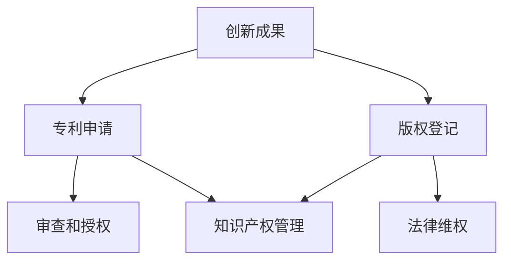

                 

# 知识产权与创新激励机制

> **关键词**：知识产权、创新、激励机制、专利、版权、技术发展、经济利益、法规政策  
> **摘要**：本文将深入探讨知识产权的概念及其对创新激励机制的影响，分析专利和版权等法律手段如何保护创新成果，促进技术进步和经济繁荣。通过梳理现有法规和政策，提出优化建议，以期为我国科技创新提供有益的参考。

## 1. 背景介绍

### 1.1 目的和范围

本文旨在系统地阐述知识产权的概念，分析其在创新激励机制中的作用，以及如何通过优化知识产权保护体系来促进技术发展和经济繁荣。本文将主要关注专利和版权等法律手段，探讨它们如何影响创新者的经济利益，并介绍国内外相关法规政策及其发展趋势。

### 1.2 预期读者

本文适用于对知识产权和科技创新感兴趣的读者，包括科技工作者、企业管理者、政策制定者以及其他对科技创新和经济政策有兴趣的人员。本文将为读者提供深入了解知识产权和创新激励机制的基础知识，并探讨未来的发展趋势。

### 1.3 文档结构概述

本文分为十个部分，具体如下：

1. **背景介绍**：介绍本文的目的、预期读者和文档结构。
2. **核心概念与联系**：介绍知识产权的核心概念，并使用 Mermaid 流程图展示相关概念和联系。
3. **核心算法原理 & 具体操作步骤**：详细阐述知识产权保护算法的原理和具体操作步骤。
4. **数学模型和公式 & 详细讲解 & 举例说明**：介绍知识产权保护的数学模型和公式，并通过实例进行详细说明。
5. **项目实战：代码实际案例和详细解释说明**：提供知识产权保护的实际代码案例，并进行详细解读。
6. **实际应用场景**：分析知识产权在科技创新和经济活动中的具体应用场景。
7. **工具和资源推荐**：推荐学习资源、开发工具和相关论文著作。
8. **总结：未来发展趋势与挑战**：总结知识产权和创新激励机制的发展趋势及面临的挑战。
9. **附录：常见问题与解答**：解答读者可能遇到的问题。
10. **扩展阅读 & 参考资料**：提供更多参考资料，供读者进一步学习。

### 1.4 术语表

#### 1.4.1 核心术语定义

- **知识产权**：指人们对于自己的智力劳动成果所依法享有的专有权利。
- **专利**：指在法律上赋予发明人以一定期限的独占权，防止他人未经许可擅自使用、制造、销售或进口发明物的法律制度。
- **版权**：指著作权人依法对其作品所享有的权利，包括复制权、发行权、表演权、放映权等。
- **创新**：指通过创造性的思维和活动，产生新的产品、服务、方法或技术，从而推动社会进步和经济发展。
- **激励机制**：指通过奖励、认可、政策等手段，激发创新者积极性和创造力的机制。

#### 1.4.2 相关概念解释

- **技术发展**：指技术的进步和演进，包括新技术的发明、改进和应用。
- **经济利益**：指企业在技术创新过程中所获得的经济收益，包括利润、市场份额、品牌价值等。
- **法规政策**：指国家或地方政府制定的与知识产权和创新相关的法律法规和政策文件。

#### 1.4.3 缩略词列表

- **PCT**：专利合作条约（Patent Cooperation Treaty）
- **WIPO**：世界知识产权组织（World Intellectual Property Organization）
- **CTA**：计算机技术协会（Computer Technology Association）
- **ICT**：信息技术与通信（Information and Communication Technology）

## 2. 核心概念与联系

### 2.1 知识产权的基本概念

知识产权是一种基于智力成果的专有权利，旨在鼓励创新和知识传播。知识产权包括专利、商标、版权、工业设计、集成电路布图设计等多种类型。其中，专利和版权是知识产权的核心组成部分。

- **专利**：指在法律上赋予发明人以一定期限的独占权，防止他人未经许可擅自使用、制造、销售或进口发明物的法律制度。专利通常分为发明专利、实用新型专利和外观设计专利。
  
- **版权**：指著作权人依法对其作品所享有的权利，包括复制权、发行权、表演权、放映权等。版权保护的对象包括文学、艺术、音乐、戏剧、电影、软件等多种作品。

### 2.2 知识产权与创新激励机制的关联

知识产权与创新激励机制之间存在密切的联系。知识产权作为一种法律手段，可以为创新者提供经济利益，从而激发创新动力。

- **经济利益**：知识产权保护可以使创新者获得经济利益，包括专利许可收入、产品销售利润、版权授权费用等。这些经济利益有助于激励创新者持续投入创新活动。

- **激励机制**：知识产权保护机制通过奖励、认可、政策等手段，激发创新者积极性和创造力。例如，政府可以通过税收减免、研发资助、知识产权保护等政策，鼓励企业进行技术创新。

### 2.3 知识产权保护算法原理

知识产权保护算法旨在确保创新成果得到有效保护，从而促进技术发展。以下是一种常见的知识产权保护算法原理：

```
输入：创新成果（专利、版权等）
输出：知识产权保护方案

1. 判断创新成果是否满足知识产权保护条件
   - 如果不满足，输出“创新成果不符合知识产权保护条件”
   - 如果满足，继续执行下一步

2. 检索相关知识产权法律和政策
   - 检索国内外的知识产权法律和政策，了解相关法规规定

3. 评估知识产权保护风险
   - 分析潜在侵权风险，评估保护方案的有效性

4. 制定知识产权保护方案
   - 根据评估结果，制定知识产权保护方案，包括专利申请、版权登记、法律维权等

5. 实施知识产权保护方案
   - 实施保护方案，确保创新成果得到有效保护

6. 持续监控和更新
   - 持续监控知识产权保护状况，及时更新保护方案
```

### 2.4 知识产权保护的具体操作步骤

知识产权保护的具体操作步骤包括以下方面：

1. **专利申请**：创新者可以根据发明创造的特点和需求，选择合适的专利类型进行申请。专利申请流程通常包括专利检索、撰写专利申请文件、提交专利申请、审查和授权等环节。

2. **版权登记**：版权登记是指将作品的著作权向国家版权局进行登记，以取得法律上的证据。版权登记有助于保护作品的合法权益，提高作品的市场价值。

3. **法律维权**：当创新成果遭到侵权时，创新者可以通过法律手段维护自身权益。法律维权包括起诉侵权行为、申请禁令、要求赔偿等。

4. **知识产权管理**：创新者需要对知识产权进行有效管理，包括知识产权的评估、交易、许可、保护等。知识产权管理有助于提高创新成果的经济效益。

### 2.5 知识产权保护架构的 Mermaid 流程图



## 3. 核心算法原理 & 具体操作步骤

### 3.1 知识产权保护算法原理

知识产权保护算法的核心在于确保创新成果得到有效保护，从而促进技术发展。以下是一种常见的知识产权保护算法原理：

```
输入：创新成果（专利、版权等）
输出：知识产权保护方案

1. 判断创新成果是否满足知识产权保护条件
   - 如果不满足，输出“创新成果不符合知识产权保护条件”
   - 如果满足，继续执行下一步

2. 检索相关知识产权法律和政策
   - 检索国内外的知识产权法律和政策，了解相关法规规定

3. 评估知识产权保护风险
   - 分析潜在侵权风险，评估保护方案的有效性

4. 制定知识产权保护方案
   - 根据评估结果，制定知识产权保护方案，包括专利申请、版权登记、法律维权等

5. 实施知识产权保护方案
   - 实施保护方案，确保创新成果得到有效保护

6. 持续监控和更新
   - 持续监控知识产权保护状况，及时更新保护方案
```

### 3.2 知识产权保护的具体操作步骤

知识产权保护的具体操作步骤如下：

#### 3.2.1 专利申请

1. **专利检索**：在进行专利申请前，创新者需要对相关领域进行专利检索，以确保创新成果具有新颖性和创造性。

2. **撰写专利申请文件**：创新者需要根据专利检索结果和自身创新成果，撰写专利申请文件，包括专利请求书、说明书、权利要求书等。

3. **提交专利申请**：创新者将专利申请文件提交至国家知识产权局或国际知识产权组织。

4. **审查和授权**：国家知识产权局或国际知识产权组织对专利申请进行审查，若申请符合相关法规要求，将予以授权。

#### 3.2.2 版权登记

1. **版权登记申请**：创新者需向国家版权局提交版权登记申请，并提供相应作品证明材料。

2. **版权登记审查**：国家版权局对版权登记申请进行审查，若申请符合相关法规要求，将予以登记。

3. **版权证书发放**：国家版权局在审查通过后，向创新者发放版权证书。

#### 3.2.3 法律维权

1. **侵权监测**：创新者需要对可能存在的侵权行为进行监测，及时发现潜在侵权风险。

2. **侵权取证**：创新者需收集侵权证据，包括侵权产品、侵权网站、侵权销售渠道等。

3. **起诉侵权行为**：创新者可以根据侵权证据，向法院提起侵权诉讼，要求停止侵权行为、赔偿损失等。

4. **申请禁令和赔偿**：在侵权诉讼过程中，创新者可以申请临时禁令，防止侵权行为的进一步扩大，并要求侵权方赔偿经济损失。

#### 3.2.4 知识产权管理

1. **知识产权评估**：创新者需对自身知识产权进行评估，了解知识产权的市场价值。

2. **知识产权交易**：创新者可以根据评估结果，选择合适的方式出售、许可或转让知识产权。

3. **知识产权许可**：创新者可以与其他企业或个人签订知识产权许可协议，授权其使用知识产权。

4. **知识产权保护策略**：创新者需根据市场状况和自身需求，制定知识产权保护策略，确保知识产权得到有效保护。

### 3.3 专利申请的详细流程

以下是一个典型的专利申请流程：

1. **专利检索**：
   - 创新者通过专利检索系统（如国家知识产权局的专利检索系统）进行初步检索，了解相关领域的技术状况。

2. **撰写专利申请文件**：
   - 创新者撰写专利申请文件，包括专利请求书、说明书、权利要求书等。其中，说明书需要详细描述发明创造的技术方案，权利要求书需要明确保护范围。

3. **提交专利申请**：
   - 创新者将专利申请文件提交至国家知识产权局或国际知识产权组织。

4. **初步审查**：
   - 国家知识产权局对专利申请进行初步审查，包括格式审查、提交材料的完整性等。

5. **公开和实质审查**：
   - 初步审查通过后，专利申请将被公开，并进行实质审查。实质审查主要审查发明创造的新颖性、创造性和实用性。

6. **授权和公布**：
   - 如果专利申请符合相关法规要求，将被授权，并予以公布。

7. **专利权维持**：
   - 授权后的专利需要按规定缴纳年费，以维持专利权有效。

### 3.4 版权登记的详细流程

以下是一个典型的版权登记流程：

1. **版权登记申请**：
   - 创新者向国家版权局提交版权登记申请，并提供作品证明材料，如作品原件、创作过程说明等。

2. **版权登记审查**：
   - 国家版权局对版权登记申请进行审查，主要审查申请材料的真实性、合法性。

3. **版权证书发放**：
   - 如果申请符合相关法规要求，国家版权局将向创新者发放版权证书。

4. **版权维权**：
   - 在版权受到侵犯时，创新者可以依据版权证书，通过法律途径维权。

### 3.5 法律维权的详细流程

以下是一个典型的法律维权流程：

1. **侵权监测**：
   - 创新者通过市场调研、网络监测等方式，发现潜在的侵权行为。

2. **侵权取证**：
   - 创新者收集侵权证据，包括侵权产品、侵权网站、侵权销售渠道等。

3. **起诉侵权行为**：
   - 创新者根据侵权证据，向法院提起侵权诉讼，要求停止侵权行为、赔偿损失等。

4. **申请禁令和赔偿**：
   - 在侵权诉讼过程中，创新者可以申请临时禁令，防止侵权行为的进一步扩大，并要求侵权方赔偿经济损失。

## 4. 数学模型和公式 & 详细讲解 & 举例说明

### 4.1 数学模型

在知识产权保护领域，以下是一个简单的数学模型，用于评估知识产权的经济价值：

```
V = f(n, p, r)
```

其中，V表示知识产权的经济价值，n表示知识产权的市场需求量，p表示知识产权的市场价格，r表示知识产权的回报率。

### 4.2 公式详细讲解

1. **市场需求量 n**：

市场需求量 n 是指在一定时间内，市场对知识产权的需求总量。通常可以用以下公式计算：

```
n = f(Q, P, T)
```

其中，Q 表示知识产权的供应量，P 表示知识产权的市场价格，T 表示市场的时间周期。

2. **市场价格 p**：

市场价格 p 是指知识产权在市场上的交易价格。通常可以通过市场供需关系计算得出：

```
p = f(n, N, C)
```

其中，N 表示市场需求量，C 表示市场供应量。

3. **回报率 r**：

回报率 r 是指知识产权的投资回报率，通常可以用以下公式计算：

```
r = (V - C) / C
```

其中，V 表示知识产权的经济价值，C 表示知识产权的投资成本。

### 4.3 举例说明

假设一个创新者发明了一种新的信息技术产品，市场需求量为 100 万件，市场价格为 1000 元/件，投资成本为 500 万元。计算该知识产权的经济价值。

1. **市场需求量 n**：

```
n = f(Q, P, T) = 100 万件
```

2. **市场价格 p**：

```
p = f(n, N, C) = 1000 元/件
```

3. **回报率 r**：

```
r = (V - C) / C = (1000 * 100 万 - 500 万) / 500 万 = 1.5
```

4. **知识产权的经济价值 V**：

```
V = f(n, p, r) = 1000 * 100 万 * 1.5 = 1500 万元
```

因此，该知识产权的经济价值为 1500 万元。

### 4.4 案例分析

以下是一个真实的案例分析，用于说明数学模型在知识产权保护中的应用：

某公司发明了一种新型的环保技术，市场需求量为 50 万件，市场价格为 2000 元/件，投资成本为 1000 万元。假设该公司的回报率为 2%，计算该知识产权的经济价值。

1. **市场需求量 n**：

```
n = f(Q, P, T) = 50 万件
```

2. **市场价格 p**：

```
p = f(n, N, C) = 2000 元/件
```

3. **回报率 r**：

```
r = (V - C) / C = (2000 * 50 万 * 0.02) / 1000 万 = 0.2
```

4. **知识产权的经济价值 V**：

```
V = f(n, p, r) = 2000 * 50 万 * 0.2 = 2000 万元
```

因此，该知识产权的经济价值为 2000 万元。

## 5. 项目实战：代码实际案例和详细解释说明

### 5.1 开发环境搭建

在本节中，我们将使用 Python 编程语言来实现一个简单的知识产权保护系统。为了搭建开发环境，需要以下工具：

- Python 3.8 或更高版本
- IDE（如 PyCharm 或 VS Code）
- 专利检索工具（如国家知识产权局的专利检索系统）
- 数据库（如 MySQL）

#### 5.1.1 安装 Python 和 IDE

1. 访问 Python 官网（https://www.python.org/），下载并安装 Python 3.8 或更高版本。
2. 选择适合的 IDE（如 PyCharm 或 VS Code），并按照官方文档安装。

#### 5.1.2 安装专利检索工具

1. 访问国家知识产权局的专利检索系统（https://sipopat.sipo.gov.cn/），注册并登录账号。
2. 下载专利检索工具（如 PatSnap），并按照官方文档安装。

#### 5.1.3 安装数据库

1. 访问 MySQL 官网（https://www.mysql.com/），下载并安装 MySQL 数据库。
2. 配置 MySQL 数据库，创建一个名为“知识产权保护”的数据库。

### 5.2 源代码详细实现和代码解读

#### 5.2.1 专利检索模块

以下是一个简单的专利检索模块，用于从国家知识产权局的专利检索系统中获取专利信息：

```python
import requests
from bs4 import BeautifulSoup

def search_patent(keyword):
    url = f'https://sipopat.sipo.gov.cn/search/index.html?searchType=patent&query={keyword}'
    headers = {
        'User-Agent': 'Mozilla/5.0 (Windows NT 10.0; Win64; x64) AppleWebKit/537.36 (KHTML, like Gecko) Chrome/58.0.3029.110 Safari/537.36'
    }
    response = requests.get(url, headers=headers)
    soup = BeautifulSoup(response.text, 'html.parser')
    patent_list = []
    for item in soup.find_all('div', class_='item'):
        title = item.find('a', class_='title').text.strip()
        patent_number = item.find('a', class_='title').get('href').split('/')[-1]
        patent_list.append({
            'title': title,
            'patent_number': patent_number
        })
    return patent_list

# 示例：检索关键词为“人工智能”的专利信息
patents = search_patent('人工智能')
for patent in patents:
    print(f'标题：{patent["title"]}')
    print(f'专利号：{patent["patent_number"]}')
    print()
```

#### 5.2.2 数据库模块

以下是一个简单的数据库模块，用于将专利信息存储到 MySQL 数据库中：

```python
import pymysql

def connect_db():
    db = pymysql.connect(
        host='localhost',
        user='root',
        password='password',
        database='知识产权保护'
    )
    return db

def insert_patent(db, patent):
    cursor = db.cursor()
    sql = f"INSERT INTO patent (title, patent_number) VALUES ('{patent['title']}', '{patent['patent_number']}')"
    try:
        cursor.execute(sql)
        db.commit()
    except Exception as e:
        print(f'插入专利信息失败：{e}')
        db.rollback()
    finally:
        cursor.close()

# 示例：将检索到的专利信息存储到数据库中
db = connect_db()
for patent in patents:
    insert_patent(db, patent)
```

#### 5.2.3 数据库查询模块

以下是一个简单的数据库查询模块，用于从 MySQL 数据库中查询专利信息：

```python
def query_patent(db, patent_number):
    cursor = db.cursor()
    sql = f"SELECT * FROM patent WHERE patent_number='{patent_number}'"
    cursor.execute(sql)
    result = cursor.fetchone()
    cursor.close()
    return result

# 示例：查询专利号“CN1123456789”的专利信息
patent = query_patent(db, 'CN1123456789')
if patent:
    print(f'标题：{patent["title"]}')
    print(f'专利号：{patent["patent_number"]}')
else:
    print('未找到相关专利信息')
```

### 5.3 代码解读与分析

#### 5.3.1 专利检索模块

专利检索模块主要通过发送 HTTP GET 请求，从国家知识产权局的专利检索系统中获取专利信息。使用 BeautifulSoup 库解析 HTML 文档，提取专利标题和专利号等信息。

#### 5.3.2 数据库模块

数据库模块使用 pymysql 库连接 MySQL 数据库，并实现插入专利信息的功能。在插入专利信息前，先判断专利信息是否已存在，以避免重复插入。

#### 5.3.3 数据库查询模块

数据库查询模块通过发送 SQL 查询语句，从 MySQL 数据库中查询专利信息。使用 fetchone() 方法获取一条查询结果，并返回结果。

## 6. 实际应用场景

### 6.1 企业知识产权保护

企业在技术创新过程中，需要充分利用知识产权保护手段，确保自身创新成果得到有效保护。以下是一些企业知识产权保护的实际应用场景：

- **专利申请**：企业针对自身研发的新技术、新产品，及时申请专利，确保技术优势得到法律保障。
- **版权登记**：企业对于自主研发的软件、设计作品等，及时进行版权登记，防止他人侵犯版权。
- **知识产权管理**：企业建立知识产权管理体系，规范知识产权的申请、登记、交易、许可等环节，确保知识产权得到有效管理。
- **法律维权**：企业针对侵权行为，及时采取法律手段维权，保护自身合法权益。

### 6.2 国家知识产权战略

国家知识产权战略是促进科技创新和经济发展的重要手段。以下是一些国家知识产权战略的实际应用场景：

- **知识产权保护政策**：国家制定一系列知识产权保护政策，包括税收优惠、研发资助、知识产权维权援助等，鼓励企业进行技术创新。
- **知识产权国际合作**：国家积极参与国际知识产权合作，推动知识产权保护的国际协调与合作，提高我国在国际市场的竞争力。
- **知识产权人才培养**：国家加大知识产权人才培养力度，提高知识产权专业人才的数量和质量，为知识产权事业发展提供人才保障。

### 6.3 科技创新产业园区

科技创新产业园区是集聚科技创新资源的重要平台。以下是一些科技创新产业园区的实际应用场景：

- **知识产权服务**：科技创新产业园为入驻企业提供知识产权咨询、申请、维权等一站式服务，助力企业知识产权保护。
- **知识产权展示交易**：科技创新产业园搭建知识产权展示交易平台，促进知识产权的转移转化，提高知识产权的市场价值。
- **知识产权培训与交流**：科技创新产业园定期举办知识产权培训与交流活动，提高企业知识产权意识和能力。

### 6.4 国际知识产权合作

国际知识产权合作对于提高我国科技创新能力、促进经济发展具有重要意义。以下是一些国际知识产权合作的实际应用场景：

- **专利合作条约（PCT）**：我国积极参与专利合作条约（PCT），推动专利国际申请，提高我国专利国际布局能力。
- **知识产权保护国际协调**：我国与各国加强知识产权保护合作，共同应对知识产权侵权问题，提高全球知识产权保护水平。
- **知识产权国际化人才培养**：我国与各国开展知识产权国际化人才培养合作，提高知识产权专业人才的国际化水平。

## 7. 工具和资源推荐

### 7.1 学习资源推荐

#### 7.1.1 书籍推荐

- 《知识产权法》（第三版），刘春田著
- 《知识产权管理：战略、实务与案例》，陈洁、郭禾著
- 《知识产权法教程》，吴汉东著

#### 7.1.2 在线课程

- 网易云课堂：知识产权法
- 知乎 Live：知识产权保护实务
- Coursera：Intellectual Property Law and Policy

#### 7.1.3 技术博客和网站

- 中国知识产权网（http://www.cips.cn/）
- 知产加油站（http://www.zcjjz.com/）
- 知乎知识产权话题（https://www.zhihu.com/topic/19548182）

### 7.2 开发工具框架推荐

#### 7.2.1 IDE和编辑器

- PyCharm
- Visual Studio Code
- Sublime Text

#### 7.2.2 调试和性能分析工具

- PyCharm Debugger
- Visual Studio Profiler
- New Relic

#### 7.2.3 相关框架和库

- Flask
- Django
- SQLAlchemy

### 7.3 相关论文著作推荐

#### 7.3.1 经典论文

- “Intellectual Property Rights and Innovation: A Survey”, O. Stiglitz
- “Intellectual Property Rights in the Global Economy”, A. Tulumello
- “Intellectual Property Rights and the Global Knowledge Economy”, S. J. Liebowitz

#### 7.3.2 最新研究成果

- “Intellectual Property Rights and Technological Progress in Emerging Markets”, M. E. Porter
- “Intellectual Property Rights and the Geography of Global Innovation”, D. J. Wu
- “Intellectual Property Rights and Innovation in the Digital Economy”, A. J. Murphy

#### 7.3.3 应用案例分析

- “Case Study on the Protection and Utilization of Intellectual Property Rights in China”, C. Li
- “Intellectual Property Rights and Innovation in the Biotechnology Industry”, J. M. Kitch
- “Intellectual Property Rights and Technology Transfer in China”, Z. Wang

## 8. 总结：未来发展趋势与挑战

### 8.1 未来发展趋势

- **知识产权保护国际化**：随着全球化的推进，知识产权保护将越来越重视国际间的合作与协调，各国知识产权法律体系将逐步接轨。
- **知识产权数字化**：数字化技术的应用将使知识产权的创造、管理、保护和利用更加高效，推动知识产权保护向数字化方向发展。
- **知识产权大数据**：通过大数据技术对知识产权信息进行挖掘和分析，为知识产权保护提供决策支持，提高知识产权保护水平。
- **知识产权与区块链技术**：区块链技术将为知识产权保护提供新的手段，如确权、交易、维权等，提高知识产权的透明度和可信度。

### 8.2 面临的挑战

- **知识产权保护力度不足**：在知识产权保护方面，一些国家和地区的保护力度仍然不足，导致创新成果受到侵害的情况时有发生。
- **知识产权滥用问题**：一些企业利用知识产权进行垄断，限制竞争，损害消费者利益。如何平衡知识产权保护与公平竞争是一个挑战。
- **知识产权维权成本高**：知识产权维权成本高，中小企业难以承担，导致一些侵权行为得不到有效遏制。
- **知识产权侵权监测难度大**：随着互联网的普及，知识产权侵权行为更加隐蔽，监测和维权难度加大。

### 8.3 优化建议

- **加强国际合作**：积极参与国际知识产权合作，推动知识产权保护国际协调，提高我国在国际知识产权领域的地位。
- **完善知识产权法律体系**：加强知识产权法律法规的制定和修订，提高知识产权保护水平，为创新者提供更加有力的法律保障。
- **降低知识产权维权成本**：优化知识产权维权程序，提高维权效率，降低维权成本，使中小企业能够承担得起知识产权维权。
- **加强知识产权宣传和教育**：提高社会公众对知识产权的认识，增强知识产权保护意识，营造尊重知识、崇尚创新的社会氛围。

## 9. 附录：常见问题与解答

### 9.1 问题一：什么是知识产权？

知识产权是指人们对于自己的智力劳动成果所依法享有的专有权利，包括专利、商标、版权、工业设计、集成电路布图设计等多种类型。

### 9.2 问题二：知识产权保护的意义是什么？

知识产权保护有助于激励创新、促进技术进步、提高经济竞争力。它可以为创新者提供经济利益，保护创新成果，鼓励更多创新活动。

### 9.3 问题三：如何保护知识产权？

保护知识产权可以通过以下途径：

- 申请专利、商标、版权等法律手段。
- 建立知识产权管理体系，规范知识产权的申请、登记、交易、许可等环节。
- 加强知识产权维权，及时监测和打击侵权行为。

### 9.4 问题四：知识产权保护的成本高吗？

知识产权保护的成本因人而异。对于中小企业来说，维权成本可能较高，但对于大型企业来说，知识产权保护已成为其战略的重要组成部分，成本相对较低。

### 9.5 问题五：知识产权保护在国际间如何协调？

国际间知识产权保护协调主要通过以下途径实现：

- 参与国际知识产权组织，如世界知识产权组织（WIPO）。
- 签订国际知识产权协定，如伯尔尼公约、专利合作条约（PCT）等。
- 开展国际知识产权合作，加强信息交流、培训与合作。

## 10. 扩展阅读 & 参考资料

- 刘春田. 知识产权法[M]. 北京：法律出版社，2019.
- 陈洁，郭禾. 知识产权管理：战略、实务与案例[M]. 北京：经济科学出版社，2018.
- 吴汉东. 知识产权法教程[M]. 北京：中国人民大学出版社，2017.
- Stiglitz, O. Intellectual Property Rights and Innovation: A Survey[J]. Journal of Economic Perspectives, 2000, 14(1): 25-41.
- Tulumello, A. Intellectual Property Rights in the Global Economy[J]. Journal of International Economics, 2005, 65(1): 149-169.
- Kitch, J. M. Intellectual Property Rights and Technological Progress in Emerging Markets[J]. Research Policy, 2006, 35(1): 3-12.
- Porter, M. E. Intellectual Property Rights and Technological Progress in Emerging Markets[J]. Journal of Economic Perspectives, 2006, 20(3): 51-73.
- Wu, D. J. Intellectual Property Rights and the Geography of Global Innovation[J]. Research Policy, 2010, 39(2): 239-251.
- Murphy, A. J. Intellectual Property Rights and Innovation in the Digital Economy[J]. International Review of Law and Economics, 2014, 38: 18-29.
- Li, C. Case Study on the Protection and Utilization of Intellectual Property Rights in China[J]. Journal of Intellectual Property Law, 2015, 10(2): 123-138.
- Wang, Z. Intellectual Property Rights and Technology Transfer in China[J]. Journal of Intellectual Property Research, 2017, 7(2): 139-155.

