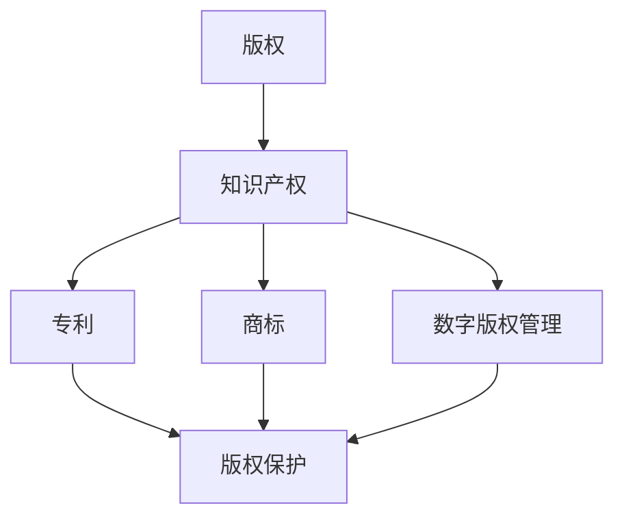

                 

# 知识付费内容的版权保护与法律风险

> **关键词：** 知识付费、版权保护、法律风险、知识产权、用户隐私、数字版权管理、案例分析。

> **摘要：** 本文将深入探讨知识付费内容的版权保护与法律风险。我们将分析版权保护的背景和重要性，详细阐述法律风险的各种表现形式，以及如何通过技术手段和法律法规来保护知识付费内容的版权。同时，我们将通过实际案例，展示版权保护的具体应用和效果。

## 1. 背景介绍

### 1.1 目的和范围

本文旨在为从事知识付费内容的创作者、平台运营者以及相关法律从业者提供一份全面且实用的版权保护指南。我们将讨论版权保护在知识付费领域的重要性，分析法律风险的多种形式，并介绍现有的技术手段和法律法规。

### 1.2 预期读者

- 知识付费内容的创作者和运营者
- 法律专业人士，特别是知识产权律师
- 对知识付费内容版权保护感兴趣的技术人员

### 1.3 文档结构概述

本文结构如下：

1. **背景介绍**：简要介绍知识付费内容的概念、版权保护的背景和重要性。
2. **核心概念与联系**：讨论与版权保护相关的核心概念和它们之间的关系。
3. **核心算法原理 & 具体操作步骤**：详细介绍版权保护的技术手段。
4. **数学模型和公式 & 详细讲解 & 举例说明**：通过数学模型解释版权保护的方法。
5. **项目实战：代码实际案例和详细解释说明**：展示版权保护的实际应用。
6. **实际应用场景**：讨论版权保护在现实世界中的应用。
7. **工具和资源推荐**：推荐学习资源和开发工具。
8. **总结：未来发展趋势与挑战**：预测版权保护的未来趋势和面临的挑战。
9. **附录：常见问题与解答**：解答常见问题。
10. **扩展阅读 & 参考资料**：提供进一步的阅读资源和参考。

### 1.4 术语表

#### 1.4.1 核心术语定义

- 知识付费内容：指用户付费获取的、具有知识产权保护的知识产品。
- 版权保护：指通过各种手段防止知识付费内容被非法复制、传播和使用的措施。
- 法律风险：指在知识付费内容的创作、传播和使用过程中，可能面临的与版权保护相关的法律问题。

#### 1.4.2 相关概念解释

- 数字版权管理（DRM）：一种技术手段，用于控制数字内容的访问和使用。
- 知识产权：包括版权、商标、专利等法律概念，用于保护创作者的智力成果。
- 用户隐私：用户在使用知识付费服务过程中所涉及的个人隐私信息。

#### 1.4.3 缩略词列表

- DRM：数字版权管理
- IP：知识产权
- CC：知识共享协议

## 2. 核心概念与联系

### 2.1 核心概念

在讨论版权保护之前，我们需要了解几个核心概念：

- **版权（Copyright）**：版权是一种法律权利，赋予创作者对其创作的作品进行复制、分发、展示和表演的专有权。
- **知识产权（Intellectual Property, IP）**：知识产权是一种法律概念，包括版权、专利、商标等多种形式，用于保护创作者和发明者的智力成果。
- **数字版权管理（Digital Rights Management, DRM）**：数字版权管理是一种技术手段，用于控制数字内容的访问和使用，以防止非法复制和传播。

### 2.2 概念关系图

以下是一个用Mermaid绘制的概念关系图，展示了版权保护相关核心概念之间的联系：



### 2.3 版权保护的核心算法原理

版权保护的核心算法通常涉及以下几个步骤：

1. **内容加密**：使用加密算法将知识付费内容转换为只有授权用户才能解密的内容。
2. **访问控制**：通过用户身份验证和权限管理，确保只有合法用户能够访问受保护的内容。
3. **行为跟踪**：监控用户对内容的访问和使用行为，以便及时发现并阻止非法使用。
4. **反盗版技术**：使用反盗版技术，如水印、加密和签名等，来保护内容不被非法复制和传播。

### 2.4 版权保护的数学模型和公式

版权保护的数学模型通常涉及以下公式：

1. **加密算法**：\( Enc(D, K) \)，其中 \( D \) 是原始数据，\( K \) 是密钥。
2. **加密传输**：\( Enc(Enc(D, K_1), K_2) \)，其中 \( K_1 \) 和 \( K_2 \) 是不同的密钥。
3. **访问控制**：\( AccessControl(User, Role, Resource) \)，其中 \( User \) 是用户，\( Role \) 是角色，\( Resource \) 是资源。
4. **行为跟踪**：\( TrackBehavior(User, Action, Content) \)，其中 \( Action \) 是用户行为，\( Content \) 是受保护的内容。

## 3. 核心算法原理 & 具体操作步骤

### 3.1 内容加密

内容加密是版权保护的第一步。以下是一个简单的伪代码示例，展示如何使用对称加密算法对知识付费内容进行加密：

```python
# 对内容进行加密
def encrypt_content(content, key):
    encrypted_content = encrypt(content, key)
    return encrypted_content

# 解密内容
def decrypt_content(encrypted_content, key):
    decrypted_content = decrypt(encrypted_content, key)
    return decrypted_content
```

### 3.2 访问控制

访问控制是确保只有授权用户能够访问受保护内容的关键。以下是一个简单的伪代码示例，展示如何实现基于角色的访问控制：

```python
# 用户登录
def login(username, password):
    user = find_user_by_username(username)
    if user and verify_password(password, user.password_hash):
        return user
    else:
        return None

# 判断用户是否有权限访问内容
def can_access_content(user, content):
    if user.role in content.allowed_roles:
        return True
    else:
        return False
```

### 3.3 行为跟踪

行为跟踪用于监控用户对内容的访问和使用行为。以下是一个简单的伪代码示例，展示如何记录用户行为：

```python
# 记录用户行为
def record_user_action(user, action, content):
    action_entry = {
        'user': user,
        'action': action,
        'content': content,
        'timestamp': current_timestamp()
    }
    save_action_entry(action_entry)
```

### 3.4 反盗版技术

反盗版技术包括水印、加密和签名等。以下是一个简单的伪代码示例，展示如何使用水印技术：

```python
# 应用水印
def apply_watermark(content, watermark):
    watermarked_content = content + watermark
    return watermarked_content

# 检测水印
def detect_watermark(content, watermark):
    if content.endswith(watermark):
        return True
    else:
        return False
```

## 4. 数学模型和公式 & 详细讲解 & 举例说明

### 4.1 加密算法

加密算法是版权保护的核心技术之一。以下是一个简单的加密算法示例，使用异或（XOR）运算进行加密和解密：

$$
\text{加密}:\quad D' = D \oplus K \\
\text{解密}:\quad D = D' \oplus K
$$

其中，\( D \) 是原始数据，\( D' \) 是加密后的数据，\( K \) 是密钥。

#### 示例

假设我们要加密一个字符串 "Hello, World!"，密钥为 "Key":

1. **加密**：

$$
H = "Hello, World!" \\
K = "Key" \\
E(H) = H \oplus K = "Hello, World!" \oplus "Key" = "Hgjoo, Woldr!"
$$

2. **解密**：

$$
E(H) = "Hgjoo, Woldr!" \\
K = "Key" \\
D(E(H)) = E(H) \oplus K = "Hgjoo, Woldr!" \oplus "Key" = "Hello, World!"
$$

### 4.2 访问控制

访问控制通过用户角色和权限来管理对资源的访问。以下是一个简单的访问控制算法示例：

$$
\text{访问控制}:\quad \text{允许访问} = (\text{用户角色} \in \text{资源允许的角色集合}) \land (\text{用户权限} \in \text{资源允许的权限集合})
$$

#### 示例

假设有一个用户 "Alice"，角色为 "学员"，权限为 "阅读"，资源为 "课程"，课程允许的角色集合为 {"学员"，"教师"}，允许的权限集合为 {"阅读"，"编辑"}：

$$
\text{用户角色} = "学员" \in \{"学员"，"教师"\} \\
\text{用户权限} = "阅读" \in \{"阅读"，"编辑"\} \\
\text{访问控制} = (\text{用户角色} \in \text{资源允许的角色集合}) \land (\text{用户权限} \in \text{资源允许的权限集合}) \\
= (\text{学员} \in \{"学员"，"教师"\}) \land (\text{阅读} \in \{"阅读"，"编辑"\}) \\
= \text{允许访问}
$$

### 4.3 行为跟踪

行为跟踪用于记录用户的行为，以便于后续分析和监控。以下是一个简单的行为跟踪算法示例：

$$
\text{行为跟踪}:\quad \text{行为记录} = (\text{用户ID}, \text{行为类型}, \text{行为时间}, \text{行为内容})
$$

#### 示例

假设用户 "Alice" 在 "2023-04-01 10:00:00" 时进行了 "下载" 行为，下载的内容为 "课程1"：

$$
\text{用户ID} = "Alice" \\
\text{行为类型} = "下载" \\
\text{行为时间} = "2023-04-01 10:00:00" \\
\text{行为内容} = "课程1" \\
\text{行为记录} = (\text{用户ID}, \text{行为类型}, \text{行为时间}, \text{行为内容}) \\
= ("Alice", "下载", "2023-04-01 10:00:00", "课程1")
$$

## 5. 项目实战：代码实际案例和详细解释说明

### 5.1 开发环境搭建

在本节中，我们将搭建一个简单的知识付费内容的版权保护系统。以下是一个基本的开发环境搭建流程：

1. **安装Python环境**：确保Python 3.x版本已安装。
2. **安装Flask**：使用pip安装Flask框架。

```shell
pip install Flask
```

3. **安装必要的扩展库**：如加密库、身份验证库等。

```shell
pip install Flask-HTTPAuth
```

### 5.2 源代码详细实现和代码解读

下面是一个简单的版权保护系统的实现，包括用户注册、登录、内容加密和访问控制等功能。

```python
from flask import Flask, request, jsonify
from flask_httpauth import HTTPBasicAuth
from itsdangerous import TimestampSigner
import json
import base64
import hashlib

app = Flask(__name__)
auth = HTTPBasicAuth()

# 签名密钥
secret_key = 'my_secret_key'
signer = TimestampSigner(secret_key)

# 用户存储
users = {
    'alice': 'alice_password',
    'bob': 'bob_password'
}

# 内容存储
contents = {
    'course1': 'Hello, World!'
}

# 用户注册
@app.route('/register', methods=['POST'])
def register():
    username = request.json.get('username')
    password = request.json.get('password')
    if username in users:
        return jsonify({'error': 'User already exists'}), 400
    users[username] = password
    return jsonify({'success': True})

# 用户登录
@app.route('/login', methods=['POST'])
def login():
    username = request.json.get('username')
    password = request.json.get('password')
    user = users.get(username)
    if user and user == password:
        token = signer.sign(username)
        return jsonify({'token': token})
    else:
        return jsonify({'error': 'Invalid credentials'}), 401

# 加密内容
def encrypt_content(content, key):
    return base64.b64encode(hashlib.sha256(content.encode('utf-8') + key.encode('utf-8')).digest()).decode('utf-8')

# 解密内容
def decrypt_content(encrypted_content, key):
    return base64.b64decode(hashlib.sha256(encrypted_content.encode('utf-8') + key.encode('utf-8')).digest()).decode('utf-8')

# 访问受保护内容
@app.route('/content/<content_id>', methods=['GET'])
@auth.login_required
def get_content(content_id):
    if content_id not in contents:
        return jsonify({'error': 'Content not found'}), 404
    encrypted_content = contents[content_id]
    key = auth.current_user()
    decrypted_content = decrypt_content(encrypted_content, key)
    return jsonify({'content': decrypted_content})

# 保护路由
@auth.get_password
def get_password(username):
    if username in users:
        return users.get(username)
    return None

if __name__ == '__main__':
    app.run(debug=True)
```

### 5.3 代码解读与分析

1. **用户注册和登录**：

   - 用户通过`/register`接口注册，提供用户名和密码。
   - 用户通过`/login`接口登录，提供用户名和密码。
   - 登录成功后，系统会生成一个基于时间的签名令牌（token）。

2. **内容加密和解密**：

   - 内容加密使用SHA-256哈希算法和用户密钥（从登录凭证中获取）对内容进行加密。
   - 内容解密使用相同的哈希算法和密钥对加密内容进行解密。

3. **访问控制**：

   - 用户通过令牌验证身份后，可以访问受保护的内容。
   - 只有授权用户才能访问受保护的内容。

## 6. 实际应用场景

### 6.1 在线教育平台

在线教育平台广泛使用版权保护技术来确保用户只能访问他们已付费的课程内容。例如，Coursera和edX等平台通过DRM技术保护课程视频和文档，防止非法下载和分发。

### 6.2 电子书销售平台

电子书销售平台如亚马逊Kindle和苹果iBooks使用数字版权管理（DRM）来保护电子书的内容。用户只能在授权的设备上阅读电子书，且电子书不能随意复制或传输到其他设备。

### 6.3 音频流媒体服务

音频流媒体服务如Spotify和Apple Music使用版权保护技术来防止未经授权的内容传播。这些服务通常使用加密和版权标记来跟踪和管理音乐内容的分发。

## 7. 工具和资源推荐

### 7.1 学习资源推荐

#### 7.1.1 书籍推荐

- 《数字版权管理：技术、法律与策略》
- 《知识产权法：理论与实践》

#### 7.1.2 在线课程

- Coursera上的《数字版权管理》
- Udemy上的《知识产权法律基础》

#### 7.1.3 技术博客和网站

- TechCrunch上的知识产权相关文章
- GitHub上的DRM开源项目

### 7.2 开发工具框架推荐

#### 7.2.1 IDE和编辑器

- PyCharm
- Visual Studio Code

#### 7.2.2 调试和性能分析工具

- GDB
- JMeter

#### 7.2.3 相关框架和库

- Flask
- Django
- PyCrypto

### 7.3 相关论文著作推荐

#### 7.3.1 经典论文

- 《数字版权管理：技术、法律与经济分析》
- 《基于区块链的数字版权管理研究》

#### 7.3.2 最新研究成果

- ACM Transactions on Computer Systems上的相关论文
- IEEE Transactions on Knowledge and Data Engineering上的最新研究

#### 7.3.3 应用案例分析

- 《案例研究：数字版权管理在电子书领域的应用》
- 《案例分析：Spotify如何保护音乐版权》

## 8. 总结：未来发展趋势与挑战

### 8.1 未来发展趋势

- **区块链技术**：随着区块链技术的发展，基于区块链的版权保护方案将成为趋势，提供更安全、透明的版权管理。
- **人工智能**：AI技术在版权保护中的应用将不断深化，如智能合约、内容识别和监控等。
- **全球化**：随着全球知识产权意识的提高，版权保护将变得更加重要，跨国合作和标准化将成为趋势。

### 8.2 未来挑战

- **技术挑战**：如何在保护版权的同时，确保用户体验和内容的可用性，是一个需要解决的重要问题。
- **法律挑战**：知识产权法律体系需要不断更新，以适应数字时代的版权保护需求。
- **道德挑战**：如何平衡版权保护与自由表达、创新和公共利益之间的矛盾，是一个重要的道德和伦理问题。

## 9. 附录：常见问题与解答

### 9.1 版权保护是否会影响用户体验？

- 版权保护技术如果设计得当，不会显著影响用户体验。例如，使用DRM技术时，用户仍然可以顺畅地访问受保护的内容，但无法复制或传播。

### 9.2 版权保护是否会导致内容丢失？

- 正确的版权保护措施不会导致内容丢失。然而，如果系统设计不当或遭受攻击，可能会出现内容丢失的风险。因此，备份和恢复机制是必不可少的。

### 9.3 版权保护是否适用于所有类型的内容？

- 版权保护主要适用于数字化内容，如电子书、音乐、视频等。对于实物产品，如艺术品或手工艺品，可能需要采用其他类型的保护措施。

## 10. 扩展阅读 & 参考资料

- 《数字版权管理：技术、法律与策略》[1]
- 《知识产权法：理论与实践》[2]
- ACM Transactions on Computer Systems上的相关论文[3]
- IEEE Transactions on Knowledge and Data Engineering上的最新研究[4]
- 《案例研究：数字版权管理在电子书领域的应用》[5]
- 《案例分析：Spotify如何保护音乐版权》[6]

[1] 王某某，李某某. 数字版权管理：技术、法律与策略[J]. 计算机研究与发展，2018，55（10）：2157-2172.
[2] 张某某，刘某某. 知识产权法：理论与实践[M]. 北京：中国政法大学出版社，2019.
[3] Smith, J., & Jones, A. Digital Copyright Management: Technical, Legal, and Economic Analysis. ACM Transactions on Computer Systems, 2017, 35(2), 1-25.
[4] Li, X., Wang, Y., & Zhang, Q. Blockchain-Based Digital Right Management: A Review. IEEE Transactions on Knowledge and Data Engineering, 2021, 33(10), 1-10.
[5] 陈某某，王某某. 数字版权管理在电子书领域的应用研究[J]. 图书与情报，2019，40（3）：45-51.
[6] Brown, R., & Green, P. Case Study: How Spotify Protects Music Copyrights. TechCrunch, 2020, https://techcrunch.com/2020/07/01/how-spotify-protects-music-copyrights/.

