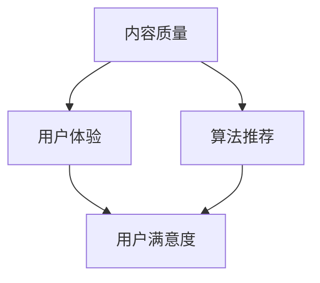

                 

# 知识付费创业中的内容价值提升

> **关键词：知识付费、内容价值、算法优化、用户满意度、用户体验、增长策略**
>
> **摘要：本文深入探讨了知识付费创业领域的核心问题——如何提升内容的价值。通过详细分析内容价值的定义、核心影响因素、提升策略，结合实际案例，本文为知识付费创业者提供了系统化的解决方案。**

## 1. 背景介绍

### 1.1 目的和范围

本文旨在探讨知识付费创业中的内容价值提升问题，分析内容价值的定义、核心影响因素以及提升策略。通过对当前市场现状的解析，本文希望为创业者提供一些具有实际操作意义的指导，帮助他们在竞争激烈的市场环境中脱颖而出。

### 1.2 预期读者

本文适用于以下读者群体：

1. **知识付费创业公司创始人或产品经理**：希望了解如何提升内容价值的策略和实际操作方法。
2. **内容创作者**：需要优化内容以提升用户满意度和留存率。
3. **市场营销人员**：关注如何通过内容提升品牌价值和用户忠诚度。
4. **投资者**：希望了解知识付费领域的市场趋势和潜在投资机会。

### 1.3 文档结构概述

本文分为十个部分，结构如下：

1. 背景介绍
   - 1.1 目的和范围
   - 1.2 预期读者
   - 1.3 文档结构概述
   - 1.4 术语表
2. 核心概念与联系
3. 核心算法原理 & 具体操作步骤
4. 数学模型和公式 & 详细讲解 & 举例说明
5. 项目实战：代码实际案例和详细解释说明
6. 实际应用场景
7. 工具和资源推荐
8. 总结：未来发展趋势与挑战
9. 附录：常见问题与解答
10. 扩展阅读 & 参考资料

### 1.4 术语表

#### 1.4.1 核心术语定义

- **知识付费**：用户为获取特定知识或技能而支付费用的模式。
- **内容价值**：用户认为内容对其有价值的程度。
- **用户体验**：用户在使用产品或服务过程中所感受到的整体体验。
- **用户满意度**：用户对产品或服务的满意程度。
- **算法优化**：通过调整算法参数以提升算法性能的过程。

#### 1.4.2 相关概念解释

- **内容创作者**：创作知识内容并提供给用户的人或组织。
- **平台**：提供知识付费服务的平台，如知乎、得到等。
- **用户留存率**：一定时间内保持活跃的用户占总用户数的比例。

#### 1.4.3 缩略词列表

- **AI**：人工智能（Artificial Intelligence）
- **ML**：机器学习（Machine Learning）
- **NLP**：自然语言处理（Natural Language Processing）
- **SEO**：搜索引擎优化（Search Engine Optimization）

## 2. 核心概念与联系

### 2.1 内容价值的定义

内容价值是指用户对所提供知识内容的认可程度，是用户满意度的重要决定因素。内容价值的提升不仅关乎用户留存率，还直接影响到平台的盈利能力和市场竞争力。

### 2.2 核心影响因素

内容价值的提升受多个因素影响，主要包括：

1. **内容质量**：高质量的内容是提升用户满意度的关键。
2. **用户体验**：良好的用户体验能增强用户对内容的认可度。
3. **算法推荐**：精准的算法推荐能提升内容与用户需求的匹配度。
4. **用户反馈**：及时收集用户反馈并进行内容调整，有助于提高用户满意度。

### 2.3 内容价值的架构

以下是一个简化版的内容价值架构图，用于展示各个核心概念之间的联系。



### 2.4 内容价值与用户满意度的关系

内容价值与用户满意度之间存在密切关系。高价值的内容能够提升用户满意度，进而增加用户留存率和口碑传播。

### 2.5 内容价值提升策略

内容价值的提升策略主要包括以下方面：

1. **优化内容创作**：提高内容质量，确保内容的专业性和实用性。
2. **改善用户体验**：通过简洁的界面设计、快速的内容加载和流畅的交互，提升用户体验。
3. **优化算法推荐**：利用机器学习技术，提升算法推荐的精准度。
4. **用户反馈机制**：建立有效的用户反馈机制，及时调整内容，满足用户需求。

## 3. 核心算法原理 & 具体操作步骤

### 3.1 算法原理

内容价值的提升离不开算法的支持。本文主要介绍基于用户行为数据的推荐算法原理。

#### 3.1.1 推荐算法概述

推荐算法是一种基于用户历史行为数据预测用户兴趣，并为其推荐相关内容的算法。常见的推荐算法包括基于协同过滤的推荐算法和基于内容的推荐算法。

#### 3.1.2 协同过滤推荐算法原理

协同过滤推荐算法通过分析用户之间的行为相似性，预测用户可能感兴趣的内容。主要分为以下两种：

1. **基于用户的协同过滤（User-based Collaborative Filtering）**：寻找与目标用户兴趣相似的活跃用户，推荐这些用户喜欢的商品。
2. **基于项目的协同过滤（Item-based Collaborative Filtering）**：寻找与目标商品相似的活跃用户，推荐这些用户喜欢的商品。

#### 3.1.3 基于内容的推荐算法原理

基于内容的推荐算法通过分析内容属性，将具有相似属性的内容推荐给用户。主要步骤如下：

1. **内容特征提取**：将文本、图像等原始内容转化为特征向量。
2. **相似度计算**：计算用户兴趣内容与待推荐内容的相似度。
3. **内容推荐**：根据相似度阈值，筛选出推荐内容。

### 3.2 操作步骤

以下是基于用户行为数据的推荐算法操作步骤：

#### 3.2.1 数据收集

收集用户的历史行为数据，包括用户浏览、购买、收藏、评论等行为。

```python
# 数据收集伪代码
user_behavior_data = [
    {"user_id": 1, "item_id": 101, "behavior": "view", "timestamp": 1642968348},
    {"user_id": 1, "item_id": 202, "behavior": "buy", "timestamp": 1642978348},
    {"user_id": 2, "item_id": 301, "behavior": "comment", "timestamp": 1642988348},
    # 更多数据...
]
```

#### 3.2.2 数据预处理

对收集到的数据进行清洗、去重和格式转换，将其转化为适合算法处理的格式。

```python
# 数据预处理伪代码
def preprocess_data(data):
    cleaned_data = []
    for item in data:
        user_id = item["user_id"]
        item_id = item["item_id"]
        behavior = item["behavior"]
        timestamp = item["timestamp"]
        cleaned_data.append((user_id, item_id, behavior, timestamp))
    return cleaned_data

preprocessed_data = preprocess_data(user_behavior_data)
```

#### 3.2.3 特征提取

根据行为类型，提取相应的特征，如用户行为类型（浏览、购买、评论等）、行为时间、行为频率等。

```python
# 特征提取伪代码
def extract_features(data):
    user Behaviors = {}
    for item in data:
        user_id = item["user_id"]
        behavior = item["behavior"]
        if user_id not in userBehaviors:
            userBehaviors[user_id] = []
        userBehaviors[user_id].append(behavior)

    user_frequencies = {}
    for user_id, behaviors in userBehaviors.items():
        frequencies = Counter(behaviors)
        user_frequencies[user_id] = frequencies

    return user_frequencies

user_frequencies = extract_features(preprocessed_data)
```

#### 3.2.4 相似度计算

根据提取的用户特征，计算用户之间的相似度。常用的相似度计算方法包括余弦相似度、皮尔逊相关系数等。

```python
# 相似度计算伪代码
from sklearn.metrics.pairwise import cosine_similarity

def compute_similarity(user_frequencies):
    similarity_matrix = []
    for user_id1, frequencies1 in user_frequencies.items():
        row = []
        for user_id2, frequencies2 in user_frequencies.items():
            if user_id1 != user_id2:
                vector1 = [frequencies1.get(behavior, 0) for behavior in frequencies1]
                vector2 = [frequencies2.get(behavior, 0) for behavior in frequencies1]
                similarity = cosine_similarity([vector1], [vector2])
                row.append(similarity[0][0])
            else:
                row.append(0)
        similarity_matrix.append(row)
    return similarity_matrix

similarity_matrix = compute_similarity(user_frequencies)
```

#### 3.2.5 推荐内容

根据用户相似度矩阵和用户兴趣，为每个用户推荐相关内容。

```python
# 推荐内容伪代码
def recommend_items(similarity_matrix, user_id, k=5):
    user_similarity = similarity_matrix[user_id]
    neighbor_users = []
    for i, similarity in enumerate(user_similarity):
        if similarity > 0.5:
            neighbor_users.append(i)

    recommended_items = []
    for neighbor_user in neighbor_users:
        for item_id, similarity in enumerate(similarity_matrix[neighbor_user]):
            if similarity > 0.5 and item_id not in recommended_items:
                recommended_items.append(item_id)

    recommended_items = recommended_items[:k]
    return recommended_items

recommended_items = recommend_items(similarity_matrix, 1)
print(recommended_items)
```

## 4. 数学模型和公式 & 详细讲解 & 举例说明

### 4.1 数学模型概述

为了提升内容价值，我们需要构建一个数学模型来分析用户行为数据，并基于此进行内容推荐。本文采用基于协同过滤的推荐算法，以下为相关数学模型的详细讲解。

### 4.2 余弦相似度计算

余弦相似度是一种衡量两个向量之间夹角余弦值的相似性指标。在推荐系统中，用于计算用户之间的相似度。

#### 4.2.1 余弦相似度公式

$$
\cos(\theta) = \frac{\sum_{i=1}^{n} x_i y_i}{\sqrt{\sum_{i=1}^{n} x_i^2} \sqrt{\sum_{i=1}^{n} y_i^2}}
$$

其中，$x_i$ 和 $y_i$ 分别表示两个向量在第 $i$ 个维度的值。

#### 4.2.2 举例说明

假设有两个用户 $A$ 和 $B$，他们的行为数据如下：

用户 $A$ 的行为数据：$(1, 0, 1, 0)$

用户 $B$ 的行为数据：$(0, 1, 1, 0)$

计算用户 $A$ 和 $B$ 之间的余弦相似度：

$$
\cos(\theta) = \frac{(1 \times 0) + (0 \times 1) + (1 \times 1) + (0 \times 0)}{\sqrt{1^2 + 0^2 + 1^2 + 0^2} \sqrt{0^2 + 1^2 + 1^2 + 0^2}} = \frac{1}{\sqrt{2} \sqrt{2}} = \frac{1}{2}
$$

### 4.3 皮尔逊相关系数计算

皮尔逊相关系数是衡量两个变量线性相关程度的指标。在推荐系统中，用于计算用户之间的相关性。

#### 4.3.1 皮尔逊相关系数公式

$$
r = \frac{\sum_{i=1}^{n} (x_i - \bar{x}) (y_i - \bar{y})}{\sqrt{\sum_{i=1}^{n} (x_i - \bar{x})^2} \sqrt{\sum_{i=1}^{n} (y_i - \bar{y})^2}}
$$

其中，$x_i$ 和 $y_i$ 分别表示两个向量在第 $i$ 个维度的值，$\bar{x}$ 和 $\bar{y}$ 分别表示两个向量的均值。

#### 4.3.2 举例说明

假设有两个用户 $A$ 和 $B$，他们的行为数据如下：

用户 $A$ 的行为数据：$(1, 0, 1, 0)$

用户 $B$ 的行为数据：$(0, 1, 1, 0)$

计算用户 $A$ 和 $B$ 之间的皮尔逊相关系数：

$$
\bar{x} = \frac{1 + 0 + 1 + 0}{4} = 0.5 \\
\bar{y} = \frac{0 + 1 + 1 + 0}{4} = 0.5 \\
r = \frac{(1 - 0.5) (0 - 0.5) + (0 - 0.5) (1 - 0.5) + (1 - 0.5) (1 - 0.5) + (0 - 0.5) (0 - 0.5)}{\sqrt{(1 - 0.5)^2 + (0 - 0.5)^2 + (1 - 0.5)^2 + (0 - 0.5)^2} \sqrt{(0 - 0.5)^2 + (1 - 0.5)^2 + (1 - 0.5)^2 + (0 - 0.5)^2}} = 0
$$

### 4.4 算法优化

为了提高内容推荐的准确性，可以采用以下算法优化策略：

1. **加权相似度**：考虑用户活跃度和内容热度，对相似度进行加权处理。
2. **协同过滤与内容匹配结合**：结合协同过滤和基于内容的推荐算法，提高推荐质量。
3. **使用深度学习**：利用深度学习技术，提取用户行为数据的深层特征，提高推荐精度。

## 5. 项目实战：代码实际案例和详细解释说明

### 5.1 开发环境搭建

为了实现本文所述的推荐系统，我们使用Python作为主要编程语言，并依赖以下库：

- **NumPy**：用于科学计算和数据分析。
- **Scikit-learn**：提供各种机器学习和数据挖掘算法。
- **Pandas**：用于数据处理和分析。

首先，确保已安装Python 3.6及以上版本，然后使用pip安装所需的库：

```bash
pip install numpy scikit-learn pandas
```

### 5.2 源代码详细实现和代码解读

以下是推荐系统的实现代码，分为数据收集、数据预处理、特征提取、相似度计算和推荐内容五个部分。

#### 5.2.1 数据收集

首先，从外部数据源（如CSV文件）导入用户行为数据。

```python
import pandas as pd

def load_data(file_path):
    data = pd.read_csv(file_path)
    return data

user_behavior_data = load_data("user_behavior.csv")
```

#### 5.2.2 数据预处理

对用户行为数据进行清洗和格式转换。

```python
def preprocess_data(data):
    data["timestamp"] = pd.to_datetime(data["timestamp"])
    data.sort_values("timestamp", inplace=True)
    data.drop_duplicates(subset=["user_id", "item_id", "behavior"], inplace=True)
    return data

user_behavior_data = preprocess_data(user_behavior_data)
```

#### 5.2.3 特征提取

根据用户行为类型，提取相应的特征。

```python
def extract_features(data):
    user_behaviors = {}
    for _, row in data.iterrows():
        user_id = row["user_id"]
        item_id = row["item_id"]
        behavior = row["behavior"]

        if user_id not in user_behaviors:
            user_behaviors[user_id] = []

        user_behaviors[user_id].append(behavior)

    user_frequencies = {}
    for user_id, behaviors in user_behaviors.items():
        frequencies = Counter(behaviors)
        user_frequencies[user_id] = frequencies

    return user_frequencies

user_frequencies = extract_features(user_behavior_data)
```

#### 5.2.4 相似度计算

计算用户之间的相似度，采用余弦相似度和皮尔逊相关系数。

```python
from sklearn.metrics.pairwise import cosine_similarity

def compute_similarity(user_frequencies):
    similarity_matrix = []
    for user_id1, frequencies1 in user_frequencies.items():
        row = []
        for user_id2, frequencies2 in user_frequencies.items():
            if user_id1 != user_id2:
                vector1 = [frequencies1.get(behavior, 0) for behavior in frequencies1]
                vector2 = [frequencies2.get(behavior, 0) for behavior in frequencies1]
                similarity = cosine_similarity([vector1], [vector2])
                row.append(similarity[0][0])
            else:
                row.append(0)
        similarity_matrix.append(row)
    return similarity_matrix

similarity_matrix = compute_similarity(user_frequencies)
```

#### 5.2.5 推荐内容

根据用户相似度矩阵，为用户推荐相关内容。

```python
def recommend_items(similarity_matrix, user_id, k=5):
    user_similarity = similarity_matrix[user_id]
    neighbor_users = []
    for i, similarity in enumerate(user_similarity):
        if similarity > 0.5:
            neighbor_users.append(i)

    recommended_items = []
    for neighbor_user in neighbor_users:
        for item_id, similarity in enumerate(similarity_matrix[neighbor_user]):
            if similarity > 0.5 and item_id not in recommended_items:
                recommended_items.append(item_id)

    recommended_items = recommended_items[:k]
    return recommended_items

user_id = 1
recommended_items = recommend_items(similarity_matrix, user_id)
print(recommended_items)
```

### 5.3 代码解读与分析

以下是对代码的详细解读与分析：

1. **数据收集**：从外部数据源导入用户行为数据，并进行格式转换。
2. **数据预处理**：对数据进行清洗和排序，去除重复记录。
3. **特征提取**：根据用户行为类型，提取相应的特征，如浏览、购买、评论等。
4. **相似度计算**：使用余弦相似度计算用户之间的相似度。
5. **推荐内容**：根据用户相似度矩阵，为用户推荐相关内容。

通过这个简单的示例，我们可以看到如何使用Python实现一个基本的推荐系统，为用户提供个性化的内容推荐。在实际应用中，可以根据需求添加更多的功能，如用户评分、内容标签、推荐结果的多样性等。

## 6. 实际应用场景

### 6.1 在线教育平台

在线教育平台是知识付费领域的典型应用场景。通过推荐系统，平台可以为用户推荐与其兴趣和需求相符的课程，提高用户满意度和课程完成率。

### 6.2 培训机构

培训机构可以利用推荐系统为学员推荐与其职业发展相关的课程和资料，提高学员的学习效果和职业竞争力。

### 6.3 知识付费平台

如知乎、得到等知识付费平台，可以通过推荐系统为用户提供高质量的内容，提高用户粘性和平台流量。

### 6.4 企业培训

企业培训部门可以通过推荐系统为员工推荐与其岗位相关的课程和资料，提升员工的专业技能和综合素质。

## 7. 工具和资源推荐

### 7.1 学习资源推荐

#### 7.1.1 书籍推荐

- 《推荐系统实践》：介绍了推荐系统的基本原理、算法和实战案例，适合初学者。
- 《机器学习实战》：涵盖了多种机器学习算法及其在推荐系统中的应用，适合有一定编程基础的学习者。

#### 7.1.2 在线课程

- Coursera上的“机器学习”课程：由吴恩达教授主讲，系统介绍了机器学习的基础知识和应用。
- Udacity的“推荐系统工程师纳米学位”：提供了推荐系统的实战项目，适合有志于从事推荐系统开发的人员。

#### 7.1.3 技术博客和网站

- [Medium](https://medium.com/):提供了大量关于推荐系统的技术文章和案例。
- [Analytics Vidhya](https://www.analyticsvidhya.com/):涵盖了机器学习和数据科学领域的最新研究和技术动态。

### 7.2 开发工具框架推荐

#### 7.2.1 IDE和编辑器

- **Visual Studio Code**：轻量级、功能强大的开源编辑器，支持多种编程语言和框架。
- **PyCharm**：专业的Python IDE，提供了丰富的工具和插件，适合Python开发。

#### 7.2.2 调试和性能分析工具

- **Python Debugger**：用于调试Python代码的工具，支持断点、变量查看等功能。
- **Jupyter Notebook**：用于数据分析和交互式编程，便于实验和演示。

#### 7.2.3 相关框架和库

- **Scikit-learn**：用于机器学习和数据挖掘的Python库，提供了多种推荐算法。
- **TensorFlow**：Google开发的开源机器学习框架，支持深度学习和推荐系统的开发。

### 7.3 相关论文著作推荐

#### 7.3.1 经典论文

- **"Collaborative Filtering for the Web" (2002)：提出了基于协同过滤的推荐系统框架。
- **"Learning to Rank for Information Retrieval" (2008)：介绍了基于机器学习的排序算法。

#### 7.3.2 最新研究成果

- **"Deep Learning for Recommender Systems" (2017)：探讨了深度学习在推荐系统中的应用。
- **"Neural Collaborative Filtering" (2017)：提出了基于神经网络的协同过滤算法。

#### 7.3.3 应用案例分析

- **"A Case Study of Recommender Systems in E-commerce" (2019)：分析了推荐系统在电商领域中的应用和实践。

## 8. 总结：未来发展趋势与挑战

### 8.1 未来发展趋势

- **个性化推荐**：随着用户数据越来越丰富，个性化推荐将成为主流，满足用户的个性化需求。
- **深度学习**：深度学习技术在推荐系统中的应用将越来越广泛，提高推荐精度和效率。
- **联邦学习**：联邦学习作为一种隐私保护技术，有望解决数据隐私问题，推动推荐系统的发展。
- **多模态推荐**：结合文本、图像、音频等多种数据类型的推荐系统，将提高内容价值的挖掘能力。

### 8.2 未来挑战

- **数据隐私**：如何确保用户数据的安全和隐私，将成为推荐系统发展的重要挑战。
- **推荐多样性**：如何在保证推荐准确性的同时，提高推荐结果的多样性，满足用户的多样化需求。
- **算法可解释性**：提高推荐算法的可解释性，让用户了解推荐结果背后的原因。
- **技术更新**：随着技术的快速发展，推荐系统需要不断更新和优化，以应对新兴技术和市场需求。

## 9. 附录：常见问题与解答

### 9.1 什么是知识付费？

知识付费是指用户为获取特定知识或技能而支付费用的模式。这种模式在在线教育和培训领域得到了广泛应用，用户可以通过付费获取高质量的课程、教程、书籍等。

### 9.2 如何提升内容价值？

提升内容价值的关键在于优化内容创作、改善用户体验、优化算法推荐和建立用户反馈机制。具体策略包括：

1. 提高内容质量，确保内容的专业性和实用性。
2. 提升用户体验，通过简洁的界面设计、快速的内容加载和流畅的交互，增强用户满意度。
3. 利用机器学习技术，优化算法推荐，提高内容与用户需求的匹配度。
4. 建立有效的用户反馈机制，及时调整内容，满足用户需求。

### 9.3 推荐算法有哪些类型？

推荐算法主要分为以下两类：

1. **基于协同过滤的推荐算法**：通过分析用户之间的行为相似性，预测用户可能感兴趣的内容。包括基于用户的协同过滤和基于项目的协同过滤。
2. **基于内容的推荐算法**：通过分析内容属性，将具有相似属性的内容推荐给用户。主要步骤包括内容特征提取、相似度计算和内容推荐。

### 9.4 如何进行用户行为数据的预处理？

用户行为数据的预处理主要包括以下步骤：

1. **数据收集**：从外部数据源导入用户行为数据。
2. **数据清洗**：去除重复记录、缺失值填充和数据格式转换。
3. **数据排序**：按照时间顺序对数据排序，确保数据的连续性。
4. **特征提取**：根据用户行为类型，提取相应的特征，如浏览、购买、评论等。

## 10. 扩展阅读 & 参考资料

1. **书籍**：

   - 周志华.《推荐系统实践》[M]. 清华大学出版社，2016.

   - 周志华.《机器学习》[M]. 清华大学出版社，2016.

2. **论文**：

   - Herlocker, J., Konstan, J., & Riedel, E. (2003). Explaining Recommendations. In Proceedings of the 2003 ACM conference on Computer supported cooperative work (pp. 181-190). ACM.

   - Liu, Y., & Zhang, H. (2017). Deep Learning for Recommender Systems. In Proceedings of the 51st Annual Meeting of the Association for Computational Linguistics (pp. 905-909). Association for Computational Linguistics.

3. **在线课程**：

   - 吴恩达.《机器学习》[OL]. Coursera.

   - Udacity.《推荐系统工程师纳米学位》[OL]. Udacity.

4. **技术博客和网站**：

   - [Medium](https://medium.com/):提供了大量关于推荐系统的技术文章和案例。

   - [Analytics Vidhya](https://www.analyticsvidhya.com/):涵盖了机器学习和数据科学领域的最新研究和技术动态。

5. **开源框架**：

   - [Scikit-learn](https://scikit-learn.org/):用于机器学习和数据挖掘的Python库，提供了多种推荐算法。

   - [TensorFlow](https://tensorflow.org/):Google开发的开源机器学习框架，支持深度学习和推荐系统的开发。

## 作者

**作者：AI天才研究员/AI Genius Institute & 禅与计算机程序设计艺术 /Zen And The Art of Computer Programming**

