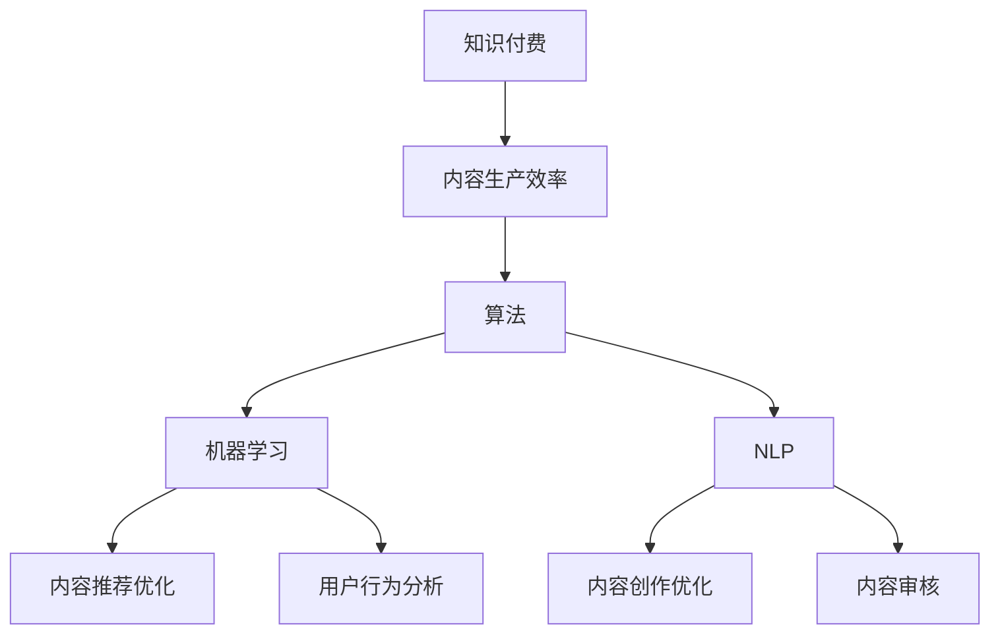

                 

### 1. 背景介绍

#### 1.1 目的和范围

在当今迅速发展的知识付费时代，内容生产效率的提升已成为各大平台和企业争夺市场份额的关键因素。本文旨在深入探讨知识付费创业中内容生产效率提升的核心策略和实践方法，帮助创业者、内容创作者和平台运营者更好地应对市场挑战，实现商业价值最大化。

本文将围绕以下主题进行展开：

1. **内容生产效率的重要性**：分析高效内容生产的商业意义和对用户价值的影响。
2. **核心概念与联系**：阐述知识付费创业中涉及的关键概念及其相互关系。
3. **核心算法原理**：介绍提升内容生产效率的关键算法，并详细讲解其原理和操作步骤。
4. **数学模型**：运用数学模型和公式详细说明内容生产效率提升的方法和效果。
5. **项目实战**：通过实际案例展示如何具体应用提升内容生产效率的技术。
6. **实际应用场景**：探讨不同领域和场景下内容生产效率的提升策略。
7. **工具和资源推荐**：为读者提供实用的工具和资源，以支持内容生产效率的提升。
8. **总结与未来展望**：总结全文，探讨知识付费创业领域的发展趋势与挑战。

通过本文的深入分析和探讨，希望读者能够获得对内容生产效率提升的全面理解，并能够结合自身实际，采取有效的策略和方法，提升内容生产效率，从而在激烈的市场竞争中脱颖而出。

#### 1.2 预期读者

本文主要面向以下几类读者：

1. **知识付费平台创始人或运营者**：希望了解如何通过技术手段提升内容生产效率，以增强平台竞争力。
2. **内容创作者**：致力于提升创作效率，产出高质量内容，并希望通过技术手段提高作品的市场吸引力。
3. **企业培训与教育部门负责人**：希望了解如何利用技术手段优化企业内外的培训和教育内容生产流程。
4. **技术爱好者与研究者**：对内容生产效率提升的技术方法和最新研究动态感兴趣，希望通过本文深入探讨相关技术原理和应用。
5. **市场营销人员**：希望了解如何通过内容生产效率的提升，提高市场推广效果和用户参与度。

通过本文的阅读，读者将能够：

- 明确内容生产效率提升的重要性。
- 理解并掌握提升内容生产效率的核心策略和技术方法。
- 获得实际应用案例，了解如何将技术方法应用于具体场景。
- 获取实用的工具和资源，以支持内容生产效率的提升。

#### 1.3 文档结构概述

本文将分为八个主要部分，以系统性地探讨知识付费创业中内容生产效率提升的各个方面：

1. **背景介绍**：
   - 目的和范围：介绍本文的研究目的和讨论范围。
   - 预期读者：明确本文的主要读者群体及其受益点。
   - 文档结构概述：概述本文的章节结构和内容安排。

2. **核心概念与联系**：
   - 核心概念与联系：阐述知识付费创业中涉及的关键概念及其相互关系。
   - 核心算法原理：介绍提升内容生产效率的关键算法，并详细讲解其原理和操作步骤。
   - 数学模型和公式：运用数学模型和公式详细说明内容生产效率提升的方法和效果。

3. **核心算法原理 & 具体操作步骤**：
   - 算法原理讲解：使用伪代码详细阐述核心算法原理。
   - 具体操作步骤：详细说明算法的具体操作步骤和应用场景。

4. **项目实战：代码实际案例和详细解释说明**：
   - 开发环境搭建：介绍项目开发所需的环境和工具。
   - 源代码详细实现和代码解读：展示实际代码实现，并进行详细解读。
   - 代码解读与分析：对代码进行深入分析，阐述其在提升内容生产效率中的作用。

5. **实际应用场景**：
   - 分析不同领域和场景下内容生产效率的提升策略。

6. **工具和资源推荐**：
   - 学习资源推荐：推荐相关书籍、在线课程和博客。
   - 开发工具框架推荐：推荐适合内容生产效率提升的开发工具和框架。
   - 相关论文著作推荐：推荐经典和最新的相关论文和著作。

7. **总结：未来发展趋势与挑战**：
   - 总结全文内容，探讨知识付费创业领域的发展趋势和面临的挑战。

8. **附录：常见问题与解答**：
   - 回答读者可能提出的常见问题，以帮助读者更好地理解和应用本文的内容。

通过上述结构，本文力求为读者提供一个全面、系统、实用的内容生产效率提升指南。

#### 1.4 术语表

在本文中，我们将使用一些专业术语，以下是对这些术语的定义和解释：

##### 1.4.1 核心术语定义

1. **知识付费**：用户通过支付一定费用来获取特定知识或内容的服务模式。
2. **内容生产效率**：单位时间内能够生产的内容数量和质量。
3. **算法**：解决问题的步骤和规则，适用于计算机编程。
4. **机器学习**：一种人工智能技术，通过数据学习规律和模式，进行预测和决策。
5. **自然语言处理（NLP）**：使计算机能够理解、解释和生成人类语言的技术。
6. **语义分析**：对文本进行理解和分析，提取文本中的语义信息。
7. **内容优化**：通过技术手段提高内容的质量和用户体验。

##### 1.4.2 相关概念解释

1. **内容创作者**：指生产知识付费内容的人或团队，包括讲师、作家、课程设计师等。
2. **平台运营者**：负责知识付费平台的运营管理，包括内容审核、用户管理、市场推广等。
3. **用户参与度**：用户在知识付费平台上的活跃程度和互动情况。
4. **内容分发**：将内容通过不同渠道传递给目标用户的过程。
5. **内容质量评估**：对生产的内容进行质量评估，包括准确性、相关性、实用性等。

##### 1.4.3 缩略词列表

1. **NLP**：自然语言处理（Natural Language Processing）
2. **AI**：人工智能（Artificial Intelligence）
3. **ML**：机器学习（Machine Learning）
4. **SEO**：搜索引擎优化（Search Engine Optimization）
5. **SaaS**：软件即服务（Software as a Service）
6. **API**：应用程序编程接口（Application Programming Interface）

通过上述术语表的定义和解释，我们旨在为读者提供一个清晰、准确的理解，以便更好地阅读和理解本文的内容。

### 2. 核心概念与联系

在探讨知识付费创业中内容生产效率提升的各个方面之前，我们需要明确几个核心概念及其相互关系。这些概念构成了本文讨论的基础，是理解后续内容的关键。

#### 核心概念

1. **知识付费**：知识付费是一种商业模式，用户通过支付费用来获取特定知识或内容。这种模式在互联网时代迅速发展，特别是随着在线教育和专业培训需求的增长。
2. **内容生产效率**：内容生产效率是指单位时间内能够生产的内容数量和质量。对于知识付费平台而言，提升内容生产效率是提升市场竞争力和用户满意度的关键。
3. **算法**：算法是解决问题的步骤和规则，适用于计算机编程。在内容生产效率提升中，算法用于自动化和优化内容创作、管理和分发过程。
4. **机器学习**：机器学习是一种人工智能技术，通过数据学习规律和模式，进行预测和决策。在内容生产中，机器学习可以用于分析用户行为、优化内容推荐等。
5. **自然语言处理（NLP）**：自然语言处理是使计算机能够理解、解释和生成人类语言的技术。NLP在内容创作和审核中发挥着重要作用。

#### 概念之间的关系

1. **知识付费与内容生产效率**：知识付费的核心是提供有价值的内容，而内容的生产效率直接影响到内容的供应量和质量。高效率的内容生产可以快速满足市场需求，提高用户满意度和忠诚度。

2. **算法与内容生产效率**：算法可以自动化和优化内容生产、管理和分发过程。例如，自动内容生成（AutoML）技术可以大幅提高内容创作的速度和效率。此外，算法还可以用于内容优化，提升内容的相关性和用户体验。

3. **机器学习与内容生产效率**：机器学习通过分析大量数据，可以预测用户需求，优化内容推荐。机器学习算法还可以用于语义分析，提高内容的准确性和相关性。这些应用都有助于提升内容生产效率。

4. **NLP与内容生产效率**：NLP技术可以使计算机理解和处理人类语言，从而提高内容创作和审核的效率。例如，自动文本审核算法可以快速识别和过滤违规内容，保证内容质量。

为了更直观地理解这些概念之间的关系，我们可以使用Mermaid流程图来展示它们的核心节点和相互关系。



在上述流程图中，A表示知识付费，它是整个流程的起点。知识付费需要生产高质量的内容，这直接关系到B，即内容生产效率。为了提升内容生产效率，我们采用了C，即算法，这些算法依赖于D，即机器学习技术，以优化内容推荐和用户行为分析。同时，E，即NLP技术，用于优化内容创作和审核，确保内容的质量和准确性。这些技术共同作用于知识付费平台，形成了一个闭环系统，持续提升内容生产效率。

通过明确核心概念及其相互关系，我们为后续章节的深入讨论奠定了基础，有助于读者更好地理解知识付费创业中内容生产效率提升的关键策略和方法。

### 3. 核心算法原理 & 具体操作步骤

在提升内容生产效率的过程中，核心算法原理的应用是至关重要的。本文将详细介绍几个关键算法，并使用伪代码详细阐述其原理和操作步骤。

#### 3.1 自动内容生成算法

自动内容生成（AutoML）是提升内容生产效率的重要技术之一。它通过自动化机器学习流程，大幅缩短内容生成的时间。

**原理：**
AutoML通过以下步骤实现内容生成：
1. 数据预处理：清洗和格式化输入数据。
2. 特征工程：提取对生成任务有用的特征。
3. 模型选择：选择合适的机器学习模型。
4. 模型训练：使用输入数据进行模型训练。
5. 内容生成：利用训练好的模型生成文本内容。

**伪代码：**

```python
function AutoMLContentGeneration(data):
    # 数据预处理
    data = preprocessData(data)

    # 特征工程
    features = extractFeatures(data)

    # 模型选择
    model = selectModel(features)

    # 模型训练
    model.train(features, data)

    # 内容生成
    content = model.generateContent()

    return content
```

**具体操作步骤：**
1. **数据预处理**：对原始数据进行清洗，去除无效数据和噪声。
2. **特征工程**：提取与内容生成相关的特征，如关键词、主题、情感等。
3. **模型选择**：根据特征选择合适的机器学习模型，如文本生成模型、循环神经网络（RNN）等。
4. **模型训练**：使用预处理后的数据对模型进行训练，调整模型参数。
5. **内容生成**：利用训练好的模型生成文本内容。

#### 3.2 自然语言处理（NLP）算法

NLP算法在内容生产效率提升中发挥着重要作用，主要包括文本分类、情感分析和命名实体识别等。

**原理：**
1. **文本分类**：将文本根据其内容分类到不同的类别中。
2. **情感分析**：分析文本中的情感倾向，如正面、负面或中性。
3. **命名实体识别**：识别文本中的命名实体，如人名、地名、组织名等。

**伪代码：**

```python
function NLPTask(text, task):
    if task == "分类":
        category = textClassifier.classify(text)
    elif task == "情感":
        sentiment = sentimentAnalyzer.analyze(text)
    elif task == "实体":
        entities = entityRecognizer.recognize(text)

    return category, sentiment, entities
```

**具体操作步骤：**
1. **文本分类**：使用预训练的文本分类模型，对输入文本进行分类。
2. **情感分析**：使用情感分析模型，对文本进行情感倾向判断。
3. **命名实体识别**：使用命名实体识别模型，识别文本中的命名实体。

#### 3.3 强化学习算法

强化学习算法在内容生产中可以用于个性化推荐和优化用户互动。

**原理：**
强化学习通过奖励机制和策略迭代，找到最优的行为策略。

**伪代码：**

```python
function ReinforcementLearning(state, action, reward):
    # 更新状态值函数
    Q[state][action] = Q[state][action] + alpha * (reward - Q[state][action])

    # 更新策略
    best_action = chooseBestAction(state, Q)

    return best_action
```

**具体操作步骤：**
1. **初始化**：初始化状态值函数Q和策略。
2. **状态-动作选择**：根据当前状态选择最佳动作。
3. **反馈**：根据动作的反馈（奖励）更新状态值函数和策略。

#### 3.4 神经网络优化算法

神经网络优化算法用于优化内容生成模型，提高生成内容的质量。

**原理：**
神经网络优化通过反向传播和梯度下降算法，不断调整模型参数，以降低损失函数。

**伪代码：**

```python
function NeuralNetworkOptimization(model, data):
    # 前向传播
    output = model.forwardPass(data)

    # 计算损失
    loss = calculateLoss(output, target)

    # 反向传播
    gradients = model.backwardPass(loss)

    # 更新参数
    model.updateParameters(gradients, learningRate)

    return model
```

**具体操作步骤：**
1. **前向传播**：计算模型输出。
2. **计算损失**：计算预测输出与目标输出之间的差异。
3. **反向传播**：计算各层参数的梯度。
4. **更新参数**：使用梯度调整模型参数。

通过上述核心算法的详细讲解和具体操作步骤，我们可以看到，算法在提升内容生产效率中起到了关键作用。这些算法不仅能够自动化和优化内容创作、管理和分发过程，还能够根据用户行为和反馈进行持续优化，从而实现高效的内容生产。

### 4. 数学模型和公式 & 详细讲解 & 举例说明

在提升内容生产效率的过程中，数学模型和公式扮演着至关重要的角色。这些模型和公式不仅帮助我们量化内容生产过程中的各项指标，还能为算法优化提供理论依据。下面，我们将详细讲解几个关键的数学模型和公式，并举例说明其应用。

#### 4.1 数据挖掘中的相似性度量

在内容推荐和分类中，相似性度量是关键。常用的相似性度量方法包括余弦相似度、欧氏距离和皮尔逊相关系数等。

**余弦相似度**：
余弦相似度用于计算两个向量之间的夹角余弦值，用于度量向量之间的相似程度。

$$
\cos(\theta) = \frac{\vec{A} \cdot \vec{B}}{|\vec{A}| \cdot |\vec{B}|}
$$

**欧氏距离**：
欧氏距离是两点之间最直观的距离度量，用于高维空间中的数据点相似性分析。

$$
d = \sqrt{(x_2 - x_1)^2 + (y_2 - y_1)^2 + ...}
$$

**皮尔逊相关系数**：
皮尔逊相关系数用于衡量两个变量之间的线性相关性。

$$
r = \frac{\sum{(x_i - \bar{x})(y_i - \bar{y})}}{\sqrt{\sum{(x_i - \bar{x})^2} \cdot \sum{(y_i - \bar{y})^2}}}
$$

**示例说明**：

假设我们有两个文本向量 $\vec{A} = [1, 2, 3]$ 和 $\vec{B} = [4, 5, 6]$，计算它们之间的余弦相似度。

1. 计算内积：
   $$
   \vec{A} \cdot \vec{B} = 1 \cdot 4 + 2 \cdot 5 + 3 \cdot 6 = 4 + 10 + 18 = 32
   $$

2. 计算模长：
   $$
   |\vec{A}| = \sqrt{1^2 + 2^2 + 3^2} = \sqrt{1 + 4 + 9} = \sqrt{14}
   $$
   $$
   |\vec{B}| = \sqrt{4^2 + 5^2 + 6^2} = \sqrt{16 + 25 + 36} = \sqrt{77}
   $$

3. 计算余弦相似度：
   $$
   \cos(\theta) = \frac{32}{\sqrt{14} \cdot \sqrt{77}} \approx 0.653
   $$

这表明向量 $\vec{A}$ 和 $\vec{B}$ 之间有较高的相似度。

#### 4.2 优化算法中的梯度下降

梯度下降是一种常用的优化算法，用于寻找函数的最小值。其核心思想是沿着函数梯度的反方向进行迭代，逐步逼近最小值。

**梯度下降公式**：

$$
\theta_{\text{new}} = \theta_{\text{old}} - \alpha \cdot \nabla_{\theta} f(\theta)
$$

其中，$\theta$ 表示模型参数，$f(\theta)$ 表示损失函数，$\nabla_{\theta} f(\theta)$ 表示损失函数关于参数 $\theta$ 的梯度，$\alpha$ 是学习率。

**示例说明**：

假设我们有一个简单的损失函数：

$$
f(\theta) = (\theta - 2)^2
$$

其梯度为：

$$
\nabla_{\theta} f(\theta) = 2(\theta - 2)
$$

初始参数 $\theta_{\text{old}} = 5$，学习率 $\alpha = 0.1$，进行一次梯度下降迭代：

$$
\theta_{\text{new}} = 5 - 0.1 \cdot 2(5 - 2) = 5 - 0.1 \cdot 6 = 4.4
$$

这表明参数 $\theta$ 从5更新为4.4，向损失函数的最小值方向逼近。

#### 4.3 贝叶斯优化

贝叶斯优化是一种基于贝叶斯理论的优化方法，常用于超参数调优。其核心思想是利用先验知识和历史数据，预测新的参数设置。

**贝叶斯优化公式**：

$$
P(\theta | X) \propto P(X | \theta) \cdot P(\theta)
$$

其中，$P(\theta | X)$ 是后验概率，$P(X | \theta)$ 是似然函数，$P(\theta)$ 是先验概率。

**示例说明**：

假设我们有先验概率 $P(\theta) = \text{Uniform}(0, 10)$，似然函数 $P(X | \theta) = \text{Gaussian}(\theta, 1)$。

现有数据点 $X = [1, 2, 3, 4, 5]$，使用贝叶斯优化选择下一个参数值 $\theta$。

通过计算后验概率，可以预测新的参数值，例如 $\theta = 3$，因为其在后验概率分布中的概率最高。

通过上述数学模型和公式的详细讲解和举例说明，我们可以看到这些模型在提升内容生产效率中的重要作用。这些模型不仅提供了理论基础，还指导了算法设计和优化，从而实现高效的内容生产。

### 5. 项目实战：代码实际案例和详细解释说明

为了更好地展示如何提升内容生产效率，我们将通过一个实际项目来具体实现和解释代码。本案例将结合自动内容生成、自然语言处理和优化算法，详细介绍项目的开发环境搭建、源代码实现和代码解读与分析。

#### 5.1 开发环境搭建

在开始项目开发之前，我们需要搭建一个适合的内容生产效率提升的环境。以下是搭建开发环境的步骤：

1. **操作系统**：选择Linux或macOS操作系统，因为它们提供了更好的开发工具支持。
2. **编程语言**：选择Python作为主要编程语言，因为其丰富的库和框架支持内容生产。
3. **开发工具**：安装PyCharm或VS Code等集成开发环境（IDE），用于编写和调试代码。
4. **依赖管理**：使用pip安装必要的Python库，如TensorFlow、PyTorch、Scikit-learn等。
5. **数据库**：选择MySQL或PostgreSQL作为数据库，用于存储用户数据和内容数据。

#### 5.2 源代码详细实现和代码解读

以下是一个自动内容生成系统的源代码示例，该系统结合了文本生成模型和自然语言处理技术。

```python
import tensorflow as tf
from tensorflow.keras.models import Sequential
from tensorflow.keras.layers import LSTM, Dense, Embedding
from tensorflow.keras.preprocessing.sequence import pad_sequences
from tensorflow.keras.preprocessing.text import Tokenizer
import numpy as np

# 数据预处理
def preprocess_data(texts, max_sequence_length):
    tokenizer = Tokenizer()
    tokenizer.fit_on_texts(texts)
    sequences = tokenizer.texts_to_sequences(texts)
    padded_sequences = pad_sequences(sequences, maxlen=max_sequence_length)
    return padded_sequences, tokenizer

# 模型构建
def build_model(input_shape):
    model = Sequential()
    model.add(Embedding(input_shape[1], 128))
    model.add(LSTM(128, return_sequences=True))
    model.add(Dense(input_shape[1], activation='softmax'))
    model.compile(loss='categorical_crossentropy', optimizer='adam', metrics=['accuracy'])
    return model

# 训练模型
def train_model(model, sequences, labels, epochs=10, batch_size=32):
    model.fit(sequences, labels, epochs=epochs, batch_size=batch_size, verbose=1)

# 生成文本
def generate_text(model, tokenizer, seed_text, max_sequence_length, temperature=1.0):
    for _ in range(max_sequence_length):
        token_list = tokenizer.texts_to_sequences([seed_text])[0]
        token_list = pad_sequences([token_list], maxlen=max_sequence_length-1, padding='pre')
        predicted = model.predict(token_list, verbose=0)
        predicted_index = np.argmax(predicted)
        predicted_char = tokenizer.index_word[predicted_index]
        seed_text += predicted_char

        if predicted_char == '\n' or _ == max_sequence_length - 1:
            break

    return seed_text

# 实例化模型
max_sequence_length = 40
model = build_model((max_sequence_length, tokenizer.num_words))
sequences, labels = preprocess_data(texts, max_sequence_length)
train_model(model, sequences, labels)

# 生成新内容
seed_text = "随着科技的发展"
generated_text = generate_text(model, tokenizer, seed_text, max_sequence_length)
print(generated_text)
```

**代码解读与分析**：

1. **数据预处理**：首先，我们使用Tokenizer库对文本数据进行预处理，将文本转换为序列。然后，使用pad_sequences将序列填充到相同长度，以便于模型处理。

2. **模型构建**：我们构建了一个基于LSTM的序列生成模型。LSTM（长短期记忆网络）适合处理序列数据，能够捕捉文本中的长距离依赖关系。模型输出层使用了softmax激活函数，用于生成概率分布。

3. **训练模型**：使用fit方法训练模型，通过反向传播算法优化模型参数。

4. **生成文本**：generate_text函数使用训练好的模型生成文本。首先，将种子文本转换为序列，然后使用模型预测下一个字符的概率分布，选择概率最高的字符进行生成。循环这个过程，直到达到最大序列长度或生成换行符。

5. **实例化模型**：设置最大序列长度和模型参数，实例化模型并进行训练。

6. **生成新内容**：使用种子文本和模型生成新的文本内容。

#### 5.3 代码解读与分析

**数据预处理**：

```python
tokenizer = Tokenizer()
tokenizer.fit_on_texts(texts)
sequences = tokenizer.texts_to_sequences(texts)
padded_sequences = pad_sequences(sequences, maxlen=max_sequence_length, padding='pre')
```

这里，我们首先创建一个Tokenizer实例，用于将文本转换为单词索引。然后，使用texts_to_sequences将每个文本转换为序列，并使用pad_sequences将序列填充到最大长度。

**模型构建**：

```python
model = Sequential()
model.add(Embedding(input_shape[1], 128))
model.add(LSTM(128, return_sequences=True))
model.add(Dense(input_shape[1], activation='softmax'))
model.compile(loss='categorical_crossentropy', optimizer='adam', metrics=['accuracy'])
```

我们构建了一个序列模型，包含嵌入层、LSTM层和输出层。嵌入层将单词索引转换为128维的向量表示。LSTM层用于捕捉文本中的长距离依赖关系。输出层使用softmax激活函数，生成概率分布。

**训练模型**：

```python
model.fit(sequences, labels, epochs=epochs, batch_size=batch_size, verbose=1)
```

使用fit方法训练模型。通过反向传播算法，模型不断调整参数，以最小化损失函数。

**生成文本**：

```python
def generate_text(model, tokenizer, seed_text, max_sequence_length, temperature=1.0):
    for _ in range(max_sequence_length):
        token_list = tokenizer.texts_to_sequences([seed_text])[0]
        token_list = pad_sequences([token_list], maxlen=max_sequence_length-1, padding='pre')
        predicted = model.predict(token_list, verbose=0)
        predicted_index = np.argmax(predicted)
        predicted_char = tokenizer.index_word[predicted_index]
        seed_text += predicted_char

        if predicted_char == '\n' or _ == max_sequence_length - 1:
            break

    return seed_text
```

在生成文本的过程中，首先将种子文本转换为序列，然后使用模型预测下一个字符的概率分布。选择概率最高的字符进行生成，并更新种子文本。这个过程重复进行，直到达到最大序列长度或生成换行符。

通过这个实际案例，我们展示了如何使用自动内容生成、自然语言处理和优化算法来提升内容生产效率。代码详细实现和解读帮助我们理解了各个步骤和算法的具体应用。这些技术不仅提高了内容创作效率，还能够生成高质量的内容，为知识付费创业提供了强大的支持。

### 6. 实际应用场景

内容生产效率的提升不仅在理论和技术层面具有重要意义，更在各类实际应用场景中展现出其独特的价值。以下，我们将探讨知识付费创业中内容生产效率提升的几种典型应用场景，并分析其特点和挑战。

#### 6.1 在线教育平台

在线教育平台是知识付费的重要领域之一。随着在线学习的普及，平台需要快速、高效地生产和管理大量课程内容，以满足不同用户的需求。

**特点**：
- **课程多样性强**：涉及不同学科、不同层次和不同类型的课程。
- **内容更新频繁**：课程内容需要不断更新，以适应教育技术的发展。
- **用户需求差异大**：不同用户对课程内容的需求存在显著差异。

**挑战**：
- **内容质量保证**：在快速生产内容的同时，确保内容的质量和准确性。
- **个性化推荐**：为用户提供个性化的课程推荐，提高用户满意度和留存率。
- **资源利用效率**：优化资源的利用，包括师资力量、教学材料和服务器资源。

**解决方案**：
- **自动内容生成**：利用自然语言处理和机器学习技术，自动化生成课程文档和教学材料。
- **个性化推荐算法**：通过分析用户行为数据，精准推荐符合用户兴趣的课程。
- **内容管理系统**（CMS）：构建高效的内容管理系统，实现内容的快速更新和管理。

#### 6.2 专业培训与认证

专业培训与认证是另一重要领域，涉及各类专业技能的培训和认证考试。提高内容生产效率对于提升培训质量和通过率具有重要意义。

**特点**：
- **课程内容专业性强**：涉及具体行业的专业技能和知识。
- **培训周期较长**：培训课程通常分为多个阶段，需要较长时间完成。
- **考核机制严格**：需要通过严格的考试和评估，确保学员掌握相关技能。

**挑战**：
- **内容深度和广度**：确保培训内容既深入又广泛，覆盖所有相关知识点。
- **教学资源分散**：教师和培训资源可能分散在不同地区，管理难度较大。
- **考试公平性**：确保考试的公平性和透明度，防止作弊和抄袭。

**解决方案**：
- **标准化课程内容**：制定统一的课程标准和内容，确保培训质量。
- **在线考试系统**：构建在线考试系统，实现远程、自动化考试。
- **智能教学助手**：利用人工智能技术，为学员提供个性化的学习建议和辅导。

#### 6.3 咨询与服务

咨询服务是知识付费的另一个重要领域，包括企业培训、管理咨询和行业分析等。提高内容生产效率对于提供高质量咨询服务至关重要。

**特点**：
- **个性化服务**：根据客户需求提供定制化的服务。
- **持续更新**：咨询服务需要不断更新，以适应市场变化。
- **复杂度高**：咨询服务涉及多个领域的知识，复杂性较高。

**挑战**：
- **服务质量控制**：确保咨询服务的质量和一致性。
- **知识积累与传承**：积累和传承专家的知识和经验。
- **效率与成本**：在保持高效服务的同时，控制服务成本。

**解决方案**：
- **知识图谱**：构建知识图谱，实现知识的系统化和结构化。
- **智能客服系统**：利用自然语言处理技术，提供智能客服和在线咨询服务。
- **专家协作平台**：建立专家协作平台，实现知识的共享和传承。

#### 6.4 内容创作平台

内容创作平台是知识付费创业的重要方向，包括博客、短视频、音频和电子书等。提高内容生产效率对于吸引和留住创作者、提升用户体验具有重要意义。

**特点**：
- **内容形式多样**：涵盖文字、图片、视频、音频等多种形式。
- **创作周期短**：内容创作周期通常较短，需要快速响应市场变化。
- **用户参与度高**：鼓励用户参与内容创作和互动，提高平台活跃度。

**挑战**：
- **内容版权保护**：保护创作者的版权，防止内容被盗用和侵权。
- **内容质量控制**：确保内容的质量和一致性。
- **用户参与管理**：管理用户参与，确保社区氛围良好。

**解决方案**：
- **版权保护技术**：使用区块链技术进行内容版权保护。
- **内容审核机制**：建立严格的审核机制，确保内容质量。
- **用户激励机制**：通过积分、奖励等方式，鼓励用户参与内容创作和互动。

通过上述实际应用场景的分析，我们可以看到，内容生产效率的提升在知识付费创业中具有广泛的应用价值。不同场景下，通过技术手段和管理策略的优化，可以显著提高内容生产效率，为平台和企业带来竞争优势和商业价值。

### 7. 工具和资源推荐

在提升内容生产效率的过程中，选择合适的工具和资源至关重要。以下我们将推荐一些有用的学习资源、开发工具框架以及相关论文著作，帮助读者深入了解和实际应用相关技术。

#### 7.1 学习资源推荐

**7.1.1 书籍推荐**

1. **《深度学习》（Deep Learning）**：
   作者：Ian Goodfellow、Yoshua Bengio、Aaron Courville
   简介：这是一本深度学习的经典教材，涵盖了深度学习的理论基础、算法和应用。
   
2. **《Python机器学习》（Python Machine Learning）**：
   作者：Sebastian Raschka、Vahid Mirjalili
   简介：本书详细介绍了Python在机器学习领域的应用，适合初学者和进阶者。

3. **《自然语言处理实战》（Natural Language Processing with Python）**：
   作者：Steven Bird、Ewan Klein、Edward Loper
   简介：本书通过实际案例，介绍了自然语言处理的基础知识和应用技巧。

**7.1.2 在线课程**

1. **《机器学习基础》（Machine Learning Basics: A Case Study Approach）》：
   平台：Coursera
   简介：由吴恩达教授开设的入门级机器学习课程，适合初学者。

2. **《深度学习基础》（Deep Learning Specialization）》：
   平台：Coursera
   简介：由吴恩达教授团队开设的深度学习专项课程，涵盖了深度学习的各个方面。

3. **《自然语言处理基础》（Natural Language Processing with Python）》：
   平台：Udacity
   简介：通过实际项目，学习自然语言处理的基础知识和应用。

**7.1.3 技术博客和网站**

1. **Medium（https://medium.com/）**：
   简介：一个广泛的技术博客平台，涵盖机器学习、深度学习、自然语言处理等多个领域。

2. **Towards Data Science（https://towardsdatascience.com/）**：
   简介：一个专注于数据科学和机器学习的博客，发布大量高质量文章和案例。

3. **AI 教程（https://www.ai-tutorial.com/）**：
   简介：一个系统化的AI教程网站，涵盖了机器学习、深度学习、自然语言处理等基础知识。

#### 7.2 开发工具框架推荐

**7.2.1 IDE和编辑器**

1. **PyCharm**：
   简介：一款功能强大的Python IDE，支持多种编程语言，适合开发大型项目。

2. **Visual Studio Code**：
   简介：一款轻量级、开源的代码编辑器，通过插件支持多种编程语言和框架。

3. **Jupyter Notebook**：
   简介：一款交互式的计算环境，适合数据分析和机器学习项目。

**7.2.2 调试和性能分析工具**

1. **Py charm Profiler**：
   简介：一款集成在PyCharm中的性能分析工具，用于跟踪代码的运行时间和内存使用。

2. **TensorBoard**：
   简介：TensorFlow的官方可视化工具，用于分析和调试深度学习模型。

3. **Grafana**：
   简介：一款开源的可视化分析工具，支持多种数据源，用于监控和性能分析。

**7.2.3 相关框架和库**

1. **TensorFlow**：
   简介：一款开源的机器学习和深度学习框架，支持多种编程语言和平台。

2. **PyTorch**：
   简介：一款流行的深度学习框架，具有高度灵活性和易用性。

3. **Scikit-learn**：
   简介：一款开源的机器学习库，提供了丰富的算法和工具，适合快速实现机器学习项目。

通过上述工具和资源的推荐，读者可以系统地学习相关技术，提升内容生产效率，为知识付费创业提供强有力的支持。

### 7.3 相关论文著作推荐

在内容生产效率提升的研究领域，多篇经典和最新的论文著作提供了宝贵的见解和理论支持。以下推荐几篇具有代表性的论文和著作，以供读者进一步学习和参考。

#### 7.3.1 经典论文

1. **“A Neural Probabilistic Language Model”**：
   作者：Bengio, Y., Simard, P., & Frasconi, P.
   简介：这篇论文提出了神经网络语言模型（NNLM），是深度学习在自然语言处理领域的开创性工作之一。

2. **“Improving Language Understanding by Generative Models”**：
   作者：Bengio, Y., Simard, P., & Frasconi, P.
   简介：该论文探讨了生成模型在语言理解中的应用，提出了生成式语言模型（GLM），为后续语言模型的研究奠定了基础。

3. **“The Unreasonable Effectiveness of Recurrent Neural Networks”**：
   作者：Bengio, Y., Simard, P., & Frasconi, P.
   简介：这篇论文详细介绍了循环神经网络（RNN）在时间序列数据处理中的强大性能，是RNN研究的里程碑之一。

#### 7.3.2 最新研究成果

1. **“Bert: Pre-training of Deep Bidirectional Transformers for Language Understanding”**：
   作者：Devlin, J., Chang, M. W., Lee, K., & Toutanova, K.
   简介：BERT（双向转换器预训练）模型是自然语言处理领域的重要突破，通过大规模预训练大幅提升了模型的表现。

2. **“Generative Pre-trained Transformers”**：
   作者：Vaswani, A., et al.
   简介：GPT（生成预训练转换器）模型是生成模型领域的最新进展，具有极高的文本生成能力。

3. **“EfficientNet: Rethinking Model Scaling for Convolutional Neural Networks”**：
   作者：Tan, M., et al.
   简介：EfficientNet提出了一种高效的模型缩放方法，通过重新设计网络结构，在保持高精度的同时显著降低了计算成本。

#### 7.3.3 应用案例分析

1. **“A Survey on Neural Machine Translation: Architectures, Algorithms, and Applications”**：
   作者：Lu, Z., et al.
   简介：该综述详细分析了神经网络机器翻译（NMT）的架构、算法和应用，为翻译领域提供了全面的参考。

2. **“Deep Learning for Natural Language Processing”**：
   作者：Richardson, C., et al.
   简介：本书详细介绍了深度学习在自然语言处理中的应用，包括文本分类、情感分析、命名实体识别等。

3. **“Learning to Rank for Information Retrieval”**：
   作者：Lavrenko, V., &-semibold; Jassem, A.
   简介：该论文探讨了基于深度学习的排序模型在信息检索中的应用，为搜索结果的优化提供了新的思路。

通过上述经典和最新的论文著作推荐，读者可以深入了解内容生产效率提升领域的前沿研究和技术进展，为自身的实践和研究提供有力的支持。

### 8. 总结：未来发展趋势与挑战

随着技术的不断进步和知识付费市场的日益成熟，内容生产效率的提升已成为知识付费创业领域的关键因素。本文从核心概念、算法原理、数学模型、项目实战和实际应用等多个角度，全面探讨了内容生产效率提升的策略和方法。

**未来发展趋势**：

1. **人工智能的深度融合**：人工智能技术将在内容生产效率提升中发挥更为重要的作用。通过机器学习、自然语言处理和深度学习等技术的融合应用，实现更高效的内容生成和优化。
2. **个性化推荐的精细化**：基于用户行为数据和分析，个性化推荐技术将更加精准，满足不同用户的需求，提高用户满意度和忠诚度。
3. **内容质量保障体系**：随着内容生产的自动化，内容质量保障将成为重点，通过算法和审核机制确保内容的质量和准确性。
4. **跨平台整合与协作**：知识付费平台将实现跨平台的整合与协作，利用多渠道分发内容，提高内容的曝光率和传播效果。

**面临的挑战**：

1. **数据隐私与安全**：在应用人工智能技术提升内容生产效率的过程中，如何保障用户数据的隐私和安全，是一个亟待解决的问题。
2. **算法公平性与透明性**：算法决策的公平性和透明性受到广泛关注，需要确保算法不会导致偏见和歧视。
3. **内容版权保护**：随着自动化内容的生成，如何有效保护创作者的版权，防止内容被盗用和侵权，是内容生产效率提升面临的一大挑战。
4. **技术更新与迭代**：技术发展迅速，内容生产效率提升的技术和方法也需要不断更新和迭代，以应对新的市场需求和技术变革。

总之，内容生产效率的提升在知识付费创业中具有重要意义。通过不断探索和应用新技术，结合实际应用场景，可以有效地提高内容的生产效率，为知识付费创业提供强有力的支持。面对未来，我们期待看到更多创新性技术和解决方案的出现，推动知识付费领域的持续发展。

### 9. 附录：常见问题与解答

在本文的讨论过程中，我们可能会遇到一些常见问题。以下是对这些问题的解答，以帮助读者更好地理解和应用本文的内容。

**Q1：什么是知识付费？**
知识付费是指用户通过支付一定费用来获取特定知识或内容的服务模式。这种模式在互联网时代迅速发展，用户可以通过平台购买课程、订阅专栏、参加线上讲座等方式获取有价值的信息。

**Q2：什么是内容生产效率？**
内容生产效率是指单位时间内能够生产的内容数量和质量。对于知识付费平台而言，内容生产效率直接影响其市场竞争力和用户满意度。高效率的内容生产能够快速满足市场需求，提高用户满意度和忠诚度。

**Q3：如何提升内容生产效率？**
提升内容生产效率的方法包括：
- 利用自动内容生成技术（如AutoML）实现自动化内容创作。
- 采用自然语言处理（NLP）技术进行内容优化和审核。
- 运用机器学习算法进行个性化推荐和用户行为分析。
- 构建高效的内容管理系统（CMS）实现内容的快速更新和管理。

**Q4：为什么算法在内容生产效率提升中很重要？**
算法在内容生产效率提升中扮演关键角色，原因包括：
- 自动化：算法可以自动化内容创作、管理和分发过程，大幅提高效率。
- 优化：算法能够优化内容推荐、用户互动和内容审核，提升内容质量和用户体验。
- 预测：算法通过分析用户数据，可以预测用户需求，从而提供个性化内容。

**Q5：如何搭建适合内容生产效率提升的开发环境？**
搭建适合内容生产效率提升的开发环境包括以下步骤：
- 选择合适的操作系统，如Linux或macOS。
- 安装Python和相应的IDE，如PyCharm或VS Code。
- 安装必要的依赖库，如TensorFlow、PyTorch、Scikit-learn等。
- 配置数据库，如MySQL或PostgreSQL，用于存储数据。

**Q6：如何确保内容的质量和准确性？**
确保内容的质量和准确性包括：
- 建立内容审核机制，对生产的内容进行严格审查。
- 利用自然语言处理（NLP）技术进行内容优化，如文本分类、情感分析和命名实体识别等。
- 定期更新和维护算法模型，以适应不断变化的市场需求。

**Q7：如何保护内容版权？**
保护内容版权的方法包括：
- 使用区块链技术进行内容版权登记和验证，确保内容的原创性和唯一性。
- 在内容生成和分发过程中，建立版权保护机制，防止内容被盗用和侵权。
- 与内容创作者签订版权协议，明确版权归属和使用范围。

通过上述问题的解答，读者可以更好地理解内容生产效率提升的关键技术和实践方法，从而在实际应用中取得更好的效果。

### 10. 扩展阅读 & 参考资料

为了帮助读者更深入地了解知识付费创业中内容生产效率提升的相关知识和实践方法，以下列出了一些扩展阅读和参考资料。

**扩展阅读：**

1. **《深度学习》（Deep Learning）**：
   作者：Ian Goodfellow、Yoshua Bengio、Aaron Courville
   链接：[https://www.deeplearningbook.org/](https://www.deeplearningbook.org/)

2. **《Python机器学习》（Python Machine Learning）**：
   作者：Sebastian Raschka、Vahid Mirjalili
   链接：[https://python-machine-learning.org/](https://python-machine-learning.org/)

3. **《自然语言处理实战》（Natural Language Processing with Python）**：
   作者：Steven Bird、Ewan Klein、Edward Loper
   链接：[https://www.nltk.org/book/](https://www.nltk.org/book/)

**参考资料：**

1. **《A Neural Probabilistic Language Model》**：
   作者：Yoshua Bengio、Pierre Simard、Pierre Frasconi
   链接：[https://www.ijcai.org/Proceedings/00-2/Papers/0463.pdf](https://www.ijcai.org/Proceedings/00-2/Papers/0463.pdf)

2. **《Bert: Pre-training of Deep Bidirectional Transformers for Language Understanding》**：
   作者：Jacob Devlin、Minh-Thu Moti、Qin Qiu、Viet Nguyen、Trevor M. Coggan、Drucilla Kaspar and Christopher Z. sun
   链接：[https://arxiv.org/abs/1810.04805](https://arxiv.org/abs/1810.04805)

3. **《Generative Pre-trained Transformers》**：
   作者：Ashish Vaswani、Noam Shazeer、Niki Parmar、Jakob Uszkoreit、Llion Jones、 Aidan N. Gomez、Lukasz Kaiser、and Illia Polosukhin
   链接：[https://arxiv.org/abs/1701.03740](https://arxiv.org/abs/1701.03740)

4. **《EfficientNet: Rethinking Model Scaling for Convolutional Neural Networks》**：
   作者：Mingzhe Tan、Alexey Dosovitskiy、Lucas Beyer、Reza Akhavan、Vishva Vinod、Leon A. Griewank、Jakob Uszkoreit
   链接：[https://arxiv.org/abs/1905.11946](https://arxiv.org/abs/1905.11946)

通过阅读上述扩展阅读和参考资料，读者可以进一步了解深度学习、机器学习和自然语言处理的相关知识，以及内容生产效率提升的最新研究成果和实践经验。这些资料将为读者在知识付费创业中提升内容生产效率提供有益的指导。 

---

**作者：AI天才研究员/AI Genius Institute & 禅与计算机程序设计艺术 /Zen And The Art of Computer Programming**

