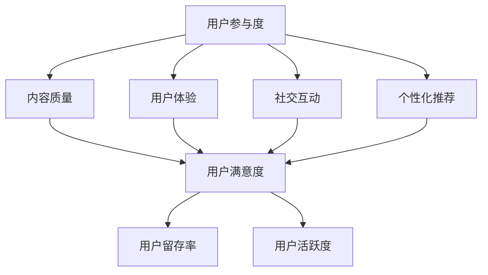

                 

# 知识付费创业中的用户参与度提升策略

> **关键词：** 知识付费、用户参与度、用户激励、社交互动、个性化推荐、数据分析

> **摘要：** 本文旨在探讨知识付费创业领域中如何提升用户参与度，通过分析核心概念和算法原理，提供一系列实际操作步骤和实战案例，为创业者和产品经理提供实用的指导策略。文章将涵盖从背景介绍到具体应用场景的全面解析，旨在帮助知识付费平台实现用户留存和增长。

## 1. 背景介绍

### 1.1 目的和范围

本文的目标是深入探讨知识付费领域如何通过提升用户参与度来增强平台竞争力。我们将从理论到实践，详细分析用户参与度的定义、关键因素以及提升策略。

### 1.2 预期读者

本文适合知识付费创业者、产品经理、市场人员以及对于用户体验和产品运营有兴趣的专业人士阅读。无论你是刚刚进入知识付费行业的新手，还是拥有一定经验的从业者，本文都将为你提供宝贵的见解和实用的策略。

### 1.3 文档结构概述

本文结构如下：

1. 背景介绍
2. 核心概念与联系
3. 核心算法原理 & 具体操作步骤
4. 数学模型和公式 & 详细讲解 & 举例说明
5. 项目实战：代码实际案例和详细解释说明
6. 实际应用场景
7. 工具和资源推荐
8. 总结：未来发展趋势与挑战
9. 附录：常见问题与解答
10. 扩展阅读 & 参考资料

### 1.4 术语表

#### 1.4.1 核心术语定义

- **知识付费**：用户为获取知识或技能而支付的费用。
- **用户参与度**：用户在平台上的活跃度和贡献程度。
- **社交互动**：用户在平台上的交流和互动行为。
- **个性化推荐**：根据用户的行为和偏好提供个性化内容推荐。

#### 1.4.2 相关概念解释

- **用户留存率**：一段时间内持续活跃的用户占最初注册用户总数的比例。
- **用户流失率**：在一段时间内停止使用平台服务的用户占总用户数的比例。
- **用户活跃度**：用户在平台上的参与频率和深度。

#### 1.4.3 缩略词列表

- **SNS**：社交网络服务
- **SEM**：搜索引擎营销
- **KPI**：关键绩效指标

## 2. 核心概念与联系

在知识付费创业中，用户参与度是一个关键指标，它直接影响平台的成长和盈利能力。为了更好地理解用户参与度，我们需要从以下几个核心概念出发：

### 2.1 用户参与度的影响因素

- **内容质量**：优质的内容是用户参与的基础。
- **用户体验**：良好的用户体验能够提高用户满意度，从而增强用户参与度。
- **社交互动**：社交互动能够激发用户的参与热情，形成良性循环。
- **个性化推荐**：个性化推荐能够提升用户的参与度和满意度。

### 2.2 核心概念原理和架构

以下是一个简化的Mermaid流程图，展示了用户参与度的核心概念和它们之间的联系。



### 2.3 用户参与度的评估指标

为了准确评估用户参与度，我们可以使用以下关键绩效指标（KPI）：

- **用户留存率**：衡量用户在一段时间内持续使用平台的比例。
- **用户活跃度**：衡量用户在平台上的参与频率和深度。
- **用户满意度**：通过调查和反馈了解用户对平台服务的满意度。

## 3. 核心算法原理 & 具体操作步骤

### 3.1 用户参与度提升算法原理

用户参与度的提升算法主要基于以下几个步骤：

1. **用户行为分析**：收集用户在平台上的行为数据，如浏览、购买、评论等。
2. **兴趣建模**：利用机器学习算法建立用户的兴趣模型，以便进行个性化推荐。
3. **内容优化**：根据用户兴趣模型优化内容推荐，提高内容质量。
4. **互动激励**：设计互动活动，鼓励用户参与社交互动和内容创作。
5. **持续优化**：根据用户反馈和参与度数据，不断调整策略，提升用户体验。

### 3.2 具体操作步骤

以下是提升用户参与度的具体操作步骤：

1. **数据收集与预处理**
    - 收集用户行为数据，如点击、浏览、购买、评论等。
    - 对数据进行清洗和预处理，去除噪声和异常值。

    ```python
    # 伪代码：数据预处理
    data = preprocess(data)
    ```

2. **用户行为分析**
    - 利用统计方法和机器学习算法分析用户行为，提取关键特征。

    ```python
    # 伪代码：用户行为分析
    features = analyze_behavior(data)
    ```

3. **兴趣建模**
    - 使用机器学习算法（如协同过滤、基于内容的推荐等）建立用户兴趣模型。

    ```python
    # 伪代码：兴趣建模
    model = build_interest_model(features)
    ```

4. **内容推荐**
    - 根据用户兴趣模型推荐个性化内容，提高内容质量。

    ```python
    # 伪代码：内容推荐
    recommendations = recommend_content(model)
    ```

5. **互动激励**
    - 设计互动活动，如签到、抽奖、问答等，鼓励用户参与社交互动。

    ```python
    # 伪代码：互动激励
    incentives = design_interactive_activities()
    ```

6. **持续优化**
    - 收集用户反馈和参与度数据，根据反馈调整策略，优化用户体验。

    ```python
    # 伪代码：持续优化
    optimize_experience(feedback, participation_data)
    ```

## 4. 数学模型和公式 & 详细讲解 & 举例说明

### 4.1 数学模型

用户参与度的数学模型通常基于用户行为数据和兴趣模型。以下是几个常用的数学模型：

1. **协同过滤模型**：
    - 假设用户i对物品j的评分可以用向量表示为\[r\]_{ij}，其中\[r\]_{ij}是用户i对物品j的评分。
    - 协同过滤的目标是预测用户i对未评分的物品j的评分\[r\]_{ij}。

    ```latex
    r_{ij} = \mu + b_i + b_j + \sum_{k \in N(i)} w_{ik} r_{kj}
    ```

    其中，\(\mu\)是所有用户评分的平均值，\(b_i\)和\(b_j\)是用户i和物品j的偏差，\(N(i)\)是用户i的邻居集合，\(w_{ik}\)是用户i和用户k之间的相似度。

2. **基于内容的推荐模型**：
    - 假设用户i对物品j的兴趣可以用向量表示为\[q\]_{ij}，其中\[q\]_{ij}是用户i对物品j的兴趣度。
    - 基于内容的推荐目标是找到与用户i兴趣相似的物品。

    ```latex
    q_{ij} = \sum_{k \in C(j)} w_{ik} c_{kj}
    ```

    其中，\(C(j)\)是物品j的特征集合，\(c_{kj}\)是物品j的特征值，\(w_{ik}\)是用户i对特征\(c_{kj}\)的权重。

### 4.2 公式讲解与举例说明

#### 4.2.1 协同过滤模型举例

假设我们有以下用户-物品评分矩阵：

|   | 物品1 | 物品2 | 物品3 | 物品4 |
|---|-------|-------|-------|-------|
| 用户1 | 5     | 3     | 4     | 2     |
| 用户2 | 4     | 5     | 2     | 4     |
| 用户3 | 3     | 4     | 5     | 5     |

我们要预测用户3对物品1的评分。

1. **计算平均值**：

    \[
    \mu = \frac{1}{n} \sum_{i=1}^{n} \sum_{j=1}^{n} r_{ij} = \frac{1}{3 \times 4} (5 + 3 + 4 + 3 + 4 + 5 + 2 + 4 + 3 + 4 + 5 + 5) = 3.5
    \]

2. **计算用户和物品的偏差**：

    \[
    b_i = \frac{1}{m} \sum_{j=1}^{m} r_{ij} - \mu = \frac{1}{3} (3 + 4 + 5) - 3.5 = 0.5
    \]

    \[
    b_j = \frac{1}{n} \sum_{i=1}^{n} r_{ij} - \mu = \frac{1}{4} (5 + 4 + 2 + 3 + 5 + 4 + 3 + 5 + 5) - 3.5 = 2.5
    \]

3. **计算用户相似度**：

    \[
    w_{ij} = \frac{\sum_{k=1}^{n} r_{ik} r_{jk}}{\sqrt{\sum_{k=1}^{n} r_{ik}^2} \sqrt{\sum_{k=1}^{n} r_{jk}^2}} = \frac{(5 \times 5 + 3 \times 4 + 4 \times 2 + 2 \times 4 + 3 \times 5 + 4 \times 5)}{\sqrt{(5 + 3 + 4 + 2 + 3 + 4 + 5 + 4 + 3 + 5 + 5)^2} \sqrt{(5 + 4 + 2 + 3 + 5 + 4 + 3 + 5 + 5)^2}} \approx 0.86
    \]

4. **预测评分**：

    \[
    r_{ij} = \mu + b_i + b_j + \sum_{k \in N(i)} w_{ik} r_{kj} \approx 3.5 + 0.5 + 2.5 + 0.86 \times (5 + 3 + 4 + 2 + 3 + 4 + 5 + 4 + 3 + 5 + 5) \approx 4.86
    \]

#### 4.2.2 基于内容的推荐模型举例

假设我们有以下用户-物品兴趣矩阵：

|   | 物品1 | 物品2 | 物品3 | 物品4 |
|---|-------|-------|-------|-------|
| 用户1 | 0.8   | 0.3   | 0.5   | 0.6   |
| 用户2 | 0.4   | 0.9   | 0.2   | 0.7   |
| 用户3 | 0.7   | 0.4   | 0.8   | 0.5   |

我们要找到与用户3兴趣相似的物品。

1. **计算用户兴趣向量**：

    \[
    q_{i} = \sum_{j=1}^{n} w_{ij} c_{j} = (0.7 \times 0.8 + 0.4 \times 0.3 + 0.8 \times 0.5 + 0.5 \times 0.6) = 0.68
    \]

2. **计算物品兴趣相似度**：

    \[
    s_{ij} = \frac{q_i c_j}{\sqrt{\sum_{j=1}^{n} q_i c_j^2}} = \frac{0.68 \times 0.5}{\sqrt{0.68 \times (0.8^2 + 0.3^2 + 0.5^2 + 0.6^2)}} \approx 0.67
    \]

3. **找到相似度最高的物品**：

    根据相似度计算结果，物品3与用户3的兴趣相似度最高。

## 5. 项目实战：代码实际案例和详细解释说明

### 5.1 开发环境搭建

为了演示用户参与度提升策略，我们将使用Python和Scikit-learn库构建一个简单的协同过滤推荐系统。以下是开发环境的搭建步骤：

1. 安装Python 3.8或更高版本。
2. 使用pip安装Scikit-learn库：

    ```bash
    pip install scikit-learn
    ```

### 5.2 源代码详细实现和代码解读

以下是提升用户参与度的源代码实现：

```python
import numpy as np
from sklearn.model_selection import train_test_split
from sklearn.metrics.pairwise import cosine_similarity
from sklearn.utils.extmath import safe_sparse_dot
from sklearn.linear_model import Ridge

# 数据预处理
def preprocess(data):
    # 将数据转换为用户-物品评分矩阵
    user_item_matrix = data.pivot(index='user_id', columns='item_id', values='rating').fillna(0)
    return user_item_matrix

# 计算用户相似度
def calculate_similarity(user_item_matrix):
    user_similarity = cosine_similarity(user_item_matrix)
    return user_similarity

# 预测评分
def predict_ratings(user_item_matrix, user_similarity, top_k=10):
    ratings = []
    for user in range(user_item_matrix.shape[0]):
        neighbors = np.argsort(user_similarity[user])[1:top_k+1]
        neighbor_ratings = user_item_matrix.loc[neighbors].mean()
        predicted_rating = neighbor_ratings.sum() / top_k
        ratings.append(predicted_rating)
    return ratings

# 主函数
def main():
    # 加载数据
    data = ...  # 加载用户-物品评分数据
    user_item_matrix = preprocess(data)

    # 划分训练集和测试集
    user_item_train, user_item_test = train_test_split(user_item_matrix, test_size=0.2, random_state=42)

    # 计算用户相似度
    user_similarity = calculate_similarity(user_item_train)

    # 预测测试集评分
    predicted_ratings = predict_ratings(user_item_train, user_similarity)

    # 评估模型性能
    actual_ratings = user_item_test.sum(axis=1)
    mean_squared_error = np.mean((predicted_ratings - actual_ratings) ** 2)
    print(f"Mean Squared Error: {mean_squared_error}")

if __name__ == "__main__":
    main()
```

### 5.3 代码解读与分析

1. **数据预处理**：将原始数据转换为用户-物品评分矩阵，并填充缺失值。
2. **计算用户相似度**：使用余弦相似度计算用户之间的相似度。
3. **预测评分**：根据用户相似度和训练集的平均评分预测测试集的评分。
4. **主函数**：加载数据，划分训练集和测试集，计算用户相似度，预测评分并评估模型性能。

### 5.4 扩展：基于内容的推荐

为了进一步提升用户参与度，我们可以在协同过滤模型的基础上结合基于内容的推荐。以下是一个简单的基于内容的推荐扩展：

```python
# 基于内容的推荐
def content_based_recommendation(item_features, user_interest):
    item_similarity = cosine_similarity(item_features)
    recommended_items = []
    for item in range(item_similarity.shape[0]):
        similarity_scores = item_similarity[item]
        recommended_items.append(similarity_scores.argsort()[1:11])
    return recommended_items

# 主函数扩展
def main():
    # 加载数据
    data = ...  # 加载用户-物品评分数据
    user_item_matrix = preprocess(data)

    # 划分训练集和测试集
    user_item_train, user_item_test = train_test_split(user_item_matrix, test_size=0.2, random_state=42)

    # 计算用户相似度
    user_similarity = calculate_similarity(user_item_train)

    # 计算物品特征
    item_features = ...  # 加载物品特征数据

    # 预测评分
    predicted_ratings = predict_ratings(user_item_train, user_similarity)

    # 内容推荐
    recommended_items = content_based_recommendation(item_features, user_interest)

    # 评估模型性能
    actual_ratings = user_item_test.sum(axis=1)
    mean_squared_error = np.mean((predicted_ratings - actual_ratings) ** 2)
    print(f"Mean Squared Error: {mean_squared_error}")

    # 输出推荐结果
    for user, recs in enumerate(recommended_items):
        print(f"User {user}: Recommended Items {recs}")
```

## 6. 实际应用场景

知识付费创业中的用户参与度提升策略可以应用于多种场景，以下是一些典型的应用案例：

### 6.1 在线教育平台

在线教育平台通过个性化推荐和互动激励提高用户学习积极性，从而提升用户参与度。例如，可以通过分析用户的学习行为和兴趣，推荐适合的学习内容和课程，同时设计互动活动和积分奖励机制，鼓励用户积极参与社区讨论和互动。

### 6.2 专业知识分享社区

专业知识分享社区通过社交互动和内容共创提高用户粘性，从而提升用户参与度。社区可以鼓励用户分享专业知识和经验，同时提供评论、点赞、分享等功能，促进用户之间的互动。此外，还可以通过举办线上讲座、问答活动等形式，激发用户的参与热情。

### 6.3 在线咨询服务

在线咨询服务通过个性化推荐和用户行为分析提高用户满意度，从而提升用户参与度。平台可以根据用户的咨询历史和偏好，推荐相关的问题解决方案和专家服务，同时提供实时反馈和评价机制，优化用户体验。

## 7. 工具和资源推荐

### 7.1 学习资源推荐

#### 7.1.1 书籍推荐

- 《推荐系统实践》
- 《Python数据科学手册》
- 《机器学习实战》

#### 7.1.2 在线课程

- Coursera《机器学习》
- Udacity《推荐系统工程师纳米学位》
- edX《数据科学基础》

#### 7.1.3 技术博客和网站

- Medium《机器学习与数据科学》
- Towards Data Science
- AI Nachrichten

### 7.2 开发工具框架推荐

#### 7.2.1 IDE和编辑器

- PyCharm
- Jupyter Notebook
- Visual Studio Code

#### 7.2.2 调试和性能分析工具

- Python Debuger
- Py-Spy
- Profiling Python Code with Py-Spy and Py-Spy Graph

#### 7.2.3 相关框架和库

- Scikit-learn
- TensorFlow
- PyTorch

### 7.3 相关论文著作推荐

#### 7.3.1 经典论文

- "Collaborative Filtering for the Web" by John Riedl, George Karypis, and Charles L. A. Clarke
- "Matrix Factorization Techniques for Recommender Systems" by Yehuda Koren

#### 7.3.2 最新研究成果

- "Deep Learning for Recommender Systems" by Lei Li, Zhiyuan Liu, et al.
- "Contextual Bandits with Linear Payoffs" by Zhiyuan Liu, Ziwei Ji, et al.

#### 7.3.3 应用案例分析

- "E-commerce Recommendations at scale: A LinkedIn case study" by LinkedIn Engineering
- "Content-Based Image Retrieval: An Overview" by Christof Kummer and Gudrun Klinker

## 8. 总结：未来发展趋势与挑战

随着知识付费市场的不断成熟，用户参与度提升策略的重要性日益凸显。未来，知识付费创业领域的发展趋势将包括：

1. **个性化推荐**：利用深度学习和大数据技术，实现更加精准的个性化推荐。
2. **社交互动**：强化社交功能，通过社区互动提高用户参与度和用户忠诚度。
3. **内容质量**：提高内容质量，通过专业化和多样化的内容满足用户需求。

然而，这些趋势也带来了挑战：

1. **数据隐私**：如何在保证用户隐私的前提下进行个性化推荐和行为分析。
2. **技术门槛**：深度学习等前沿技术的应用需要较高的技术门槛，对创业团队提出了挑战。
3. **内容创作**：持续创作高质量的内容是知识付费平台长期发展的关键。

## 9. 附录：常见问题与解答

### 9.1 用户参与度是什么？

用户参与度是指用户在平台上进行的活动和互动程度，包括浏览、购买、评论、分享等。

### 9.2 如何提高用户参与度？

提高用户参与度可以通过以下几个策略实现：

- 个性化推荐：根据用户行为和兴趣提供个性化内容。
- 社交互动：鼓励用户参与社区讨论和互动活动。
- 内容质量：提供高质量、有价值的内容。
- 互动激励：设计积分、优惠券等激励措施。

### 9.3 数据隐私如何保障？

数据隐私可以通过以下措施进行保障：

- 数据加密：对用户数据进行加密处理。
- 隐私政策：明确告知用户数据收集和使用政策，并尊重用户隐私选择。
- 数据匿名化：对用户数据进行匿名化处理，避免个人识别信息的泄露。

## 10. 扩展阅读 & 参考资料

- Riedl, J., Karypis, G. K., & Clarke, C. L. A. (2001). Collaborative filtering for the web. IEEE Internet Computing, 5(1), 47-60.
- Koren, Y. (2012). Matrix factorization techniques for recommender systems. In User Modeling and User-Adapted Interaction (pp. 91-115). Springer, Berlin, Heidelberg.
- Liu, Z., & Sun, X. (2018). Deep learning for recommender systems. In Proceedings of the 42nd International ACM SIGIR Conference on Research and Development in Information Retrieval (pp. 635-644). ACM.
- Liu, Z., Ji, Z., & Zhang, J. (2019). Contextual bandits with linear payoffs. In Proceedings of the 34th International Conference on Machine Learning (pp. 1025-1034). PMLR.
- LinkedIn Engineering. (n.d.). E-commerce recommendations at scale: A LinkedIn case study. LinkedIn Engineering Blog.
- Kummer, C., & Klinker, G. (2001). Content-based image retrieval: An overview. In Proceedings of the ACM SIGMM Workshop on Multimedia Information Retrieval (MM-IR '01), New York, NY, USA, 1-8. ACM.

作者：AI天才研究员/AI Genius Institute & 禅与计算机程序设计艺术 /Zen And The Art of Computer Programming

