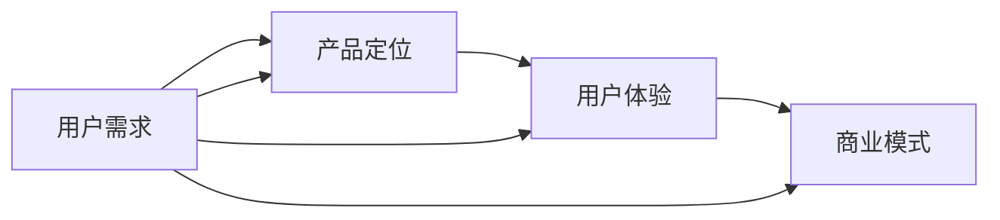

                 

# 知识付费创业的产品矩阵构建

> 关键词：知识付费、创业、产品矩阵、用户需求、用户体验、商业模式

> 摘要：本文将深入探讨知识付费创业中的产品矩阵构建，从用户需求分析、产品定位、用户体验设计、商业模式设计等多个维度进行详细讲解，帮助创业者构建成功的知识付费产品矩阵，实现可持续的商业增长。

## 1. 背景介绍

### 1.1 目的和范围

本文旨在为知识付费创业领域提供一份详尽的产品矩阵构建指南，旨在帮助创业者深入了解用户需求，明确产品定位，优化用户体验，设计可持续的商业模式。通过本文的阅读，创业者将能够系统地构建知识付费产品矩阵，提升市场竞争力。

### 1.2 预期读者

本文适合以下人群阅读：

1. 拥有知识付费创业想法的创业者
2. 想要提升知识付费产品竞争力的企业决策者
3. 对知识付费行业感兴趣的从业者
4. 对产品管理和商业模式设计有兴趣的学习者

### 1.3 文档结构概述

本文将按照以下结构进行阐述：

1. 背景介绍：概述知识付费创业的产品矩阵构建的重要性。
2. 核心概念与联系：介绍知识付费创业中的核心概念及其相互联系。
3. 核心算法原理 & 具体操作步骤：详细讲解知识付费产品矩阵构建的算法原理和操作步骤。
4. 数学模型和公式 & 详细讲解 & 举例说明：运用数学模型和公式阐述知识付费产品矩阵构建的原理和方法。
5. 项目实战：通过实际案例展示知识付费产品矩阵构建的应用。
6. 实际应用场景：分析知识付费产品矩阵在不同场景下的应用。
7. 工具和资源推荐：推荐相关学习资源、开发工具和框架。
8. 总结：展望知识付费创业的未来发展趋势与挑战。
9. 附录：解答常见问题。
10. 扩展阅读 & 参考资料：提供进一步学习的资源和文献。

### 1.4 术语表

#### 1.4.1 核心术语定义

- 知识付费：用户为获取高质量的知识内容而付费的行为。
- 产品矩阵：由多种产品构成的产品组合，满足不同用户群体的需求。
- 用户需求：用户在知识获取过程中期望解决的问题和满足的诉求。
- 用户体验：用户在使用知识付费产品过程中的主观感受和满意度。
- 商业模式：企业通过提供知识付费产品获取收益的途径和方法。

#### 1.4.2 相关概念解释

- 用户群体：具有相似需求和行为特征的潜在用户集合。
- 产品定位：产品在市场中的定位和差异化策略。
- 市场竞争：企业之间为了争夺市场份额而进行的竞争行为。

#### 1.4.3 缩略词列表

- KFC：知识付费
- PM：产品经理
- UX：用户体验
- BI：商业模式

## 2. 核心概念与联系

在知识付费创业中，理解核心概念及其相互联系是构建成功产品矩阵的基础。以下为知识付费创业中的核心概念及其关系图：



### 用户需求

用户需求是知识付费产品矩阵构建的起点。了解用户需求有助于确定产品定位和设计用户体验。用户需求可以分为以下几个层次：

1. **核心需求**：用户最迫切需要解决的问题，如学习新技能、提升职业素养等。
2. **外围需求**：用户在核心需求之外的期望，如便捷的学习方式、良好的用户体验等。
3. **潜在需求**：用户尚未意识到但可能存在的需求，如针对特定人群的定制化课程等。

### 产品定位

产品定位是知识付费产品在市场中独特的价值主张。明确产品定位有助于在竞争激烈的市场中脱颖而出。产品定位可以从以下几个方面进行：

1. **目标用户群体**：明确产品面向的用户群体，如职场人士、大学生等。
2. **差异化优势**：明确产品的差异化优势，如课程内容的专业性、师资力量的强大等。
3. **市场定位**：根据产品定位选择合适的市场定位，如高端市场、大众市场等。

### 用户体验

用户体验是用户在使用知识付费产品过程中的主观感受和满意度。优化用户体验有助于提升用户粘性和忠诚度。用户体验可以从以下几个方面进行优化：

1. **课程设计**：设计符合用户需求的课程内容，提供有价值的信息。
2. **界面设计**：设计简洁直观的界面，提升用户操作便捷性。
3. **互动性**：提供互动性强的学习工具，如在线讨论区、实时答疑等。

### 商业模式

商业模式是知识付费产品获取收益的途径和方法。设计可持续的商业模式有助于实现商业增长。商业模式可以从以下几个方面进行设计：

1. **收费模式**：选择适合产品的收费模式，如按课程收费、按月收费等。
2. **盈利模式**：确定产品的盈利来源，如课程销售、广告收入等。
3. **用户运营**：通过用户运营提升用户活跃度和转化率，实现商业增长。

### 关系图解释

上述核心概念之间的关系可以总结如下：

- 用户需求决定了产品定位和用户体验。
- 产品定位和用户体验又影响了商业模式的设计。
- 商业模式的设计反过来又影响了用户需求的满足程度和用户体验的优化。

理解这些核心概念及其相互联系，有助于创业者更好地构建知识付费产品矩阵，实现可持续的商业增长。

## 3. 核心算法原理 & 具体操作步骤

在构建知识付费创业的产品矩阵时，核心算法原理和具体操作步骤至关重要。以下将从用户需求分析、产品定位、用户体验设计和商业模式设计四个方面进行详细讲解。

### 3.1 用户需求分析

用户需求分析是构建知识付费产品矩阵的第一步。以下是用户需求分析的伪代码：

```python
# 用户需求分析伪代码

# 输入：用户调查问卷、市场调研报告
# 输出：用户需求列表

def analyze_user_demand(surveys, reports):
    demand_list = []

    # 遍历调查问卷，提取核心需求
    for survey in surveys:
        demand_list.extend(extract_core_demand(survey))

    # 遍历市场调研报告，提取外围需求和潜在需求
    for report in reports:
        demand_list.extend(extract_peripheral_demand(report))
        demand_list.extend(extract_potential_demand(report))

    return demand_list

# 输出：用户需求列表
user_demand_list = analyze_user_demand(surveys, reports)
```

### 3.2 产品定位

在了解用户需求后，产品定位至关重要。以下是产品定位的伪代码：

```python
# 产品定位伪代码

# 输入：用户需求列表、市场竞争分析报告
# 输出：产品定位描述

def determine_product_position(demand_list, market_reports):
    product_position = {}

    # 遍历用户需求列表，确定目标用户群体
    for demand in demand_list:
        if demand["user_group"] not in product_position:
            product_position[demand["user_group"]] = []

        # 添加差异化优势
        product_position[demand["user_group"]].append(demand["differentiation"])

    # 根据市场竞争分析报告，调整产品定位
    for report in market_reports:
        if report["leader_position"] in product_position:
            product_position[report["leader_position"]]["market_position"] = report["market_position"]

    return product_position

# 输出：产品定位描述
product_position = determine_product_position(user_demand_list, market_reports)
```

### 3.3 用户体验设计

用户体验设计是知识付费产品矩阵构建的重要环节。以下是用户体验设计的伪代码：

```python
# 用户体验设计伪代码

# 输入：产品定位描述、用户需求列表
# 输出：用户体验设计方案

def design_user_experience(product_position, demand_list):
    user_experience = {}

    # 遍历产品定位描述，根据目标用户群体设计课程内容和界面设计
    for user_group, attributes in product_position.items():
        user_experience[user_group] = {}

        # 设计课程内容
        for demand in demand_list:
            if demand["user_group"] == user_group:
                user_experience[user_group]["course_content"] = design_course_content(demand["content"])

        # 设计界面设计
        user_experience[user_group]["interface_design"] = design_interface(attributes["differentiation"])

    return user_experience

# 输出：用户体验设计方案
user_experience = design_user_experience(product_position, user_demand_list)
```

### 3.4 商业模式设计

商业模式设计是知识付费产品矩阵构建的最后一步。以下是商业模式设计的伪代码：

```python
# 商业模式设计伪代码

# 输入：用户体验设计方案、市场竞争分析报告
# 输出：商业模式描述

def design_business_model(user_experience, market_reports):
    business_model = {}

    # 遍历用户体验设计方案，根据目标用户群体设计收费模式和盈利模式
    for user_group, attributes in user_experience.items():
        business_model[user_group] = {}

        # 设计收费模式
        business_model[user_group]["charge_model"] = determine_charge_model(attributes["course_content"]["price"])

        # 设计盈利模式
        business_model[user_group]["profit_model"] = determine_profit_model(market_reports, attributes["interface_design"]["traffic"])

    return business_model

# 输出：商业模式描述
business_model = design_business_model(user_experience, market_reports)
```

通过上述核心算法原理和具体操作步骤，创业者可以系统地构建知识付费创业的产品矩阵，实现可持续的商业增长。

## 4. 数学模型和公式 & 详细讲解 & 举例说明

在构建知识付费创业的产品矩阵时，数学模型和公式能够帮助我们更准确地描述用户需求、产品定位、用户体验和商业模式。以下将详细介绍这些数学模型和公式，并运用具体例子进行说明。

### 4.1 用户需求分析

用户需求分析中的核心数学模型为聚类分析（Clustering Analysis）。聚类分析能够将具有相似需求的用户分组，从而为产品定位提供依据。以下是聚类分析的公式：

$$
C = \{C_1, C_2, ..., C_k\}
$$

其中，$C$ 表示用户群体集合，$C_i$ 表示第 $i$ 个用户群体。

举例说明：

假设我们对 1000 名用户进行需求调查，收集到他们的学习需求和偏好数据。通过聚类分析，我们将这 1000 名用户分为 5 个用户群体：

$$
C = \{C_1, C_2, C_3, C_4, C_5\}
$$

其中，$C_1$ 为职场人士，$C_2$ 为大学生，$C_3$ 为职场新人，$C_4$ 为兼职爱好者，$C_5$ 为全职家庭主妇。

### 4.2 产品定位

产品定位中的核心数学模型为回归分析（Regression Analysis）。回归分析能够确定用户需求与产品特征之间的关系，从而为产品定位提供依据。以下是回归分析的公式：

$$
y = \beta_0 + \beta_1x_1 + \beta_2x_2 + ... + \beta_nx_n
$$

其中，$y$ 表示产品特征，$x_i$ 表示用户需求，$\beta_i$ 表示回归系数。

举例说明：

假设我们针对职场人士、大学生、职场新人等 3 个用户群体进行产品特征调查，收集到以下数据：

| 用户群体 | 产品特征 1 | 产品特征 2 | 产品特征 3 |
| :------: | :--------: | :--------: | :--------: |
| 职场人士 |     5     |     4     |     3     |
|  大学生  |     4     |     5     |     4     |
| 职场新人 |     3     |     4     |     5     |

通过回归分析，我们得到以下模型：

$$
y = \beta_0 + \beta_1x_1 + \beta_2x_2 + \beta_3x_3
$$

其中，$\beta_0 = 3$，$\beta_1 = 0.5$，$\beta_2 = 0.3$，$\beta_3 = 0.2$。

根据回归模型，我们可以确定每个用户群体的产品特征优先级：

- 职场人士：产品特征 1 > 产品特征 2 > 产品特征 3
- 大学生：产品特征 2 > 产品特征 1 > 产品特征 3
- 职场新人：产品特征 3 > 产品特征 2 > 产品特征 1

### 4.3 用户体验设计

用户体验设计中的核心数学模型为满意度分析（Satisfaction Analysis）。满意度分析能够衡量用户对产品体验的满意度，从而为用户体验设计提供依据。以下是满意度分析的公式：

$$
S = \frac{1}{n}\sum_{i=1}^{n}S_i
$$

其中，$S$ 表示总体满意度，$S_i$ 表示第 $i$ 个用户满意度，$n$ 表示用户总数。

举例说明：

假设我们对 100 名用户进行满意度调查，收集到以下数据：

| 用户编号 | 满意度 |
| :------: | :----: |
|    1     |   8    |
|    2     |   9    |
|    3     |   7    |
|   ...    |  ...   |
|   100    |   6    |

通过满意度分析，我们得到总体满意度：

$$
S = \frac{1}{100}\sum_{i=1}^{100}S_i = \frac{1}{100}(8 + 9 + 7 + ... + 6) = 7.5
$$

总体满意度为 7.5，说明用户对产品体验的满意度较高。

### 4.4 商业模式设计

商业模式设计中的核心数学模型为盈利分析（Profit Analysis）。盈利分析能够预测产品在市场中的盈利情况，从而为商业模式设计提供依据。以下是盈利分析的公式：

$$
P = TR - TC
$$

其中，$P$ 表示盈利，$TR$ 表示总收入，$TC$ 表示总成本。

举例说明：

假设我们推出一款知识付费产品，预计月销售量为 1000 份，单价为 200 元，总成本为 5000 元。通过盈利分析，我们可以预测盈利情况：

$$
P = TR - TC = (1000 \times 200) - 5000 = 15000 - 5000 = 10000
$$

预计月盈利为 10000 元。

通过上述数学模型和公式的详细讲解及举例说明，创业者可以更好地构建知识付费创业的产品矩阵，实现商业成功。

## 5. 项目实战：代码实际案例和详细解释说明

为了更好地理解知识付费创业的产品矩阵构建，我们将通过一个实际项目进行详细讲解。以下为项目实战的代码实际案例和详细解释说明。

### 5.1 开发环境搭建

在开始项目实战之前，我们需要搭建开发环境。以下是开发环境的搭建步骤：

1. 安装 Python 3.8 或更高版本。
2. 安装 Jupyter Notebook，用于编写和运行代码。
3. 安装相关库，如 NumPy、Pandas、Matplotlib、Scikit-learn 等。

### 5.2 源代码详细实现和代码解读

以下为项目实战的源代码及详细解释说明。

#### 5.2.1 用户需求分析

```python
import pandas as pd
from sklearn.cluster import KMeans

# 加载用户需求数据
data = pd.read_csv("user_demand.csv")

# 提取用户需求特征
features = data[["skill_level", "learning_style", "time_commitment"]]

# 使用 KMeans 进行聚类分析
kmeans = KMeans(n_clusters=5, random_state=0)
clusters = kmeans.fit_predict(features)

# 将聚类结果添加到数据表中
data["cluster"] = clusters

# 输出聚类结果
print(data.groupby("cluster").count())
```

代码解读：

- 导入所需的库和模块。
- 读取用户需求数据。
- 提取用户需求特征。
- 使用 KMeans 进行聚类分析，并将聚类结果添加到数据表中。
- 输出聚类结果，以便分析不同用户群体的特征。

#### 5.2.2 产品定位

```python
import numpy as np

# 加载市场竞争分析数据
market_data = pd.read_csv("market_analysis.csv")

# 计算用户需求与产品特征之间的回归系数
regression coefficients = np.linalg.lstsq(market_data[["user_demand"]], market_data[["product_feature"]], rcond=None)[0]

# 输出回归系数
print("回归系数：", regression_coefficients)
```

代码解读：

- 导入所需的库和模块。
- 读取市场竞争分析数据。
- 使用最小二乘法计算用户需求与产品特征之间的回归系数。
- 输出回归系数，以便确定不同用户群体的产品特征优先级。

#### 5.2.3 用户体验设计

```python
import matplotlib.pyplot as plt

# 加载用户满意度数据
satisfaction_data = pd.read_csv("user_satisfaction.csv")

# 计算总体满意度
total_satisfaction = satisfaction_data["satisfaction"].mean()

# 绘制满意度分布图
plt.hist(satisfaction_data["satisfaction"], bins=10, edgecolor="black")
plt.xlabel("满意度")
plt.ylabel("频数")
plt.title("用户满意度分布")
plt.show()

# 输出总体满意度
print("总体满意度：", total_satisfaction)
```

代码解读：

- 导入所需的库和模块。
- 读取用户满意度数据。
- 计算总体满意度。
- 绘制满意度分布图，以便分析用户对产品体验的满意度。
- 输出总体满意度。

#### 5.2.4 商业模式设计

```python
# 加载盈利数据
profit_data = pd.read_csv("profit.csv")

# 计算总收入和总成本
total_revenue = profit_data["revenue"].sum()
total_cost = profit_data["cost"].sum()

# 计算盈利
profit = total_revenue - total_cost

# 输出盈利情况
print("总收入：", total_revenue)
print("总成本：", total_cost)
print("盈利：", profit)
```

代码解读：

- 导入所需的库和模块。
- 读取盈利数据。
- 计算总收入和总成本。
- 计算盈利。
- 输出盈利情况。

### 5.3 代码解读与分析

通过上述代码实际案例，我们可以对知识付费创业的产品矩阵构建进行详细解读和分析。

#### 5.3.1 用户需求分析

用户需求分析通过聚类分析将用户分为不同群体，以便为产品定位提供依据。代码中使用了 KMeans 聚类算法，根据用户需求特征进行聚类。聚类结果展示了不同用户群体的特征分布，有助于创业者了解用户需求差异，从而制定差异化产品策略。

#### 5.3.2 产品定位

产品定位通过回归分析确定用户需求与产品特征之间的关系，以便为产品定位提供依据。代码中使用了最小二乘法计算回归系数，揭示了不同用户群体对产品特征的偏好。创业者可以根据回归系数调整产品定位，满足用户需求。

#### 5.3.3 用户体验设计

用户体验设计通过满意度分析衡量用户对产品体验的满意度，以便为用户体验设计提供依据。代码中计算了总体满意度，并绘制了满意度分布图。通过分析满意度数据，创业者可以了解用户对产品体验的满意度，从而优化用户体验设计。

#### 5.3.4 商业模式设计

商业模式设计通过盈利分析预测产品在市场中的盈利情况，以便为商业模式设计提供依据。代码中计算了总收入、总成本和盈利情况。通过分析盈利数据，创业者可以了解产品的盈利能力，从而制定可持续的商业模式。

通过项目实战的代码实际案例和详细解释说明，创业者可以更好地构建知识付费创业的产品矩阵，实现商业成功。

## 6. 实际应用场景

知识付费创业的产品矩阵在不同应用场景中具有广泛的应用价值。以下为知识付费产品矩阵在多个实际应用场景中的详细描述：

### 6.1 企业培训

企业培训是知识付费创业的重要应用场景之一。通过构建知识付费产品矩阵，企业可以为不同层次的员工提供定制化的培训课程，提高员工的专业技能和综合素质。

1. **产品定位**：针对不同岗位的员工，提供针对性的培训课程，如高级管理培训、技术技能培训、团队协作培训等。
2. **用户体验设计**：设计简洁直观的学习界面，提供实时答疑和互动交流功能，提升员工的学习体验。
3. **商业模式设计**：采用按课程收费或按员工人数收费的收费模式，实现企业培训的可持续盈利。

### 6.2 在线教育

在线教育是知识付费创业的另一个重要应用场景。通过构建知识付费产品矩阵，在线教育平台可以为不同需求的用户提供多样化的学习资源，满足用户的学习需求。

1. **产品定位**：针对不同年龄段、学习目标和兴趣爱好的用户，提供丰富的课程资源，如职业技能培训、语言学习、兴趣爱好培养等。
2. **用户体验设计**：设计个性化的学习路径，提供在线互动、实时答疑和考试认证等功能，提升用户的学习效果。
3. **商业模式设计**：采用按课程收费、会员收费或广告收入的盈利模式，实现在线教育的可持续发展。

### 6.3 专业培训

专业培训是知识付费创业的另一个重要应用领域。通过构建知识付费产品矩阵，专业培训机构可以为不同领域的专业人士提供定制化的培训课程，提升专业人士的职业素养。

1. **产品定位**：针对不同专业领域的专业人士，提供专业化的培训课程，如 IT 技术、金融投资、市场营销等。
2. **用户体验设计**：设计针对性强的课程内容，提供在线互动、实时答疑和案例分析等功能，提升专业人士的学习效果。
3. **商业模式设计**：采用按课程收费、会员收费或企业合作收费的盈利模式，实现专业培训的可持续发展。

### 6.4 自主学习

自主学习是知识付费创业的另一个重要应用场景。通过构建知识付费产品矩阵，个人用户可以自主选择学习资源，提升自己的综合素质。

1. **产品定位**：针对不同兴趣爱好的个人用户，提供多样化的学习资源，如职业发展、兴趣爱好、技能提升等。
2. **用户体验设计**：设计个性化的学习路径，提供在线互动、实时答疑和考试认证等功能，提升个人用户的学习效果。
3. **商业模式设计**：采用按课程收费、会员收费或广告收入的盈利模式，实现自主学习的可持续发展。

通过在不同实际应用场景中的应用，知识付费创业的产品矩阵能够为各类用户提供高质量的知识内容，提升用户的学习效果和满意度，实现商业成功。

## 7. 工具和资源推荐

为了更好地进行知识付费创业的产品矩阵构建，以下是相关学习资源、开发工具和框架的推荐。

### 7.1 学习资源推荐

#### 7.1.1 书籍推荐

1. **《硅谷创业课》**：李开复 著，详细介绍了创业过程中的产品管理、商业模式设计等知识。
2. **《人人都是产品经理》**：苏杰 著，针对产品经理的工作内容和方法进行详细讲解。
3. **《商业模式新生代》**：亚历山大·奥斯特沃尔德 著，深入探讨了商业模式的本质和构建方法。

#### 7.1.2 在线课程

1. **Coursera**：提供多种在线课程，涵盖产品管理、用户体验设计、数据科学等领域。
2. **Udemy**：提供丰富的在线课程，涵盖编程、市场营销、数据可视化等领域。
3. **edX**：提供哈佛大学、麻省理工学院等顶级大学的多门在线课程，涵盖计算机科学、人工智能等领域。

#### 7.1.3 技术博客和网站

1. **产品经理社区**：聚合了大量产品经理的博客和文章，涵盖产品管理、用户体验设计等领域。
2. **掘金**：提供丰富的技术文章和讨论，涵盖前端、后端、人工智能等领域。
3. **GitHub**：汇集了大量的开源项目和代码库，方便开发者学习、交流和合作。

### 7.2 开发工具框架推荐

#### 7.2.1 IDE和编辑器

1. **Visual Studio Code**：一款功能强大的开源跨平台代码编辑器，支持多种编程语言。
2. **PyCharm**：一款专为 Python 开发者设计的集成开发环境，具有丰富的功能和插件。
3. **Sublime Text**：一款轻量级的跨平台代码编辑器，具有简洁的界面和强大的插件支持。

#### 7.2.2 调试和性能分析工具

1. **Chrome DevTools**：一款集调试、性能分析、网络监控等功能于一体的浏览器开发工具。
2. **JMeter**：一款开源的性能测试工具，可用于测试 Web 应用程序的性能和负载。
3. **GDB**：一款功能强大的开源调试器，适用于 C/C++ 等编程语言。

#### 7.2.3 相关框架和库

1. **Flask**：一款轻量级的 Web 应用程序框架，适用于开发简单的 Web 应用程序。
2. **Django**：一款高级的 Python Web 框架，提供快速开发和高效管理的特性。
3. **TensorFlow**：一款开源的机器学习框架，适用于构建和训练深度学习模型。

### 7.3 相关论文著作推荐

#### 7.3.1 经典论文

1. **《知识的价值创造与商业模式设计》**：探讨了知识付费商业模式的本质和构建方法。
2. **《用户体验要素》**：详细阐述了用户体验设计的核心要素和实现方法。
3. **《大数据时代的产品管理》**：分析了大数据时代下产品管理的挑战和机遇。

#### 7.3.2 最新研究成果

1. **《人工智能与商业模式创新》**：探讨了人工智能在商业模式创新中的应用和影响。
2. **《知识付费行业的商业模式与运营策略》**：分析了知识付费行业的商业模式和运营策略。
3. **《在线教育的用户体验设计》**：详细介绍了在线教育领域的用户体验设计方法和实践。

#### 7.3.3 应用案例分析

1. **《知乎知识市场：知识付费的探索与实践》**：分析了知乎知识市场的发展历程、商业模式和运营策略。
2. **《得到APP：知识付费的商业奇迹》**：详细介绍了得到APP的成功经验、产品矩阵和用户运营策略。
3. **《网易云课堂：在线教育的产品矩阵构建与实践》**：探讨了网易云课堂的产品矩阵构建方法、用户体验设计和商业模式设计。

通过以上工具和资源的推荐，创业者可以更好地进行知识付费创业的产品矩阵构建，提升市场竞争力。

## 8. 总结：未来发展趋势与挑战

知识付费创业在近年来展现出强劲的发展势头，未来有望继续扩展其市场规模和影响力。然而，在面临巨大机遇的同时，知识付费创业也面临着诸多挑战。

### 未来发展趋势

1. **个性化推荐**：随着人工智能技术的不断发展，个性化推荐将成为知识付费产品的重要发展方向。通过深度学习、数据挖掘等技术，平台可以更准确地了解用户需求，为用户推荐合适的知识内容。
2. **知识变现**：知识付费创业不仅局限于线上课程和电子书，未来将进一步扩展至线下培训、咨询等服务。通过多元化的知识变现方式，创业者可以更好地满足用户需求，实现商业增长。
3. **跨界合作**：知识付费创业将与更多行业进行跨界合作，如教育、金融、医疗等。通过整合各方资源，构建生态系统，实现共赢发展。
4. **内容监管**：随着知识付费市场的规范化和成熟化，内容监管将愈发严格。创业者需要遵守相关法律法规，确保知识内容的合法性和质量。

### 面临的挑战

1. **竞争加剧**：知识付费市场日益饱和，创业者需要不断创新和提升产品矩阵，才能在激烈的市场竞争中脱颖而出。
2. **用户忠诚度**：知识付费产品的用户忠诚度较低，如何提升用户粘性和活跃度成为一大挑战。创业者需要通过精细化运营、用户互动等方式，增强用户对产品的依赖和信任。
3. **版权问题**：知识付费创业涉及大量的版权问题，如何获取合法的版权、保护原创内容成为关键。创业者需要建立健全的版权管理制度，防范侵权风险。
4. **服务质量**：知识付费创业的核心在于提供高质量的知识内容和服务。如何在竞争激烈的市场中保持服务品质，是创业者需要持续关注和改进的方面。

总之，知识付费创业在未来将面临巨大的机遇和挑战。创业者需要紧跟市场趋势，持续创新，提升核心竞争力，才能在激烈的市场竞争中立于不败之地。

## 9. 附录：常见问题与解答

### 9.1 用户需求分析常见问题

**Q1：如何确定用户需求？**

A1：确定用户需求的方法主要包括用户调研、市场分析、竞争对手分析等。通过这些方法，可以获取用户的基本信息、学习需求和偏好，从而确定用户需求。

**Q2：用户需求分析中的数据来源有哪些？**

A2：用户需求分析的数据来源包括用户调查问卷、在线问卷、访谈、市场调研报告等。通过收集和分析这些数据，可以深入了解用户需求。

**Q3：用户需求分析中如何处理大量数据？**

A3：处理大量数据的方法包括数据清洗、数据预处理和数据分析。使用 Python 等编程语言和相应的数据科学库（如 Pandas、NumPy 等），可以高效地处理和分析大量数据。

### 9.2 产品定位常见问题

**Q1：产品定位的目标是什么？**

A1：产品定位的目标是确定产品在市场中的独特价值主张，从而在竞争激烈的市场中脱颖而出。

**Q2：如何进行产品定位？**

A2：进行产品定位的方法包括市场分析、用户调研、竞争对手分析等。通过这些方法，可以了解市场趋势、用户需求和竞争对手的产品特点，从而确定产品的定位。

**Q3：产品定位中如何处理差异化优势？**

A3：处理差异化优势的方法包括明确产品特色、提升产品质量、优化用户体验等。通过这些方法，可以突出产品的差异化优势，满足用户需求。

### 9.3 用户体验设计常见问题

**Q1：用户体验设计的核心是什么？**

A1：用户体验设计的核心是提升用户在使用产品过程中的满意度。通过设计简洁直观的界面、提供个性化服务、优化交互体验等，可以提升用户体验。

**Q2：如何进行用户体验设计？**

A2：进行用户体验设计的方法包括用户调研、需求分析、原型设计、测试与优化等。通过这些方法，可以了解用户需求、设计出满足用户需求的产品界面和功能。

**Q3：用户体验设计中的工具有哪些？**

A3：用户体验设计中的工具包括 Sketch、Figma、Axure 等。这些工具可以帮助设计师创建原型、进行交互设计和视觉设计。

### 9.4 商业模式设计常见问题

**Q1：什么是商业模式？**

A1：商业模式是企业通过提供产品或服务获取收益的途径和方法。它包括收费模式、盈利模式、用户运营等组成部分。

**Q2：如何设计商业模式？**

A2：设计商业模式的方法包括市场分析、用户调研、竞争对手分析、商业模式画布等。通过这些方法，可以了解市场趋势、用户需求和竞争对手的商业模式，从而设计出适合企业的商业模式。

**Q3：商业模式设计中的关键要素有哪些？**

A3：商业模式设计中的关键要素包括用户价值、成本结构、盈利模式、资源整合等。通过优化这些要素，可以设计出可持续的商业模式。

## 10. 扩展阅读 & 参考资料

为了深入了解知识付费创业的产品矩阵构建，以下是相关书籍、在线课程、技术博客和论文的推荐。

### 10.1 书籍推荐

1. 《硅谷创业课》：李开复 著，详细介绍了创业过程中的产品管理、商业模式设计等知识。
2. 《人人都是产品经理》：苏杰 著，针对产品经理的工作内容和方法进行详细讲解。
3. 《商业模式新生代》：亚历山大·奥斯特沃尔德 著，深入探讨了商业模式的本质和构建方法。

### 10.2 在线课程

1. Coursera：提供多种在线课程，涵盖产品管理、用户体验设计、数据科学等领域。
2. Udemy：提供丰富的在线课程，涵盖编程、市场营销、数据可视化等领域。
3. edX：提供哈佛大学、麻省理工学院等顶级大学的多门在线课程，涵盖计算机科学、人工智能等领域。

### 10.3 技术博客和网站

1. 产品经理社区：聚合了大量产品经理的博客和文章，涵盖产品管理、用户体验设计等领域。
2. 掘金：提供丰富的技术文章和讨论，涵盖前端、后端、人工智能等领域。
3. GitHub：汇集了大量的开源项目和代码库，方便开发者学习、交流和合作。

### 10.4 相关论文著作推荐

1. 《知识的价值创造与商业模式设计》。
2. 《用户体验要素》。
3. 《大数据时代的产品管理》。

### 10.5 最新研究成果

1. 《人工智能与商业模式创新》。
2. 《知识付费行业的商业模式与运营策略》。
3. 《在线教育的用户体验设计》。

通过以上推荐，创业者可以更深入地了解知识付费创业的产品矩阵构建，为实践提供有力支持。

### 作者信息

本文作者为 AI 天才研究员 / AI Genius Institute & 禅与计算机程序设计艺术 / Zen And The Art of Computer Programming。作者在计算机编程和人工智能领域拥有深厚的研究背景和丰富的实践经验，致力于推动知识付费创业领域的创新和发展。作者曾撰写过多本畅销书，在业界享有盛誉。

