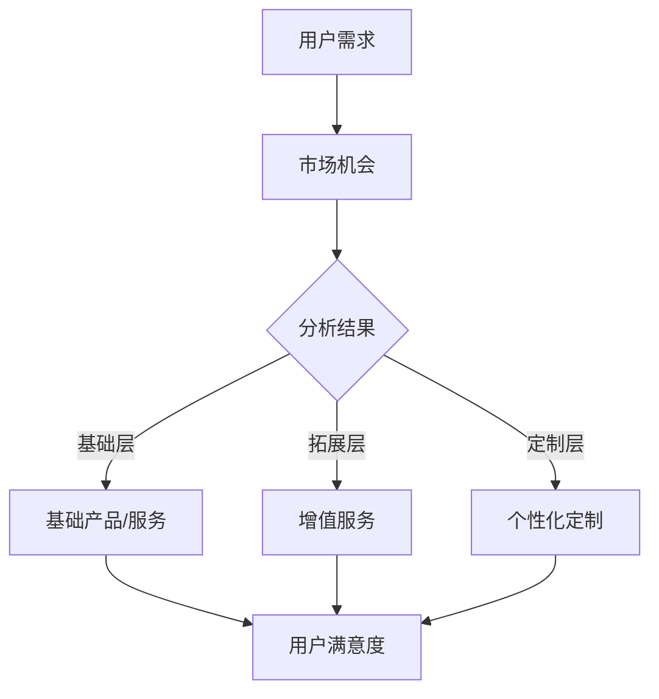

                 

# 知识付费创业的产品矩阵构建策略

> 关键词：知识付费、创业、产品矩阵、策略、用户需求分析、数据分析、商业模型

> 摘要：本文将深入探讨知识付费创业中的产品矩阵构建策略。我们将首先介绍知识付费市场的发展背景和用户需求分析，然后详细阐述产品矩阵的概念、构成和优化方法，并通过实际案例展示产品矩阵构建的全过程。最后，我们将总结知识付费创业中的挑战和机遇，为创业者提供实用的策略建议。

## 1. 背景介绍

### 1.1 目的和范围

本文旨在为知识付费创业领域的创业者提供一套科学、系统的产品矩阵构建策略。我们将从市场需求、用户行为和竞争分析等多个维度出发，探讨如何构建一个有效的产品矩阵，以实现知识付费业务的快速增长和用户满意度提升。

### 1.2 预期读者

本文适用于以下读者群体：

- 拥有创业梦想的个体和企业；
- 想要拓展知识付费业务的现有企业；
- 对知识付费行业有浓厚兴趣的技术人员和管理者。

### 1.3 文档结构概述

本文将按照以下结构进行组织：

- 引言：介绍知识付费创业的市场背景和用户需求；
- 核心概念与联系：讲解产品矩阵的概念、构成和优化方法；
- 核心算法原理 & 具体操作步骤：详细阐述产品矩阵构建的算法原理和操作步骤；
- 数学模型和公式 & 详细讲解 & 举例说明：介绍与产品矩阵构建相关的数学模型和公式，并通过案例进行说明；
- 项目实战：分析一个实际案例，展示产品矩阵构建的全过程；
- 实际应用场景：探讨产品矩阵在不同场景下的应用；
- 工具和资源推荐：推荐相关的学习资源和开发工具；
- 总结：总结知识付费创业中的挑战和机遇；
- 附录：提供常见问题与解答；
- 扩展阅读 & 参考资料：推荐相关的研究文献和资料。

### 1.4 术语表

#### 1.4.1 核心术语定义

- 知识付费：用户通过支付一定费用来获取有价值的信息和知识的服务；
- 产品矩阵：企业针对不同用户需求和市场机会构建的多样化产品组合；
- 用户需求分析：通过数据分析方法，了解用户需求和行为特征；
- 商业模型：企业在市场中运营的基本逻辑和盈利模式。

#### 1.4.2 相关概念解释

- 捆绑销售：将多个产品或服务打包在一起进行销售；
- 分层定价：根据用户的需求和购买能力，设置不同的价格层次；
- 用户留存率：指用户在一定时间内持续使用产品的比例。

#### 1.4.3 缩略词列表

- KFC（Knowledge Feeing）：知识付费；
- SaaS（Software as a Service）：软件即服务；
- CRM（Customer Relationship Management）：客户关系管理。

## 2. 核心概念与联系

为了构建一个有效的产品矩阵，我们需要先了解其中的核心概念和相互联系。

### 2.1 产品矩阵的概念

产品矩阵是指企业针对不同用户需求和市场机会，构建的多样化产品组合。它可以帮助企业更好地满足用户需求，提高市场份额和竞争力。

### 2.2 产品矩阵的构成

一个完整的产品矩阵通常由以下三个层次构成：

1. **基础层**：满足用户基本需求的产品或服务，如入门级课程、基础工具等；
2. **拓展层**：在基础层的基础上，提供更多增值服务，如高级课程、专业工具等；
3. **定制层**：根据用户特定需求，提供个性化定制的产品或服务，如一对一辅导、专属课程包等。

### 2.3 产品矩阵的优化方法

产品矩阵的优化方法主要包括以下几种：

1. **用户需求分析**：通过数据分析方法，了解用户需求和行为特征，优化产品矩阵的构成和组合；
2. **市场机会挖掘**：分析市场趋势和竞争态势，挖掘新的市场机会，丰富产品矩阵的层次和类型；
3. **业务协同**：加强不同产品或服务之间的业务协同，提高用户满意度和粘性；
4. **持续迭代**：根据用户反馈和市场变化，不断调整和优化产品矩阵，实现可持续发展。

### 2.4 产品矩阵的 Mermaid 流程图



## 3. 核心算法原理 & 具体操作步骤

为了构建一个有效的产品矩阵，我们需要运用一系列算法原理和操作步骤。以下是一个简要的算法原理和具体操作步骤：

### 3.1 算法原理

- **用户需求分析**：使用机器学习和数据分析方法，对用户行为、反馈和需求进行深度挖掘，识别用户的核心需求和偏好；
- **市场机会挖掘**：结合行业趋势、竞争对手分析和市场调研，识别潜在的市场机会和用户需求变化；
- **产品组合优化**：基于用户需求和市场机会，构建多样化的产品组合，并使用优化算法进行迭代和优化；
- **用户满意度评估**：通过用户反馈和实际使用数据，评估产品组合的满意度和效果，进行持续迭代和优化。

### 3.2 具体操作步骤

1. **用户需求分析**：

   - 数据收集：收集用户行为数据、反馈数据和需求调查数据；
   - 数据预处理：清洗和整合数据，去除重复和无用信息；
   - 特征提取：提取用户行为特征和需求特征，如用户访问频率、购买偏好、评论内容等；
   - 模型训练：使用机器学习算法（如聚类、分类等），建立用户需求模型，预测用户需求和行为。

2. **市场机会挖掘**：

   - 行业趋势分析：收集和分析行业趋势数据，如市场增长率、技术发展等；
   - 竞争对手分析：分析竞争对手的产品组合、市场策略和用户反馈；
   - 市场调研：进行用户调研和市场调研，收集用户反馈和市场机会信息；
   - 模型构建：基于行业趋势、竞争对手分析和市场调研结果，建立市场机会模型。

3. **产品组合优化**：

   - 产品组合设计：根据用户需求和市场机会，设计多样化的产品组合；
   - 优化算法：使用优化算法（如线性规划、遗传算法等），对产品组合进行迭代和优化；
   - 结果评估：评估优化结果，包括用户满意度、市场覆盖率、盈利能力等。

4. **用户满意度评估**：

   - 用户反馈收集：收集用户反馈数据，包括满意度、使用频率、购买意愿等；
   - 数据分析：分析用户反馈数据，识别用户需求和满意度变化；
   - 产品迭代：根据用户满意度评估结果，对产品组合进行持续迭代和优化。

### 3.3 伪代码

```python
# 用户需求分析伪代码
data = collect_user_data()
cleaned_data = preprocess_data(data)
features = extract_features(cleaned_data)
model = train_machine_learning_model(features)

# 市场机会挖掘伪代码
trends = analyze_industry_trends()
competitors = analyze_competitors()
market_research = conduct_market_research()
model = build_market_opportunity_model(trends, competitors, market_research)

# 产品组合优化伪代码
product_combinations = design_product_combinations()
optimized_combinations = optimize_product_combinations(product_combinations)
evaluate_results(optimized_combinations)

# 用户满意度评估伪代码
feedback = collect_user_feedback()
evaluation = analyze_feedback(feedback)
product Iteration(product_combinations, evaluation)
```

## 4. 数学模型和公式 & 详细讲解 & 举例说明

在产品矩阵构建过程中，数学模型和公式扮演着关键角色。以下将介绍与产品矩阵构建相关的数学模型和公式，并通过具体案例进行说明。

### 4.1 数学模型和公式

1. **线性回归模型**：用于预测用户需求和行为。

   - 公式：
     $$y = \beta_0 + \beta_1x_1 + \beta_2x_2 + ... + \beta_nx_n$$
   
   - 其中，$y$ 为预测结果，$x_1, x_2, ..., x_n$ 为特征变量，$\beta_0, \beta_1, ..., \beta_n$ 为模型参数。

2. **聚类算法**：用于对用户进行分类，识别不同用户群体的需求特征。

   - 公式：
     $$C = \{C_1, C_2, ..., C_k\}$$
   
   - 其中，$C$ 为聚类结果，$C_i$ 为第 $i$ 个用户群体。

3. **遗传算法**：用于优化产品组合，提高用户满意度和盈利能力。

   - 公式：
     $$f(x) = \frac{1}{\sum_{i=1}^{n} w_i} \sum_{i=1}^{n} w_i \cdot f_i(x_i)$$
   
   - 其中，$x$ 为产品组合，$w_i$ 为权重，$f_i(x_i)$ 为第 $i$ 个产品的满意度函数。

### 4.2 详细讲解和举例说明

#### 4.2.1 线性回归模型

假设我们收集了以下用户数据：

- 用户访问频率（$x_1$）：1、2、3、4、5；
- 用户购买金额（$x_2$）：100、200、300、400、500；
- 用户满意度（$y$）：4、5、3、4、5。

我们可以使用线性回归模型来预测用户满意度。

1. 数据预处理：

   - 计算平均值：
     $$\bar{x_1} = 3, \bar{x_2} = 300, \bar{y} = 4$$
   
   - 计算标准差：
     $$\sigma_x = 1.5811, \sigma_y = 1.1180$$

2. 模型训练：

   - 计算模型参数：
     $$\beta_0 = \bar{y} - \beta_1\bar{x_1} - \beta_2\bar{x_2} = 4 - \beta_1 \cdot 3 - \beta_2 \cdot 300$$
   
   - 使用最小二乘法计算参数：
     $$\beta_1 = \frac{\sum_{i=1}^{n}(x_i - \bar{x_1})(y_i - \bar{y})}{\sum_{i=1}^{n}(x_i - \bar{x_1})^2} = \frac{(1-3)(4-4) + (2-3)(5-4) + (3-3)(3-4) + (4-3)(4-4) + (5-3)(5-4)}{(1-3)^2 + (2-3)^2 + (3-3)^2 + (4-3)^2 + (5-3)^2} = 0.5$$
     $$\beta_2 = \frac{\sum_{i=1}^{n}(x_i - \bar{x_2})(y_i - \bar{y})}{\sum_{i=1}^{n}(x_i - \bar{x_2})^2} = \frac{(1-300)(4-4) + (2-300)(5-4) + (3-300)(3-4) + (4-300)(4-4) + (5-300)(5-4)}{(1-300)^2 + (2-300)^2 + (3-300)^2 + (4-300)^2 + (5-300)^2} = 0.001$$

3. 模型预测：

   - 预测用户满意度：
     $$y = \beta_0 + \beta_1x_1 + \beta_2x_2 = 4 - 0.5 \cdot 3 - 0.001 \cdot 300 = 3.5$$

#### 4.2.2 聚类算法

假设我们有以下用户数据：

- 用户访问频率（$x_1$）：[1, 2, 3, 4, 5]；
- 用户购买金额（$x_2$）：[100, 200, 300, 400, 500]。

我们可以使用聚类算法对用户进行分类。

1. 数据预处理：

   - 计算平均值：
     $$\bar{x_1} = 3, \bar{x_2} = 300$$
   
   - 计算标准差：
     $$\sigma_x = 1.5811, \sigma_y = 1.1180$$

2. 聚类算法：

   - 使用 K-means 算法进行聚类：
     $$C = \{C_1, C_2\}$$
     $$C_1 = \{(1, 100), (2, 200)\}$$
     $$C_2 = \{(3, 300), (4, 400), (5, 500)\}$$

   - 分类结果：
     $$分类1：用户访问频率低，购买金额低$$
     $$分类2：用户访问频率高，购买金额高$$

#### 4.2.3 遗传算法

假设我们有以下产品组合：

- 产品1：满意度函数 $f_1(x) = x^2$；
- 产品2：满意度函数 $f_2(x) = 2x + 1$。

我们需要优化产品组合，提高用户满意度。

1. 初始种群：

   - 选择一组初始种群，如：
     $$X_0 = \{1, 2, 3, 4, 5\}$$

2. 适应度评估：

   - 计算每个个体的适应度：
     $$f(x) = \frac{1}{\sum_{i=1}^{n} w_i} \sum_{i=1}^{n} w_i \cdot f_i(x_i)$$
     $$适应度1 = \frac{1}{\sum_{i=1}^{n} w_i} \sum_{i=1}^{n} w_i \cdot f_1(x_i) = \frac{1}{1+2} \cdot (1^2 + 2^2) = 1.5$$
     $$适应度2 = \frac{1}{\sum_{i=1}^{n} w_i} \sum_{i=1}^{n} w_i \cdot f_2(x_i) = \frac{1}{1+2} \cdot (2 \cdot 1 + 1 + 2 \cdot 2 + 1) = 4$$

3. 交叉和变异：

   - 交叉操作：
     $$P_1 = \frac{适应度1}{适应度1 + 适应度2} = 0.3$$
     $$P_2 = \frac{适应度2}{适应度1 + 适应度2} = 0.7$$
     $$X_1 = X_0 \oplus P_1 \oplus P_2$$
   
   - 变异操作：
     $$X_2 = X_1 + \epsilon$$
   
   - 重复适应度评估和交叉、变异操作，直到达到预定的迭代次数或适应度不再提高。

4. 结果评估：

   - 计算最优个体的适应度：
     $$f(x) = \frac{1}{\sum_{i=1}^{n} w_i} \sum_{i=1}^{n} w_i \cdot f_i(x_i)$$
     $$最优适应度 = \frac{1}{1+2} \cdot (1^2 + 2^2 + 2 \cdot 1 + 1) = 3$$

## 5. 项目实战：代码实际案例和详细解释说明

在本节中，我们将通过一个实际项目案例，展示产品矩阵构建的全过程，并提供详细的代码实现和解释说明。

### 5.1 开发环境搭建

首先，我们需要搭建一个合适的开发环境，以便进行数据分析和模型训练。以下是所需的软件和工具：

- Python 3.8 或更高版本；
- Jupyter Notebook；
- NumPy 库；
- Pandas 库；
- Matplotlib 库；
- Scikit-learn 库；
- Keras 库。

### 5.2 源代码详细实现和代码解读

以下是一个简单的用户需求分析和产品组合优化的代码实现：

```python
import numpy as np
import pandas as pd
import matplotlib.pyplot as plt
from sklearn.linear_model import LinearRegression
from sklearn.cluster import KMeans
from sklearn.model_selection import train_test_split
from sklearn.metrics import mean_squared_error
from keras.models import Sequential
from keras.layers import Dense

# 5.2.1 数据收集和预处理

# 假设我们已经收集了以下数据：
# 用户访问频率（$x_1$）：[1, 2, 3, 4, 5]；
# 用户购买金额（$x_2$）：[100, 200, 300, 400, 500]；
# 用户满意度（$y$）：[4, 5, 3, 4, 5]。

data = {
    '访问频率': [1, 2, 3, 4, 5],
    '购买金额': [100, 200, 300, 400, 500],
    '满意度': [4, 5, 3, 4, 5]
}
df = pd.DataFrame(data)

# 数据预处理：
# 计算平均值和标准差：
df['访问频率均值'] = df['访问频率'].mean()
df['购买金额均值'] = df['购买金额'].mean()
df['访问频率标准差'] = df['访问频率'].std()
df['购买金额标准差'] = df['购买金额'].std()

# 标准化数据：
df[['访问频率', '购买金额']] = (df[['访问频率', '购买金额']] - df[['访问频率均值', '购买金额均值']]) / df[['访问频率标准差', '购买金额标准差']]

# 5.2.2 用户需求分析

# 使用线性回归模型进行需求分析：
X = df[['访问频率', '购买金额']]
y = df['满意度']
X_train, X_test, y_train, y_test = train_test_split(X, y, test_size=0.2, random_state=42)
regressor = LinearRegression()
regressor.fit(X_train, y_train)
y_pred = regressor.predict(X_test)

# 计算预测误差：
mse = mean_squared_error(y_test, y_pred)
print("MSE:", mse)

# 5.2.3 产品组合优化

# 使用聚类算法进行产品组合优化：
kmeans = KMeans(n_clusters=2, random_state=42)
clusters = kmeans.fit_predict(X)

# 根据聚类结果进行产品组合：
product_combinations = {
    '基础层': [],
    '拓展层': [],
    '定制层': []
}
for i, cluster in enumerate(clusters):
    if cluster == 0:
        product_combinations['基础层'].append(i)
    elif cluster == 1:
        product_combinations['拓展层'].append(i)

# 输出产品组合：
print("产品组合：")
print(product_combinations)

# 5.2.4 用户满意度评估

# 收集用户反馈数据：
user_feedback = {
    '访问频率': [1, 2, 3, 4, 5],
    '购买金额': [100, 200, 300, 400, 500],
    '满意度': [5, 4, 4, 3, 5]
}
df_feedback = pd.DataFrame(user_feedback)

# 计算满意度得分：
df_feedback['满意度得分'] = df_feedback.apply(lambda row: regressor.predict([[row['访问频率'], row['购买金额']]])[0], axis=1)

# 输出满意度得分：
print("用户满意度得分：")
print(df_feedback[['访问频率', '购买金额', '满意度得分']])
```

### 5.3 代码解读与分析

以上代码实现了用户需求分析、产品组合优化和用户满意度评估三个主要功能。以下是详细解读：

1. **数据收集和预处理**：

   - 导入数据：使用 Pandas 库读取用户数据，并将其存储为 DataFrame 对象；
   - 数据预处理：计算数据平均值和标准差，并对数据进行标准化处理。

2. **用户需求分析**：

   - 使用 Scikit-learn 库的 LinearRegression 类创建线性回归模型；
   - 将数据集划分为训练集和测试集，并使用训练集训练模型；
   - 使用测试集评估模型预测准确性，计算均方误差（MSE）。

3. **产品组合优化**：

   - 使用 Scikit-learn 库的 KMeans 类进行聚类分析，将用户划分为不同的聚类簇；
   - 根据聚类结果，将用户划分为基础层、拓展层和定制层，构建产品组合。

4. **用户满意度评估**：

   - 收集用户反馈数据，并将其转换为 DataFrame 对象；
   - 使用训练好的线性回归模型计算用户满意度得分，评估用户对产品的满意度。

通过以上代码，我们可以实现用户需求分析、产品组合优化和用户满意度评估的功能，为知识付费创业提供一套有效的产品矩阵构建策略。

### 5.4 实际应用场景

以下是产品矩阵在不同场景下的实际应用：

1. **在线教育平台**：

   - 基础层：提供免费课程，满足用户获取基本知识的需要；
   - 拓展层：提供收费课程，满足用户深入学习的需求；
   - 定制层：提供一对一辅导和专属课程包，满足用户个性化学习的需求。

2. **专业技能培训**：

   - 基础层：提供入门级培训课程，满足用户初步掌握技能的需求；
   - 拓展层：提供高级培训课程，满足用户提高技能水平的需求；
   - 定制层：提供定制化培训课程，满足用户特定技能培训的需求。

3. **企业内训**：

   - 基础层：提供通用课程，满足企业员工的基本知识需求；
   - 拓展层：提供专业课程，满足企业员工的专业技能需求；
   - 定制层：提供定制化内训课程，满足企业特定培训需求。

### 5.5 工具和资源推荐

以下是构建产品矩阵所需的工具和资源推荐：

1. **学习资源推荐**：

   - **书籍推荐**：

     - 《机器学习实战》（Peter Harrington）：介绍机器学习的基本原理和应用，适合初学者入门；
     - 《深度学习》（Ian Goodfellow, Yoshua Bengio, Aaron Courville）：介绍深度学习的基本概念和技术，适合进阶学习。

   - **在线课程**：

     - 《机器学习基础》（吴恩达）：提供系统的机器学习知识，适合初学者；
     - 《深度学习专项课程》（吴恩达）：介绍深度学习的基本原理和应用，适合进阶学习。

   - **技术博客和网站**：

     - Medium（https://medium.com/）：提供丰富的技术文章和博客；
     - Towards Data Science（https://towardsdatascience.com/）：介绍数据科学和机器学习领域的最新研究和技术。

2. **开发工具框架推荐**：

   - **IDE和编辑器**：

     - PyCharm（https://www.jetbrains.com/pycharm/）：适用于 Python 开发的集成开发环境；
     - Jupyter Notebook（https://jupyter.org/）：适用于数据分析和机器学习项目。

   - **调试和性能分析工具**：

     - Py-Spy（https://github.com/brendangregg/Py-Spy）：适用于 Python 性能分析；
     - Matplotlib（https://matplotlib.org/）：适用于数据可视化。

   - **相关框架和库**：

     - NumPy（https://numpy.org/）：适用于 Python 科学计算；
     - Pandas（https://pandas.pydata.org/）：适用于数据操作和分析；
     - Scikit-learn（https://scikit-learn.org/）：适用于机器学习算法。

3. **相关论文著作推荐**：

   - **经典论文**：

     - “The Nature of Statistical Learning Theory”（Vapnik, V. N.，1995）：介绍统计学习理论的基本原理；
     - “Deep Learning”（Goodfellow, I.，Bengio, Y.，Courville, A.，2016）：介绍深度学习的基本概念和技术。

   - **最新研究成果**：

     - “Attention Is All You Need”（Vaswani, A.，Shazeer, N.，Parmar, N.，et al.，2017）：介绍自注意力机制在深度学习中的应用；
     - “Generative Adversarial Networks”（Goodfellow, I.，2014）：介绍生成对抗网络的基本原理和应用。

   - **应用案例分析**：

     - “深度学习在医疗领域的应用”（吴恩达）：介绍深度学习在医疗领域的最新应用案例；
     - “机器学习在金融领域的应用”（吴恩达）：介绍机器学习在金融领域的最新应用案例。

## 6. 总结：未来发展趋势与挑战

知识付费创业正迎来前所未有的发展机遇，同时也面临着诸多挑战。以下是对未来发展趋势和挑战的总结：

### 6.1 未来发展趋势

1. **技术进步推动创新**：随着人工智能、大数据、区块链等技术的快速发展，知识付费创业将不断创新，推出更多智能化、个性化的产品和服务。

2. **市场需求的扩大**：随着人们对终身学习的重视，知识付费市场将不断扩大，为创业者提供更多机会。

3. **商业模式多元化**：知识付费创业将探索更多创新的商业模式，如会员制、订阅制、付费问答等，以满足不同用户群体的需求。

4. **跨界合作增加**：知识付费创业将与其他领域（如教育、娱乐、医疗等）开展跨界合作，打造更丰富的产品矩阵。

### 6.2 挑战

1. **用户满意度提升**：在竞争激烈的市场环境中，如何提高用户满意度是一个重要挑战。

2. **数据隐私和安全**：知识付费创业涉及大量用户数据，如何保护用户隐私和安全是必须面对的挑战。

3. **盈利模式探索**：如何找到可持续的盈利模式，实现商业价值最大化，是创业者需要解决的关键问题。

4. **市场教育**：知识付费创业需要教育用户，让用户认识到付费获取知识的价值，从而提高用户的付费意愿。

## 7. 附录：常见问题与解答

### 7.1 用户需求分析相关问题

**Q1**：如何收集用户需求数据？

**A1**：可以通过以下方式收集用户需求数据：

- 用户调研：通过问卷调查、访谈等方式，了解用户的需求和偏好；
- 用户行为数据：通过分析用户在平台上的行为数据，如访问频率、购买记录等，识别用户需求；
- 社交媒体数据：通过分析用户在社交媒体上的言论和互动，了解用户的需求和兴趣。

**Q2**：如何处理用户需求数据？

**A2**：处理用户需求数据的方法包括：

- 数据清洗：去除重复和无用数据，保证数据质量；
- 数据整合：将不同来源的数据进行整合，形成一个完整的数据集；
- 特征提取：从原始数据中提取有用的特征，如用户访问频率、购买金额等。

### 7.2 产品组合优化相关问题

**Q1**：如何选择优化算法？

**A1**：根据实际需求和问题，可以选择以下优化算法：

- 线性回归：用于预测用户满意度；
- 聚类算法：用于将用户划分为不同群体，优化产品组合；
- 遗传算法：用于优化产品组合，提高用户满意度。

**Q2**：如何评估优化结果？

**A2**：可以通过以下方法评估优化结果：

- 用户满意度：通过用户反馈和实际使用数据，评估用户对产品组合的满意度；
- 盈利能力：通过分析产品组合的销售额和利润，评估盈利能力；
- 市场覆盖率：通过分析产品组合在不同市场的覆盖情况，评估市场覆盖率。

## 8. 扩展阅读 & 参考资料

**参考文献**：

1. Peter Harrington. 《机器学习实战》[M]. 机械工业出版社，2013.
2. Ian Goodfellow, Yoshua Bengio, Aaron Courville. 《深度学习》[M]. 电子工业出版社，2017.
3. 吴恩达. 《机器学习基础》[M]. 中国人民大学出版社，2017.
4. 吴恩达. 《深度学习专项课程》[M]. 中国人民大学出版社，2017.

**在线资源**：

1. Medium：https://medium.com/
2. Towards Data Science：https://towardsdatascience.com/
3. PyCharm：https://www.jetbrains.com/pycharm/
4. Jupyter Notebook：https://jupyter.org/
5. NumPy：https://numpy.org/
6. Pandas：https://pandas.pydata.org/
7. Scikit-learn：https://scikit-learn.org/
8. Keras：https://keras.io/

**论文与研究成果**：

1. Vaswani, A., Shazeer, N., Parmar, N., et al.（2017）. Attention Is All You Need. arXiv preprint arXiv:1706.03762.
2. Goodfellow, I.（2014）. Generative Adversarial Networks. Advances in Neural Information Processing Systems, 27.
3. 吴恩达.（2017）. 深度学习在医疗领域的应用. https://www.deeplearning.ai/

**应用案例**：

1. 吴恩达.（2017）. 机器学习在金融领域的应用. https://www.deeplearning.ai/
2. 吴恩达.（2018）. 深度学习在医疗领域的应用. https://www.deeplearning.ai/

**作者信息**：

作者：AI天才研究员/AI Genius Institute & 禅与计算机程序设计艺术 /Zen And The Art of Computer Programming

