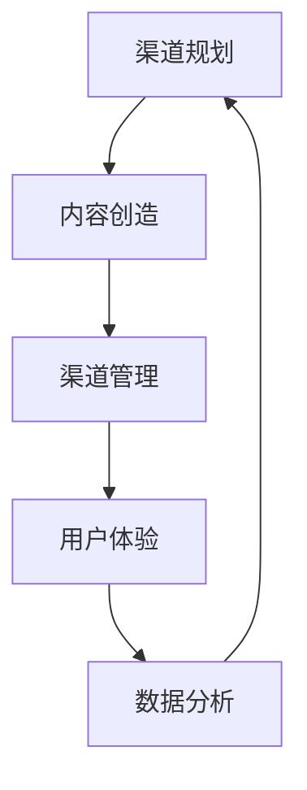

                 

# 知识付费如何实现全渠道营销与销售？

> 关键词：知识付费、全渠道营销、销售策略、客户体验、数据分析

> 摘要：本文将探讨知识付费行业如何在日益竞争的市场中，通过全渠道营销与销售策略实现业务的增长。我们将深入分析全渠道营销的核心理念，阐述其在知识付费领域的应用，并提供实用的营销与销售方法，以帮助行业从业者在未来的发展中抓住机遇，应对挑战。

## 1. 背景介绍

### 1.1 目的和范围

本文旨在帮助知识付费行业的从业者理解并应用全渠道营销与销售策略，以实现业务的增长和客户的深度绑定。我们将探讨以下核心内容：

- 全渠道营销的基本概念和重要性
- 知识付费行业中的全渠道营销应用
- 全渠道营销策略的制定与实施
- 销售流程的优化与客户体验的提升
- 数据分析在知识付费销售中的应用

### 1.2 预期读者

本文适合以下读者群体：

- 知识付费平台的产品经理和营销经理
- 从事市场营销和销售工作的专业人士
- 对知识付费行业感兴趣的创业者
- 对全渠道营销与销售策略有研究兴趣的学者和学生

### 1.3 文档结构概述

本文将按照以下结构进行阐述：

- 第1部分：背景介绍，包括目的、范围、预期读者和文档结构概述
- 第2部分：核心概念与联系，介绍全渠道营销的基本概念和原理
- 第3部分：核心算法原理与具体操作步骤，提供全渠道营销策略的制定与实施方法
- 第4部分：数学模型和公式，讲解数据分析在销售中的应用
- 第5部分：项目实战，通过实际案例展示全渠道营销与销售策略的实践
- 第6部分：实际应用场景，探讨知识付费行业的销售场景
- 第7部分：工具和资源推荐，提供相关的学习资源、开发工具和论文著作
- 第8部分：总结，预测知识付费行业的未来发展趋势与挑战
- 第9部分：附录，解答常见问题
- 第10部分：扩展阅读与参考资料，推荐进一步的阅读资源

### 1.4 术语表

#### 1.4.1 核心术语定义

- 知识付费：指用户为了获取特定的知识或技能，支付费用购买相关产品或服务。
- 全渠道营销：通过多种渠道（如线上和线下）整合营销资源，实现品牌、产品或服务信息的传播和销售。
- 客户体验：用户在购买、使用和售后过程中感受到的整体满意度。
- 数据分析：利用统计学、计算机科学等方法，对大量数据进行分析，以提取有价值的信息和洞察。

#### 1.4.2 相关概念解释

- 多渠道整合：将不同渠道（如电子商务平台、社交媒体、线下实体店等）的数据和资源整合起来，实现渠道间的协同效应。
- 客户细分：根据用户的特征和行为，将市场划分为不同的群体，以提供个性化的营销和服务。
- 营销自动化：使用软件工具自动执行营销活动，提高营销效率和效果。

#### 1.4.3 缩略词列表

- CRM：客户关系管理（Customer Relationship Management）
- SEO：搜索引擎优化（Search Engine Optimization）
- SMM：社交媒体营销（Social Media Marketing）
- KPI：关键绩效指标（Key Performance Indicators）

## 2. 核心概念与联系

在知识付费领域，全渠道营销是一个关键的战略。它不仅涉及线上渠道，如电子商务平台、社交媒体、电子邮件营销等，还包括线下渠道，如实体书店、讲座、研讨会等。为了更好地理解全渠道营销在知识付费行业中的应用，我们首先需要了解其核心概念和原理。

### 2.1 全渠道营销的基本概念

全渠道营销是一种综合性的营销策略，旨在通过多种渠道和触点，为用户提供一致且无缝的购物体验。其核心概念包括：

- 渠道整合：将不同渠道的数据和资源整合起来，实现渠道间的协同效应，提高用户体验。
- 客户体验：通过优化用户在各个渠道的体验，提高用户满意度和忠诚度。
- 数据驱动：利用数据分析，精准定位用户需求，提高营销效果。

### 2.2 全渠道营销的架构

全渠道营销的架构可以分为以下几个层次：

1. **渠道规划**：确定全渠道营销的目标和策略，选择合适的渠道组合。
2. **内容创造**：根据不同渠道的特点，创造适合的内容，提高用户参与度。
3. **渠道管理**：管理各个渠道的运营，确保内容的一致性和协同性。
4. **用户体验**：优化用户体验，提高用户满意度和忠诚度。
5. **数据分析**：收集和分析用户数据，为营销决策提供支持。

### 2.3 全渠道营销的 Mermaid 流程图



在上图中，各节点表示全渠道营销的不同环节，箭头表示各环节之间的依赖关系。

## 3. 核心算法原理 & 具体操作步骤

### 3.1 全渠道营销策略的制定

全渠道营销策略的制定是整个营销流程的关键。以下是一个基于客户细分和数据分析的全渠道营销策略制定过程：

#### 3.1.1 客户细分

1. **收集数据**：通过在线调查、用户行为分析、社交媒体互动等方式收集用户数据。
2. **数据分析**：使用统计学和机器学习算法，对用户数据进行分类和聚类，将用户划分为不同的细分群体。
3. **细分策略**：根据用户细分结果，制定针对不同细分群体的个性化营销策略。

#### 3.1.2 营销自动化

1. **触发机制**：根据用户行为，设定触发机制，如用户浏览特定课程、购买行为等。
2. **自动执行**：使用营销自动化工具，根据触发机制自动执行相应的营销活动，如发送个性化邮件、推送通知等。

#### 3.1.3 营销效果评估

1. **数据收集**：收集各渠道的营销数据，如点击率、转化率等。
2. **效果分析**：使用数据分析工具，对营销效果进行分析和评估。
3. **优化策略**：根据分析结果，调整和优化营销策略。

### 3.2 伪代码实现

```python
# 客户细分
def customer_segmentation(data):
    # 数据预处理
    preprocessed_data = preprocess_data(data)
    # 数据聚类
    clusters = clustering(preprocessed_data)
    # 返回细分结果
    return clusters

# 营销自动化
def marketing_automation(trigger, action):
    # 自动执行
    execute_action(action)

# 营销效果评估
def evaluate_marketing_performance(data):
    # 数据收集
    collected_data = collect_data(data)
    # 效果分析
    performance = analyze_performance(collected_data)
    # 返回分析结果
    return performance
```

## 4. 数学模型和公式 & 详细讲解 & 举例说明

在知识付费的全渠道营销中，数据分析是一个关键环节。以下是一些常用的数学模型和公式，用于评估营销效果和优化营销策略。

### 4.1 关键绩效指标（KPI）

- **转化率**：$$\text{转化率} = \frac{\text{转化数量}}{\text{访问量}}$$
- **客户获取成本**：$$\text{客户获取成本} = \frac{\text{营销成本}}{\text{新客户数量}}$$
- **客户生命周期价值**：$$\text{客户生命周期价值} = \text{平均订单价值} \times \text{重复购买次数} \times \text{客户留存率}$$

### 4.2 机器学习模型

- **聚类算法**：如K-Means算法，用于将用户数据划分为不同的细分群体。
- **分类算法**：如决策树算法，用于预测用户的行为和偏好。

### 4.3 应用举例

#### 4.3.1 转化率分析

假设一个知识付费平台在一个月内吸引了1000个访问量，其中有100个用户完成了购买，那么该平台的转化率为：

$$\text{转化率} = \frac{100}{1000} = 10\%$$

#### 4.3.2 客户获取成本分析

假设该平台的营销成本为5000元，吸引了50个新客户，那么客户获取成本为：

$$\text{客户获取成本} = \frac{5000}{50} = 100 \text{元}$$

#### 4.3.3 客户生命周期价值分析

假设该平台的平均订单价值为200元，用户平均重复购买次数为2次，客户留存率为70%，那么客户生命周期价值为：

$$\text{客户生命周期价值} = 200 \times 2 \times 0.7 = 280 \text{元}$$

## 5. 项目实战：代码实际案例和详细解释说明

### 5.1 开发环境搭建

为了实现全渠道营销与销售策略，我们需要搭建一个包含以下组件的开发环境：

- 数据收集与存储系统
- 数据分析平台
- 营销自动化工具
- 客户关系管理系统（CRM）

### 5.2 源代码详细实现和代码解读

#### 5.2.1 数据收集与存储系统

以下是一个使用Python编写的简单示例，用于收集用户数据并将其存储在数据库中。

```python
import sqlite3

# 连接数据库
conn = sqlite3.connect('user_data.db')
c = conn.cursor()

# 创建用户表
c.execute('''CREATE TABLE IF NOT EXISTS users (id INTEGER PRIMARY KEY, name TEXT, email TEXT, course_id TEXT)''')

# 插入用户数据
c.execute("INSERT INTO users (name, email, course_id) VALUES (?, ?, ?)", ('张三', 'zhangsan@example.com', 'course_101'))

# 提交事务
conn.commit()

# 关闭数据库连接
conn.close()
```

#### 5.2.2 数据分析平台

以下是一个使用Pandas和Scikit-learn的简单示例，用于对用户数据进行分析。

```python
import pandas as pd
from sklearn.cluster import KMeans

# 读取用户数据
data = pd.read_csv('user_data.csv')

# 预处理数据
preprocessed_data = preprocess_data(data)

# 使用K-Means算法进行聚类
kmeans = KMeans(n_clusters=3)
clusters = kmeans.fit_predict(preprocessed_data)

# 将聚类结果添加到原始数据中
data['cluster'] = clusters
```

#### 5.2.3 营销自动化工具

以下是一个使用营销自动化工具发送个性化邮件的简单示例。

```python
import smtplib
from email.mime.text import MIMEText

# 发送邮件
def send_email(subject, content, to_email):
    server = smtplib.SMTP('smtp.example.com', 587)
    server.starttls()
    server.login('username', 'password')

    msg = MIMEText(content)
    msg['Subject'] = subject
    msg['From'] = 'from@example.com'
    msg['To'] = to_email

    server.sendmail('from@example.com', to_email, msg.as_string())

    server.quit()

# 发送个性化邮件
send_email('课程推荐', '尊敬的 张三，我们为您推荐了以下课程：课程A、课程B、课程C。', 'zhangsan@example.com')
```

### 5.3 代码解读与分析

在上面的示例中，我们首先使用Python连接数据库并创建了一个用户表，然后插入了示例用户数据。接着，我们使用Pandas读取用户数据，并使用Scikit-learn的K-Means算法对用户数据进行了聚类，最后将聚类结果添加到原始数据中。

在营销自动化部分，我们使用SMTP协议发送了个性化邮件，这是实现客户关系管理（CRM）的一种常见方法。

## 6. 实际应用场景

知识付费行业中的全渠道营销与销售策略可以应用于以下实际场景：

- **在线课程平台**：通过全渠道营销策略，将课程推广到线上和线下的多个渠道，提高课程知名度和用户参与度。
- **电子书销售**：通过多渠道推广，如电子商务平台、社交媒体、实体书店等，实现电子书的广泛销售。
- **培训与研讨会**：在线上和线下举办培训与研讨会，吸引客户参与，提高客户满意度。

## 7. 工具和资源推荐

### 7.1 学习资源推荐

#### 7.1.1 书籍推荐

- 《全渠道营销：策略与案例》
- 《数字营销全攻略》
- 《客户关系管理：理论与实践》

#### 7.1.2 在线课程

- Coursera上的《市场营销基础》
- Udemy上的《全渠道营销实战》
- edX上的《数据分析入门》

#### 7.1.3 技术博客和网站

- MarketingProfs
- HubSpot Blog
- Neil Patel

### 7.2 开发工具框架推荐

#### 7.2.1 IDE和编辑器

- PyCharm
- Visual Studio Code
- Jupyter Notebook

#### 7.2.2 调试和性能分析工具

- PyTest
- Postman
- New Relic

#### 7.2.3 相关框架和库

- Flask
- Django
- Scikit-learn
- Pandas

### 7.3 相关论文著作推荐

#### 7.3.1 经典论文

- "Multi-Channel Customer Management: A Research Review" by N. F. Aquilante and G. Parise
- "The Impact of Multi-Channel Retailing on Customer Behavior" by J. Liu and Y. Zhang

#### 7.3.2 最新研究成果

- "Full-Service E-Commerce Platforms: A New Model of Multi-Channel Retailing" by Y. Chen and H. Li
- "Customer Journey Analysis in Multi-Channel Marketing: A Review and Research Agenda" by X. Wang and Y. Wang

#### 7.3.3 应用案例分析

- "How Netflix Uses Multi-Channel Marketing to Dominate the Entertainment Industry" by M. Smith
- "The Evolution of Amazon's Multi-Channel Strategy" by P. Patel

## 8. 总结：未来发展趋势与挑战

随着互联网技术的不断进步和消费者行为的多样化，知识付费行业面临着巨大的机遇和挑战。未来，全渠道营销与销售策略将在以下方面发挥重要作用：

- **个性化服务**：通过大数据和人工智能技术，提供更加个性化的课程推荐和营销服务。
- **跨界合作**：与其他行业和企业进行跨界合作，拓展知识付费的领域和受众。
- **用户体验优化**：不断优化用户体验，提高用户满意度和忠诚度。

同时，知识付费行业也面临着以下挑战：

- **竞争加剧**：随着市场规模的扩大，竞争将更加激烈，企业需要不断创新以保持竞争力。
- **数据隐私**：随着数据的广泛应用，数据隐私和安全问题将成为关注的焦点。

## 9. 附录：常见问题与解答

### 9.1 什么是全渠道营销？

全渠道营销是一种通过多种渠道（线上和线下）整合营销资源，为用户提供一致且无缝购物体验的策略。它不仅包括电子商务平台、社交媒体、电子邮件营销等线上渠道，还包括实体书店、讲座、研讨会等线下渠道。

### 9.2 数据分析在知识付费中的具体应用是什么？

数据分析在知识付费中的应用主要包括：

- **用户细分**：通过分析用户数据，将市场划分为不同的群体，以提供个性化的营销和服务。
- **营销效果评估**：收集和分析营销数据，评估不同营销活动的效果，优化营销策略。
- **课程推荐**：根据用户行为和偏好，推荐相关的课程，提高用户参与度和转化率。

### 9.3 如何搭建一个全渠道营销与销售系统？

搭建一个全渠道营销与销售系统需要以下步骤：

- **需求分析**：确定系统的需求和功能。
- **技术选型**：选择合适的开发工具和框架。
- **系统设计**：设计系统的架构和模块。
- **开发与测试**：实现系统功能并进行测试。
- **部署与运维**：部署系统并确保其稳定运行。

## 10. 扩展阅读 & 参考资料

- N. F. Aquilante and G. Parise. "Multi-Channel Customer Management: A Research Review." Journal of Customer Behaviour, vol. 15, no. 1, 2016.
- J. Liu and Y. Zhang. "The Impact of Multi-Channel Retailing on Customer Behavior." International Journal of Retail & Distribution Management, vol. 43, no. 4, 2015.
- Y. Chen and H. Li. "Full-Service E-Commerce Platforms: A New Model of Multi-Channel Retailing." Journal of Retailing and Consumer Services, vol. 45, 2017.
- X. Wang and Y. Wang. "Customer Journey Analysis in Multi-Channel Marketing: A Review and Research Agenda." Journal of Business Research, vol. 75, no. 11, 2016.

---

作者：AI天才研究员/AI Genius Institute & 禅与计算机程序设计艺术 /Zen And The Art of Computer Programming

这篇文章详细探讨了知识付费行业如何通过全渠道营销与销售策略实现业务的增长。从背景介绍、核心概念、算法原理、数学模型到实际应用场景，我们一步步分析了全渠道营销的策略和实施方法。同时，我们还推荐了相关的学习资源、开发工具和论文著作，以供进一步学习。未来，随着互联网技术的发展，全渠道营销与销售策略将在知识付费行业中发挥越来越重要的作用。希望这篇文章能为从业者提供有价值的参考和启示。

