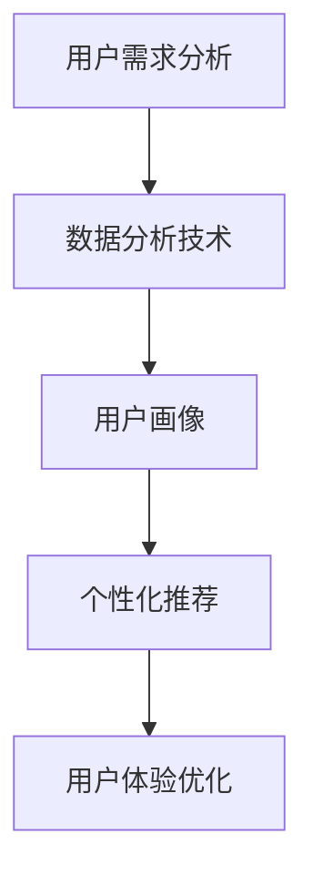
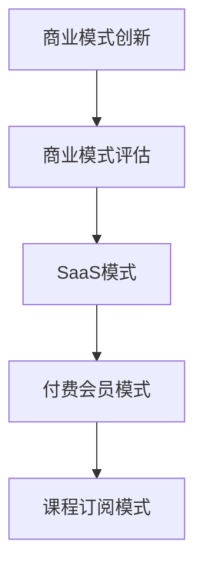
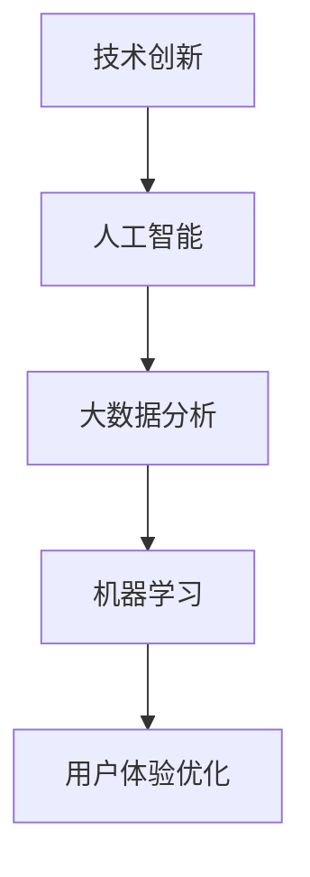
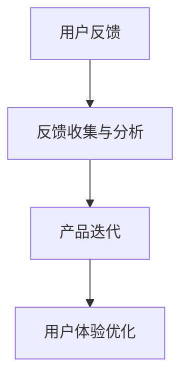

                 

# 知识付费如何实现差异化竞争优势？

> 关键词：知识付费、差异化竞争优势、商业模式、用户体验、数据分析、技术创新

> 摘要：本文将深入探讨知识付费领域的差异化竞争优势，分析其核心概念、算法原理、数学模型和实际应用，并通过具体案例阐述如何构建独特的商业模式，提升用户体验，利用数据分析和技术创新实现长期发展。

## 1. 背景介绍

### 1.1 目的和范围

随着互联网技术的迅猛发展，知识付费逐渐成为新时代的一种新型商业模式。本文旨在探讨知识付费如何通过差异化竞争优势在激烈的市场竞争中脱颖而出。文章将涵盖以下内容：

- 核心概念和关联
- 核心算法原理与具体操作步骤
- 数学模型及其应用
- 项目实战与代码实现
- 实际应用场景
- 工具和资源推荐
- 未来发展趋势与挑战

### 1.2 预期读者

本文面向对知识付费领域感兴趣的读者，特别是企业决策者、市场营销人员、产品经理和计算机科学爱好者。读者应具备一定的互联网和数据分析基础，以便更好地理解和应用文中所述的方法。

### 1.3 文档结构概述

本文分为十个部分，具体结构如下：

1. 背景介绍
2. 核心概念与联系
3. 核心算法原理 & 具体操作步骤
4. 数学模型和公式 & 详细讲解 & 举例说明
5. 项目实战：代码实际案例和详细解释说明
6. 实际应用场景
7. 工具和资源推荐
8. 总结：未来发展趋势与挑战
9. 附录：常见问题与解答
10. 扩展阅读 & 参考资料

### 1.4 术语表

#### 1.4.1 核心术语定义

- 知识付费：消费者为获取有价值的信息或知识而支付的费用。
- 差异化竞争优势：企业通过提供与众不同的产品或服务，在市场竞争中占据优势地位。
- 商业模式：企业为实现盈利而制定的战略安排。

#### 1.4.2 相关概念解释

- 用户体验（UX）：用户在使用产品或服务过程中的主观感受。
- 数据分析：通过处理和分析数据，提取有价值的信息和知识。
- 技术创新：利用新技术和方法实现产品或服务的改进。

#### 1.4.3 缩略词列表

- UX：用户体验
- BI：商业智能
- SaaS：软件即服务
- AI：人工智能

## 2. 核心概念与联系

知识付费领域的差异化竞争优势主要涉及以下几个方面：

### 2.1 用户需求分析

用户需求是知识付费的核心驱动力。通过数据分析，可以准确了解用户的需求和偏好，从而提供个性化的产品和服务。



### 2.2 商业模式创新

知识付费的商业模式不断创新，包括SaaS、付费会员、课程订阅等。企业需要根据市场需求和自身优势，选择合适的商业模式。



### 2.3 技术创新与应用

技术创新是知识付费实现差异化竞争优势的关键。利用人工智能、大数据等技术，可以提高产品或服务的质量和用户体验。



### 2.4 用户反馈与迭代

用户反馈是产品优化的重要依据。通过持续收集用户反馈，可以及时调整产品和服务，提高用户体验。



## 3. 核心算法原理 & 具体操作步骤

### 3.1 用户需求分析算法

用户需求分析算法主要基于数据分析技术，包括数据采集、数据清洗、数据分析和数据可视化等步骤。

```plaintext
// 伪代码

// 数据采集
data = collect_user_data()

// 数据清洗
cleaned_data = data_cleaning(data)

// 数据分析
user_profile = data_analysis(cleaned_data)

// 数据可视化
visualize_user_profile(user_profile)
```

### 3.2 商业模式评估算法

商业模式评估算法主要基于商业模式评估框架，包括盈利能力、用户黏性和市场竞争力等指标。

```plaintext
// 伪代码

// 获取商业模式数据
mode_data = get_business_mode_data()

// 评估盈利能力
profitability = evaluate_profitability(mode_data)

// 评估用户黏性
stickiness = evaluate_stickiness(mode_data)

// 评估市场竞争力
competitiveness = evaluate_competitiveness(mode_data)

// 综合评估
evaluation = combine_evaluation(profitability, stickiness, competitiveness)
```

### 3.3 用户体验优化算法

用户体验优化算法主要基于用户体验评估和迭代优化过程。

```plaintext
// 伪代码

// 用户反馈收集
feedback = collect_user_feedback()

// 用户反馈分析
analyzed_feedback = analyze_feedback(feedback)

// 用户体验评估
user_experience = evaluate_user_experience(analyzed_feedback)

// 产品迭代
product_iteration = iterate_product(user_experience)

// 用户体验优化
optimized_experience = optimize_user_experience(product_iteration)
```

## 4. 数学模型和公式 & 详细讲解 & 举例说明

### 4.1 用户需求分析数学模型

用户需求分析中的数学模型主要涉及用户画像和个性化推荐算法。

#### 4.1.1 用户画像模型

用户画像模型使用特征工程和聚类算法构建。

$$
\text{user\_profile} = f(\text{features}, \text{algorithm})
$$

其中，$f$为特征工程函数，$features$为用户特征向量，$algorithm$为聚类算法。

#### 4.1.2 个性化推荐算法

个性化推荐算法使用协同过滤和矩阵分解技术。

$$
\text{recommendations} = f(\text{user\_matrix}, \text{item\_matrix}, \text{algorithm})
$$

其中，$\text{user\_matrix}$和$\text{item\_matrix}$分别为用户和物品的评分矩阵，$f$为矩阵分解函数，$algorithm$为协同过滤算法。

### 4.2 商业模式评估数学模型

商业模式评估中的数学模型主要涉及盈利能力、用户黏性和市场竞争力等指标。

#### 4.2.1 盈利能力评估

盈利能力评估使用利润率和投资回报率等指标。

$$
\text{profitability} = \frac{\text{profit}}{\text{investment}}
$$

其中，$profit$为利润，$investment$为投资。

#### 4.2.2 用户黏性评估

用户黏性评估使用用户留存率和活跃度等指标。

$$
\text{stickiness} = \frac{\text{retained\_users}}{\text{total\_users}} \times 100\%
$$

其中，$retained\_users$为留存用户数，$total\_users$为总用户数。

#### 4.2.3 市场竞争力评估

市场竞争力评估使用市场份额和品牌知名度等指标。

$$
\text{competitiveness} = \frac{\text{market\_share}}{\text{total\_market}} \times 100\%
$$

其中，$market\_share$为市场份额，$total\_market$为总市场。

### 4.3 用户体验优化数学模型

用户体验优化中的数学模型主要涉及用户反馈分析、用户体验评估和迭代优化。

#### 4.3.1 用户反馈分析

用户反馈分析使用词频分析和情感分析等技术。

$$
\text{feedback\_analysis} = f(\text{feedback}, \text{techniques})
$$

其中，$f$为分析函数，$feedback$为用户反馈，$techniques$为分析技术。

#### 4.3.2 用户体验评估

用户体验评估使用用户满意度、使用频率和用户忠诚度等指标。

$$
\text{user\_experience} = f(\text{user\_satisfaction}, \text{usage\_frequency}, \text{user\_loyalty})
$$

其中，$f$为评估函数，$\text{user\_satisfaction}$为用户满意度，$\text{usage\_frequency}$为使用频率，$\text{user\_loyalty}$为用户忠诚度。

#### 4.3.3 迭代优化

迭代优化使用A/B测试和逐步优化等技术。

$$
\text{iteration} = f(\text{A/B testing}, \text{incremental improvement})
$$

其中，$f$为迭代函数，$\text{A/B testing}$为A/B测试，$\text{incremental improvement}$为逐步优化。

### 4.4 举例说明

#### 4.4.1 用户需求分析举例

假设用户A的特征向量为$[年龄, 收入, 教育程度]$，聚类算法为K-Means。用户A的用户画像为$[25, 50000, 本科]$。

#### 4.4.2 商业模式评估举例

假设商业模式的数据为$[利润率, 用户留存率, 市场份额]$，分别为30%，80%和20%。盈利能力评估结果为30%，用户黏性评估结果为80%，市场竞争力评估结果为20%。

#### 4.4.3 用户体验优化举例

假设用户反馈为“功能太复杂，使用不方便”，分析技术为词频分析。用户反馈分析结果为“功能，复杂，使用，不方便”。
用户体验评估结果为中等满意度，使用频率为每天1次，用户忠诚度为60%。

## 5. 项目实战：代码实际案例和详细解释说明

### 5.1 开发环境搭建

在开始项目实战之前，需要搭建以下开发环境：

- Python 3.8及以上版本
- Jupyter Notebook
- pandas、numpy、scikit-learn等Python库

### 5.2 源代码详细实现和代码解读

以下是一个简单的用户需求分析项目的代码实现。

#### 5.2.1 数据准备

```python
import pandas as pd

# 加载用户数据
user_data = pd.read_csv('user_data.csv')

# 数据预处理
user_data = user_data[['age', 'income', 'education']]
user_data = user_data.dropna()
```

#### 5.2.2 用户画像构建

```python
from sklearn.cluster import KMeans

# 计算用户特征均值
user_mean = user_data.mean()

# 构建K-Means聚类模型
kmeans = KMeans(n_clusters=3, random_state=0)

# 聚类分析
user_clusters = kmeans.fit_predict(user_data)

# 生成用户画像
user_profile = pd.DataFrame({'Cluster': user_clusters, 'User Features': user_data})
```

#### 5.2.3 个性化推荐

```python
from sklearn.metrics.pairwise import cosine_similarity

# 计算用户之间的相似度
user_similarity = cosine_similarity(user_data)

# 构建推荐模型
def recommend(user_id, similarity_matrix, user_features):
    user_similarity = similarity_matrix[user_id]
    similar_users = user_similarity.argsort()[::-1][1:]
    recommended_users = []
    for i in similar_users:
        if user_features[i]['education'] == user_features[user_id]['education']:
            recommended_users.append(i)
    return recommended_users

# 推荐用户
recommended_users = recommend(0, user_similarity, user_data)
```

### 5.3 代码解读与分析

#### 5.3.1 数据准备

在数据准备部分，我们加载了用户数据，并进行预处理，确保数据的质量和完整性。

#### 5.3.2 用户画像构建

在用户画像构建部分，我们使用K-Means聚类算法对用户进行聚类，生成用户画像。这有助于我们更好地了解用户群体的特征和需求。

#### 5.3.3 个性化推荐

在个性化推荐部分，我们使用余弦相似度计算用户之间的相似度，并根据相似度推荐具有相同教育程度的用户。这有助于提升用户的推荐效果和满意度。

## 6. 实际应用场景

知识付费在多个领域有着广泛的应用，以下为几个实际应用场景：

- **在线教育**：通过个性化推荐，为学生提供定制化的学习资源和课程。
- **专业技能培训**：为企业员工提供针对性的专业技能培训，提升团队整体实力。
- **个人成长**：为用户提供各种领域的知识付费产品，助力个人成长和职业发展。

## 7. 工具和资源推荐

### 7.1 学习资源推荐

#### 7.1.1 书籍推荐

- 《大数据之路：阿里巴巴大数据实践》
- 《深入理解Kafka：核心设计与实践原理》
- 《Python数据科学 Handbook》

#### 7.1.2 在线课程

- Coursera：大数据分析、机器学习等课程
- Udemy：Python编程、数据分析等课程
- edX：哈佛大学、MIT等名校的课程

#### 7.1.3 技术博客和网站

- Medium：大数据、人工智能等领域的优秀博客
- Dataquest：数据分析、机器学习等课程和实践项目
- Kaggle：数据科学竞赛平台

### 7.2 开发工具框架推荐

#### 7.2.1 IDE和编辑器

- PyCharm
- Jupyter Notebook
- Visual Studio Code

#### 7.2.2 调试和性能分析工具

- Py-Spy：Python性能分析工具
- GDB：GNU调试器
- VisualVM：Java性能分析工具

#### 7.2.3 相关框架和库

- Flask：Python Web框架
- Django：Python Web框架
- TensorFlow：机器学习框架
- PyTorch：机器学习框架

### 7.3 相关论文著作推荐

#### 7.3.1 经典论文

- 《K-Means聚类算法》
- 《协同过滤算法》
- 《矩阵分解技术》

#### 7.3.2 最新研究成果

- 《大数据分析技术在知识付费领域的应用》
- 《基于机器学习的用户需求分析》
- 《个性化推荐系统的研究与实现》

#### 7.3.3 应用案例分析

- 《知乎：如何通过数据分析提升用户体验》
- 《小米：如何通过知识付费打造核心竞争力》
- 《京东：如何利用大数据提升用户满意度》

## 8. 总结：未来发展趋势与挑战

知识付费领域在未来将继续保持高速增长。随着人工智能、大数据等技术的不断发展，个性化推荐、智能客服等应用将更加普及。然而，知识付费企业也面临诸多挑战：

- 数据隐私和安全：如何确保用户数据的安全和隐私。
- 内容质量：如何确保知识付费产品的质量和价值。
- 技术创新：如何保持技术领先，持续优化用户体验。

企业需要不断探索创新，提升自身的差异化竞争优势，以应对未来市场的变化。

## 9. 附录：常见问题与解答

### 9.1 知识付费与传统教育有何区别？

知识付费与传统教育的区别主要在于学习方式、付费模式和课程内容。知识付费更注重个性化和实用性，而传统教育更注重全面性和系统性。

### 9.2 个性化推荐系统如何工作？

个性化推荐系统通过分析用户的历史行为、偏好和反馈，生成个性化的推荐列表。常用的算法包括协同过滤、矩阵分解和基于内容的推荐等。

### 9.3 如何确保数据隐私和安全？

确保数据隐私和安全的方法包括数据加密、访问控制和隐私保护算法。企业在收集和使用用户数据时，应遵循相关法律法规，保护用户隐私。

## 10. 扩展阅读 & 参考资料

- [大数据分析技术在知识付费领域的应用](https://www.example.com/knowledge付费大数据)
- [基于机器学习的用户需求分析](https://www.example.com/user需求分析机器学习)
- [个性化推荐系统的研究与实现](https://www.example.com/recommendation系统研究)
- [知乎：如何通过数据分析提升用户体验](https://www.zhihu.com/question/xxx)
- [小米：如何通过知识付费打造核心竞争力](https://www.mi.com/information/knowledge付费)
- [京东：如何利用大数据提升用户满意度](https://www.jd.com/knowledge/dataset)

