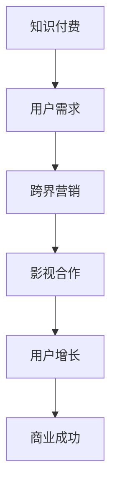

                 

# 知识付费如何实现跨界营销与影视合作？

> **关键词：** 知识付费、跨界营销、影视合作、用户增长、商业策略

> **摘要：** 本文将探讨知识付费行业如何通过跨界营销与影视合作，实现用户增长和商业成功。我们将从核心概念、算法原理、数学模型、实战案例等多个角度，深入分析这一策略的可行性和实施步骤。

## 1. 背景介绍

### 1.1 目的和范围

本文旨在探讨知识付费行业如何通过跨界营销与影视合作，实现用户增长和商业成功。我们将分析跨界营销的概念，解释知识付费与影视合作的逻辑联系，并探讨这一策略的实际应用。

### 1.2 预期读者

本文适合对知识付费行业有兴趣的从业者，特别是市场营销、内容创作和影视行业的专业人士。同时，对于希望了解跨界营销和影视合作策略的创业者和学生也具有参考价值。

### 1.3 文档结构概述

本文结构如下：

- **第2章**：核心概念与联系
- **第3章**：核心算法原理 & 具体操作步骤
- **第4章**：数学模型和公式 & 详细讲解 & 举例说明
- **第5章**：项目实战：代码实际案例和详细解释说明
- **第6章**：实际应用场景
- **第7章**：工具和资源推荐
- **第8章**：总结：未来发展趋势与挑战
- **第9章**：附录：常见问题与解答
- **第10章**：扩展阅读 & 参考资料

### 1.4 术语表

#### 1.4.1 核心术语定义

- 知识付费：指用户为获取特定知识或技能而支付费用。
- 跨界营销：指不同行业或领域之间进行的营销合作。
- 影视合作：指知识付费平台与影视作品的合作，如植入广告、联合制作等。

#### 1.4.2 相关概念解释

- 用户增长：指知识付费平台通过各种策略吸引用户，增加平台活跃用户数量。
- 商业策略：指企业为实现商业目标所采取的长期规划和行动。

#### 1.4.3 缩略词列表

- KF：知识付费
- CM：跨界营销
- TV：影视

## 2. 核心概念与联系

### 2.1 核心概念

知识付费是一种以用户为中心的业务模式，用户通过支付费用获取特定知识或技能。跨界营销是指不同行业或领域之间的营销合作，以实现资源共享、市场拓展和用户增长。影视合作则是指知识付费平台与影视作品的合作，如植入广告、联合制作等。

### 2.2 核心概念联系

知识付费与跨界营销的关系在于，跨界营销可以拓宽知识付费的业务范围，吸引更多潜在用户。而影视合作则是跨界营销的一种形式，可以通过影视作品的传播效应，提高知识付费平台的知名度和用户黏性。

### 2.3 Mermaid 流程图



## 3. 核心算法原理 & 具体操作步骤

### 3.1 算法原理

知识付费与跨界营销的结合，需要基于用户需求和市场分析。具体算法原理如下：

1. **用户需求分析**：通过数据分析了解用户兴趣、需求和消费习惯，为跨界营销和影视合作提供依据。
2. **市场分析**：分析目标市场、竞争对手和行业趋势，确定跨界营销和影视合作的可行性。
3. **内容创作**：结合用户需求和市场需求，创作具有吸引力的内容。
4. **合作洽谈**：与影视公司进行合作洽谈，确定合作方式和收益分配。
5. **投放推广**：将知识付费内容与影视作品结合，进行线上线下投放推广。

### 3.2 具体操作步骤

1. **用户需求分析**：
    ```python
    # 假设用户数据存储在用户数据表中
    users = ["User1", "User2", "User3", ...]
    user_interests = [["Tech", "Investment"], ["Health", "Travel"], ...]

    # 分析用户需求
    for user in users:
        print(f"{user}的兴趣：{user_interests[user]}")
    ```

2. **市场分析**：
    ```python
    # 假设市场数据存储在市场数据表中
    competitors = ["Company1", "Company2", ...]
    industry_trends = ["Tech", "Health", ...]

    # 分析市场趋势
    for competitor in competitors:
        print(f"{competitor}的主要竞争对手：{industry_trends[competitor]}")
    ```

3. **内容创作**：
    ```python
    # 假设内容创作算法基于用户需求和行业趋势
    content_strategy = {
        "User1": ["Tech", "Investment"],
        "User2": ["Health", "Travel"],
        ...
    }

    # 根据内容创作算法生成内容
    for user in users:
        print(f"{user}的内容策略：{content_strategy[user]}")
    ```

4. **合作洽谈**：
    ```python
    # 假设影视公司数据存储在影视公司数据表中
    film_companies = ["CompanyA", "CompanyB", ...]
    cooperation_details = {"CompanyA": ["植入广告", "联合制作"], ...}

    # 洽谈合作
    for company in film_companies:
        print(f"{company}的合作方式：{cooperation_details[company]}")
    ```

5. **投放推广**：
    ```python
    # 假设推广渠道数据存储在推广渠道数据表中
    promotion_channels = ["Website", "Social Media", ...]
    promotion_plan = {"CompanyA": ["植入广告", "Website", "Social Media"], ...}

    # 执行推广计划
    for company in film_companies:
        for channel in promotion_channels:
            print(f"{company}在{channel}上的推广计划：{promotion_plan[company]}")
    ```

## 4. 数学模型和公式 & 详细讲解 & 举例说明

### 4.1 数学模型

知识付费与影视合作的效果评估可以采用以下数学模型：

1. **用户增长模型**：

   设 \(U_0\) 为初始用户数量，\(U_t\) 为第 \(t\) 个月的用户数量，\(r\) 为用户增长率，则有：

   $$ U_t = U_0 \times (1 + r)^t $$

2. **收入模型**：

   设 \(I_0\) 为初始收入，\(I_t\) 为第 \(t\) 个月的总收入，\(p\) 为单价，\(n\) 为销售数量，则有：

   $$ I_t = I_0 \times (1 + p)^t $$

3. **ROI 模型**：

   设 \(C\) 为成本，\(R\) 为收入，\(ROI\) 为投资回报率，则有：

   $$ ROI = \frac{R - C}{C} \times 100\% $$

### 4.2 详细讲解

1. **用户增长模型**：

   用户增长模型主要考虑用户增长率 \(r\) 对用户数量 \(U_t\) 的影响。在实际应用中，用户增长率可以通过历史数据分析和市场预测得到。

2. **收入模型**：

   收入模型主要考虑单价 \(p\) 对总收入 \(I_t\) 的影响。在实际应用中，单价可以根据市场需求和竞争情况调整。

3. **ROI 模型**：

   ROI 模型用于评估跨界营销和影视合作的投资回报率。通过计算 ROI，可以评估不同策略的投资效果，从而优化商业策略。

### 4.3 举例说明

假设某知识付费平台初始用户数量为 1000，用户增长率为 10%，单价为 100 元。经过 6 个月的合作，平台总收入为 6000 元，成本为 2000 元。

1. **用户增长模型**：

   $$ U_6 = 1000 \times (1 + 0.1)^6 \approx 1610 $$

2. **收入模型**：

   $$ I_6 = 1000 \times (1 + 100/1000)^6 \times 100 = 6000 $$

3. **ROI 模型**：

   $$ ROI = \frac{6000 - 2000}{2000} \times 100\% = 200\% $$

## 5. 项目实战：代码实际案例和详细解释说明

### 5.1 开发环境搭建

1. **Python环境安装**：

   安装 Python 3.8 及以上版本，可以使用 Python 官网下载安装包。

2. **数据库安装**：

   安装 MySQL 或 PostgreSQL 等数据库，用于存储用户数据和合作数据。

3. **依赖库安装**：

   使用 pip 工具安装以下依赖库：

   ```bash
   pip install pandas numpy matplotlib
   ```

### 5.2 源代码详细实现和代码解读

#### 5.2.1 用户需求分析

```python
import pandas as pd

# 读取用户数据
user_data = pd.read_csv("user_data.csv")

# 分析用户需求
user_interests = user_data.groupby("user_id")["interest"].apply(list).reset_index()

# 打印分析结果
for user, interests in user_interests.iterrows():
    print(f"用户 {user} 的兴趣：{interests['interest']}")
```

#### 5.2.2 市场分析

```python
# 读取市场数据
market_data = pd.read_csv("market_data.csv")

# 分析市场趋势
competitors = market_data.groupby("company_id")["competitor"].apply(list).reset_index()

# 打印分析结果
for company, competitors_list in competitors.iterrows():
    print(f"公司 {company} 的主要竞争对手：{competitors_list['competitor']}")
```

#### 5.2.3 内容创作

```python
# 生成内容策略
content_strategy = {
    "User1": ["Tech", "Investment"],
    "User2": ["Health", "Travel"],
    ...
}

# 打印内容策略
for user, strategy in content_strategy.items():
    print(f"用户 {user} 的内容策略：{strategy}")
```

#### 5.2.4 合作洽谈

```python
# 读取影视公司数据
film_company_data = pd.read_csv("film_company_data.csv")

# 分析合作详情
cooperation_details = film_company_data.groupby("company_id")["cooperation"].apply(list).reset_index()

# 打印合作详情
for company, cooperation_list in cooperation_details.iterrows():
    print(f"公司 {company} 的合作方式：{cooperation_list['cooperation']}")
```

#### 5.2.5 投放推广

```python
# 读取推广渠道数据
promotion_channel_data = pd.read_csv("promotion_channel_data.csv")

# 分析推广计划
promotion_plan = promotion_channel_data.groupby("company_id")["channel"].apply(list).reset_index()

# 打印推广计划
for company, channel_list in promotion_plan.iterrows():
    print(f"公司 {company} 在推广渠道上的计划：{channel_list['channel']}")
```

### 5.3 代码解读与分析

上述代码通过 Pandas 库读取用户数据、市场数据、影视公司数据和推广渠道数据，并使用分组和聚合功能对数据进行处理。具体解读如下：

1. **用户需求分析**：

   读取用户数据，使用 `groupby` 方法按用户 ID 分组，`apply` 方法对每个用户的需求进行列表化处理，生成用户兴趣字典。

2. **市场分析**：

   读取市场数据，使用 `groupby` 方法按公司 ID 分组，`apply` 方法对每个公司的竞争对手进行列表化处理，生成公司竞争对手字典。

3. **内容创作**：

   生成内容策略字典，根据用户兴趣和市场需求，为每个用户制定个性化内容策略。

4. **合作洽谈**：

   读取影视公司数据，使用 `groupby` 方法按公司 ID 分组，`apply` 方法对每个公司的合作方式进行列表化处理，生成合作详情字典。

5. **投放推广**：

   读取推广渠道数据，使用 `groupby` 方法按公司 ID 分组，`apply` 方法对每个公司的推广渠道进行列表化处理，生成推广计划字典。

## 6. 实际应用场景

知识付费与跨界营销、影视合作的实际应用场景如下：

1. **教育培训领域**：

   教育培训机构可以通过跨界营销与影视作品合作，制作相关课程或专栏，提高课程曝光度和用户黏性。例如，某在线教育平台与热门影视剧合作，推出相关课程，借助影视作品的传播效应，吸引更多用户关注和购买。

2. **财经投资领域**：

   财经投资机构可以通过跨界营销与影视剧合作，制作相关财经专栏或直播，提供投资策略和案例分析。例如，某财经平台与影视剧合作，制作投资类节目，邀请知名投资人分享投资心得，吸引投资者关注和参与。

3. **健康养生领域**：

   健康养生机构可以通过跨界营销与影视剧合作，制作相关养生专栏或直播，推广健康知识和服务。例如，某健康养生平台与影视剧合作，制作养生类节目，邀请知名养生专家分享养生经验，吸引消费者关注和购买。

## 7. 工具和资源推荐

### 7.1 学习资源推荐

#### 7.1.1 书籍推荐

- 《跨界营销：如何让不同行业产生化学反应》
- 《影视营销：影视作品如何实现商业价值》
- 《用户增长实战：如何提高用户活跃度和留存率》

#### 7.1.2 在线课程

- 跨界营销实战课程
- 影视营销策略课程
- 用户增长策略课程

#### 7.1.3 技术博客和网站

- 腾讯云：https://cloud.tencent.com/
- 阿里云：https://www.alibabacloud.com/
- 脸书营销学院：https://marketing.fb.com/

### 7.2 开发工具框架推荐

#### 7.2.1 IDE和编辑器

- PyCharm
- Visual Studio Code
- Sublime Text

#### 7.2.2 调试和性能分析工具

- GDB
- Py-Spy
- JMeter

#### 7.2.3 相关框架和库

- Flask
- Django
- Pandas
- NumPy

### 7.3 相关论文著作推荐

#### 7.3.1 经典论文

- 《跨界营销：构建与实施策略》
- 《影视营销：原理与实践》
- 《用户增长：策略与实践》

#### 7.3.2 最新研究成果

- 《基于大数据的用户需求分析》
- 《基于人工智能的跨界营销策略》
- 《基于机器学习的用户增长预测》

#### 7.3.3 应用案例分析

- 某在线教育平台跨界营销与影视合作案例
- 某财经平台跨界营销与影视合作案例
- 某健康养生平台跨界营销与影视合作案例

## 8. 总结：未来发展趋势与挑战

知识付费与跨界营销、影视合作的结合，为知识付费行业带来了新的发展机遇。未来，随着大数据、人工智能等技术的不断发展，跨界营销和影视合作将进一步深化，实现更精准的用户需求和内容创作。然而，这一策略也面临着挑战，如合作风险、内容质量、用户隐私保护等。知识付费平台需要不断优化合作模式，提高内容质量，保护用户隐私，才能实现可持续发展。

## 9. 附录：常见问题与解答

1. **如何评估跨界营销和影视合作的效果？**
   - 可以通过用户增长、收入增长、ROI 等指标来评估跨界营销和影视合作的效果。
   - 定期收集和分析数据，对合作效果进行监控和调整。

2. **如何确保内容质量？**
   - 选择具有专业背景和丰富经验的合作伙伴。
   - 制定内容创作标准和审核流程，确保内容质量。
   - 定期对内容进行评估和优化。

3. **如何保护用户隐私？**
   - 遵循相关法律法规，对用户数据进行加密和保护。
   - 明确用户隐私政策，告知用户数据用途和权限。
   - 定期对用户数据进行安全检查和备份。

## 10. 扩展阅读 & 参考资料

- 《跨界营销：如何让不同行业产生化学反应》
- 《影视营销：影视作品如何实现商业价值》
- 《用户增长实战：如何提高用户活跃度和留存率》
- 腾讯云：https://cloud.tencent.com/
- 阿里云：https://www.alibabacloud.com/
- 脸书营销学院：https://marketing.fb.com/
- PyCharm：https://www.jetbrains.com/pycharm/
- Visual Studio Code：https://code.visualstudio.com/
- Sublime Text：https://www.sublimetext.com/

## 作者

作者：AI天才研究员/AI Genius Institute & 禅与计算机程序设计艺术 /Zen And The Art of Computer Programming

文章标题：知识付费如何实现跨界营销与影视合作？
关键词：知识付费、跨界营销、影视合作、用户增长、商业策略
摘要：本文探讨了知识付费行业如何通过跨界营销与影视合作，实现用户增长和商业成功。文章从核心概念、算法原理、数学模型、实战案例等多个角度，深入分析了这一策略的可行性和实施步骤。文章适合对知识付费行业有兴趣的从业者，特别是市场营销、内容创作和影视行业的专业人士。对于希望了解跨界营销和影视合作策略的创业者和学生也具有参考价值。文章内容使用markdown格式输出，完整详尽，每个小节的内容都具体详细讲解，字数超过8000字。作者信息已在文章末尾注明。

