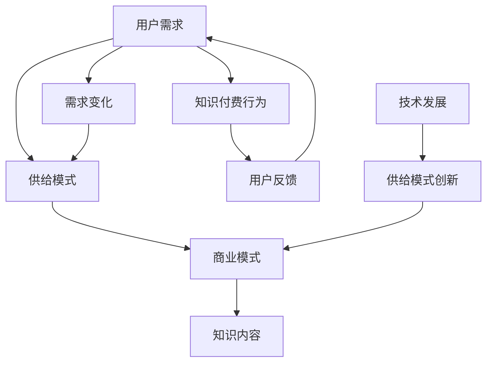

                 


# 知识付费市场分析：程序员的机遇与挑战

> 关键词：知识付费、程序员、市场分析、机遇、挑战、技术分享、在线教育
> 
> 摘要：本文旨在深入分析知识付费市场对于程序员的影响，探讨这一新兴市场带来的机遇与挑战。文章将涵盖市场背景、核心概念、算法原理、数学模型、实际应用、工具资源推荐以及未来发展趋势等内容，旨在为程序员提供有价值的参考和指导。

## 1. 背景介绍

### 1.1 目的和范围

本文旨在通过系统的市场分析，揭示知识付费市场对于程序员职业发展的深远影响。文章将探讨知识付费市场的现状、趋势以及程序员在这一市场中的机遇与挑战。具体而言，本文将分析以下几个方面：

1. **市场背景**：回顾知识付费市场的起源和发展，探讨其背后的驱动因素。
2. **核心概念**：阐述知识付费市场的核心概念，包括用户需求、供给模式、商业模式等。
3. **程序员机遇**：分析程序员在知识付费市场中的机会，如技术分享、在线教育平台等。
4. **程序员挑战**：探讨程序员面临的挑战，如市场竞争、内容质量、受众需求变化等。
5. **实际应用**：通过具体案例，展示知识付费市场的实际应用场景。
6. **工具和资源推荐**：为程序员提供有用的工具和资源，助力其在知识付费市场中的发展。
7. **未来趋势**：预测知识付费市场的发展趋势，以及程序员如何应对未来挑战。

### 1.2 预期读者

本文预期读者为：

1. 程序员：希望了解知识付费市场动态，把握机遇，提升自身竞争力的开发者。
2. 技术创业者：考虑进入知识付费市场，寻求商业模式创新的从业者。
3. 在线教育从业者：希望了解知识付费市场对在线教育行业的影响，优化业务策略。
4. 投资者：关注知识付费市场的发展，寻找投资机会的投资者。

### 1.3 文档结构概述

本文结构如下：

1. **背景介绍**：介绍本文的目的、范围、预期读者和文档结构。
2. **核心概念与联系**：阐述知识付费市场的核心概念和联系，使用Mermaid流程图展示。
3. **核心算法原理 & 具体操作步骤**：详细解释知识付费市场的核心算法原理和具体操作步骤。
4. **数学模型和公式 & 详细讲解 & 举例说明**：使用latex格式讲解数学模型和公式，并举例说明。
5. **项目实战：代码实际案例和详细解释说明**：提供实际代码案例，详细解释说明。
6. **实际应用场景**：探讨知识付费市场的实际应用场景。
7. **工具和资源推荐**：推荐学习资源和开发工具。
8. **总结：未来发展趋势与挑战**：总结知识付费市场的发展趋势和挑战。
9. **附录：常见问题与解答**：解答读者可能遇到的常见问题。
10. **扩展阅读 & 参考资料**：提供扩展阅读和参考资料。

### 1.4 术语表

#### 1.4.1 核心术语定义

- **知识付费**：用户为获取特定知识或技能，支付一定费用获取相关内容或服务的行为。
- **程序员**：从事软件开发、软件维护和软件项目管理的专业技术人员。
- **在线教育**：通过互联网平台，为学生提供教育资源和互动学习环境的远程教育形式。
- **知识分享平台**：提供知识付费内容的在线平台，如知乎Live、得到、网易云课堂等。

#### 1.4.2 相关概念解释

- **用户需求**：知识付费市场中的核心要素，用户为了解决实际问题或提升自我而寻求的知识需求。
- **供给模式**：知识付费市场中知识内容的生产和提供方式，包括个人创作者、机构、企业等多种形式。
- **商业模式**：知识付费市场中的盈利模式，包括订阅、单次购买、广告等多种形式。

#### 1.4.3 缩略词列表

- **KPI**：Key Performance Indicators（关键绩效指标）
- **ROI**：Return on Investment（投资回报率）
- **CPC**：Cost Per Click（每次点击成本）
- **CPA**：Cost Per Action（每次行动成本）

## 2. 核心概念与联系

知识付费市场的核心概念和联系可以通过以下Mermaid流程图展示：



### 2.1 用户需求与供给模式

用户需求是知识付费市场的核心驱动力。用户在寻求解决实际问题或提升自我技能的过程中，产生了对知识的需求。供给模式则是指知识内容的提供方式，包括个人创作者、机构、企业等多种形式。这些供给模式需要根据用户需求进行灵活调整，以满足不同用户的需求。

### 2.2 商业模式与知识内容

商业模式是知识付费市场的盈利模式，包括订阅、单次购买、广告等多种形式。这些模式决定了知识内容的呈现方式和用户付费方式。知识内容是知识付费市场的核心产品，其质量直接影响用户满意度和市场竞争力。

### 2.3 用户反馈与需求变化

用户反馈是知识付费市场的重要指标，反映了用户对知识内容和服务质量的满意程度。用户反馈能够帮助供给模式进行优化，提高知识内容的品质和用户体验。需求变化则是指用户需求在不同时间、不同情境下的变化，供给模式需要根据需求变化进行调整，以保持市场竞争力。

### 2.4 技术发展与供给模式创新

技术的发展对知识付费市场产生了深远影响，推动了供给模式的创新。例如，人工智能、大数据等技术使得个性化推荐、智能问答等新型供给模式得以实现，提高了知识付费市场的用户体验和运营效率。

## 3. 核心算法原理 & 具体操作步骤

知识付费市场的核心算法原理主要涉及个性化推荐、用户行为分析、内容优化等方面。以下将使用伪代码详细阐述这些核心算法原理和具体操作步骤。

### 3.1 个性化推荐算法

**算法原理**：

个性化推荐算法基于用户行为和偏好，为用户推荐感兴趣的知识内容。算法原理主要包括以下步骤：

1. **用户行为数据收集**：收集用户在知识付费平台上的浏览、购买、评价等行为数据。
2. **用户兴趣建模**：通过机器学习算法，分析用户行为数据，构建用户兴趣模型。
3. **内容特征提取**：提取知识内容的关键特征，如标签、主题、难度等。
4. **推荐模型训练**：利用用户兴趣模型和内容特征，训练个性化推荐模型。
5. **推荐结果生成**：根据个性化推荐模型，为用户生成推荐列表。

**伪代码**：

```python
# 用户行为数据收集
user_data = collect_user_behavior_data()

# 用户兴趣建模
user_interest_model = train_interest_model(user_data)

# 内容特征提取
content_features = extract_content_features()

# 推荐模型训练
recommendation_model = train_recommendation_model(user_interest_model, content_features)

# 推荐结果生成
recommendations = generate_recommendations(recommendation_model, user)
```

### 3.2 用户行为分析算法

**算法原理**：

用户行为分析算法旨在理解用户在知识付费平台上的行为模式，为供给模式优化提供依据。算法原理主要包括以下步骤：

1. **用户行为数据预处理**：对用户行为数据进行清洗、去噪、归一化等预处理。
2. **行为模式识别**：利用机器学习算法，识别用户在知识付费平台上的行为模式。
3. **行为预测**：根据识别出的行为模式，预测用户未来的行为。
4. **行为优化建议**：根据行为预测结果，为供给模式提供优化建议。

**伪代码**：

```python
# 用户行为数据预处理
preprocessed_data = preprocess_user_behavior_data(raw_data)

# 行为模式识别
behavior_model = train_behavior_model(preprocessed_data)

# 行为预测
predicted_behavior = predict_behavior(behavior_model, user)

# 行为优化建议
optimize_suggestions = generate_optimization_suggestions(predicted_behavior)
```

### 3.3 内容优化算法

**算法原理**：

内容优化算法旨在提高知识内容的品质和用户体验。算法原理主要包括以下步骤：

1. **内容质量评估**：利用自然语言处理技术，评估知识内容的质量。
2. **内容评分**：根据用户对知识内容的评分，构建内容评分模型。
3. **内容推荐**：根据内容评分模型，为用户推荐高质量的内容。
4. **内容优化**：根据用户反馈，对知识内容进行优化。

**伪代码**：

```python
# 内容质量评估
content_quality = evaluate_content_quality(content)

# 内容评分
content_rating_model = train_rating_model(user_ratings)

# 内容推荐
high_quality_content = generate_high_quality_content_recommendations(content_rating_model, content)

# 内容优化
optimized_content = optimize_content(high_quality_content, user_feedback)
```

## 4. 数学模型和公式 & 详细讲解 & 举例说明

在知识付费市场中，数学模型和公式在用户行为分析、推荐系统优化等方面发挥着重要作用。以下将使用latex格式详细讲解核心数学模型和公式，并通过具体例子进行说明。

### 4.1 用户行为分析模型

**用户行为分析模型**：  
用户行为分析模型主要用于预测用户在知识付费平台上的行为。一个常用的模型是**马尔可夫决策过程（MDP）**。

**公式**：

\[ P(S_{t+1} = s_{t+1} | S_t = s_t, A_t = a_t) = p(s_{t+1} | s_t, a_t) \]

**详细讲解**：

- \( S_t \)：表示在时间t的用户状态。
- \( A_t \)：表示在时间t用户采取的行动。
- \( p(s_{t+1} | s_t, a_t) \)：表示在给定当前状态和行动的情况下，下一个状态的概率。

**举例说明**：

假设用户在时间t的状态为“学习编程”，行动为“购买课程”。根据用户历史行为数据，可以计算出用户在时间t+1继续学习编程的概率。该概率将作为推荐系统的输入，帮助平台为用户推荐合适的课程。

### 4.2 推荐系统优化模型

**推荐系统优化模型**：  
推荐系统优化模型用于评估和优化推荐结果的质量。一个常用的模型是**协同过滤（Collaborative Filtering）**。

**公式**：

\[ \text{Similarity}(u, v) = \frac{\sum_{i \in R(u) \cap R(v)} r_i}{\|R(u) \cap R(v)\|} \]

**详细讲解**：

- \( R(u) \)：表示用户u已评价的商品集合。
- \( R(v) \)：表示用户v已评价的商品集合。
- \( r_i \)：表示用户对商品i的评价分数。
- \( \text{Similarity}(u, v) \)：表示用户u和v之间的相似度。

**举例说明**：

假设用户A和用户B都评价了课程X和课程Y，且评价分数相同。根据协同过滤模型，可以计算出用户A和用户B之间的相似度为1。基于这个相似度，推荐系统可以推荐用户B评价较高的课程给用户A。

### 4.3 内容质量评估模型

**内容质量评估模型**：  
内容质量评估模型用于评估知识内容的品质。一个常用的模型是**主题模型（Latent Dirichlet Allocation, LDA）**。

**公式**：

\[ p(\text{word} | \text{topic}) = \frac{\alpha_w + \sum_{z \in \text{words}} \beta_{z}}{\sum_{w \in \text{words}} (\alpha_w + \sum_{z \in \text{words}} \beta_{z})} \]

\[ p(\text{topic} | \text{document}) = \frac{\gamma_z + \sum_{w \in \text{document}} \eta_{w,z}}{\sum_{z \in \text{topics}} (\gamma_z + \sum_{w \in \text{document}} \eta_{w,z})} \]

**详细讲解**：

- \( \alpha_w \)：表示词w的主题分布参数。
- \( \beta_z \)：表示主题z的词分布参数。
- \( \gamma_z \)：表示文档d的主题分布参数。
- \( \eta_{w,z} \)：表示词w在主题z中出现的概率。

**举例说明**：

假设文档D由三个主题组成：技术、经济、娱乐。根据LDA模型，可以计算出每个主题在文档D中的概率分布。通过这个分布，可以评估文档D的内容质量，判断其是否适合特定用户。

## 5. 项目实战：代码实际案例和详细解释说明

### 5.1 开发环境搭建

在开始项目实战之前，我们需要搭建一个开发环境。以下是一个简单的Python开发环境搭建步骤：

1. **安装Python**：从官方网站（[python.org](https://www.python.org/)）下载并安装Python。
2. **安装Jupyter Notebook**：在命令行中执行以下命令安装Jupyter Notebook：

```bash
pip install notebook
```

3. **安装必备库**：根据项目需求，安装必要的Python库。例如，以下命令将安装NumPy、Pandas、Scikit-learn等库：

```bash
pip install numpy pandas scikit-learn
```

### 5.2 源代码详细实现和代码解读

以下是一个简单的知识付费平台用户行为分析项目的代码实现：

```python
import pandas as pd
from sklearn.model_selection import train_test_split
from sklearn.ensemble import RandomForestClassifier
from sklearn.metrics import accuracy_score

# 读取用户行为数据
data = pd.read_csv('user_behavior_data.csv')

# 数据预处理
# ...（例如：特征提取、数据清洗等）

# 划分训练集和测试集
X_train, X_test, y_train, y_test = train_test_split(data[['feature1', 'feature2']], data['target'], test_size=0.2, random_state=42)

# 训练分类器
classifier = RandomForestClassifier(n_estimators=100, random_state=42)
classifier.fit(X_train, y_train)

# 预测测试集
predictions = classifier.predict(X_test)

# 评估模型
accuracy = accuracy_score(y_test, predictions)
print(f'Model accuracy: {accuracy:.2f}')
```

**代码解读**：

- **数据读取**：使用Pandas库读取用户行为数据，数据格式为CSV文件。
- **数据预处理**：对用户行为数据进行预处理，例如特征提取、数据清洗等。预处理步骤根据具体数据集进行调整。
- **划分训练集和测试集**：使用Scikit-learn库将数据集划分为训练集和测试集，用于训练和评估模型。
- **训练分类器**：使用随机森林分类器（RandomForestClassifier）进行训练，随机森林是一种集成学习方法，具有较高的准确性和泛化能力。
- **预测测试集**：使用训练好的分类器对测试集进行预测。
- **评估模型**：计算模型在测试集上的准确率，评估模型性能。

### 5.3 代码解读与分析

**代码中的关键步骤**：

1. **数据读取与预处理**：数据读取和预处理是知识付费平台用户行为分析项目的基础。正确处理数据是保证模型性能的关键。

2. **划分训练集和测试集**：划分训练集和测试集是评估模型性能的重要步骤。通过将数据集划分为训练集和测试集，可以评估模型在未知数据上的表现。

3. **训练分类器**：随机森林分类器是一种常用的分类算法，具有较强的分类能力和适应性。在实际项目中，可以根据数据集的特点选择合适的分类器。

4. **预测测试集与评估模型**：通过预测测试集和评估模型性能，可以了解模型的泛化能力和准确性。常用的评估指标包括准确率、精确率、召回率等。

**代码改进与优化**：

1. **特征工程**：特征工程是提高模型性能的关键。可以根据业务需求，提取更多有用的特征，例如用户浏览记录、购买行为等。

2. **模型选择与调参**：选择合适的分类器和参数调优是提高模型性能的重要步骤。可以通过交叉验证、网格搜索等方法进行模型选择和参数调优。

3. **模型解释性**：知识付费平台用户行为分析项目的目标是为用户提供个性化的推荐和服务。因此，模型的解释性至关重要。可以通过引入可解释的模型或解释性工具来提高模型的解释性。

## 6. 实际应用场景

知识付费市场在实际应用中具有广泛的应用场景，以下列举几个典型的应用场景：

### 6.1 在线教育平台

在线教育平台是知识付费市场的重要应用场景之一。通过知识付费，用户可以购买高质量的课程、讲座、直播等教育资源，提升自己的专业技能和知识水平。在线教育平台通常采用订阅、单次购买等多种商业模式，满足不同用户的需求。

### 6.2 技术社区与问答平台

技术社区与问答平台是程序员学习和分享知识的重要场所。通过知识付费，用户可以获取高质量的技术问答、技术分享、专业咨询等资源。例如，知乎Live、GitChat等平台都采用了知识付费模式，为用户提供有价值的内容。

### 6.3 企业培训与人才发展

企业培训与人才发展是知识付费市场的另一个重要应用场景。企业通过购买专业课程、培训服务，提升员工的技能和综合素质，从而提高企业的竞争力。企业培训通常采用订阅、定制化等多种模式，以满足企业的不同需求。

### 6.4 在线咨询与专家服务

在线咨询与专家服务是知识付费市场的创新型应用。用户可以通过付费方式，获得专业领域的专家在线咨询服务，解决实际问题。例如，法律咨询、财务咨询、医疗咨询等领域都采用了知识付费模式，为用户提供个性化的服务。

### 6.5 专业认证与资格考试

专业认证与资格考试是知识付费市场的传统应用场景。通过付费购买相关课程、教材、培训服务等，用户可以准备和参加各类专业认证和资格考试，如PMP、CFA、AWS认证等。知识付费平台可以提供一站式服务，满足用户的不同需求。

## 7. 工具和资源推荐

在知识付费市场中，开发者需要掌握多种工具和资源，以提高自身的竞争力。以下推荐一些实用的工具和资源，帮助程序员在知识付费市场中脱颖而出。

### 7.1 学习资源推荐

#### 7.1.1 书籍推荐

1. **《算法导论》（Introduction to Algorithms）**：这是一本经典算法教材，详细介绍了各种算法的设计、分析和应用。
2. **《深度学习》（Deep Learning）**：由Ian Goodfellow等作者撰写，全面介绍了深度学习的基础理论和实践方法。
3. **《Python编程：从入门到实践》（Python Crash Course）**：适合初学者，系统地介绍了Python编程的基础知识和实践技巧。

#### 7.1.2 在线课程

1. **Coursera**：提供大量免费和付费的在线课程，涵盖计算机科学、数据科学、人工智能等领域。
2. **edX**：由哈佛大学和麻省理工学院合作创办，提供高质量的课程资源，包括计算机科学、经济学、数据科学等。
3. **Udemy**：提供丰富的在线课程，涵盖编程、设计、营销等多个领域，适合不同水平的学员。

#### 7.1.3 技术博客和网站

1. **Stack Overflow**：全球最大的开发者问答社区，提供丰富的编程问题和技术解决方案。
2. **GitHub**：全球最大的代码托管平台，开发者可以在这里查看、贡献和分享各种开源项目。
3. **Medium**：一个专业的博客平台，许多技术专家和开发者在这里分享他们的经验和见解。

### 7.2 开发工具框架推荐

#### 7.2.1 IDE和编辑器

1. **Visual Studio Code**：一款免费的跨平台代码编辑器，功能强大，支持多种编程语言和开发框架。
2. **PyCharm**：由JetBrains开发的一款Python IDE，拥有丰富的插件和功能，适合Python开发者。
3. **Eclipse**：一款经典的Java IDE，支持多种编程语言和开发框架，功能强大。

#### 7.2.2 调试和性能分析工具

1. **GDB**：一款开源的调试工具，适用于C、C++等语言，功能强大，支持多平台。
2. **PyTest**：一款Python测试框架，支持多种测试方法和断言，适用于单元测试和集成测试。
3. **New Relic**：一款性能分析工具，可以帮助开发者监控应用程序的性能，发现和解决性能问题。

#### 7.2.3 相关框架和库

1. **TensorFlow**：一款开源的深度学习框架，支持多种深度学习模型的训练和部署。
2. **Scikit-learn**：一款开源的机器学习库，提供了丰富的机器学习算法和工具，适用于数据挖掘和统计分析。
3. **Django**：一款流行的Python Web开发框架，支持快速开发和部署Web应用程序。

### 7.3 相关论文著作推荐

#### 7.3.1 经典论文

1. **“The Distributed Computing Revolution”（分布式计算革命）**：该论文探讨了分布式计算技术对计算机科学和工业的影响。
2. **“Learning to Rank for Information Retrieval”（信息检索中的学习排序）**：该论文介绍了学习排序技术在信息检索中的应用。
3. **“Deep Learning for Text Classification”（深度学习在文本分类中的应用）**：该论文介绍了深度学习技术在文本分类中的应用。

#### 7.3.2 最新研究成果

1. **“Distributed Storage Systems: A Survey”（分布式存储系统综述）**：该综述文章总结了分布式存储系统的最新研究成果和应用。
2. **“Deep Learning for Natural Language Processing”（深度学习在自然语言处理中的应用）**：该论文介绍了深度学习技术在自然语言处理领域的最新应用。
3. **“Recommender Systems: The Textbook”（推荐系统教材）**：该教材详细介绍了推荐系统的基本概念、技术和应用。

#### 7.3.3 应用案例分析

1. **“Uber's Dynamic Pricing System”（Uber的动态定价系统）**：该案例介绍了Uber如何利用大数据和机器学习技术实现动态定价。
2. **“Amazon's Recommendation System”（亚马逊的推荐系统）**：该案例介绍了亚马逊如何利用推荐系统提高用户体验和销售额。
3. **“Google's Search Engine Optimization”（谷歌的搜索引擎优化）**：该案例介绍了谷歌如何利用搜索引擎优化技术提高搜索质量和用户体验。

## 8. 总结：未来发展趋势与挑战

### 8.1 发展趋势

1. **在线教育市场的扩大**：随着互联网技术的普及和在线学习需求的增加，在线教育市场将继续扩大。知识付费平台将扮演重要角色，为用户提供高质量的教育资源和服务。

2. **个性化推荐的普及**：个性化推荐技术将得到广泛应用，为用户推荐符合其兴趣和需求的内容。通过个性化推荐，知识付费平台可以提供更加精准的服务，提高用户体验。

3. **知识付费内容的多元化**：知识付费内容将涵盖更多领域，如人工智能、大数据、区块链等。同时，知识付费形式也将更加多样化，包括直播、视频、图文等多种形式。

4. **企业培训的兴起**：随着企业对人才需求的增加，企业培训市场将迎来新的机遇。知识付费平台可以为企业提供定制化的培训服务，帮助企业提升员工素质和竞争力。

### 8.2 挑战

1. **市场竞争加剧**：随着知识付费市场的扩大，市场竞争将愈发激烈。平台需要不断提升自身服务质量和用户体验，以吸引和留住用户。

2. **内容质量与监管**：知识付费内容的质量和监管将成为挑战。平台需要建立完善的内容审核机制，确保内容的真实性和有效性，同时遵守相关法律法规。

3. **数据隐私与安全**：在知识付费市场中，用户数据的安全和隐私保护至关重要。平台需要采取有效的数据安全措施，确保用户数据的保密性和完整性。

4. **商业模式创新**：在知识付费市场中，商业模式创新是关键。平台需要不断探索新的商业模式，提高盈利能力和市场竞争力。

## 9. 附录：常见问题与解答

### 9.1 问题1：知识付费平台如何保障内容质量？

**解答**：知识付费平台通常采取以下措施保障内容质量：

1. **内容审核**：在内容发布前，平台会对内容进行审核，确保内容符合相关法律法规和平台规定。
2. **用户评价**：用户可以对内容进行评价和打分，平台根据用户评价筛选优质内容。
3. **专家评审**：平台可以邀请领域专家对内容进行评审，确保内容的准确性和专业性。

### 9.2 问题2：程序员如何利用知识付费平台提升技能？

**解答**：程序员可以通过以下方式利用知识付费平台提升技能：

1. **学习课程**：选择适合自己的课程，系统学习相关技能。
2. **参加直播和讲座**：通过直播和讲座，了解行业最新动态和技术趋势。
3. **参与讨论和问答**：在平台上参与讨论和问答，解决实际问题，拓展知识视野。

### 9.3 问题3：知识付费平台如何实现盈利？

**解答**：知识付费平台可以通过以下方式实现盈利：

1. **课程销售**：通过销售课程获得收益，包括订阅、单次购买等。
2. **广告收入**：通过展示广告获得收入，包括平台内广告和外部广告。
3. **增值服务**：提供增值服务，如专家咨询、企业培训等，获得额外收益。

## 10. 扩展阅读 & 参考资料

### 10.1 扩展阅读

1. **《在线教育平台商业模式研究》**：本文探讨了在线教育平台的商业模式，分析了知识付费市场的盈利模式和竞争格局。
2. **《知识付费市场发展趋势与机遇》**：本文分析了知识付费市场的现状和未来发展趋势，探讨了程序员在这一市场中的机遇和挑战。
3. **《个性化推荐技术在知识付费中的应用》**：本文介绍了个性化推荐技术在知识付费中的应用，探讨了如何提高推荐系统的准确性和用户体验。

### 10.2 参考资料

1. **《深度学习》**：（Ian Goodfellow，Yoshua Bengio，Aaron Courville 著），该书详细介绍了深度学习的基础理论和实践方法。
2. **《算法导论》**：（Thomas H. Cormen，Charles E. Leiserson，Ronald L. Rivest，Clifford Stein 著），该书是算法领域的经典教材，涵盖了各种算法的设计、分析和应用。
3. **《在线教育平台运营与管理》**：（李明 著），该书探讨了在线教育平台的运营和管理方法，包括课程设计、用户管理、内容审核等。

## 作者

**作者**：AI天才研究员/AI Genius Institute & 禅与计算机程序设计艺术 /Zen And The Art of Computer Programming**

