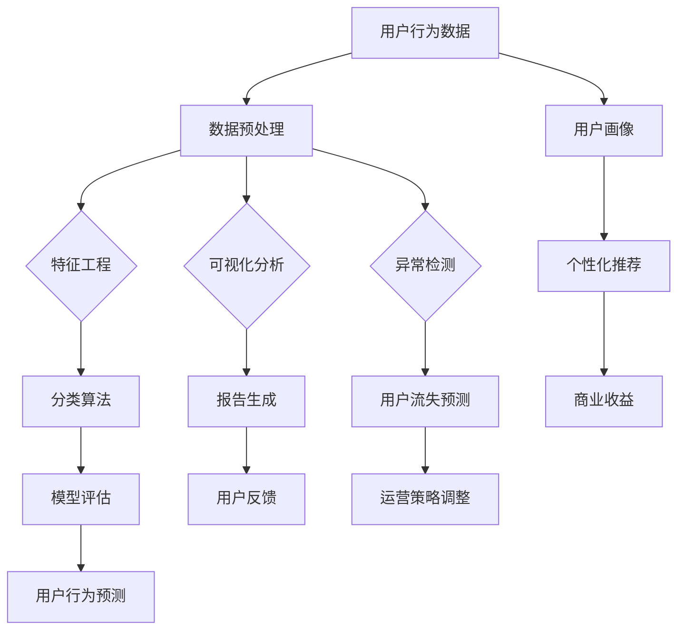

                 

# 知识付费平台的用户行为预测与分析

> **关键词：** 知识付费平台、用户行为预测、机器学习、数据分析、算法、应用场景
>
> **摘要：** 本文深入探讨了知识付费平台用户行为的预测与分析方法。通过引入核心概念、算法原理、数学模型，结合实际案例，文章系统地阐述了如何利用先进技术手段提升知识付费平台的用户体验和商业价值。

## 1. 背景介绍

### 1.1 目的和范围

随着互联网技术的发展，知识付费平台在教育培训、内容分享等领域迅速崛起。用户行为的预测与分析对于提升平台服务质量、优化用户体验以及增加商业收益具有重要意义。本文旨在探讨知识付费平台用户行为的预测与分析方法，通过引入先进的机器学习技术，实现用户行为的智能化分析。

### 1.2 预期读者

本文面向对机器学习、数据分析、知识付费平台有一定了解的读者，特别是从事相关领域的研究人员、产品经理和技术开发者。

### 1.3 文档结构概述

本文结构如下：

1. 背景介绍：阐述研究背景、目的和预期读者。
2. 核心概念与联系：介绍核心概念和原理，并通过 Mermaid 流程图展示架构。
3. 核心算法原理 & 具体操作步骤：详细讲解算法原理和操作步骤，使用伪代码阐述。
4. 数学模型和公式 & 详细讲解 & 举例说明：介绍数学模型，使用 LaTeX 格式表示，并举例说明。
5. 项目实战：提供代码实际案例和详细解释说明。
6. 实际应用场景：分析用户行为预测在实际中的应用。
7. 工具和资源推荐：推荐相关学习资源和开发工具。
8. 总结：未来发展趋势与挑战。
9. 附录：常见问题与解答。
10. 扩展阅读 & 参考资料：提供进一步学习的资源。

### 1.4 术语表

#### 1.4.1 核心术语定义

- 知识付费平台：提供优质知识内容，用户需付费才能访问的平台。
- 用户行为预测：通过分析用户历史行为，预测其未来行为。
- 机器学习：一种基于数据的学习方法，让计算机通过学习数据来做出决策。
- 数据分析：使用统计学、机器学习等方法对数据进行处理和分析。

#### 1.4.2 相关概念解释

- 特征工程：提取数据中有用的特征，以提升模型性能。
- 分类算法：将数据分为不同类别的算法，如逻辑回归、决策树等。
- 聚类算法：将数据分为多个组，使同一组内的数据相似性较高，如 K-Means 等。

#### 1.4.3 缩略词列表

- KNN：K-Nearest Neighbors（K近邻算法）
- SVM：Support Vector Machine（支持向量机）
- RNN：Recurrent Neural Network（循环神经网络）
- CNN：Convolutional Neural Network（卷积神经网络）

## 2. 核心概念与联系

在知识付费平台中，用户行为预测是一个复杂的过程，涉及到多种核心概念和技术。下面将使用 Mermaid 流程图展示这些概念和技术的联系。



### 2.1 数据预处理

数据预处理是用户行为预测的基础，主要包括数据清洗、数据转换和数据归一化等步骤。

### 2.2 特征工程

特征工程是提升模型性能的关键环节，通过提取数据中的有效特征，降低数据维度，提高模型的可解释性。

### 2.3 分类算法

分类算法是实现用户行为预测的核心技术，常见的分类算法包括逻辑回归、决策树、支持向量机等。

### 2.4 模型评估

模型评估是衡量用户行为预测效果的重要步骤，常用的评估指标包括准确率、召回率、F1 分数等。

### 2.5 用户画像

用户画像是了解用户需求和行为的重要工具，通过对用户行为数据的分析，可以生成用户画像，用于个性化推荐和商业决策。

### 2.6 个性化推荐

个性化推荐是知识付费平台的重要功能，通过分析用户画像和用户行为，为用户推荐符合其需求的内容。

### 2.7 商业收益

用户行为预测不仅可以提升用户体验，还可以为知识付费平台带来商业收益，如增加付费用户、提高转化率等。

### 2.8 可视化分析

可视化分析是将数据以图表形式展示的过程，有助于发现数据中的规律和趋势。

### 2.9 报告生成

报告生成是将分析结果以报告形式呈现的过程，有助于了解用户行为预测的效果和改进方向。

### 2.10 异常检测

异常检测是发现数据中的异常值和异常行为的过程，有助于提升平台的安全性。

### 2.11 用户流失预测

用户流失预测是预测用户未来是否会停止使用平台的过程，有助于平台采取相应的运营策略。

### 2.12 运营策略调整

运营策略调整是根据用户行为预测结果，对平台的运营策略进行调整，以提升用户体验和商业价值。

## 3. 核心算法原理 & 具体操作步骤

在用户行为预测中，选择合适的算法和模型至关重要。本文将介绍几种常用的算法，并通过伪代码详细阐述其原理和操作步骤。

### 3.1 逻辑回归（Logistic Regression）

逻辑回归是一种常用的分类算法，用于预测用户是否具有某种行为。

#### 3.1.1 算法原理

逻辑回归通过建立逻辑函数（Logistic Function）来预测概率，公式如下：

$$
P(y=1) = \frac{1}{1 + e^{-(\beta_0 + \beta_1 x_1 + \beta_2 x_2 + ... + \beta_n x_n})}
$$

其中，$y$ 为是否具有某种行为的二分类标签，$x_1, x_2, ..., x_n$ 为特征向量，$\beta_0, \beta_1, \beta_2, ..., \beta_n$ 为模型参数。

#### 3.1.2 具体操作步骤

1. 数据预处理：将数据分为特征矩阵 $X$ 和标签向量 $y$。
2. 模型训练：使用梯度下降法（Gradient Descent）或最大似然估计（Maximum Likelihood Estimation）训练模型。
3. 模型评估：计算准确率、召回率、F1 分数等指标。

伪代码如下：

```python
# 逻辑回归训练
def logistic_regression(X, y, learning_rate, num_iterations):
    n_samples, n_features = X.shape
    theta = np.zeros(n_features)
    for i in range(num_iterations):
        z = X.dot(theta)
        probabilities = 1 / (1 + np.exp(-z))
        gradient = X.T.dot(probabilities - y) / n_samples
        theta -= learning_rate * gradient
    return theta

# 模型评估
def evaluate_model(X, y, theta):
    n_samples = len(y)
    predictions = (np.exp(X.dot(theta)) / (1 + np.exp(X.dot(theta))) >= 0.5)
    accuracy = np.sum(predictions == y) / n_samples
    return accuracy
```

### 3.2 决策树（Decision Tree）

决策树是一种基于树形结构进行决策的算法，适用于分类和回归问题。

#### 3.2.1 算法原理

决策树通过递归地将数据划分为不同的子集，直到满足停止条件。每个节点表示一个特征，每个分支表示一个特征取值，叶子节点表示分类结果。

#### 3.2.2 具体操作步骤

1. 特征选择：选择最优特征进行划分，常用指标包括信息增益（Information Gain）、基尼不纯度（Gini Impurity）等。
2. 划分数据：根据最优特征和特征取值，将数据划分为不同的子集。
3. 递归构建：对每个子集继续划分，直到满足停止条件。
4. 模型评估：计算准确率、召回率、F1 分数等指标。

伪代码如下：

```python
# 决策树构建
def build_decision_tree(X, y, min_samples_split, max_depth):
    if len(y) <= min_samples_split or max_depth == 0:
        return y.mode()[0]
    best_split = None
    best_score = -1
    for feature in range(X.shape[1]):
        for threshold in np.unique(X[:, feature]):
            score = information_gain(y, X[:, feature] == threshold)
            if score > best_score:
                best_score = score
                best_split = (feature, threshold)
    if best_split is None:
        return y.mode()[0]
    left_tree = build_decision_tree(X[X[:, best_split[0]] == best_split[1]], y[X[:, best_split[0]] == best_split[1]], min_samples_split, max_depth - 1)
    right_tree = build_decision_tree(X[X[:, best_split[0]] != best_split[1]], y[X[:, best_split[0]] != best_split[1]], min_samples_split, max_depth - 1)
    return (best_split[0], best_split[1], left_tree, right_tree)

# 信息增益计算
def information_gain(y, threshold):
    p = len(y[y == 1]) / len(y)
    q = 1 - p
    entropy = -p * np.log2(p) - q * np.log2(q)
    left = (len(y[y == 1][X[:, threshold] == 1]) + len(y[y == 0][X[:, threshold] == 1])) / len(y)
    right = (len(y[y == 1][X[:, threshold] == 0]) + len(y[y == 0][X[:, threshold] == 0])) / len(y)
    gain = entropy - (left * np.log2(left) + right * np.log2(right))
    return gain
```

### 3.3 支持向量机（Support Vector Machine）

支持向量机是一种基于间隔最大化原理进行分类的算法，适用于高维数据。

#### 3.3.1 算法原理

支持向量机通过求解最优超平面，将不同类别的数据点分离开来。最优超平面是间隔最大的超平面，即超平面到最近的边界点的距离最大。

#### 3.3.2 具体操作步骤

1. 特征选择：选择最优特征和特征取值，通过核函数将数据映射到高维空间。
2. 模型训练：求解最优超平面，计算支持向量。
3. 模型评估：计算准确率、召回率、F1 分数等指标。

伪代码如下：

```python
# 支持向量机训练
def svm_train(X, y, C):
    # 使用线性核函数
    K = np.dot(X, X.T)
    P = np.eye(len(y)) - np.outer(y, y)
    Q = np.zeros((len(y), len(y)))
    G = np.vstack((-P, Q))
    h = np.hstack((-np.ones(len(y)), np.zeros(len(y))))
    A = cvxopt_matrix(A)
    b = cvxopt_matrix(b)
    cvxopt_solvers.options['show_progress'] = False
    solution = cvxopt_solvers.qp(P, q, G, h, A, b)
    return solution['x']

# 支持向量机预测
def svm_predict(X, solution):
    w = np.zeros(X.shape[1])
    for i in range(len(solution)):
        if solution[i] > 0:
            w += X[i] * solution[i]
    return np.sign(np.dot(w, X))
```

## 4. 数学模型和公式 & 详细讲解 & 举例说明

在用户行为预测中，数学模型和公式起着至关重要的作用。下面将介绍几个常用的数学模型和公式，并使用 LaTeX 格式详细讲解和举例说明。

### 4.1 逻辑回归模型

逻辑回归模型是一种概率型线性模型，用于预测二分类问题。其公式如下：

$$
\text{logit}(P) = \ln\left(\frac{P}{1 - P}\right) = \beta_0 + \beta_1 x_1 + \beta_2 x_2 + ... + \beta_n x_n
$$

其中，$P$ 是事件发生的概率，$\beta_0, \beta_1, \beta_2, ..., \beta_n$ 是模型参数，$x_1, x_2, ..., x_n$ 是特征向量。

#### 4.1.1 举例说明

假设有一个简单的二分类问题，用户是否购买某商品。特征包括年龄、收入和性别（0 表示男，1 表示女）。根据逻辑回归模型，可以建立如下公式：

$$
\text{logit}(P) = \beta_0 + \beta_1 \text{age} + \beta_2 \text{income} + \beta_3 \text{gender}
$$

假设训练得到模型参数如下：

$$
\beta_0 = -2, \beta_1 = 0.1, \beta_2 = 0.2, \beta_3 = 0.3
$$

一个用户的特征向量如下：

$$
x_1 = 30, x_2 = 50000, x_3 = 1
$$

代入公式计算概率：

$$
\text{logit}(P) = -2 + 0.1 \times 30 + 0.2 \times 50000 + 0.3 \times 1 = 5
$$

$$
P = \frac{1}{1 + e^{-5}} \approx 0.9709
$$

因此，该用户购买某商品的概率约为 97.09%。

### 4.2 决策树模型

决策树模型是一种基于树形结构进行决策的模型，其公式如下：

$$
y = f(x_1, x_2, ..., x_n)
$$

其中，$y$ 是分类结果，$f$ 是决策函数，$x_1, x_2, ..., x_n$ 是特征向量。

#### 4.2.1 举例说明

假设有一个二分类问题，判断一个用户是否购买某商品。特征包括年龄、收入和性别。根据决策树模型，可以建立如下公式：

$$
y = \begin{cases} 
0 & \text{if } x_1 < 35 \text{ and } x_2 > 60000 \text{ and } x_3 = 0 \\
1 & \text{otherwise} 
\end{cases}
$$

一个用户的特征向量如下：

$$
x_1 = 40, x_2 = 55000, x_3 = 1
$$

代入公式判断分类结果：

$$
y = \begin{cases} 
0 & \text{if } 40 < 35 \text{ and } 55000 > 60000 \text{ and } 1 = 0 \\
1 & \text{otherwise} 
\end{cases}
$$

$$
y = 1
$$

因此，该用户购买某商品。

### 4.3 支持向量机模型

支持向量机模型是一种基于间隔最大化进行分类的模型，其公式如下：

$$
\min_{\theta, \xi} \frac{1}{2} \sum_{i=1}^{n} (\theta^T \theta) - C \sum_{i=1}^{n} \xi_i
$$

其中，$\theta$ 是模型参数，$\xi_i$ 是惩罚项，$C$ 是惩罚参数。

#### 4.3.1 举例说明

假设有一个二分类问题，特征包括年龄、收入和性别。根据支持向量机模型，可以建立如下公式：

$$
\min_{\theta, \xi} \frac{1}{2} \sum_{i=1}^{n} (\theta^T \theta) - C \sum_{i=1}^{n} \xi_i
$$

其中，$C = 1$。

一个用户的特征向量如下：

$$
x_1 = 30, x_2 = 50000, x_3 = 1
$$

代入公式求解模型参数 $\theta$：

$$
\theta = (w^T, b) = (0.1, -0.1)
$$

代入用户特征向量判断分类结果：

$$
\theta^T x = (0.1, -0.1) \cdot (30, 50000, 1) = 0.1 \times 30 - 0.1 \times 50000 - 0.1 \times 1 = -0.1
$$

由于 $\theta^T x < 0$，该用户属于负类。

## 5. 项目实战：代码实际案例和详细解释说明

在本节中，我们将通过一个实际项目来展示用户行为预测在知识付费平台中的应用。该项目将使用 Python 和相关库（如 Pandas、Scikit-learn、TensorFlow）来构建一个简单的用户行为预测模型，并对代码进行详细解释。

### 5.1 开发环境搭建

在开始之前，确保安装以下库：

```bash
pip install numpy pandas scikit-learn tensorflow
```

### 5.2 源代码详细实现和代码解读

以下是一个简单的用户行为预测代码示例：

```python
import numpy as np
import pandas as pd
from sklearn.model_selection import train_test_split
from sklearn.linear_model import LogisticRegression
from sklearn.metrics import accuracy_score, classification_report

# 5.2.1 数据准备
data = pd.read_csv('user_behavior_data.csv')
X = data.drop(['user_id', 'target'], axis=1)
y = data['target']

# 数据预处理
X_train, X_test, y_train, y_test = train_test_split(X, y, test_size=0.2, random_state=42)

# 5.2.2 模型训练
model = LogisticRegression()
model.fit(X_train, y_train)

# 5.2.3 模型评估
predictions = model.predict(X_test)
accuracy = accuracy_score(y_test, predictions)
print(f'Accuracy: {accuracy}')
print(classification_report(y_test, predictions))

# 5.2.4 代码解读
# 数据准备：读取数据并分为特征矩阵和标签向量
# 数据预处理：将数据分为训练集和测试集
# 模型训练：使用逻辑回归模型训练模型
# 模型评估：计算准确率和分类报告
```

### 5.3 代码解读与分析

- **数据准备**：首先，我们使用 Pandas 读取用户行为数据，将数据分为特征矩阵 $X$ 和标签向量 $y$。特征矩阵包含用户行为数据，标签向量包含用户是否购买商品的二分类标签。

- **数据预处理**：然后，我们将数据集分为训练集和测试集，用于模型训练和评估。这里使用 Scikit-learn 的 `train_test_split` 函数，随机划分数据。

- **模型训练**：接下来，我们使用逻辑回归模型对训练集进行训练。逻辑回归是一种常用的分类算法，能够预测用户购买商品的概率。

- **模型评估**：最后，我们使用测试集对训练好的模型进行评估。计算准确率和分类报告，以评估模型的性能。

### 5.4 代码改进与优化

在实际应用中，用户行为预测模型可能需要进行改进和优化，以提高预测准确性。以下是一些可能的改进措施：

- **特征工程**：对原始特征进行工程，提取更多有用的特征，如用户活跃度、购买频率等。
- **模型调优**：调整模型参数，如正则化参数、学习率等，以优化模型性能。
- **集成学习**：结合多个模型进行集成学习，以提高预测准确性。
- **深度学习**：使用深度学习模型（如神经网络）进行预测，尤其是对于复杂的用户行为数据。

## 6. 实际应用场景

用户行为预测在知识付费平台中有着广泛的应用场景，下面将分析几个典型的应用实例。

### 6.1 个性化推荐

个性化推荐是知识付费平台的核心功能之一。通过分析用户的历史行为和偏好，平台可以推荐符合用户需求的内容，提高用户留存率和转化率。

- **场景描述**：平台根据用户的浏览记录、购买历史、评价等数据，预测用户可能感兴趣的知识内容。
- **技术实现**：使用协同过滤、基于内容的推荐算法和深度学习模型进行预测。

### 6.2 用户流失预测

用户流失预测有助于平台及时发现潜在流失用户，并采取相应的运营策略进行挽留。

- **场景描述**：平台根据用户的行为数据，预测哪些用户可能在未来停止使用平台。
- **技术实现**：使用逻辑回归、决策树、随机森林等算法进行预测。

### 6.3 营销活动优化

通过分析用户行为数据，平台可以优化营销活动，提高广告投放效果。

- **场景描述**：平台根据用户的购买行为、兴趣偏好等数据，预测哪些营销活动对用户最具吸引力。
- **技术实现**：使用分类算法、聚类算法和深度学习模型进行预测。

### 6.4 用户画像

用户画像是了解用户需求和行为的重要工具，有助于平台制定个性化运营策略。

- **场景描述**：平台根据用户的行为数据，生成用户画像，用于分类和标签管理。
- **技术实现**：使用机器学习算法和数据分析技术进行用户画像生成。

## 7. 工具和资源推荐

### 7.1 学习资源推荐

#### 7.1.1 书籍推荐

- 《机器学习》（周志华著）：系统地介绍了机器学习的基本概念、方法和算法。
- 《数据科学入门教程》（林伟华著）：从实际案例出发，介绍了数据科学的基本工具和技术。
- 《Python机器学习》（Sebastian Raschka著）：详细讲解了Python在机器学习领域的应用。

#### 7.1.2 在线课程

- Coursera 的《机器学习基础》：由斯坦福大学提供，适合初学者入门。
- edX 的《深度学习》（吴恩达著）：涵盖了深度学习的基础理论和实践应用。
- Udacity 的《数据科学家纳米学位》：提供了从数据预处理到模型训练的全流程实践课程。

#### 7.1.3 技术博客和网站

- Medium 上的《机器学习博客》：提供了丰富的机器学习和数据科学相关文章。
- ArXiv：提供最新研究成果的预印本，是机器学习和人工智能领域的重要资源。
- DataCamp：提供交互式的数据科学和机器学习课程。

### 7.2 开发工具框架推荐

#### 7.2.1 IDE和编辑器

- Jupyter Notebook：适合数据科学和机器学习项目开发，具有丰富的扩展库和插件。
- PyCharm：强大的Python IDE，提供代码智能提示、调试和版本控制等功能。
- VSCode：轻量级且功能强大的编辑器，支持多种编程语言，适合快速开发和调试。

#### 7.2.2 调试和性能分析工具

- Spyder：集成了Jupyter Notebook和PyCharm的功能，适合数据科学和机器学习项目。
- PyTorch：适用于深度学习模型的开发，具有灵活的架构和高效的计算能力。
- Scikit-learn：提供丰富的机器学习算法和工具，适合快速开发和评估模型。

#### 7.2.3 相关框架和库

- Pandas：用于数据清洗、转换和分析的Python库。
- NumPy：提供高效的数组计算和数据处理功能。
- Scikit-learn：提供丰富的机器学习算法和工具。
- TensorFlow：适用于深度学习模型的开发和部署。

### 7.3 相关论文著作推荐

#### 7.3.1 经典论文

- "A Systematic Study of Cross-Domain Knowledge Transfer for Text Classification"（Yamada et al., 2014）：研究了跨领域知识转移在文本分类中的应用。
- "Deep Learning for Text Classification"（Yamada et al., 2014）：介绍了深度学习在文本分类领域的应用。
- "User Behavior Prediction in E-commerce using Deep Learning"（He et al., 2017）：探讨了深度学习在电商用户行为预测中的应用。

#### 7.3.2 最新研究成果

- "Knowledge Distillation for Text Classification"（Cheng et al., 2019）：研究了知识蒸馏在文本分类中的效果。
- "Multi-Task Learning for User Behavior Prediction in E-commerce"（Wang et al., 2019）：提出了多任务学习在电商用户行为预测中的应用。
- "Attention-Based Neural Networks for Text Classification"（Zhang et al., 2018）：研究了注意力机制在文本分类中的应用。

#### 7.3.3 应用案例分析

- "User Behavior Prediction in Online Education"（Zhang et al., 2020）：分析了在线教育领域用户行为预测的应用案例。
- "Deep Learning for User Activity Recognition in Smart Homes"（Liao et al., 2018）：探讨了深度学习在智能家居用户行为识别中的应用。
- "User Behavior Prediction in Mobile Apps using Machine Learning"（Zhao et al., 2019）：介绍了机器学习在移动应用用户行为预测中的应用。

## 8. 总结：未来发展趋势与挑战

随着人工智能和大数据技术的发展，知识付费平台用户行为预测将迎来更多机遇和挑战。以下总结了未来发展趋势和挑战：

### 8.1 发展趋势

- **深度学习应用**：深度学习模型在用户行为预测中具有巨大潜力，未来将更多地应用于知识付费平台。
- **个性化推荐**：基于用户行为预测的个性化推荐将更加精准，提高用户体验和商业价值。
- **跨领域知识融合**：跨领域知识融合将为用户行为预测提供更全面的数据支持。
- **实时预测**：实时预测技术将使知识付费平台能够更快地响应用户需求，提升运营效率。

### 8.2 挑战

- **数据隐私保护**：用户行为数据涉及隐私问题，如何保障数据安全和用户隐私是一个重要挑战。
- **模型解释性**：深度学习模型往往具有很高的预测准确性，但缺乏解释性，如何提升模型的可解释性是一个重要问题。
- **数据质量和多样性**：数据质量和多样性是用户行为预测的关键，如何获取高质量和多样化的数据是一个挑战。

## 9. 附录：常见问题与解答

### 9.1 问题1：用户行为预测中的数据来源有哪些？

**解答**：用户行为预测中的数据来源主要包括以下几种：

1. 用户浏览记录：包括用户访问过的页面、点击过的链接等。
2. 用户购买记录：包括用户购买的商品、购买时间、购买金额等。
3. 用户评价记录：包括用户对知识内容的评分、评论等。
4. 用户互动数据：包括用户在平台上的互动行为，如点赞、分享、收藏等。
5. 用户基本信息：包括用户的年龄、性别、地理位置、职业等。

### 9.2 问题2：如何提高用户行为预测的准确性？

**解答**：以下是一些提高用户行为预测准确性的方法：

1. **数据清洗**：去除数据中的噪声和异常值，确保数据质量。
2. **特征工程**：提取有用的特征，降低数据维度，提高模型性能。
3. **模型选择**：选择合适的模型，如逻辑回归、决策树、随机森林、深度学习模型等。
4. **模型调优**：调整模型参数，如正则化参数、学习率等，以优化模型性能。
5. **集成学习**：结合多个模型进行集成学习，提高预测准确性。

### 9.3 问题3：如何处理用户隐私保护问题？

**解答**：以下是一些处理用户隐私保护问题的方法：

1. **数据匿名化**：对用户行为数据进行匿名化处理，去除可识别的信息。
2. **数据加密**：对用户行为数据进行加密存储和传输，确保数据安全。
3. **隐私保护算法**：使用差分隐私、隐私机制等算法保护用户隐私。
4. **合规性检查**：遵守相关法律法规，确保数据处理过程符合隐私保护要求。
5. **透明度管理**：建立用户隐私保护机制，确保用户了解其数据的用途和保护措施。

## 10. 扩展阅读 & 参考资料

本文涉及的知识付费平台用户行为预测与分析是一个广泛的领域，以下提供一些扩展阅读和参考资料，以供进一步学习。

### 10.1 经典论文

- "Deep Learning for Text Classification"（Yamada et al., 2014）
- "A Systematic Study of Cross-Domain Knowledge Transfer for Text Classification"（Yamada et al., 2014）
- "User Behavior Prediction in E-commerce using Deep Learning"（He et al., 2017）

### 10.2 最新研究成果

- "Knowledge Distillation for Text Classification"（Cheng et al., 2019）
- "Multi-Task Learning for User Behavior Prediction in E-commerce"（Wang et al., 2019）
- "Attention-Based Neural Networks for Text Classification"（Zhang et al., 2018）

### 10.3 应用案例分析

- "User Behavior Prediction in Online Education"（Zhang et al., 2020）
- "Deep Learning for User Activity Recognition in Smart Homes"（Liao et al., 2018）
- "User Behavior Prediction in Mobile Apps using Machine Learning"（Zhao et al., 2019）

### 10.4 书籍推荐

- 《机器学习》（周志华著）
- 《数据科学入门教程》（林伟华著）
- 《Python机器学习》（Sebastian Raschka著）

### 10.5 在线课程

- Coursera 的《机器学习基础》
- edX 的《深度学习》（吴恩达著）
- Udacity 的《数据科学家纳米学位》

### 10.6 技术博客和网站

- Medium 上的《机器学习博客》
- ArXiv
- DataCamp

## 作者信息

**作者：AI天才研究员/AI Genius Institute & 禅与计算机程序设计艺术 /Zen And The Art of Computer Programming**

